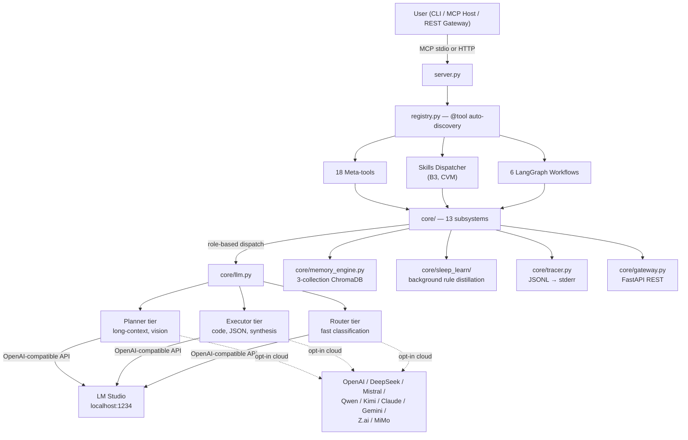

# 🤖 MCP Agent Stack

> **A fully autonomous local-first AI agent with 18 tools, 6 LangGraph workflows, a 3-tier LLM role system, and a self-improving memory — running on your hardware, with optional cloud LLM escalation.**

Built on **MCP** (Model Context Protocol), **LM Studio** (local LLM inference), **ChromaDB** (vector memory), **SearXNG** (self-hosted search), and **LangGraph** (state-machine orchestration). The default stack runs entirely on your machine — no API keys required. Cloud LLMs (OpenAI, DeepSeek, Mistral, Qwen, Kimi, Claude, Gemini, Z.ai, MiMo) are supported as opt-in escalation paths via the `consult` tool and `CONSULTOR_MODEL` role.

[](https://www.python.org/)
[](https://nodejs.org/)
[](https://modelcontextprotocol.io)
[](https://lmstudio.ai/)
[](https://langchain-ai.github.io/langgraph/)

> **Prerequisites:** [Python 3.11+](https://www.python.org/downloads/), [Node.js 18+](https://nodejs.org/), [Git](https://git-scm.com/downloads) on PATH, [LM Studio](https://lmstudio.ai/) with 3 role models loaded (Planner, Executor, Router).
>
> **Windows note:** PDF report generation requires the [GTK3 Runtime](https://github.com/tschoonj/GTK-for-Windows-Runtime-Environment-Installer/releases).
>
> [Jump to Quick Start](#-quick-start) · [Repo Structure](docs/STRUCTURE.md) · [AI Contributor Guide](#-ai-contributor-guide)

---

## 🌟 What Makes This Different

| Differentiator | What it means |
|----------------|---------------|
| **3-tier role system with fallback chains** | Not just Planner / Executor / Router — each role has sub-roles (`summarize`, `extract`, `research`, `critique`, `analyze`, `code`, `review`, `refactor`, `test`, `document`, `classify`, `route`, `vision`) with per-role model overrides and automatic fallback to the parent role. Tune models per task, not per agent. |
| **Self-improving memory** | Three ChromaDB collections (episodic / semantic / procedural) with a background **Sleep & Learn** daemon that distills rules from execution traces and injects them into future Planner prompts. The agent gets better at your workflows over time, autonomously. |
| **Atomic-action meta-tools** | 18 tools expose ~130 atomic actions via `@meta_tool` + `DISPATCH` registry. Adding an action = creating one file with `@register_action`. Zero wiring in `server.py` or `registry.py`. See [§ Tools](#-tools) below. |
| **Real TDD autocode** | The `autocode` workflow runs real `pytest` subprocesses, scopes changes to git branches, blocks edits to protected files, and rolls back on failure. 29-node LangGraph state machine with a debug loop + optional swarm fallback. |
| **Local-first, cloud-optional** | Default = LM Studio + SearXNG + ChromaDB, fully offline. Opt-in cloud escalation via `consult` tool and per-role provider routing (`PLANNER_MODEL=openai` works). 10 supported LLM providers. |
| **Tz-aware scheduling + offline recovery** | The `schedule` tool handles cron/interval/one-shot jobs with standard cron semantics (0=Sunday), iCal calendar sync, and **catch-up of missed fires while the server was offline** (misfire policies: skip / fire_last / fire_all). All time operations are tz-aware via `core/time_utils.py`. |
| **5-file documentation standard** | Every component has `INDEX / ARCHITECTURE / API / CHANGELOG / INSTRUCTIONS` docs. AI editors can read just `INSTRUCTIONS.md` to know what not to break. See [`docs/DOCUMENTATION_GUIDE.md`](docs/DOCUMENTATION_GUIDE.md). |

---

## 🚀 Quick Start

```powershell
# 1. Clone & venv
git clone https://github.com/brunogcar/agent agent
cd agent
python -m venv venv
.\venv\Scripts\Activate.ps1   # Windows | source venv/bin/activate on Linux/macOS

# 2. Install
python -m pip install --upgrade pip
pip install -r requirements.txt
playwright install             # required for browser tool

# 3. Configure
copy .env.example .env         # then edit model names + GATEWAY_SECRET
# Tip: check http://localhost:1234/v1/models for your exact LM Studio model IDs

# 4. Run
.\venv\Scripts\python.exe server.py
```

**Required `.env` changes:**
1. `PLANNER_MODEL`, `EXECUTOR_MODEL`, `ROUTER_MODEL` — match exact IDs from `http://localhost:1234/v1/models`.
2. `GATEWAY_SECRET=changeme` — must be changed or the REST API refuses to start in production.
3. `AGENT_ROOT`, `WORKSPACE_ROOT` — point to your actual local directories.

**Optional — Codebase Embeddings (semantic search):**
The `understand` workflow can index code for semantic search ("find the function that does X"). To enable it:
1. Download [All-MiniLM-L6-v2-Embedding-GGUF](https://huggingface.co/second-state/All-MiniLM-L6-v2-Embedding-GGUF) (q8, 25MB) in LM Studio
2. Load it under **Models → Embeddings**
3. Set `EMBEDDING_MODEL` in `.env` to match the model name LM Studio shows

If the embedding model isn't loaded, the workflow skips vector indexing gracefully — graph edges still work, just no semantic search. See [understand API docs](docs/workflows/understand/API.md) for details.

**Connect to an MCP host** (LM Studio, Claude Desktop, Cursor): copy [`mcp.json`](mcp.json) into your host's MCP settings and update the `command` to point at your `venv/Scripts/python.exe`. See [§ Configure MCP Servers](#-configure-mcp-servers) below for details.

---

## 🏛️ System Architecture



### 3-Tier Role System

The agent doesn't just use 3 models — it has a **3-tier role hierarchy** with per-role model overrides and automatic fallback. Configure any role to use a local LM Studio model or a cloud provider name (e.g., `RESEARCH_MODEL=openai`).

| Tier | Role | Purpose | Default Context | Timeout | Sub-roles (fallback to parent) |
|------|------|---------|-----------------|---------|-------------------------------|
| **Planner** | `planner` | Orchestration, memory summaries, vision, long-context reasoning | 160k | 90s | `vision` |
| **Executor** | `executor` | Code generation, strict JSON, data analysis, synthesis | 16k | 120s | `summarize`, `extract`, `research`, `critique`, `analyze`, `code`, `review`, `refactor`, `test`, `document` |
| **Router** | `router` | Ultra-fast task classification and tool selection | 4k | 15s | `classify`, `route` |
| **Consultor** *(opt-in)* | `consultor` | Cloud LLM advisory — escalation path when local models are insufficient | — | — | — |

Each sub-role can override its parent's model via `*_MODEL` env vars. Empty values fall back to the parent role. See [`docs/core/CONFIG.md`](docs/core/CONFIG.md) and [`docs/core/LLM.md`](docs/core/LLM.md) for the full routing matrix.

---

## 🔄 Workflows

Long-running, multi-step orchestration pipelines built on **LangGraph**. Triggered via `workflow(action="run", type="...", goal="...")` or the REST API. All workflows are at v1.0+.

| Workflow | Functionality |
|----------|---------------|
| [**Research**](docs/workflows/RESEARCH.md) | Quick info gathering: single search → parallel scrape → synthesis. SSRF protection, citation tracking. |
| [**Deep Research**](docs/workflows/DEEP_RESEARCH.md) | Iterative multi-faceted research with ReAct loop, convergence detection, and budget tracking. |
| [**Data**](docs/workflows/DATA.md) | Pandas/numpy analysis, calculations, dataset generation. Sandboxed `run_data` mode. |
| [**Autocode**](docs/workflows/AUTOCODE.md) | Autonomous TDD code generation with git scoping, surgical patching, debug loop, and optional swarm fallback. 29 nodes. |
| [**Understand**](docs/workflows/UNDERSTAND.md) | Build a deterministic codebase knowledge graph via AST parsing + doc indexing. Semantic search via embeddings. |
| [**Autoresearch**](docs/workflows/AUTORESEARCH.md) | Autonomous metric optimization (evolutionary loop) — proposes changes to a target file, keeps/discards based on a metric. |

All workflows emit structured traces to `logs/agent_*.jsonl` and follow the memory bookend pattern (recall at start, store at end). See [`docs/WORKFLOWS.md`](docs/WORKFLOWS.md) for the full comparison and return schema.

---

## 🛠️ Tools

18 meta-tools expose ~130 atomic actions. Auto-discovered via `@tool` + `@meta_tool` + `@register_action` — zero manual wiring. Each tool follows the [`*_ops/` subpackage pattern](docs/STRUCTURE.md#-tools-layer-tools).

| Tool | Functionality |
|------|---------------|
| [**web**](docs/tools/WEB.md) | SearXNG search, BeautifulSoup scraping, SSRF protection, parallel `search_and_read` |
| [**tavily**](docs/tools/TAVILY.md) | AI-ranked search, bulk URL extraction, keyless mode, API budget tracking |
| [**browser**](docs/tools/BROWSER.md) | Playwright automation (20 atomic actions), session isolation, screenshot-on-failure |
| [**python**](docs/tools/PYTHON.md) | Dual-mode execution: strict AST sandbox (`run`) or data-science subprocess (`run_data`) |
| [**file**](docs/tools/FILE.md) | 25+ atomic FS actions: CRUD, directory traversal, document parsing, SQLite FTS |
| [**git**](docs/tools/GIT.md) | 20+ atomic VCS actions: commit, diff, rollback, snapshot, branch/tag management |
| [**github**](docs/tools/GITHUB.md) | 16 actions: PR + issue + release workflow + push/pull (httpx direct, not PyGithub) |
| [**cli**](docs/tools/CLI.md) | 4-layer NL→shell dispatch: patterns → shell whitelist → router LLM → executor LLM |
| [**report**](docs/tools/REPORT.md) | 11 atomic actions: charts, maps, dashboards, diagrams, export to PDF/PNG |
| [**vision**](docs/tools/VISION.md) | Multimodal image analysis via `cfg.vision_model`, 3 input sources, JSON mode |
| [**memory**](docs/tools/MEMORY.md) | LLM-facing memory I/O: store, recall, delete, prune, summarize, janitor |
| [**agent**](docs/tools/AGENT.md) | 15 specialist sub-roles: classify, route, research, code, review, critique, plan, etc. |
| [**consult**](docs/tools/CONSULT.md) | Cloud LLM advisory (opt-in, kill-switch, rate-limit guard) — 3 actions |
| [**swarm**](docs/tools/SWARM.md) | Multi-model consensus across cloud providers — 5 actions (consensus/race/vote/compare/list_providers) |
| [**parallel**](docs/tools/PARALLEL.md) | Concurrent tool execution with `PARALLEL_SAFE` allowlist — 3 actions (run/race/pipeline) |
| [**notify**](docs/tools/NOTIFY.md) | Cross-platform desktop alerts + APScheduler reminders (tz-aware), graceful console fallback |
| [**schedule**](docs/tools/SCHEDULE.md) | Cron/interval/one-shot jobs + iCal sync, delivered via notify; offline missed-fire recovery |
| [**workflow**](docs/tools/WORKFLOW.md) | LangGraph workflow launcher with auto-routing and resume support |

See [`docs/TOOLS.md`](docs/TOOLS.md) for the full catalog, return schema, security rules, and testing commands.

---

## 🧠 Core Subsystems

The `core/` module is the foundation layer — 13 subsystems that do the thinking, remembering, and orchestration.

| Subsystem | Purpose |
|-----------|---------|
| [**Config**](docs/core/CONFIG.md) | Singleton `.env` loader, 9 builders, tiered model roles, path hierarchy, fail-fast validation |
| [**LLM**](docs/core/LLM.md) | Role-based dispatch, circuit breakers, 10 providers (LM Studio + 9 cloud), JSON parsing |
| [**Memory**](docs/core/MEMORY.md) | 3-collection ChromaDB, 4-layer dedup, decay scoring, two learning subsystems |
| [**Router**](docs/core/ROUTER.md) | 15s timeout classification, model + heuristic + swarm fallback, confidence guard |
| [**Gateway**](docs/core/GATEWAY.md) | FastAPI REST API, Bearer auth, rate limiting, SQLite task store |
| [**Runtime**](docs/core/RUNTIME.md) | Activity tracking, watchdog, health checks, cancellation guards, task runner |
| [**Sleep & Learn**](docs/core/SLEEP_LEARN.md) | Background daemon: trace observation → rule distillation → prompt injection |
| [**Knowledge Graph**](docs/core/KGRAPH.md) | AST-based codebase analysis, dependency graphs, test targeting, project isolation |
| [**Tracer**](docs/core/TRACER.md) | Structured JSONL logging, trace ID propagation, MCP stdio safety, bounded memory |
| [**Observability**](docs/core/OBSERVABILITY.md) | Tracer engine + reader + Prometheus metrics (graceful degradation) |
| [**NET**](docs/core/NET.md) | HTTP error classification, SSRF protection, retry/backoff, API budget tracking |
| [**Context Pruner**](docs/core/CONTEXT_PRUNER.md) | Cognitive context budgeting for LLM calls |
| [**Standalone**](docs/core/STANDALONE.md) | Shared utilities: `contracts.py`, `path_guard.py`, `time_utils.py`, `utils.py`, `citations.py`, `br_validator.py`, `json_extract.py` |

See [`docs/CORE.md`](docs/CORE.md) for the full architecture layers and module map. See [`docs/STRUCTURE.md`](docs/STRUCTURE.md) for the complete file/folder layout.

---

## 🧩 Skills & Domain Knowledge

Skills are domain-specific knowledge packages. They follow a **hub-and-spoke pattern**: a single `@tool`-decorated hub per domain routes to pure-Python subdomain modules. The `skills/dispatcher.py` module auto-discovers hubs at startup — **to add a new domain, just create `skills/<domain>/<domain>.py`**. No wiring in `server.py` or `registry.py`.

| Domain | Hub | Focus |
|--------|-----|-------|
| [**B3**](docs/SKILLS.md) | `skills/b3/b3.py` | Brasil, Bolsa, Balcão (Brazilian Stock Exchange) market data. `sync` mode downloads daily CSVs to a local data lake; `query` mode runs SQL/pandas against them. |
| [**CVM**](docs/SKILLS.md) | `skills/cvm/cvm.py` | Comissão de Valores Mobiliários (Brazilian SEC) regulatory data. Wraps the CVM open data portal: rate-limit handling, CSV extraction, cross-referencing DFP/ITR/FRE statements with market payouts. |

See [`docs/SKILLS.md`](docs/SKILLS.md) for the hub-and-spoke pattern, subdomain structure, and how to add new domains.

---

## 📊 Benchmark

The `benchmark/` package measures which local model is best for each role. Useful when swapping models in LM Studio — find the right fit per role instead of guessing.

```powershell
# Run all easy router tasks, 3 runs each, vs a pinned baseline
.\venv\Scripts\python -m benchmark --role router --depth easy --runs 3 --baseline baseline.json

# Compare two planner models across all difficulties
.\venv\Scripts\python -m benchmark --role planner --depth hard --compare model_a.json model_b.json
```

Features: 6 failure categories (timeout, llm_error, exception, empty_output, format_error, wrong_answer), variance tracking with wobble flag (σ > 20), baseline pinning with regression thresholds, and automatic best-model-per-role recommendation. See [`docs/BENCHMARK.md`](docs/BENCHMARK.md) for the full task catalog (36 executor + 30 router tasks) and v1.2 changelog.

---

## 📈 Project Status

The agent is actively developed. **All tools, workflows, and core subsystems are at v1.0+** — the pre-v1 refactoring is complete. Individual components are versioned independently (see each component's `CHANGELOG.md`).

**v1.0+ (stable):**
- **18 tools** — all refactored to the `@meta_tool` + `*_ops/` subpackage pattern (latest: `schedule` v1.0, `notify` v1.1)
- **6 workflows** — all LangGraph-based with `*_impl/` subpackages (latest: `autocode` v3.1, `autoresearch` v1.2.2)
- **13 core subsystems** — all with thin-facade + `*_backend/` pattern (latest: `config` v1.0, `router` v1.0, `observability` reorg)
- **`core/time_utils.py`** — shared tz-aware time module (replaces the external `@mcpcentral/mcp-time` MCP dependency)

**Recent highlights:**
- `schedule` tool (v1.0) — cron/interval/one-shot + iCal sync + offline missed-fire recovery
- `notify` v1.1 — swapped to `core/time_utils` (tz-aware), DOW fix (0=Sunday), store moved to `agent_root/`
- `swarm` tool (v1.0) — multi-model consensus across 9 cloud providers
- `github` tool (v1.0) — 16 PR/issue/release actions

---

## 📚 Documentation

Every component follows the **5-file documentation standard**: `INDEX` (overview) · `ARCHITECTURE` (file map + design decisions) · `API` (contract) · `CHANGELOG` (history + roadmap) · `INSTRUCTIONS` (AI editing rules). See [`docs/DOCUMENTATION_GUIDE.md`](docs/DOCUMENTATION_GUIDE.md) for the full standard.

### Top-Level Indexes

| Doc | Covers |
|-----|--------|
| [`docs/STRUCTURE.md`](docs/STRUCTURE.md) | **Repo layout reference** — where everything lives, naming conventions, patterns |
| [`docs/TOOLS.md`](docs/TOOLS.md) | All 18 tools — status, safety rules, comparison |
| [`docs/WORKFLOWS.md`](docs/WORKFLOWS.md) | All 6 workflows — status, comparison, return schema |
| [`docs/CORE.md`](docs/CORE.md) | All 13 core subsystems — architecture layers, module map |
| [`docs/SKILLS.md`](docs/SKILLS.md) | Skills hub-and-spoke pattern, B3 + CVM domains |
| [`docs/BENCHMARK.md`](docs/BENCHMARK.md) | Role benchmarking tool, task catalog |
| [`docs/SESSION_WORKFLOW.md`](docs/SESSION_WORKFLOW.md) | AI-assisted dev session workflow (how to work on this repo) |
| [`docs/DOCUMENTATION_GUIDE.md`](docs/DOCUMENTATION_GUIDE.md) | The 5-file standard itself |

### Per-Component Deep Dives

Each tool, core subsystem, and workflow has its own folder under `docs/<area>/<component>/` containing `ARCHITECTURE.md`, `API.md`, `CHANGELOG.md`, and `INSTRUCTIONS.md`. Start from the indexes above to navigate.

### System Prompts

[`docs/system_prompts/`](docs/system_prompts/) defines the exact output schemas and guardrails each role expects. **Read these before modifying workflow logic** — they are the contract between the LLM and the agent's tooling.

---

## 🤖 AI Contributor Guide

**ATTENTION AI ASSISTANTS**: Read this section before writing code in this repo.

### Where to look first

1. [`docs/STRUCTURE.md`](docs/STRUCTURE.md) — where things live (the repo map)
2. [`docs/SESSION_WORKFLOW.md`](docs/SESSION_WORKFLOW.md) — the 5-step change workflow (investigate → propose → build zip → commands → git)
3. The relevant component's `INSTRUCTIONS.md` (e.g., `docs/tools/cli/INSTRUCTIONS.md`) — tells you what NOT to break
4. The component's `ARCHITECTURE.md` — tells you where things live
5. [`docs/DOCUMENTATION_GUIDE.md`](docs/DOCUMENTATION_GUIDE.md) — tells you how docs are structured

### The 5-step session workflow

Every change follows this workflow (see [`docs/SESSION_WORKFLOW.md`](docs/SESSION_WORKFLOW.md) for the full guide):

1. **Investigate first** — read the actual code + docs before proposing anything. Verify claims against source (docs drift).
2. **Propose a plan** — list files to change, describe changes + design decisions, identify findings by priority (P0/P1/P2/P3). **Wait for greenlight.**
3. **Build a zip** — repo-relative paths, no wrapper folder. Deliver to `/home/z/my-project/zips/<feature>-v<ver>.zip`.
4. **Give PowerShell commands** — extract + copy + compile-check (emoji ✅/❌ format) + component tests + full suite.
5. **Give git commands** — `git add` + commit message (via `commit -F commitmsg.txt`) + `git push`, in a single block.

**Hard rules:**
- Never change code without greenlight — propose first, wait for approval
- Never write `.bak` files — forbidden by project rules
- Never rewrite entire files when editing — surgical edits only
- Never use bare `pytest` — always `python.exe -m pytest`
- Never omit `-W error` from pytest commands
- Never put git commands in the extract/copy block — keep them separate
- Always investigate before proposing — read the actual code, don't guess
- Always provide compile-check + test commands
- Always update `CHANGELOG.md` for any version change

### Agent self-preservation (hard rules for autonomous operation)

These prevent the local agent from breaking its own runtime. AI assistants helping the developer **may** suggest changes to protected files when explicitly asked.

- **MCP stdio safety**: NEVER write to `stdout` in `server.py`, `tools/`, or `workflows/`. All logging goes to `stderr` via `core/tracer.py`. A single `print()` corrupts the JSON-RPC protocol channel.
- **Protected files**: The `autocode` workflow is forbidden from editing `server.py`, `registry.py`, `core/config.py`, `core/tracer.py`, `core/llm.py`, `core/memory_engine.py`, and `core/gateway.py`.
- **Role abstraction**: Never hardcode model names (e.g., "qwen", "hermes") in prompts or logic. Always use the `planner`, `executor`, `router` abstractions from `cfg`.
- **No `.bak` files**: Use atomic writes (`tempfile.NamedTemporaryFile` + `os.replace`). Creating `.bak` files is forbidden by project rules.

### Best practices for AI assistants

- **Preserve style & comments**: Do not "clean up", reformat, or rewrite existing docstrings, comments, or spacing unless asked. Match the existing style (`from __future__ import annotations` everywhere).
- **Surgical edits only**: Provide exact find→replace blocks. Do not output entire files unless requested.
- **Respect LangGraph immutability**: Workflow nodes return partial state updates (`return {"key": value}`). NEVER mutate the shared `state` dict in-place.
- **No hallucinated APIs**: If you need to know how an internal module works, read the file. Do not guess function signatures of `core/` modules.
- **Tool creation pattern**: Create a file in `tools/`, import `from registry import tool`, use the `@tool` decorator (and `@meta_tool` + `DISPATCH` for atomic-action tools). The docstring becomes the LLM prompt. Always return `{"status": "success/error", ...}`. See [`docs/TOOLS.md` § New Tool Checklist](docs/TOOLS.md#-new-tool-checklist).
- **Memory safety**: Respect Tag Validation (MED-05) and the Write-Only Lock pattern (MED-01) in `core/memory_backend/`. Never write directly to the `procedural_meta` ChromaDB collection — the Sleep & Learn daemon owns it.
- **Testing**: `.\venv\Scripts\python tests/<area>/<component>/ -W error --tb=short -v`

---

## 💤 Sleep & Learn (Meta-Learning Daemon)

A unique differentiator: an autonomous background daemon (`core/sleep_learn/`) observes execution traces, distills procedural rules from successes and failures, and injects the highest-utility rules into the Planner's context for future tasks. The agent genuinely learns from its own experience — no manual tuning required.

**Rules for AI assistants interacting with this system:**

1. **Respect the injection**: If you see `--- RELEVANT LEARNED RULES ---` in a system prompt, apply those rules. They were autonomously learned from past outcomes.
2. **Never manually mutate learned rules**: Don't write to the `procedural_meta` collection. The daemon's feedback loop boosts/penalizes rules based on trace outcomes.
3. **Use the janitor for bloat**: If memory retrieval feels slow, run `memory(action="janitor")` to archive old episodes and purge stale rules.
4. **No LLM bypassing**: Background learning tasks MUST use the public `llm.complete()` API. Never import provider clients directly — you'll bypass the daemon's token budgets and rate limiters.

See [`docs/core/SLEEP_LEARN.md`](docs/core/SLEEP_LEARN.md) for the full architecture.

---

## 📂 Repo Hierarchy

The full file/folder layout is documented in [`docs/STRUCTURE.md`](docs/STRUCTURE.md). Below is a condensed view — see STRUCTURE.md for the complete map, naming conventions, and pattern details.

```text
agent/
├── server.py              # MCP stdio entry point (DO NOT BREAK STDOUT)
├── registry.py            # @tool auto-discovery engine
├── mcp.json               # MCP server configuration
├── requirements.txt · pytest.ini
│
├── core/                  # 13 subsystems (facade + *_backend/ pattern)
│   ├── config.py → config_backend/     # 9-builder config system
│   ├── llm.py → llm_backend/           # 10 providers, role dispatch
│   ├── memory_engine.py → memory_backend/  # 3-collection ChromaDB
│   ├── router.py → router_backend/     # 15s classification + fallbacks
│   ├── gateway.py → gateway_backend/   # FastAPI REST API
│   ├── runtime/ · sleep_learn/ · kgraph/  # Direct subpackages
│   ├── observability/                  # tracer_engine + reader + metrics
│   ├── net/                            # SSRF, retry, budget
│   ├── context_pruner.py · tracer.py
│   └── contracts.py · path_guard.py · time_utils.py · utils.py · ...  # Standalone
│
├── tools/                 # 18 meta-tools (facade + *_ops/ pattern)
│   ├── _meta_tool.py      # @meta_tool decorator
│   ├── agent.py + agent_ops/     · browser.py + browser_ops/
│   ├── cli.py + cli_ops/         · consult.py + consult_ops/
│   ├── file.py + file_ops/       · git.py + git_ops/
│   ├── github.py + github_ops/   · memory.py + memory_ops/
│   ├── notify.py + notify_ops/   · parallel.py + parallel_ops/
│   ├── python.py + python_ops/   · report.py + report_ops/
│   ├── schedule.py + schedule_ops/  · swarm.py + swarm_ops/
│   ├── tavily.py + tavily_ops/   · vision.py + vision_ops/
│   ├── web.py + web_ops/         · workflow.py + workflow_ops/
│
├── workflows/             # 6 LangGraph state machines (facade + *_impl/ pattern)
│   ├── base.py · helpers/
│   ├── research.py → research_impl/         (8 nodes)
│   ├── deep_research.py → deep_research_impl/  (13 nodes)
│   ├── data.py → data_impl/                 (5 nodes)
│   ├── autocode.py → autocode_impl/         (29 nodes)
│   ├── understand.py → understand_impl/     (4 nodes)
│   └── autoresearch.py → autoresearch_impl/ (8 nodes)
│
├── skills/                # Domain knowledge (hub-and-spoke)
│   ├── dispatcher.py      # Auto-discovers domain hubs
│   ├── b3/                # Brazilian Stock Exchange
│   └── cvm/               # Brazilian SEC regulatory data
│
├── benchmark/             # Role benchmarking tool
├── docs/                  # 5-file documentation standard per component
└── tests/                 # Pytest suites mirror source structure
```

See [`docs/STRUCTURE.md`](docs/STRUCTURE.md) for: the v1.0 `*_ops/` pattern, the `*_impl/` workflow pattern, the `*_backend/` core pattern, standalone modules, naming conventions, and configuration files.

---

## 🔧 Troubleshooting

| Issue | Solution |
|-------|----------|
| LM Studio unreachable | Check `http://localhost:1234/v1/models`. Ensure CORS is enabled in LM Studio. |
| ChromaDB binary hang | Run `pip install chromadb --no-binary chromadb`. |
| Kaleido PNG crash | Ensure `kaleido==0.2.1` is installed. |
| Tool not discovered | Check for `@tool` decorator, ensure file is in `tools/` or `skills/`, restart server. |
| Autocode syntax errors | Set `AUTOCODE_DEBUG=1` in `.env` and check `logs/agent_*.jsonl`. |
| "No module named 'X'" | Activate venv, run `pip install -r requirements.txt`, verify with `where python`. |
| MCP stdio corruption | Check for `print()` statements in tools/workflows. All logging must go to `stderr`. |
| Git operations failing | Ensure `git` is on PATH. We use `subprocess` directly, not GitPython. |
| PDF export failing | Install GTK3 Runtime on Windows. HTML reports work without it. |
| Memory slow | Run `memory(action="janitor")` to archive old episodes and purge stale rules. |
| Router timeout | Check `ROUTER_MODEL` is loaded in LM Studio. Fallback heuristics will still work. |
| Gateway 403 errors | Change `GATEWAY_SECRET` from default `changeme` in `.env`. |
| Cron fires wrong day | Use `schedule` or `notify(recurring)` — both use `_build_cron_trigger` (0=Sunday). Don't use `CronTrigger.from_crontab` directly (0=Monday trap). |

---

## 🔗 Configure MCP Servers

To connect the agent to an MCP host (LM Studio, Claude Desktop, Cursor), add the server configuration to your host's MCP settings file (e.g., `mcp.json` or `claude_desktop_config.json`). See [`mcp.json`](mcp.json) in the repository root for the exact JSON structure.

**Key setup rules:**
- **`agent` server**: The `command` **must** point to the `python.exe` inside your `venv` folder (e.g., `D:/mcp/agent/venv/Scripts/python.exe`). Global Python won't find your installed dependencies.
- **Paths**: Update all directory paths in the JSON to match where you cloned this repository.

> **Note:** The agent no longer depends on the external `@mcpcentral/mcp-time` MCP server for time/timezone functionality. Time operations are handled natively by [`core/time_utils.py`](docs/core/STANDALONE.md) (tz-aware, reads `AGENT_TZ` env var). You can remove the `time` entry from your `mcp.json` if you had it.

---

*Architecture: 3-tier role system → 18 tools → 6 workflows → 3-collection memory → structured tracing → background learning → tz-aware scheduling. Local-first, cloud-optional, fully open-source.*

---

*Last updated: 2026-07-16. All tools/workflows/subsystems at v1.0+. See [STRUCTURE.md](docs/STRUCTURE.md) for the repo layout, [SESSION_WORKFLOW.md](docs/SESSION_WORKFLOW.md) for the dev workflow, and each component's `CHANGELOG.md` for version history.*
