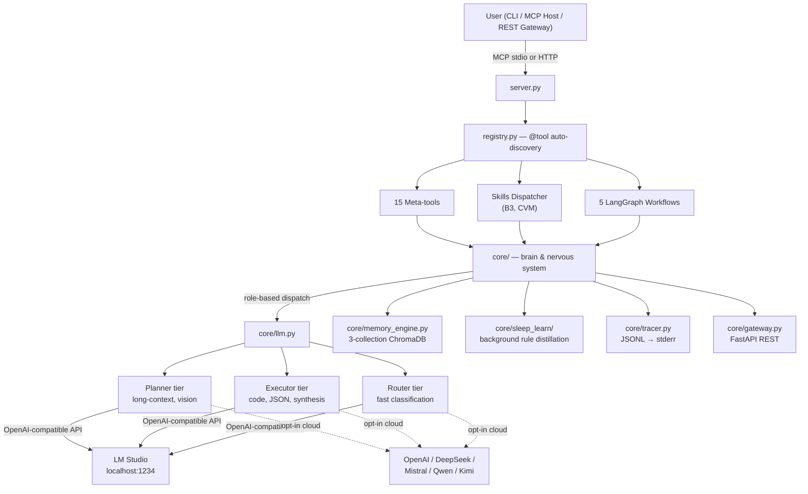

# 🤖 MCP Agent Stack

> **A fully autonomous local-first AI agent with 15 tools, 5 LangGraph workflows, a 3-tier LLM role system, and a self-improving memory — running on your hardware, with optional cloud LLM escalation.**

Built on **MCP** (Model Context Protocol), **LM Studio** (local LLM inference), **ChromaDB** (vector memory), **SearXNG** (self-hosted search), and **LangGraph** (state-machine orchestration). The default stack runs entirely on your machine — no API keys required. Cloud LLMs (OpenAI, DeepSeek, Mistral, Qwen, Kimi) are supported as opt-in escalation paths via the `consult` tool and `CONSULTOR_MODEL` role.

[](https://www.python.org/)
[](https://nodejs.org/)
[](https://modelcontextprotocol.io)
[](https://lmstudio.ai/)
[](https://langchain-ai.github.io/langgraph/)

> **Prerequisites:** [Python 3.11+](https://www.python.org/downloads/), [Node.js 18+](https://nodejs.org/), [Git](https://git-scm.com/downloads) on PATH, [LM Studio](https://lmstudio.ai/) with 3 role models loaded (Planner, Executor, Router).
>
> **Windows note:** PDF report generation requires the [GTK3 Runtime](https://github.com/tschoonj/GTK-for-Windows-Runtime-Environment-Installer/releases).
>
> [Jump to Quick Start](#-quick-start)

---

## 🌟 What Makes This Different

| Differentiator | What it means |
|----------------|---------------|
| **3-tier role system with fallback chains** | Not just Planner / Executor / Router — each role has sub-roles (`summarize`, `extract`, `research`, `critique`, `analyze`, `code`, `review`, `refactor`, `test`, `document`, `classify`, `route`, `vision`) with per-role model overrides and automatic fallback to the parent role. Tune models per task, not per agent. |
| **Self-improving memory** | Three ChromaDB collections (episodic / semantic / procedural) with a background **Sleep & Learn** daemon that distills rules from execution traces and injects them into future Planner prompts. The agent gets better at your workflows over time, autonomously. |
| **Atomic-action meta-tools** | 15 tools expose ~120 atomic actions via `@meta_tool` + `DISPATCH` registry. Adding an action = creating one file with `@register_action`. Zero wiring in `server.py` or `registry.py`. |
| **Real TDD autocode** | The `autocode` workflow runs real `pytest` subprocesses, scopes changes to git branches, blocks edits to protected files, and rolls back on failure. 17-node LangGraph state machine. |
| **Local-first, cloud-optional** | Default = LM Studio + SearXNG + ChromaDB, fully offline. Opt-in cloud escalation via `consult` tool and per-role provider routing (`PLANNER_MODEL=openai` works). |
| **5-file documentation standard** | Every component has `INDEX / ARCHITECTURE / API / CHANGELOG / INSTRUCTIONS` docs. AI editors can read just `INSTRUCTIONS.md` to know what not to break. See [`docs/DOCUMENTATION_GUIDE.md`](docs/DOCUMENTATION_GUIDE.md). |

---

## 🚀 Quick Start

```powershell
# 1. Clone & venv
git clone https://github.com/brunogcar/agent agent
cd agent
python -m venv venv
.\venv\Scripts\Activate.ps1   # Windows | source venv/bin/activate on Linux/macOS

# 2. Install
python -m pip install --upgrade pip
pip install -r requirements.txt
playwright install             # required for browser tool

# 3. Configure
copy .env.example .env         # then edit model names + GATEWAY_SECRET
# Tip: check http://localhost:1234/v1/models for your exact LM Studio model IDs

# 4. Run
.\venv\Scripts\python.exe server.py
```

**Required `.env` changes:**
1. `PLANNER_MODEL`, `EXECUTOR_MODEL`, `ROUTER_MODEL` — match exact IDs from `http://localhost:1234/v1/models`.
2. `GATEWAY_SECRET=changeme` — must be changed or the REST API refuses to start in production.
3. `AGENT_ROOT`, `WORKSPACE_ROOT` — point to your actual local directories.

**Connect to an MCP host** (LM Studio, Claude Desktop, Cursor): copy [`mcp.json`](mcp.json) into your host's MCP settings and update the `command` to point at your `venv/Scripts/python.exe`. See [§ MCP Configuration](#-configure-mcp-servers) below for details.

---

## 🏛️ System Architecture



### 3-Tier Role System

The agent doesn't just use 3 models — it has a **3-tier role hierarchy** with per-role model overrides and automatic fallback. Configure any role to use a local LM Studio model or a cloud provider name (e.g., `RESEARCH_MODEL=openai`).

| Tier | Role | Purpose | Default Context | Timeout | Sub-roles (fallback to parent) |
|------|------|---------|-----------------|---------|-------------------------------|
| **Planner** | `planner` | Orchestration, memory summaries, vision, long-context reasoning | 160k | 90s | `vision` |
| **Executor** | `executor` | Code generation, strict JSON, data analysis, synthesis | 16k | 120s | `summarize`, `extract`, `research`, `critique`, `analyze`, `code`, `review`, `refactor`, `test`, `document` |
| **Router** | `router` | Ultra-fast task classification and tool selection | 4k | 15s | `classify`, `route` |
| **Consultor** *(opt-in)* | `consultor` | Cloud LLM advisory — escalation path when local models are insufficient | — | — | — |

Each sub-role can override its parent's model via `*_MODEL` env vars. Empty values fall back to the parent role. See [`docs/core/CONFIG.md`](docs/core/CONFIG.md) and [`docs/core/LLM.md`](docs/core/LLM.md) for the full routing matrix.

---

## 🔄 Workflows

Long-running, multi-step orchestration pipelines built on **LangGraph**. Triggered via `workflow(type="...", goal="...")` or the REST API.

| Workflow | Status | Use Case | Key Safety |
|----------|--------|----------|------------|
| [**Research**](docs/workflows/RESEARCH.md) | Pre-v1.0 | Quick info gathering: single search → parallel scrape → synthesis | SSRF protection, citation tracking, source validation |
| [**Deep Research**](docs/workflows/DEEP_RESEARCH.md) | v1.0 | Iterative multi-faceted research with ReAct loop and convergence detection | Budget tracking, URL dedup, nested-call guard |
| [**Data**](docs/workflows/DATA.md) | v1.0 | Pandas/numpy analysis, calculations, dataset generation | Sandboxed `run_data` mode, best-effort critique |
| [**Autocode**](docs/workflows/AUTOCODE.md) | v1.0 | Autonomous code generation with TDD, git scoping, surgical patching | Protected files, git snapshot/rollback, AST validation |
| [**Understand**](docs/workflows/UNDERSTAND.md) | Pre-v1.0 | Build deterministic Codebase Knowledge Graph via AST parsing | Size limits, project isolation, incremental indexing |

All workflows emit structured traces to `logs/agent_*.jsonl` and follow the memory bookend pattern (recall at start, store at end). See [`docs/WORKFLOWS.md`](docs/WORKFLOWS.md) for the full comparison, return schema, and known bugs.

---

## 🛠️ Tools

15 meta-tools expose ~120 atomic actions. Auto-discovered via `@tool` + `@meta_tool` + `@register_action` — zero manual wiring.

| Tool | File | Key Functionality |
|------|------|-------------------|
| [**web**](docs/tools/WEB.md) | `tools/web.py` | SearXNG search, BeautifulSoup scraping, SSRF protection, parallel `search_and_read` |
| [**tavily**](docs/tools/TAVILY.md) | `tools/tavily.py` | AI-ranked search, bulk URL extraction, keyless mode, API budget tracking |
| [**browser**](docs/tools/BROWSER.md) | `tools/browser.py` | Playwright automation (20 atomic actions), session isolation, screenshot-on-failure |
| [**python**](docs/tools/PYTHON.md) | `tools/python_exec.py` | Dual-mode execution: strict AST sandbox (`run`) or data-science subprocess (`run_data`) |
| [**file**](docs/tools/FILE.md) | `tools/file.py` + `file_ops/` | 25+ atomic FS actions: CRUD, directory traversal, document parsing, SQLite FTS |
| [**git**](docs/tools/GIT.md) | `tools/git.py` + `git_ops/` | 20+ atomic VCS actions: commit, diff, rollback, snapshot, branch/tag management |
| [**cli**](docs/tools/CLI.md) | `tools/cli.py` + `cli_ops/` | 4-layer NL→shell dispatch: patterns → shell whitelist → router LLM → executor LLM |
| [**report**](docs/tools/REPORT.md) | `tools/report.py` + `report_ops/` | 11 atomic actions: charts, maps, dashboards, diagrams, export to PDF/PNG |
| [**vision**](docs/tools/VISION.md) | `tools/vision.py` | Multimodal image analysis via `cfg.vision_model`, 3 input sources, JSON mode |
| [**memory**](docs/tools/MEMORY.md) | `tools/memory.py` + `memory_ops/` | LLM-facing memory I/O: store, recall, delete, prune, summarize, janitor |
| [**agent**](docs/tools/AGENT.md) | `tools/agent.py` + `agent_ops/` | 15 specialist sub-roles: classify, route, research, code, review, critique, plan, etc. |
| [**consult**](docs/tools/CONSULT.md) | `tools/consult.py` | Cloud LLM advisory (opt-in, kill-switch, rate-limit guard) |
| [**parallel**](docs/tools/PARALLEL.md) | `tools/parallel.py` | Concurrent tool execution with `PARALLEL_SAFE` allowlist and global timeout |
| [**notify**](docs/tools/NOTIFY.md) | `tools/notify.py` | Cross-platform desktop alerts, APScheduler reminders, graceful console fallback |
| [**workflow**](docs/tools/WORKFLOW.md) | `tools/workflow_tool.py` | LangGraph workflow launcher with auto-routing and resume support |

See [`docs/TOOLS.md`](docs/TOOLS.md) for the full catalog, return schema, security rules, and testing commands.

---

## 🧠 Core Subsystems

The `core/` module is the foundation layer — everything the agent needs to think, remember, and act.

| Subsystem | File | Purpose |
|-----------|------|---------|
| [**Config**](docs/core/CONFIG.md) | `core/config.py` | Singleton `.env` loader, tiered model roles, path hierarchy, fail-fast validation |
| [**LLM**](docs/core/LLM.md) | `core/llm.py` + `llm_backend/` | Role-based dispatch, circuit breakers, cognitive context budgeting, JSON parsing |
| [**Memory**](docs/core/MEMORY.md) | `core/memory_engine.py` + `memory_backend/` | 3-collection ChromaDB, 4-layer dedup, decay scoring, two learning subsystems |
| [**Router**](docs/core/ROUTER.md) | `core/router.py` | 15s timeout classification, model + heuristic fallback, confidence guard |
| [**Gateway**](docs/core/GATEWAY.md) | `core/gateway.py` + `gateway_backend/` | FastAPI REST API, Bearer auth, rate limiting, SQLite task store |
| [**Runtime**](docs/core/RUNTIME.md) | `core/runtime/` | Activity tracking, watchdog, health checks, cancellation guards, task runner |
| [**Sleep & Learn**](docs/core/SLEEP_LEARN.md) | `core/sleep_learn/` | Background daemon: trace observation → rule distillation → prompt injection |
| [**Knowledge Graph**](docs/core/KGRAPH.md) | `core/kgraph/` | AST-based codebase analysis, dependency graphs, test targeting, project isolation |
| [**Tracer**](docs/core/TRACER.md) | `core/tracer.py` | Structured JSONL logging, trace ID propagation, MCP stdio safety, bounded memory |
| [**NET**](docs/core/NET.md) | `core/net/` | HTTP error classification, SSRF protection, retry/backoff, API budget tracking |
| [**Standalone**](docs/core/STANDALONE.md) | `core/contracts.py`, `path_guard.py`, `utils.py`, etc. | Shared utilities: standardized responses, path validation, metrics, citations |

See [`docs/CORE.md`](docs/CORE.md) for the full architecture layers, module map, and `core/net/` adoption roadmap ([`docs/INTEGRATION.md`](docs/INTEGRATION.md)).

---

## 🧩 Skills & Domain Knowledge

Skills are domain-specific knowledge packages. They follow a **hub-and-spoke pattern**: a single `@tool`-decorated hub per domain routes to pure-Python subdomain modules. The `skills/dispatcher.py` module auto-discovers hubs at startup — **to add a new domain, just create `skills/<domain>/<domain>.py`**. No wiring in `server.py` or `registry.py`.

| Domain | Hub | Focus |
|--------|-----|-------|
| [**B3**](docs/SKILLS.md) | `skills/b3/b3.py` | Brasil, Bolsa, Balcão (Brazilian Stock Exchange) market data. `sync` mode downloads daily CSVs to a local data lake; `query` mode runs SQL/pandas against them. |
| [**CVM**](docs/SKILLS.md) | `skills/cvm/cvm.py` | Comissão de Valores Mobiliários (Brazilian SEC) regulatory data. Wraps the CVM open data portal: rate-limit handling, CSV extraction, cross-referencing DFP/ITR/FRE statements with market payouts. |

See [`docs/SKILLS.md`](docs/SKILLS.md) for the hub-and-spoke pattern, subdomain structure, and how to add new domains.

---

## 📊 Benchmark

The `benchmark/` package measures which local model is best for each role. Useful when swapping models in LM Studio — find the right fit per role instead of guessing.

```powershell
# Run all easy router tasks, 3 runs each, vs a pinned baseline
.\venv\Scripts\python -m benchmark --role router --depth easy --runs 3 --baseline baseline.json

# Compare two planner models across all difficulties
.\venv\Scripts\python -m benchmark --role planner --depth hard --compare model_a.json model_b.json
```

Features: 6 failure categories (timeout, llm_error, exception, empty_output, format_error, wrong_answer), variance tracking with wobble flag (σ > 20), baseline pinning with regression thresholds, and automatic best-model-per-role recommendation. See [`docs/BENCHMARK.md`](docs/BENCHMARK.md) for the full task catalog (36 executor + 30 router tasks) and v1.2 changelog.

---

## 📈 Project Status

The agent is actively developed. Components are versioned individually — most core subsystems and three workflows are at v1.0; two workflows and several integrations are still pre-v1.

**v1.0 (stable):**
- All 11 core subsystems (config, llm, memory, router, gateway, runtime, sleep_learn, kgraph, tracer, net, standalone)
- `deep_research`, `data`, `autocode` workflows
- All 15 tools (tavily at v1.4 hardening, others at v1.0)

**Pre-v1 (expect breaking changes):**
- `research` workflow (monolithic, will be split into a subpackage)
- `understand` workflow (not yet LangGraph-based — direct async calls)
- `core/net/` adoption across tools — only `tavily` is fully migrated; `web`, `browser`, and research workflows still use legacy HTTP code (see [`docs/INTEGRATION.md`](docs/INTEGRATION.md))

**Known workflow bugs:** Several P0 issues are documented per-workflow in [`docs/WORKFLOWS.md`](docs/WORKFLOWS.md) (missing `action="dispatch"` in some `agent()` calls, scale mismatches in convergence thresholds, `.bak` file creation in autocode, etc.). These are tracked openly — check the workflow's `CHANGELOG.md` before relying on it.

---

## 📚 Documentation

Every component follows the **5-file documentation standard**: `INDEX` (overview) · `ARCHITECTURE` (file map + design decisions) · `API` (contract) · `CHANGELOG` (history + roadmap) · `INSTRUCTIONS` (AI editing rules). See [`docs/DOCUMENTATION_GUIDE.md`](docs/DOCUMENTATION_GUIDE.md) for the full standard.

### Top-Level Indexes

| Doc | Covers |
|-----|--------|
| [`docs/TOOLS.md`](docs/TOOLS.md) | All 15 tools — status, safety rules, comparison |
| [`docs/WORKFLOWS.md`](docs/WORKFLOWS.md) | All 5 workflows — status, bugs, comparison |
| [`docs/CORE.md`](docs/CORE.md) | All 11 core subsystems — architecture layers, module map |
| [`docs/SKILLS.md`](docs/SKILLS.md) | Skills hub-and-spoke pattern, B3 + CVM domains |
| [`docs/BENCHMARK.md`](docs/BENCHMARK.md) | Role benchmarking tool, task catalog |
| [`docs/INTEGRATION.md`](docs/INTEGRATION.md) | `core/net/` adoption roadmap across tools |
| [`docs/DOCUMENTATION_GUIDE.md`](docs/DOCUMENTATION_GUIDE.md) | The 5-file standard itself |

### Per-Component Deep Dives

Each tool, core subsystem, and workflow has its own folder under `docs/<area>/<component>/` containing `ARCHITECTURE.md`, `API.md`, `CHANGELOG.md`, and `INSTRUCTIONS.md`. Start from the indexes above to navigate.

### System Prompts

[`docs/system_prompts/`](docs/system_prompts/) defines the exact output schemas and guardrails each role expects. **Read these before modifying workflow logic** — they are the contract between the LLM and the agent's tooling.

---

## 🤖 AI Contributor Guide

**ATTENTION AI ASSISTANTS**: Read this section before writing code in this repo.

### Where to look first

1. The relevant component's `INSTRUCTIONS.md` (e.g., `docs/tools/cli/INSTRUCTIONS.md`) — tells you what NOT to break.
2. The component's `ARCHITECTURE.md` — tells you where things live.
3. [`docs/DOCUMENTATION_GUIDE.md`](docs/DOCUMENTATION_GUIDE.md) — tells you how docs are structured.
4. This README's [§ Repo Hierarchy](#-repo-hierarchy) below for the global map.

### Agent self-preservation (hard rules for autonomous operation)

These prevent the local agent from breaking its own runtime. AI assistants helping the developer **may** suggest changes to protected files when explicitly asked.

- **MCP stdio safety**: NEVER write to `stdout` in `server.py`, `tools/`, or `workflows/`. All logging goes to `stderr` via `core/tracer.py`. A single `print()` corrupts the JSON-RPC protocol channel.
- **Protected files**: The `autocode` workflow is forbidden from editing `server.py`, `registry.py`, `core/config.py`, `core/tracer.py`, `core/llm.py`, `core/memory_engine.py`, and `core/gateway.py`.
- **Role abstraction**: Never hardcode model names (e.g., "qwen", "hermes") in prompts or logic. Always use the `planner`, `executor`, `router` abstractions from `cfg`.
- **No `.bak` files**: Use atomic writes (`tempfile.NamedTemporaryFile` + `os.replace`). Creating `.bak` files is forbidden by project rules.

### Best practices for AI assistants

- **Preserve style & comments**: Do not "clean up", reformat, or rewrite existing docstrings, comments, or spacing unless asked. Match the existing style (`from __future__ import annotations` everywhere).
- **Surgical edits only**: Provide exact find→replace blocks. Do not output entire files unless requested.
- **Respect LangGraph immutability**: Workflow nodes return partial state updates (`return {"key": value}`). NEVER mutate the shared `state` dict in-place.
- **No hallucinated APIs**: If you need to know how an internal module works, read the file. Do not guess function signatures of `core/` modules.
- **Tool creation pattern**: Create a file in `tools/`, import `from registry import tool`, use the `@tool` decorator (and `@meta_tool` + `DISPATCH` for atomic-action tools). The docstring becomes the LLM prompt. Always return `{"status": "success/error", ...}`.
- **Memory safety**: Respect Tag Validation (MED-05) and the Write-Only Lock pattern (MED-01) in `core/memory_backend/`. Never write directly to the `procedural_meta` ChromaDB collection — the Sleep & Learn daemon owns it.
- **Testing**: `.\venv\Scripts\python tests/<area>/<component>/ -W error --tb=short -v`

---

## 💤 Sleep & Learn (Meta-Learning Daemon)

A unique differentiator: an autonomous background daemon (`core/sleep_learn/`) observes execution traces, distills procedural rules from successes and failures, and injects the highest-utility rules into the Planner's context for future tasks. The agent genuinely learns from its own experience — no manual tuning required.

**Rules for AI assistants interacting with this system:**

1. **Respect the injection**: If you see `--- RELEVANT LEARNED RULES ---` in a system prompt, apply those rules. They were autonomously learned from past outcomes.
2. **Never manually mutate learned rules**: Don't write to the `procedural_meta` collection. The daemon's feedback loop boosts/penalizes rules based on trace outcomes.
3. **Use the janitor for bloat**: If memory retrieval feels slow, run `memory(action="janitor")` to archive old episodes and purge stale rules.
4. **No LLM bypassing**: Background learning tasks MUST use the public `llm.complete()` API. Never import provider clients directly — you'll bypass the daemon's token budgets and rate limiters.

See [`docs/core/SLEEP_LEARN.md`](docs/core/SLEEP_LEARN.md) for the full architecture.

---

## 📂 Repo Hierarchy

```text
agent/
├── server.py              # MCP stdio entry point (DO NOT BREAK STDOUT)
├── registry.py            # @tool auto-discovery engine
├── mcp.json               # MCP server configuration example
├── requirements.txt
├── pytest.ini
│
├── core/                  # Foundation layer
│   ├── config.py          # Singleton cfg (paths, models, env vars)
│   ├── config_validation.py
│   ├── llm.py             # Thin facade → llm_backend/
│   ├── llm_backend/       # LLM subsystem (client, circuit breaker, providers)
│   ├── memory_engine.py   # Thin facade → memory_backend/
│   ├── memory_backend/    # Memory subsystem (store, ops, learning, maintenance)
│   ├── router.py          # Task classification (15s timeout, heuristic fallback)
│   ├── gateway.py         # Thin facade → gateway_backend/
│   ├── gateway_backend/   # HTTP gateway (routes, auth, middleware, store)
│   ├── runtime/           # Process governance (watchdog, health, cancellation)
│   ├── sleep_learn/       # Background meta-learning daemon
│   ├── kgraph/            # AST-based codebase knowledge graph
│   ├── tracer.py          # Structured JSONL logging (stderr only)
│   ├── tracer_reader.py   # Trace retrieval (memory + disk)
│   ├── net/               # Shared network infra (SSRF, retry, budget)
│   ├── contracts.py       # ToolCall/ToolResult schemas, ok()/fail() helpers
│   ├── path_guard.py      # Path validation, protected files
│   ├── metrics.py         # Prometheus metrics
│   ├── parallel_executor.py
│   ├── citations.py       # Per-trace citation tracking
│   ├── br_validator.py    # Brazilian financial data parser
│   └── utils.py
│
├── tools/                 # 15 meta-tools exposed to the LLM
│   ├── _meta_tool.py      # @meta_tool decorator (Literal enum + docstring generation)
│   ├── agent.py + agent_ops/         # 15 specialist sub-roles
│   ├── browser.py + browser_ops/     # 20 Playwright atomic actions
│   ├── cli.py + cli_ops/             # 4-layer NL→shell dispatch
│   ├── consult.py                   # Cloud LLM advisory (opt-in)
│   ├── file.py + file_ops/          # 25+ atomic FS actions
│   ├── git.py + git_ops/            # 20+ atomic VCS actions
│   ├── memory.py + memory_ops/      # 8 atomic memory actions
│   ├── notify.py                    # Desktop notifications & scheduler
│   ├── parallel.py                  # Concurrent tool execution
│   ├── python_exec.py               # Dual-mode Python sandbox
│   ├── report.py + report_ops/      # 11 atomic report actions
│   ├── tavily.py + tavily_ops/      # 5 atomic AI-search actions
│   ├── vision.py                    # Multimodal image analysis
│   ├── web.py + web_ops/            # 4 atomic web actions
│   └── workflow_tool.py             # LangGraph workflow launcher
│
├── workflows/             # 5 LangGraph state machines
│   ├── base.py            # Shared WorkflowState + node helpers + dispatcher
│   ├── helpers/           # Checkpoint journal
│   ├── research.py        # 8-node linear pipeline (pre-v1)
│   ├── data.py            # 5-node linear pipeline
│   ├── autocode.py → autocode_impl/        # 17-node subpackage (TDD, git, surgical patching)
│   ├── deep_research.py → deep_research_impl/  # ReAct loop subpackage (budget, convergence)
│   └── understand.py      # Direct async (not LangGraph) — AST-based KG
│
├── skills/                # Domain knowledge packages (hub-and-spoke)
│   ├── dispatcher.py      # Auto-discovers domain hubs
│   ├── b3/                # Brazilian Stock Exchange market data
│   └── cvm/               # Brazilian SEC regulatory data
│
├── benchmark/             # Role benchmarking tool (v1.2)
│
├── docs/                  # 5-file documentation standard per component
│   ├── DOCUMENTATION_GUIDE.md
│   ├── TOOLS.md · WORKFLOWS.md · CORE.md · SKILLS.md
│   ├── BENCHMARK.md · INTEGRATION.md
│   ├── system_prompts/    # Per-role LLM contracts
│   ├── tools/ · core/ · workflows/
│
└── tests/                 # Pytest suites mirror source structure
    ├── core/
    ├── tools/
    └── workflows/
```

---

## 🔧 Troubleshooting

| Issue | Solution |
|-------|----------|
| LM Studio unreachable | Check `http://localhost:1234/v1/models`. Ensure CORS is enabled in LM Studio. |
| ChromaDB binary hang | Run `pip install chromadb --no-binary chromadb`. |
| Kaleido PNG crash | Ensure `kaleido==0.2.1` is installed. |
| Tool not discovered | Check for `@tool` decorator, ensure file is in `tools/` or `skills/`, restart server. |
| Autocode syntax errors | Set `AUTOCODE_DEBUG=1` in `.env` and check `logs/agent_*.jsonl`. |
| "No module named 'X'" | Activate venv, run `pip install -r requirements.txt`, verify with `where python`. |
| MCP stdio corruption | Check for `print()` statements in tools/workflows. All logging must go to `stderr`. |
| Git operations failing | Ensure `git` is on PATH. We use `subprocess` directly, not GitPython. |
| PDF export failing | Install GTK3 Runtime on Windows. HTML reports work without it. |
| Memory slow | Run `memory(action="janitor")` to archive old episodes and purge stale rules. |
| Router timeout | Check `ROUTER_MODEL` is loaded in LM Studio. Fallback heuristics will still work. |
| Gateway 403 errors | Change `GATEWAY_SECRET` from default `changeme` in `.env`. |

---

## 🔗 Configure MCP Servers

To connect the agent to an MCP host (LM Studio, Claude Desktop, Cursor), add the server configuration to your host's MCP settings file (e.g., `mcp.json` or `claude_desktop_config.json`). See [`mcp.json`](mcp.json) in the repository root for the exact JSON structure.

**Key setup rules:**
- **`agent` server**: The `command` **must** point to the `python.exe` inside your `venv` folder (e.g., `D:/mcp/agent/venv/Scripts/python.exe`). Global Python won't find your installed dependencies.
- **Paths**: Update all directory paths in the JSON to match where you cloned this repository.

### Optional community MCP servers

The agent works standalone, but you can enhance it by adding community MCP servers:
- **Time** (`@mcpcentral/mcp-time`): Current date/time awareness.

These run via `npx` (no `npm install` needed) — just add their `npx` commands to your MCP configuration file. Node.js 18+ is the only requirement.

---

*Architecture: 3-tier role system → 15 tools → 5 workflows → 3-collection memory → structured tracing → background learning. Local-first, cloud-optional, fully open-source.*
