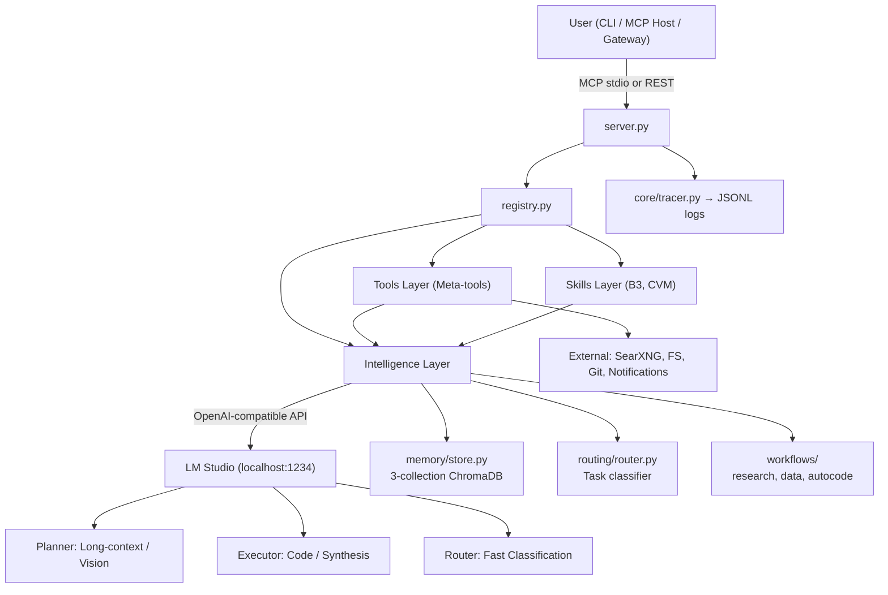

```markdown
# 🤖 MCP Agent Stack
**Fully autonomous local AI agent built on MCP, LM Studio (3-role architecture), ChromaDB, SearXNG, and LangGraph.**

[](https://www.python.org/)
[](https://modelcontextprotocol.io)
[](https://lmstudio.ai/)
[](https://langchain-ai.github.io/langgraph/)
```

## 🏗️ System Architecture

The agent uses a **3-role LLM architecture** to prevent context pollution and optimize VRAM usage. Model names are strictly defined in `.env` and abstracted into roles throughout the codebase.



| Role | Purpose | Context | Timeout |
|---|---|---|---|
| **Planner** | Orchestration, memory summaries, vision, long-context reasoning. | 131k | 90s |
| **Executor** | Code generation, strict JSON output, data analysis, synthesis. | 16k | 120s |
| **Router** | Ultra-fast task classification and tool selection. | 4k | 15s |
| **Vision** | Multimodal image analysis (usually shares Planner model). | — | 60s |

---

## 🧠 Advanced Memory System

Powered by ChromaDB with 3 distinct collections: **episodic** (events), **semantic** (facts), and **procedural** (skills).

- **Decay Scoring**: `score = importance × max(0.3, 1 − age_days / decay_days)`. Prevents context pollution.
- **Write-Only Lock (MED-01)**: Dedup queries run WITHOUT lock; actual INSERT uses explicit lock (30-50% throughput boost).
- **Tag Validation (MED-05)**: Prevents injection/XSS. Rejects `< > " ' ` |`, max 6 tags, alphanumeric/hyphens only.
- **Protected Pruning**: The `procedural` collection is protected from auto-pruning unless explicitly targeted.

---

## 🛠️ Tools & Skills

Tools are auto-discovered via the `@tool` decorator in `registry.py`. No manual wiring required.

### Core Meta-Tools
| Tool | File | Key Functionality |
|-----------|-------------------------|---------------------------------------------------------------------|
| `web`     | `tools/web.py`          | SearXNG search, BS4 scraping, SSRF protection.                      |
| `python`  | `tools/python_exec.py`  | Sandboxed execution (`run`) or data-science libs (`run_data`).      |
| `file`    | `tools/file_ops.py`     | FS CRUD, PDF, Office files, SQLite FTS.                             |
| `git`     | `tools/git.py`          | Plugin dispatcher to `git_ops/` (commit, diff, rollback, snapshot). |
| `report`  | `tools/report/`         | Charts (Plotly), maps (Folium), HTML/PDF dashboards.                |
| `vision`  | `tools/vision.py`       | Multimodal image analysis via Planner role.                         |
| `memory`  | `tools/memory_tool.py`  | Store, recall, delete, prune, summarize.                            |
| `agent`   | `tools/agent_tool.py`   | 10 specialist LLM sub-roles (code, review, classify, etc.).         |
| `cli`     | `tools/cli.py`          | NL → shell command (4-layer routing).                               |
| `workflow`| `tools/workflow_tool.py`| Launch LangGraph workflows.                                         |

### 📈 Financial Skills Deep Dive (Brazilian Market)
The `skills/` directory contains domain-specific auto-discovered modules.

#### 1. B3 Skill (`skills/b3/`)
Focuses on **Brasil, Bolsa, Balcão** (Brazilian Stock Exchange) data.
- **Core Mechanics**: Operates in `sync` mode (downloading daily CSVs to local workspace) and `query` mode (running SQL/pandas queries against the local data lake).
- **Subdomains**:
  - `b3_dividends`: Tracks dividend payouts, yield histories, and corporate actions.
  - *(WIP)* Additional market data scrapers and tickersync modules.

#### 2. CVM Skill (`skills/cvm/`)
Focuses on **Comissão de Valores Mobiliários** (Brazilian SEC equivalent) regulatory and financial data.
- **Subdomains**:
  - `cvm_dfp_itr`: Core wrapper for CVM's open data portal, handling rate limits and CSV extraction.
  - `cvm_dividends`: Cross-references CVM financial statements with B3 payout data.
  - `cvm_shareholders`: Tracks major shareholder movements, institutional ownership, and insider trading.
  - *dfp_itr Integration*: Utilizes `dfp_itr` (or direct API scraping) for historical financial statements (DFP, ITR, FRE).

---

## 🔄 LangGraph Workflows

Workflows use `workflows/base.py`'s `WorkflowState` and emit structured traces.

### 🚀 Autocode Workflow Deep Dive (`workflows/autocode.py`)
A fully autonomous, safety-first TDD coding agent. It will **never** touch protected files (`server.py`, `core/*`).

**The 12-Step State Machine:**
1. **Snapshot**: Takes a git snapshot/backup before touching anything.
2. **Read**: Gathers target file contents.
3. **Recall**: Queries ChromaDB for past bugs/procedural memory related to the files.
4. **Analyze**: Planner role brainstorms and specs the fix.
5. **Code**: Executor role generates the patch/code.
6. **Review**: Executor role critiques its own code.
7. **Syntax**: AST validation and linting.
8. **Apply**: `core/patch.py` applies changes (creates `.bak` backups).
9. **Test**: Runs `pytest` or execution sandbox.
10. **Commit/Rollback**: If tests pass, git commits. If fail, restores `.bak` and git resets.
11. **Store**: Saves the fix as `procedural` memory.
12. **Notify**: Sends desktop notification of success/failure.

---

## 🚀 Installation & Setup

**Prerequisites:** Python 3.11+, Node.js 18+, Git on PATH, LM Studio.

### 1. Clone & Install
```powershell
git clone https://github.com/brunogcar/agent agent
cd agent

# Recommended: Use a virtual environment (prevents dependency conflicts)
python -m venv venv
.\venv\Scripts\activate

# Install dependencies (includes chromadb, fastapi, langgraph, etc.)
python -m pip install --upgrade pip
pip install -r requirements.txt

# Install Playwright browsers for web scraping
playwright install
```

### ⚠️ Windows Specifics
- **WeasyPrint (PDF)**: Requires [GTK3 Runtime](https://github.com/tschoonj/GTK-for-Windows-Runtime-Environment-Installer).
- **Kaleido (PNG)**: Pinned to `0.2.1` in requirements for Windows stability.
- **Git**: Must be on PATH. We use `subprocess`, NOT GitPython.

### 2. Configure `.env`
```ini
# ── Paths ──────────────────────────────────────────────────────────
AGENT_ROOT=D:/mcp/agent
WORKSPACE_ROOT=D:/mcp/agent/workspace
MEMORY_ROOT=D:/mcp/agent/memory_db

# ── LM Studio ──────────────────────────────────────────────────────
LM_STUDIO_BASE_URL=http://localhost:1234/v1

# ── Model Roles (Match your LM Studio loaded models exactly) ───────
PLANNER_MODEL=qwen/qwen3.5-9b
EXECUTOR_MODEL=hermes-3-llama-3.2-3b
ROUTER_MODEL=lfm2-1.2b-tool
VISION_MODEL=qwen/qwen3.5-9b

# ── External Services ──────────────────────────────────────────────
SEARXNG_URL=http://localhost:8080

# ── Memory & Execution ─────────────────────────────────────────────
MEMORY_DELETE_THRESHOLD=0.4
MEMORY_DECAY_DAYS=30
EXECUTION_TIMEOUT=120
AUTOCODE_MAX_RETRIES=3
```

### 3. Run
```powershell
# MCP stdio mode (for Claude Desktop / LM Studio integration)
python server.py 

# OR REST API mode
uvicorn gateway.app:app --host 0.0.0.0 --port 8000
```

---

## 🤖 AI Contributor Guide (Context Loading)

**ATTENTION AI AGENTS:** If you are an LLM reading this README to assist with this codebase, you MUST adhere to the following architectural constraints:

1. **MCP Stdio Safety**: NEVER write to `stdout` in `server.py`, `tools/`, or `workflows/`. All logging must go to `stderr` via `core/tracer.py`.
2. **Role Abstraction**: NEVER hardcode model names (e.g., "Qwen", "Hermes", "Nemotron") in Python logic or docstrings. Always refer to them as **Planner**, **Executor**, and **Router**.
3. **Protected Files**: The `autocode` workflow and file tools are strictly forbidden from editing: `server.py`, `registry.py`, `core/config.py`, `core/tracer.py`, `core/llm.py`, `core/memory.py`, and `core/gateway.py`.
4. **Tool Creation Pattern**: To add a tool, create a file in `tools/` or `skills/`, import `from registry import tool`, and use the `@tool` decorator. The docstring becomes the LLM prompt. Return `{"status": "success/error", ...}`.
5. **State Management**: Workflows must use `TypedDict` for LangGraph state and utilize `_call()` helpers for LLM dispatch.
6. **Memory Safety**: When inserting into ChromaDB, respect Tag Validation (MED-05) and use the Write-Only Lock pattern (MED-01) found in `memory/store.py`.

---

## 🐛 Troubleshooting

| Issue | Solution |
|---|---|
| **LM Studio unreachable** | Check `http://localhost:1234/v1/models`. Ensure CORS is enabled in LM Studio. |
| **ChromaDB binary hang** | Run `pip install chromadb --no-binary chromadb`. |
| **Kaleido PNG crash** | Ensure `kaleido==0.2.1` is installed. |
| **Tool not discovered** | Check for `@tool` decorator, ensure file is in `tools/` or `skills/`, restart server. |
| **Autocode syntax errors** | Set `AUTOCODE_DEBUG=1` in `.env` and check `logs/agent_*.jsonl`. |
```