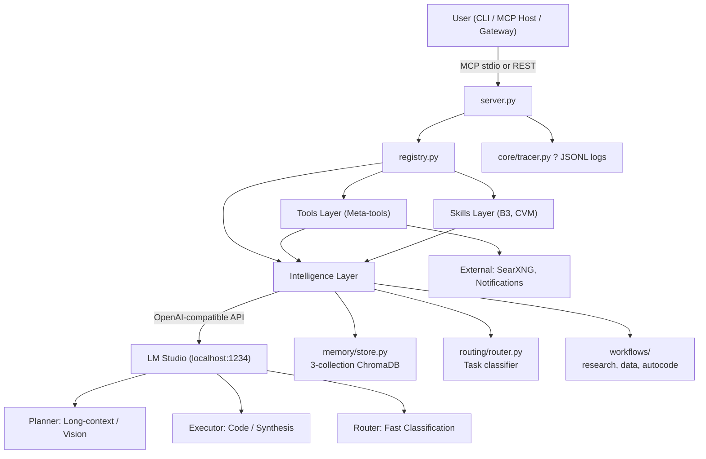

# ?? MCP Agent Stack
**Fully autonomous local AI agent built on MCP, LM Studio (3-role architecture), ChromaDB, SearXNG, and LangGraph.**

[](https://www.python.org/)
[](https://nodejs.org/)
[](https://modelcontextprotocol.io)
[](https://lmstudio.ai/)
[](https://langchain-ai.github.io/langgraph/)

> **Prerequisites**:
> - **[Python 3.11+](https://www.python.org/downloads/)**: ?? Check "Add Python to PATH" during installation.
> - **[Node.js 18+](https://nodejs.org/)**: Required for `npx` MCP servers (time).
> - **[Git](https://git-scm.com/downloads)**: Must be available on your system PATH.
> - **[LM Studio](https://lmstudio.ai/)**: Download and load the 3 role models (Planner, Executor, Router).
>
> **Windows Note**: PDF report generation requires the [GTK3 Runtime](https://github.com/tschoonj/GTK-for-Windows-Runtime-Environment-Installer/releases).
>
> [? Jump to Installation](#-installation--setup)

---

## ??? System Architecture

The agent uses a **3-role LLM architecture** to prevent context pollution and optimize VRAM usage. Model names are strictly defined in `.env` and abstracted into roles throughout the codebase.



| Role | Purpose | Context | Timeout |
|----------|---------|-----|------|
| **Planner** | Orchestration, memory summaries, vision, long-context reasoning. | 160k | 90s |
| **Executor** | Code generation, strict JSON output, data analysis, synthesis.   | 16k | 120s |
| **Router** | Ultra-fast task classification and tool selection. | 4k | 15s |
| **Vision** | Multimodal image analysis (usually shares Planner model). | — | 60s |

---

## ?? Documentation & Deep Dives

For detailed technical references, consult the dedicated documentation:

| Doc | Purpose |
|-----|---------|
| [`workflows/`](workflows/) | LangGraph state machines: `research.py`, `data.py`, `autocode.py` |
| [`tools/`](tools/) | Meta-tool implementations and sandboxing logic |
| [`skills/`](skills/) | Domain-specific modules: `b3/` (Brazilian stocks), `cvm/` (regulatory data), auto-discovered via `dispatcher.py` |
| [`core/tracer.py`](core/tracer.py) | Structured JSONL logging, trace IDs, and debugging |
| [`core/config.py`](core/config.py) | Singleton config loader: paths, model registry, env var parsing, protected files list |
| [`core/llm.py`](core/llm.py) | Unified LLM client with per-role circuit breakers, structured output, and provider abstraction |
| [`registry.py`](registry.py) | Auto-discovers `@tool` decorated functions, generates MCP schemas, no manual wiring required |

?? **Tip for AI Contributors**: Always read `docs/system_prompts/*.md` before modifying workflow logic — they define the exact output schemas and guardrails each model expects.


## ?? Workflow Quick Reference

### Core Workflows (Triggerable via `workflow()` tool)

| Workflow | Trigger | Use Case | Key Safety |
|----------|---------|----------|-----------|
| `research` | `workflow(type="research", goal="...")` | Gather info from web, synthesize findings | SSRF protection, citation tracking, source validation |
| `data` | `workflow(type="data", goal="...")` | Pandas/numpy analysis, chart generation | Sandboxed `run_data` mode, output validation, schema enforcement |
| `autocode` | `workflow(type="autocode", goal="...")` | Fix bugs, add features, refactor code | Git snapshot/rollback, protected files, TDD loop, AST syntax check |

### Foundation Layer (Not directly triggerable)

| Module | Purpose | Key Components |
|--------|---------|---------------|
| `workflows/base.py` | Shared state, node helpers, dispatcher for all workflows | `WorkflowState` (TypedDict), `_call()` LLM helper, `_dispatch()` router, trace emission utilities |

Each core workflow emits structured traces to `logs/agent_*.jsonl` and updates memory on completion. All workflows inherit safety guards and logging from `base.py`.


## ??? Tools

Tools are auto-discovered via the `@tool` decorator in `registry.py`. No manual wiring required.

### Core Meta-Tools
| Tool | File | Key Functionality |
|------|------|-------------------|
| `web` | `tools/web.py` | SearXNG search, BS4 scraping, SSRF protection. |
| `python` | `tools/python_exec.py` | Sandboxed execution (`run`) or data-science libs (`run_data`). |
| `file` | `tools/file.py` & `tools/file_ops/` | FS CRUD, PDF, Office files, SQLite FTS (dispatcher + action handlers). |
| `git` | `tools/git.py` & `tools/git_ops/` | Actions commit, diff, rollback, snapshot, etc (dispatcher + action handlers). |
| `cli` | `tools/cli.py` & `tools/cli_ops/` | NL ? shell command (4-layer routing, dispatcher + command handlers). |
| `report` | `tools/report_tool.py` | Charts (Plotly), maps (Folium), HTML/PDF dashboards. |
| `vision` | `tools/vision.py` | Multimodal image analysis via Planner role. |
| `memory` | `tools/memory.py` | Store, recall, delete, prune, summarize. |
| `agent` | `tools/agent_tool.py` | 10 specialist LLM sub-roles (code, review, classify, etc.). |
| `workflow` | `tools/workflow_tool.py` | Launch LangGraph workflows. |


## ?? Skills & Domain Knowledge

Skills encapsulate domain-specific knowledge and workflows. Unlike raw tools (which implement core actions), skills act as "knowledge packages" that guide the agent on *how* to use tools for specific domains.

### Auto-Discovery via Dispatcher
The `skills/dispatcher.py` module automatically discovers and registers skill domains at startup. It scans the `skills/` directory for folders containing an `__init__.py` file and dynamically routes relevant tasks to the appropriate domain logic. **To add a new domain:** simply create a new folder in `skills/` with an `__init__.py` file. No manual wiring in `server.py` or `registry.py` is required.

### Active Domains

#### 1. B3 (`skills/b3/`)
Focuses on **Brasil, Bolsa, Balcão** (Brazilian Stock Exchange) market data.
- **Core Mechanics**: Operates in `sync` mode (downloading daily CSVs to the local workspace data lake) and `query` mode (running SQL/pandas queries against the local datasets).

#### 2. CVM (`skills/cvm/`)
Focuses on **Comissão de Valores Mobiliários** (Brazilian SEC equivalent) regulatory and financial data.
- **Core Mechanics**: Wraps CVM's open data portal to handle rate limits, CSV extraction, and cross-referencing of historical financial statements (DFP, ITR, FRE) with market payout data.

---

## ?? Installation & Setup

**Prerequisites:** Python 3.11+, Node.js 18+, Git on PATH, LM Studio.

### 1. Clone & Initial Setup
```powershell
git clone https://github.com/brunogcar/agent agent
cd agent

# Create isolated virtual environment (prevents dependency conflicts)
python -m venv venv

# Activate the venv — you MUST do this before any pip/install commands
.\venv\Scripts\Activate.ps1
# If you get an execution policy error, run first:
# Set-ExecutionPolicy Unrestricted -Scope CurrentUser
```
*? You'll know it worked when your prompt shows `(venv)` at the start.*

### 2. Install Dependencies
```powershell
# Always upgrade pip first (prevents weird install bugs)
python -m pip install --upgrade pip

# Install all project dependencies into the active venv
pip install -r requirements.txt

# Install Playwright browsers (required for web scraping)
# ?? Must be run AFTER activating the venv
playwright install
```

### ?? Windows Specifics
- **WeasyPrint (PDF)**: Requires the [GTK3 Runtime](https://github.com/tschoonj/GTK-for-Windows-Runtime-Environment-Installer/releases). If you skip this, HTML reports still work perfectly — only PDF export is disabled.
- **Kaleido (PNG)**: Pinned to `0.2.1` in `requirements.txt` for Windows stability.
- **Git**: Must be on PATH. We use `subprocess` to call `git.exe` directly, NOT the `GitPython` library.
- **ChromaDB**: If you get binary hang/import errors on first run, try `pip install chromadb --no-binary chromadb`.

### 3. Configure `.env`
Rename  .env.example to .env

Open `.env` in your editor and make these required changes:
1. **Model Names**: Update `PLANNER_MODEL`, `EXECUTOR_MODEL`, and `ROUTER_MODEL` to match the exact IDs loaded in your LM Studio. *(Tip: check `http://localhost:1234/v1/models` to see your exact IDs)*.
2. **Gateway Secret**: Change `GATEWAY_SECRET=changeme` to a strong, unique password. The REST API will refuse to start in production if this is left as the default.
3. **Paths**: Ensure `AGENT_ROOT` and `WORKSPACE_ROOT` point to your actual local directories.

### 4. Configure MCP Servers
To connect the agent to an MCP host (like LM Studio, Claude Desktop, or Cursor), add the server configurations to your host's MCP settings file (e.g., `mcp.json` or `claude_desktop_config.json`). See the `mcp.json` example in the repository root for the exact JSON structure.

**Key setup rules:**
- **`agent` server**: The `command` **must** point to the `python.exe` inside your `venv` folder (e.g., `D:/mcp/agent/venv/Scripts/python.exe`). If you use the global Python, the MCP host won't find your installed dependencies.
- **Paths**: Update all directory paths in the JSON to match where you actually cloned this repository.

### Configure Additional MCP Servers (Optional)
The agent works standalone, but you can enhance it by adding community MCP servers to your host's configuration file (e.g., `mcp.json` or `claude_desktop_config.json`):
- **Filesystem** (`@modelcontextprotocol/server-filesystem`): Native MCP file-system access.
- **Time** (`@mcpcentral/mcp-time`): Current date/time awareness.

**How to install:**
You do **not** need to run `npm install`. These servers are executed via `npx`, which automatically downloads and runs them on demand. The only requirement is that [Node.js 18+](https://nodejs.org/) is installed on your system. 

Simply add their `npx` commands to your MCP configuration file. *(See the `mcp.json` example in the repository root for the exact JSON structure. Remember to update the paths to match your local setup, and ensure the `agent` command points to your `venv` Python executable).*

---

## ?? AI Contributor Guide (Read First!)

**ATTENTION AI ASSISTANTS**: If you are a large language model helping the human developer write code, fix bugs, or add features, please read this architectural map and follow the efficiency guidelines below. 

*(Note: The "Agent Self-Preservation" rules below are guardrails for the autonomous agent running locally via MCP. You, the AI assistant, ARE allowed to suggest modifications to protected core files when explicitly requested by the developer).*

### ??? Agent Self-Preservation (Guardrails for the Autonomous Agent)
*These rules prevent the local agent from breaking its own runtime. AI assistants should ensure generated code complies with these when writing tools or workflows.*
- **MCP Stdio Safety**: NEVER write to `stdout` in `server.py`, `tools/`, or `workflows/`. All logging must go to `stderr` via `core/tracer.py`.
- **Protected Files**: The `autocode` workflow is strictly forbidden from editing core infrastructure: `server.py`, `registry.py`, `core/config.py`, `core/tracer.py`, `core/llm.py`, `core/memory.py`, and `core/gateway.py`.
- **Role Abstraction**: Never hardcode model names (e.g., "qwen", "hermes") in prompts or logic. Always use the `planner`, `executor`, and `router` abstractions defined in `cfg`.

### ? Best Practices for AI Assistants (How to be Efficient)
*Follow these rules to avoid regressions, respect the codebase style, and prevent hallucinations.*
- **Preserve Style & Comments**: Do not "clean up", reformat, or rewrite existing docstrings, comments, or spacing unless explicitly asked. Match the existing style (e.g., we use `from __future__ import annotations` everywhere).
- **Surgical Edits Only**: When suggesting code changes, provide exact `Find this block` ? `Replace with this block` instructions. Do not output entire files unless requested.
- **Respect LangGraph Immutability**: Workflow nodes must return partial state updates (`return {"key": value}`). NEVER mutate the shared `state` dictionary in-place (e.g., no `state["messages"].append()`).
- **No Hallucinated APIs**: If you need to know how an internal module works, ask the user to paste the file or use your file-reading tools. Do not guess the function signatures of `core/` modules.
- **Tool Creation Pattern**: To add a tool, create a file in `tools/`, import `from registry import tool`, and use the `@tool` decorator. The docstring becomes the LLM prompt. Always return `{"status": "success/error", ...}`.
- **Memory Safety**: When interacting with ChromaDB, respect Tag Validation (MED-05) and use the Write-Only Lock pattern (MED-01) found in `core/memory.py`.

### ?? Where to Look for Context (Repo Hierarchy)
*Read these key files first to understand the system before suggesting architectural changes.*

### ?? Sleep & Learn Meta-Learning Daemon
The agent now features an autonomous background daemon (`core/sleep_learn/`) that observes execution traces, distills procedural rules, and injects them into the Planner's context to improve future decision-making.

**Rules for AI Assistants interacting with this system:**
1. **Respect the Injection:** If you see `--- RELEVANT LEARNED RULES ---` injected into your system prompt, you MUST apply them to your current task. They were autonomously learned from past successes and failures.
2. **Do Not Manually Mutate Learned Rules:** Never write directly to the `procedural_meta` ChromaDB collection. The daemon's feedback loop automatically boosts/penalizes rules based on trace outcomes.
3. **Use the Janitor for Bloat:** If memory retrieval feels slow, or you are dealing with a massive context window, use `memory(action="janitor")` to trigger manual compaction (archiving old episodes, purging stale rules).
4. **No LLM Bypassing:** If you write background learning tasks, they MUST use the public `llm.complete()` API. Never import provider clients directly, or you will bypass the daemon's token budgets and rate limiters.

```text
agent/
+-- server.py            # MCP stdio entry point (DO NOT BREAK STDOUT)
+-- registry.py          # @tool auto-discovery engine
+-- core/                # The brain & nervous system
¦   +-- config.py        # Singleton `cfg` object (paths, models, env vars)
¦   +-- llm.py           # 3-role LLM dispatch + circuit breakers
¦   +-- memory.py        # ChromaDB wrapper (episodic/semantic/procedural)
¦   +-- tracer.py        # Structured JSONL logging (stderr only)
¦   +-- gateway.py       # FastAPI REST API (async task queue)
+-- tools/               # 11 meta-tools exposed to the LLM
¦   +-- python_exec.py   # AST-sandboxed code execution
¦   +-- web.py           # SearXNG + BeautifulSoup + SSRF guard
¦   +-- git.py           # Dispatcher -> git_ops/actions/
¦   +-- ...
+-- workflows/           # LangGraph state machines
¦   +-- base.py          # WorkflowState TypedDict + shared helpers
¦   +-- autocode.py      # TDD coding agent (Snapshot->Code->Test->Commit)
¦   +-- research.py      # Web research & synthesis
¦   +-- data.py          # Pandas/data analysis
+-- skills/              # Domain knowledge packages (e.g., B3, CVM)
```

---

## ?? Troubleshooting

| Issue | Solution |
|-------|----------|
| LM Studio unreachable | Check `http://localhost:1234/v1/models`. Ensure CORS is enabled in LM Studio. |
| ChromaDB binary hang | Run `pip install chromadb --no-binary chromadb`. |
| Kaleido PNG crash | Ensure `kaleido==0.2.1` is installed. |
| Tool not discovered | Check for `@tool` decorator, ensure file is in `tools/` or `skills/`, restart server. |
| Autocode syntax errors | Set `AUTOCODE_DEBUG=1` in `.env` and check `logs/agent_*.jsonl`. |
| "No module named 'X'" | Activate venv, run `pip install -r requirements.txt`, verify with `where pyth

