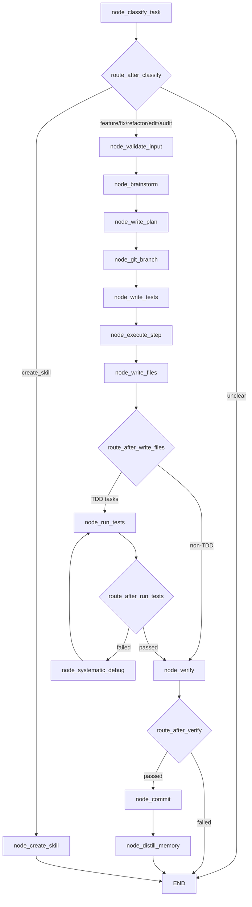

# 🤖 Autocode Workflow: Autonomous TDD Coding

The Autocode workflow (`workflows/autocode_helpers/`) is a fully autonomous, safety-first LangGraph state machine designed to fix bugs, add features, audit code, and scaffold new skills without human intervention. It strictly adheres to Test-Driven Development (TDD) principles, workspace isolation, and architectural safety guardrails.

## 🎯 Purpose & Design Philosophy
Autocode is built to operate as a **self-correcting engineering agent**. Rather than generating code in a single pass, it:
1. **Classifies intent** to determine scope, safety constraints, and execution strategy.
2. **Plans architecturally** before touching files, ensuring changes align with existing patterns.
3. **Writes tests first** (TDD) to establish a verifiable success criteria.
4. **Executes, validates, and debugs** in a closed loop until tests pass or max retries are hit.
5. **Commits atomically** with git snapshots, protected-file enforcement, and workspace scoping.
6. **Stores procedural memory** so past fixes inform future runs.

All operations are constrained by timeouts, circuit breakers, file locks, and a strict "do not touch" core file list.

---

## 🧠 Task Classification & Execution Modes

Before the state machine begins, the Router model classifies the request. This dictates routing, context gathering, TDD intensity, and which nodes are activated. 

| Category       | Triggers                                      | Workflow Impact & Behavior                                                                 | Nodes Triggered / Skipped                          |
|----------------|-----------------------------------------------|--------------------------------------------------------------------------------------------|----------------------------------------------------|
| `feature`      | "add X", "create X", "build X", "implement X" | Full Cycle. Deep brainstorming, architectural spec, TDD loop, verification, commit.        | All nodes. TDD loop active.                        |
| `audit`        | "audit", "security review", "deep review"     | Read-Heavy / Analytical. Root-cause analysis, impact assessment, regression checks.        | Skips `execute`/`write_files`. Focus on `verify`.  |
| `edit`         | "edit X", "change X", "update X", "modify X"  | Intentional Modification. Heavier than fix. Includes impact review & regression testing.   | Full cycle, but stricter `verify` AST checks.      |
| `fix`          | "fix X", "repair X", "bug", "error", "crash"  | Root-Cause Focus. No clarifying questions. Isolates fault, patches, verifies via tests.    | Fast-tracks `brainstorm`. TDD loop active.         |
| `refactor`     | "refactor X", "restructure X", "clean up X"   | Strict AST & TDD. Improves structure without changing behavior. Zero functional regression.| Full cycle. `verify` enforces behavioral parity.   |
| `create_skill` | "create skill", "new skill", "build skill"    | Scaffolding Mode. Generates self-contained `skills/` domain folder with API wrappers.      | Bypasses TDD loop. Routes directly to `END`.       |
| `unclear`      | Ambiguous intent or missing context           | Halt & Query. Aborts state machine, returns 1-2 clarifying questions.                      | Routes to `END` immediately.                       |

---

## 🔄 The 15-Node State Machine

The workflow has evolved from a linear 12-step pipeline into a **conditional, self-correcting graph** with 5 routing points and a closed TDD loop.



### Step-by-Step Breakdown
1. **Classify**: Router determines task type, confidence, and safety scope.
2. **Validate Input**: Checks file paths, protects core files, enforces `AUTOCODE_MAX_FILE_CHARS`.
3. **Brainstorm**: Planner explores architectural impact, edge cases, and implementation strategy.
4. **Write Plan**: Generates a structured `list[dict]` of execution steps (`plan` state key).
5. **Git Branch**: Creates a workspace-scoped git snapshot & branch (`project_root` isolation).
6. **Write Tests**: Generates failing pytest scaffolding based on the plan & spec.
7. **Execute Step**: Executor generates code for the current plan step. Stores in `tdd_source_code`.
8. **Write Files**: Applies `str_replace` patches or full file writes atomically with `.bak` backups & file locks.
9. **Run Tests**: Executes pytest/sandbox. Updates `tdd_status` and `test_results`.
10. **Systematic Debug**: On test failure, analyzes traceback, suggests fixes, updates `tdd_source_code`, and loops back to `run_tests`.
11. **Verify**: AST validation, linting, spec alignment, and regression checks. Sets `verification_passed`.
12. **Commit**: Atomic git commit with structured message. Respects `project_root` scoping.
13. **Distill Memory**: Stores successful methodology, root causes, and patterns to ChromaDB `procedural` memory.
14. **Create Skill**: (Parallel path) Scaffolds `skills/` domain structure, bypasses TDD loop.
15. **END**: Terminal state. Returns trace, result, and commit SHA.

---

## ⚙️ Inner Workings & Data Flow

### State Schema (`AutocodeState`)
All nodes share a single `TypedDict` state. Key fields that drive routing & TDD:
- `plan: list[dict]` – Ordered execution steps. Indexed via `current_step`.
- `tdd_source_code: str` – Raw code/patch output from `execute` or `debug`. Replaced legacy `generated_code`.
- `tdd_status: str` – `"passed"`, `"failed"`, or `""`. Drives `route_after_run_tests`.
- `test_results: dict` – pytest/sandbox output. Contains `success: bool`.
- `verification_passed: bool` – Set by `node_verify`. Gates `node_commit`.
- `project_root: str` – Workspace repo root for git operations. Prevents agent-repo pollution.
- `messages: Annotated[list[AnyMessage], add_messages]` – LangGraph message accumulator.

### 🚨 LangGraph Immutability & Partial Updates (CRITICAL)
LangGraph does **not** deep-copy nested mutable objects. To prevent state aliasing, retry contamination, and checkpoint divergence, all nodes **must** follow the strict partial-update pattern:
- **Return Type**: Nodes must return `-> dict`, NOT `-> AutocodeState`.
- **No In-Place Mutation**: Never do `state["messages"].append(...)` or `state["tdd_status"] = "passed"`.
- **No State Spreading**: Never return `{**state, "key": "value"}`.
- **Correct Pattern**: Clone mutable structures before modifying, and return only the changed keys.

```python
# ❌ WRONG (Mutates shared state / spreads state)
def node_execute(state: AutocodeState) -> AutocodeState:
    state["messages"].append(new_msg)
    return {**state, "tdd_status": "passed"}

# ✅ RIGHT (Clones list / returns partial update dict)
def node_execute(state: AutocodeState) -> dict:
    messages = list(state.get("messages", [])) + [new_msg]
    return {"messages": messages, "tdd_status": "passed"}
```

### Routing & Conditional Edges
Routing functions live in `workflows/autocode_helpers/routes.py`. They read terminal state keys and return the next node name or `"END"`:
- `route_after_classify` → Dispatches by `task_type`.
- `route_after_write_files` → Routes `feature/fix/refactor/improve` to `node_run_tests`; others to `node_verify`.
- `route_after_run_tests` → Checks `tdd_status == "passed"` or `test_results.success`. Routes to `node_verify` or `node_systematic_debug`.
- `route_after_verify` → Gates commit on `verification_passed`.

### TDD Loop & Self-Correction
The loop runs: `write_tests → execute → write_files → run_tests ↔ debug → verify`.
- Max iterations controlled by `AUTOCODE_MAX_RETRIES` (default 3).
- Each failure increments `tdd_iteration`, captures traceback, and triggers `node_systematic_debug`.
- Debug node performs root-cause analysis, patches `tdd_source_code`, and re-enters the loop.
- Convergence triggers memory storage: `"TDD converged after N iterations"`.

---

## 🛡️ Safety Guardrails & Protected Files

### The "Do Not Touch" List
Autocode is strictly forbidden from modifying core infrastructure. Any patch targeting these is blocked at `node_validate_input` and `node_write_files`:
- `server.py`, `registry.py` (MCP wiring & tool discovery)
- `core/config.py`, `core/tracer.py`, `core/llm.py` (Infrastructure, logging, model dispatch)
- `core/memory.py` (Database & persistence)
- `core/gateway.py` (REST API, auth, secrets)

See `core/config.py` → `cfg.protected_files` for the programmatic set.

### Hardened AST Sandbox (`tools/python_exec.py`)
The `verify` node and execution sandbox rely on a two-layer AST validation that blocks advanced bypasses:
- Blocks dynamic resolution (`getattr`, `setattr`, `delattr`).
- Blocks subscript access to builtins (`__builtins__["eval"]`).
- Blocks definition-time execution vectors (`ast.ClassDef` for metaclass attacks, `ast.With`/`ast.AsyncWith` for context managers, `ast.AsyncFunctionDef`).
Any code generated by the `execute` node must pass this strict AST validation before the `apply` node will touch the filesystem.

### Git Scoping & Workspace Isolation
- `project_root` dynamically routes `git snapshot`, `branch`, and `commit` operations to the target workspace repo (`workspace/autocode/...`).
- Falls back to `cfg.agent_root` only if `project_root` is empty.
- Prevents cross-repo pollution when the agent modifies external projects.
- All writes use `filelock` + `.bak` backups for atomicity and rollback safety.

### Stash-Based Rollback Safety
The `git(action="rollback")` command used by the workflow defaults to a **safe, stash-based recovery**. Before executing `git reset --hard HEAD`, it automatically stashes uncommitted changes. This ensures that if the TDD loop exhausts retries and triggers a hard rollback, the agent's partial work is preserved in the git stash and can be recovered manually.

### Execution Constraints
- **Max Retries**: `AUTOCODE_MAX_RETRIES` (default 3). Hard rollback on exhaustion.
- **File Size Limits**: `AUTOCODE_MAX_FILE_CHARS` (default 6000). Chunked or rejected to prevent context overflow.
- **Timeout Hierarchy**: Node timeouts (`planner`, `executor`, `router`) cascade from `.env`. Graph timeout must exceed max node timeout.
- **Circuit Breakers**: Per-role breakers in `core/llm.py` gracefully degrade tasks if a model becomes unresponsive.

---

## ⚙️ Configuration (`.env`)

```ini
# ── Autocode Tuning ────────────────────────────────────────────────
AUTOCODE_MAX_RETRIES=3          # Max TDD attempts before hard rollback
AUTOCODE_MAX_FILE_CHARS=6000    # Max characters per file read into context
AUTOCODE_DEBUG=0                # Set to 1 for verbose trace logging
EXECUTION_TIMEOUT=120           # Seconds allowed for test sandbox / executor
PLANNER_TIMEOUT=180             # Brainstorm / spec generation timeout
ROUTER_TIMEOUT=60               # Classification / routing timeout
AUTOCODE_GRAPH_TIMEOUT=300      # Total graph execution timeout
```

---

## ⚠️ AI Agent Instructions for Modifying Autocode

If you are an AI assistant tasked with modifying `workflows/autocode_helpers/` or its nodes:

1. **LangGraph Immutability (CRITICAL)**: NEVER mutate the `state` dictionary in-place. NEVER use `{**state, ...}`. Always return a partial update `dict` containing only the modified keys.
2. **Safety First**: Never remove or bypass `node_git_branch` (snapshot) or rollback logic. Safety is non-negotiable.
3. **Protected Files**: Never bypass `cfg.is_protected()` checks or the task classifier routing.
4. **State Schema Compliance**:
   - Use `tdd_source_code`, NOT `generated_code`.
   - Treat `plan` as `list[dict]`, indexed via `current_step`.
   - Route using `tdd_status`, `test_results.success`, and `verification_passed`.
5. **LLM Calls**: Must use `_call()` from `workflows/autocode_helpers/helpers.py` with correct role (`planner`/`executor`/`router`).
6. **Logging Fallback**: `helpers.py` now includes a graceful fallback to standard `logging` if `structlog` is missing. Do not remove the `_HAS_STRUCTLOG` conditional checks. Never use `print()` to stdout.
7. **Git Scoping**: Always pass `state.get("project_root")` to `git_ops` functions.
8. **Imports**: Always use `from __future__ import annotations` (double underscores).
9. **Testing**: `python -m pytest tests/workflows/autocode/ -v --tb=short`

*Last updated: Phase 4 complete. Routing, state schema, git scoping, AST hardening, and LangGraph immutability aligned.*