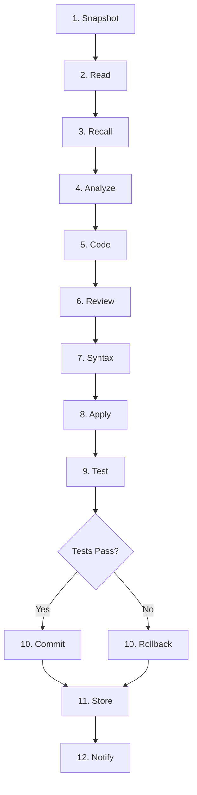

# 🤖 Autocode Workflow: Autonomous TDD Coding

The Autocode workflow (`workflows/autocode.py`) is a fully autonomous, safety-first LangGraph state machine designed to fix bugs, add features, audit code, and scaffold new skills without human intervention. It strictly adheres to Test-Driven Development (TDD) principles and architectural safety guardrails.

---

## 🧠 Task Classification & Execution Modes

Before the 12-step state machine begins, the **Router** model classifies the user's request using a strict system prompt. This classification dictates the workflow's behavior, context gathering, and LLM routing.

| Category | Triggers | Workflow Impact & Behavior |
|---|---|---|
| **`feature`** | "add X", "create X", "build X", "implement X", "new feature" | **Full Cycle.** Triggers deep brainstorming (Planner), architectural spec generation, implementation (Executor), and test generation. |
| **`audit`** | "audit", "security review", "deep review", "security audit" | **Read-Heavy / Analytical.** Combines root-cause analysis, impact assessment, regression checks, and TDD verification. Produces a comprehensive report rather than just a patch. |
| **`edit`** | "edit X", "change X", "update X", "modify X", "rewrite X" | **Intentional Modification.** Heavier than a simple fix. Includes impact review to ensure the intentional change doesn't break adjacent dependencies. |
| **`fix`** | "fix X", "repair X", "bug", "error", "crash", "debug", "patch" | **Root-Cause Focus.** Deep root-cause analysis with no clarifying questions. Immediately isolates the fault, patches, and verifies via existing tests. |
| **`refactor`** | "refactor X", "restructure X", "clean up X", "improve structure" | **Strict AST & TDD.** Improves structure without changing behavior. Heavily relies on AST validation and existing test suites to guarantee zero functional regression. |
| **`create_skill`**| "create skill", "new skill", "build skill", "skill for X" | **Scaffolding Mode.** Bypasses standard file patching. Instead, generates a new self-contained domain folder in `skills/` with `__init__.py`, API wrappers, and `@tool` decorators. |
| **`unclear`** | Insufficient context or ambiguous intent | **Halt & Query.** Aborts the state machine and asks 1-2 clarifying questions before proceeding. |

---

## 🔄 The 12-Step State Machine



### Step-by-Step Breakdown

1. **Snapshot**: Takes a git snapshot/backup of the target files before touching anything.
2. **Read**: Gathers target file contents. Respects `AUTOCODE_MAX_FILE_CHARS` to prevent context window overflow.
3. **Recall**: Queries ChromaDB `procedural` and `episodic` memory for past bugs, fixes, and architectural decisions related to the target files.
4. **Analyze**: The **Planner** role brainstorms, specs the fix, and creates an execution plan (behavior varies based on the Router's classification).
5. **Code**: The **Executor** role generates the patch/code. Uses strict JSON output and tight temperature control (0.1) for precision.
6. **Review**: The **Executor** role critiques its own generated code for edge cases and logic errors.
7. **Syntax**: Performs AST (Abstract Syntax Tree) validation and linting to catch malformed Python before applying.
8. **Apply**: `core/patch.py` applies changes using `str_replace` logic and creates `.bak` backups of the original files.
9. **Test**: Runs `pytest` or the python execution sandbox against the modified files to verify the fix/feature.
10. **Commit / Rollback**: 
    - *Success*: Git commits the changes with a descriptive message.
    - *Failure*: Restores the `.bak` files, performs a git reset/rollback to the snapshot state, and retries (up to `AUTOCODE_MAX_RETRIES`).
11. **Store**: Saves the successful fix and methodology as `procedural` memory for future recall.
12. **Notify**: Sends a cross-platform desktop notification indicating success or final failure.

---

## 🚀 Recent Architectural Improvements (Phases 1-4)

The Autocode workflow and surrounding infrastructure have undergone significant hardening and feature expansions:

- **Formalized Test Suite Integration**: Autocode now natively integrates with `pytest`. The "Test" node doesn't just run arbitrary python; it actively discovers and executes the project's formal test suite to guarantee zero regressions during `fix` and `refactor` tasks.
- **Safety Hardening**: Enhanced memory write-locks (MED-01) and strict tag validation (MED-05) prevent context poisoning during high-concurrency Autocode runs. Protected file lists have been expanded and strictly enforced at the AST level.
- **Prometheus Metrics Endpoint**: A new `/metrics` endpoint exposes real-time telemetry for the Autocode workflow, including LLM circuit breaker states, workflow success/failure ratios, and memory decay statistics.
- **Mermaid Graph Export**: Workflows and architectural state machines can now dynamically export their current execution graphs as Mermaid.js syntax, allowing for real-time trace visualization and automated documentation updates.
- **Circuit Breaker Resilience**: Per-role circuit breakers in `core/llm.py` now gracefully degrade Autocode tasks if a specific model (e.g., the Planner) becomes unresponsive, preventing cascading timeout failures.

---

## 🛡️ Safety Guardrails & Protected Files

### The "Do Not Touch" List
Autocode is **strictly forbidden** from modifying the following core infrastructure files. Any attempt to patch them will be immediately aborted by the workflow:

- `server.py`, `registry.py` (Core MCP wiring and tool discovery)
- `core/config.py`, `core/tracer.py`, `core/llm.py` (Infrastructure, logging, and model dispatch)
- `core/memory.py` (Database and persistence layer)
- `core/gateway.py` (REST API, auth, and secrets handling)

*See `core/config.py` for the full programmatic protected set.*

### Execution Constraints & Scoping
- **Workspace Scoping**: Cannot read, write, or execute outside of `WORKSPACE_ROOT`.
- **Max Retries**: Controlled by `AUTOCODE_MAX_RETRIES` (default `3`). If it fails 3 times, it rolls back completely and aborts.
- **File Size Limits**: Files larger than `AUTOCODE_MAX_FILE_CHARS` (default `6000`) are chunked or rejected to prevent LLM context window overflow.
- **Debug Mode**: Setting `AUTOCODE_DEBUG=1` in `.env` enables verbose trace logging for the workflow steps.

---

## ⚙️ Configuration (`.env`)

```ini
# ── Autocode Tuning ────────────────────────────────────────────────
AUTOCODE_MAX_RETRIES=3          # Max attempts before hard rollback
AUTOCODE_MAX_FILE_CHARS=6000    # Max characters per file read into context
AUTOCODE_DEBUG=0                # Set to 1 for verbose trace logging
EXECUTION_TIMEOUT=120           # Seconds allowed for the Test step sandbox
```

---

## ⚠️ AI Agent Instructions for Modifying Autocode

If you are an AI assistant tasked with modifying `workflows/autocode.py` or its associated nodes:

1. **Never** remove or bypass the **Snapshot** or **Rollback** nodes. Safety is paramount.
2. **Never** bypass the **Protected Files** check or the **Task Classifier** routing logic.
3. Ensure all LLM calls use the `_call()` helper from `core/llm.py` with the correct role (`planner` for analysis/brainstorming, `executor` for code generation/review).
4. Maintain the `WorkflowState` `TypedDict` structure defined in `workflows/base.py`.
5. All logging must use `core.tracer` (e.g., `tracer.step()`). Never use `print()`.
6. When adding new classification categories, update both the `TASK_CLASSIFIER_SYSTEM` prompt and the corresponding LangGraph conditional edges.