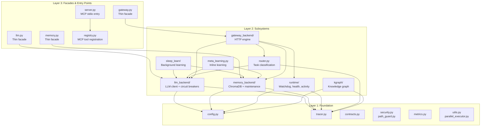
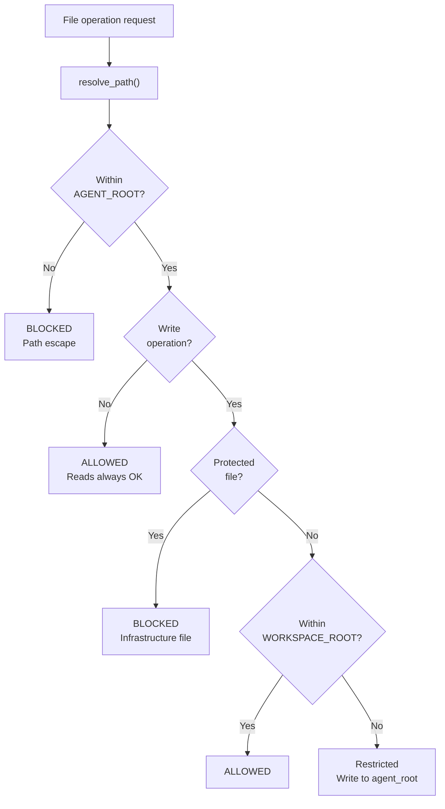
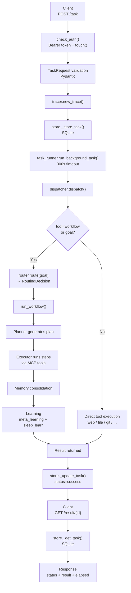
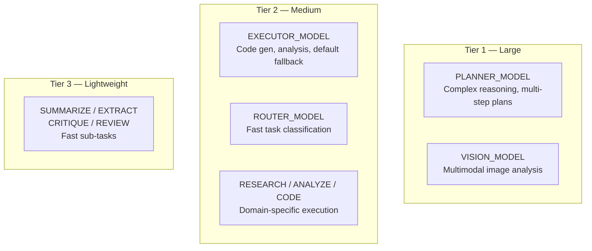
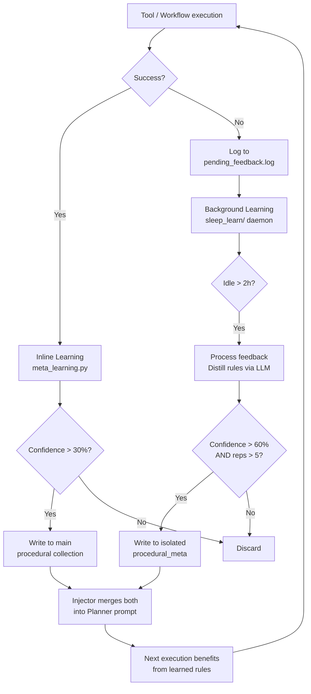

# 🏛️ Core Architecture Reference

> **Status:** v3 — Updated with standalone files, model names removed for longevity (June 2026)
> **Scope:** `core/` module. Tools (`tools/`) and workflows (`workflows/`) covered separately.

The `core/` module is the **foundation layer** of the MCP Agent Stack. It provides configuration, LLM communication, memory, learning, routing, gateway, runtime governance, knowledge graph, and observability — everything the agent needs to think, remember, and act.

---

## 📚 Documentation Index

Each major subsystem has a dedicated document with architecture, API reference, configuration, testing, and AI agent instructions:

| Document | Subsystem | Key Topics |
|----------|-----------|------------|
| [CONFIG.md](CONFIG.md) | Configuration | `.env` loading, model tiers, path hierarchy, validation, gateway config |
| [LLM_BACKEND.md](LLM_BACKEND.md) | LLM Client | Role-based dispatch, circuit breakers, context budgeting, JSON parsing, provider abstraction |
| [MEMORY_BACKEND.md](MEMORY_BACKEND.md) | Memory System | Three collections, four-layer dedup, decay scoring, write/read ops, maintenance |
| [ROUTER.md](ROUTER.md) | Task Router | Model + heuristic routing, confidence guard, complexity scoring, JSON extraction |
| [GATEWAY.md](GATEWAY.md) | REST Gateway | FastAPI endpoints, auth, rate limiting, middleware, SQLite task store, report serving |
| [RUNTIME.md](RUNTIME.md) | Runtime | Activity tracking, cancellation guards, health checks, providers, watchdog, task runner |
| [SLEEP_LEARN.md](SLEEP_LEARN.md) | Background Learning | Feedback processing, distillation, filters, storage, injection, feedback loop |
| [CONTEXT_PRUNER.md](CONTEXT_PRUNER.md) | Context Pruner | Tool-aware truncation, artifact preservation, HTML cleaning, recovery pattern |
| [TRACER.md](TRACER.md) | Observability | Structured logging, trace lifecycle, JSONL files, MCP stdio safety, trace retrieval |
| [KGRAPH.md](KGRAPH.md) | Knowledge Graph | AST parsing, SQLite graph storage, test targeting, project isolation, dependency queries |

---

## 🏗️ Architecture Layers

The core module has three conceptual layers with strict dependency direction:



**Dependency rule:** Layers only import downward. No circular dependencies. Subsystems import from Layer 1 (config, tracer, contracts), never from Layer 3 (facades).

| Layer | Contains | Imports From |
|-------|----------|-------------|
| **Layer 1: Foundation** | config, tracer, contracts, security, path_guard, metrics, utils, parallel_executor | Nothing in `core/` |
| **Layer 2: Subsystems** | llm_backend, memory_backend, sleep_learn, meta_learning, runtime, router, gateway_backend, kgraph | Layer 1 only |
| **Layer 3: Facades** | llm.py, memory.py, gateway.py, server.py, registry.py | Layer 2 (and transitively Layer 1) |

---

## 📦 Module Map

```
core/
├── __init__.py                  # Auto-starts Sleep & Learn daemon on first import
│
├── config.py                    # Singleton Config, .env parsing, path resolution
├── config_validation.py         # Startup validation (paths, models, timeouts)
│
├── tracer.py                    # In-memory trace store + JSONL file logging
├── tracer_reader.py             # Trace retrieval (memory fast-path, disk slow-path)
│
├── llm.py                       # Thin facade for LLMClient
├── llm_backend/                 # Full LLM subsystem
│   ├── client.py                # LLMClient: complete(), complete_with_tools(), call()
│   ├── context_budget.py        # Cognitive priority-based context budgeting
│   ├── context_pruner.py        # Overflow-aware context compression
│   ├── budget.py                # Raw token truncation (budget_messages)
│   ├── circuit_breaker.py       # Per-model failure tracking with auto-recovery
│   ├── prompt_loader.py         # YAML system prompt loading by role
│   ├── config.py                # RoleConfig builder from .env
│   ├── response.py              # LLMResponse dataclass
│   ├── models.py                # Dataclasses: LLMResponse, LLMUsage, RoleConfig
│   ├── factory.py               # Composition root, dynamic provider registration
│   └── providers/
│       ├── base.py              # BaseProvider ABC
│       ├── lmstudio.py          # Local OpenAI-compatible provider
│       └── openai_compat.py     # Cloud provider (OpenAI, DeepSeek, etc.)
│
├── memory.py                    # Thin facade for ChromaDBMemory
├── memory_backend/              # Full memory subsystem
│   ├── store.py                 # ChromaDBMemory: collections, stats, compact, delete
│   ├── write_ops.py             # Thread-safe remember(), write_procedural_rule()
│   ├── read_ops.py              # recall(), memory_search(), semantic_search()
│   ├── scoring.py               # 4-factor confidence scoring + query rewriting
│   ├── maintenance.py           # deduplicate(), forget(), memory_vacuum(), memory_report()
│   ├── telemetry.py             # Opik integration for LLM call observability
│   ├── eviction.py              # EvictionEngine: pruning, compaction, budget enforcement
│   ├── janitor.py               # MaintenanceDaemon: background memory health
│   ├── constants.py             # Shared constants (banned files, limits, etc.)
│   └── client.py                # get_chroma_client(), collection locking
│
├── meta_learning.py             # Inline learning from high-confidence tool mistakes
├── sleep_learn/                 # Background meta-learning daemon
│   ├── daemon.py                # start_background_daemon() — midnight scheduler
│   ├── feedback.py              # Pending feedback processing loop
│   ├── distiller.py             # Trace analysis → rule extraction (LLM, 15s timeout)
│   ├── filters.py               # Quality gates: new rules, dedup, contradictions
│   ├── storage.py               # Write rules to isolated ChromaDB collection
│   ├── injector.py              # Merge rules into Planner system prompt
│   ├── logger.py                # Parse feedback.log for pending entries
│   ├── config.py                # SLEEP_* configuration constants
│   ├── sweeper.py               # Placeholder — not yet implemented
│   └── janitor.py               # Placeholder — not yet implemented
│
├── context_budget.py            # Shared context budgeting utility
├── context_pruner.py            # Overflow-aware compression (shared by llm + tools)
│
├── contracts.py                 # ToolCall/ToolResult schemas, ok()/fail() helpers
├── security.py                  # SSRF protection (is_safe_network_address)
├── path_guard.py                # Path validation, root scoping, protected files
├── metrics.py                   # Prometheus metrics (nodes, tasks, TDD, tokens)
├── parallel_executor.py         # Parallel tool execution engine (NOT_PARALLEL_SAFE guard)
├── citations.py                 # Per-trace citation tracking for research
├── br_validator.py              # Brazilian financial data parser (BRL, dates, tickers)
├── utils.py                     # Shared utility helpers (truncation, compression)
│
├── router.py                    # TaskRouter: goal → workflow classification
│
├── kgraph/                      # Codebase Knowledge Graph
│   ├── ast_parser.py            # Dedicated AST parsing with LRU cache + thread pool
│   ├── cleanup.py               # Disk space and WAL file management
│   ├── project.py               # ProjectManager: isolation, paths, indexing mode
│   ├── queries.py               # Read-only graph queries (deps, callers, file search)
│   ├── storage.py               # GraphStore: SQLite graph with WAL, thread-local conns
│   ├── test_index.py            # Persistent test index with hybrid validation
│   ├── test_mapper.py           # Source → test file mapping via AST
│   └── vectors.py               # Project-specific ChromaDB collections
│
├── gateway.py                   # Thin facade for FastAPI app
├── gateway_backend/             # Full HTTP gateway
│   ├── factory.py               # App factory, lifespan, middleware, exception handlers
│   ├── dependencies.py          # Auth (Bearer token), DI providers
│   ├── dispatcher.py            # Tool/workflow routing from HTTP payloads
│   ├── exceptions.py            # TaskNotFoundError, ToolExecutionError
│   ├── models.py                # Pydantic request/response schemas
│   ├── store.py                 # SQLite task store for async polling
│   └── routes/
│       ├── tasks.py             # POST /task, GET /result/{trace_id}
│       ├── chat.py              # POST /chat (synchronous)
│       ├── health.py            # /health, /version, /tools, /memory/stats
│       ├── metrics.py           # /metrics (Prometheus), /autocode/graph (Mermaid)
│       ├── traces.py            # /traces, /traces/{trace_id}
│       └── reports.py           # /reports/*, /logs/*
│
└── runtime/
    ├── activity_tracker.py      # Global activity/idle tracking (inference slots)
    ├── cancellation.py          # Async cancellation guards (prevent ghost mutations)
    ├── health.py                # Health check logic (dirs, LM Studio, ChromaDB, models)
    ├── providers.py             # LLM server provider abstraction (LM Studio, Ollama, vLLM)
    ├── task_runner.py           # Gateway background task executor (ThreadPoolExecutor)
    └── watchdog.py              # Process watchdog (health probe + auto-restart)
```

---

## 🔑 Key Subsystems at a Glance

### Configuration (`config.py`)

Singleton config loaded from `.env` at import time. Tiered model strategy: large for planning, medium for execution, lightweight for sub-tasks.

→ [Full documentation](CONFIG.md)

| Property | Value |
|----------|-------|
| Pattern | Singleton (`cfg`) |
| Validation | Fail-fast at import time |
| Paths | `pathlib.Path` throughout |
| Models | 12 roles across 3 tiers (names configured in `.env`, never hardcoded) |

---

### LLM Backend (`llm_backend/`)

Unified interface for all model interactions. Role-based dispatch, circuit breakers, cognitive context budgeting, structured output.

→ [Full documentation](LLM_BACKEND.md)

| Property | Value |
|----------|-------|
| Entry point | `llm.complete(role, system, user)` |
| Circuit breaker | 3 failures → 30s cooldown → half-open recovery |
| Context budgeting | 5 cognitive categories with priority-based trimming |
| Output modes | text, json (3-layer extraction), tools (tool-loop) |
| Providers | LM Studio, Ollama, vLLM, OpenAI-compatible cloud |

---

### Memory Backend (`memory_backend/`)

Three-collection ChromaDB vector store with decay scoring, four-layer dedup, and two learning subsystems.

→ [Full documentation](MEMORY_BACKEND.md)

| Property | Value |
|----------|-------|
| Collections | episodic, semantic, procedural |
| Dedup | Hash guard → outer vector → inner vector → procedural reinforcement |
| Decay | Episodic/semantic: 30-day half-life. Procedural: bypass |
| Learning | Inline (meta_learning) + Background (sleep_learn) |
| Thread safety | `threading.Lock()` per collection + cancellation guards |

---

### Task Router (`router.py`)

Ultra-fast classification layer (15s timeout). Model-based routing with deterministic heuristic fallback.

→ [Full documentation](ROUTER.md)

| Property | Value |
|----------|-------|
| Primary | Router LLM, 15s timeout, JSON output |
| Fallback | Pre-compiled regex keywords, O(1) |
| Confidence guard | Low confidence → abort + clarifying questions |
| Targets | research, data, autocode, direct (file, memory, git, notify, report) |

---

### Knowledge Graph (`kgraph/`)

Deterministic AST-based codebase analysis. Builds dependency graphs, maps source files to tests, provides project-level isolation.

→ [Full documentation](KGRAPH.md)

| Property | Value |
|----------|-------|
| Parsing | Python `ast` module, LRU cache (512), thread pool (2 workers) |
| Storage | SQLite WAL, thread-local connections, checkpoint every 100 writes |
| Test targeting | AST dependency analysis + hybrid validation (mtime + size + MD5) |
| Isolation | Per-project `.understand/` directories + project-specific ChromaDB |
| Limits | 5,000 files foreground, 500MB max project, 1MB max file |

---

### Gateway (`gateway_backend/`)

FastAPI REST API for external clients. Async task submission, synchronous chat, health checks, report serving.

→ [Full documentation](GATEWAY.md)

| Property | Value |
|----------|-------|
| Auth | Bearer token, hard-stop on default secret in production |
| Rate limiting | 30/min chat, 60/min/task |
| Task store | SQLite with WAL mode |
| Middleware | CORS, MaxBodySize (10MB), RequestID |
| Endpoints | /task, /chat, /result, /health/*, /traces, /reports/*, /metrics |

---

### Runtime (`runtime/`)

Process governance layer. Activity tracking, watchdog, health checks, background tasks, cancellation guards.

→ [Full documentation](RUNTIME.md)

| Property | Value |
|----------|-------|
| Activity tracker | Inference slots (max 2), idle detection (2h threshold) |
| Watchdog | HTTP probe every 30s, auto-restart, max 3 per 15min |
| Providers | LM Studio, Ollama, vLLM abstraction |
| Task runner | ThreadPoolExecutor(max_workers=10), 300s timeout |
| Cancellation | `ensure_not_cancelled()` prevents ghost mutations |

---

### Learning Subsystems (`meta_learning.py` + `sleep_learn/`)

Two parallel systems extract procedural rules from execution history:

→ [Full documentation: Sleep & Learn](SLEEP_LEARN.md)

| System | When | Threshold | Collection | Latency |
|--------|------|-----------|------------|---------|
| **Inline** (`meta_learning.py`) | After tool execution | 30% confidence | Main `procedural` | Immediate |
| **Background** (`sleep_learn/`) | During idle (>2h) | 60% + 5 repetitions | Isolated `procedural_meta` | Deferred |

---

### Context Pruner (`context_pruner.py`)

Tool-aware middleware that truncates massive outputs before they enter the LLM context.

→ [Full documentation](CONTEXT_PRUNER.md)

| Property | Value |
|----------|-------|
| Threshold | 8,000 characters (~2,000-2,500 tokens) |
| Strategy | web: head+tail (4k+4k), python_exec/cli: tail-only (8k) |
| Artifacts | Full output saved to `.artifacts/` before truncation |
| Recovery | `_pruned` + `_artifact_path` + `_recovery_hint` in result |

---

### Tracer (`tracer.py`)

Centralized structured logging and trace ID propagation. MCP stdio safe.

→ [Full documentation](TRACER.md)

| Property | Value |
|----------|-------|
| Output | stderr (structlog or fallback) + JSONL files |
| Trace store | In-memory, bounded to 200 traces, FIFO eviction |
| Trace ID | 8-char hex from uuid4 |
| Safety | NEVER writes to stdout (MCP stdio corruption) |

---

## 📎 Standalone Files

These files sit directly in `core/` and are not covered by a dedicated subfolder doc. They serve as shared utilities, domain-specific helpers, or foundational primitives used across multiple subsystems.

### `contracts.py` — Data Contracts & Response Helpers

Standardized data shapes for inter-module communication. Every tool returns a dict matching the `ToolResult` shape.

| Export | Type | Purpose |
|--------|------|---------|
| `ToolCall` | Pydantic model | Validates tool call structure from LLM responses |
| `ToolResult` | TypedDict | Standard return schema for all tools |
| `ok()` | Function | Construct a standardized success response |
| `fail()` | Function | Construct a standardized error response |
| `validate_tool_call()` | Function | Validate tool call against schema version |
| `SCHEMA_VERSION` | Constant | Current tool call schema version (`"1.0"`) |

**Used by:** All tools, gateway dispatcher, parallel executor, workflow execution.

---

### `security.py` — SSRF Protection

Network address validation to prevent Server-Side Request Forgery attacks.

| Export | Purpose |
|--------|---------|
| `is_safe_network_address(hostname)` | Returns `True` if safe to connect, `False` if blocked |
| `_is_private_or_localhost(hostname)` | Legacy compatibility alias (inverted semantics) |

**Protection layers:**
- Blocks private, loopback, link-local, reserved IPs
- DNS rebinding prevention (validates ALL resolved records)
- DNS DoS prevention (2s timeout)
- IPv4-mapped IPv6 blocking (`::ffff:127.0.0.1`)
- Configurable allowlist (`ALLOWED_INTERNAL_HOSTS`)

**Used by:** `tools/web.py`, `tools/browser.py`, `tools/tavily.py` — any tool that makes network requests.

---

### `path_guard.py` — Path Security

Centralized path validation and root scoping. O(1) guards using `pathlib.Path.resolve()`.

| Export | Purpose |
|--------|---------|
| `resolve_path(path, default_root, require_exists)` | Resolve + validate against AGENT_ROOT |
| `check_protected_file(path, operation)` | Reads always allowed, writes blocked on protected files |
| `check_git_operation(operation, cwd, target)` | Validate git operations against scoping rules |
| `make_path_error(path, operation, reason)` | Standardized error response for path violations |

**Boundaries:**
- **AGENT_ROOT** — primary boundary (reads allowed, writes restricted)
- **WORKSPACE_ROOT** — secondary boundary (full access, subset of AGENT_ROOT)
- **Protected files** — `.env`, `.git`, core infrastructure files
- **Git scoping** — `clone`/`init` restricted to WORKSPACE_ROOT

**Used by:** `tools/file.py`, `tools/git.py`, `tools/python_exec.py` — any tool that touches the filesystem.

---

### `metrics.py` — Prometheus Telemetry

Optional Prometheus metrics (graceful degradation if `prometheus_client` not installed).

| Export | Metric Type | Tracks |
|--------|-------------|--------|
| `track_node(name, duration)` | Histogram | Node execution duration |
| `track_task_status(status)` | Counter | Task outcomes (success/failed) |
| `track_tdd_iterations(count)` | Histogram | TDD iterations per task |
| `track_llm_tokens(role, prompt, completion)` | Counter | Token consumption by role |
| `generate_metrics()` | — | Prometheus text format output |

**Used by:** Gateway (`GET /metrics`), autocode workflow nodes, LLM client.

---

### `citations.py` — Research Citation Tracker

Per-trace citation store for research workflows. Thread-safe via `threading.Lock()`.

| Export | Purpose |
|--------|---------|
| `citations.add(trace_id, url, title, snippet)` | Register a source URL |
| `citations.cite(trace_id, url)` | Get inline citation marker `[1]` |
| `citations.get_sources(trace_id)` | Get all sources for a trace, sorted by number |
| `citations.get_numbered(trace_id)` | Alias for `get_sources()` (template rendering) |
| `citations.count(trace_id)` | Count sources for a trace |
| `citations.clear(trace_id)` | Clear all sources for a trace |

**Properties:** `MAX_TRACES = 100` with FIFO eviction. Multiple facts from the same URL share the same citation number.

**Used by:** `workflows/research.py`, `workflows/deep_research.py` — research and deep research workflows.

---

### `parallel_executor.py` — Parallel Tool Execution Engine

Executes multiple tool calls in parallel via `ThreadPoolExecutor`. Pure execution logic, no dependency on registry.

| Export | Purpose |
|--------|---------|
| `dispatch_parallel(calls, max_workers, trace_id)` | Execute multiple tool calls in parallel |
| `PARALLEL_SAFE` | Frozenset of tools safe to run concurrently |

**Properties:**
- `max_workers`: bounded to 1–8
- Global timeout: 30 seconds via `concurrent.futures.wait()`
- Nested parallel prevention: `threading.local()` depth counter
- Returns standardized `ok()` / `fail()` response

**Used by:** Gateway dispatcher, workflow execution when multiple independent tool calls can run concurrently.

---

### `br_validator.py` — Brazilian Financial Data Parser

Domain-specific utility for parsing Brazilian financial data. Internal utility module, NOT an MCP tool.

| Export | Purpose |
|--------|---------|
| `parse_brl(value)` | Convert BRL currency strings to float (`R$ 1.000,50` → `1000.50`) |
| `parse_br_date(value, fmt)` | Parse Brazilian date formats (`DD/MM/YYYY` and `YYYY-MM-DD`) |
| `validate_ticker(symbol)` | Standardize BOVESPA tickers (`PETR4`, `TAEE11`, etc.) |
| `B3Dividend` | Pydantic model for B3 dividend/corporate action data |

**Used by:** `skills/b3/`, `skills/cvm/`, and LLM-generated pandas scripts for Brazilian market analysis.

---

### `utils.py` — Shared Utility Helpers

General-purpose helpers for tool output management.

| Export | Purpose |
|--------|---------|
| `truncate_output(text, max_chars)` | Truncate large outputs with a notice (default: 4000 chars) |
| `compress_result(result, max_chars)` | Recursively compress large string fields in tool result dicts |

**Used by:** Any tool that produces large outputs. Provides the default truncation threshold (`_MAX_OUTPUT_CHARS = 4000`) before the more sophisticated context pruner kicks in.

---

### `__init__.py` — Package Initialization

Auto-starts the Sleep & Learn daemon on first `core` import. Uses a `_daemon_started` guard to prevent double-start.

```python
# Runs once on first import of core/
from core.sleep_learn.daemon import start_background_daemon
start_background_daemon()
```

> ⚠️ **Known concern:** This means any `from core.config import cfg` import chain triggers the daemon. In test environments or CLI tools, this causes unnecessary ChromaDB initialization and thread creation. Consider moving to explicit startup in `server.py`.

---

## 🔒 Security Model

### Path Security (`path_guard.py`)



| Boundary | Scope | Reads | Writes |
|----------|-------|-------|--------|
| **AGENT_ROOT** | Primary | Allowed | Restricted (protected files blocked) |
| **WORKSPACE_ROOT** | Secondary (subset) | Allowed | Allowed (full access) |
| **Protected files** | .env, .git, core configs | Allowed | **Blocked** |

### Network Security (`security.py`)

| Threat | Protection |
|--------|-----------|
| SSRF | Block private, loopback, link-local, reserved IPs |
| DNS rebinding | Resolve hostname + validate ALL returned records |
| DNS DoS | 2-second timeout on resolution |
| IPv4-mapped IPv6 | Block `::ffff:127.0.0.1` |
| Allowlist | `ALLOWED_INTERNAL_HOSTS` in `.env` |

### Gateway Security

| Feature | Implementation |
|---------|---------------|
| Auth | Bearer token (`GATEWAY_SECRET`) |
| Production guard | Hard stop if secret is default value in production |
| Rate limiting | slowapi: 30/min chat, 60/min task |
| Payload limit | `GATEWAY_MAX_BODY_MB` (default 10MB) |
| CORS | Configurable origins (`GATEWAY_CORS_ORIGINS`) |
| CSP | `default-src 'self'; frame-ancestors 'none'` on reports |

---

## 📊 Data Flow: POST /task to Result



---

## 📐 Model Configuration Strategy

Models are configured in `.env` and change frequently. The architecture uses a **three-tier strategy** — never hardcode model names in code, always use `cfg.<role>_model`.



| Tier | Purpose | Characteristics | Roles |
|------|---------|-----------------|-------|
| **Tier 1** (large) | Complex reasoning | Highest capability, largest VRAM, slowest | planner, vision |
| **Tier 2** (medium) | Execution & routing | Balanced capability/speed | executor, router, research, analyze, code |
| **Tier 3** (lightweight) | Sub-tasks | Fastest, smallest, cheapest | summarize, extract, critique, review |

**Fallback chain:** Sub-roles → executor → planner. Sub-roles intentionally fall back to executor, not planner, to avoid expensive model usage for lightweight tasks.

→ [Full configuration reference](CONFIG.md#-model-configuration)

---

## 🧵 Thread Safety Summary

| Component | Mechanism | Notes |
|-----------|-----------|-------|
| Config | Read-only after init | No locks needed |
| LLM Client | Singleton + per-thread HTTP clients | Double-checked locking |
| Circuit Breaker | `threading.Lock` per instance | Prevents state race conditions |
| Memory writes | `threading.Lock` per collection | Never lock reads |
| Activity Tracker | `threading.RLock` | Reentrant (touch inside inference_slot) |
| Graph Store | Thread-local connections + `_write_lock` | Read: no lock, Write: serialized |
| File Writer (tracer) | `threading.Lock` | Prevents interleaved JSONL |
| Gateway task store | `threading.Lock` | Serialized SQLite operations |
| AST Parser | `ThreadPoolExecutor(2)` + LRU cache | CPU-bound work off event loop |
| Citations | `threading.Lock` | Prevents interleaved source entries |
| Parallel executor | `threading.local()` depth counter | Prevents nested parallel calls |

---

## 🔄 Learning Loop



---

## 📡 Observability

| System | Output | Purpose |
|--------|--------|---------|
| **Tracer** | stderr + JSONL files | Qualitative: what happened, when, with what context |
| **Metrics** | Prometheus `/metrics` | Quantitative: durations, counts, token usage |
| **Citations** | Per-trace source tracking | Research attribution |
| **kgraph** | SQLite dependency graph | Codebase structure analysis |

---

## ⚠️ Active Concerns

> **Note:** These are MiMo's observations from full source code review. They are constructive suggestions, not definitive prescriptions.

| Priority | Issue | Location | Suggestion |
|----------|-------|----------|------------|
| 🔴 High | Two context budgeting systems (3.5 vs 4 factor) | `context_budget.py` + `budget.py` | Consolidate into single public API |
| 🔴 High | Two learning systems with dual collections | `meta_learning.py` + `sleep_learn/` | Merge into single pipeline with fast/deep modes |
| 🔴 High | Router/dispatcher tool mismatch (15 tools, 9 in router) | `router.py` + `dispatcher.py` + `tools/` | Update router prompt + dispatcher + create TOOLS.md registry |
| 🟡 Medium | Sleep daemon starts on any `core` import | `core/__init__.py` | Move to explicit startup in `server.py` |
| 🟡 Medium | ChromaDB warmup is non-blocking (docs say blocking) | `factory.py` | Add readiness gate or block before yield |
| 🟡 Medium | PARALLEL_SAFE mismatch (code vs docs) | `parallel_executor.py` | Reconcile code with docs |
| 🟡 Medium | 20+ files at core/ top level | `core/` | Group into subpackages (security/, observability/) |
| 🟡 Medium | kgraph test_mapper references undefined `yaml` import | `test_mapper.py` | Add `import yaml` with ImportError guard |
| 🟡 Medium | GraphStore singleton never cleaned up | `storage.py` | Add `close_all()` class method + `atexit` |
| 🟢 Low | SQLite task store: connection-per-call | `store.py` | Use single long-lived connection |
| 🟢 Low | uvicorn.run() string reference may be fragile | `gateway.py` | Use actual module path |
| 🟢 Low | Context pruner location (core/ vs llm_backend/) | `context_pruner.py` | Move to `llm_backend/` |
| 🟢 Low | AST parser cache key uses absolute path | `ast_parser.py` | Use relative path for portability |

---

## 🔮 Roadmap Summary

| Status | Area | Enhancement |
|--------|------|-------------|
| ✅ | Memory | Three-collection architecture with decay scoring |
| ✅ | Memory | Four-layer deduplication pipeline |
| ✅ | LLM | Role-based dispatch with circuit breakers |
| ✅ | LLM | Cognitive context budgeting |
| ✅ | Router | Model + heuristic dual-mode routing |
| ✅ | Router | Confidence guard with clarifying questions |
| ✅ | Gateway | Thin facade extraction + Pydantic contracts |
| ✅ | Runtime | Watchdog with provider abstraction |
| ✅ | Runtime | Activity tracking with idle detection |
| ✅ | Learning | Inline meta-learning |
| ✅ | Learning | Background sleep-learning (partial: sweeper/janitor placeholders) |
| ✅ | kgraph | AST-based dependency graph + test targeting |
| ✅ | Observability | Structured tracing + Prometheus metrics |
| 🚧 | Learning | Consolidated learning pipeline |
| 🚧 | Learning | Sweeper and janitor implementation |
| 🚧 | Router | Browser/tavily/consult tool routing |
| 🚧 | Gateway | WebSocket real-time progress |
| 🚧 | Memory | Multi-modal embeddings (image, audio) |
| 🚧 | Memory | Cross-session learning |
| 🚧 | kgraph | Class/function-level graph nodes |
| 🚧 | kgraph | Cross-language AST support |
| 🚧 | Observability | Log compression (gzip after 7 days) |
| 🚧 | Observability | OpenTelemetry integration |

---

## 🛡️ Universal AI Agent Instructions

These rules apply to **all** modifications in `core/`:

1. **Never write to stdout** — all output goes to `sys.stderr` or `tracer.step()`. MCP stdio corruption crashes the connection.
2. **Thin facades only** — `llm.py`, `memory.py`, `gateway.py` are 5-10 line import files. Never add logic to them.
3. **No circular imports** — Layer 3 → Layer 2 → Layer 1. Never reverse.
4. **Thread safety** — check the lock table above before adding concurrent code.
5. **Cancellation guards** — all write operations must call `ensure_not_cancelled()` before mutating.
6. **Never hardcode models** — always use `cfg.planner_model`, `cfg.executor_model`, etc. Model names change frequently.
7. **Pathlib throughout** — all paths are `pathlib.Path` objects, never strings.
8. **Update docs** — when adding new config, features, or modules, update the corresponding `docs/core/*.md` file.
9. **Protected files** — never remove files from `cfg.protected_files` without explicit user approval.
10. **Fail-fast validation** — invalid config must raise at import time, not silently degrade.

---

*This document was generated by MiMo based on full source code review of the `core/` module, including standalone files and `core/kgraph/`. Last updated: June 2026.*