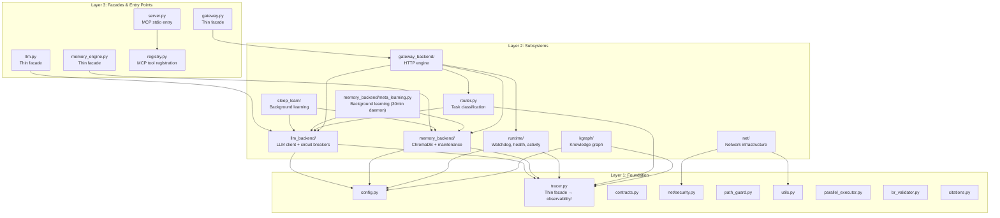

# 🏛️ Core Architecture Reference

> **Status:** v2 — Verified July 2026 against real source via `core/` directory and per-component docs.

The `core/` module is the **foundation layer** of the MCP Agent Stack. It provides configuration, LLM communication, memory, routing, gateway, runtime governance, knowledge graph, and observability — everything the agent needs to think, remember, and act. This document serves as a **high-level index** to the detailed subsystem docs. For deep-dive API references, configuration details, and testing, see the dedicated docs in `docs/core/`.

| Document | Subsystem | Key Topics |
|----------|-----------|------------|
| [CONFIG.md](core/CONFIG.md) | Configuration | Singleton `.env` loading, model tiers, path hierarchy, validation, gateway config |
| [LLM.md](core/LLM.md) | LLM Client | Role-based dispatch, circuit breakers, context budgeting, JSON parsing, provider abstraction |
| [MEMORY.md](core/MEMORY.md) | Memory System | Three collections, four-layer dedup, decay scoring, write/read ops, maintenance |
| [ROUTER.md](core/ROUTER.md) | Task Router | Model + heuristic routing, confidence guard, complexity scoring, JSON extraction |
| [GATEWAY.md](core/GATEWAY.md) | REST Gateway | FastAPI endpoints, auth, rate limiting, middleware, SQLite task store, report serving |
| [RUNTIME.md](core/RUNTIME.md) | Runtime | Activity tracking, cancellation guards, health checks, providers, watchdog, task runner |
| [SLEEP_LEARN.md](core/SLEEP_LEARN.md) | Background Learning | Feedback processing, distillation, filters, storage, injection, feedback loop |
| [KGRAPH.md](core/KGRAPH.md) | Knowledge Graph | AST parsing, SQLite graph storage, test targeting, project isolation, dependency queries |
| [TRACER.md](core/TRACER.md) | Observability | Structured logging, trace lifecycle, JSONL files, MCP stdio safety, trace retrieval |
| [NET.md](core/NET.md) | Network Infrastructure | HTTP error classification, SSRF protection, retry/backoff, API budget tracking, URL normalization |
| [STANDALONE.md](core/STANDALONE.md) | Standalone Utilities | Contracts, path guard, citations, BRL validator, shared helpers (tracer/metrics moved to observability) |

---

## 🏗️ Architecture Layers

The core module has three conceptual layers with strict dependency direction:



**Dependency rule:** Layers only import downward. No circular dependencies. Subsystems import from Layer 1 (config, tracer facade, contracts, security, path_guard, utils), never from Layer 3 (facades). Note: `tracer.py` is itself a facade that re-exports from the `core/observability/` subsystem — it lives at Layer 1 conceptually but its implementation is in Layer 2.

| Layer | Contains | Imports From |
|-------|----------|-------------|
| **Layer 1: Foundation** | config, tracer (facade → observability/), contracts, net/security, path_guard, utils, parallel_executor, br_validator, citations | Nothing in `core/` (tracer.py facade imports from `core/observability/` subsystem) |
| **Layer 2: Subsystems** | observability (tracer_engine + reader + metrics + checkpoint), llm_backend, memory_backend, sleep_learn, meta_learning, runtime, router, gateway_backend, kgraph, net | Layer 1 only |
| **Layer 3: Facades** | llm.py, memory_engine.py, gateway.py, server.py, registry.py, tracer.py (facade) | Layer 2 (and transitively Layer 1) |

---

## 📁 Module Map

```
core/
├── __init__.py           # Package init — no side effects (daemon moved to server.py)
│
├── config.py             # Singleton Config, .env parsing, path resolution
├── config_validation.py  # Startup validation (paths, models, timeouts)
│
├── tracer.py             # Thin facade → core/observability/tracer_engine.py
├── observability/        # Full observability subsystem (tracer + reader + metrics + checkpoint)
│   ├── __init__.py       # Empty package init
│   ├── tracer_engine.py  # Tracer singleton, _FileWriter, _TraceStore, generate_trace_id
│   ├── reader.py         # Trace retrieval (memory fast-path, disk slow-path)
│   ├── metrics.py        # Prometheus metrics (nodes, tasks, TDD, tokens)
│   └── checkpoint.py     # Append-only JSONL journal for workflow resumability
│
├── llm.py                # Thin facade for LLMClient
├── llm_backend/          # Full LLM subsystem
│   ├── client.py         # LLMClient: complete(), call() — imports budget_messages
│   │                     #   from memory_backend/budget.py (NOT llm_backend/rate_limit.py)
│   ├── circuit_breaker.py # Per-model failure tracking with auto-recovery
│   ├── config.py         # RoleConfig + _build_role_configs() — role->provider/model resolution
│   ├── response.py       # LLMResponse dataclass, usage normalization
│   ├── rate_limit.py     # Rate limiting (ThreadSafeRateLimiter) + raw token-count
│   │                     #   truncation (truncate_by_tokens) + cost estimation.
│   │                     #   NOT the cognitive-tier system — see memory_backend/budget.py.
│   ├── provider.py       # BaseProvider ABC + ProviderRegistry
│   ├── factory.py        # create_llm_client() — composition root, provider registration
│   └── providers/
│       ├── lmstudio.py   # Local OpenAI-compatible provider
│       ├── openai_compat.py # Cloud provider (OpenAI, DeepSeek, Mistral, Qwen, Kimi, Z.ai, MiMo)
│       ├── anthropic.py  # Claude (Anthropic) — native Messages API provider
│       └── gemini.py     # Gemini (Google) — native Generative Language API provider
│
├── memory_engine.py      # Thin facade for ChromaDBMemory
├── memory_backend/       # Full memory subsystem
│   ├── store.py          # MemoryStore class: collections, _write_lock, stats
│   ├── write_ops.py      # execute_store() — TOCTOU-safe dedup + insert
│   ├── read_ops.py       # execute_recall(), execute_recall_context()
│   ├── scoring.py        # 4-factor confidence scoring + query rewriting
│   ├── maintenance.py    # execute_delete/prune/summarize/stats/diversity_maintenance()
│   ├── telemetry.py      # RecallTracker — RAM buffer, periodic ChromaDB flush
│   ├── eviction.py       # EvictionQueue + flusher_loop() — crash-safe WAL disk spill
│   │                     #   (persists evicted CONTEXT into ChromaDB, NOT a deletion mechanism)
│   ├── janitor.py        # archive_old_episodes() — episodic archival to episodic_archive
│   ├── constants.py      # COLLECTION_PROCEDURAL, META_FIELDS, dedup thresholds
│   ├── client.py         # get_client(timeout=60) — ChromaDB client singleton
│   ├── budget.py         # Cognitive context budgeting — 7-tier ContextClass priority:
│   │                     #   SYSTEM > USER > ERROR > PROCEDURAL > RECENT > OUTPUT > ARCHIVE
│   │                     #   Used by llm_backend/client.py via `from memory_backend.budget
│   │                     #   import budget_messages`. File's own docstring says
│   │                     #   "core/context_budget.py" — stale path from a prior refactor move.
│   ├── pruner.py         # Tool-output context pruning (artifact preservation + truncation)
│   │                     #   Real functions: prune_text(), prune_tool_dict()
│   │                     #   File's own docstring says "core/context_pruner.py" — stale path.
│   ├── meta_learning.py  # distill_and_store() + MetaLearner.run_forever()
│   │                     #   Background daemon (every 30min), NOT inline/immediate.
│   │                     #   Scans in-memory tracer.recent(20). Per-rule confidence: 0.8-0.9.
│   │                     #   Writes to main `procedural` collection.
│   └── procedural/       # distill.py, prompts.py, validate.py — rule distillation
│
├── sleep_learn/          # Background meta-learning daemon (separate from meta_learning.py)
│   ├── daemon.py         # start_background_daemon() — started by server.py explicitly
│   ├── feedback.py       # Pending feedback processing loop (confidence scoring)
│   ├── distiller.py      # Trace analysis -> rule extraction (LLM, 15s VRAM-safety timeout)
│   ├── filters.py        # Quality gates: new rules, dedup, contradictions
│   ├── storage.py        # Write rules to isolated ChromaDB (sleep_learn_db/)
│   ├── injector.py       # Merge rules into Planner system prompt (live on request path)
│   ├── logger.py         # Parse feedback.log for pending entries
│   ├── config.py         # SLEEP_* configuration constants
│   ├── sweeper.py        # Phase-1 only — returns heartbeat, NO LLM/ChromaDB yet
│   └── janitor.py        # Purges stale/low-confidence rules from procedural_meta collection
│
├── contracts.py          # ToolCall/ToolResult schemas, ok()/fail() helpers
├── security.py           # SSRF protection (is_safe_network_address) — DEPRECATED, use net/security.py
├── path_guard.py         # Path validation, root scoping, protected files
├── parallel_executor.py  # Parallel tool execution engine (NOT_PARALLEL_SAFE guard)
├── citations.py          # Per-trace citation tracking for research
├── br_validator.py       # Brazilian financial data parser (BRL, dates, tickers)
├── utils.py              # Shared utility helpers (truncation, compression)
│
├── router.py             # TaskRouter: goal -> workflow classification
│
├── kgraph/               # Codebase Knowledge Graph
│   ├── ast_parser.py     # Dedicated AST parsing with LRU cache + thread pool
│   ├── cleanup.py        # Disk space and WAL file management
│   ├── project.py        # ProjectManager: isolation, paths, indexing mode
│   ├── queries.py        # Read-only graph queries (deps, callers, file search)
│   ├── storage.py        # GraphStore: SQLite graph with WAL, thread-local conns
│   ├── test_index.py     # Persistent test index with hybrid validation
│   ├── test_mapper.py    # Source -> test file mapping via AST
│   └── vectors.py        # Project-specific ChromaDB collections
│
├── gateway.py            # Thin facade for FastAPI app
├── gateway_backend/      # Full HTTP gateway
│   ├── factory.py        # App factory, lifespan, middleware, exception handlers
│   ├── dependencies.py   # Auth (Bearer token), DI providers
│   ├── dispatcher.py     # Tool/workflow routing from HTTP payloads
│   ├── exceptions.py     # TaskNotFoundError, ToolExecutionError
│   ├── models.py         # Pydantic request/response schemas
│   ├── store.py          # SQLite task store for async polling
│   └── routes/
│       ├── tasks.py      # POST /task, GET /result/{trace_id}
│       ├── chat.py       # POST /chat (synchronous)
│       ├── health.py     # /health, /version, /tools, /memory/stats
│       ├── metrics.py    # /metrics (Prometheus), /autocode/graph (Mermaid)
│       ├── traces.py     # /traces, /traces/{trace_id}
│       └── reports.py    # /reports/*, /logs/*
│
├── net/                  # Shared network infrastructure
│   ├── budget.py         # API budget tracking (daily reset, thread-safe)
│   ├── default.py        # Shared constants (timeouts, retries, thresholds)
│   ├── errors.py         # HTTP error classification + retryable detection
│   ├── retry.py          # Exponential backoff with jitter + circuit breaker hooks
│   ├── security.py       # SSRF protection (is_safe_network_address), IPv6-aware
│   └── url.py            # URL normalization (deterministic cache keys)
│
└── runtime/
    ├── activity_tracker.py # Global activity/idle tracking (inference slots)
    ├── cancellation.py   # Async cancellation guards (prevent ghost mutations)
    ├── health.py         # Health check logic (dirs, LM Studio, ChromaDB, models)
    ├── providers.py      # LLM server provider abstraction (LM Studio, Ollama, vLLM)
    ├── task_runner.py    # Gateway background task executor (ThreadPoolExecutor)
    └── watchdog.py       # Process watchdog (health probe + auto-restart)
```

---

## 📚 Core Component Catalog

### 1. ⚙️ Configuration — [core/CONFIG.md](core/CONFIG.md)

**Status:** v1.0 — Singleton config loaded from `.env` at import time.

**Purpose:** Single source of truth for all runtime settings. Fail-fast validation at import time.

**Key characteristics:**
- **Singleton** — One `cfg` instance, imported everywhere via `from core.config import cfg`
- **Fail-fast** — Invalid config raises exceptions at import time, preventing silent misconfigurations
- **Pathlib throughout** — All paths are `pathlib.Path` objects (cross-platform)
- **No hardcoding** — Model names, paths, and limits all come from environment variables
- **Tiered model roles** — Separate models for planning, execution, routing, and lightweight sub-tasks

**Output:**
```python
# Paths — always Path objects
cfg.agent_root           # Path("D:/mcp/agent")
cfg.workspace_root       # Path("D:/mcp/agent/workspace")
cfg.memory_chroma_path   # Path("D:/mcp/agent/memory_db/chroma")

# Models — loaded from .env, never hardcoded
cfg.planner_model        # "gemma-4-e2b-it@q5_k_s"
cfg.executor_model       # "gemma-2-2b-it"

# Limits — validated integers
cfg.autocode_max_retries # 3
cfg.memory_top_k         # 5
```

---

### 2. 🧠 LLM Backend — [core/LLM.md](core/LLM.md)

**Status:** v1.0 — Unified interface for all model interactions.

**Purpose:** Role-based dispatch, circuit breakers, cognitive context budgeting, structured output.

**Key characteristics:**
- **Role-based dispatch** — Callers say `"executor"` or `"router"`, not raw model strings
- **Circuit breaker per role** — 3 cumulative failures → cooldown equal to role's configured timeout, auto-recovery via half-open
- **Cognitive context budgeting** — 7-tier ContextClass priority (SYSTEM > USER > ERROR > PROCEDURAL > RECENT > OUTPUT > ARCHIVE)
- **Dual output modes** — Text and JSON, each with their own extraction pipeline
- **Provider abstraction** — LM Studio, Ollama, vLLM, or any OpenAI-compatible endpoint
- **Thread-safe singleton** — One `llm` instance, imported everywhere via `from core.llm import llm`

**Output:**
```python
# Simple prompt + response
result = llm.complete(role="executor", system="You are a senior Python developer.", user="Fix this bug")
# → LLMResponse(text="...", parsed=None, usage=...)

# JSON structured output
result = llm.complete(role="executor", system="...", user="...", json_mode=True)
# → LLMResponse(text="...", parsed={"key": "value"}, usage=...)
```

---

### 3. 🧠 Memory Backend — [core/MEMORY.md](core/MEMORY.md)

**Status:** v1.0 — Three-collection ChromaDB vector store with decay scoring and two learning subsystems.

**Purpose:** Persistent knowledge storage across episodic (events), semantic (facts), and procedural (skills) collections.

**Key characteristics:**
- **Three collections** — Episodic, semantic, procedural
- **Four-layer dedup** — Hash guard → outer vector → inner vector → procedural reinforcement
- **Decay scoring** — Episodic/semantic: 30-day half-life. Procedural: bounded decay (floor 0.7)
- **Two learning systems** — `meta_learning.py` (30min daemon) + `sleep_learn/` (idle-gated background)
- **Thread-safe writes** — `threading.Lock()` per collection + cancellation guards
- **Context budgeting** — 7-tier ContextClass priority (SYSTEM > USER > ERROR > PROCEDURAL > RECENT > OUTPUT > ARCHIVE)
- **Autonomous maintenance** — Diversity enforcer, janitor daemon, eviction engine

**Output:**
```python
# Store episodic
memory.store_episodic(text="Fixed bug in memory.py", importance=8, goal="fix bug", outcome="success")

# Recall
results = memory.recall("how to fix syntax errors", top_k=5)
# → [{"text": "...", "score": 0.95, "collection": "procedural"}, ...]
```

---

### 4. 🧭 Task Router — [core/ROUTER.md](core/ROUTER.md)

**Status:** v1.0 — Ultra-fast classification layer (15s timeout).

**Purpose:** Model-based routing with deterministic heuristic fallback for workflow/tool selection.

**Key characteristics:**
- **Speed-first** — 15s hard timeout, falls back to heuristics if model is slow or unavailable
- **Dual-mode routing** — Model-based (primary) + keyword heuristics (fallback)
- **Confidence-aware** — Low-confidence decisions include clarifying questions to prevent wasted VRAM
- **Robust JSON extraction** — 3-layer pipeline handles markdown fences, nested objects, and escaped quotes
- **Zero hardcoding** — All model references use `cfg.router_model`

**Output:**
```python
decision = router.route(goal="Fix the timeout bug in tools/web.py")
# → RoutingDecision(workflow="autocode", confidence=0.95, clarifying_questions=[])
```

---

### 5. 🌐 Gateway — [core/GATEWAY.md](core/GATEWAY.md)

**Status:** v1.0 — FastAPI REST API for external clients.

**Purpose:** Async task submission, synchronous chat, health checks, report serving.

**Key characteristics:**
- **Thin facade pattern** — `core/gateway.py` is one line (`app = create_app()`); all logic lives in `core/gateway_backend/`
- **Async task submission** — Submit tasks, get `trace_id` immediately, poll for results
- **Synchronous chat** — Block-and-wait for quick interactions
- **Bearer token auth** — Configurable secret, hard-stop in production with default
- **Rate limiting** — 30/min on `/chat`, 60/min on `/task` via slowapi
- **Centralized error handling** — Zero try/except boilerplate in routes

**Output:**
```json
// POST /task
{
  "trace_id": "abc123",
  "status": "queued",
  "estimated_duration": "120s"
}

// GET /result/abc123
{
  "status": "success",
  "result": "Research complete...",
  "artifacts": ["report.html"]
}
```

---

### 6. 🔧 Runtime — [core/RUNTIME.md](core/RUNTIME.md)

**Status:** v1.0 — Process governance layer with zero HTTP dependencies.

**Purpose:** Activity tracking, watchdog, health checks, background tasks, cancellation guards.

**Key characteristics:**
- **Activity tracking** — Inference slots (max 2), idle detection (2h threshold)
- **Process watchdog** — HTTP probe every 30s, auto-restart, max 3 per 15min
- **Provider abstraction** — LM Studio, Ollama, vLLM abstraction
- **Background task execution** — `ThreadPoolExecutor(max_workers=10)`, 300s timeout
- **Cancellation guards** — `ensure_not_cancelled()` prevents ghost mutations
- **Internal only** — Never called directly by tools or end users

**Output:**
```python
health = get_health()
# → {"status": "healthy", "subsystems": {"llm": "ok", "chromadb": "ok", "models": [...]}}
```

---

### 7. 💤 Sleep & Learn — [core/SLEEP_LEARN.md](core/SLEEP_LEARN.md)

**Status:** v1.0 — Background meta-cognition subsystem.

**Purpose:** Observe execution traces, distill procedural rules, and inject them into Planner context.

**Key characteristics:**
- **Background execution** — Runs at startup and catches midnight; never during active use
- **Physical isolation** — Learned rules stored in separate ChromaDB instance (`procedural_meta`)
- **Quality gates** — Multiple filters reject generic, contradictory, or dangerous rules
- **Feedback loop** — Rules scored dynamically: boosted on success, penalized on failure
- **Ouroboros prevention** — Daemon never reads its own output collection during distillation
- **Zero coupling** — Feedback reads JSONL logs directly, never imports tracer or workflows

**Output:**
```python
enhanced_prompt = inject_rules_into_prompt(goal="fix memory import error", system_prompt="...")
# → "You are a coding assistant...\n\n## Learned Rules\n1. When ChromaDB returns empty..."
```

---

### 8. 🕸️ Knowledge Graph — [core/KGRAPH.md](core/KGRAPH.md)

**Status:** v1.0 — Deterministic AST-based codebase analysis.

**Purpose:** Build dependency graphs, map source files to tests, provide project-level isolation.

**Key characteristics:**
- **Deterministic AST parsing** — No LLM calls; pure Python `ast` module for import extraction
- **SQLite graph storage** — WAL-enabled, thread-safe, with automatic checkpoint management
- **Hybrid validation** — mtime + size (fast path) then MD5 (authoritative slow path) for cache invalidation
- **Test targeting** — Maps source files to their test files via AST dependency analysis
- **Project isolation** — Each project gets its own `.understand/` artifact directory
- **Physical isolation** — Project-specific ChromaDB collections separate from main memory

**Output:**
```python
# Get dependencies of a file
deps = queries.get_dependencies("tools/web.py")
# → ["core/security.py", "core/net/url.py", ...]

# Map source to test files
tests = test_mapper.find_tests_for_file("tools/web.py")
# → ["tests/tools/web/test_search.py", ...]
```

---

### 9. 📝 Tracer — [core/TRACER.md](core/TRACER.md)

**Status:** v1.0 — Centralized structured logging and trace ID propagation.

**Purpose:** End-to-end observability for workflows, tool executions, and LLM calls while enforcing MCP stdio safety.

**Key characteristics:**
- **MCP stdio safety** — NEVER writes to `sys.stdout`; all output goes to stderr and JSONL files
- **Dual output** — Structured stderr (console) + JSONL files (persistent, queryable)
- **Trace ID propagation** — Every operation tagged with 8-char hex ID for end-to-end correlation
- **Bounded memory** — In-memory store capped at 200 traces with FIFO eviction
- **Thread-safe** — All writes guarded by `threading.Lock()`
- **Graceful degradation** — Falls back to standard `logging` if `structlog` is missing

**Output:**
```python
tid = tracer.new_trace(workflow="autocode", goal="fix memory.py import error")
tracer.step(tid, "read", "file loaded", chars=4200)
tracer.error(tid, "apply", "patch failed", error="context mismatch")
tracer.finish(tid, success=True, result="committed abc123")
```

---

### 10. 🔗 NET — [core/NET.md](core/NET.md)

**Status:** v1.0 — Shared network infrastructure for all web-facing tools and workflows.

**Purpose:** Unified HTTP error classification, SSRF protection, retry/backoff, API budget tracking, URL normalization.

**Key characteristics:**
- **Thread-safe** — `RLock` for nested calls, `Lock` for simple cases
- **Singleton pattern** — Budget tracker is global singleton; reset in tests via `_calls.clear()`
- **Cross-tool adoption** — `core/net/__init__.py` re-exports all modules for `from core.net import ...`
- **Lazy SDK exception registration** — `register_retryable_exception()` for tool-specific retryable errors
- **DNS timeout safety** — `ThreadPoolExecutor` + `future.result(timeout=)` (socket.getaddrinfo has no `timeout` kwarg)
- **IPv6 aware** — Handles bracketed `[::1]:8080` and unbracketed `2001:db8::1` correctly
- **Daily budget reset** — Automatic date change detection in `record_call()`
- **v1.4: `0.0.0.0` and `::` blocked** — `is_unspecified` check added to all IP validation paths

**Output:**
```python
from core.net import classify_http_error, is_retryable_error, is_safe_network_address
from core.net import retry_sync, normalize_url, record_tool_call, check_budget

# Check if URL is safe
is_safe = is_safe_network_address("https://example.com")
# → True (blocks private IPs, localhost, unspecified addresses)

# Normalize URL for cache keys
key = normalize_url("https://example.com/?foo=1&bar=2")
# → "https://example.com/?bar=2&foo=1" (sorted params)
```

---

### 11. 🧩 Standalone Utilities — [core/STANDALONE.md](core/STANDALONE.md)

**Status:** v1.0 — Shared helpers, contracts, guards, and trackers used across all layers.

**Purpose:** Cross-cutting concerns with zero dependencies on each other.

**Key characteristics:**
- **Zero dependencies on each other** — Each module is independent (except `path_guard` → `contracts` for `fail()`)
- **Cross-cutting concerns** — Used by tools, workflows, gateway, and skills alike
- **No `@tool` facade** — Library code, not MCP tools
- **No individual test suites** — Tested indirectly via consumer test suites
- **Thread-safe where applicable** — `citations` uses locks; Prometheus `CollectorRegistry` is now in `core/observability/metrics.py` (moved out of standalone)

**Components:**

| File | Purpose | Key Functions |
|------|---------|---------------|
| `contracts.py` | Standardized tool responses | `ok()`, `fail()`, `validate_tool_call()` — Every tool returns `ok()` / `fail()` dicts with `trace_id` + `error_code` |
| `path_guard.py` | Path validation / SSRF guard | `resolve_path()`, `check_protected_file()`, `check_git_operation()` — Centralized path validation for all filesystem operations |
| `utils.py` | Output compression | `compress_result()`, `truncate_output()` — Truncates large string fields recursively to prevent MCP context overflow |
| `citations.py` | Citation tracking | `citations.add()`, `format_citations()` — Per-trace source numbering for research workflows |
| `br_validator.py` | Brazilian financial data | `parse_brl()`, `validate_ticker()`, `parse_date()` — Brazilian financial data validation for `skills/b3` |
| `parallel_executor.py` | Parallel tool execution | `dispatch_parallel()`, `PARALLEL_SAFE` — Conservative allowlist for concurrent tool execution |
| `config_validation.py` | Startup validation | `validate_config()` — Called by both server.py (with graceful ImportError fallback) and gateway factory |

> **v1.3 move:** `tracer.py` is now a thin facade → `core/observability/tracer_engine.py`. `tracer_reader.py` and `metrics.py` moved into `core/observability/` (as `reader.py` and `metrics.py`). See [OBSERVABILITY.md](core/OBSERVABILITY.md) for the consolidated subsystem docs.

**Output:**
```python
from core.contracts import ok, fail
from core.path_guard import resolve_path, check_protected_file
from core.utils import compress_result
from core.citations import citations
from core.observability.metrics import track_node  # moved from core.metrics in v1.3
from core.br_validator import parse_brl
```

---

## 🔄 Core Component Comparison

| Aspect | Config | LLM | Memory | Router | Gateway | Runtime | Sleep Learn | KGraph | Tracer | NET | Standalone |
|--------|--------|-----|--------|--------|---------|---------|-------------|--------|--------|-----|------------|
| **Status** | v1.0 | v1.0 | v1.0 | v1.0 | v1.0 | v1.0 | v1.0 | v1.0 | v1.0 | v1.0 | v1.0 |
| **Layer** | Layer 1 | Layer 2 | Layer 2 | Layer 2 | Layer 2 | Layer 2 | Layer 2 | Layer 2 | Layer 1 | Layer 2 | Layer 1 |
| **Singleton** | ✅ Yes | ✅ Yes | ✅ Yes | ✅ Yes | ✅ Yes | ✅ Yes | ✅ Yes | ✅ Yes | ✅ Yes | ✅ Partial | ❌ No |
| **Thread-safe** | ✅ Yes | ✅ Yes | ✅ Yes | ✅ Yes | ✅ Yes | ✅ Yes | ✅ Yes | ✅ Yes | ✅ Yes | ✅ Yes | ✅ Partial |
| **LLM required** | ❌ No | ✅ Yes | ❌ No | ✅ Yes | ❌ No | ❌ No | ✅ Yes | ❌ No | ❌ No | ❌ No | ❌ No |
| **External I/O** | ❌ No | ✅ Yes | ✅ Yes | ✅ Yes | ✅ Yes | ✅ Yes | ✅ Yes | ✅ Yes | ✅ Yes | ✅ Yes | ❌ No |
| **User-facing** | ❌ No | ❌ No | ❌ No | ❌ No | ✅ Yes | ❌ No | ❌ No | ❌ No | ❌ No | ❌ No | ❌ No |
| **Primary use** | Settings | Model calls | Knowledge storage | Task routing | REST API | Process governance | Background learning | Code analysis | Observability | Network safety | Shared utilities |

---

## 🛡️ Security & Safety

### SSRF Protection (`net/security.py`)

`is_safe_network_address()` prevents outbound requests to internal services.

- Resolves hostname to all IPs
- Blocks any IP that is private, loopback, link-local, or unspecified (`0.0.0.0`, `::`)
- Uses `_DNS_POOL` (ThreadPoolExecutor, max_workers=2) for async resolution
- **TOCTOU note:** DNS rebinding window accepted for local-first deployment; revisit if gateway is ever exposed externally
- **Legacy alias:** `core/security.py` (`_is_private_or_localhost()`) has **inverted** boolean semantics from `is_safe_network_address()` — do not mix them. All real callers (browser, web, tavily) use `net/security.py`.

### Path Guard (`path_guard.py`)

- All paths resolved relative to `cfg.agent_root` or `cfg.workspace_root`
- Symlinks validated (must resolve inside root)
- Protected files list prevents accidental deletion of critical configs (`server.py`, `core/*`, `registry.py`)
- Windows ADS (Alternate Data Streams) blocked
- Null-byte injection rejected

### Cancellation Guard (`runtime/cancellation.py`)

- `ensure_not_cancelled()` prevents ghost mutations on cancelled traces
- Used by all mutating tools (file write, git commit, memory store) before executing

---

## 🧪 Testing Quick Reference

| Subsystem | Test Command |
|-----------|-------------|
| Config | `.\venv\Scripts\pytest tests/core/config/ -W error --tb=short -v` |
| LLM | `.\venv\Scripts\pytest tests/core/llm/ -W error --tb=short -v` |
| Memory | `.\venv\Scripts\pytest tests/core/memory/ -W error --tb=short -v` |
| Router | `.\venv\Scripts\pytest tests/core/router/ -W error --tb=short -v` |
| Gateway | `.\venv\Scripts\pytest tests/core/gateway/ -W error --tb=short -v` |
| Runtime | `.\venv\Scripts\pytest tests/core/runtime/ -W error --tb=short -v` |
| Sleep Learn | `.\venv\Scripts\pytest tests/core/sleep_learn/ -W error --tb=short -v` |
| KGraph | `.\venv\Scripts\pytest tests/core/kgraph/ -W error --tb=short -v` |
| Tracer | `.\venv\Scripts\pytest tests/core/tracer/ -W error --tb=short -v` |
| NET | `.\venv\Scripts\pytest tests/core/net/ -W error --tb=short -v` |
| Standalone | `.\venv\Scripts\pytest tests/core/extras/ -W error --tb=short -v` |

> **Note:** Verify exact test directory names against `tests/core/` on disk. Some subsystems may share test directories or have different naming conventions.

**Test isolation:** Each test is self-contained (no conftest.py fixtures except where explicitly introduced, e.g. `tests/tools/browser/`). If AsyncMock leaks between tests, add an autouse `mock_cfg` fixture with `MagicMock` to every test file that imports `cfg`.

---

*Architecture: Layer 1 (foundation) → Layer 2 (subsystems) → Layer 3 (facades). Strict dependency direction. No circular imports. Subsystems import from Layer 1 only.*

---

## 🔗 Cross-References

- **Tools:** See `docs/TOOLS.md`
- **Workflows:** See `docs/WORKFLOWS.md`
- **Skills:** See `docs/SKILLS.md`
- **Environment:** See `.env.example` in repo root
