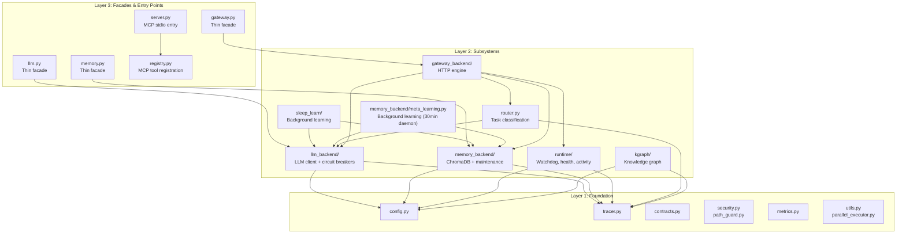

# 🏛️ Core Architecture Reference

> **Status:** v4 — Verified June 2026 against real source via curl on raw.githubusercontent.com
> **Scope:** `core/` module. Tools (`tools/`) and workflows (`workflows/`) covered separately.

The `core/` module is the **foundation layer** of the MCP Agent Stack. It provides configuration, LLM communication, memory, learning, routing, gateway, runtime governance, knowledge graph, and observability — everything the agent needs to think, remember, and act.

---

## 📚 Documentation Index

Each major subsystem has a dedicated document with architecture, API reference, configuration, testing, and AI agent instructions:

| Document | Subsystem | Key Topics |
|----------|-----------|------------|
| [CONFIG.md](CONFIG.md) | Configuration | `.env` loading, model tiers, path hierarchy, validation, gateway config |
| [LLM.md](LLM.md) | LLM Client | Role-based dispatch, circuit breakers, context budgeting, JSON parsing, provider abstraction |
| [MEMORY.md](MEMORY.md) | Memory System | Three collections, four-layer dedup, decay scoring, write/read ops, maintenance |
| [ROUTER.md](ROUTER.md) | Task Router | Model + heuristic routing, confidence guard, complexity scoring, JSON extraction |
| [GATEWAY.md](GATEWAY.md) | REST Gateway | FastAPI endpoints, auth, rate limiting, middleware, SQLite task store, report serving |
| [RUNTIME.md](RUNTIME.md) | Runtime | Activity tracking, cancellation guards, health checks, providers, watchdog, task runner |
| [SLEEP_LEARN.md](SLEEP_LEARN.md) | Background Learning | Feedback processing, distillation, filters, storage, injection, feedback loop |
| [CONTEXT_PRUNER.md](CONTEXT_PRUNER.md) | Context Pruner | Tool-aware truncation, artifact preservation, HTML cleaning, recovery pattern |
| [TRACER.md](TRACER.md) | Observability | Structured logging, trace lifecycle, JSONL files, MCP stdio safety, trace retrieval |
| [KGRAPH.md](KGRAPH.md) | Knowledge Graph | AST parsing, SQLite graph storage, test targeting, project isolation, dependency queries |

---

## 🏗️ Architecture Layers

The core module has three conceptual layers with strict dependency direction:



**Dependency rule:** Layers only import downward. No circular dependencies. Subsystems import from Layer 1 (config, tracer, contracts), never from Layer 3 (facades).

| Layer | Contains | Imports From |
|-------|----------|-------------|
| **Layer 1: Foundation** | config, tracer, contracts, security, path_guard, metrics, utils, parallel_executor | Nothing in `core/` |
| **Layer 2: Subsystems** | llm_backend, memory_backend, sleep_learn, meta_learning, runtime, router, gateway_backend, kgraph | Layer 1 only |
| **Layer 3: Facades** | llm.py, memory.py, gateway.py, server.py, registry.py | Layer 2 (and transitively Layer 1) |

---

## 📦 Module Map

```
core/
├── __init__.py           # Package init — no side effects (daemon moved to server.py)
│
├── config.py             # Singleton Config, .env parsing, path resolution
├── config_validation.py  # Startup validation (paths, models, timeouts)
│
├── tracer.py             # In-memory trace store + JSONL file logging
├── tracer_reader.py      # Trace retrieval (memory fast-path, disk slow-path)
│
├── llm.py                # Thin facade for LLMClient
├── llm_backend/          # Full LLM subsystem
│   ├── client.py         # LLMClient: complete(), call() — imports budget_messages
│   │                     #   from memory_backend/budget.py (NOT llm_backend/rate_limit.py)
│   ├── circuit_breaker.py # Per-model failure tracking with auto-recovery
│   ├── config.py         # RoleConfig + _build_role_configs() — role->provider/model resolution
│   ├── response.py       # LLMResponse dataclass, usage normalization
│   ├── budget.py         # Rate limiting (ThreadSafeRateLimiter) + raw token-count
│   │                     #   truncation (truncate_by_tokens) + cost estimation.
│   │                     #   NOT the cognitive-tier system — see memory_backend/budget.py.
│   ├── provider.py       # BaseProvider ABC + ProviderRegistry
│   ├── factory.py        # create_llm_client() — composition root, provider registration
│   └── providers/
│       ├── lmstudio.py   # Local OpenAI-compatible provider
│       └── openai_compat.py # Cloud provider (OpenAI, DeepSeek, etc.)
│
├── memory.py             # Thin facade for ChromaDBMemory
├── memory_backend/       # Full memory subsystem
│   ├── store.py          # MemoryStore class: collections, _write_lock, stats
│   ├── write_ops.py      # execute_store() — TOCTOU-safe dedup + insert
│   ├── read_ops.py       # execute_recall(), execute_recall_context()
│   ├── scoring.py        # 4-factor confidence scoring + query rewriting
│   ├── maintenance.py    # execute_delete/prune/summarize/stats/diversity_maintenance()
│   ├── telemetry.py      # RecallTracker — RAM buffer, periodic ChromaDB flush
│   ├── eviction.py       # EvictionQueue + flusher_loop() — crash-safe WAL disk spill
│   │                     #   (persists evicted CONTEXT into ChromaDB, NOT a deletion mechanism)
│   ├── janitor.py        # archive_old_episodes() — episodic archival to episodic_archive
│   ├── constants.py      # COLLECTION_PROCEDURAL, META_FIELDS, dedup thresholds
│   ├── client.py         # get_client(timeout=60) — ChromaDB client singleton
│   ├── budget.py         # Cognitive context budgeting — 7-tier ContextClass priority:
│   │                     #   SYSTEM > USER > ERROR > PROCEDURAL > RECENT > OUTPUT > ARCHIVE
│   │                     #   Used by llm_backend/client.py via `from memory_backend.budget
│   │                     #   import budget_messages`. File's own docstring says
│   │                     #   "core/context_budget.py" — stale path from a prior refactor move.
│   ├── pruner.py         # Tool-output context pruning (artifact preservation + truncation)
│   │                     #   Real functions: prune_text(), prune_tool_dict()
│   │                     #   File's own docstring says "core/context_pruner.py" — stale path.
│   ├── meta_learning.py  # distill_and_store() + MetaLearner.run_forever()
│   │                     #   Background daemon (every 30min), NOT inline/immediate.
│   │                     #   Scans in-memory tracer.recent(20). Per-rule confidence: 0.8-0.9.
│   │                     #   Writes to main `procedural` collection.
│   └── procedural/       # distill.py, prompts.py, validate.py — rule distillation
│
├── sleep_learn/          # Background meta-learning daemon (separate from meta_learning.py)
│   ├── daemon.py         # start_background_daemon() — started by server.py explicitly
│   ├── feedback.py       # Pending feedback processing loop (confidence scoring)
│   ├── distiller.py      # Trace analysis -> rule extraction (LLM, 15s VRAM-safety timeout)
│   ├── filters.py        # Quality gates: new rules, dedup, contradictions
│   ├── storage.py        # Write rules to isolated ChromaDB (sleep_learn_db/)
│   ├── injector.py       # Merge rules into Planner system prompt (live on request path)
│   ├── logger.py         # Parse feedback.log for pending entries
│   ├── config.py         # SLEEP_* configuration constants
│   ├── sweeper.py        # Phase-1 only — returns heartbeat, NO LLM/ChromaDB yet
│   └── janitor.py        # Purges stale/low-confidence rules from procedural_meta collection
│
├── contracts.py          # ToolCall/ToolResult schemas, ok()/fail() helpers
├── security.py           # SSRF protection (is_safe_network_address)
├── path_guard.py         # Path validation, root scoping, protected files
├── metrics.py            # Prometheus metrics (nodes, tasks, TDD, tokens)
├── parallel_executor.py  # Parallel tool execution engine (NOT_PARALLEL_SAFE guard)
├── citations.py          # Per-trace citation tracking for research
├── br_validator.py       # Brazilian financial data parser (BRL, dates, tickers)
├── utils.py              # Shared utility helpers (truncation, compression)
│
├── router.py             # TaskRouter: goal -> workflow classification
│
├── kgraph/               # Codebase Knowledge Graph
│   ├── ast_parser.py     # Dedicated AST parsing with LRU cache + thread pool
│   ├── cleanup.py        # Disk space and WAL file management
│   ├── project.py        # ProjectManager: isolation, paths, indexing mode
│   ├── queries.py        # Read-only graph queries (deps, callers, file search)
│   ├── storage.py        # GraphStore: SQLite graph with WAL, thread-local conns
│   ├── test_index.py     # Persistent test index with hybrid validation
│   ├── test_mapper.py    # Source -> test file mapping via AST
│   └── vectors.py        # Project-specific ChromaDB collections
│
├── gateway.py            # Thin facade for FastAPI app
├── gateway_backend/      # Full HTTP gateway
│   ├── factory.py        # App factory, lifespan, middleware, exception handlers
│   ├── dependencies.py   # Auth (Bearer token), DI providers
│   ├── dispatcher.py     # Tool/workflow routing from HTTP payloads
│   ├── exceptions.py     # TaskNotFoundError, ToolExecutionError
│   ├── models.py         # Pydantic request/response schemas
│   ├── store.py          # SQLite task store for async polling
│   └── routes/
│       ├── tasks.py      # POST /task, GET /result/{trace_id}
│       ├── chat.py       # POST /chat (synchronous)
│       ├── health.py     # /health, /version, /tools, /memory/stats
│       ├── metrics.py    # /metrics (Prometheus), /autocode/graph (Mermaid)
│       ├── traces.py     # /traces, /traces/{trace_id}
│       └── reports.py    # /reports/*, /logs/*
│
└── runtime/
    ├── activity_tracker.py # Global activity/idle tracking (inference slots)
    ├── cancellation.py   # Async cancellation guards (prevent ghost mutations)
    ├── health.py         # Health check logic (dirs, LM Studio, ChromaDB, models)
    ├── providers.py      # LLM server provider abstraction (LM Studio, Ollama, vLLM)
    ├── task_runner.py    # Gateway background task executor (ThreadPoolExecutor)
    └── watchdog.py       # Process watchdog (health probe + auto-restart)
```

---

## 🔑 Key Subsystems at a Glance

### Configuration (`config.py`)

Singleton config loaded from `.env` at import time. Tiered model strategy: large for planning, medium for execution, lightweight for sub-tasks.

-> [Full documentation](CONFIG.md)

| Property | Value |
|----------|-------|
| Pattern | Singleton (`cfg`) |
| Validation | Fail-fast at import time |
| Paths | `pathlib.Path` throughout |
| Models | 14 roles across 3 tiers (names configured in `.env`, never hardcoded) |

---

### LLM Backend (`llm_backend/`)

Unified interface for all model interactions. Role-based dispatch, circuit breakers, cognitive context budgeting, structured output.

-> [Full documentation](LLM.md)

| Property | Value |
|----------|-------|
| Entry point | `llm.complete(role, system, user)` |
| Circuit breaker | 3 failures → 60s cooldown → half-open recovery |
| Context budgeting | 7-tier ContextClass priority (SYSTEM > USER > ERROR > PROCEDURAL > RECENT > OUTPUT > ARCHIVE). Lives in `memory_backend/budget.py`, imported by `llm_backend/client.py`. |
| Output modes | text, json (3-layer extraction), tools (tool-loop) |
| Providers | LM Studio, Ollama, vLLM, OpenAI-compatible cloud |

---

### Memory Backend (`memory_backend/`)

Three-collection ChromaDB vector store with decay scoring, four-layer dedup, and two learning subsystems.

-> [Full documentation](MEMORY.md)

| Property | Value |
|----------|-------|
| Collections | episodic, semantic, procedural |
| Dedup | Hash guard → outer vector → inner vector → procedural reinforcement |
| Decay | Episodic/semantic: 30-day half-life. Procedural: bounded decay (floor 0.7) |
| Learning | `meta_learning.py` (30min daemon) + `sleep_learn/` (idle-gated background) |
| Thread safety | `threading.Lock()` per collection + cancellation guards |

---

### Task Router (`router.py`)

Ultra-fast classification layer (15s timeout). Model-based routing with deterministic heuristic fallback. All 15 tools + 5 workflows covered.

-> [Full documentation](ROUTER.md)

| Property | Value |
|----------|-------|
| Primary | Router LLM, 15s timeout, JSON output |
| Fallback | Pre-compiled regex keywords, 18 priority levels |
| Tools covered | 15 (web, python, file, git, memory, agent, notify, report, vision, workflow, cli, browser, tavily, consult, parallel) |
| Workflows | 5 (research, data, autocode, deep_research, understand) |
| Confidence guard | Low confidence → abort + clarifying questions (intercepted in workflow_tool.py) |
| Test constants | `ROUTER_TOOLS`, `ROUTER_WORKFLOWS`, `ROUTER_SYSTEM_PROMPT`, `ROUTER_FEW_SHOT_EXAMPLES` importable by tests |

---

### Knowledge Graph (`kgraph/`)

Deterministic AST-based codebase analysis. Builds dependency graphs, maps source files to tests, provides project-level isolation.

-> [Full documentation](KGRAPH.md)

| Property | Value |
|----------|-------|
| Parsing | Python `ast` module, LRU cache (512), thread pool (2 workers) |
| Storage | SQLite WAL, thread-local connections, checkpoint every 100 writes |
| Test targeting | AST dependency analysis + hybrid validation (mtime + size + MD5) |
| Isolation | Per-project `.understand/` directories + project-specific ChromaDB |
| Limits | 5,000 files foreground, 500MB max project, 1MB max file |

---

### Gateway (`gateway_backend/`)

FastAPI REST API for external clients. Async task submission, synchronous chat, health checks, report serving.

-> [Full documentation](GATEWAY.md)

| Property | Value |
|----------|-------|
| Auth | Bearer token, hard-stop on default secret in production |
| Rate limiting | 30/min chat, 60/min/task |
| Task store | SQLite with WAL mode |
| Middleware | CORS, MaxBodySize (10MB), RequestID |
| Endpoints | /task, /chat, /result, /health/*, /traces, /reports/*, /metrics |

---

### Runtime (`runtime/`)

Process governance layer. Activity tracking, watchdog, health checks, background tasks, cancellation guards.

-> [Full documentation](RUNTIME.md)

| Property | Value |
|----------|-------|
| Activity tracker | Inference slots (max 2), idle detection (2h threshold) |
| Watchdog | HTTP probe every 30s, auto-restart, max 3 per 15min |
| Providers | LM Studio, Ollama, vLLM abstraction |
| Task runner | ThreadPoolExecutor(max_workers=10), 300s timeout |
| Cancellation | `ensure_not_cancelled()` prevents ghost mutations |

---

### Learning Subsystems (`meta_learning.py` + `sleep_learn/`)

Two parallel systems extract procedural rules from execution history. Both write with `source=` tags so `injector.py` can query both collections in one call (split-brain merge, acknowledged in code as `[FIX 8]`).

-> [Full documentation: Sleep & Learn](SLEEP_LEARN.md)

| System | When | Threshold | Collection | Latency |
|--------|------|-----------|------------|---------|
| **`meta_learning.py`** (`MetaLearner.run_forever()`) | Every 30 min (background daemon) | Per-rule: 0.8–0.9 (hardcoded in `_extract_rules_from_trace`) | Main `procedural` | ~30 min lag |
| **`sleep_learn/`** (`start_background_daemon()`) | When idle >1h (`SLEEP_LEARN_IDLE_THRESHOLD_SEC=3600`) | 0.8 (`SLEEP_LEARN_MIN_CONFIDENCE`) | Isolated `procedural_meta` (at `memory_root/sleep_learn_db/`) | Deferred |

> **Note on `meta_learning.py`:** Scans `tracer.recent(n=20)` (in-memory, bounded to 200 traces, lost on restart) — NOT the persistent ChromaDB episodic collection. Rule injection is live on the request path via `sleep_learn/injector.py` regardless of daemon state.

---

### Context Pruner (`memory_backend/pruner.py`)

Tool-aware middleware that truncates massive outputs before they enter the LLM context.

-> [Full documentation](CONTEXT_PRUNER.md)

> **Path note:** The actual file is `core/memory_backend/pruner.py`. Both the file's own docstring and older docs reference the stale path `core/context_pruner.py` — that path does not exist. Real functions: `prune_text()`, `prune_tool_dict()`, `cleanup_old_artifacts()`.

| Property | Value |
|----------|-------|
| Threshold | 8,000 characters (~2,000-2,500 tokens) |
| Strategy | web: head+tail (4k+4k), python_exec/cli: tail-only (8k) |
| Artifacts | Full output saved to `.artifacts/` before truncation |
| Recovery | `_pruned` + `_artifact_path` + `_recovery_hint` in result |

---

### Tracer (`tracer.py`)

Centralized structured logging and trace ID propagation. MCP stdio safe.

-> [Full documentation](TRACER.md)

| Property | Value |
|----------|-------|
| Output | stderr (structlog) + `logs/agent_YYYYMMDD.jsonl` (JSONL, always) |
| Safety | NEVER writes to stdout |
| Storage | In-memory `_TraceStore` (200 traces, FIFO) + persistent JSONL |
| Lifecycle | `new_trace()` → `step()`/`error()`/`warning()` → `finish()` |
| Retrieval | `tracer.get(trace_id)`, `tracer.recent(n)` |
| Flush | `atexit.register(_writer.close)` for graceful shutdown |
| **API** | Methods: `step`, `error`, `warning`, `finish`, `get`, `recent`, `summary`. `tracer.log()` and `tracer.info()` do **NOT** exist — use `tracer.step()`. |

---

## 🛡️ Security & Safety

### SSRF Protection (`security.py`)

`is_safe_network_address()` prevents outbound requests to internal services.

- Resolves hostname to all IPs
- Blocks any IP that is private, loopback, or link-local
- Uses `_DNS_POOL` (ThreadPoolExecutor, max_workers=2) for async resolution
- **TOCTOU note:** DNS rebinding window accepted for local-first deployment; revisit if gateway is ever exposed externally
- **Legacy alias:** `_is_private_or_localhost()` has **inverted** boolean semantics from `is_safe_network_address()` — do not mix them. All real callers (browser, web, tavily) use the new function.

### Path Guard (`path_guard.py`)

- All paths resolved relative to `cfg.agent_root`
- Symlinks validated (must resolve inside root)
- Protected files list prevents accidental deletion of critical configs
- Windows ADS (Alternate Data Streams) blocked

---

## 🧪 Testing Strategy

Each subsystem has a dedicated test directory mirroring the source structure:

```
tests/core/
├── config/          # Config singleton, env loading, validation
├── extras/          # BRL parsing, date validation, ticker lookup
├── gateway/         # FastAPI, middleware, exception handlers
├── kgraph/          # AST parsing, graph queries, test targeting
├── llm/             # LLM client, circuit breakers, context budget
├── memory/          # Collections, dedup, decay, maintenance
├── path_guard/      # Path validation, traversal guards
├── router/          # Routing accuracy, fallback, confidence, drift detection
├── runtime/         # Watchdog, health, cancellation
├── sleep_learn/     # Feedback, distillation, filters, storage
└── tracer/          # Trace lifecycle, JSONL output, MCP safety
```

**Test isolation:** Each test is self-contained (no conftest.py fixtures except where explicitly introduced, e.g. `tests/tools/browser/`). If AsyncMock leaks between tests, add an autouse `mock_cfg` fixture with `MagicMock` to every test file that imports `cfg`.

---

## 🗺️ Standalone Files (Not in Subsystems)

These files are self-contained utilities used across multiple subsystems:

| File | Purpose | Key Functions |
|------|---------|---------------|
| `citations.py` | Per-trace citation tracking | `Citations.add()`, `format_citations()` |
| `parallel_executor.py` | Parallel tool execution | `dispatch_parallel()`, `PARALLEL_SAFE` |
| `br_validator.py` | Brazilian financial data | `parse_brl()`, `validate_ticker()`, `parse_date()` |
| `utils.py` | Shared helpers | `truncate()`, `compress()`, `hash_content()` |
| `config_validation.py` | Startup validation | `validate_config()` — called by both server.py (with graceful ImportError fallback) and gateway factory. |

---

## ⚠️ Active Concerns & Deferred Items

| Priority | Concern | Location | Status | Notes |
|----------|---------|----------|--------|-------|
| 🟡 Medium | Router drift test uses mock registry | `tests/core/router/test_router_drift.py` | Known | Tests manually-maintained `ROUTER_TOOLS` list against prompt; does not call real `register_all_tools()`. Adding a new tool to `tools/` will NOT automatically fail this test. |
| 🟡 Medium | `meta_learning.py` scans in-memory traces only | `core/memory_backend/meta_learning.py` | Known | `tracer.recent(20)` is bounded to 200 traces and lost on restart. Old version read from persistent ChromaDB episodic collection (more durable). Restart-heavy environments lose learning context. |
| 🟡 Medium | Three rule-extraction mechanisms coexist | `distill.py`, `meta_learning.py`, `sleep_learn/distiller.py` | Known | `distill.py`: LLM-based, per-autocode-workflow. `meta_learning.py`: pattern-matching background daemon. `sleep_learn/distiller.py`: LLM-based background daemon. No consolidation plan yet. |
| 🟢 Low | Split-brain unification (meta_learning vs sleep_learn) | `core/memory_backend/`, `core/sleep_learn/` | Partial | Both write to `procedural` with source tags; `injector.py` queries both via `[FIX 8]` merge. Functional but two separate ChromaDB locations. |
| 🟢 Low | Windows file lock on JSONL logs | `core/tracer.py` | Known | `PermissionError` during concurrent access; retry logic in place |
| 🟢 Low | ChromaDB singleton thread-safety (free-threaded Python 3.13+) | `core/sleep_learn/`, `core/kgraph/` | Known | GIL protects today; add locks if moving to free-threaded Python |
| 🟢 Low | DNS pool max_workers=2 may queue under parallel tool load | `core/net/security.py` | Known | Not a concern for local-first; revisit if gateway exposed |
| 🟢 Low | CGNAT/multicast not blocked by SSRF | `core/net/security.py` | Known | `100.64.0.0/10` and multicast pass; low risk for local agent |
| 🟢 Low | Stale internal docstring paths | `memory_backend/budget.py`, `memory_backend/pruner.py`, `memory_backend/meta_learning.py`, `citations.py`, `parallel_executor.py`, `tracer_reader.py`, `runtime/watchdog.py`, `runtime/providers.py` | Known | Each file's own module docstring header references its old pre-refactor path. Cosmetic but misleads doc-generation AIs. |
| ✅ Resolved | Sleep daemon starts on any core import | `core/__init__.py` | **Fixed** | Moved to explicit `_start_sleep_learn()` in `server.py` |
| ✅ Resolved | Tracer kwargs merge order corruption | `core/tracer.py` | **Fixed** | kwargs spread FIRST in step/error/warning/finish |
| ✅ Resolved | Tracer call site signature mismatches | Multiple files | **Fixed** | All 12 call sites use correct positional args |
| ✅ Resolved | ChromaDB singleton resource leaks | Multiple files | **Fixed** | Module-level lazy init with singleton pattern |
| ✅ Resolved | Config validation on startup | `server.py`, `factory.py` | **Fixed** | Explicit validation with graceful degradation |

---

## 🔗 Cross-References

- **Tools:** See `docs/TOOLS.md`
- **Workflows:** See `docs/WORKFLOWS.md`
- **Skills:** See `docs/SKILLS.md`
- **Environment:** See `.env.example` in repo root
