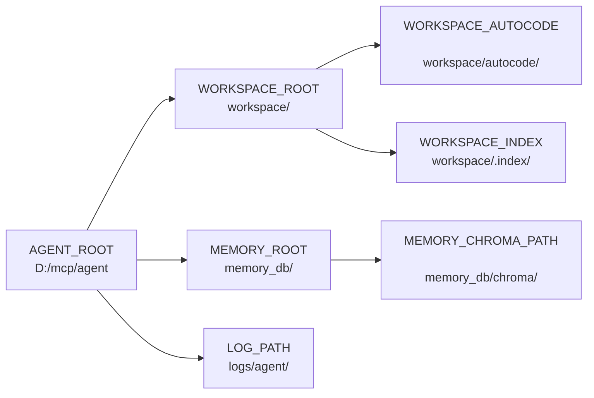

# ⚙️ Configuration System

The configuration system (`core/config.py`) is the **single source of truth** for all runtime settings. It uses a singleton pattern, loads from `.env` at import time, and provides validated, typed access to paths, models, limits, and feature flags.

**Key characteristics:**
- **Singleton** — One `cfg` instance, imported everywhere via `from core.config import cfg`
- **Fail-fast** — Invalid config raises exceptions at import time, preventing silent misconfigurations
- **Pathlib throughout** — All paths are `pathlib.Path` objects (cross-platform)
- **No hardcoding** — Model names, paths, and limits all come from environment variables
- **Tiered model roles** — Separate models for planning, execution, routing, and lightweight sub-tasks

---

## 🚀 Quick Start

```python
from core.config import cfg

# Paths — always Path objects
print(cfg.agent_root)           # Path("D:/mcp/agent")
print(cfg.workspace_root)       # Path("D:/mcp/agent/workspace")
print(cfg.memory_chroma_path)   # Path("D:/mcp/agent/memory_db/chroma")

# Models — loaded from .env, never hardcoded
print(cfg.planner_model)        # "gemma-4-e2b-it@q5_k_s"
print(cfg.executor_model)       # "gemma-2-2b-it"

# Limits — validated integers
print(cfg.autocode_max_retries) # 3
print(cfg.memory_top_k)         # 5

# Protection check
if cfg.is_protected("server.py"):
    print("Cannot edit this file!")  # True
```

---

## 🔄 When to Change What

| Scenario | What to Change | Example |
|----------|---------------|---------|
| Swapping LLM models | `PLANNER_MODEL`, `EXECUTOR_MODEL`, etc. | Switch from Gemma to Qwen |
| Using Ollama instead of LM Studio | `RUNTIME_PROVIDER=ollama` + update `LM_STUDIO_BASE_URL` | Provider abstraction handles the rest |
| Running out of memory | Lower `MAX_CONCURRENT_INFERENCES` | Set to `1` on constrained machines |
| ChromaDB too slow | Reduce `MEMORY_TOP_K`, `MAX_MEMORY_BYTES` | Fewer results, smaller entries |
| Memory rules not appearing | Check `SLEEP_MIN_IDLE_SECONDS`, `SLEEP_CONFIDENCE_THRESHOLD` | Agent must be idle 2h+ by default |
| Gateway exposed to network | Set `GATEWAY_SECRET` + `GATEWAY_CORS_ORIGINS` | Never expose with default secret |
| Autocode timing out | Increase `AUTOCODE_GRAPH_TIMEOUT` | Must be >= largest node timeout |
| SSRF warnings in production | Set `ALLOWED_INTERNAL_HOSTS=` (empty) | Blocks all localhost access |
| Tools hitting character limits | Increase `WEB_MAX_TEXT_CHARS`, `FILE_MAX_READ_CHARS` | Larger context, more memory usage |

---

## ⚙️ Configuration

All paths are `pathlib.Path` objects, resolved to absolute paths. The `_ensure_dirs()` method creates any missing directories at startup.

### Path Hierarchy



### Path Reference

| Config Attribute | Env Variable | Default | Description |
|------------------|--------------|---------|-------------|
| `agent_root` | `AGENT_ROOT` | Parent of `core/` | Root directory of the entire agent codebase |
| `workspace_root` | `WORKSPACE_ROOT` | `{agent_root}/workspace` | Isolated workspace for agent operations (file writes, autocode) |
| `memory_root` | `MEMORY_ROOT` | `{agent_root}/memory_db` | ChromaDB and SQLite storage root |
| `memory_chroma_path` | *(derived)* | `{memory_root}/chroma` | ChromaDB vector store location |
| `memory_db_path` | *(derived)* | `{memory_root}/agent.db` | Agent metadata SQLite DB |
| `task_db_path` | *(derived)* | `{memory_root}/task.db` | Gateway async task queue SQLite DB — **not** `gateway_tasks.db` |
| `workspace_autocode` | *(derived)* | `{workspace_root}/autocode` | Autocode workflow scratch space |
| `workspace_index` | *(derived)* | `{workspace_root}/.index` | File indexing cache |
| `log_path` | *(derived)* | `{agent_root}/logs` | JSONL trace logs directory |
| `agent_log_path` | *(derived)* | `{log_path}/agent` | Agent-specific log subdirectory — undocumented previously |
| `sleep_learn_log_path` | *(derived)* | `{log_path}/sleep_learn` | Sleep & Learn daemon log subdirectory — undocumented previously |

### Path Resolution Helpers

```python
# Resolve relative paths within agent_root
path = cfg.resolve_agent_path("tools/web.py")
# -> Path("D:/mcp/agent/tools/web.py").resolve()

# Resolve relative paths within workspace_root
path = cfg.resolve_workspace_path("data/sales.csv")
# -> Path("D:/mcp/agent/workspace/data/sales.csv").resolve()
```

---

## 📂 Subfile Directory

| File | Description |
|------|-------------|
| [Architecture](config/ARCHITECTURE.md) | File maps, design decisions, mermaid diagrams, source code reference |
| [API Reference](config/API.md) | Model tiers, sub-roles, external services, memory tuning, limits, validation |
| [Changelog](config/CHANGELOG.md) | Version history, breaking changes, completed, roadmap |
| [Instructions](config/INSTRUCTIONS.md) | AI editing rules, NEVER DO, ALWAYS DO, anti-patterns |

---

*Architecture: singleton Config class, .env loading, pathlib paths, tiered model registry, fail-fast validation.*
