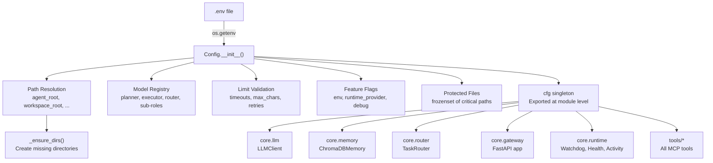
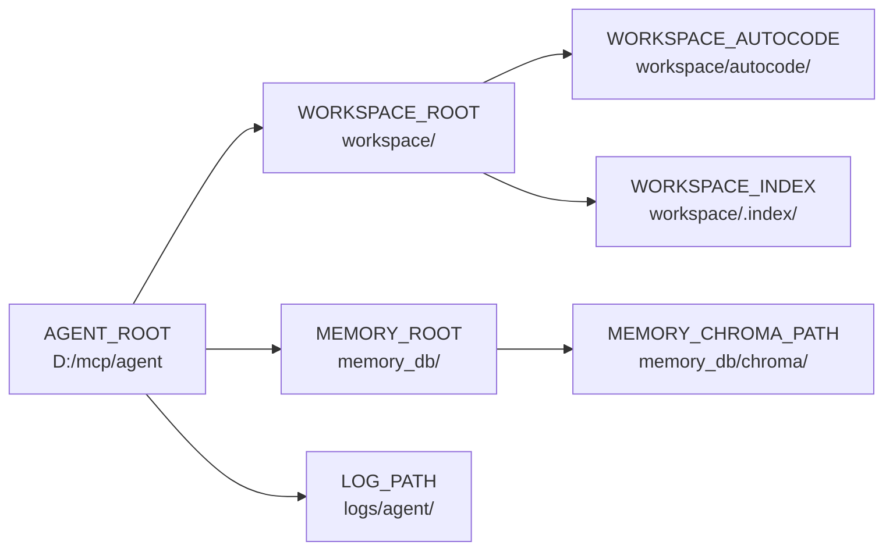
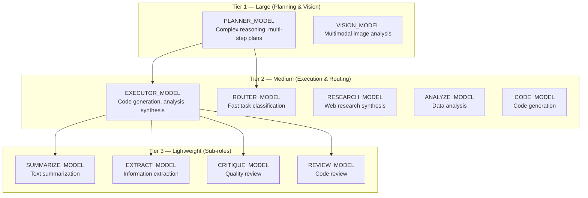
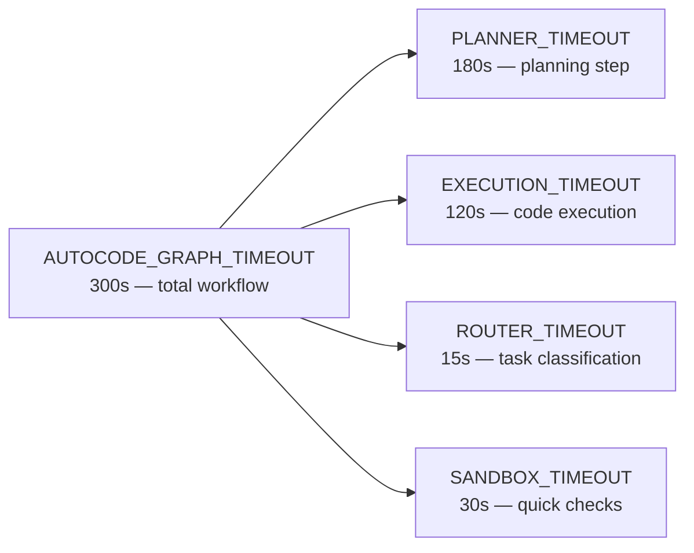

Here's the fully updated `docs/core/CONFIG.md`, restyled after the Browser template:

---

```markdown
# ⚙️ Configuration System

The configuration system (`core/config.py`) is the **single source of truth** for all runtime settings. It uses a singleton pattern, loads from `.env` at import time, and provides validated, typed access to paths, models, limits, and feature flags.

**Key characteristics:**
- **Singleton** — One `cfg` instance, imported everywhere via `from core.config import cfg`
- **Fail-fast** — Invalid config raises exceptions at import time, preventing silent misconfigurations
- **Pathlib throughout** — All paths are `pathlib.Path` objects (cross-platform)
- **No hardcoding** — Model names, paths, and limits all come from environment variables
- **Tiered model roles** — Separate models for planning, execution, routing, and lightweight sub-tasks

---

## 🏗️ Architecture

### How Configuration Flows



### Usage Pattern

```python
from core.config import cfg

# Paths — always Path objects
print(cfg.agent_root)           # Path("D:/mcp/agent")
print(cfg.workspace_root)       # Path("D:/mcp/agent/workspace")
print(cfg.memory_chroma_path)   # Path("D:/mcp/agent/memory_db/chroma")

# Models — loaded from .env, never hardcoded
print(cfg.planner_model)        # "gemma-4-e2b-it@q5_k_s"
print(cfg.executor_model)       # "gemma-2-2b-it"

# Limits — validated integers
print(cfg.autocode_max_retries) # 3
print(cfg.memory_top_k)         # 5

# Protection check
if cfg.is_protected("server.py"):
    print("Cannot edit this file!")  # True
```

---

## 📁 Path Configuration

All paths are `pathlib.Path` objects, resolved to absolute paths. The `_ensure_dirs()` method creates any missing directories at startup.

### Path Hierarchy



### Path Reference

| Config Attribute | Env Variable | Default | Description |
|------------------|--------------|---------|-------------|
| `agent_root` | `AGENT_ROOT` | Parent of `core/` | Root directory of the entire agent codebase |
| `workspace_root` | `WORKSPACE_ROOT` | `{agent_root}/workspace` | Isolated workspace for agent operations (file writes, autocode) |
| `memory_root` | `MEMORY_ROOT` | `{agent_root}/memory_db` | ChromaDB and SQLite storage root |
| `memory_chroma_path` | *(derived)* | `{memory_root}/chroma` | ChromaDB vector store location |
| `memory_db_path` | *(derived)* | `{memory_root}/agent.db` | Agent metadata SQLite DB |
| `task_db_path` | *(derived)* | `{memory_root}/gateway_tasks.db` | Gateway async task queue SQLite DB |
| `workspace_autocode` | *(derived)* | `{workspace_root}/autocode` | Autocode workflow scratch space |
| `workspace_index` | *(derived)* | `{workspace_root}/.index` | File indexing cache |
| `log_path` | *(derived)* | `{agent_root}/logs` | JSONL trace logs directory |

### Path Resolution Helpers

```python
# Resolve relative paths within agent_root
path = cfg.resolve_agent_path("tools/web.py")
# → Path("D:/mcp/agent/tools/web.py").resolve()

# Resolve relative paths within workspace_root
path = cfg.resolve_workspace_path("data/sales.csv")
# → Path("D:/mcp/agent/workspace/data/sales.csv").resolve()
```

---

## 🤖 Model Configuration

Model identifiers are loaded from `.env` and must match **exactly** what appears in your LLM provider's `/v1/models` response. The agent uses a **tiered model strategy**: larger models for complex reasoning, smaller models for fast classification and lightweight tasks.

### Model Tier Strategy



### Core Roles

| Config Attribute | Env Variable | Required | Timeout | Description |
|------------------|--------------|----------|---------|-------------|
| `planner_model` | `PLANNER_MODEL` | ✅ Yes | `PLANNER_TIMEOUT` | Long-context reasoning, memory summaries, planning |
| `executor_model` | `EXECUTOR_MODEL` | ❌ Falls back to planner | `EXECUTOR_TIMEOUT` | Code generation, analysis, synthesis |
| `router_model` | `ROUTER_MODEL` | ❌ Falls back to planner | `ROUTER_TIMEOUT` | Fast task classification (15s default) |
| `vision_model` | `VISION_MODEL` | ❌ Falls back to planner | `VISION_TIMEOUT` | Multimodal image analysis |

### Sub-Role Models

Sub-roles use smaller, faster models for lightweight tasks. Each can be overridden independently or fall back to `EXECUTOR_MODEL`.

| Config Attribute | Env Variable | Fallback | Description |
|------------------|--------------|----------|-------------|
| `summarize_model` | `SUMMARIZE_MODEL` | `executor_model` | Text summarization |
| `extract_model` | `EXTRACT_MODEL` | `executor_model` | Information extraction from documents |
| `research_model` | `RESEARCH_MODEL` | `executor_model` | Web research synthesis |
| `critique_model` | `CRITIQUE_MODEL` | `executor_model` | Quality critique and feedback |
| `analyze_model` | `ANALYZE_MODEL` | `executor_model` | Data analysis |
| `code_model` | `CODE_MODEL` | `executor_model` | Code generation |
| `review_model` | `REVIEW_MODEL` | `executor_model` | Code review |

### Current Model Configuration (Example as this changes frequently, dont take this as facts)

```ini
# ── Tier 1: Planner ─────────────────────────────────────────────────────
PLANNER_MODEL=gemma-4-e2b-it@q5_k_s

# ── Tier 2: Executor  ────────────────────────────────────────────────────
EXECUTOR_MODEL=gemma-2-2b-it
# Executor group (fallback: EXECUTOR_MODEL → PLANNER_MODEL)
SUMMARIZE_MODEL=lfm2-1.2b-tool
EXTRACT_MODEL=lfm2-1.2b-tool
RESEARCH_MODEL=gemma-2-2b-it
CRITIQUE_MODEL=lfm2-1.2b-tool
ANALYZE_MODEL=gemma-2-2b-it
CODE_MODEL=gemma-2-2b-it
REVIEW_MODEL=lfm2-1.2b-tool

# ── Tier 3: Router ───────────────────────────────────────────────
ROUTER_MODEL=gemma-2-2b-it
# Router group (fallback: ROUTER_MODEL → PLANNER_MODEL)
CLASSIFY_MODEL=
ROUTE_MODEL=

# ── Tier 4: Vision  ───────────────────────────────────────────────
# Vision (fallback: VISION_MODEL → PLANNER_MODEL)
VISION_MODEL=

# ── Tier 5: Consultor  ───────────────────────────────────────────────
CONSULTOR_MODEL=
```

> ⚠️ **These are examples.** Model names must match what's loaded in your LLM provider.
> Swap models freely — the tier structure is a guideline, not a hard requirement.

### Model Registry

The `cfg.model_registry` dict provides per-role configuration for the LLMClient:

```python
cfg.model_registry = {
    "planner":   {"model": cfg.planner_model,   "timeout": cfg.planner_timeout},
    "executor":  {"model": cfg.executor_model,  "timeout": cfg.execution_timeout},
    "router":    {"model": cfg.router_model,     "timeout": cfg.router_timeout},
    "vision":    {"model": cfg.vision_model,     "timeout": cfg.vision_timeout},
    "summarize": {"model": cfg.summarize_model,  "timeout": cfg.execution_timeout},
    "extract":   {"model": cfg.extract_model,    "timeout": cfg.execution_timeout},
    "research":  {"model": cfg.research_model,   "timeout": cfg.execution_timeout},
    "critique":  {"model": cfg.critique_model,   "timeout": cfg.execution_timeout},
    "analyze":   {"model": cfg.analyze_model,    "timeout": cfg.execution_timeout},
    "code":      {"model": cfg.code_model,       "timeout": cfg.execution_timeout},
    "review":    {"model": cfg.review_model,     "timeout": cfg.execution_timeout},
    "synthesize":{"model": cfg.synthesize_model, "timeout": cfg.planner_timeout},
}
```

---

## 🌐 External Services

| Config Attribute | Env Variable | Default | Description |
|------------------|--------------|---------|-------------|
| `lm_studio_base_url` | `LM_STUDIO_BASE_URL` | `http://localhost:1234/v1` | OpenAI-compatible LLM endpoint |
| `searxng_url` | `SEARXNG_URL` | `http://localhost:8080` | Privacy-focused search engine |
| `runtime_provider` | `RUNTIME_PROVIDER` | `lmstudio` | LLM server provider (`lmstudio`, `ollama`, `vllm`) |
| `lm_studio_restart_cmd` | `LM_STUDIO_RESTART_CMD` | *(provider default)* | Watchdog restart command override |

### Runtime Providers

The watchdog (`core/runtime/watchdog.py`) can monitor and restart different LLM servers:

| Provider | Health URL | Default Restart Command |
|----------|-----------|------------------------|
| `lmstudio` | `{base_url}/models` | `lms server start` |
| `ollama` | `http://localhost:11434/api/tags` | `ollama serve` |
| `vllm` | `http://localhost:8000/v1/models` | `vllm serve` |

---

## 🧠 Memory Tuning

| Config Attribute | Env Variable | Default | Description |
|------------------|--------------|---------|-------------|
| `memory_delete_threshold` | `MEMORY_DELETE_THRESHOLD` | `0.4` | Decay score below which memories are pruned |
| `memory_decay_days` | `MEMORY_DECAY_DAYS` | `30` | Days until decay floor (0.3) is reached |
| `memory_top_k` | `MEMORY_TOP_K` | `5` | Default results per recall query |
| `memory_max_entry_bytes` | `MAX_MEMORY_BYTES` | `50000` | Max bytes per memory entry (50KB) |
| `max_tags_per_entry` | `MAX_TAGS_PER_ENTRY` | `6` | Max tags per memory entry |
| `max_tag_length` | `MAX_TAG_LENGTH` | `50` | Max characters per tag |
| `embed_model` | `EMBED_MODEL` | `all-MiniLM-L6-v2` | ChromaDB embedding model |

---

## 💤 Sleep & Learn Configuration

The background meta-learning daemon (`core/sleep_learn/`) uses these settings to control when and how it processes feedback.

| Config Attribute | Env Variable | Default | Description |
|------------------|--------------|---------|-------------|
| `SLEEP_MIN_IDLE_SECONDS` | `SLEEP_MIN_IDLE_SECONDS` | `7200` (2h) | Minimum idle time before background learning activates |
| `SLEEP_CHECK_INTERVAL` | `SLEEP_CHECK_INTERVAL` | `600` (10min) | How often to check if agent is idle |
| `SLEEP_FEEDBACK_MIN_AGE_HOURS` | `SLEEP_FEEDBACK_MIN_AGE_HOURS` | `24` | Minimum age of feedback entries before processing |
| `SLEEP_MAX_TRACES` | `SLEEP_MAX_TRACES` | `50` | Maximum traces to analyze per session |
| `SLEEP_CONFIDENCE_THRESHOLD` | `SLEEP_CONFIDENCE_THRESHOLD` | `0.6` | Minimum confidence for rule extraction |
| `SLEEP_REPETITION_THRESHOLD` | `SLEEP_REPETITION_THRESHOLD` | `5` | Minimum repetitions before a pattern becomes a rule |
| `SLEEP_RULE_MAX_CHARS` | `SLEEP_RULE_MAX_CHARS` | `1000` | Maximum characters per extracted rule |

---

## ⚡ Concurrency & Activity

| Config Attribute | Env Variable | Default | Description |
|------------------|--------------|---------|-------------|
| `max_concurrent_inferences` | `MAX_CONCURRENT_INFERENCES` | `2` | Max parallel LLM calls (inference slots) |

The `ActivityTracker` (`core/runtime/activity_tracker.py`) uses this to limit concurrent LLM calls and detect idle periods for background daemons.

---

## 🛠️ Tool & System Limits

### Web Tool

| Config Attribute | Env Variable | Default | Description |
|------------------|--------------|---------|-------------|
| `web_max_text_chars` | `WEB_MAX_TEXT_CHARS` | `8000` | Max characters per scraped page |
| `web_snippet_chars` | `WEB_SNIPPET_CHARS` | `300` | Max characters per search snippet |
| `web_max_search_results` | `WEB_MAX_SEARCH_RESULTS` | `10` | Max search results to return |

### CLI Tool

| Config Attribute | Env Variable | Default | Description |
|------------------|--------------|---------|-------------|
| `cli_max_command_chars` | `CLI_MAX_COMMAND_LENGTH` | `4096` | Max shell command length |
| `cli_max_arguments` | `CLI_MAX_ARGUMENTS` | `20` | Max arguments per command |

### File Tool

| Config Attribute | Env Variable | Default | Description |
|------------------|--------------|---------|-------------|
| `file_max_read_chars` | `FILE_MAX_READ_CHARS` | `50000` | Max characters per file read |

### Autocode & Execution

| Config Attribute | Env Variable | Default | Description |
|------------------|--------------|---------|-------------|
| `execution_timeout` | `EXECUTION_TIMEOUT` | `120` | Seconds for code execution sandbox |
| `sandbox_timeout` | `SANDBOX_TIMEOUT` | `30` | Seconds for quick sandbox checks |
| `autocode_max_retries` | `AUTOCODE_MAX_RETRIES` | `3` | Max TDD iterations before rollback |
| `autocode_max_file_chars` | `AUTOCODE_MAX_FILE_CHARS` | `6000` | Max file size for autocode context |
| `autocode_debug` | `AUTOCODE_DEBUG` | `0` | Set to `1` for verbose trace logging |

### Timeout Hierarchy



| Config Attribute | Env Variable | Default | Description |
|------------------|--------------|---------|-------------|
| `planner_timeout` | `PLANNER_TIMEOUT` | `180` | Planner LLM call timeout (seconds) |
| `execution_timeout` | `EXECUTION_TIMEOUT` | `120` | Executor LLM call timeout (seconds) |
| `router_timeout` | `ROUTER_TIMEOUT` | `15` | Router LLM call timeout (seconds) |
| `vision_timeout` | `VISION_TIMEOUT` | `60` | Vision LLM call timeout (seconds) |
| `autocode_graph_timeout` | `AUTOCODE_GRAPH_TIMEOUT` | `300` | Total autocode workflow timeout (seconds) |

> ⚠️ **Validation:** `autocode_graph_timeout` must be ≥ max(`planner_timeout`, `execution_timeout`, `router_timeout`).

---

## 🌐 Gateway Configuration

The REST gateway (`core/gateway.py`) exposes the agent over HTTP for external clients.

| Config Attribute | Env Variable | Default | Description |
|------------------|--------------|---------|-------------|
| `gateway_host` | `GATEWAY_HOST` | `127.0.0.1` | REST API bind address |
| `gateway_port` | `GATEWAY_PORT` | `8000` | REST API port |
| `gateway_secret` | `GATEWAY_SECRET` | `changeme` | Bearer token for authentication |
| `gateway_cors_origins` | `GATEWAY_CORS_ORIGINS` | `["*"]` | Allowed CORS origins (comma-separated) |
| `gateway_max_body_mb` | `GATEWAY_MAX_BODY_MB` | `10` | Max request body size (MB) |

### Security Guards

| Guard | Condition | Behavior |
|-------|-----------|----------|
| Default secret | `GATEWAY_SECRET == "changeme"` + `ENV != "dev"` | **Hard stop** — refuses to start |
| Default secret | `GATEWAY_SECRET == "changeme"` + `ENV == "dev"` | Warning to stderr |
| Rate limiting | `/chat` | 30 requests/minute |
| Rate limiting | `/task` | 60 requests/minute |
| Payload limit | Any POST/PUT/PATCH | 413 if body > `gateway_max_body_mb` |

---

## 🛡️ Protected Files

The `cfg.protected_files` frozenset lists files that tools are **forbidden from editing**. Reads are always allowed; writes are blocked by `path_guard.check_protected_file()`.

```python
cfg.protected_files = frozenset({
    "server.py",
    "registry.py",
    "core/config.py",
    "core/tracer.py",
    "core/llm.py",
    "core/memory.py",
    "core/gateway.py",
})
```

### Checking Protection

```python
from core.config import cfg

cfg.is_protected("server.py")       # True — core infrastructure
cfg.is_protected("tools/web.py")    # False — safe to edit
cfg.is_protected("core/config.py")  # True — protected
```

**Implementation:** Case-insensitive filename matching. Checks both filename and relative path within `agent_root`. Handles symlinks and path normalization.

---

## 🔒 SSRF Protection

The `cfg.allowed_internal_hosts` frozenset defines which internal hosts network tools can access.

| Config Attribute | Env Variable | Default | Description |
|------------------|--------------|---------|-------------|
| `allowed_internal_hosts` | `ALLOWED_INTERNAL_HOSTS` | `localhost,127.0.0.1,::1` | Comma-separated host allowlist |

### Environment Profiles

| Profile | `ALLOWED_INTERNAL_HOSTS` | Behavior |
|---------|-------------------------|----------|
| **Development** (default) | `localhost,127.0.0.1,::1` | Allows LM Studio, SearXNG, ChromaDB on localhost |
| **Production** | *(empty)* | Blocks **all** private/localhost access |

### Startup Warning

If `allowed_internal_hosts` is non-empty, a one-time warning is logged:
```
[WARNING] SSRF: localhost access allowed by default for development.
Set ALLOWED_INTERNAL_HOSTS='' for production.
```

---

## 🌍 Environment Detection

| Config Attribute | Env Variable | Default | Description |
|------------------|--------------|---------|-------------|
| `env` | `ENV` | `development` | Environment mode: `development` or `production` |
| `is_dev` | *(derived)* | `True` if `env == "development"` | Convenience flag |
| `is_windows` | *(derived)* | `True` if `os.name == "nt"` | Platform detection |

---

## ✅ Validation Rules

The `Config.__init__()` method enforces these validations **at import time**. Invalid config raises `ValueError` or `FileNotFoundError`, preventing the server from starting with bad settings.

Additionally, `core/config_validation.py` runs a second pass at startup (called from `gateway_backend/factory.py`) to verify critical paths exist and required models are configured.

### Path Validations
- `agent_root` must be an absolute path
- `agent_root` must exist on the filesystem

### Limit Validations

| Field | Rule |
|-------|------|
| `autocode_max_retries` | > 0 |
| `autocode_max_file_chars` | > 0 |
| `autocode_graph_timeout` | ≥ max(planner_timeout, execution_timeout, router_timeout) |
| `memory_max_entry_bytes` | 1 – 10,000,000 |
| `max_tags_per_entry` | 1 – 50 |
| `max_tag_length` | 1 – 200 |
| `web_max_text_chars` | 1 – 100,000 |
| `web_snippet_chars` | 1 – 5,000 |
| `web_max_search_results` | 1 – 50 |
| `cli_max_command_chars` | 1 – 49,999 |
| `cli_max_arguments` | 1 – 100 |
| `file_max_read_chars` | 1 – 1,000,000 |

**Failure Mode:** Raises `ValueError` at import time. The server never starts with invalid config.

---

## 🔧 Helper Methods

| Method | Signature | Description |
|--------|-----------|-------------|
| `ensure_dirs()` | `() -> None` | Creates all required directories if they don't exist |
| `resolve_agent_path()` | `(relative: str) -> Path` | Resolves a relative path within `agent_root` |
| `resolve_workspace_path()` | `(relative: str) -> Path` | Resolves a relative path within `workspace_root` |
| `is_protected()` | `(path: str \| Path) -> bool` | Checks if a path matches the protected files list |

---

## 📊 Check `.env.example` For References

---

## 🔀 When to Change What

| Scenario | What to Change | Example |
|----------|---------------|---------|
| Swapping LLM models | `PLANNER_MODEL`, `EXECUTOR_MODEL`, etc. | Switch from Gemma to Qwen |
| Using Ollama instead of LM Studio | `RUNTIME_PROVIDER=ollama` + update `LM_STUDIO_BASE_URL` | Provider abstraction handles the rest |
| Running out of memory | Lower `MAX_CONCURRENT_INFERENCES` | Set to `1` on constrained machines |
| ChromaDB too slow | Reduce `MEMORY_TOP_K`, `MAX_MEMORY_BYTES` | Fewer results, smaller entries |
| Memory rules not appearing | Check `SLEEP_MIN_IDLE_SECONDS`, `SLEEP_CONFIDENCE_THRESHOLD` | Agent must be idle 2h+ by default |
| Gateway exposed to network | Set `GATEWAY_SECRET` + `GATEWAY_CORS_ORIGINS` | Never expose with default secret |
| Autocode timing out | Increase `AUTOCODE_GRAPH_TIMEOUT` | Must be ≥ largest node timeout |
| SSRF warnings in production | Set `ALLOWED_INTERNAL_HOSTS=` (empty) | Blocks all localhost access |
| Tools hitting character limits | Increase `WEB_MAX_TEXT_CHARS`, `FILE_MAX_READ_CHARS` | Larger context, more memory usage |

---

## 🧪 Testing

```powershell
# Validate config without starting the server
python -c "from core.config_validation import validate_config; validate_config()"

# Check what the gateway sees
python -c "from core.runtime.health import get_health; import json; print(json.dumps(get_health(), indent=2))"

# Verify model registry
python -c "from core.config import cfg; [print(f'{k}: {v[\"model\"]}') for k, v in cfg.model_registry.items()]"
```

---

## 🛡️ AI Agent Instructions

If you are an AI assistant modifying `core/config.py`:

1. **Never hardcode model names** — always use `cfg.planner_model`, `cfg.executor_model`, etc. Never write `"gemma"` or `"qwen"` in code.
2. **Preserve validation** — never remove or weaken the validation rules in `__init__()`. They prevent the server from starting with invalid config.
3. **Protected files** — never remove files from `cfg.protected_files` without explicit user approval. These protect core infrastructure.
4. **Pathlib throughout** — all new path attributes must be `pathlib.Path` objects, not strings.
5. **Environment variables** — all new config values must come from `os.getenv()` with sensible defaults. Never hardcode production values.
6. **Singleton pattern** — never instantiate `Config` directly. Always use the `cfg` singleton at module level.
7. **SSRF warning** — never remove the SSRF warning function. It alerts users to production security risks.
8. **Type hints** — all new attributes must have proper type hints.
9. **Update this doc** — when adding new config attributes, update this CONFIG.md.
10. **Backward compatibility** — when renaming env variables, support both old and new names for at least one release cycle.
11. **Sub-role fallback chain** — new sub-role models must fall back to `executor_model`, not `planner_model`. Planner is expensive and reserved for complex reasoning.
12. **Timeout validation** — new timeouts must be validated against `autocode_graph_timeout`.

---

## 🔗 Source Code Reference

| File | Purpose |
|------|---------|
| `core/config.py` | Singleton Config class, `.env` loading, validation, path resolution |
| `core/config_validation.py` | Secondary startup validation (paths, models, timeouts) |
| `core/runtime/providers.py` | Runtime provider abstraction (LM Studio, Ollama, vLLM) |
| `core/runtime/watchdog.py` | Process watchdog (uses `runtime_provider`, `lm_studio_restart_cmd`) |
| `core/runtime/health.py` | Health check (uses paths, models, LM Studio URL) |
| `core/llm_backend/client.py` | LLMClient (uses `model_registry`, timeouts) |
| `core/memory_backend/store.py` | ChromaDBMemory (uses `memory_chroma_path`, tuning params) |
| `core/sleep_learn/config.py` | Sleep & Learn constants (uses `SLEEP_*` env vars) |
| `core/gateway_backend/factory.py` | Gateway app factory (uses gateway config) |

---

## 🔮 Future Enhancements

| Status | Enhancement | Description |
|--------|-------------|-------------|
| 🚧 Planned | Config Hot-Reload | Watch `.env` for changes and reload without restart |
| 🚧 Planned | Config Validation Schema | Use Pydantic for declarative validation rules |
| 🚧 Planned | Config Secrets Manager | Integrate with HashiCorp Vault or AWS Secrets Manager |
| 🚧 Planned | Config Diff Tool | Show what changed between `.env` versions |
| 🚧 Planned | Config Migration | Automatic upgrade of old `.env` formats |

---

*Last updated: June 2026. All model names, timeouts, and limits reflect current source code.*