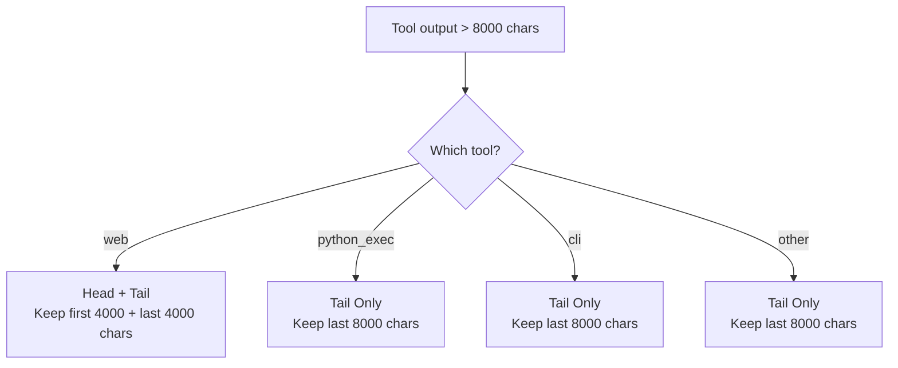

# 🔴 Context Pruner

The Context Pruner (`core/context_pruner.py`) is a **deterministic, tool-aware middleware layer** that intercepts massive tool outputs **before** they enter the LLM context window. It prevents context window overflow, attention dilution, and VRAM OOM crashes on constrained hardware.

**Key characteristics:**
- **Tool-aware truncation** — Different tools have different critical-content locations (errors at end of tracebacks, titles at start of HTML)
- **Artifact preservation** — Full raw output saved to disk before truncation; agent can recover via `file` tool
- **Zero overhead for small outputs** — Outputs under 8,000 chars pass through unchanged
- **Fail-open design** — If artifact saving fails, truncated content is still returned
- **Atomic writes** — Artifacts written to `.tmp` then renamed to prevent half-written files

---

## 🏗️ Architecture

### Why This Exists

When the agent scrapes a web page or runs a Python script that generates a massive dataframe or traceback, the raw output can easily exceed 50,000 characters. Appending this directly to the context causes:

| Problem | Impact |
|---------|--------|
| **Context window overflow** | Crashes the LLM or triggers massive swap lag |
| **Attention dilution** | Planner gets lost in HTML boilerplate, misses the actual content |
| **VRAM OOM** | Next LLM call fails because KV cache can't fit bloated context |

### Interception Boundary

```mermaid
graph TD
    A["Tool Logic<br/>web.py / python_exec.py / cli.py"] --> B["context_pruner.prune()"]
    B --> C{Size check<br/>len(text) <= 8000?}
    C -->|Yes| D["Return unchanged<br/>Zero overhead"]
    C -->|No| E["Step 2: Structural Clean<br/>Strip HTML for web tool"]
    E --> F["Step 3: Artifact Preservation<br/>Save full output to .artifacts/"]
    F --> G["Step 4: Tool-Aware Truncation<br/>head+tail or tail-only"]
    G --> H["Step 5: Metadata Injection<br/>_pruned, _artifact_path, _recovery_hint"]
    H --> I["Safe, bounded output<br/>returned to LLM context"]
```

**Why not the MCP dispatcher?** LangGraph workflows import tools directly (e.g., `from tools.web import web`). If the pruner lived in `server.py`, autonomous workflows would bypass it and still crash. The pruner must live where the tools live.

### The 5-Step Pipeline

| Step | Action | Purpose | Overhead |
|------|--------|---------|----------|
| **1. Size Check** | `len(text) <= 8000` → return as-is | Zero overhead for small outputs | O(1) |
| **2. Structural Clean** | Strip HTML tags via regex (web tool) | Removes ~80% of web bloat instantly | O(n) |
| **3. Artifact Preservation** | Save full raw text to `.artifacts/` | Full fidelity never lost; agent can recover | O(n) disk I/O |
| **4. Tool-Aware Truncation** | Keep critical portions based on tool type | Preserves the content that matters | O(1) |
| **5. Metadata Injection** | Add `_pruned`, `_artifact_path`, `_recovery_hint` | Tells LLM what happened and how to recover | O(1) |

---

## ✂️ Tool-Aware Truncation

Different tools have different critical-content locations. The pruner uses tool-specific strategies:



| Tool | Strategy | Rationale |
|------|----------|-----------|
| `web` | **Head + Tail** (4k + 4k) | Page title and metadata at start; main content often at end |
| `python_exec` | **Tail only** (8k) | Errors and tracebacks appear at the end of output |
| `cli` | **Tail only** (8k) | Command results and errors appear at the end |
| Other | **Tail only** (8k) | Default: assume critical content is at the end |

### Web Structural Cleaning

For the `web` tool, Step 2 strips HTML before truncation:

| What's Removed | What's Preserved |
|----------------|-----------------|
| `<script>` tags and contents | `<title>` text |
| `<style>` tags and contents | `<h1>`–`<h6>` text |
| HTML comments (`<!-- -->`) | `<p>` text |
| Opening/closing tags (`<div>`, `</div>`, etc.) | `<a href>` links |
| Attributes (`class=`, `style=`, etc.) | `<td>`, `<th>` table content |
| Whitespace normalization | `<pre>`, `<code>` content |

This typically removes ~80% of raw HTML while preserving readable text.

---

## 📦 Artifact Lifecycle

### Storage

Full raw outputs are saved to disk before truncation:

```
D:/mcp/agent/workspace/.artifacts/
├── abc123_web_1a2b3c4d.txt           # Full scraped HTML
├── def456_python_exec_5e6f7a8b.txt   # Full pandas output
├── ghi789_cli_9c0d1e2f.txt           # Full CLI stdout
└── jkl012_python_exec_3a4b5c6d.txt   # Full pytest traceback
```

**Filename format:** `{trace_id}_{tool}_{uuid_hex_8chars}.txt`

**Size limits:**
- Maximum artifact size: 10MB (`MAX_ARTIFACT_BYTES`)
- Artifacts larger than this are skipped (truncation still happens, just no recovery file)

### Atomic Writes


This prevents the Planner from reading a half-written file if the server crashes mid-write.

### Automatic Cleanup

| Trigger | Action | TTL |
|---------|--------|-----|
| Server startup | `cleanup_old_artifacts()` — delete files older than TTL | 7 days |
| On-demand | Manual cleanup via file tool | N/A |

### Recovery Pattern

When the LLM sees `_pruned: true` in a tool result, it knows to recover the full output:

```json
{
  "status": "success",
  "output": "First 4000 chars... [7,234 chars truncated] ...last 4000 chars",
  "_pruned": true,
  "_artifact_path": ".artifacts/abc123_web_1a2b3c4d.txt",
  "_recovery_hint": "Use file(path='.artifacts/abc123_web_1a2b3c4d.txt') to read full output."
}
```

**LLM recovery action:**
```python
# The LLM can read the full output when needed
file(action="read_file", path=".artifacts/abc123_web_1a2b3c4d.txt")
```

---

## 📡 API Reference

### `prune_output()` — Main Entry Point

```python
from core.context_pruner import prune_output

result = prune_output(
    text=raw_output,
    tool="python_exec",
    trace_id="abc123",
)
```

| Param | Type | Default | Description |
|-------|------|---------|-------------|
| `text` | `str` | — | **Required.** Raw tool output |
| `tool` | `str` | `""` | Tool name (determines truncation strategy) |
| `trace_id` | `str` | `""` | Trace identifier (used in artifact filename) |

**Returns:** `dict` with keys:
- `output` — Truncated (or unchanged) text
- `_pruned` — `bool`, `True` if truncation occurred
- `_artifact_path` — Path to full output file (if pruned)
- `_recovery_hint` — Instructions for the LLM to recover full output

### `cleanup_old_artifacts()` — Maintenance

```python
from core.context_pruner import cleanup_old_artifacts

cleanup_old_artifacts(max_age_days=7)
```

| Param | Type | Default | Description |
|-------|------|---------|-------------|
| `max_age_days` | `int` | `7` | Delete artifacts older than this |

---

## ⚙️ Configuration

| Setting | Default | Description |
|---------|---------|-------------|
| `MAX_CHARS` | `8000` | Hard character limit for truncated outputs (~2,000–2,500 tokens) |
| `MAX_ARTIFACT_BYTES` | `10MB` | Skip saving artifacts larger than this |
| Cleanup TTL | `7 days` | Artifacts older than this are auto-deleted on startup |

### Why 8,000 Characters?

The `MAX_CHARS` value is calibrated for **16GB VRAM hardware** with multiple models loaded:

| Component | VRAM Usage |
|-----------|-----------|
| Planner model (9B, Q5_K_S) | ~6GB |
| Executor model (2B) | ~2GB |
| Router model (2B) | ~2GB |
| ChromaDB embeddings | ~500MB |
| OS + overhead | ~2GB |
| **Remaining for KV cache** | **~3.5GB** |

8,000 characters ≈ 2,000–2,500 tokens. Combined with system prompt (~1,000 tokens) and conversation history (~2,000 tokens), this leaves enough room for the model to generate a response without OOM.

> ⚠️ **Never increase `MAX_CHARS` without VRAM analysis.** On 16GB hardware with 2 models loaded, exceeding ~12,000 chars per tool output risks OOM on the next LLM call.

---

## 🔒 Security & Safety

| Feature | Implementation | Prevents |
|---------|---------------|----------|
| **Atomic writes** | Write to `.tmp`, fsync, rename | Half-written files read by Planner |
| **Path sanitization** | `uuid4().hex[:6]` in filenames | Path traversal attacks |
| **No user input in paths** | All filename components are generated | Injection via crafted tool output |
| **Fail-open design** | Truncation succeeds even if artifact save fails | Tool call failures due to disk issues |
| **Size cap on artifacts** | `MAX_ARTIFACT_BYTES = 10MB` | Disk bloat from massive outputs |

---

## 🔀 When to Use vs. Alternatives

| Scenario | Solution | Why |
|----------|----------|-----|
| Tool output < 8,000 chars | Pass through unchanged | No overhead needed |
| Tool output > 8,000 chars | `prune_output()` | Truncate + save artifact |
| LLM needs full output after truncation | `file(action="read_file", path=artifact_path)` | Recovery via file tool |
| Context window full from conversation | `context_budget.budget_messages()` | Different system — manages message history |
| System prompt too long | `llm_backend/context_budget.py` | Different system — manages prompt assembly |

> **Important distinction:** The Context Pruner handles **individual tool outputs** that are too large. The Context Budget handles **aggregate message history** that exceeds the context window. They operate at different levels:
>
> - **Pruner** = single output, before it enters the conversation
> - **Budget** = entire conversation, before it's sent to the LLM

---

## 🧪 Testing

```powershell
# Run all context pruner tests
D:\mcp\agent\venv\Scripts\pytest.exe tests/core/test_context_pruner.py -v

# Test web HTML cleaning
D:\mcp\agent\venv\Scripts\pytest.exe tests/core/test_context_pruner.py -k "web" -v

# Test python_exec tail-only truncation
D:\mcp\agent\venv\Scripts\pytest.exe tests/core/test_context_pruner.py -k "python" -v

# Test artifact preservation
D:\mcp\agent\venv\Scripts\pytest.exe tests/core/test_context_pruner.py -k "artifact" -v

# Test small output passthrough
D:\mcp\agent\venv\Scripts\pytest.exe tests/core/test_context_pruner.py -k "small" -v
```

**Mock strategy:**
- Mock filesystem for artifact writes (use `tmp_path`)
- Mock `cfg.workspace_root` for artifact path resolution
- Test with real HTML for structural cleaning validation

---

## ⚠️ Known Concerns

> **Note:** These are MiMo's observations from source code review. They are constructive suggestions, not definitive prescriptions.

### Context Pruner Location vs. Context Budget

**What exists:**
- `core/context_pruner.py` — sits in `core/`, handles individual tool output truncation
- `core/llm_backend/context_budget.py` — sits in `core/llm_backend/`, handles aggregate message budgeting
- `core/llm_backend/budget.py` — raw token truncation utility

**The concern:**
Three context-related modules in two locations. The pruner is in `core/` but is primarily used by tools. The budget is in `llm_backend/` but the pruner is outside it. This creates confusion about which module handles what.

**Suggestion:**
Move `context_pruner.py` into `core/llm_backend/` alongside the other context management modules. The pruner and budget serve complementary purposes and should be co-located for discoverability.

### Two Token Estimation Factors

**What exists:**
- `context_budget.py` uses `// 3.5` for token estimation
- `budget.py` uses `// 4` for token estimation
- `context_pruner.py` uses character count directly (8,000 chars)

**The concern:**
Three different approaches to "how big is too big" — characters (pruner), tokens with 3.5 factor (cognitive budget), tokens with 4 factor (raw budget). This produces inconsistent thresholds.

**Suggestion:**
Standardize on a single token estimation factor and apply it consistently. Use the pruner's character-based approach for individual outputs (it's fast and deterministic) but document the token equivalence clearly.

---

## 🛡️ AI Agent Instructions

If you are an AI assistant modifying the context pruner:

1. **Never remove artifact preservation** — the full output must always be saved to disk before truncation. The agent must be able to recover lost content.
2. **Never bypass tool-aware truncation** — different tools have different critical-content locations. A `python_exec` traceback needs the tail; a `web` scrape needs the head and tail.
3. **Never move the pruner to the MCP dispatcher** — LangGraph workflows import tools directly and would bypass it. The pruner must live where the tools can reach it.
4. **Never increase `MAX_CHARS` without VRAM analysis** — 8,000 chars is calibrated for 16GB hardware with Qwen 9B + Granite MoE loaded.
5. **Always preserve structured metadata** — the `_pruned`, `_artifact_path`, and `_recovery_hint` keys are how the LLM knows to recover missing data.
6. **Atomic writes** — always write to `.tmp` first, then rename. Never write directly to the final filename.
7. **Fail-open** — if artifact saving fails, still return the truncated content. Never let a disk error cause a tool call to fail.
8. **Path sanitization** — never use user input or tool output in artifact filenames. Always use `uuid4().hex[:6]`.
9. **Cleanup** — `cleanup_old_artifacts()` must be called at startup to prevent silent disk bloat. Never remove this.

---

## 🔗 Source Code Reference

| File | Purpose |
|------|---------|
| `core/context_pruner.py` | Main pruner: `prune_output()`, `cleanup_old_artifacts()`, structural cleaning |
| `tools/web.py` | Calls `prune_output(tool="web")` before returning |
| `tools/python_exec.py` | Calls `prune_output(tool="python_exec")` before returning |
| `tools/cli.py` | Calls `prune_output(tool="cli")` before returning |
| `core/llm_backend/context_budget.py` | Complementary: manages aggregate message history budget |
| `core/llm_backend/budget.py` | Complementary: raw token truncation utility |
| `server.py` | Calls `cleanup_old_artifacts()` at startup |

---

## 🔮 Future Roadmap

| Status | Enhancement | Description |
|--------|-------------|-------------|
| ✅ Complete | 5-step pipeline | Size check, clean, artifact, truncate, metadata |
| ✅ Complete | Tool-aware truncation | Different strategies for web, python_exec, cli |
| ✅ Complete | Artifact preservation | Full output saved to disk with atomic writes |
| ✅ Complete | Recovery pattern | `_pruned` + `_artifact_path` + `_recovery_hint` |
| ✅ Complete | Automatic cleanup | 7-day TTL on startup |
| 🚧 Planned | Keyword-aware extraction | For `python_exec`: detect `Traceback`/`Exception`, preserve ±1000 chars around matches |
| 🚧 Planned | DataFrame schema compression | For pandas: convert to `{shape, dtypes, head(), tail(), null_summary}` |
| 🚧 Planned | Async artifact writes | Use `asyncio.to_thread()` for non-blocking disk I/O |
| 🚧 Planned | Smart content extraction | Use LLM to extract key information instead of blind truncation |

---

*Last updated: June 2026. All truncation strategies, configuration values, and tool integrations reflect current source code in `core/context_pruner.py`.*