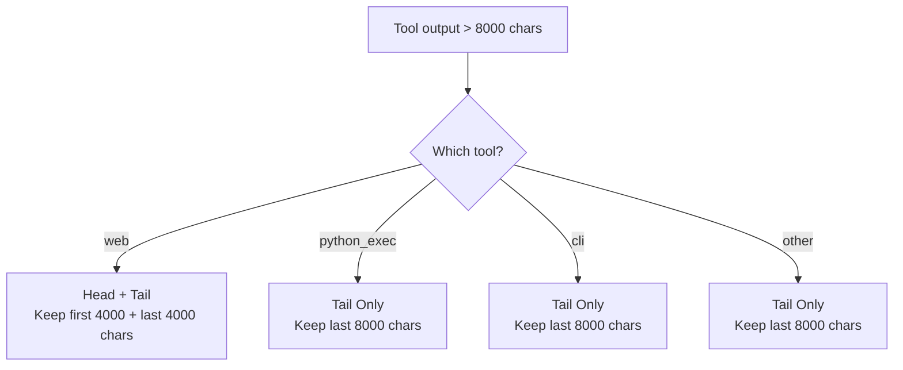

# 🔴 Context Pruner

The Context Pruner (`core/memory_backend/pruner.py` — **not** `core/context_pruner.py`; that path hasn't existed since this code moved into `memory_backend/`, though the module's own internal docstring is itself stale and still says `core/context_pruner.py`) is a **deterministic, tool-aware middleware layer** that intercepts massive tool outputs **before** they enter the LLM context window. It prevents context window overflow, attention dilution, and VRAM OOM crashes on constrained hardware.

**Key characteristics:**
- **Tool-aware truncation** — Different tools have different critical-content locations (errors at end of tracebacks, titles at start of HTML)
- **Artifact preservation** — Full raw output saved to disk before truncation; agent can recover via `file` tool
- **Zero overhead for small outputs** — Outputs under 8,000 chars pass through unchanged
- **Fail-open design** — If artifact saving fails, truncated content is still returned
- **Atomic writes** — Artifacts written to `.tmp` then renamed to prevent half-written files
- **Two entry points, not one** — `prune_text(tool_name, text, trace_id="")` for raw strings and `prune_tool_dict(tool_name, data, trace_id="")` for dict results — there is no single unified `prune()`/`prune_output()` function

---

## 🏗️ Architecture

### Why This Exists

When the agent scrapes a web page or runs a Python script that generates a massive dataframe or traceback, the raw output can easily exceed 50,000 characters. Appending this directly to the context causes:

| Problem | Impact |
|---------|--------|
| **Context window overflow** | Crashes the LLM or triggers massive swap lag |
| **Attention dilution** | Planner gets lost in HTML boilerplate, misses the actual content |
| **VRAM OOM** | Next LLM call fails because KV cache can't fit bloated context |

### Interception Boundary

```mermaid
graph TD
    A["Tool Logic<br/>web.py / python_exec.py / cli.py"] --> A2["web.py only: BeautifulSoup HTML extraction<br/>happens BEFORE the pruner, inside web.py itself"]
    A2 --> B["prune_text() or prune_tool_dict()<br/>core/memory_backend/pruner.py"]
    B --> C{Size check<br/>len(text) <= 8000?}
    C -->|Yes| D["Return unchanged<br/>Zero overhead"]
    C -->|No| F["Artifact Preservation<br/>Save full output to .artifacts/"]
    F --> G["Tool-Aware Truncation<br/>head+tail or tail-only"]
    G --> H["Metadata Injection<br/>_pruned, _artifact_path, _recovery_hint"]
    H --> I["Safe, bounded output<br/>returned to LLM context"]
```

**Why not the MCP dispatcher?** LangGraph workflows import tools directly (e.g., `from tools.web import web`). If the pruner lived in `server.py`, autonomous workflows would bypass it and still crash. The pruner must live where the tools live.

### The Real Pipeline (4 steps, not 5)

There is no "Structural Clean / strip HTML" step *inside* the pruner module itself — that's a separate step performed by `tools/web.py` via BeautifulSoup, before `web.py` ever calls into the pruner. The pruner's own pipeline is:

| Step | Action | Purpose | Overhead |
|------|--------|---------|----------|
| **1. Size Check** | `len(text) <= 8000` → return as-is | Zero overhead for small outputs | O(1) |
| **2. Artifact Preservation** | Save full raw text to `.artifacts/` (skipped if it exceeds `MAX_ARTIFACT_BYTES`) | Full fidelity never lost; agent can recover | O(n) disk I/O |
| **3. Tool-Aware Truncation** | Keep critical portions based on tool type | Preserves the content that matters | O(1) |
| **4. Metadata Injection** | Add `_pruned`, `_artifact_path`, `_recovery_hint` | Tells LLM what happened and how to recover | O(1) |

---

## ✂️ Tool-Aware Truncation

Different tools have different critical-content locations. The pruner uses tool-specific strategies:



| Tool | Strategy | Rationale |
|------|----------|-----------|
| `web` | **Head + Tail** (4k + 4k) | Page title and metadata at start; main content often at end |
| `python_exec` | **Tail only** (8k) | Errors and tracebacks appear at the end of output |
| `cli` | **Tail only** (8k) | Command results and errors appear at the end |
| Other | **Tail only** (8k) | Default: assume critical content is at the end |

### Web Structural Cleaning (lives in `tools/web.py`, not the pruner)

This step has nothing to do with `pruner.py` — it's BeautifulSoup-based HTML extraction inside `tools/web.py`'s `_html_to_text()`, which runs *before* the pruner is ever called. The real logic is simpler than "preserve these tags, strip those tags": `<script>`, `<style>`, `<nav>`, `<footer>`, `<header>`, `<aside>`, `<noscript>`, and `<iframe>` tags are removed entirely (`.decompose()`), the page title is extracted separately, then the best content container is picked (`<main>` → `<article>` → an element whose `id`/`class` matches `content|main|article|post` → `<body>` → the whole soup, in that priority order), and `.get_text()` is called on it — which strips **every** remaining tag uniformly and returns plain text. There's no selective preservation of `<a href>` links, table structure, or `<pre>`/`<code>` formatting; it's flat text extraction, not structure-aware extraction.

This extraction has its own independent length cap, `cfg.web_max_text_chars` (`WEB_MAX_TEXT_CHARS` env var, defaults to 8,000 — same default as the pruner's `MAX_CHARS`, but a separately configurable value). The text is truncated here first; the pruner's own `prune_tool_dict()` check downstream is usually a no-op for `web` results since the text is typically already under budget by the time it gets there.

---

## 📦 Artifact Lifecycle

### Storage

Full raw outputs are saved to disk before truncation:

```
D:/mcp/agent/.artifacts/                  # cfg.agent_root / ".artifacts" — NOT workspace/.artifacts
├── abc123_web_1a2b3c.txt              # Full scraped HTML (6 hex chars, not 8)
├── def456_python_exec_5e6f7a.txt      # Full pandas output
├── ghi789_cli_9c0d1e.txt              # Full CLI stdout
└── notrace_python_exec_3a4b5c.txt     # trace_id falls back to literal "notrace" if empty
```

**Filename format:** `{trace_id or 'notrace'}_{tool_name}_{uuid4().hex[:6]}.txt` — **6 hex characters, not 8** (the doc previously contradicted itself: this section said 8, the Security section below correctly said 6 — verified against source, 6 is correct).

**Size limits:**
- Maximum artifact size: 10MB (`MAX_ARTIFACT_BYTES`) — confirmed accurate
- Artifacts larger than this are skipped (truncation still happens, just no recovery file)

### Atomic Writes


> ⚠️ There is no explicit `fsync()` call in the real code — just `Path.write_text()` followed by `os.replace()`. The rename itself is atomic (a reader never sees a half-written file), but without an explicit flush+fsync, data could theoretically still be lost on a hard power-loss crash before the OS flushes its write buffers. This is a real gap if true crash-durability matters here, not just half-write protection.

This prevents the Planner from reading a half-written file if the server crashes mid-write.

### Automatic Cleanup

| Trigger | Action | TTL |
|---------|--------|-----|
| Server startup | `cleanup_old_artifacts()` — delete files older than TTL | 7 days |
| On-demand | Manual cleanup via file tool | N/A |

### Recovery Pattern

When the LLM sees `_pruned: true` in a `prune_tool_dict()` result, it knows to recover the full output:

```json
{
  "status": "success",
  "output": "First 4000 chars... [7,234 chars truncated] ...last 4000 chars",
  "_pruned": true,
  "_original_chars": 15234,
  "_truncated_chars": 8000,
  "_artifact_path": ".artifacts/abc123_web_1a2b3c.txt",
  "_recovery_hint": "Use file(path='.artifacts/abc123_web_1a2b3c.txt') to read full output."
}
```

(`prune_text()`, used for raw-string tool outputs, doesn't return this structured shape at all — it appends a `[⚠️ CONTEXT PRUNED]` warning with the same information directly into the returned text string. See [API Reference](#-api-reference) above for the distinction.)

**LLM recovery action:**
```python
# The LLM can read the full output when needed
file(action="read_file", path=".artifacts/abc123_web_1a2b3c.txt")
```

---

## 📡 API Reference

> ⚠️ There is no `prune_output()` function. The real API is two separate functions, both in `core/memory_backend/pruner.py`.

### `prune_text()` — For Raw String Output

```python
from core.memory_backend.pruner import prune_text

truncated_text = prune_text(
    tool_name="python_exec",
    text=raw_output,
    trace_id="abc123",
)
# Returns a plain str — already truncated and with a recovery note appended if pruned.
# Note the param order: tool_name, text, trace_id (positional) — not text, tool, trace_id.
```

| Param | Type | Default | Description |
|-------|------|---------|--------------|
| `tool_name` | `str` | — | **Required.** Determines truncation strategy |
| `text` | `str` | — | **Required.** Raw tool output |
| `trace_id` | `str` | `""` | Trace identifier (used in artifact filename; falls back to `"notrace"` if empty) |

**Returns:** `str` — not a dict. If pruning occurred, a recovery note is appended directly to the truncated text (not returned as separate structured metadata).

### `prune_tool_dict()` — For Dict-Shaped Tool Results

```python
from core.memory_backend.pruner import prune_tool_dict

result = prune_tool_dict(
    tool_name="web",
    data={"status": "success", "output": raw_output},
    trace_id="abc123",
)
```

| Param | Type | Default | Description |
|-------|------|---------|--------------|
| `tool_name` | `str` | — | **Required.** Determines truncation strategy |
| `data` | `dict` | — | **Required.** Checks specific hardcoded field names, in order: top-level `data["data"]` (if a string), then `target["text"]`, then `target["output"]`, then each item's `"text"` field inside a `target["results"]` list (`target` is `data["data"]` if that's itself a dict — i.e. the `ok()`/`fail()` contract's nested-data convention — otherwise `target` is `data` itself) |
| `trace_id` | `str` | `""` | Trace identifier |

**Returns:** the same `dict`, mutated in place — pruned fields replaced with truncated text, plus top-level metadata keys (`_pruned`, `_original_chars`, `_truncated_chars`, `_artifact_path`, `_recovery_hint`) added only if at least one field needed pruning.

> ⚠️ **Edge case:** if more than one field in the same call needs pruning (e.g. both `text` and `output` are oversized), each gets its own artifact saved to disk, but the metadata dict only keeps **one** `_artifact_path`/`_recovery_hint` — whichever field was processed last overwrites the others (`all_meta.update(meta)` per field, in the fixed order above). The LLM would see a recovery hint pointing to only one of the saved artifacts.

### `cleanup_old_artifacts()` — Maintenance

```python
from core.context_pruner import cleanup_old_artifacts

cleanup_old_artifacts(max_age_days=7)
```

| Param | Type | Default | Description |
|-------|------|---------|-------------|
| `max_age_days` | `int` | `7` | Delete artifacts older than this |

---

## ⚙️ Configuration

| Setting | Default | Description |
|---------|---------|-------------|
| `MAX_CHARS` | `8000` | Hard character limit for truncated outputs (~2,000–2,500 tokens) |
| `MAX_ARTIFACT_BYTES` | `10MB` | Skip saving artifacts larger than this |
| Cleanup TTL | `7 days` | Artifacts older than this are auto-deleted on startup |

### Why 8,000 Characters?

The `MAX_CHARS` value is calibrated for **16GB VRAM hardware** with multiple models loaded:

| Component | VRAM Usage |
|-----------|-----------|
| Planner model (9B, Q5_K_S) | ~6GB |
| Executor model (2B) | ~2GB |
| Router model (2B) | ~2GB |
| ChromaDB embeddings | ~500MB |
| OS + overhead | ~2GB |
| **Remaining for KV cache** | **~3.5GB** |

8,000 characters ≈ 2,000–2,500 tokens. Combined with system prompt (~1,000 tokens) and conversation history (~2,000 tokens), this leaves enough room for the model to generate a response without OOM.

> ⚠️ **Never increase `MAX_CHARS` without VRAM analysis.** On 16GB hardware with 2 models loaded, exceeding ~12,000 chars per tool output risks OOM on the next LLM call.

---

## 🔒 Security & Safety

| Feature | Implementation | Prevents |
|---------|---------------|----------|
| **Atomic writes** | Write to `.tmp`, then `os.replace()` rename | Half-written files read by Planner (does **not** prevent loss on hard crash before OS flush — see note above) |
| **Path sanitization** | `uuid4().hex[:6]` in filenames | Path traversal attacks |
| **No user input in paths** | All filename components are generated | Injection via crafted tool output |
| **Fail-open design** | Truncation succeeds even if artifact save fails | Tool call failures due to disk issues |
| **Size cap on artifacts** | `MAX_ARTIFACT_BYTES = 10MB` | Disk bloat from massive outputs |

---

## 🔀 When to Use vs. Alternatives

| Scenario | Solution | Why |
|----------|----------|-----|
| Tool output < 8,000 chars | Pass through unchanged | No overhead needed |
| Tool output > 8,000 chars | `prune_text()` (raw string) or `prune_tool_dict()` (dict result) | Truncate + save artifact |
| LLM needs full output after truncation | `file(action="read_file", path=artifact_path)` | Recovery via file tool |
| Context window full from conversation | `core/memory_backend/budget.py`'s `budget_messages()` | Different system — manages message history |
| System prompt too long | Same module — `budget_messages()` pins `SYSTEM`/`USER` and trims everything else | Different system — manages prompt assembly |

> **Important distinction:** The Context Pruner handles **individual tool outputs** that are too large. The Context Budget handles **aggregate message history** that exceeds the context window. They operate at different levels:
>
> - **Pruner** = single output, before it enters the conversation
> - **Budget** = entire conversation, before it's sent to the LLM

---

## 🧪 Testing

```powershell
# Run all context pruner tests
D:\mcp\agent\venv\Scripts\pytest.exe tests/core/memory/test_pruner.py -v

# Test web HTML cleaning
D:\mcp\agent\venv\Scripts\pytest.exe tests/core/memory/test_pruner.py -k "web" -v

# Test python_exec tail-only truncation
D:\mcp\agent\venv\Scripts\pytest.exe tests/core/memory/test_pruner.py -k "python" -v

# Test artifact preservation
D:\mcp\agent\venv\Scripts\pytest.exe tests/core/memory/test_pruner.py -k "artifact" -v

# Test small output passthrough
D:\mcp\agent\venv\Scripts\pytest.exe tests/core/memory/test_pruner.py -k "small" -v
```

**Mock strategy:**
- Mock filesystem for artifact writes (use `tmp_path`)
- Mock `cfg.agent_root` for artifact path resolution (**not** `cfg.workspace_root` — the artifact dir is `agent_root / ".artifacts"`)
- Test with real HTML for structural cleaning validation (note: that cleaning lives in `tools/web.py`, not this module — see [Tool-Aware Truncation](#%EF%B8%8F-tool-aware-truncation) above)

---

## ⚠️ Known Concerns

> **Note:** This section was rewritten after verifying every claim against live source. The original (attributed to MiMo's review) was built on `core/context_pruner.py` and `core/llm_backend/context_budget.py` — neither exists.

### The "three modules in two locations" framing doesn't match reality

There are genuinely two systems doing two different jobs — this pruner (per-tool-output truncation) and `core/memory_backend/budget.py` (aggregate message-history budgeting) — but they're not actually scattered across `core/` vs `llm_backend/` as previously described. Both real files live under `core/memory_backend/`, right next to each other:
- `core/memory_backend/pruner.py` (this module)
- `core/memory_backend/budget.py` (the cognitive budgeting system)

`core/llm_backend/budget.py` is a *third*, unrelated file (rate limiting + cost estimation) that happens to share a name with the second one — that naming collision across subsystems is the real source of confusion here, not file placement. See [LLM.md's Known Concerns](./LLM.md#%EF%B8%8F-known-concerns) for the full treatment.

**Suggestion:** rename `core/llm_backend/budget.py` to something unambiguous (e.g. `rate_limit.py`), and fix both `pruner.py`'s and `memory_backend/budget.py`'s stale internal docstrings (both still self-identify by their pre-move `core/context_*.py` paths).

### Genuinely different truncation units, but not three of them

- `pruner.py` truncates by raw character count (`MAX_CHARS = 8000`) — no token estimation involved at all for the pruning decision itself.
- `memory_backend/budget.py` estimates tokens via `len(text) / 3.5`.
- `llm_backend/budget.py` estimates tokens via tiktoken (if installed) or `len(text) // 4`, for rate-limiting/cost purposes — unrelated to either of the above.

These don't need to be reconciled into one factor — they're solving different problems (a hard character cap for an individual tool output vs. a token budget for an entire message list vs. a cost estimate for rate limiting) and none of them currently feed into each other incorrectly.

---

## 🛡️ AI Agent Instructions

If you are an AI assistant modifying the context pruner:

1. **Never remove artifact preservation** — the full output must always be saved to disk before truncation. The agent must be able to recover lost content.
2. **Never bypass tool-aware truncation** — different tools have different critical-content locations. A `python_exec` traceback needs the tail; a `web` scrape needs the head and tail.
3. **Never move the pruner to the MCP dispatcher** — LangGraph workflows import tools directly and would bypass it. The pruner must live where the tools can reach it.
4. **Never increase `MAX_CHARS` without VRAM analysis** — 8,000 chars is calibrated for ~16GB VRAM with multiple models loaded simultaneously (the specific models in use are a `.env` choice, not a source-code fact — don't assume any particular model combination from this doc).
5. **Always preserve structured metadata** — the `_pruned`, `_artifact_path`, and `_recovery_hint` keys are how the LLM knows to recover missing data.
6. **Atomic writes** — always write to `.tmp` first, then rename. Never write directly to the final filename.
7. **Fail-open** — if artifact saving fails, still return the truncated content. Never let a disk error cause a tool call to fail.
8. **Path sanitization** — never use user input or tool output in artifact filenames. Always use `uuid4().hex[:6]`.
9. **Cleanup** — `cleanup_old_artifacts()` must be called at startup to prevent silent disk bloat. Never remove this.

---

## 🔗 Source Code Reference

| File | Purpose |
|------|---------|
| `core/memory_backend/pruner.py` | `prune_text()`, `prune_tool_dict()`, `cleanup_old_artifacts()` — **not** `prune_output()`, and **not** `core/context_pruner.py` |
| `tools/web.py` | `_html_to_text()` (BeautifulSoup extraction, separate from the pruner) then `prune_tool_dict("web", result, trace_id)` |
| `tools/python_exec.py` | `prune_text("python_exec", text, trace_id)` |
| `tools/cli.py` | `prune_text("cli", text, trace_id)` |
| `core/memory_backend/budget.py` | Complementary: manages aggregate message history budget (`budget_messages()`) — **not** `core/llm_backend/context_budget.py` |
| `core/llm_backend/budget.py` | A different, unrelated file: rate limiting + cost estimation, not message budgeting |
| `server.py` | Calls `cleanup_old_artifacts(max_age_days=7)` at startup |

---

## 🔮 Future Roadmap

| Status | Enhancement | Description |
|--------|-------------|-------------|
| ✅ Complete | 4-step pipeline | Size check, artifact save, truncate, metadata (HTML cleaning is a separate step in `tools/web.py`, not part of this pipeline) |
| ✅ Complete | Tool-aware truncation | Different strategies for web, python_exec, cli |
| ✅ Complete | Artifact preservation | Full output saved to disk with atomic writes |
| ✅ Complete | Recovery pattern | `_pruned` + `_artifact_path` + `_recovery_hint` |
| ✅ Complete | Automatic cleanup | 7-day TTL on startup |
| 🚧 Planned | Keyword-aware extraction | For `python_exec`: detect `Traceback`/`Exception`, preserve ±1000 chars around matches |
| 🚧 Planned | DataFrame schema compression | For pandas: convert to `{shape, dtypes, head(), tail(), null_summary}` |
| 🚧 Planned | Async artifact writes | Use `asyncio.to_thread()` for non-blocking disk I/O |
| 🚧 Planned | Smart content extraction | Use LLM to extract key information instead of blind truncation |

---

*This file was corrected against live source — see chat history for the full list of fabricated functions/files removed and wrong values corrected. Truncation strategies and configuration values now reflect `core/memory_backend/pruner.py`.*