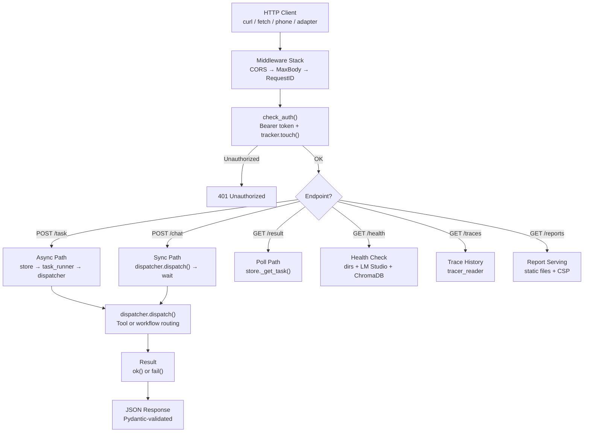
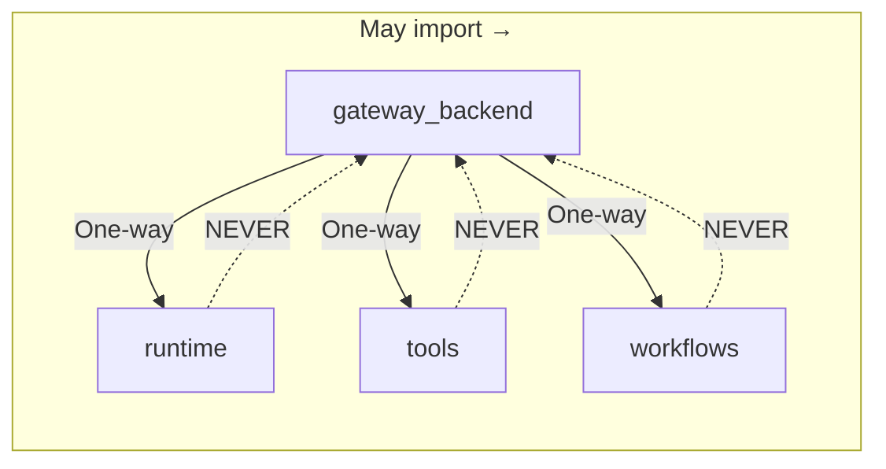
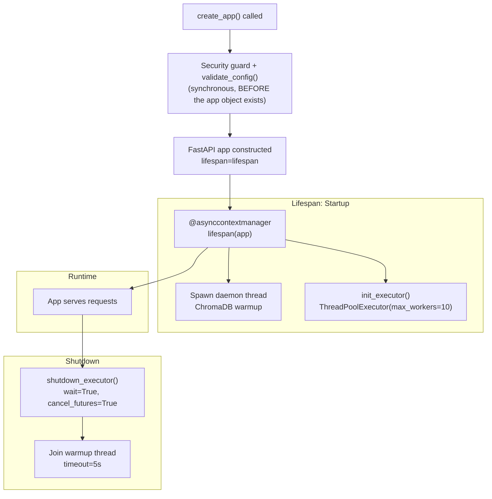
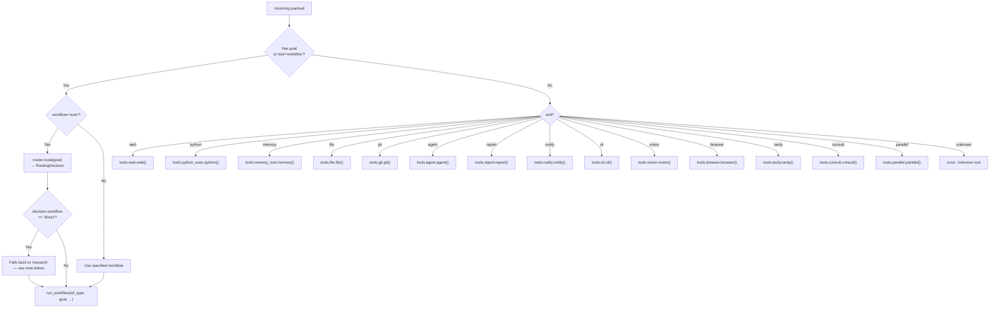
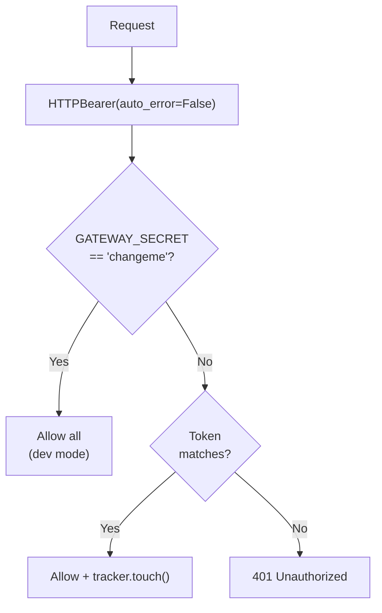

# 🌐 Gateway

The Gateway (`core/gateway.py`) is the **HTTP edge** of the MCP Agent Stack. It exposes the agent's cognitive runtime, tools, and workflows over a REST API so external clients (second PC, phone, browser, messaging adapters) can interact with it.

**Key characteristics:**
- **Thin facade pattern** — `core/gateway.py`'s app-creation logic is one line (`app = create_app()`); the file itself is 76 lines total once you include its docstring and a standalone `uvicorn` runner block for `python -m core.gateway` usage. All actual routing/middleware/business logic lives in `core/gateway_backend/`.
- **Async task submission** — Submit tasks, get `trace_id` immediately, poll for results
- **Synchronous chat** — Block-and-wait for quick interactions
- **Bearer token auth** — Configurable secret, hard-stop in production with default
- **Rate limiting** — 30/min on `/chat`, 60/min on `/task` via slowapi
- **Centralized error handling** — Zero try/except boilerplate in routes
- **Contract-locked responses (partial)** — Pydantic `response_model` on `/task`, `/result/{id}`, and `/chat` only — see [Pydantic Contract Locking](#pydantic-contract-locking--only-3-of-16-endpoints) for the rest

---

## 🏗️ Architecture

### Component Map

```
core/gateway.py                     # Thin facade (~10 lines)
core/gateway_backend/
├── factory.py                      # FastAPI creation, lifespan, middleware, exception handlers
├── dependencies.py                 # Auth (Bearer token), DI providers
├── dispatcher.py                   # Tool/workflow routing from HTTP payloads
├── exceptions.py                   # TaskNotFoundError, ToolExecutionError
├── models.py                       # Pydantic request/response schemas
├── store.py                        # SQLite task store for async polling
└── routes/
    ├── tasks.py                    # POST /task, GET /result/{trace_id}
    ├── chat.py                     # POST /chat (synchronous)
    ├── health.py                   # /health, /version, /tools, /memory/stats, /health/*
    ├── metrics.py                  # /metrics (Prometheus), /autocode/graph (Mermaid)
    ├── traces.py                   # /traces, /traces/{trace_id}
    └── reports.py                  # /reports/*, /logs/*, /api/reports

core/runtime/
├── task_runner.py                  # ThreadPoolExecutor & timeout monitoring
└── activity_tracker.py             # Idle detection (tracker.touch() on every request)
```

### Request Flow



### Domain Boundaries (Ironclad Rules)



| Rule | Description |
|------|-------------|
| **One-way dependencies** | `gateway_backend` may import from `runtime`, `tools`, `workflows`. None may import from `gateway_backend`. |
| **No HTTP in Runtime** | `task_runner.py` knows nothing about FastAPI, HTTP, or SQLite. It only accepts Python callables. |
| **No App State Leakage** | Routes never use `request.app.state.foo`. All shared resources injected via `Depends()`. |
| **Pure Functions for Storage** | `store.py` uses per-operation connections + global thread lock. No open connections. |

---

## 🚀 Lifecycle & Middleware Stack

### Startup / Shutdown



> ⚠️ `validate_config()` is **not** a lifespan startup step — it runs synchronously inside `create_app()`, before the `FastAPI` instance (and therefore the lifespan context manager) is even constructed.

### Middleware Order

| Order | Middleware | Config | Description |
|-------|-----------|--------|-------------|
| 1 | **CORS** | `GATEWAY_CORS_ORIGINS` (default `["*"]`) | Cross-origin request handling |
| 2 | **MaxBodySize** | `GATEWAY_MAX_BODY_MB` (default `10`) | Rejects POST/PUT/PATCH > limit with 413 |
| 3 | **RequestID** | Auto-generated UUID | Injects `request.state.trace_id`, echoes `X-Request-ID` header |

### ChromaDB Warmup

At startup, the gateway spawns a daemon thread that calls `recall("warmup", top_k=1)` to force ChromaDB to load the embedding model. This prevents 30-60s cold-start latency on the first real memory call.

| Behavior | Implementation |
|----------|---------------|
| Thread | Daemon thread (non-blocking) |
| Timeout | 60s hard timeout via `ThreadPoolExecutor` |
| On timeout | Proceeds in "degraded mode", logs warning |
| On success | Logs elapsed time to stderr |

> ⚠️ **Note:** The warmup is non-blocking — the server starts accepting requests before warmup completes. Early requests may hit cold ChromaDB.

---

## 📡 Endpoints

### Task Submission (Async)

#### `POST /task` — Submit Async Task

```bash
curl -X POST http://localhost:8000/task \
  -H "Authorization: Bearer $GATEWAY_SECRET" \
  -H "Content-Type: application/json" \
  -d '{"goal": "Research ChromaDB best practices", "workflow": "auto"}'
```

**Response:**
```json
{
  "trace_id": "abc-123-def",
  "status": "submitted",
  "poll_url": "/result/abc-123-def"
}
```

**Request Body (`TaskRequest`):**

| Field | Type | Default | Description |
|-------|------|---------|-------------|
| `goal` | `str?` | `null` | Task description (triggers workflow routing) |
| `workflow` | `str?` | `"auto"` | Workflow type (`auto`, `research`, `data`, `autocode`) |
| `tool` | `str?` | `null` | Direct tool name (bypasses workflow) |
| `action` | `str?` | `null` | Tool action |
| `params` | `dict?` | `null` | Tool-specific parameters |
| `platform` | `str?` | `"api"` | Source platform identifier |
| `user` | `str?` | `null` | User identifier |

**Flow:**
1. Validate request via Pydantic
2. Create trace via `tracer.new_trace()`
3. Store task in SQLite (`store._store_task()`)
4. Submit to `task_runner.run_background_task()` (300s timeout)
5. Return immediately with `trace_id` and `poll_url`

#### `GET /result/{trace_id}` — Poll for Result

```bash
curl -H "Authorization: Bearer $GATEWAY_SECRET" \
  http://localhost:8000/result/abc-123-def
```

**Response:**
```json
{
  "trace_id": "abc-123-def",
  "status": "success",
  "result": {"summary": "ChromaDB best practices include..."},
  "error": null,
  "elapsed": 12.3
}
```

**Status values:** `pending` → `running` → `success` | `failed` | `unknown`

**Fallback:** If task not found in SQLite, checks in-memory tracer for traces that completed before the store was updated.

---

### Chat (Synchronous)

#### `POST /chat` — Synchronous Chat

```bash
curl -X POST http://localhost:8000/chat \
  -H "Authorization: Bearer $GATEWAY_SECRET" \
  -H "Content-Type: application/json" \
  -d '{"message": "What is ChromaDB?"}'
```

**Response:**
```json
{
  "trace_id": "abc-123-def",
  "status": "success",
  "result": {"summary": "ChromaDB is an open-source vector database..."},
  "platform": "api"
}
```

**Request Body (`ChatRequest`):**

| Field | Type | Required | Description |
|-------|------|----------|-------------|
| `message` | `str` | ✅ Yes | User message (becomes the goal) |
| `platform` | `str?` | No (default `"api"`) | Source platform |
| `user` | `str?` | No | User identifier |

**Use `/task` for long-running workflows.** `/chat` blocks until completion.

---

### Health & System

| Endpoint | Auth | Description |
|----------|------|-------------|
| `GET /health` | No | Full health check (dirs, LM Studio, ChromaDB, models) |
| `GET /health/autocode` | Bearer | Autocode-specific health (optional `?deep=true` for LM Studio probe) |
| `GET /health/circuit-breakers` | Bearer | LLM circuit breaker states per **role** (gated behind `cfg.enable_metrics_endpoint`) |
| `GET /health/models` | Bearer | Check if required models are loaded in LM Studio |
| `GET /version` | No | Git commit, branch, environment |
| `GET /tools` | Bearer | List of available tools — see note below |
| `GET /memory/stats` | Bearer | ChromaDB collection counts and sizes |

> ⚠️ **This is a real code gap, not just a doc gap:** `/tools`' static fallback list (used when the registry hasn't been scanned yet) is still `["web", "python", "file", "git", "vision", "memory", "agent", "notify", "report", "workflow"]` — missing `cli`, `browser`, `tavily`, `consult`, `parallel`. The dispatcher *can* route to all 14 tools; this fallback list just doesn't know about the 5 newest ones. Only matters when the registry hasn't populated yet (e.g. the gateway process started before `register_all_tools()` ran).

#### Health Response

```json
{
  "status": "healthy",
  "timestamp": 1718820000,
  "env": "development",
  "checks": {
    "dir_agent_root": {"status": "ok", "path": "D:/mcp/agent"},
    "lm_studio": {"status": "ok", "url": "http://localhost:1234/v1"},
    "chromadb": {"status": "ok", "client": "initialized"},
    "models": {
      "planner": {"status": "ok", "model": "gemma-4-e2b-it@q5_k_s"},
      "executor": {"status": "ok", "model": "gemma-2-2b-it"}
    }
  }
}
```

#### Circuit Breaker Monitoring

> ⚠️ This endpoint returns `{"status": "ok", "breakers": null}` by default — `llm.circuit_breaker_states` returns `None` unless `cfg.enable_metrics_endpoint` is truthy. When enabled, keys are **role names** (`"planner"`, `"executor"`), not model identifiers, and the field is `failure_count`, not `failures`. Full details: [LLM.md → Circuit Breaker](./LLM.md#%EF%B8%8F-circuit-breaker).

```json
{
  "status": "ok",
  "breakers": {
    "planner": {"state": "closed", "failure_count": 0, "timeout_seconds": 180, "time_since_last_failure": 0.0},
    "executor": {"state": "half-open", "failure_count": 3, "timeout_seconds": 120, "time_since_last_failure": 121.4}
  }
}
```

---

### Telemetry

| Endpoint | Auth | Content-Type | Description |
|----------|------|-------------|-------------|
| `GET /metrics` | Bearer | `text/plain` (Prometheus) | Node durations, task statuses, TDD iterations, LLM tokens |
| `GET /autocode/graph` | Bearer | `text/plain` (Mermaid) | Autocode state machine flowchart |

---

### Traces

| Endpoint | Auth | Description |
|----------|------|-------------|
| `GET /traces` | Bearer | List recent traces (default limit: 10, configurable via `?limit=N`) |
| `GET /traces/{trace_id}` | Bearer | Full execution timeline for a specific trace |

**Trace retrieval priority:**
1. In-memory store (last 200 traces, fast)
2. JSONL disk scan (last 14 days, slow)

---

### Reports & Logs

| Endpoint | Auth | Content-Type | Description |
|----------|------|-------------|-------------|
| `GET /api/reports` | Bearer | `application/json` | JSON array of all reports with metadata |
| `GET /reports/{trace_id}/` | Bearer | `text/html` | HTML directory listing of trace files |
| `GET /reports/{trace_id}/{filename}` | Bearer | Various | Serve specific report file |
| `GET /logs/` | Bearer | `text/html` | HTML directory listing of log files |
| `GET /logs/{filename}` | Bearer | `text/plain` | Serve specific log file |

**Security:**
- All file paths resolved and checked to stay within `workspace/reports/` or `logs/agent/` — but via **two different mechanisms**, not one unified check. `trace_id` (a path *segment*) is sanitized with a character whitelist (`isalnum()` or `-`/`_`, everything else replaced with `_` — this neutralizes `..` by turning it into `__`). `filename` (within a trace dir, or in `/logs/{filename}`) is checked separately via `Path.resolve().startswith()` against the parent directory.
- CSP headers on HTML responses — **but not the strict policy this doc previously claimed.** The real policy: `default-src 'self'; script-src 'unsafe-inline' https://cdn.jsdelivr.net https://cdn.tailwindcss.com; style-src 'unsafe-inline' https://cdn.tailwindcss.com; img-src 'self' data:; frame-ancestors 'none'; connect-src 'none';` — it explicitly allows inline scripts and scripts from two CDN origins, plus inline styles and data: images. If report content ever became attacker-influenced, this CSP would not block inline-script execution.
- Cache-Control: `no-store, private` on all responses
- Log file extension whitelist: `.jsonl`, `.json`, `.txt`, `.log` — **this whitelist only applies to `/logs/{filename}`**, not `/reports/{trace_id}/{filename}`, which serves any extension (falling back to `application/octet-stream` for unrecognized types)

---

## 🔀 Dispatcher

The dispatcher (`core/gateway_backend/dispatcher.py`) routes incoming payloads to the appropriate tool or workflow.

### Routing Logic



> ⚠️ **Undocumented edge case:** if you submit `{"tool": "workflow", "goal": "...", "workflow": "auto"}` and the router's heuristics decide the goal matches a *direct tool* pattern (e.g. "read this file"), the dispatcher has no path back to actually invoking that tool from inside the workflow branch — it silently falls back to running the `research` workflow instead. This only matters for the `tool == "workflow"` / goal-based entry path; submitting via `tool="file"` directly works as expected.

### Tool List

| Tool | Import | Description |
|------|--------|-------------|
| `web` | `tools.web.web()` | Web scraping, search |
| `python` | `tools.python_exec.python()` | Python code execution |
| `memory` | `tools.memory_tool.memory()` | ChromaDB read/write |
| `file` | `tools.file.file()` | File operations |
| `git` | `tools.git.git()` | Git operations |
| `agent` | `tools.agent.agent()` | Agent delegation — **not** `tools.agent_tool` (renamed in Phase 3) |
| `report` | `tools.report.report()` | Report generation — **not** `tools.report_tool` (renamed in Phase 3) |
| `notify` | `tools.notify.notify()` | Notifications |
| `cli` | `tools.cli.cli()` | CLI command execution |
| `vision` | `tools.vision.vision()` | Image analysis |
| `browser` | `tools.browser.browser()` | Browser automation — added in the router-expansion commit |
| `tavily` | `tools.tavily.tavily()` | AI-powered search — added in the router-expansion commit |
| `consult` | `tools.consult.consult()` | Cross-model consultation — added in the router-expansion commit |
| `parallel` | `tools.parallel.parallel()` | Concurrent tool fan-out — added in the router-expansion commit |
| `workflow` | `workflows.base.run_workflow()` | Multi-step workflows |

**All imports are lazy** (inside the function) to avoid circular imports and reduce startup cost.

---

## 🔐 Authentication & Security

### Bearer Token Auth



> The "warn loudly to stderr" behavior for dev-mode-with-default-secret happens **once, at startup**, inside `create_app()` — not on every individual request. `check_auth()` itself just checks the token; it doesn't re-print a warning per call.

**Every auth check also calls `tracker.touch()`** to update idle detection for background daemons — this happens unconditionally, before the secret check, regardless of auth outcome.

### Security Guards

| Guard | Condition | Behavior |
|-------|-----------|----------|
| **Default secret in production** | `GATEWAY_SECRET == "changeme"` AND `ENV != "dev"` | **Hard stop** — `SystemExit(1)` |
| **Default secret in dev** | `GATEWAY_SECRET == "changeme"` AND `ENV == "dev"` | Warning to stderr, continue |
| **Rate limit: /chat** | 30 requests/minute per IP | 429 Too Many Requests |
| **Rate limit: /task** | 60 requests/minute per IP | 429 Too Many Requests |
| **Payload limit** | POST/PUT/PATCH > `GATEWAY_MAX_BODY_MB` | 413 Payload Too Large |
| **Path traversal** | Report/log serving | 403 Forbidden |
| **File extension** | Log serving | 400 if not `.jsonl/.json/.txt/.log` |

---

## 📊 SQLite Task Store

The async task store (`core/gateway_backend/store.py`) persists task state for polling.

### Schema

```sql
CREATE TABLE tasks (
    trace_id  TEXT PRIMARY KEY,
    status    TEXT NOT NULL DEFAULT 'pending',
    submitted REAL NOT NULL,
    completed REAL,
    result    TEXT,
    error     TEXT,
    payload   TEXT
);
```

### Configuration

| Setting | Value | Purpose |
|---------|-------|---------|
| Path | `{memory_root}/gateway_tasks.db` | SQLite database location |
| Journal mode | WAL | Write-ahead logging for concurrency |
| Busy timeout | 5000ms | Wait before SQLITE_BUSY error |
| WAL checkpoint | 1000 pages | Prevents unbounded `.wal` growth |
| Thread safety | `check_same_thread=False` | Cross-thread access |
| Lock | `threading.Lock()` | Global write lock |

### Task Lifecycle

```mermaid
graph LR
    A["POST /task<br/>_store_task()"] --> B["pending"]
    B --> C["_update_task('running')"]
    C --> D["running"]
    D --> E["dispatcher.dispatch()"]
    E -->|Success| F["_update_task('success', result)"]
    E -->|Error| G["_update_task('failed', error)"]
    E -->|Timeout (300s)| H["_update_task('failed', 'timeout')"]
    F --> I["Terminal state"]
    G --> I
    H --> I
```

---

## 🔧 Error Handling

### Centralized Exception Handlers

Routes contain **zero** `try/except` boilerplate for tool execution. If a tool fails, the route raises a domain exception. Global handlers in `factory.py` catch these:

| Exception | HTTP Status | When |
|-----------|-------------|------|
| `TaskNotFoundError` | 404 | `trace_id` not found in store or tracer |
| `ToolExecutionError` | 500 | Tool or workflow fails during dispatch |
| `Exception` (catch-all) | 500 | Any unhandled exception |

### Response Format

All error responses follow a consistent schema:

```json
{
  "error": "Task not found",
  "trace_id": "abc-123-def",
  "detail": "trace_id 'abc-123-def' not found"
}
```

### Pydantic Contract Locking — Only 3 of ~16 Endpoints

> ⚠️ The claim "all endpoints use `response_model`" does not hold. Verified directly against every route file: only `POST /task`, `GET /result/{id}`, and `POST /chat` actually declare a `response_model`. Every other endpoint — `/version`, `/health`, `/health/autocode`, `/health/circuit-breakers`, `/health/models`, `/tools`, `/memory/stats`, `/metrics`, `/autocode/graph`, `/traces`, `/traces/{id}`, `/api/reports`, `/reports/*`, `/logs/*` — returns either a raw `dict` or a raw `Response`/`FileResponse`/`HTMLResponse` object with no Pydantic contract at all. A refactor to any of those endpoints **could** silently strip a field a client depends on, with nothing in FastAPI to catch it.

| Model | Endpoint | Fields |
|-------|----------|--------|
| `TaskSubmitResponse` | `POST /task` | `trace_id`, `status="submitted"`, `poll_url` |
| `TaskResultResponse` | `GET /result/{id}` | `trace_id`, `status`, `result`, `error`, `elapsed` |
| `ChatResponse` | `POST /chat` | `trace_id`, `status`, `result`, `error`, `platform` |

This guarantees contract stability for these three endpoints only — not the other ~13.

> ⚠️ **Separate finding:** `ChatResponse.status` is hardcoded to `"success"` in `chat.py` whenever `dispatcher.dispatch()` returns *without raising* — it never inspects the returned `result` dict's own `status` field. A dispatch that resolves to `{"status": "error", "error": "Unknown tool: 'xyz'"}` (an error signaled via the result, not an exception) still comes back as a 200 response with the outer `"status": "success"`. Client code that checks the top-level `status` field rather than `result.status` would miss this category of failure.

---

## ⚙️ Configuration

| Env Variable | Default | Description |
|--------------|---------|-------------|
| `GATEWAY_HOST` | `127.0.0.1` | REST API bind address |
| `GATEWAY_PORT` | `8000` | REST API port |
| `GATEWAY_SECRET` | `changeme` | Bearer token for authentication |
| `GATEWAY_CORS_ORIGINS` | `["*"]` | Allowed CORS origins (comma-separated) |
| `GATEWAY_MAX_BODY_MB` | `10` | Max request body size (MB) |
| `ENV` | `development` | Environment mode |

### CORS Configuration

```ini
# Development (default)
GATEWAY_CORS_ORIGINS=*

# Production — restrict to specific origins
GATEWAY_CORS_ORIGINS=https://myapp.com,https://admin.myapp.com
```

---

## 🧪 Testing

```powershell
# Run all gateway tests (single file, not three separate ones — see below)
D:\mcp\agent\venv\Scripts\pytest.exe tests/core/gateway/test_gateway.py -v

# Run a specific layer by test class
D:\mcp\agent\venv\Scripts\pytest.exe tests/core/gateway/test_gateway.py -k "TestSQLiteTaskStore" -v
D:\mcp\agent\venv\Scripts\pytest.exe tests/core/gateway/test_gateway.py -k "TestGatewayEndpoints" -v
D:\mcp\agent\venv\Scripts\pytest.exe tests/core/gateway/test_gateway.py -k "TestReportRoutes" -v
```

> ⚠️ There is no `test_store.py`, `test_routes.py`, or `test_integration.py` — all gateway tests live in one file, `tests/core/gateway/test_gateway.py`, organized internally into four classes: `TestWarmupMemory`, `TestSQLiteTaskStore`, `TestGatewayEndpoints`, `TestReportRoutes`.

### Testing Layers

| Layer | What | How | Monkeypatch? |
|-------|------|-----|-------------|
| **Layer 1: Pure Unit** | `store.py` directly (`TestSQLiteTaskStore`) | Isolated `tmp_path` SQLite databases | No |
| **Layer 2: Route Tests** | All route modules (`TestGatewayEndpoints`) | FastAPI `TestClient` + `app.dependency_overrides` | **Forbidden for route internals/dependencies** — but the test fixture itself *does* use `monkeypatch.setattr()` to silence heavy startup side-effects (`_warmup_memory`, `validate_config`) before constructing the app. The "no monkeypatching" rule is about route behavior, not startup mocking. |
| **Layer 3: Integration** | Full lifespan | Real dependency wiring, startup/shutdown | No |

**Key rule:** Route *behavior* tests use `app.dependency_overrides` to inject mock stores, dispatchers, and runners — never `unittest.mock.patch` on route internals. Monkeypatching heavy, unrelated startup side-effects to keep tests fast is a separate, accepted practice.

---

## 🔀 When to Use What

| Scenario | Endpoint | Why |
|----------|----------|-----|
| Submit long-running task | `POST /task` + poll `GET /result/{id}` | Non-blocking, 300s timeout |
| Quick question | `POST /chat` | Blocks until complete, simple |
| Check system health | `GET /health` | All subsystems in one response |
| Check if models loaded | `GET /health/models` | LM Studio model availability |
| Monitor circuit breakers | `GET /health/circuit-breakers` | LLM failure states |
| View recent traces | `GET /traces` | Last 10 traces from memory |
| View trace timeline | `GET /traces/{id}` | Full execution history |
| List reports | `GET /api/reports` | All reports with metadata |
| View report | `GET /reports/{id}/index.html` | Browser-viewable HTML |
| Prometheus metrics | `GET /metrics` | Node durations, task counts, tokens |
| Autocode state machine | `GET /autocode/graph` | Mermaid flowchart |

---

## ⚠️ Known Concerns

> **Note:** These are MiMo's observations from source code review, plus several new findings from a live-source verification pass. Constructive suggestions, not definitive prescriptions.

### Pydantic Contract Locking Only Covers 3 of ~16 Endpoints

**What exists:** Only `/task`, `/result/{id}`, and `/chat` declare a `response_model`. Every other endpoint returns a raw dict or `Response` object.

**The concern:** The doc previously claimed blanket coverage ("all endpoints use response_model") — that's not accurate, and more importantly, it means the actual protection this doc describes (refactors can't silently strip fields) only applies to 3 endpoints. A change to `/health`'s response shape, for instance, has nothing to catch a silently dropped field.

**Suggestion:** Either add `response_model`s for the remaining endpoints where the shape is stable enough to lock down (e.g. `/version`, `/tools`, `/memory/stats`), or explicitly document which endpoints are intentionally unlocked (e.g. `/health` delegates to `core/runtime/health.py` and may evolve independently) so it's a documented decision rather than an undocumented gap.

### `tool="workflow"` + Router Decides "Direct" Silently Falls Back to Research

**What exists:** When dispatching via the goal/workflow path with `workflow="auto"`, if `router.route()` returns a `direct` decision (meaning the router thinks this goal matches a specific tool, not a workflow), `dispatcher.dispatch()` has no mechanism to actually invoke that tool from this code path — it just substitutes `wf_type = "research"`.

**The concern:** A caller who submits `{"goal": "read config.py", "workflow": "auto"}` expecting smart routing could get a `research` workflow run instead of a direct file read, with no indication anything unexpected happened.

**Suggestion:** Either make the dispatcher capable of invoking the decided tool directly when `decision.workflow == "direct"` (using `decision.tool`/`decision.action` if the `RoutingDecision` carries them), or log a `tracer.warning()` when this fallback triggers so it's at least visible in traces.

### SQLite Connection-Per-Call

**What exists:**
`store.py` opens a new SQLite connection for every `_store_task()`, `_update_task()`, and `_get_task()` call. Each call acquires `_task_db_lock`, opens connection, executes, commits, closes.

**The concern:**
Under concurrent load (multiple `/task` submissions), this creates connection churn. Each open/close cycle has overhead, and the lock serializes all operations anyway.

**Suggestion:**
Use a single long-lived connection protected by the existing `_task_db_lock`. Since all operations are already serialized by the lock, a single connection is safe and eliminates the open/close overhead.

### ChromaDB Warmup is Non-Blocking

**What exists:**
The lifespan starts `_warmup_memory()` in a daemon thread and yields immediately. Early requests may hit cold ChromaDB.

**The concern:**
The warmup might not complete before the first real memory call arrives, defeating its purpose.

**Suggestion:**
Either block before yield (delays server start but guarantees warm ChromaDB), or add a readiness check that returns 503 until warmup completes.

### uvicorn.run() String Reference

**What exists:**
`gateway.py` does `uvicorn.run("core.gateway:create_app", ...)`, with the source itself marking this line `# [FIX] Corrected factory path` — meaning this was already deliberately corrected at some point, not an oversight.

**Verified this currently works correctly:** `core/gateway.py` does `from core.gateway_backend.factory import create_app`, which binds `create_app` as an importable attribute of the `core.gateway` module (in addition to using it to build the module-level `app` object via `app = create_app()`). So `"core.gateway:create_app"` resolves correctly today.

**The actual fragility:** it works as a *side effect* of an import that exists for a different reason (building `app`). If a future refactor removed that import (e.g. switched to `app = gateway_backend.factory.create_app()` without a bare import), the uvicorn string reference would silently break with an unhelpful import error — and nothing would catch it until someone tried to run `python -m core.gateway` directly.

**Suggestion:** Don't change the string to `"core.gateway_backend.factory:create_app"` (the original suggestion here) — that would point uvicorn at the internal module directly, bypassing the facade pattern that the rest of this doc establishes as the project's convention. Instead, make the dependency explicit: either add an explicit `__all__ = ["app", "create_app"]` in `gateway.py` with a comment explaining why both are needed, or add a one-line test asserting `core.gateway.create_app` is importable.

---

## 🛡️ AI Agent Instructions

If you are an AI assistant modifying the gateway:

1. **Thin facade** — never add logic to `core/gateway.py`. All implementation belongs in `core/gateway_backend/`.
2. **One-way dependencies** — `gateway_backend` may import from `runtime`, `tools`, `workflows`. Never the reverse.
3. **No monkeypatching** — route tests must use `app.dependency_overrides`, never `unittest.mock.patch` on route internals.
4. **Pydantic contracts** — all endpoints must have `response_model`. Never return raw dicts from routes.
5. **Lazy imports in dispatcher** — tool imports must remain inside the dispatch function, not at module level.
6. **stderr only** — never use `print()` to stdout. All output goes to `sys.stderr` to keep MCP stdio clean.
7. **Auth on all routes** — every route except `/health` and `/version` must use `Depends(check_auth)`.
8. **Trace everything** — every request must have a `trace_id` (from header or generated). All exceptions must log with `trace_id`.
9. **Rate limiting** — never remove rate limiting. If slowapi is unavailable, implement a basic fallback.
10. **Security guards** — never remove the startup guard for default secret in production.

---

## 🔗 Source Code Reference

| File | Purpose |
|------|---------|
| `core/gateway.py` | Thin facade — imports `create_app`, exposes `app` |
| `core/gateway_backend/factory.py` | App factory, lifespan, middleware, exception handlers |
| `core/gateway_backend/dependencies.py` | Auth (`check_auth`), DI providers |
| `core/gateway_backend/dispatcher.py` | Tool/workflow routing |
| `core/gateway_backend/exceptions.py` | `TaskNotFoundError`, `ToolExecutionError` |
| `core/gateway_backend/models.py` | Pydantic request/response schemas |
| `core/gateway_backend/store.py` | SQLite task store |
| `core/gateway_backend/routes/tasks.py` | `POST /task`, `GET /result/{id}` |
| `core/gateway_backend/routes/chat.py` | `POST /chat` |
| `core/gateway_backend/routes/health.py` | `/health`, `/health/*`, `/version`, `/tools`, `/memory/stats` |
| `core/gateway_backend/routes/metrics.py` | `/metrics`, `/autocode/graph` |
| `core/gateway_backend/routes/traces.py` | `/traces`, `/traces/{id}` |
| `core/gateway_backend/routes/reports.py` | `/reports/*`, `/logs/*`, `/api/reports` |
| `core/runtime/task_runner.py` | Background task executor |
| `core/runtime/activity_tracker.py` | Idle detection (`tracker.touch()`) |
| `core/config.py` | Gateway host, port, secret, CORS, body limit |
| `core/tracer.py` | Trace logging |
| `core/metrics.py` | Prometheus metrics |

---

## 🔮 Future Roadmap

| Status | Enhancement | Description |
|--------|-------------|-------------|
| ✅ Complete | Thin facade extraction | `core/gateway.py` → `core/gateway_backend/` |
| ⚠️ Partial | Pydantic contract locking | `response_model` on only 3 of ~16 endpoints (`/task`, `/result/{id}`, `/chat`) — see [Pydantic Contract Locking](#pydantic-contract-locking--only-3-of-16-endpoints) |
| ✅ Complete | Centralized exception handlers | Zero try/except in routes |
| ✅ Complete | Rate limiting | slowapi integration |
| ✅ Complete | Request ID middleware | `X-Request-ID` header tracking |
| ✅ Complete | Payload size limits | MaxBodySize middleware |
| ✅ Complete | Report serving | Static files with CSP + path traversal protection |
| 🚧 Planned | WebSocket support | Real-time task progress streaming |
| 🚧 Planned | OpenAPI schema versioning | `v1/` prefix for backward compatibility |
| 🚧 Planned | API key rotation | Support multiple valid secrets for zero-downtime rotation |
| 🚧 Planned | Request logging middleware | Structured request/response logging to tracer |

---

*This file was corrected against live source — see chat history for the full list of fixes. Headline corrections: the dispatcher's tool list (10→14 tools, 2 renamed modules), the Pydantic contract-locking claim (3 of ~16 endpoints, not all), the circuit-breaker monitoring example (per-role not per-model, gated behind a config flag), and the CSP header (more permissive than previously documented).*