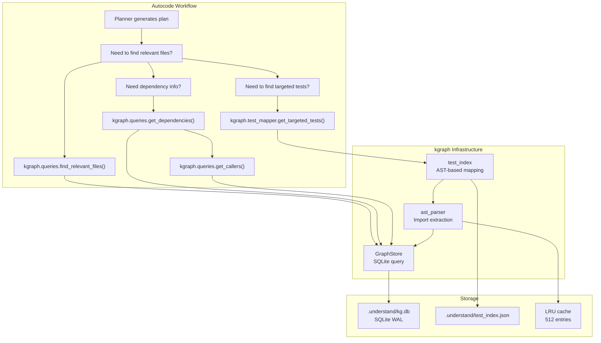
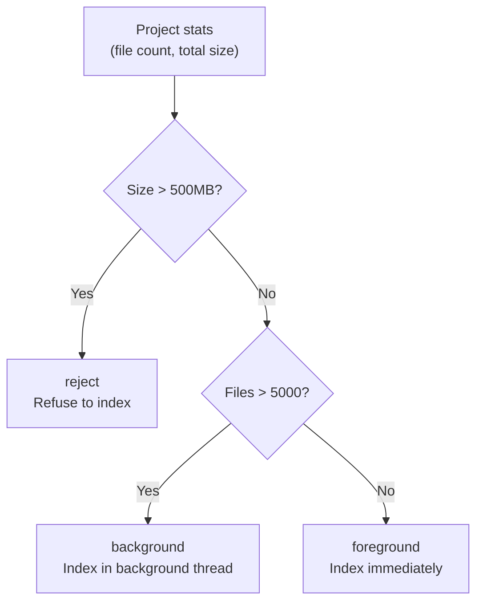
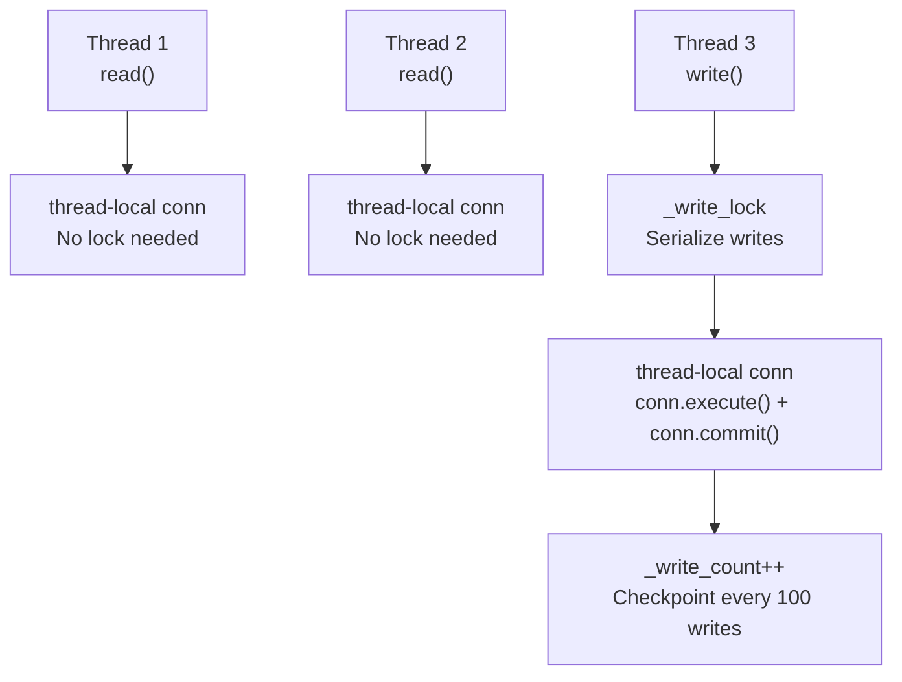
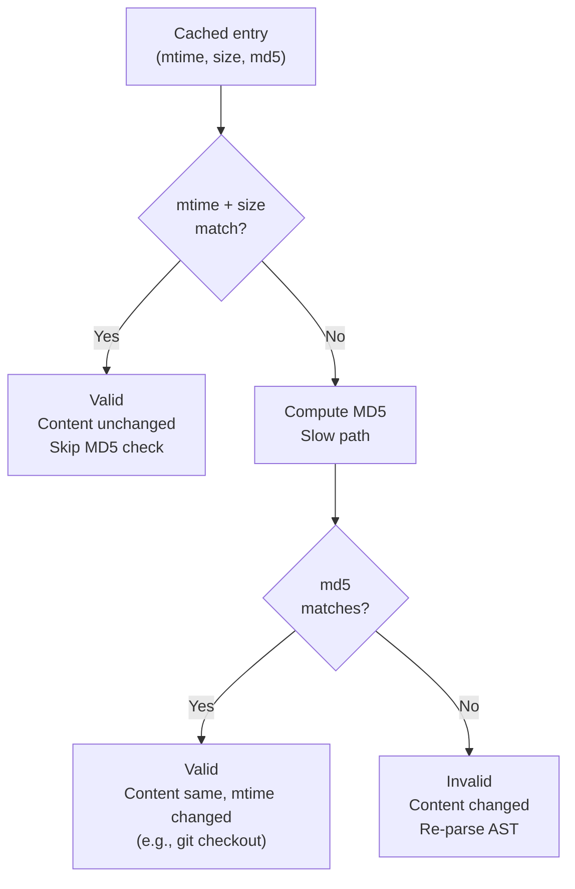
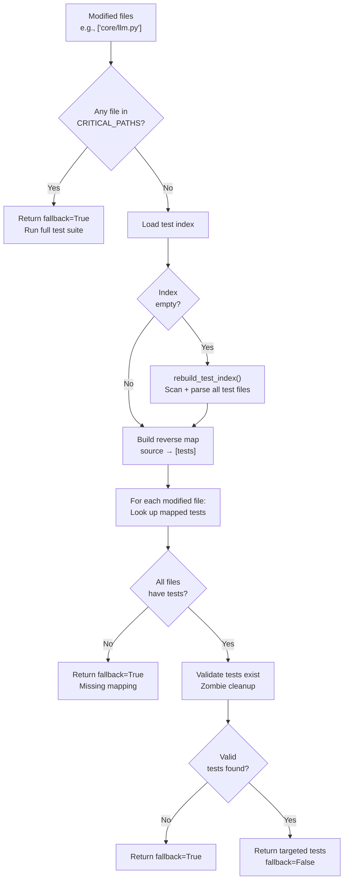

# 🕸️ Knowledge Graph (kgraph)

The Knowledge Graph (`core/kgraph/`) is a **deterministic AST-based codebase analysis system** that builds a dependency graph of Python projects. It provides fast file-to-test mapping, dependency resolution, and project-level isolation for the autocode workflow.

**Key characteristics:**
- **Deterministic AST parsing** — No LLM calls; pure Python `ast` module for import extraction
- **SQLite graph storage** — WAL-enabled, thread-safe, with automatic checkpoint management
- **Hybrid validation** — mtime + size (fast path) then MD5 (authoritative slow path) for cache invalidation
- **Test targeting** — Maps source files to their test files via AST dependency analysis
- **Project isolation** — Each project gets its own `.understand/` artifact directory
- **Physical isolation** — Project-specific ChromaDB collections separate from main memory

---

## 🏗️ Architecture

### Component Map

```
core/kgraph/
├── __init__.py         # Public API exports
├── ast_parser.py       # Dedicated AST parsing with caching + thread pool
├── cleanup.py          # Disk space and WAL file management
├── project.py          # Project isolation, path management, indexing mode
├── queries.py          # Read-only graph queries (dependencies, callers, file search)
├── storage.py          # SQLite graph store (WAL, thread-local connections, write serialization)
├── test_index.py       # Persistent test index with hybrid validation
├── test_mapper.py      # Source file → test file mapping via AST
└── vectors.py          # Project-specific ChromaDB collections
```

### How It Fits Into the Stack



### Artifact Directory Structure

Each project gets its own `.understand/` directory:

```
project_root/
├── code/                           # Source code (workspace projects)
│   ├── core/
│   │   ├── config.py
│   │   ├── llm.py
│   │   └── memory.py
│   └── tests/
│       ├── test_config.py
│       └── test_llm.py
└── .understand/                    # kgraph artifacts
    ├── kg.db                       # SQLite graph (nodes + edges)
    ├── kg.db-wal                   # WAL file (auto-checkpointed)
    ├── kg.db-shm                   # Shared memory file
    ├── test_index.json             # Persistent test mapping index
    ├── test_mapping.yaml           # Manual test overrides (optional)
    └── cache/                      # Temporary cache files
```

---

## 📦 Components

### 1. Project Manager (`project.py`)

Manages physical isolation and project-level configuration. Each project has a unique `project_id` derived from its absolute path hash.

#### Project Types

| Type | `source_root` | `artifact_root` | Use Case |
|------|---------------|-----------------|----------|
| **Agent root** | `agent_root` | `agent_root/.understand` | Indexing the agent's own codebase |
| **Workspace project** | `project/code` | `project/.understand` | Indexing user projects in workspace |

#### Indexing Modes

The `get_indexing_mode()` method determines how to handle a project based on its size:



| Mode | Condition | Behavior |
|------|-----------|----------|
| `foreground` | ≤ 5,000 files AND ≤ 500MB | Index synchronously (fast enough) |
| `background` | > 5,000 files AND ≤ 5000MB | Index in background thread |
| `reject` | > 500MB | Refuse to index (too large) |

#### Hard Limits

| Limit | Value | Purpose |
|-------|-------|---------|
| `MAX_FILES_FOR_FOREGROUND` | 5,000 | Prevent blocking on large projects |
| `MAX_FILE_SIZE_BYTES` | 1MB | Skip oversized files during indexing |
| `MAX_TOTAL_PROJECT_SIZE_MB` | 500 | Reject projects that are too large |

#### Startup Cleanup

On `ensure_initialized()`, the project manager runs `KGCleanup.cleanup_project()` to:
- Delete cache files older than 30 days
- Force SQLite WAL checkpoint to prevent unbounded growth

---

### 2. AST Parser (`ast_parser.py`)

Dedicated, bounded AST parsing to prevent event loop blocking and memory leaks.

#### Design

```mermaid
graph TD
    A["Caller<br/>(test_mapper, queries)"] --> B["parse_file_dependencies()"]
    B --> C["Read file bytes<br/>Compute MD5 hash"]
    C --> D["run_in_executor()<br/>_AST_EXECUTOR (2 workers)"]
    D --> E["_parse_file_dependencies_sync()"]
    E --> F{LRU cache hit?<br/>key=(project_id, path, md5)}
    F -->|Yes| G["Return cached frozenset"]
    F -->|No| H["ast.parse(source)"]
    H --> I["ast.walk(tree)<br/>Extract Import + ImportFrom"]
    I --> J["Return frozenset of deps"]
    J --> K["Cache result<br/>maxsize=512"]
```

#### Key Properties

| Property | Value | Rationale |
|----------|-------|-----------|
| Thread pool | `ThreadPoolExecutor(max_workers=2)` | CPU-bound work, doesn't block event loop |
| Cache | `@lru_cache(maxsize=512)` | Prevent re-parsing unchanged files |
| Cache key | `(project_id, file_path, md5_hash)` | Cross-project safe + content invalidation |
| Return type | `frozenset[str]` | Lightweight, immutable, hashable |
| Error handling | Returns `frozenset()` on `SyntaxError`, `RecursionError`, `MemoryError` | Graceful fallback for broken files |

#### Two Parsing Modes

| Mode | Function | Input | Use Case |
|------|----------|-------|----------|
| **File-based** | `parse_file_dependencies(project_id, file_path)` | File path on disk | Full project indexing |
| **String-based** | `parse_dependencies_from_string(project_id, content)` | Raw source string | Micro-updates from workflow state |

---

### 3. Graph Store (`storage.py`)

Thread-safe, WAL-enabled SQLite graph store for dependency topology.

#### Schema

```sql
CREATE TABLE nodes (
    id TEXT PRIMARY KEY,              -- "file:core/config.py"
    project_id TEXT NOT NULL,
    path TEXT NOT NULL,
    type TEXT NOT NULL,               -- "file", "module", "class", "function"
    content_hash TEXT NOT NULL,       -- MD5 of file content
    last_modified REAL,               -- File mtime for fast-path validation
    file_size INTEGER,                -- File size for fast-path validation
    metadata TEXT,                    -- JSON metadata
    updated_at REAL,
    UNIQUE(project_id, path)
);

CREATE TABLE edges (
    id TEXT PRIMARY KEY,              -- MD5 of "source->target"
    project_id TEXT NOT NULL,
    source_id TEXT NOT NULL,          -- "file:core/llm.py"
    target_id TEXT NOT NULL           -- "core.config" or "file:core/config.py"
);
```

#### Indexes

| Index | Purpose |
|-------|---------|
| `idx_nodes_project` | Fast project-scoped node lookups |
| `idx_nodes_path` | Fast path-based node lookups |
| `idx_nodes_project_path` | Compound: project + path (unique constraint) |
| `idx_edges_source` | Fast dependency lookups (outgoing edges) |
| `idx_edges_target` | Fast caller lookups (incoming edges) |

#### Thread Safety Model



| Operation | Lock | Connection | Notes |
|-----------|------|------------|-------|
| `read()` | None | Thread-local | Concurrent reads are safe |
| `write()` | `_write_lock` | Thread-local | Serialized writes |
| `upsert_file_graph()` | `_write_lock` | Thread-local | Atomic node + edge update |

#### WAL Management

| Setting | Value | Purpose |
|---------|-------|---------|
| `journal_mode` | WAL | Write-ahead logging for concurrency |
| `synchronous` | NORMAL | Balance safety and performance |
| `busy_timeout` | 30000ms | Wait before SQLITE_BUSY error |
| `temp_store` | MEMORY | Fast temporary tables |
| Checkpoint frequency | Every 100 writes | Prevent WAL file bloat |
| Checkpoint mode | TRUNCATE (fallback PASSIVE) | Shrink WAL to 0 bytes |

#### Windows WAL Repair

On startup, `_repair_wal_on_windows()` checks for stale WAL artifacts (`.db-wal` exists but `.db-shm` is empty/missing) and deletes them to prevent corruption from unclean shutdowns.

#### Singleton Pattern

`GraphStore` uses `__new__` with a class-level lock to ensure one instance per database path:

```python
store1 = GraphStore(Path("project/.understand/kg.db"))
store2 = GraphStore(Path("project/.understand/kg.db"))
assert store1 is store2  # Same instance
```

---

### 4. Graph Queries (`queries.py`)

Read-only queries for the knowledge graph.

#### `find_relevant_files(project_path, query, top_k=5)`

Finds files whose paths match keywords in a natural language query.

```python
files = find_relevant_files("/project", "fix the timeout in web scraper")
# Returns: ["tools/web.py", "tools/browser_ops/actions.py", "tests/tools/web/test_web_scrape.py"]
```

**How it works:**
1. Extract meaningful keywords (≥3 chars, skip stop words)
2. SQL `LIKE` query against node paths
3. Score by keyword match count
4. Return top-K by relevance

**Stop words filtered:** `the, a, an, and, or, for, in, on, at, to, of, is, it, this, that, fix, bug, issue, add, create, implement, write, update, change, modify, refactor, code`

#### `get_dependencies(project_path, file_path)`

Returns files that the given file imports (outgoing edges).

```python
deps = get_dependencies("/project", "core/llm.py")
# Returns: ["core/config.py", "core/tracer.py", "core/llm_backend/client.py"]
```

#### `get_callers(project_path, file_path)`

Returns files that import the given file (incoming edges).

```python
callers = get_callers("/project", "core/config.py")
# Returns: ["core/llm.py", "core/memory.py", "server.py"]
```

---

### 5. Test Index (`test_index.py`)

Persistent storage for the source → test file mapping index with hybrid validation.

#### Hybrid Validation (mtime + size + MD5)



| Path | Cost | When | Result |
|------|------|------|--------|
| **Fast** | O(1) stat call | mtime + size unchanged | Skip re-parsing |
| **Slow** | O(n) MD5 hash | mtime or size changed | Check if content actually changed |
| **Full** | O(n) AST parse | MD5 changed | Re-extract dependencies |

#### Atomic Writes

Test index is saved atomically to prevent corruption on crash:

1. Write to `.tmp` file
2. Replace original with `.tmp` (atomic on NTFS + ext4)

---

### 6. Test Mapper (`test_mapper.py`)

Maps source files to their targeted tests using persistent AST indexing. This is the primary interface used by the autocode workflow.

#### `get_targeted_tests(project_path, modified_files, project_id)`

The main entry point. Determines which tests to run for a set of modified files.



#### Critical Paths (Always Full Suite)

These files have global impact — modifying any of them triggers the full test suite:

| Path | Reason |
|------|--------|
| `core/config.py` | Global configuration affects everything |
| `core/llm.py` | All LLM interactions |
| `core/memory.py` | All memory operations |
| `server.py` | MCP server entry point |
| `registry.py` | MCP tool registration |
| `core/gateway.py` | HTTP gateway |
| `core/tracer.py` | All logging and tracing |
| `main.py`, `app.py`, `manage.py`, `settings.py` | Common framework entry points |

#### Test Index Rebuild

`rebuild_test_index()` scans the test directory and builds the mapping:

1. Find all `test_*.py` and `*_test.py` files
2. For each, check if cached entry is valid (hybrid validation)
3. If invalid, parse AST to extract imports
4. Convert module imports to file paths (`core.config` → `core/config.py`)
5. Add heuristic: `test_foo.py` probably tests `foo.py`
6. Remove stale entries for deleted test files
7. Save index atomically

#### Manual Override (test_mapping.yaml)

Users can override AST-based mapping with manual rules:

```yaml
# .understand/test_mapping.yaml
core/config.py:
  - tests/test_config_edge_cases.py
  - tests/test_config_migration.py
```

Manual mappings take priority over AST-derived mappings.

---

### 7. Vectors (`vectors.py`)

Project-specific ChromaDB collections for code embeddings, physically isolated from the main memory system.

```python
collection = get_project_vector_collection("abc123def456")
# Returns ChromaDB collection named "kg_abc123def456_embeddings"
# Uses cosine similarity, stored in main ChromaDB path
```

---

### 8. Cleanup (`cleanup.py`)

Prevents disk space exhaustion and WAL file bloat during long-term unattended operation.

| Operation | Default | Action |
|-----------|---------|--------|
| Cache cleanup | 30 days | Delete files older than threshold in `.understand/cache/` |
| Size enforcement | 5GB | Delete oldest files if total exceeds limit |
| WAL checkpoint | On startup | `PRAGMA wal_checkpoint(TRUNCATE)` to shrink WAL to 0 bytes |

---

## 📡 Public API

### From `__init__.py`

```python
from core.kgraph import (
    ProjectManager,              # Project isolation and configuration
    GraphStore,                  # SQLite graph storage
    get_project_vector_collection,  # Project-specific ChromaDB
    parse_file_dependencies,     # Async AST parsing
    clear_ast_cache,             # Clear LRU cache
    load_test_index,             # Load persistent test index
    save_test_index,             # Save persistent test index
    get_targeted_tests,          # Source → test mapping (main entry point)
    rebuild_test_index,          # Force full index rebuild
    CRITICAL_PATHS,              # Files that trigger full test suite
    get_dependencies,            # Outgoing edge query
    get_callers,                 # Incoming edge query
)
```

### Common Usage Patterns

#### Find tests for modified files (autocode workflow)

```python
from core.kgraph import get_targeted_tests, ProjectManager

pm = ProjectManager("/path/to/project")
result = await get_targeted_tests(
    project_path=pm.path,
    modified_files=["core/llm.py", "core/config.py"],
    project_id=pm.project_id,
)

if result["fallback"]:
    # Run full test suite
    run_all_tests()
else:
    # Run only targeted tests
    for test in result["tests"]:
        run_test(test)
```

#### Find relevant files for a goal

```python
from core.kgraph import find_relevant_files

files = find_relevant_files("/path/to/project", "fix timeout in web scraper", top_k=5)
# Returns: ["tools/web.py", "tools/browser_ops/actions.py", ...]
```

#### Query dependency graph

```python
from core.kgraph import get_dependencies, get_callers

# What does core/llm.py import?
deps = get_dependencies("/project", "core/llm.py")

# What imports core/config.py?
callers = get_callers("/project", "core/config.py")
```

---

## ⚙️ Configuration

The kgraph module uses no dedicated `.env` variables. It derives all configuration from:

| Source | Used For |
|--------|----------|
| `cfg.memory_chroma_path` | ChromaDB storage for project vectors |
| `cfg.agent_root` | Agent root project detection |
| `cfg.workspace_root` | Workspace project discovery |

### Hard Limits (in code)

| Setting | Value | Location |
|---------|-------|----------|
| AST cache size | 512 entries | `ast_parser.py` `@lru_cache` |
| AST thread pool | 2 workers | `ast_parser.py` `ThreadPoolExecutor` |
| Max files for foreground | 5,000 | `project.py` `MAX_FILES_FOR_FOREGROUND` |
| Max file size | 1MB | `project.py` `MAX_FILE_SIZE_BYTES` |
| Max project size | 500MB | `project.py` `MAX_TOTAL_PROJECT_SIZE_MB` |
| Checkpoint frequency | 100 writes | `storage.py` `_CHECKPOINT_EVERY` |
| Cleanup max age | 30 days | `cleanup.py` default parameter |
| Cleanup max size | 5GB | `cleanup.py` default parameter |
| SQLite busy timeout | 30s | `storage.py` `PRAGMA busy_timeout` |
| SQLite connection timeout | 30s | `storage.py` `sqlite3.connect(timeout)` |

---

## 🧪 Testing

```powershell
# Run all kgraph tests
D:\mcp\agent\venv\Scripts\pytest.exe tests/core/kgraph/ -v

# Test AST parser
D:\mcp\agent\venv\Scripts\pytest.exe tests/core/kgraph/test_ast_parser.py -v

# Test graph store
D:\mcp\agent\venv\Scripts\pytest.exe tests/core/kgraph/test_storage.py -v

# Test test mapper
D:\mcp\agent\venv\Scripts\pytest.exe tests/core/kgraph/test_mapper.py -v

# Test project manager
D:\mcp\agent\venv\Scripts\pytest.exe tests/core/kgraph/test_project.py -v
```

**Mock strategy:**
- Use `tmp_path` for `.understand/` directories
- Create small synthetic Python files for AST parsing tests
- Mock `cfg` for path configuration
- Use real `GraphStore` with in-memory SQLite (`:memory:`) for unit tests

---

## ⚠️ Known Concerns

> **Note:** These are MiMo's observations from source code review. They are constructive suggestions, not definitive prescriptions.

### `test_mapper.py` References Undefined `yaml` Import

**What exists:**
`_load_test_mapping()` uses `yaml.safe_load(f)` but `import yaml` is not at the top of the file and `PyYAML` may not be installed.

**The concern:**
If `.understand/test_mapping.yaml` exists but `PyYAML` is not installed, the function will raise a `NameError`. The `try/except Exception` catches this, but the error is silently swallowed — manual test mappings are never loaded.

**Suggestion:**
Either add `import yaml` at the top with a `try/except ImportError` guard, or document that `PyYAML` is an optional dependency for manual test mapping.

### GraphStore Singleton Never Cleaned Up

**What exists:**
`GraphStore._instances` is a class-level dict that grows as new database paths are requested. Instances are never removed.

**The concern:**
In long-running processes with many projects, the singleton dict accumulates entries. Each instance holds thread-local connections that are never closed unless `close()` is explicitly called.

**Suggestion:**
Add a `close_all()` class method that closes all instances and clears `_instances`. Call it during app shutdown.

### AST Parser Cache Key Includes Full File Path

**What exists:**
The `@lru_cache` key is `(project_id, file_path, md5_hash)`. The `file_path` is the full absolute path.

**The concern:**
If the project is moved (e.g., `D:/project` → `E:/project`), all cached entries become stale but remain in the LRU cache, wasting the 512-entry budget.

**Suggestion:**
Use the relative path (relative to project root) as part of the cache key instead of the absolute path. This makes the cache project-location-independent.

### No Explicit `close()` Calls in the Codebase

**What exists:**
`GraphStore.close()` exists but is never called by any consumer. Thread-local connections remain open until process exit.

**The concern:**
On Windows, SQLite WAL files (`.db-wal`, `.db-shm`) may not be cleaned up if the process crashes without calling `close()`. The `_repair_wal_on_windows()` handles this on next startup, but it's a workaround, not a solution.

**Suggestion:**
Register `GraphStore.close_all()` via `atexit` to ensure clean shutdown. Or document that `_repair_wal_on_windows()` is the intentional recovery mechanism.

---

## 🛡️ AI Agent Instructions

If you are an AI assistant modifying `core/kgraph/`:

1. **Never use LLM for parsing** — AST parsing is deterministic by design. Never replace `ast.parse()` with LLM-based extraction.
2. **Never block the event loop** — AST parsing is CPU-bound. Always use `_AST_EXECUTOR` via `run_in_executor()`.
3. **Never remove LRU cache** — The `@lru_cache` prevents re-parsing unchanged files. Clear it with `clear_ast_cache()` only for testing or major refactors.
4. **Thread-local connections** — Each thread gets its own SQLite connection. Never share connections across threads.
5. **Write serialization** — All writes go through `_write_lock`. Never bypass it.
6. **WAL checkpoint** — The checkpoint every 100 writes prevents WAL file bloat. Never increase `_CHECKPOINT_EVERY` without understanding disk implications.
7. **Hybrid validation** — Test index uses mtime + size (fast) then MD5 (slow). Never skip the fast path — MD5 is expensive for large projects.
8. **Critical paths** — `CRITICAL_PATHS` triggers full test suite. Never remove core infrastructure files from this set without explicit user approval.
9. **Project isolation** — Each project has its own `project_id` based on path hash. Never share graph data across projects.
10. **Fail silently on parse errors** — Broken Python files should return `frozenset()`, not crash the indexer. The codebase may contain syntax errors in files under development.

---

## 🔗 Source Code Reference

| File | Purpose |
|------|---------|
| `core/kgraph/__init__.py` | Public API exports |
| `core/kgraph/ast_parser.py` | AST parsing with LRU cache, thread pool, async wrappers |
| `core/kgraph/cleanup.py` | `KGCleanup`: disk space + WAL management |
| `core/kgraph/project.py` | `ProjectManager`: isolation, paths, indexing mode |
| `core/kgraph/queries.py` | `find_relevant_files()`, `get_dependencies()`, `get_callers()` |
| `core/kgraph/storage.py` | `GraphStore`: SQLite graph with WAL, thread-local connections |
| `core/kgraph/test_index.py` | `load_test_index()`, `save_test_index()`, hybrid validation |
| `core/kgraph/test_mapper.py` | `get_targeted_tests()`, `rebuild_test_index()`, `CRITICAL_PATHS` |
| `core/kgraph/vectors.py` | `get_project_vector_collection()`: project-specific ChromaDB |

---

## 🔮 Future Roadmap

| Status | Enhancement | Description |
|--------|-------------|-------------|
| ✅ Complete | AST-based dependency extraction | Deterministic import parsing |
| ✅ Complete | SQLite graph storage | WAL mode, thread-safe, indexed |
| ✅ Complete | Test targeting | Source → test file mapping |
| ✅ Complete | Hybrid validation | mtime + size + MD5 cache invalidation |
| ✅ Complete | Project isolation | Per-project `.understand/` directories |
| ✅ Complete | Critical path detection | Full suite trigger for global files |
| 🚧 Planned | Class/function-level nodes | Beyond file-level granularity |
| 🚧 Planned | Cross-language support | JavaScript, TypeScript AST parsing |
| 🚧 Planned | Call graph analysis | Function-level dependency tracking |
| 🚧 Planned | Incremental indexing | Only re-parse changed files (delta updates) |
| 🚧 Planned | Visualization | Mermaid/SVG export of dependency graphs |
| 🚧 Planned | Test coverage integration | Map coverage data to graph nodes |

---

*Last updated: June 2026. All schema definitions, hard limits, and component behaviors reflect current source code in `core/kgraph/`.*