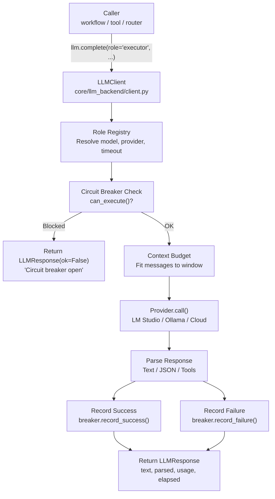
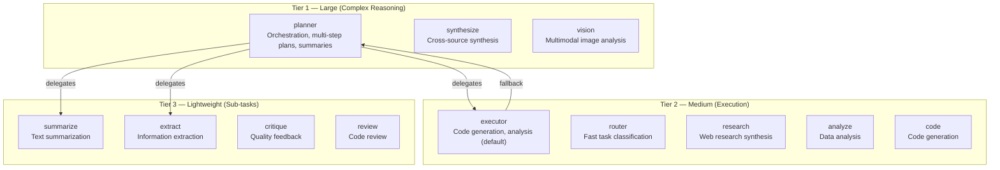
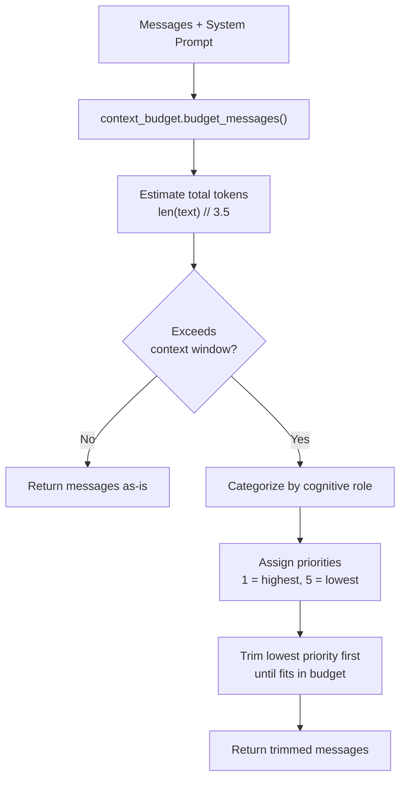
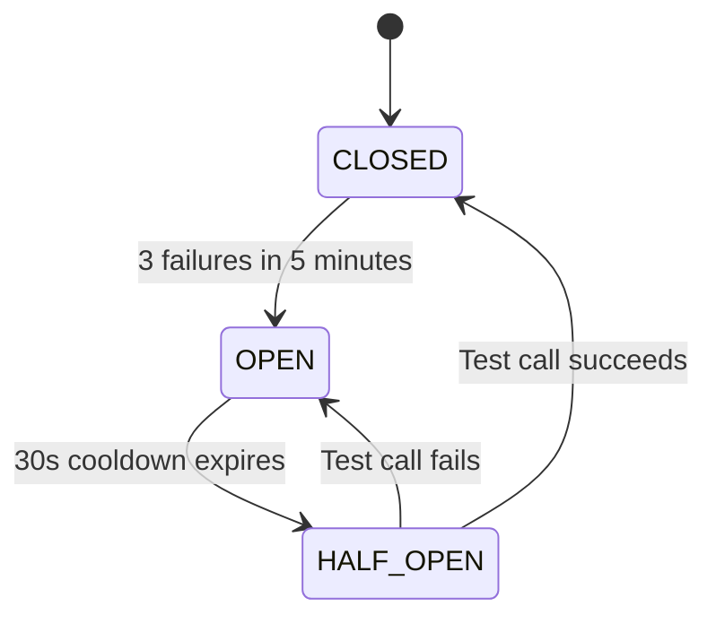
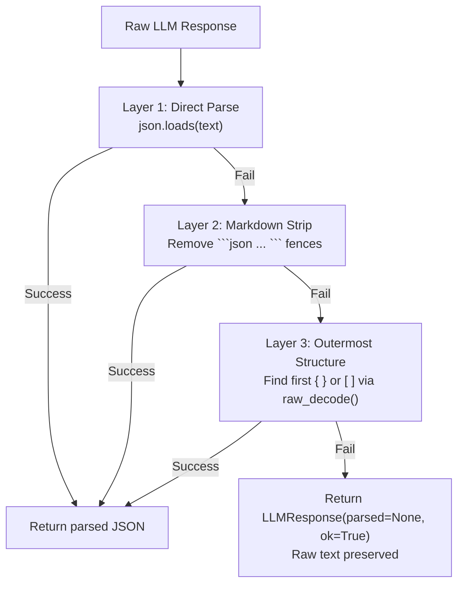

Here's the fully updated `docs/core/LLM_BACKEND.md`:

---

```markdown
# 🧠 LLM Backend

The LLM backend is the **unified interface for all model interactions** in the agent stack. It handles role-based model selection, context budgeting, circuit breakers, structured output parsing, and tool-loop execution. Nothing else in the codebase calls the LLM server directly — everything goes through `core.llm`.

**Key characteristics:**
- **Role-based dispatch** — Callers say `"executor"` or `"router"`, not raw model strings
- **Circuit breaker per model** — 3 failures in 5 minutes → 30s cooldown, auto-recovery via half-open
- **Cognitive context budgeting** — Priority-based message trimming that preserves the most important content
- **Dual output modes** — Text and JSON with robust 3-layer extraction
- **Provider abstraction** — LM Studio, Ollama, vLLM, or any OpenAI-compatible endpoint
- **Thread-safe singleton** — One `llm` instance, imported everywhere via `from core.llm import llm`

---

## 🏗️ Architecture

### Component Map

```
core/llm.py                         # Thin facade — re-exports singleton
core/llm_backend/
├── client.py                       # LLMClient: complete(), complete_with_tools(), call()
├── config.py                       # RoleConfig dataclass + registry builder
├── models.py                       # LLMResponse, LLMUsage, RoleConfig dataclasses
├── response.py                     # LLMResponse dataclass (alternate location)
├── budget.py                       # Raw token truncation (budget_messages)
├── context_budget.py               # Cognitive priority-based context budgeting
├── context_pruner.py               # Overflow-aware context compression
├── circuit_breaker.py              # Per-model failure tracking with auto-recovery
├── prompt_loader.py                # YAML system prompt loading by role
└── providers/
    ├── base.py                     # BaseProvider ABC
    ├── lmstudio.py                 # Local OpenAI-compatible provider
    └── openai_compat.py            # Cloud provider (OpenAI, DeepSeek, etc.)
```

### Call Flow



### Thin Facade Pattern

`core/llm.py` is a thin facade that re-exports the `LLMClient` singleton:

```python
# core/llm.py — What callers see
from core.llm_backend.client import llm  # Singleton

# Usage throughout the codebase
from core.llm import llm
result = llm.complete(role="executor", system="...", user="...")
```

All implementation logic lives in `core/llm_backend/`. The facade exists for:
- **Import simplicity** — `from core.llm import llm` instead of `from core.llm_backend.client import llm`
- **Backward compatibility** — Existing code doesn't break when internals move
- **Circular import prevention** — Other core modules import from the facade, not the backend

---

## 🎭 Role-Based Dispatch

Every LLM call specifies a **role** (e.g., `"planner"`, `"executor"`, `"router"`). The role determines which model, provider, timeout, temperature, and max tokens to use.

### Role Hierarchy



### Role Configuration

Each role has independent settings, built from `.env` at startup:

| Role | Temperature | Max Tokens | Timeout | Typical Model Tier | Description |
|------|-------------|------------|---------|-------------------|-------------|
| `planner` | 0.3 | 2048 | 180s | Tier 1 (large) | Orchestration, task decomposition, memory summaries |
| `executor` | 0.1 | 4096 | 120s | Tier 2 (medium) | Code generation, analysis, synthesis — **default fallback** |
| `router` | 0.0 | 512 | 15s | Tier 2 (medium) | Fast task classification, tool selection |
| `synthesize` | 0.2 | 4096 | 180s | Tier 1 (large) | Cross-source synthesis for deep research |
| `vision` | 0.1 | 1024 | 60s | Tier 1 (large) | Multimodal image analysis |
| `summarize` | 0.2 | 1024 | 120s | Tier 3 (lightweight) | Text summarization |
| `extract` | 0.1 | 2048 | 120s | Tier 3 (lightweight) | Information extraction from documents |
| `research` | 0.2 | 2048 | 120s | Tier 2 (medium) | Web research synthesis |
| `critique` | 0.3 | 1024 | 120s | Tier 3 (lightweight) | Quality critique and feedback |
| `analyze` | 0.1 | 2048 | 120s | Tier 2 (medium) | Data analysis |
| `code` | 0.1 | 4096 | 120s | Tier 2 (medium) | Code generation |
| `review` | 0.2 | 768 | 120s | Tier 3 (lightweight) | Code review |

### Fallback Chain

When a role's model is not configured in `.env`, it falls back:

```mermaid
graph LR
    A["Requested Role<br/>e.g., 'summarize'"] --> B{Model<br/>configured?}
    B -->|Yes| C["Use role-specific model<br/>]
    B -->|No| D{Executor<br/>configured?}
    D -->|Yes| E["Fall back to EXECUTOR_MODEL<br/>]
    D -->|No| F["Fall back to PLANNER_MODEL<br/>]
```

> ⚠️ **Sub-roles fall back to executor, not planner.** Planner is expensive and reserved for complex reasoning. This is intentional.

---

## 📡 API Reference

### `complete()` — High-Level Convenience

The primary method used throughout the codebase. Handles system/user/context message assembly, context budgeting, and JSON parsing.

```python
result = llm.complete(
    role="executor",
    system="You are a senior Python developer...",
    user="Fix this bug in the timeout handler",
    context="Background: The agent uses a circuit breaker pattern...",
    json_mode=True,
    trace_id="abc123",
)

if result.ok:
    print(result.text)           # Raw text output
    print(result.parsed)         # Parsed JSON (if json_mode=True)
    print(result.elapsed)        # Seconds taken
    print(result.usage)          # {"prompt": N, "completion": M, "total": T}
else:
    print(result.error)          # Error message
```

**Parameters:**

| Param | Type | Default | Description |
|-------|------|---------|-------------|
| `role` | `str` | — | **Required.** Role name (planner, executor, router, etc.) |
| `system` | `str` | `""` | System prompt (prepended to messages) |
| `user` | `str` | `""` | User message |
| `context` | `str` | `""` | Additional context (appended after system) |
| `json_mode` | `bool` | `False` | Parse response as JSON |
| `trace_id` | `str` | `""` | Trace identifier for logging |
| `temperature` | `float` | *(role default)* | Override role temperature |
| `max_tokens` | `int` | *(role default)* | Override role max tokens |
| `timeout` | `int` | *(role default)* | Override role timeout |

### `complete_with_tools()` — Tool-Loop Execution

Runs a tool-calling loop: the LLM generates tool calls, the caller executes them, results are fed back, and the loop continues until the LLM produces a final text response or max iterations are reached.

```python
result = llm.complete_with_tools(
    role="executor",
    system="You have access to file and web tools...",
    user="Research ChromaDB and write a summary",
    tools=[...],           # OpenAI-compatible tool definitions
    execute_fn=my_exec,   # Callable that runs tool calls and returns results
    max_iterations=5,
    trace_id="abc123",
)
```

### `call()` — Low-Level

Direct call with full control over messages list and parameters. Used internally by `complete()` and `complete_with_tools()`.

```python
result = llm.call(
    role="executor",
    messages=[
        {"role": "system", "content": "..."},
        {"role": "user", "content": "..."},
    ],
    temperature=0.1,
    max_tokens=4096,
    timeout=120,
    json_mode=True,
    trace_id="abc123",
)
```

### LLMResponse

Unified response object returned by all LLM methods:

```python
@dataclass
class LLMResponse:
    text: str              # Raw text output
    role: str              # Role that was called
    model: str             # Model identifier used
    usage: dict[str, int]  # {"prompt": N, "completion": M, "total": T}
    elapsed: float         # Seconds taken
    parsed: Optional[Any]  # Parsed JSON if json_mode=True
    error: str = ""        # Error message if ok=False
    ok: bool = True        # Success flag
```

---

## 📐 Context Budgeting

The LLM backend has a sophisticated context management system that decides what to keep and what to trim when messages exceed the model's context window.

### Architecture



### Cognitive Categories

Messages are categorized by their **cognitive role** — not just their position in the conversation:

| Category | Priority | Trim Strategy | Max Chars | Examples |
|----------|----------|---------------|-----------|----------|
| `procedural` | 1 (highest) | `tail` (keep latest) | 4000 | Rules, instructions, system prompt |
| `core_facts` | 2 | `smart` (scored) | 3000 | Key facts, entity summaries |
| `tool_outputs` | 3 | `tail` (keep latest) | 8000 | Tool results, web scrapes |
| `conversational` | 4 | `head` (keep earliest) | 4000 | User/assistant messages |
| `social` | 5 (lowest) | `head` (keep earliest) | 2000 | Greetings, acknowledgments |

**Priority meaning:** Higher-priority content is preserved first. When the context window is full, lower-priority content is trimmed before higher-priority content.

**Trim strategies:**
- `tail` — Keep the most recent entries, trim the oldest
- `head` — Keep the earliest entries, trim the newest
- `smart` — Score each entry and trim lowest-scoring first

### Token Estimation

Two estimation factors are used in different contexts:

| Module | Factor | Where Used |
|--------|--------|------------|
| `context_budget.py` | `// 3.5` | Cognitive budgeting (primary) |
| `budget.py` | `// 4` | Raw truncation (fallback) |

> ⚠️ **Concern:** These two factors produce slightly different token counts for the same text. `context_budget.py` is the canonical system used by `LLMClient._call_with_budget()`. `budget.py` is a lower-level utility. See [Section 12: Known Concerns](#-known-concerns) for details.

### Context Pruning

The `context_pruner.py` module handles overflow-aware compression. It's called when messages are too large even after budgeting:

| Compression Level | Action | When |
|-------------------|--------|------|
| Level 1 | Truncate tool outputs to `max_chars` | Tool output > 4000 chars |
| Level 2 | Drop lowest-priority messages | Still over budget after L1 |
| Level 3 | Truncate system prompt tail | System prompt > 2000 chars |
| Level 4 | Hard truncation with notice | All else fails |

---

## 🛡️ Circuit Breaker

Prevents cascading failures when a model or provider becomes unresponsive. Each model has an independent circuit breaker.

### State Machine



### Behavior by State

| State | `can_execute()` | What Happens |
|-------|-----------------|--------------|
| **CLOSED** | `True` | Normal operation. Failures are counted. |
| **OPEN** | `False` | All calls rejected immediately. Returns `LLMResponse(ok=False, error="Circuit breaker open")`. |
| **HALF_OPEN** | `True` | One test call allowed. Success → CLOSED. Failure → OPEN. |

### Monitoring

The gateway exposes circuit breaker states via `GET /health/circuit-breakers`:

```json
{
  "status": "ok",
  "breakers": {
    "gemma-4-e2b-it@q5_k_s": {"state": "closed", "failures": 0},
    "gemma-2-2b-it": {"state": "closed", "failures": 1},
    "lfm2-1.2b-tool": {"state": "half-open", "failures": 3}
  }
}
```

### Configuration

| Parameter | Value | Description |
|-----------|-------|-------------|
| Failure threshold | 3 | Failures before opening |
| Failure window | 5 minutes | Time window for counting failures |
| Cooldown | 30 seconds | Time before half-open |
| Per-model | Yes | Each model has its own breaker |

---

## 🔌 Provider Abstraction

### BaseProvider (Abstract)

All LLM backends implement this interface:

```python
class BaseProvider(ABC):
    name: str = "base"
    
    @abstractmethod
    def chat_completion(
        self,
        model: str,
        messages: list[dict],
        temperature: float,
        max_tokens: int,
        timeout: int,
        json_mode: bool,
        **kwargs: Any,
    ) -> dict: ...
```

### Available Providers

| Provider | Env Detection | Health Check | Description |
|----------|--------------|--------------|-------------|
| `LMStudioProvider` | Default local | `GET /models` | LM Studio, Ollama, vLLM — any OpenAI-compatible endpoint |
| `OpenAICompatibleProvider` | `*_API_KEY` present in `.env` | Provider-specific | OpenAI, DeepSeek, Mistral, Qwen, Kimi |

### Provider Selection

```mermaid
graph TD
    A["Role model value<br/>"] --> B{Exact match<br/>cloud provider?}
    B -->|"openai", "deepseek"| C["OpenAICompatibleProvider<br/>+ resolve API key, base URL, model"]
    B -->|No| D["LMStudioProvider<br/>+ LM_STUDIO_BASE_URL"]
```

### Dynamic Factory Registration

`core/llm_backend/factory.py` scans `cfg` at startup. If a cloud provider's `API_KEY` is present in `.env`, it automatically registers an `OpenAICompatibleProvider` for that service. No code changes needed to add new cloud vendors.

```python
# Auto-registered at startup if API key exists:
# OPENAI_API_KEY=sk-...    → registers "openai" provider
# DEEPSEEK_API_KEY=sk-...  → registers "deepseek" provider
```

---

## 🔧 Structured Output & JSON Parsing

When `json_mode=True`, the response undergoes a **3-layer extraction strategy** to handle LLM formatting quirks:

### Extraction Pipeline



**Why 3 layers?** Small local models frequently:
- Wrap JSON in markdown fences (` ```json ... ``` `)
- Add explanatory text before/after the JSON
- Include trailing commas or comments (handled by `raw_decode`)

### Router-Specific JSON Extraction

The router (`core/router.py`) has its own `_extract_first_json()` method with the same 3-layer strategy, optimized for the router's specific response format.

---

## 📜 Prompt Loading

System prompts are loaded from YAML files via `core/llm_backend/prompt_loader.py`:

```python
# Load a role's system prompt
prompt = prompt_loader.load("executor")
# Returns the YAML content as a string
```

Prompts are organized by role and can include:
- Base instructions
- Tool-specific guidelines
- Context-aware dynamic sections

---

## 🧵 Thread Safety

| Component | Mechanism | Notes |
|-----------|-----------|-------|
| `LLMClient` | Singleton | One instance, imported everywhere |
| `LMStudioProvider` | Thread-local `httpx.Client` | Double-checked locking for connection pooling |
| `CircuitBreaker` | `threading.Lock` per instance | Prevents race conditions on state transitions |
| `ActivityTracker` | `threading.RLock` | Inference slot management (RLock prevents deadlock) |
| Cleanup | `atexit` registered | Closes all provider clients on process exit |

---

## 📊 Observability

### Tracing

Every LLM call is logged via `tracer.step()`:

```python
tracer.step(trace_id, "llm", f"calling {role} ({model})",
            provider=provider, temperature=temp, max_tokens=max_tok)
```

### Token Tracking

Token consumption is tracked via `core/metrics.py`:

```python
track_llm_tokens(role=role, prompt=usage["prompt"], completion=usage["completion"])
```

Exposed at `GET /metrics` in Prometheus format:

```
autocode_llm_tokens_total{role="executor"} 15420
autocode_llm_tokens_total{role="planner"} 8230
autocode_llm_tokens_total{role="router"} 1250
```

### Circuit Breaker Monitoring

Available at `GET /health/circuit-breakers` — shows state and failure count per model.

---

## ⚙️ Configuration

### Environment Variables

| Env Variable | Role | Default | Description |
|--------------|------|---------|-------------|
| `PLANNER_MODEL` | planner | — | Large model for complex reasoning |
| `EXECUTOR_MODEL` | executor | Falls back to planner | Medium model for code/analysis |
| `ROUTER_MODEL` | router | Falls back to planner | Fast model for classification |
| `VISION_MODEL` | vision | Falls back to planner | Multimodal model |
| `SUMMARIZE_MODEL` | summarize | Falls back to executor | Lightweight summarization |
| `EXTRACT_MODEL` | extract | Falls back to executor | Lightweight extraction |
| `RESEARCH_MODEL` | research | Falls back to executor | Web research synthesis |
| `CRITIQUE_MODEL` | critique | Falls back to executor | Quality feedback |
| `ANALYZE_MODEL` | analyze | Falls back to executor | Data analysis |
| `CODE_MODEL` | code | Falls back to executor | Code generation |
| `REVIEW_MODEL` | review | Falls back to executor | Code review |
| `LM_STUDIO_BASE_URL` | — | `http://localhost:1234/v1` | LLM server endpoint |
| `PLANNER_TIMEOUT` | planner | `180` | Timeout in seconds |
| `EXECUTION_TIMEOUT` | executor | `120` | Timeout in seconds |
| `ROUTER_TIMEOUT` | router | `15` | Timeout in seconds |
| `VISION_TIMEOUT` | vision | `60` | Timeout in seconds |

---

## 🔀 When to Use What

| Scenario | Method | Why |
|----------|--------|-----|
| Simple prompt + response | `llm.complete(role, system, user)` | High-level, handles context budgeting |
| JSON structured output | `llm.complete(..., json_mode=True)` | 3-layer extraction, populates `result.parsed` |
| Multi-step tool execution | `llm.complete_with_tools(...)` | Tool-loop with iteration limit |
| Raw message control | `llm.call(role, messages)` | Low-level, no budgeting or assembly |
| Quick classification | `llm.complete(role="router", ...)` | 15s timeout, temperature=0.0 |
| Complex planning | `llm.complete(role="planner", ...)` | 180s timeout, temperature=0.3 |
| Lightweight extraction | `llm.complete(role="extract", ...)` | Small fast model, low cost |

---

## 🧪 Testing

```powershell
# Run all LLM backend tests
D:\mcp\agent\venv\Scripts\pytest.exe tests/core/llm/ -v -W error
```

**Mock strategy:**
- Mock `httpx.Client.post()` to avoid real LLM calls
- Mock `cfg` for model names and timeouts
- Circuit breaker tests use real breaker instances with mocked provider responses

---

## ⚠️ Known Concerns

> **Note:** These are MiMo's observations from source code review. They are constructive suggestions, not definitive prescriptions.

### Two Competing Context Budgeting Systems

**What exists:**
- `core/llm_backend/context_budget.py` — cognitive priority-based budgeting with categories, priorities, and per-category trim strategies. Uses `// 3.5` token estimation.
- `core/llm_backend/budget.py` — raw token truncation with `// 4` estimation.

**The concern:**
`LLMClient._call_with_budget()` delegates to `context_budget.budget_messages()`, which is the cognitive system. But `budget.py` also exists and may be imported by other modules. Two systems with different estimation factors can produce inconsistent results.

**Suggestion:**
Consolidate into a single public API. The cognitive budgeting system is the more sophisticated one — make it canonical. Keep `budget.py` as an internal utility that `context_budget.py` calls for raw truncation, but don't expose it to external callers.

### Context Pruner Has Two Homes

`core/context_pruner.py` sits in `core/` but is primarily used by `core/llm_backend/`. All context-related modules should be co-located.

**Suggestion:**
Move `context_pruner.py` into `core/llm_backend/` alongside `context_budget.py` and `budget.py`.

---

## 🛡️ AI Agent Instructions

If you are an AI assistant modifying the LLM backend:

1. **Never bypass circuit breakers** — always check `breaker.can_execute()` before making LLM calls.
2. **Thread safety** — never remove the `_lock` from `CircuitBreaker` or `LMStudioProvider`.
3. **Provider agnosticism** — never hardcode provider names in business logic. Always use the `provider` field from `RoleConfig`.
4. **Role-based calls** — always use `llm.complete(role="...", ...)` or `llm.call(role="...", ...)`. Never construct raw HTTP requests to the LLM server.
5. **Sub-role fallback** — new sub-role models must fall back to `executor_model`, not `planner_model`. Planner is expensive and reserved for complex reasoning.
6. **Trace integration** — every call must log via `tracer.step()` with `trace_id`.
7. **JSON parsing** — never assume the LLM returns clean JSON. Use the 3-layer extraction pipeline.
8. **Context budgeting** — never truncate messages without going through `context_budget.budget_messages()`. Raw truncation loses cognitive priority information.
9. **Token estimation** — use `// 3.5` (context_budget factor), not `// 4` (budget.py factor), for consistency with the primary system.

---

## 🔗 Source Code Reference

| File | Purpose |
|------|---------|
| `core/llm.py` | Thin facade — re-exports `llm` singleton |
| `core/llm_backend/client.py` | `LLMClient`: `complete()`, `complete_with_tools()`, `call()`, `_call_with_budget()` |
| `core/llm_backend/config.py` | `RoleConfig` builder from `.env` |
| `core/llm_backend/models.py` | `LLMResponse`, `LLMUsage`, `RoleConfig` dataclasses |
| `core/llm_backend/context_budget.py` | Cognitive priority-based context budgeting |
| `core/llm_backend/context_pruner.py` | Overflow-aware context compression |
| `core/llm_backend/budget.py` | Raw token truncation (`budget_messages`) |
| `core/llm_backend/circuit_breaker.py` | Per-model circuit breaker (CLOSED → OPEN → HALF_OPEN) |
| `core/llm_backend/prompt_loader.py` | YAML system prompt loading by role |
| `core/llm_backend/factory.py` | Composition root, dynamic provider registration |
| `core/llm_backend/providers/base.py` | `BaseProvider` ABC |
| `core/llm_backend/providers/lmstudio.py` | `LMStudioProvider` (local OpenAI-compatible) |
| `core/llm_backend/providers/openai_compat.py` | `OpenAICompatibleProvider` (cloud) |
| `core/config.py` | Model names, timeouts, LLM server URL |
| `core/metrics.py` | Token tracking (`track_llm_tokens`) |
| `core/runtime/activity_tracker.py` | Inference slot management |

---

*Last updated: June 2026. All role configurations, timeouts, and model names reflect current source code and `.env`.*