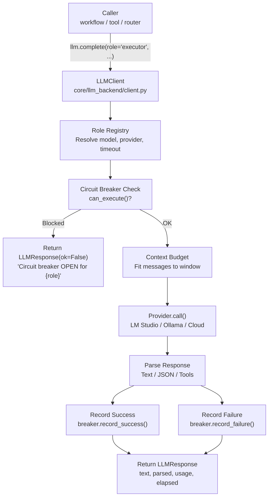
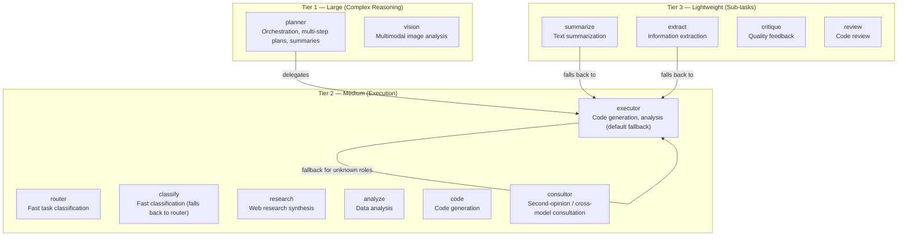
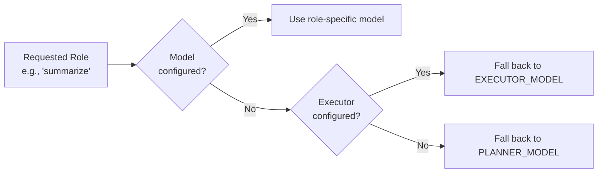
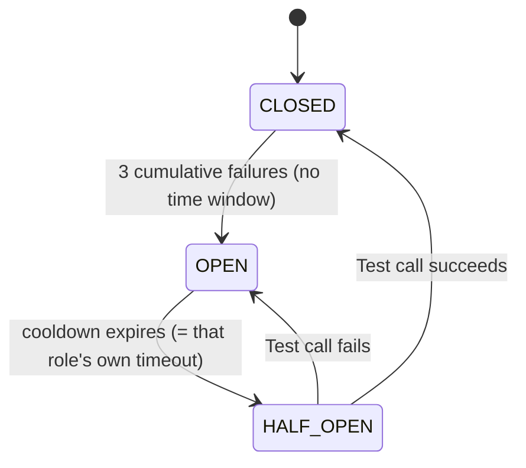
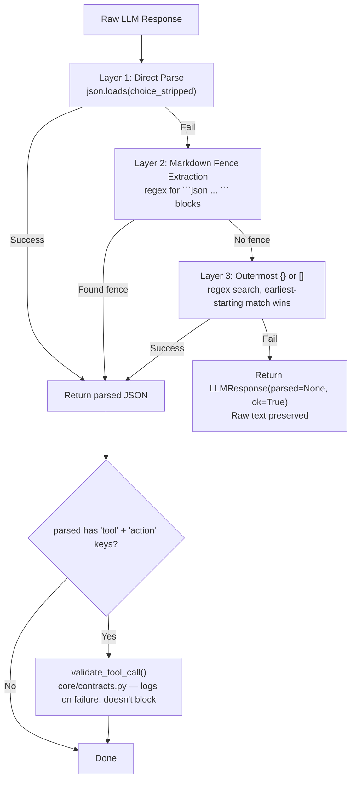

# 🧠 LLM Backend

The LLM backend is the **unified interface for all model interactions** in the agent stack. It handles role-based model selection, context budgeting, circuit breakers, and structured output parsing. Nothing else in the codebase calls the LLM server directly — everything goes through `core.llm`.

**Key characteristics:**
- **Role-based dispatch** — Callers say `"executor"` or `"router"`, not raw model strings
- **Circuit breaker per role** — 3 cumulative failures (no time window) → cooldown equal to that role's own configured timeout, auto-recovery via half-open
- **Cognitive context budgeting** — Priority-based message trimming that preserves the most important content
- **Dual output modes** — Text and JSON, each with their own extraction pipeline (`client.py` and `router.py` use different techniques — see [JSON Parsing](#-structured-output--json-parsing))
- **Provider abstraction** — LM Studio, Ollama, vLLM, or any OpenAI-compatible endpoint
- **Thread-safe singleton** — One `llm` instance, imported everywhere via `from core.llm import llm`

---

## 🏗️ Architecture

### Component Map

```
core/llm.py                         # Thin facade — re-exports singleton
core/llm_backend/
├── client.py                       # LLMClient: complete(), call(), circuit_breaker_states
├── config.py                       # RoleConfig dataclass + _build_role_configs()
├── response.py                     # LLMResponse dataclass
├── budget.py                       # Rate limiting (ThreadSafeRateLimiter) + raw token-count
│                                   #   truncation + cost estimation. NOT the cognitive-tier
│                                   #   system — that lives in core/memory_backend/budget.py.
├── circuit_breaker.py              # Per-model failure tracking with auto-recovery
├── provider.py                     # BaseProvider ABC + ProviderRegistry
├── factory.py                      # create_llm_client() — composition root
└── providers/
    ├── lmstudio.py                 # Local OpenAI-compatible provider
    └── openai_compat.py            # Cloud provider (OpenAI, DeepSeek, etc.)
```

> ⚠️ There is no `context_budget.py`, `context_pruner.py`, `models.py`, `prompt_loader.py`, or `providers/base.py` anywhere in this repo. The cognitive-priority budgeting system genuinely exists but lives in `core/memory_backend/budget.py` — see [Context Budgeting](#-context-budgeting) below. There is no YAML-based prompt loader; system prompts are passed as plain strings by callers.

### Call Flow



### Thin Facade Pattern

`core/llm.py` is a thin facade that **constructs** the `LLMClient` singleton (there's no pre-built `llm` object inside `client.py` to import — `client.py` only defines the class):

```python
# core/llm.py — what actually happens
from core.llm_backend.factory import create_llm_client
llm = create_llm_client()   # constructs the singleton here, in the facade

# Usage throughout the codebase
from core.llm import llm
result = llm.complete(role="executor", system="...", user="...")
```

All implementation logic lives in `core/llm_backend/`. The facade exists for:
- **Import simplicity** — `from core.llm import llm` instead of `from core.llm_backend.client import llm`
- **Backward compatibility** — Existing code doesn't break when internals move
- **Circular import prevention** — Other core modules import from the facade, not the backend

---

## 🎭 Role-Based Dispatch

Every LLM call specifies a **role** (e.g., `"planner"`, `"executor"`, `"router"`). The role determines which model, provider, timeout, temperature, and max tokens to use.

### Role Hierarchy



> ⚠️ There is no `synthesize` role anywhere in the source. `core/config.py` also defines a `route` entry in `model_registry`, but `llm_backend/config.py`'s `_build_role_configs()` doesn't include it — calling `llm.complete(role="route", ...)` silently falls back to `executor`'s full config and logs a `tracer.error("llm_role_fallback", ...)`.

### Role Configuration

Each role has independent `temperature`/`max_tokens` settings hardcoded in `llm_backend/config.py`'s `_defaults` dict — these are **not** configurable via `.env`. Only `model`, `provider`, and `timeout` come from `.env` (via `cfg.model_registry`).

| Role | Temperature | Max Tokens | Timeout | Description |
|------|-------------|------------|---------|-------------|
| `planner` | 0.2 | 8192 | 180s | Orchestration, task decomposition, memory summaries |
| `executor` | 0.0 | 16384 | 120s | Code generation, analysis — **default fallback for unknown roles** |
| `router` | 0.0 | 512 | 15s | Fast task classification, tool selection |
| `vision` | 0.2 | 4096 | 60s | Multimodal image analysis |
| `classify` | 0.0 | 256 | 15s | Lightweight classification |
| `summarize` | 0.2 | 8192 | 60s | Text summarization |
| `extract` | 0.0 | 4096 | 60s | Information extraction from documents |
| `research` | 0.2 | 16384 | 120s | Web research synthesis |
| `critique` | 0.3 | 8192 | 90s | Quality critique and feedback |
| `analyze` | 0.2 | 16384 | 90s | Data analysis |
| `code` | 0.0 | 16384 | 120s | Code generation |
| `review` | 0.2 | 8192 | 90s | Code review |
| `consultor` | 0.2 | 4096 | 60s | Cross-model consultation (only registered if a model is explicitly configured) |

All `timeout` values above are the defaults baked into both `cfg.model_registry`'s `_make_entry()` calls and `llm_backend/config.py`'s `_defaults` (kept in sync by convention — there is no single source of truth enforcing this).

### Fallback Chain

When a role's model is not configured in `.env`, it falls back:



> ⚠️ **Sub-roles fall back to executor, not planner.** Planner is expensive and reserved for complex reasoning. This is intentional.

---

## 📡 API Reference

### `complete()` — High-Level Convenience

The primary method used throughout the codebase. Handles system/user/context message assembly, context budgeting, and JSON parsing.

```python
result = llm.complete(
    role="executor",
    system="You are a senior Python developer...",
    user="Fix this bug in the timeout handler",
    context="Background: The agent uses a circuit breaker pattern...",
    json_mode=True,
    trace_id="abc123",
)

if result.ok:
    print(result.text)           # Raw text output
    print(result.parsed)         # Parsed JSON (if json_mode=True)
    print(result.elapsed)        # Seconds taken
    print(result.usage)          # {"prompt": N, "completion": M, "total": T}
else:
    print(result.error)          # Error message
```

**Parameters:**

| Param | Type | Default | Description |
|-------|------|---------|-------------|
| `role` | `str` | — | **Required.** Role name (planner, executor, router, etc.) |
| `system` | `str` | `""` | System prompt (prepended to messages) |
| `user` | `str` | `""` | User message |
| `context` | `str` | `""` | Additional context (appended after system, as a fake assistant "Understood." turn) |
| `content` | `str` | `""` | Additional content appended to the user message (e.g. file contents) — undocumented in the original version of this doc |
| `json_mode` | `bool` | `False` | Parse response as JSON |
| `trace_id` | `str` | `""` | Trace identifier for logging |
| `temperature` | `float` | *(role default)* | Override role temperature |
| `max_tokens` | `int` | *(role default)* | Override role max tokens |
| `timeout` | `int` | *(role default)* | Override role timeout |

> ⚠️ `complete_with_tools()` does not exist anywhere in this codebase (confirmed via repo-wide search). `LLMClient` exposes exactly two public call methods: `complete()` and `call()`. If a tool-calling loop is needed, it's not yet implemented at this layer.

### `call()` — Low-Level

Direct call with full control over messages list and parameters. Used internally by `complete()`.

```python
result = llm.call(
    role="executor",
    messages=[
        {"role": "system", "content": "..."},
        {"role": "user", "content": "..."},
    ],
    temperature=0.1,
    max_tokens=4096,
    timeout=120,
    json_mode=True,
    trace_id="abc123",
)
```

### LLMResponse

Unified response object returned by all LLM methods:

```python
@dataclass
class LLMResponse:
    text: str              # Raw text output
    role: str              # Role that was called
    model: str             # Model identifier used
    usage: dict[str, int]  # {"prompt": N, "completion": M, "total": T}
    elapsed: float         # Seconds taken
    parsed: Optional[Any]  # Parsed JSON if json_mode=True
    error: str = ""        # Error message if ok=False
    ok: bool = True        # Success flag
```

---

## 📐 Context Budgeting

The LLM backend has a sophisticated context management system that decides what to keep and what to trim when messages exceed the model's context window. **This logic lives in `core/memory_backend/budget.py`, not anywhere under `llm_backend/`** — the module's own docstring header is itself stale (still says `core/context_budget.py`, a path that hasn't existed since this code moved into `memory_backend/`).

### Architecture

```mermaid
graph TD
    A["Messages"] --> B["budget_messages(messages, max_tokens)<br/>core/memory_backend/budget.py"]
    B --> C["Pin SYSTEM + USER messages<br/>(never dropped except as last resort)"]
    C --> D["Classify + score every other message<br/>tier weight + recency bonus + fingerprint bonus"]
    D --> E["Greedy selection, highest score first<br/>50% per-class cap, 80% of max_tokens budget"]
    E --> F["Re-sort chronologically<br/>preserve conversation flow"]
    F --> G{Still over budget?<br/>(pinned alone too large)}
    G -->|Yes| H["Hard-truncate last USER message<br/>or drop everything except SYSTEM+USER"]
    G -->|No| I["Return final message list"]
```

### Cognitive Categories (`ContextClass` enum, 7 tiers — not 5)

Classification is deterministic, based on `msg["role"]` and content fingerprinting (substring match), **not** position in the conversation:

| Tier | Value | Tier Weight | Classified when |
|------|-------|-------------|------------------|
| `SYSTEM` | 0 | 1000.0 (pinned) | `role == "system"` |
| `USER` | 1 | 1000.0 (pinned) | `role == "user"` |
| `ERROR` | 2 | 40.0 | content contains `"traceback"`, `"exception"`, or `"error:"` |
| `PROCEDURAL` | 3 | 50.0 | content contains `"procedural"` or `"rule:"` |
| `RECENT` | 4 | 20.0 | default for anything not matched above |
| `OUTPUT` | 5 | 10.0 | `role == "tool"` |
| `ARCHIVE` | 6 | 1.0 | never assigned by `_classify_message()` directly in the current code — reserved for future use |

Note `PROCEDURAL` (50.0) outranks `ERROR` (40.0) in tier weight, despite the module docstring's own comment claiming error messages "must outrank procedural for debugging" — the weight values as written don't implement that stated intent.

**Scoring formula** (for every non-pinned message): `score = tier_weight + recency_bonus + fingerprint_bonus`
- **Recency bonus**: `(index / total) * 10.0` — later messages score slightly higher
- **Fingerprint bonus**: `+5.0` if content contains a ```` ```json ```` or ```` ```python ```` fence

**Selection**: not a fixed per-category char cap. `SYSTEM`/`USER` messages are pinned outright (kept regardless of score). Everything else is sorted by score descending and greedily added until the budget fills, with a **50% per-class cap** (`CLASS_CAP = input_budget * 0.5`) so one giant traceback can't starve every other category. `input_budget` itself is **80% of `max_tokens`** (the remaining 20% is reserved headroom for the model's own output). Selected messages are then re-sorted back into chronological order before being returned, so conversation flow is preserved even though selection itself was score-based.

**Overflow handling**: if `SYSTEM` + `USER` alone exceed `max_tokens`, the last `USER` message is hard-truncated (keeping system messages intact) with a 100-token safety buffer and a `"\n\n[...TRUNCATED DUE TO CONTEXT OVERFLOW...]"` marker appended. If the result is *still* over budget after all that, everything except `SYSTEM`+`USER` is dropped as a final fallback.

### Token Estimation

| Module | Factor | Where used |
|--------|--------|------------|
| `core/memory_backend/budget.py` (`CHARS_PER_TOKEN`) | `/ 3.5` | The cognitive budgeting system above — the canonical estimate |
| `core/llm_backend/client.py`'s `call()` | `// 4` | A separate, throwaway estimate used only for a debug `logger.info()` line before `budget_messages()` is invoked — has no effect on what gets kept/trimmed |
| `core/llm_backend/budget.py` (`truncate_by_tokens`) | tiktoken if available, else `// 4` | Rate-limiting / cost-estimation utility, unrelated to message selection |

There genuinely are three different token-estimate code paths in this codebase, but they serve different purposes — it's not two competing systems producing inconsistent *budgeting* results, since only the first one (`/ 3.5`) actually decides what gets kept or trimmed.

### Context Pruning

A **separate** mechanism, `core/memory_backend/pruner.py` (also has a stale internal docstring — still says `core/context_pruner.py`), handles tool-output truncation. It is not a 4-level cascading system — see [CONTEXT_PRUNER.md](./CONTEXT_PRUNER.md) for the full, verified breakdown. In short: a single 8,000-character threshold, tool-aware truncation (head+tail 4k+4k for most tools, tail-only for `python_exec`/`cli`), full output saved to disk as a recoverable artifact, and a `_recovery_hint` injected into the result. HTML-stripping for the `web` tool happens via BeautifulSoup *inside `tools/web.py` itself*, before the pruner is ever called — not inside the pruner module.

---

## 🛡️ Circuit Breaker

Prevents cascading failures when a model or provider becomes unresponsive. **Each role** has an independent circuit breaker (keyed by role name — `"executor"`, `"planner"`, etc. — not by model identifier).

### State Machine



> ⚠️ There is **no 5-minute failure window** — `record_failure()` just increments a counter while CLOSED; it only resets via a full OPEN→HALF_OPEN→CLOSED cycle. The cooldown is **not a fixed 30 seconds** — each breaker is constructed with `recovery_timeout=role_cfg.timeout`, so `router`'s breaker cools down in 15s, `planner`'s in 180s. Only `failure_threshold=3` and `half_open_max_calls=1` are genuinely fixed.

### Behavior by State

| State | `can_execute()` | What Happens |
|-------|-----------------|--------------|
| **CLOSED** | `True` | Normal operation. Failures are counted (no decay). |
| **OPEN** | `False` | All calls rejected immediately. Returns `LLMResponse(ok=False, error="Circuit breaker OPEN for {role}: service degraded (fail-fast).")` |
| **HALF_OPEN** | `True` for one call, `False` after | One probe call allowed. Success → CLOSED. Failure → immediately back to OPEN. |

### Monitoring

The gateway exposes circuit breaker states via `GET /health/circuit-breakers`, which calls `llm.circuit_breaker_states` — **this returns `None` unless `cfg.enable_metrics_endpoint` is truthy.** By default this endpoint returns `{"status": "ok", "breakers": null}`. When enabled, keys are **role names** (not model identifiers):

```json
{
  "status": "ok",
  "breakers": {
    "planner": {"state": "closed", "failure_count": 0, "timeout_seconds": 180, "time_since_last_failure": 0.0},
    "executor": {"state": "half-open", "failure_count": 3, "timeout_seconds": 120, "time_since_last_failure": 121.4}
  }
}
```

### Configuration

| Parameter | Value | Description |
|-----------|-------|-------------|
| Failure threshold | 3 (fixed) | Cumulative failures before opening — no time window |
| Cooldown | `role_cfg.timeout` (dynamic, per role) | e.g. 15s for `router`, 180s for `planner` |
| `half_open_max_calls` | 1 (fixed) | Exactly one probe call allowed in HALF_OPEN |
| Granularity | Per **role**, not per model | Keyed by role name in `LLMClient._breakers` |

---

## 🔌 Provider Abstraction

### BaseProvider (Abstract) — `core/llm_backend/provider.py`

All LLM backends implement this interface:

```python
class BaseProvider(ABC):
    name: str = "base"
    
    @abstractmethod
    def chat_completion(
        self,
        model: str,
        messages: list[dict],
        temperature: float,
        max_tokens: int,
        timeout: int,
        json_mode: bool,
        **kwargs: Any,
    ) -> dict: ...

    def is_available(self) -> bool:
        return True
```

`ProviderRegistry` (same file) holds the registered providers in a plain dict keyed by provider name, raising `KeyError` with the list of available providers if an unregistered name is requested.

### Available Providers

| Provider | Env Detection | Description |
|----------|--------------|-------------|
| `LMStudioProvider` | Always registered as `"lmstudio"` | LM Studio, Ollama, vLLM — any OpenAI-compatible local endpoint |
| `OpenAICompatibleProvider` | One registered per cloud vendor whose `*_API_KEY` is non-empty in `.env` | `openai`, `deepseek`, `mistral`, `qwen`, `kimi` — all five are checked at startup |

### Provider Selection

```mermaid
graph TD
    A["Role model value<br/>"] --> B{Exact match<br/>cloud provider?}
    B -->|"openai", "deepseek"| C["OpenAICompatibleProvider<br/>+ resolve API key, base URL, model"]
    B -->|No| D["LMStudioProvider<br/>+ LM_STUDIO_BASE_URL"]
```

### Dynamic Factory Registration

`core/llm_backend/factory.py` scans `cfg` at startup. If a cloud provider's `API_KEY` is present in `.env`, it automatically registers an `OpenAICompatibleProvider` for that service. No code changes needed to add new cloud vendors.

```python
# Auto-registered at startup if API key exists (all 5 are checked):
# OPENAI_API_KEY=sk-...    → registers "openai" provider
# DEEPSEEK_API_KEY=sk-...  → registers "deepseek" provider
# MISTRAL_API_KEY=...      → registers "mistral" provider
# QWEN_API_KEY=...         → registers "qwen" provider
# KIMI_API_KEY=...         → registers "kimi" provider
```

---

## 🔧 Structured Output & JSON Parsing

When `json_mode=True`, the response undergoes a **3-layer extraction strategy** to handle LLM formatting quirks:

### Extraction Pipeline



**Why 3 layers?** Small local models frequently:
- Wrap JSON in markdown fences (` ```json ... ``` `)
- Add explanatory text before/after the JSON
- Add trailing prose after a complete JSON value (this is what `raw_decode()` handles — see below — not trailing commas or comments, which plain `json.loads()` still rejects either way)

### Router-Specific JSON Extraction

The router (`core/router.py`) has its own, **different** `_extract_first_json()` method — it's not the same 3-layer strategy as `client.py`. It strips markdown fences, tries a direct `json.loads()`, and on failure falls back to `json.JSONDecoder().raw_decode()` (Python's native decoder, which parses a single JSON value and ignores anything after it — this is what actually handles trailing prose after the JSON, not comments or trailing commas inside it). `client.py`'s `_parse_response()`, by contrast, uses a regex search for the outermost `{...}` or `[...]` after fence-stripping fails — genuinely two different implementations for the same general problem.

---

## 📜 Prompt Loading

> ⚠️ `core/llm_backend/prompt_loader.py` does not exist. There is no YAML-based prompt loading system anywhere in this repo (confirmed: no `.yaml`/`.yml` files match "prompt" in the entire codebase). System prompts are passed as plain Python strings directly by each caller (e.g. `ROUTER_SYSTEM_PROMPT` in `core/router.py` is a module-level string constant, not loaded from a file).

---

## 🧵 Thread Safety

| Component | Mechanism | Notes |
|-----------|-----------|-------|
| `LLMClient` | Singleton | One instance, imported everywhere |
| `LMStudioProvider` | Single shared `httpx.Client`, double-checked locking | **Not** thread-local — one shared client instance across all threads. (The file's own docstring incorrectly claims "each thread gets its own client via _local" — the actual code has no `threading.local()` at all.) |
| `CircuitBreaker` | `threading.Lock` per instance | Prevents race conditions on state transitions |
| `ActivityTracker` | `threading.RLock` | Inference slot management (RLock prevents deadlock) |
| Cleanup | `atexit` registered | Closes all provider clients on process exit |

---

## 📊 Observability

### Tracing

Every LLM call is logged via `tracer.step()`:

```python
# Real call site (core/llm_backend/client.py, inside call()):
tracer.step(trace_id, "llm_call", role=role, model=role_cfg.model,
            messages=len(messages), timeout=_timeout)
```

### Token Tracking

Token consumption is tracked via `core/metrics.py`:

```python
track_llm_tokens(role=role, prompt=usage["prompt"], completion=usage["completion"])
```

Exposed at `GET /metrics` in Prometheus format:

```
autocode_llm_tokens_total{role="executor"} 15420
autocode_llm_tokens_total{role="planner"} 8230
autocode_llm_tokens_total{role="router"} 1250
```

### Circuit Breaker Monitoring

Available at `GET /health/circuit-breakers` — per-**role** state and failure count, gated behind `cfg.enable_metrics_endpoint` (returns `null` if disabled). See [Circuit Breaker → Monitoring](#-circuit-breaker) above.

---

## ⚙️ Configuration

### Environment Variables

| Env Variable | Role | Default | Description |
|--------------|------|---------|-------------|
| `PLANNER_MODEL` | planner | — | Large model for complex reasoning |
| `EXECUTOR_MODEL` | executor | Falls back to planner | Medium model for code/analysis |
| `ROUTER_MODEL` | router | Falls back to planner | Fast model for classification |
| `VISION_MODEL` | vision | Falls back to planner | Multimodal model |
| `SUMMARIZE_MODEL` | summarize | Falls back to executor | Lightweight summarization |
| `EXTRACT_MODEL` | extract | Falls back to executor | Lightweight extraction |
| `RESEARCH_MODEL` | research | Falls back to executor | Web research synthesis |
| `CRITIQUE_MODEL` | critique | Falls back to executor | Quality feedback |
| `ANALYZE_MODEL` | analyze | Falls back to executor | Data analysis |
| `CODE_MODEL` | code | Falls back to executor | Code generation |
| `REVIEW_MODEL` | review | Falls back to executor | Code review |
| `LM_STUDIO_BASE_URL` | — | `http://localhost:1234/v1` | LLM server endpoint |
| `PLANNER_TIMEOUT` | planner | `180` | Timeout in seconds |
| `EXECUTOR_TIMEOUT` | executor | `120` | Timeout in seconds |
| `ROUTER_TIMEOUT` | router | `15` | Timeout in seconds |
| `VISION_TIMEOUT` | vision | `60` | Timeout in seconds |

---

## 🔀 When to Use What

| Scenario | Method | Why |
|----------|--------|-----|
| Simple prompt + response | `llm.complete(role, system, user)` | High-level, handles context budgeting |
| JSON structured output | `llm.complete(..., json_mode=True)` | 3-layer extraction, populates `result.parsed` |
| Raw message control | `llm.call(role, messages)` | Low-level, no budgeting or assembly |
| Quick classification | `llm.complete(role="router", ...)` | 15s timeout, temperature=0.0 |
| Complex planning | `llm.complete(role="planner", ...)` | 180s timeout, temperature=0.2 |
| Lightweight extraction | `llm.complete(role="extract", ...)` | Small fast model, low cost |

---

## 🧪 Testing

```powershell
# Run all LLM backend tests
D:\mcp\agent\venv\Scripts\pytest.exe tests/core/llm/ -v -W error
```

**Mock strategy:**
- Mock `httpx.Client.post()` to avoid real LLM calls
- Mock `cfg` for model names and timeouts
- Circuit breaker tests use real breaker instances with mocked provider responses

---

## ⚠️ Known Concerns

> **Note:** This section was rewritten after verifying every claim against live source. The original version (attributed to MiMo's review) was built on a file, `core/llm_backend/context_budget.py`, that doesn't exist — see below for what's actually going on.

### There aren't two competing budgeting systems — there's one system with a stale name, plus an unrelated utility

The original concern described `context_budget.py` (cognitive) vs `budget.py` (raw) as two systems fighting over the same job. That's not accurate:
- The cognitive system is real and is the only thing that decides what gets kept/trimmed — it just lives at `core/memory_backend/budget.py`, not `core/llm_backend/context_budget.py`. Its own internal docstring is itself stale (still says `core/context_budget.py`), which likely caused this confusion in the first place.
- `core/llm_backend/budget.py` does a genuinely different job — rate limiting (`ThreadSafeRateLimiter`) and cost estimation. It is not consulted when deciding what to trim from a message list. There's no live conflict here, just confusing naming across two same-named files in two different subsystems.

**Suggestion:** rename one of the two `budget.py` files (e.g. `llm_backend/rate_limit.py`) so "budget.py" stops being ambiguous between subsystems, and fix the stale docstring in `memory_backend/budget.py`.

### `complete_with_tools()` doesn't exist

Confirmed via repo-wide search. If a tool-calling loop is planned, it isn't built yet at this layer — `LLMClient` only exposes `complete()` and `call()`.

### `core/llm_backend/prompt_loader.py` doesn't exist

No YAML-based prompt system exists anywhere in the repo. System prompts are plain Python string constants, defined ad hoc by each caller.

### Circuit breaker cooldown is dynamic per role, not a documented fixed value anywhere else in this codebase

Worth calling out because it's an easy thing for a future change to break silently: there's no single constant controlling cooldown — it's tied to whatever `role_cfg.timeout` happens to be for that role. A change to a role's timeout in `.env` silently changes that role's circuit-breaker cooldown too. If that coupling isn't intentional, it's worth decoupling explicitly rather than relying on it being implicit.

### `/health/circuit-breakers` is silently a no-op by default

Returns `{"breakers": null}` unless `cfg.enable_metrics_endpoint` is set. Worth either defaulting it on, or having the endpoint return a clear message (e.g. `"metrics endpoint disabled"`) instead of a bare `null` that looks like an empty/healthy state.

---

## 🛡️ AI Agent Instructions

If you are an AI assistant modifying the LLM backend:

1. **Never bypass circuit breakers** — always check `breaker.can_execute()` before making LLM calls.
2. **Thread safety** — never remove the `_lock` from `CircuitBreaker` or `LMStudioProvider`.
3. **Provider agnosticism** — never hardcode provider names in business logic. Always use the `provider` field from `RoleConfig`.
4. **Role-based calls** — always use `llm.complete(role="...", ...)` or `llm.call(role="...", ...)`. Never construct raw HTTP requests to the LLM server.
5. **Sub-role fallback** — new sub-role models must fall back to `executor_model`, not `planner_model`. Planner is expensive and reserved for complex reasoning.
6. **Trace integration** — every call must log via `tracer.step()` with `trace_id`.
7. **JSON parsing** — never assume the LLM returns clean JSON. `client.py` and `router.py` each have their own extraction pipeline (regex-outermost-match vs `raw_decode()` respectively) — use whichever already exists in the file you're editing rather than introducing a third approach.
8. **Context budgeting** — never truncate messages without going through `core/memory_backend/budget.py`'s `budget_messages()`. Raw truncation loses cognitive priority information. (Not `llm_backend/context_budget.py` — that file doesn't exist.)
9. **Token estimation** — `budget_messages()` uses `/ 3.5` (`CHARS_PER_TOKEN` in `memory_backend/budget.py`) — that's the only factor that affects what actually gets kept or trimmed. The `// 4` estimates elsewhere (a debug log line in `client.py`, and `llm_backend/budget.py`'s rate-limiting utility) are unrelated to budgeting decisions and don't need to match it.

---

## 🔗 Source Code Reference

| File | Purpose |
|------|---------|
| `core/llm.py` | Thin facade — re-exports `llm` singleton |
| `core/llm_backend/client.py` | `LLMClient`: `complete()`, `call()`, `circuit_breaker_states` property |
| `core/llm_backend/config.py` | `RoleConfig` dataclass + `_build_role_configs()` (temp/max_tokens hardcoded, not `.env`) |
| `core/llm_backend/response.py` | `LLMResponse` dataclass |
| `core/memory_backend/budget.py` | Cognitive priority-based context budgeting (`budget_messages()`, 7-tier `ContextClass`) |
| `core/memory_backend/pruner.py` | VRAM artifact pruning — see [CONTEXT_PRUNER.md](./CONTEXT_PRUNER.md) |
| `core/llm_backend/budget.py` | Rate limiting + raw token-count truncation + cost estimation — **not** the cognitive system above |
| `core/llm_backend/circuit_breaker.py` | Per-model circuit breaker (CLOSED → OPEN → HALF_OPEN) |
| `core/llm_backend/factory.py` | `create_llm_client()` — composition root, provider registration |
| `core/llm_backend/provider.py` | `BaseProvider` ABC + `ProviderRegistry` |
| `core/llm_backend/providers/lmstudio.py` | `LMStudioProvider` (local OpenAI-compatible) |
| `core/llm_backend/providers/openai_compat.py` | `OpenAICompatibleProvider` (cloud) |
| `core/config.py` | Model names, timeouts, LLM server URL, `model_registry` |
| `core/metrics.py` | Token tracking (`track_llm_tokens`) |
| `core/runtime/activity_tracker.py` | Inference slot management |
| `core/contracts.py` | `validate_tool_call()` — schema validation for parsed tool-call JSON |

---

*This file was substantially corrected against live source — see chat history for the full list of fabricated files/methods removed and wrong values corrected. Re-verify before trusting any specific number in this doc that isn't called out as verified.*