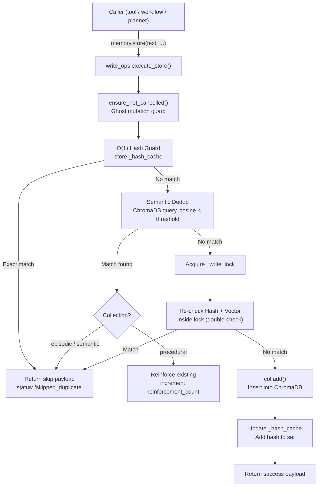
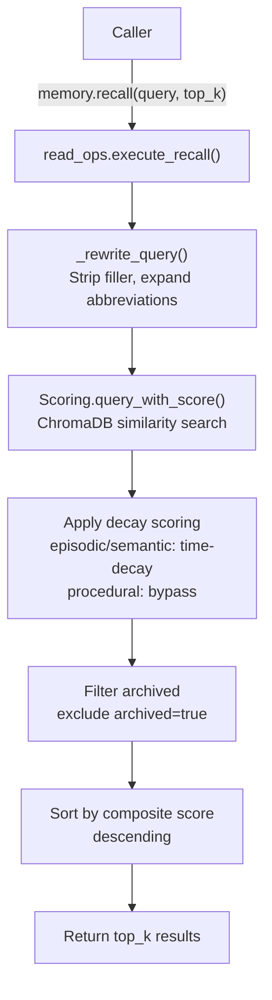
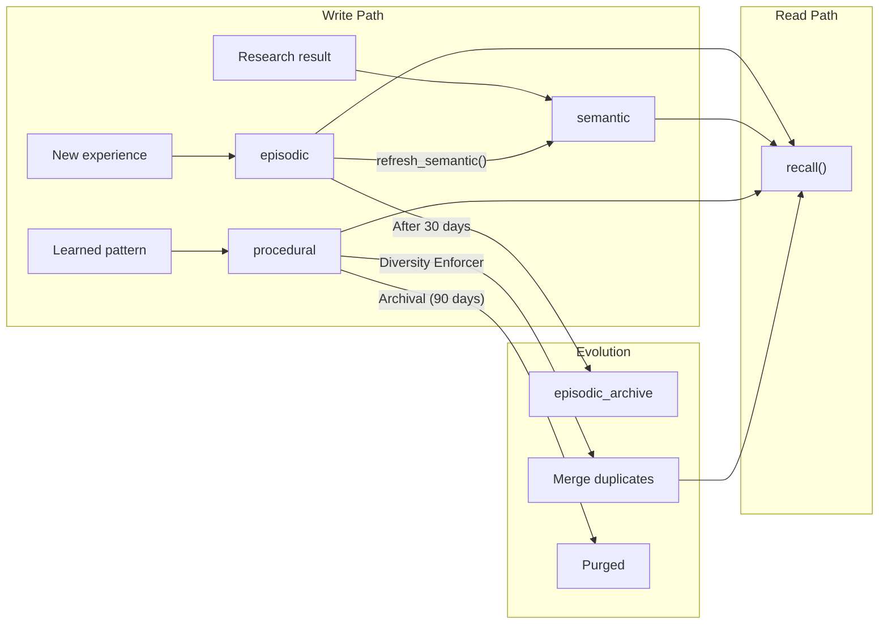
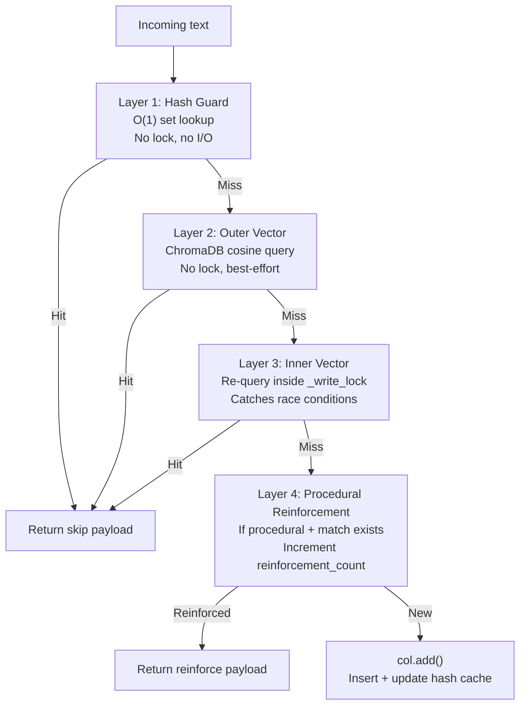
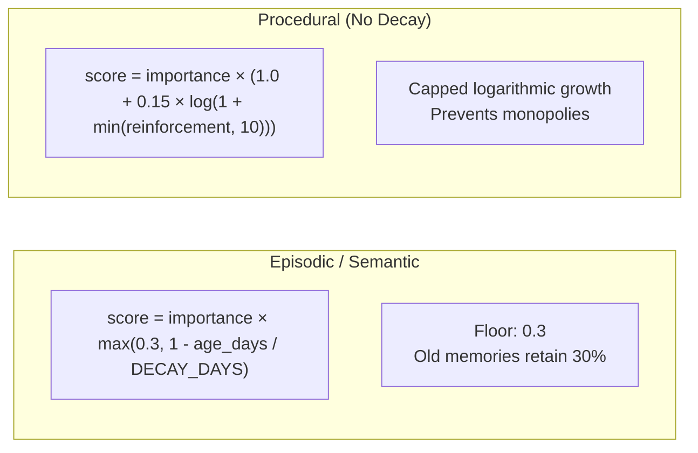
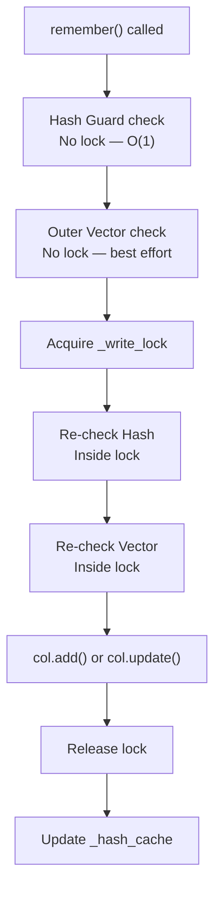
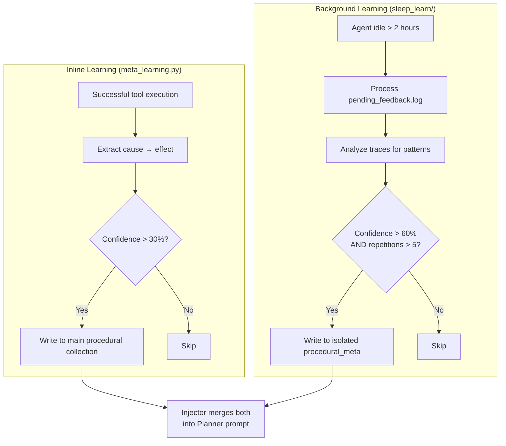
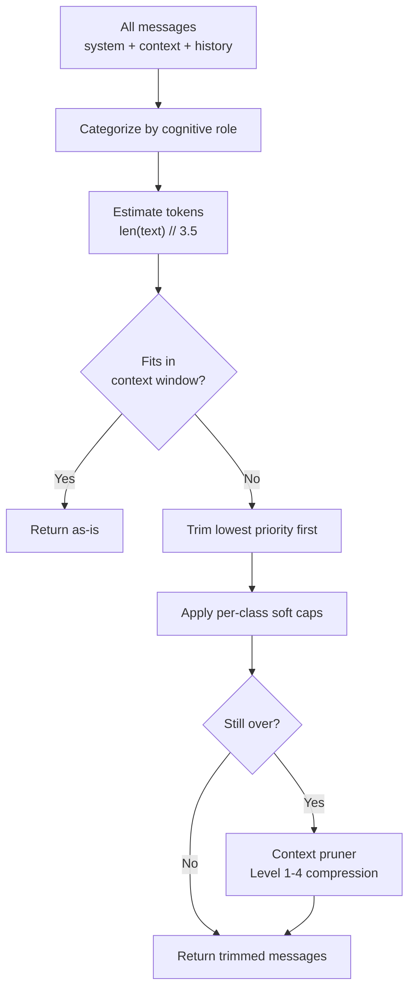

# 🧠 Memory Backend

The memory backend is a **three-collection ChromaDB vector store** with decay scoring, query rewriting, thread-safe write operations, and two learning subsystems. It provides persistent knowledge storage across **episodic** (events), **semantic** (facts), and **procedural** (skills) collections.

**Key characteristics:**
- **Three collections** — Episodic (what happened), semantic (what you know), procedural (how to do it)
- **Four-layer dedup** — Hash guard → outer vector → inner vector (inside lock) → procedural reinforcement
- **Decay scoring** — Memories fade over time; procedural memories bypass decay entirely
- **Two learning systems** — Inline meta-learning (fast) + background sleep-learning (deep)
- **Thread-safe writes** — `threading.Lock()` per collection with cancellation guards
- **Context budgeting** — Cognitive priority-based message trimming before LLM calls
- **Autonomous maintenance** — Diversity enforcer, janitor daemon, eviction engine

---

## ⚠️ Breaking Changes (pre-v1.0)

| Old | New | Migration |
|-----|-----|-----------|
| `core/memory.py` facade | `core/memory_engine.py` | Update all imports: `from core.memory import memory` → `from core.memory_engine import memory` |
| `memory.remember(text, collection=...)` | `memory.store(text, memory_type=...)` | Use `store()` with `memory_type` param, or typed helpers `store_episodic()` / `store_semantic()` / `store_procedural()` |
| `memory.write_procedural_rule()` | `memory.store_procedural()` | Same API, different method name |
| `memory.forget(query, ...)` | `memory.delete(query, ...)` | Same behavior, renamed for clarity |
| `memory.memory_vacuum()` | `memory.prune()` | Prune handles stale entry removal |
| `memory.memory_report()` | `memory.stats()` | Stats returns collection counts and health |
| `memory.compact()` | Not implemented | Use `memory.stats()` to check collection health |
| `memory.deduplicate()` | Not implemented | Dedup happens automatically on every write |
| `memory.memory_search()` | `memory.recall()` | Same behavior, `recall()` is the unified search |
| `memory.semantic_search()` | `memory.recall()` | Same behavior |
| `core/context_budget.py` | `core/llm_backend/rate_limit.py` | Context budgeting moved to LLM backend |

---

## 🚀 Quick Start

```python
from core.memory_engine import memory

# Store episodic (what happened)
memory.store_episodic(
    text="Fixed bug in memory.py -- missing colon after def",
    importance=8, goal="fix scraping bug", outcome="success",
    tools_used="python,git", trace_id="abc123"
)

# Store semantic (what you know)
memory.store_semantic(
    text="ChromaDB get_or_create_collection is idempotent",
    importance=7, tags="chromadb,startup"
)

# Store procedural (how to do it)
memory.store_procedural(
    text="To fix SyntaxError: always check line N-2 for unclosed bracket",
    importance=9, tags="syntax,debug"
)

# Recall (searches all collections by default)
results = memory.recall("how to fix syntax errors", top_k=5)
for r in results:
    print(r["text"], r["score"])
```

---

## 🏗️ Architecture

```text
core/memory_engine.py          # Thin facade — re-exports MemoryStore singleton
core/memory_backend/
├── store.py                   # MemoryStore class: collections, _write_lock, stats
├── write_ops.py               # execute_store() — TOCTOU-safe dedup + insert
├── read_ops.py                # execute_recall(), execute_recall_context()
├── scoring.py                 # _decay_score() + _rewrite_query() (model-free)
├── maintenance.py             # execute_delete/prune/summarize/stats/diversity_maintenance()
├── telemetry.py               # RecallTracker — RAM buffer, periodic ChromaDB flush
├── eviction.py                # EvictionQueue class + flusher_loop() — disk spill queue
├── janitor.py                 # archive_old_episodes() — episodic archival only
├── constants.py               # COLLECTION_*, META_FIELDS, dedup thresholds
├── client.py                  # get_client(timeout=60) — ChromaDB client singleton
├── budget.py                  # Cognitive context budgeting (7-tier ContextClass)
├── pruner.py                  # VRAM context pruning (artifact preservation + truncation)
├── meta_learning.py           # distill_and_store() + MetaLearner — inline learning from traces
└── procedural/                # distill.py, prompts.py, validate.py

core/sleep_learn/              # Background meta-learning daemon
├── daemon.py                  # start_background_daemon() — startup + midnight scheduler
├── feedback.py                # process_feedback() — confidence scoring loop
├── distiller.py               # distill_observation() — LLM rule extraction (60s timeout)
├── filters.py                 # is_quality_rule() — generic/dangerous rule rejection
├── storage.py                 # save_rule() — write to isolated ChromaDB collection
├── injector.py                # inject_rules_into_prompt() + get_relevant_rules()
├── logger.py                  # log_event() — structured JSONL logging
├── config.py                  # SLEEP_* configuration constants
├── sweeper.py                 # sweep_recent_observations() — Phase 1 passive event gathering
└── janitor.py                 # purge_stale_rules() — confidence + age-based rule purging
```

### Thin Facade Pattern

```python
# core/memory_engine.py — What callers see
from core.memory_backend.store import MemoryStore

# Singleton export
memory = MemoryStore()

# Usage throughout the codebase
from core.memory_engine import memory
memory.store(text="...", memory_type="semantic")
results = memory.recall("How does ChromaDB work?", top_k=5)
```

### Data Flow: Write Path



### Data Flow: Read Path



---

## 🗄️ Three Collections

| Collection | Purpose | Use Cases | Dedup Threshold | Decay | Pruning |
|------------|---------|-----------|-----------------|-------|---------|
| **episodic** | What happened | Task runs, workflow outcomes, errors, evicted context | 0.05 cosine sim | Yes (30-day half-life) | Archived after 30 days |
| **semantic** | What you know | Facts, research, domain knowledge, documentation | 0.15 cosine sim | Yes (30-day half-life) | Vacuum removes low-scored |
| **procedural** | How to do it | Fix patterns, solutions, reusable approaches | 0.08 cosine sim | **No** (bypass) | Protected from pruning |

### Collection Lifecycle



---

## 🛡️ Four-Layer Deduplication

Every write passes through four dedup layers before touching ChromaDB:

### Layer Architecture



### Layer Details

| Layer | Lock? | Cost | Catches | Implementation |
|-------|-------|------|---------|----------------|
| **1. Hash Guard** | No | O(1) | Exact duplicates | `content_hash in store._hash_cache` |
| **2. Outer Vector** | No | ~5ms | Semantic duplicates | ChromaDB `query()` with cosine threshold |
| **3. Inner Vector** | Yes | ~5ms | Race conditions | Re-query inside `_write_lock` |
| **4. Procedural** | Yes | ~5ms | Duplicate rules | Increment `reinforcement_count` if match |

### Duplicate Response Payload

When a duplicate is found, the system returns a structured payload (not a blind skip) to prevent LLM retry loops:

```json
{
  "status": "skipped_duplicate",
  "reason": "semantic_match",
  "action": "reference_existing",
  "directive": "This knowledge is already in memory. Do not retry.",
  "matched_snippet": "First 200 chars of existing text...",
  "existing_id": "uuid",
  "retry_recommended": false
}
```

### Procedural Reinforcement

If a semantic duplicate is found in the **procedural** collection, the system does NOT skip. It:
1. Fetches the existing memory
2. Increments `reinforcement_count`
3. Updates `last_reinforced` timestamp
4. Calls `col.update()` inside the write lock

This ensures frequently-reinforced rules surface higher in recall.

---

## 📊 Scoring System

### 4-Factor Confidence Score

Every memory has a composite confidence score calculated from four factors:

```python
confidence = (
    source_trust_weight      # 0.0-1.0: Trust level of the source
    × quality_score          # 0.0-1.0: Content quality (length, coherence)
    × verification_bonus       # 0.0-1.0: Whether it was verified/reinforced
    × time_decay               # 0.0-1.0: Age-based decay (episodic/semantic only)
)
```

### Decay Formulas



| Collection | Decay? | Formula | Floor | Boost |
|------------|--------|---------|-------|-------|
| episodic | Yes | `importance × max(0.3, 1 - age/30)` | 0.3 (30%) | None |
| semantic | Yes | `importance × max(0.3, 1 - age/30)` | 0.3 (30%) | None |
| procedural | **No** | `importance × (1.0 + 0.15 × log(1 + reinforcements))` | None | Logarithmic, capped at 10 |

### Query Rewriting

Before hitting ChromaDB, queries pass through a **model-free** rewrite step in `scoring.py`:

| Transformation | Example |
|----------------|---------|
| Strip filler words | "How do I **actually** fix this?" → "fix this" |
| Expand abbreviations | "py error" → "python error" |
| Preserve question starters | "What is ChromaDB" → kept as-is |
| Lowercase normalization | "ChromaDB Query" → "chromadb query" |

> ⚠️ **No LLM calls here.** Query rewriting is deliberately model-free for speed.

---

## 🔒 Thread Safety & Concurrency

### Write-Only Lock Pattern



**Key rules:**
- **Reads (`recall()`) are never locked** — ChromaDB handles concurrent reads internally
- **Writes are serialized** per collection via `threading.Lock()`
- **Double-check pattern** — Hash and vector are checked both outside and inside the lock
- **Hash cache sync** — `_hash_cache.discard()` is called on delete/prune to prevent ghost entries

### Cancellation Guards

All write operations check `ensure_not_cancelled(trace_id)` before mutating:

```python
from core.runtime.cancellation import ensure_not_cancelled

def remember(text, collection, trace_id, ...):
    ensure_not_cancelled(trace_id)  # Abort if workflow cancelled
    # ... proceed with write
```

This prevents "ghost mutations" — writes that happen after a workflow is cancelled but before the cancellation signal propagates.

---

## 🧠 Two Learning Systems

The memory backend has **two parallel systems** that extract procedural rules from execution history:

### System Comparison



### Detailed Comparison

| Aspect | Inline (`meta_learning.py`) | Background (`sleep_learn/`) |
|--------|---------------------------|---------------------------|
| **When** | After successful tool execution | During idle periods (>2h) or at startup + midnight |
| **Threshold** | 30% confidence (heuristic) | 60% confidence + 5+ repetitions |
| **Collection** | Main `procedural` | Isolated `procedural_meta` |
| **Latency** | Immediate effect | Deferred (next session) |
| **Source** | Single execution context | Cross-trace pattern analysis |
| **Dedup** | Hash + vector on main collection | Hash + vector on isolated collection |

### Injection Path

Both systems converge at the **injector** (`sleep_learn/injector.py`), which merges rules from both collections into the Planner's system prompt:

```python
# Injector reads from both collections
rules_main = memory.recall("", collection="procedural", top_k=20)
rules_sleep = get_relevant_rules(query, k=SLEEP_LEARN_MAX_INJECTED_RULES)

# Merges by hash dedup, injects into Planner prompt
prompt = base_prompt + "\n\n# Learned Rules\n" + merged_rules
```

### Feedback Loop

```
Tool execution → success/failure logged to pending_feedback.log
    → Sleep daemon processes feedback (every 10min during idle)
    → Distiller extracts rules via LLM (60s timeout)
    → Filters: new rules only, dedup, contradiction check
    → Storage: write to procedural_meta collection
    → Injector: merge into Planner prompt
    → Next execution benefits from learned rules
```

---

## 🧹 Maintenance & Cleanup

### Diversity Enforcement (Procedural Collection)

To prevent procedural memory pollution (near-duplicate or contradictory rules):

| Step | Trigger | Action |
|------|---------|--------|
| **Greedy Clustering** | Idle > 4h AND > 7 days since last run | Query top-20 neighbors, group rules with cosine distance < 0.12 |
| **Champion Selection** | Cluster with >1 rule | Highest-scoring rule becomes "Champion" |
| **Absorption** | Champion selected | `champ_score + log10(1 + sum(loser_scores))` — prevents runaway inflation |
| **Contradiction Guard** | Opposing polarity detected | Flag `contradiction_flagged: true`, don't merge |
| **Stale Archival** | `recall_count == 0` AND age > 30 days | Flag `archived: true` |
| **Permanent Purge** | `archived: true` AND age > 90 days | Delete from ChromaDB |

### Janitor Daemon

Runs during Sleep & Learn cycles or manually via `memory(action="janitor")`:

| Operation | Default Threshold | Action |
|-----------|-------------------|--------|
| Episodic archival | 30 days (`ARCHIVE_AGE_DAYS`) | Move to `episodic_archive` collection |
| Rule purging | 90 days (`PURGE_AGE_DAYS`) | Delete procedural rules |
| Confidence purge | score < 0.3 | Delete rules whose confidence dropped |
| ChromaDB compaction | On-demand | Force `chromadb.Client.persist()` |

### Eviction Engine

When working memory exceeds the context budget:

1. Low-priority state fields are offloaded to `episodic` collection
2. Replaced with clean placeholders in working memory
3. Offloading happens asynchronously (WAL-spill queue) to avoid blocking the hot path

### Memory Vacuum

```python
memory.prune()
# Removes: low-scored episodic (>30 days), stale semantic (>60 days)
# Preserves: procedural (protected), critical/protected tags
```

### Protected Memories

These are immune to automatic pruning:

| Protection | Applies To | How |
|------------|-----------|-----|
| Collection | `procedural` | Never pruned by `memory.prune()` |
| Tag: `"summary"` | Any collection | Skipped during vacuum |
| Tag: `"critical"` | Any collection | Skipped during vacuum |
| Tag: `"protected"` | Any collection | Skipped during vacuum |

---

## 📐 Context Budgeting

The context budget system decides what information enters the LLM's context window during long workflows.

### Cognitive Categories

| Category | Priority | Trim Strategy | Max Chars | Examples |
|----------|----------|---------------|-----------|----------|
| `procedural` | 1 (highest) | `tail` (keep latest) | 4000 | Rules, instructions |
| `core_facts` | 2 | `smart` (scored) | 3000 | Key facts, entity summaries |
| `tool_outputs` | 3 | `tail` (keep latest) | 8000 | Tool results, web scrapes |
| `conversational` | 4 | `head` (keep earliest) | 4000 | User/assistant messages |
| `social` | 5 (lowest) | `head` (keep earliest) | 2000 | Greetings, acknowledgments |

### Budget Flow



### Compression Levels (Context Pruner)

| Level | Action | When |
|-------|--------|------|
| 1 | Truncate tool outputs to `max_chars` | Tool output > 4000 chars |
| 2 | Drop lowest-priority messages | Still over budget after L1 |
| 3 | Truncate system prompt tail | System prompt > 2000 chars |
| 4 | Hard truncation with notice | All else fails |

---

## 🔍 Tag Validation

Tags are validated in `tools/memory.py` before passing to the backend:

| Rule | Validation |
|------|------------|
| Max tags per entry | 6 (`MAX_TAGS_PER_ENTRY`) |
| Max tag length | 50 chars (`MAX_TAG_LENGTH`) |
| Must start with | Letter `[a-zA-Z]` |
| Blocked characters | `< > " ' \` \|` (XSS/injection prevention) |
| Blocked patterns | Script tags, HTML entities |

---

## 📡 API Reference

### Write Operations

#### `store()` — Store a Memory

```python
result = memory.store(
    text="ChromaDB uses cosine similarity for vector search",
    memory_type="semantic",
    tags="chromadb,vector-search",
    importance=7,
    trace_id="abc123",
)
```

| Param | Type | Default | Description |
|-------|------|---------|-------------|
| `text` | `str` | — | **Required.** Memory content |
| `memory_type` | `str` | `"semantic"` | Target collection: `episodic` / `semantic` / `procedural` |
| `tags` | `str` | `""` | Comma-separated tags |
| `importance` | `int` | `5` | Base importance score (1–10) |
| `trace_id` | `str` | `""` | Trace identifier |
| `source` | `str` | `""` | Source attribution |
| `goal` | `str` | `""` | What was being attempted (episodic/procedural) |
| `outcome` | `str` | `"unknown"` | `success` / `failure` / `partial` / `unknown` |
| `tools_used` | `str` | `""` | Comma-separated tool names (episodic) |

**Typed helpers:**
- `store_episodic(text, importance=5, tags="", trace_id="", goal="", outcome="unknown", tools_used="")`
- `store_semantic(text, importance=5, tags="", trace_id="", source="")`
- `store_procedural(text, importance=7, tags="", trace_id="", goal="", outcome="success")`

**Returns:** `dict` — `{"status": "stored", "id": "uuid"}` or `{"status": "skipped_duplicate", ...}` or `{"status": "reinforced", ...}`

### Read Operations

#### `recall()` — Query Memory

```python
results = memory.recall(
    query="How does ChromaDB deduplication work?",
    top_k=5,
    collections=["semantic"],
    trace_id="abc123",
)
```

| Param | Type | Default | Description |
|-------|------|---------|-------------|
| `query` | `str` | — | **Required.** Natural language query |
| `top_k` | `int` | `cfg.memory_top_k` | Max results to return |
| `collections` | `list[str]` | `None` | Specific collections, or `None` for all |
| `trace_id` | `str` | `""` | Trace identifier |
| `min_score` | `float` | `0.5` | Minimum confidence threshold |
| `tags_filter` | `str` | `""` | Comma-separated — only return memories with ANY of these tags |

**Returns:** `list[dict]` — Each result has `text`, `collection`, `score`, `tags`, `metadata`, `id`

#### `recall_context()` — Formatted Context String

```python
context = memory.recall_context(
    query="how to fix syntax errors",
    top_k=3,
    collections=["procedural"],
)
# Returns: "[procedural | score=0.95 | 2d ago] To fix SyntaxError..."
```

### Maintenance Operations

| Operation | Method | Description |
|-----------|--------|-------------|
| Delete | `memory.delete(query, collections, threshold, confirm_ids)` | Remove specific memories by similarity |
| Prune | `memory.prune(max_age_days, min_importance, dry_run, collections)` | Remove stale/low-scored entries |
| Summarize | `memory.summarize(collections, top_n, store_result, trace_id)` | LLM summary of top memories |
| Stats | `memory.stats()` | Collection counts and sizes |
| Diversity | `memory.execute_diversity_maintenance(dry_run)` | Cluster and merge procedural rules |

---

## ⚙️ Configuration

### Environment Variables

| Env Variable | Default | Description |
|--------------|---------|-------------|
| `MEMORY_ROOT` | `{agent_root}/memory_db` | ChromaDB and SQLite storage root |
| `MEMORY_DELETE_THRESHOLD` | `0.4` | Decay score below which memories are pruned |
| `MEMORY_DECAY_DAYS` | `30` | Days until decay floor (0.3) is reached |
| `MEMORY_TOP_K` | `5` | Default results per recall query |
| `MAX_MEMORY_BYTES` | `50000` | Max bytes per memory entry (50KB) |
| `MAX_TAGS_PER_ENTRY` | `6` | Max tags per memory entry |
| `MAX_TAG_LENGTH` | `50` | Max characters per tag |
| `EMBED_MODEL` | `all-MiniLM-L6-v2` | ChromaDB embedding model |

### Sleep & Learn Configuration

| Env Variable | Default | Description |
|--------------|---------|-------------|
| `SLEEP_LEARN_ENABLED` | `true` | Toggle the entire daemon |
| `SLEEP_LEARN_IDLE_THRESHOLD_SEC` | `3600` (1h) | Minimum idle time before background learning |
| `SLEEP_LEARN_MIN_RULE_WORDS` | `10` | Minimum words per extracted rule |
| `SLEEP_LEARN_MAX_DAILY_DISTILLATIONS` | `20` | Max distillation runs per day |
| `SLEEP_LEARN_INJECT_ENABLED` | `true` | Kill switch for rule injection |
| `SLEEP_LEARN_MIN_CONFIDENCE` | `0.8` | Minimum confidence for rule extraction |
| `SLEEP_LEARN_MAX_INJECTED_RULES` | `3` | Max rules injected into Planner prompt |

---

## 📊 Observability

### Collection Statistics

```python
stats = memory.stats()
# Returns:
# {
#   "episodic": {"count": 1234},
#   "semantic": {"count": 567},
#   "procedural": {"count": 89},
# }
```

### Memory Report

```python
report = memory.summarize(collections=["episodic", "semantic"], top_n=30)
# Returns detailed summary including:
# - Top memories by decay score
# - Key patterns and fixes learned
# - Active goals and outcomes
```

### Telemetry (Opik Integration)

The `telemetry.py` module integrates with Opik for LLM call observability:

| Metric | Description |
|--------|-------------|
| `memory_write_latency` | Time to complete a write operation |
| `memory_read_latency` | Time to complete a recall query |
| `memory_dedup_hits` | Number of duplicates caught per collection |
| `memory_reinforcements` | Number of procedural rules reinforced |

---

## 🔀 When to Use What

| Scenario | Collection | Method |
|----------|-----------|--------|
| Store a conversation outcome | `episodic` | `memory.store_episodic(text, ...)` |
| Store a research finding | `semantic` | `memory.store_semantic(text, ...)` |
| Store a reusable pattern | `procedural` | `memory.store_procedural(text, ...)` |
| Search for facts | `semantic` | `memory.recall(query, collections=["semantic"])` |
| Search for how-to patterns | `procedural` | `memory.recall(query, collections=["procedural"])` |
| Search across everything | All | `memory.recall(query)` (no collection filter) |
| Remove stale entries | — | `memory.prune()` |
| Check memory health | — | `memory.stats()` |
| Force cleanup | — | `memory(action="janitor")` via tool |

---

## 🧪 Testing

```powershell
# Run all memory backend tests
D:\mcp\agent\venv\Scripts\pytest.exe tests/core/memory/ -v -W error --tb=short
```

**Mock strategy:**
- Mock `chromadb.Collection` for all unit tests
- Mock `cfg` for threshold and path configuration
- Use `reset_memory_state` fixture to clear globals between tests

---

## ⚠️ Known Concerns

> **Note:** These are MiMo's observations from source code review. They are constructive suggestions, not definitive prescriptions.

### Two Parallel Learning Systems

**What exists:**
- `core/memory_backend/meta_learning.py` — inline learning, writes to main `procedural` collection. Rewritten to a heuristic/template-based extractor (no LLM call, no single confidence threshold) — each rule template carries its own fixed confidence value (0.8–0.9) as metadata. A separate `>0.95` similarity check treats near-duplicates as reinforcement rather than new rules.
- `core/sleep_learn/` — background daemon, writes to isolated `procedural_meta` collection, `SLEEP_LEARN_MIN_CONFIDENCE` gate (default **0.8**, not 0.6).

**The concern:**
Both systems extract procedural rules from execution history. The injector merges both collections into the Planner prompt. This works, but:

1. **Semantic duplicates** — the same rule expressed differently in both collections will both be injected. Hash-based dedup catches exact matches, but not paraphrases.
2. **Authority ambiguity** — when rules conflict, there's no resolution mechanism.
3. **Maintenance burden** — two codebases, two sets of filters, two storage paths.
4. **Incomplete implementation** — The sweeper and janitor in `sleep_learn/` are partially implemented (sweeper is Phase 1 passive observation only; janitor has full purge logic). Full unification requires a dedicated testing session.

**Suggestion:**
Consider consolidating into a single pipeline with two modes (fast/deep) writing to the same collection with `source` metadata. The sweeper needs tracer/memory integration to become operational.

### Two Context Budgeting Systems

**What exists:**
- `core/llm_backend/rate_limit.py` — Rate limiting, token budgeting, and cost estimation. Uses `// 4` token estimation fallback. Handles `truncate_by_tokens()` with tiktoken and fallback.
- `core/memory_backend/budget.py` — Cognitive priority-based context budgeting with 7-tier `ContextClass` categories and trim strategies.

**The concern:**
Two systems with different estimation factors produce inconsistent results. `core/llm_backend/rate_limit.py` is the canonical system used by `LLMClient`, but `core/memory_backend/budget.py` exists separately for memory-specific context operations.

**Suggestion:**
Consolidate into a single module. Make `core/llm_backend/rate_limit.py` the public API, keep `core/memory_backend/budget.py` as an internal utility or merge it.

---

## 🗺️ Roadmap

### ✅ Completed

| Feature | Status | Notes |
|---------|--------|-------|
| Three-collection architecture | ✅ pre-v1 | Episodic, semantic, procedural |
| Four-layer dedup | ✅ pre-v1 | Hash guard + outer vector + inner vector + procedural reinforcement |
| Decay scoring | ✅ pre-v1 | Time-decay with procedural bypass |
| Context budgeting | ✅ pre-v1 | Cognitive priority-based message trimming (7-tier) |
| Diversity enforcement | ✅ pre-v1 | Autonomous procedural collection cleanup |
| Inline meta-learning | ✅ pre-v1 | `meta_learning.py` — fast, low-threshold |
| Background sleep-learning | ✅ pre-v1 | Daemon, feedback, distiller, filters, storage, injector |
| Thread-safe writes | ✅ pre-v1 | `_write_lock` with double-check locking |
| Cancellation guards | ✅ pre-v1 | `ensure_not_cancelled()` on all writes |
| Telemetry integration | ✅ pre-v1 | Opik observability for latency and dedup metrics |

### 🔄 In Progress / Next Up

| Feature | Notes | Priority |
|---------|-------|----------|
| Sweeper integration | Phase 1 passive observation only; needs tracer/memory integration | P1 |
| Janitor consolidation | `sleep_learn/janitor.py` has purge logic; `memory_backend/janitor.py` handles episodic archival | P1 |
| Consolidated learning pipeline | Merge inline + background into single system with `source` metadata | P2 |
| Context budget unification | Merge `core/memory_backend/budget.py` into `core/llm_backend/rate_limit.py` | P2 |
| Multi-modal memory | Image and audio embeddings | P3 |
| Memory graph | Relationship tracking between memories | P3 |
| Cross-session learning | Share learned rules across agent instances | P3 |

### 🚫 Deferred / Out of Scope

| # | Feature | Why Deferred | Priority |
|---|---------|------------|----------|
| 1 | Streaming memory writes | ChromaDB does not support streaming inserts | Skip |
| 2 | Distributed memory | Single-node ChromaDB is sufficient for current scale | Skip |
| 3 | Persistent event loop for writes | ThreadPoolExecutor per write is sufficient | Skip |
| 4 | Custom embedding models | `all-MiniLM-L6-v2` is fast and accurate enough | Skip |
| 5 | Real-time sync across agents | No multi-agent deployment currently | Skip |
| 6 | Configurable decay half-life | Hardcoded 30 days is appropriate for all use cases | Skip |

---

## 🛡️ AI Agent Instructions

### NEVER DO
1. **Never add logic to `core/memory_engine.py` or `store.py`** — Logic belongs in `write_ops.py`, `read_ops.py`, `scoring.py`, `maintenance.py`, etc.
2. **Never remove the `_write_lock` or double-check locking pattern** — Never lock `recall()` operations.
3. **Never remove the `store._hash_cache` synchronization** — Call `.discard()` on delete/prune to prevent ghost entries.
4. **Never return a blind `{"status": "skipped_duplicate"}`** — Always use the structured payload with `directive` and `matched_snippet`.
5. **Never skip procedural duplicates** — Always increment `reinforcement_count` inside the write lock.
6. **Never apply time-decay to `collection == "procedural"`** — Decay bypass is intentional.
7. **Never remove `ensure_not_cancelled(trace_id)` guards** — All write operations must check cancellation before mutating.
8. **Never validate tags in the backend** — Tag validation belongs in `tools/memory.py` before passing to the backend.
9. **Never add LLM calls to `_rewrite_query()`** — Query rewriting is model-free for speed.
10. **Never manually delete or merge procedural rules** — The background Diversity Enforcer handles this autonomously.
11. **Never prune `procedural` collection or memories tagged `"summary"`, `"critical"`, `"protected"`** — These are immune to automatic pruning.
12. **Never create `.bak` files** — Forbidden by project rules.
13. **Never rewrite entire files** — Surgical edits only. Preserve existing code exactly.
14. **Never add `**kwargs` to the `@tool` facade** — FastMCP schema breaks.
15. **Never print to stdout** — MCP stdio corruption. Return dicts only.
16. **Never skip `compileall` before `pytest`** — Catches syntax errors early.

### ALWAYS DO
17. **Always use `from core.memory_engine import memory`** — The facade is the only public API surface.
18. **Always thread `trace_id` through all operations** — For observability and cancellation.
19. **Always call `ensure_not_cancelled(trace_id)` before writes** — Prevents ghost mutations.
20. **Always use typed helpers (`store_episodic`, `store_semantic`, `store_procedural`)** — Clearer intent than raw `store()`.
21. **Always include `error_code` in `fail()` calls** — Every error response must include a structured code.
22. **Always run `compileall` after editing memory files** — Verify syntax before running tests.
23. **Always run targeted tests (`tests/core/memory/`) after changes** — 41 tests cover the full backend.

---

## 🔗 Source Code Reference

| File | Purpose |
|------|---------|
| `core/memory_engine.py` | Thin facade — re-exports `memory` singleton |
| `core/memory_backend/store.py` | `MemoryStore`: collections, stats, compact, delete |
| `core/memory_backend/write_ops.py` | `execute_store()` — dedup pipeline |
| `core/memory_backend/read_ops.py` | `execute_recall()`, `execute_recall_context()` |
| `core/memory_backend/scoring.py` | 4-factor confidence scoring, query rewriting |
| `core/memory_backend/maintenance.py` | `execute_delete/prune/summarize/stats/diversity_maintenance()` |
| `core/memory_backend/telemetry.py` | Opik integration for observability |
| `core/memory_backend/eviction.py` | `EvictionEngine`: pruning, compaction, budget enforcement |
| `core/memory_backend/janitor.py` | `archive_old_episodes()`: episodic archival only |
| `core/memory_backend/constants.py` | Shared constants (banned files, limits) |
| `core/memory_backend/client.py` | `get_client(timeout=60)` — ChromaDB client singleton |
| `core/memory_backend/budget.py` | Cognitive priority-based context budgeting (7-tier) |
| `core/memory_backend/pruner.py` | Overflow-aware context compression (VRAM artifact pruning) |
| `core/memory_backend/meta_learning.py` | Inline learning, heuristic/template-based |
| `core/sleep_learn/daemon.py` | Background daemon startup |
| `core/sleep_learn/feedback.py` | Pending feedback processing |
| `core/sleep_learn/distiller.py` | Trace analysis → rule extraction |
| `core/sleep_learn/filters.py` | New rules, dedup, contradictions |
| `core/sleep_learn/storage.py` | Write rules to isolated collection |
| `core/sleep_learn/injector.py` | Merge rules into Planner prompt |
| `core/sleep_learn/config.py` | SLEEP_* configuration constants |
| `core/sleep_learn/sweeper.py` | Phase 1: Passive observation gathering |
| `core/sleep_learn/janitor.py` | Purge stale rules from isolated collection |
| `core/runtime/cancellation.py` | `ensure_not_cancelled()` — ghost mutation guard |
| `core/config.py` | Memory tuning params, ChromaDB paths |

---

*Last updated: July 2026. All collection names, scoring formulas, and configuration values reflect current source code.*
