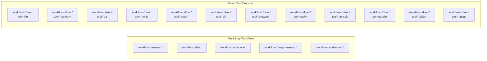
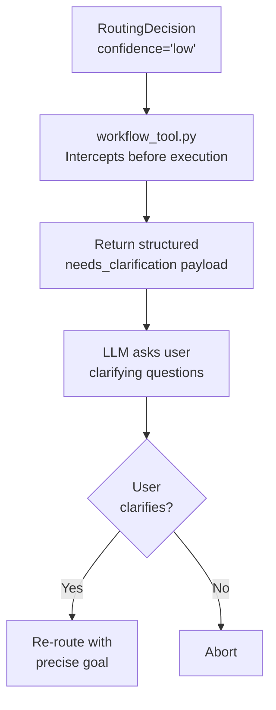
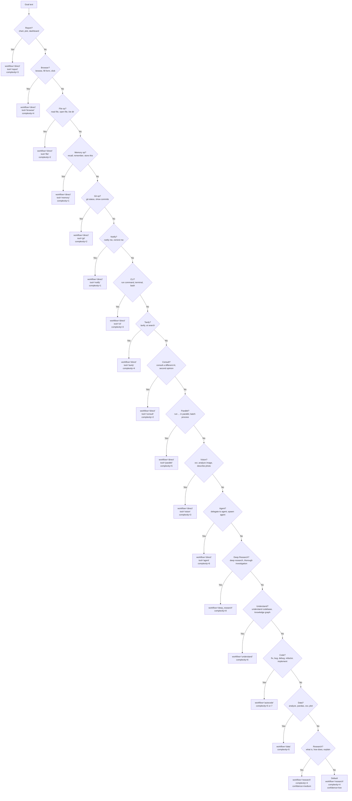

# 🧭 Task Router

The Task Router (`core/router.py`) is the **ultra-fast classification layer** that sits between the user's goal and the workflow execution engine. It uses the dedicated Router role (`cfg.router_model`) to classify intent, determine complexity, and select the correct workflow or direct tool, all within a strict 15-second timeout.

**Key characteristics:**
- **Speed-first** — 15s hard timeout, falls back to heuristics if model is slow or unavailable
- **Dual-mode routing** — Model-based (primary) + keyword heuristics (fallback)
- **Confidence-aware** — Low-confidence decisions include clarifying questions to prevent wasted VRAM
- **Robust JSON extraction** — 3-layer pipeline handles markdown fences, nested objects, and escaped quotes
- **Zero hardcoding** — All model references use `cfg.router_model`

---

## 🏗️ Architecture

### Component Map

```
core/router.py
├── ROUTER_SYSTEM_PROMPT    # Module-level constant (extracted for testability)
├── ROUTER_TOOLS            # Module-level list: 15 registered tools
├── ROUTER_WORKFLOWS        # Module-level list: 5 workflows
├── RoutingDecision         # Dataclass: workflow, tool, complexity, reason, confidence
├── TaskRouter (singleton)
│   ├── route()             # Primary entry point — model → heuristic fallback
│   ├── classify_complexity() # Quick 1-10 complexity score
│   ├── _model_route()      # LLM-based classification (Router role, 15s timeout)
│   ├── _heuristic_route()  # Keyword-based fallback (pre-compiled regex)
│   └── _extract_first_json() # Deterministic JSON extraction (3-layer)
└── router                  # Module-level singleton
```

### Routing Flow


### Design Goals

| Goal | How |
|------|-----|
| **Speed** | 15s hard timeout on LLM call; heuristic fallback is O(1) regex |
| **Cost efficiency** | Prevents heavy Planner model from loading for simple tasks |
| **Graceful degradation** | Works even when LM Studio is completely offline |
| **VRAM protection** | Confidence Guard aborts vague tasks before launching expensive workflows |
| **Robustness** | 3-layer JSON extraction handles messy LLM output |

---

## 🧠 The Routing Decision

Every routing attempt returns a `RoutingDecision` object. This standardized output is consumed by the workflow tool, the dispatcher, and the gateway.

### Dataclass

```python
class RoutingDecision:
    workflow: str           # "research", "data", "autocode", "deep_research", "understand", or "direct"
    tool: str               # "web", "file", "git", "memory", "workflow", "cli", "browser", etc.
    complexity: int         # 1-10 scale
    reason: str             # Human/LLM-readable explanation
    confidence: str         # "high", "medium", "low"
    clarifying_questions: list[str]  # Questions for low-confidence routes
    raw: dict               # Original raw dict from LLM or heuristic
```

### Routing Targets



| Routing Type | `workflow` | `tool` | When |
|-------------|-----------|--------|------|
| **Multi-step workflow** | `"research"` | `"workflow"` | Finding info, summarizing, reading docs, Q&A |
| **Multi-step workflow** | `"data"` | `"workflow"` | Pandas, analysis, calculations, charts, spreadsheets |
| **Multi-step workflow** | `"autocode"` | `"workflow"` | Fixing bugs, editing code, adding features |
| **Multi-step workflow** | `"deep_research"` | `"workflow"` | Complex, multi-faceted research with iterative synthesis |
| **Multi-step workflow** | `"understand"` | `"workflow"` | Build or query codebase knowledge graph |
| **Direct tool** | `"direct"` | `"file"` | Read file, open file, list directory |
| **Direct tool** | `"direct"` | `"memory"` | Recall, remember, store to memory |
| **Direct tool** | `"direct"` | `"git"` | Git status, show commits, git diff |
| **Direct tool** | `"direct"` | `"notify"` | Notify me, remind me |
| **Direct tool** | `"direct"` | `"report"` | Create chart, plot, dashboard |
| **Direct tool** | `"direct"` | `"cli"` | Run shell commands, system administration |
| **Direct tool** | `"direct"` | `"browser"` | Browse JS-rendered pages, fill forms, click buttons |
| **Direct tool** | `"direct"` | `"tavily"` | AI-powered deep web search |
| **Direct tool** | `"direct"` | `"consult"` | Ask another LLM for a second opinion |
| **Direct tool** | `"direct"` | `"parallel"` | Execute multiple independent tasks concurrently |
| **Direct tool** | `"direct"` | `"vision"` | Image analysis, OCR, screenshot description |
| **Direct tool** | `"direct"` | `"agent"` | Delegate to sub-agent for complex sub-tasks |

### Workflow vs. Direct Routing

- **Workflow Routing** (`workflow="research|data|autocode|deep_research|understand"`): The task requires a multi-step LangGraph state machine. The Planner generates a plan, the Executor runs each step.
- **Direct Routing** (`workflow="direct"`): The task is a simple, single-step action. The router bypasses the workflow engine and tells the dispatcher to call the specific tool directly.

---

## 🛡️ Confidence Guard (Pre-Execution Interception)

To prevent the agent from wasting 15+ minutes and massive VRAM on misunderstood tasks, the workflow tool intercepts `low` confidence routing decisions **before** launching any workflow.

### How It Works



### Confidence Thresholds

| Confidence | Meaning | System Behavior |
|------------|---------|-----------------|
| **`high`** | Clear task with specific details | Proceed immediately to workflow execution |
| **`medium`** | Understandable but could be more specific | Proceed; workflow nodes may ask clarifying questions if needed |
| **`low`** | Vague, ambiguous, or missing critical context | **ABORT.** Trigger Confidence Guard. Return clarifying questions. |

### Example: Low Confidence Response

```json
{
  "status": "needs_clarification",
  "reason": "The task goal is too vague to proceed confidently.",
  "clarifying_questions": [
    "Which specific file needs fixing?",
    "What is the exact error message?"
  ],
  "message": "To help me understand your request better, please clarify:\n- Which specific file needs fixing?\n- What is the exact error message?",
  "trace_id": "abc123"
}
```

### VRAM Savings

| Scenario | Without Guard | With Guard |
|----------|--------------|------------|
| "Fix the bug" | Load Planner (6GB VRAM) → 5min planning → fail (no file specified) | Instant response → user clarifies → precise execution |
| "Do something with data" | Load Planner → load pandas → crash (no data specified) | Instant response → user specifies file and operation |
| "Help me" | Load everything → generic unhelpful response | Instant response → asks what specifically |

---

## 🔄 Two-Tier Routing Strategy

### Tier 1: Model-Based Routing (Primary)

The Router attempts to classify the task using the lightweight Router LLM.

**The Prompt:**

```
No thinking. No explanation.
{"workflow": "research or data or autocode or deep_research or understand",
 "tool": "web or python or file or git or memory or agent or notify or report or vision or workflow or cli or browser or tavily or consult or parallel",
 "complexity": 5,
 "reason": "one sentence",
 "confidence": "high or medium or low",
 "clarifying_questions": ["question1", "question2"]}

Workflow routing rules:
- research: finding info, summarising, reading docs, Q&A
- data: pandas, analysis, calculations, charts, spreadsheets
- autocode: fixing bugs, editing code files, adding features
- deep_research: complex multi-faceted research, iterative evidence synthesis
- understand: build or query codebase knowledge graph, analyze project structure

Tool routing rules (for direct workflow):
- web: general web search and page reading
- python: data analysis, calculations, plotting
- file: read, write, list files and directories
- git: git operations, commits, diffs, status
- memory: recall, store, search memories
- agent: delegate to sub-agent for complex sub-tasks
- notify: send notifications and reminders
- report: create charts, dashboards, visual reports
- vision: image analysis and description
- workflow: multi-step task execution via workflow engine
- cli: shell commands, system administration, package management
- browser: JavaScript-rendered pages, screenshots, form interaction
- tavily: AI-powered deep web search
- consult: ask another LLM for a second opinion
- parallel: execute multiple independent tasks concurrently

Confidence rules:
- high: Clear task with specific details
- medium: Understandable but could be more specific
- low: Vague or ambiguous. MUST provide 1-2 clarifying questions.
```

**Key design decisions:**
- `"No thinking. No explanation."` — Suppresses thinking tokens for models like Qwen3 or Gemma that support them. Keeps the router fast.
- Structured JSON schema — Tells the model exactly what fields to output.
- Routing rules embedded in prompt — Gives the model clear decision boundaries.
- Confidence rules with `MUST` — Forces the model to include clarifying questions on low confidence.

**Extraction Pipeline:**

```mermaid
graph TD
    A["Raw LLM Response"] --> B["Strip markdown fences\n```json ... ```"]
    B --> C["Try direct parse\njson.loads(text)"]
    C -->|Success| D["Return RoutingDecision"]
    C -->|Fail| E["Layer 3: raw_decode\njson.JSONDecoder().raw_decode()"]
    E -->|Find first { }| F["Parse extracted JSON"]
    F -->|Valid + has 'workflow'| D
    F -->|Invalid| G["Return None\nFall back to heuristics"]
    E -->|No { } found| G
```

### Tier 2: Heuristic Routing (Fallback)

If the LLM call fails, times out, or returns invalid JSON, the `_heuristic_route()` method instantly classifies the goal using **pre-compiled regex patterns**.

**Priority Order (most specific first):**



### Regex Patterns (Pre-compiled)

| Pattern | Regex | Routes To |
|---------|-------|-----------|
| `_RE_REPORT` | `\b(create a chart\|create chart\|make a chart\|plot a chart\|draw a chart\|visualise\|create a graph\|make a graph\|create a map\|make a map\|create a dashboard\|make a dashboard\|create a report\|make a report\|bar chart\|line chart\|pie chart\|scatter plot\|heatmap)\b` | `direct → report` |
| `_RE_DIRECT_BROWSER` | `\b(browse\|fill form\|click button\|js-rendered\|open page\|take a screenshot\|capture screen\|web automation\|headless browser)\b` | `direct → browser` |
| `_RE_DIRECT_FILE` | `\b(read file\|open file\|list files\|list directory\|write file\|show file\|read the file\|open the file)\b` | `direct → file` |
| `_RE_DIRECT_MEMORY` | `\b(recall\|remember\|what do you know about\|store this\|save this to memory)\b` | `direct → memory` |
| `_RE_DIRECT_GIT` | `\b(git status\|git log\|show commits\|git diff\|commit this\|git commit)\b` | `direct → git` |
| `_RE_DIRECT_NOTIFY` | `\b(notify me\|send notification\|remind me\|schedule reminder)\b` | `direct → notify` |
| `_RE_DIRECT_CLI` | `\b(run command\|execute shell\|terminal\|bash\|powershell\|pip install\|npm install\|yarn install\|composer install\|docker build\|docker run\|kubectl\|terraform apply\|ansible)\b` | `direct → cli` |
| `_RE_DIRECT_TAVILY` | `\b(tavily\|ai search\|deep search\|advanced search\|ai-powered search\|intelligent search)\b` | `direct → tavily` |
| `_RE_DIRECT_CONSULT` | `\b(consult a different (?:ai\|llm\|model)\|ask another model\|get another perspective\|ask a different llm\|let's get a second opinion\|second opinion from (?:ai\|llm\|model))\b` | `direct → consult` |
| `_RE_DIRECT_PARALLEL` | `\b(run\s+.*?\s+in\s+parallel\|run\s+.*?\s+at\s+the\s+same\s+time\|batch process\|concurrently\|run together\|parallel execution)\b` | `direct → parallel` |
| `_RE_DIRECT_VISION` | `\b(ocr\s+(?:this\|the\|that\|these\|those\|an\|a\|my)\|analyze\s+.*?\s+image\|describe\s+.*?\s+image\|what\s+is\s+in\s+this\s+image\|read\s+this\s+image\|image\s+description\|analyze\s+this\s+photo\|what\s+does\s+this\s+picture\s+show\|read\s+text\s+from\s+image\|screenshot\s+analysis)\b` | `direct → vision` |
| `_RE_DIRECT_AGENT` | `\b(delegate\s+.*?\s+agent\|spawn\s+an\s+agent\|use\s+an\s+agent\|sub-agent\|let\s+an\s+agent\|have\s+an\s+agent)\b` | `direct → agent` |
| `_RE_DEEP_RESEARCH` | `\b(deep research\|thorough investigation\|comprehensive report\|iterative research\|multi-faceted research\|extensive research\|in-depth analysis\|detailed investigation)\b` | `deep_research → workflow` |
| `_RE_UNDERSTAND` | `\b(understand codebase\|build knowledge graph\|analyze project structure\|index codebase\|codebase overview\|project analysis\|map dependencies\|explore codebase\|scan project)\b` | `understand → workflow` |
| `_RE_CODE` | `\b(fix\|bug\|debug\|audit\|patch\|refactor\|improve\|add feature\|implement\|edit\|modify\|update code\|error message\|runtime error\|type error\|syntax error\|logic error)\b` | `autocode` |
| `_RE_DATA` | `\b(analyse\|analyze\|calculate\|compute\|csv\|excel\|spreadsheet\|statistics\|pandas\|numpy\|dataset)\b` | `data` |
| `_RE_RESEARCH` | `\b(what is\|what are\|how does\|explain\|research\|find information\|summarise\|summarize\|look up)\b` | `research (step 17, medium confidence)` |

> ⚠️ **All patterns are case-insensitive** (`re.IGNORECASE`).
> 
> **Note on `_RE_RESEARCH`:** This pattern is checked at step 17 (before the default catch-all at step 18). Goals with explicit research keywords like "what is" or "explain" get `confidence="medium"` instead of the default `confidence="low"`.

### Code-File Bonus

When the `_RE_CODE` pattern matches, the heuristic checks if the goal also mentions a file extension (`.py`, `.js`, `.ts`, `.json`, `.yaml`, `.md`):

| Condition | Complexity | Reasoning |
|-----------|-----------|-----------|
| Code keywords + file extension mentioned | 7 | More likely a specific file edit |
| Code keywords only | 5 | Might be a general code question |

---

## 📊 Complexity Classification

The Router can independently score task complexity on a 1-10 scale. This is used by workflows to adjust timeout limits, retry counts, and context window sizes.

### The Scale

| Range | Meaning | Examples |
|-------|---------|----------|
| **1-3** | Single tool, clear input/output | "read file X", "git status", "remember this" |
| **4-6** | Multi-step, predictable | "summarize this URL", "analyze this CSV" |
| **7-9** | Complex, multiple tools, uncertainty | "fix the authentication bug", "refactor the memory module" |
| **10** | Requires human judgment | "redesign the entire architecture" |

### Usage

```python
from core.router import router

# Quick complexity score (uses Router LLM, 15s timeout)
score = router.classify_complexity("Research ChromaDB")
# Returns: 4

score = router.classify_complexity("Fix the authentication bug in tools/web.py and add unit tests")
# Returns: 8

# Falls back to 5 on LLM failure
score = router.classify_complexity("do stuff")
# Returns: 5 (default)
```

---

## 📡 API Reference

### `route()` — Primary Entry Point

```python
decision = router.route(
    goal="Fix the timeout bug in tools/web.py",
    trace_id="abc123",
)
```

| Param | Type | Default | Description |
|-------|------|---------|-------------|
| `goal` | `str` | — | **Required.** The user's free-text task description |
| `trace_id` | `str` | `""` | Trace identifier for logging |

**Returns:** `RoutingDecision`

```python
decision.workflow  # "autocode"
decision.tool      # "workflow"
decision.complexity  # 7
decision.reason    # "Involves editing an existing code file to fix a bug"
decision.confidence  # "high"
decision.clarifying_questions  # []
```

### `classify_complexity()` — Quick Complexity Score

```python
score = router.classify_complexity("Calculate the mean of column A in data.csv")
# Returns: 5
```

| Param | Type | Default | Description |
|-------|------|---------|-------------|
| `goal` | `str` | — | **Required.** The user's task description |

**Returns:** `int` (1-10). Falls back to `5` on LLM failure.

---

## ⚙️ Configuration

| Env Variable | Default | Description |
|--------------|---------|-------------|
| `ROUTER_MODEL` | Falls back to planner | Fast, small model for classification |
| `ROUTER_TIMEOUT` | `15` | Hard timeout in seconds |

**Current configuration:**

```ini
ROUTER_MODEL=gemma-2-2b-it
ROUTER_TIMEOUT=15
```

**Why a 15s timeout?**
The Router must never block the user experience. If the model takes longer than 15 seconds to classify a task, the system assumes it's hung and immediately falls back to the heuristic engine. This is the tightest timeout in the system.

---

## 🔀 When to Use vs. Alternatives

| Scenario | Tool | Why |
|----------|------|-----|
| Classify a new task | `router.route(goal)` | Determines which workflow/tool to use |
| Score task complexity | `router.classify_complexity(goal)` | Used by workflows for timeout adjustment |
| Skip routing (known task) | Call workflow/tool directly | When you already know which tool to use |
| Gateway dispatch | `dispatcher.dispatch()` | Uses router internally for `workflow: "auto"` |

---

## 🧪 Testing

```powershell
# Run all router tests
D:\mcp\agent\venv\Scripts\pytest.exe tests/core/router/ -v -W error
```

**Test organization:**
- `conftest.py` — Shared fixtures (mock LLM, mock registry, canonical expected sets)
- `test_router_tools_complete.py` — Structural: all tools/workflows appear in prompt
- `test_router_routing_rules.py` — Parameterized: each tool/workflow has a routing rule
- `test_router_heuristic_fallback.py` — Behavioral: heuristic patterns route correctly + false-positive regression tests
- `test_router_drift.py` — CI check: prompt tool list matches expected set

**Mock strategy:**
- Mock `llm.complete()` to return controlled JSON responses
- Test heuristic routing separately (no LLM dependency)
- Test JSON extraction with malformed inputs (markdown fences, nested objects, trailing text)

---

## ⚠️ Known Concerns

> **Note:** These are observations from source code review. They are constructive suggestions, not definitive prescriptions.

### Heuristic Pattern Overlap

**What exists:**
The `_RE_REPORT` regex matches words like `chart`, `plot`, `dashboard`. The `_RE_DATA` regex also matches `csv`, `excel`, `spreadsheet`. The `_RE_DIRECT_BROWSER` matches `take a screenshot` which could overlap with vision's `screenshot analysis`.

**The concern:**
Since report is checked first in `_heuristic_route()`, goals like "plot a chart of this data" will route to `direct → report` instead of `data → python`. This may or may not be the desired behavior depending on whether the user wants a static report or a data analysis workflow.

**Mitigation:**
The priority order is intentional — direct tool requests are more specific than workflow requests. If a user says "create a chart", they likely want the report tool. If they say "analyze this CSV with pandas", the data workflow catches it because `pandas` is in `_RE_DATA` but not in `_RE_REPORT`.

### Router Prompt Length

**What exists:**
The router prompt now lists 5 workflows and 15 tools with individual routing rules. This is ~30 lines of prompt text.

**The concern:**
For very small router models (e.g., 2B parameters), a longer prompt may slightly increase latency.

**Mitigation:**
The prompt is still well within the context window of gemma-2-2b-it (8K context). The routing rules are essential for accurate classification. If latency becomes an issue, the rules can be compressed into a single-line format.

---

## 🛡️ AI Agent Instructions

If you are an AI assistant modifying `core/router.py`:

1. **Never remove the Confidence Guard** — the `low` confidence interception in `tools/workflow_tool.py` prevents massive VRAM waste on misunderstood tasks.
2. **Never remove the heuristic fallback** — if LM Studio is offline, the agent must still route basic tasks via keywords.
3. **Do not simplify the JSON parser** — do not replace `_extract_first_json()` with `re.search(r'{.*}')`. The `raw_decode()` approach handles nested objects and escaped quotes safely.
4. **Keep it fast** — do not add heavy computations, file I/O, or secondary LLM calls to the routing path. This must remain ultra-lightweight.
5. **Update keyword lists carefully** — when adding to regex patterns, ensure there is no overlap that would cause a direct tool request to be misrouted to a heavy workflow.
6. **No hardcoded models** — always use `role="router"` in `llm.complete()`. Never hardcode model identifiers.
7. **Trace integration** — all routing decisions must be logged via `tracer.step()` with `trace_id`.
8. **Pre-compiled regex** — all new keyword patterns must be `re.compile()` at class level, not compiled on every call.
9. **Check priority order** — when adding new patterns, insert them in the correct priority position in `_heuristic_route()`. More specific patterns must come before more general ones.
10. **Keep prompt in sync** — when adding a new tool or workflow, update BOTH the system prompt AND the heuristic fallback. Also update `ROUTER.md` and the drift test.

---

## 🔗 Source Code Reference

| File | Purpose |
|------|---------|
| `core/router.py` | `TaskRouter`, `RoutingDecision`, `ROUTER_SYSTEM_PROMPT`, model + heuristic routing, JSON extraction |
| `tools/workflow_tool.py` | Confidence Guard interception (low confidence → clarifying questions) |
| `core/llm.py` | LLM client used by `router.route()` and `router.classify_complexity()` |
| `core/tracer.py` | Trace logging for routing decisions |
| `core/config.py` | `router_model`, `router_timeout` configuration |
| `core/gateway_backend/dispatcher.py` | Consumes routing decisions for gateway dispatch |
| `registry.py` | Auto-discovers `@tool` decorated functions |

---

## 🔮 Future Roadmap

| Status | Enhancement | Description |
|--------|-------------|-------------|
| ✅ Complete | Model-based routing | Router LLM with 15s timeout |
| ✅ Complete | Heuristic fallback | Pre-compiled regex, O(1) matching |
| ✅ Complete | Confidence Guard | Low-confidence interception + clarifying questions |
| ✅ Complete | Deterministic JSON extraction | 3-layer pipeline with raw_decode |
| ✅ Complete | Browser routing | Added `_RE_DIRECT_BROWSER` for browse/fill form/click keywords |
| ✅ Complete | CLI routing | Added `_RE_DIRECT_CLI` for shell command keywords |
| ✅ Complete | Tavily routing | Added `_RE_DIRECT_TAVILY` for AI search keywords |
| ✅ Complete | Consult routing | Added `_RE_DIRECT_CONSULT` for LLM-specific consultation keywords |
| ✅ Complete | Parallel routing | Added `_RE_DIRECT_PARALLEL` for concurrent execution keywords (direct tool) |
| ✅ Complete | Deep Research workflow | Added `deep_research` to workflow list and heuristic |
| ✅ Complete | Understand workflow | Added `understand` to workflow list and heuristic |
| ✅ Complete | Vision routing | Added `_RE_DIRECT_VISION` for image analysis keywords |
| ✅ Complete | Agent routing | Added `_RE_DIRECT_AGENT` for sub-agent delegation keywords |
| ✅ Complete | Tool registry sync | Router prompt now lists all 15 registered tools |
| ✅ Complete | False-positive regression tests | Added adversarial tests for known misrouting cases |
| ✅ Complete | Module-level prompt constant | `ROUTER_SYSTEM_PROMPT` extracted for direct test import |
| 🚧 Planned | Routing telemetry | Log heuristic vs LLM route disagreements to identify real-world routing failures |
| 🚧 Planned | Dynamic workflow composition | Chain multiple workflows (e.g., research → data) |
| 🚧 Planned | Adaptive complexity thresholds | Require `high` confidence for complexity > 7 |

---

*Last updated: June 2026. All regex patterns, model names, and routing rules reflect current source code in `core/router.py`.*

