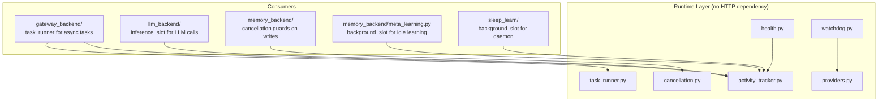
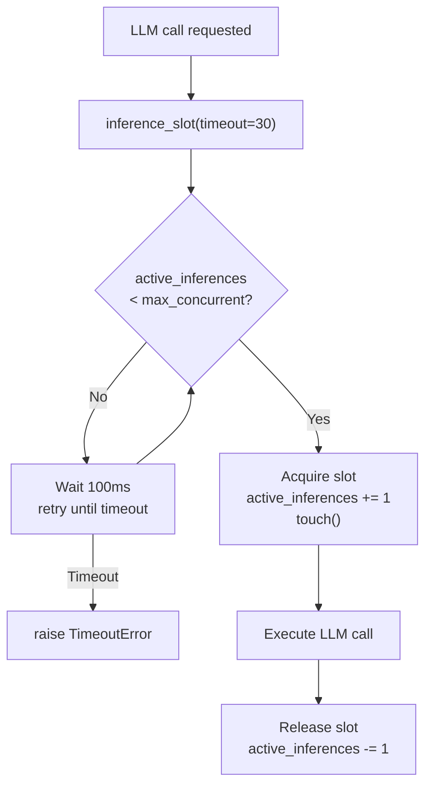
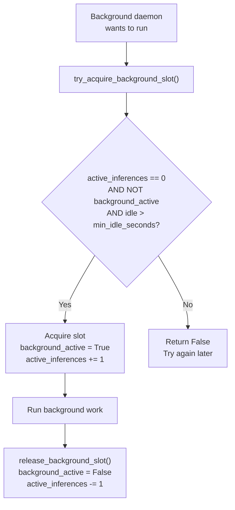
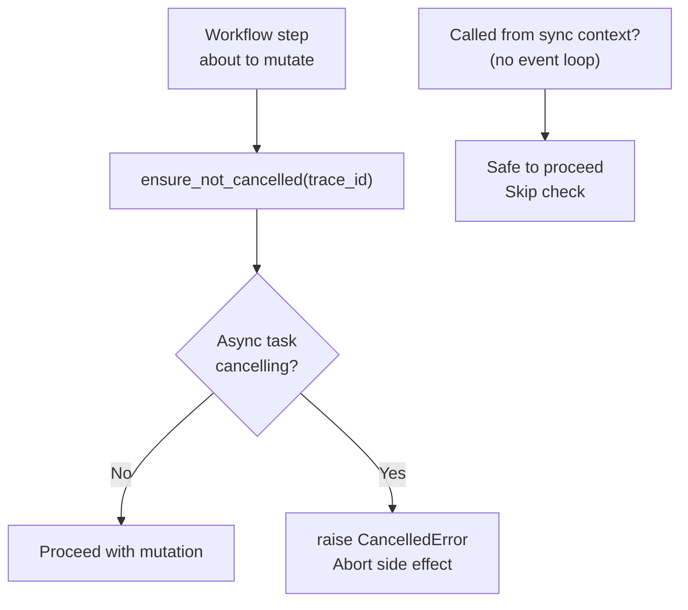
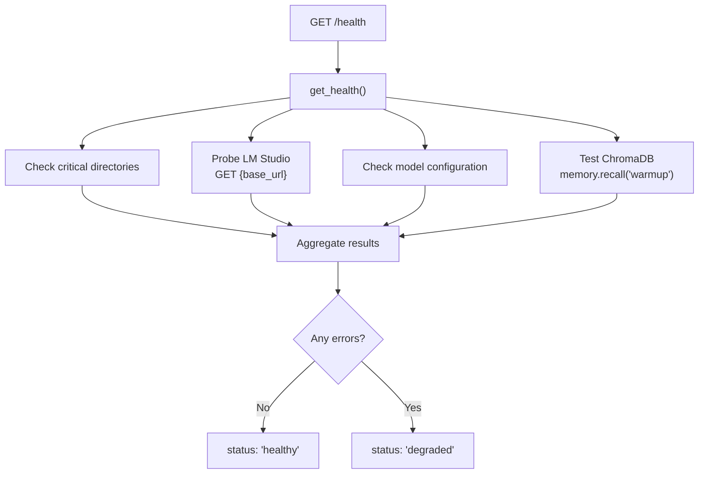
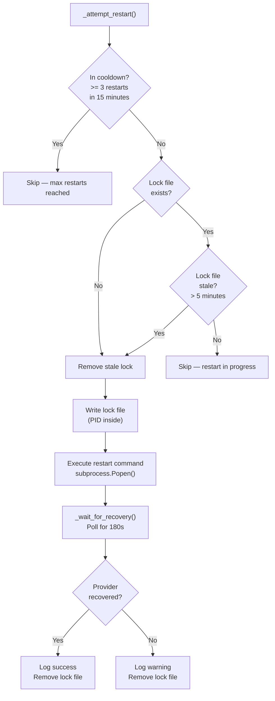

# 🔧 Runtime

The runtime subsystem (`core/runtime/`) is the **process governance layer** of the MCP Agent Stack. It handles activity tracking, process health monitoring, LLM server watchdog, background task execution, and async cancellation guards. It has zero dependencies on HTTP, gateway, or transport — it operates purely at the process level.

**Key characteristics:**
- **Activity tracking** — Global idle detection for background daemons and inference slot management
- **Process watchdog** — HTTP health probe + auto-restart with cooldown for LLM servers
- **Provider abstraction** — LM Studio, Ollama, vLLM support without code changes
- **Background task execution** — `ThreadPoolExecutor` with timeout monitoring
- **Async cancellation** — Prevents ghost mutations when workflows are cancelled
- **Health checks** — Comprehensive subsystem status for monitoring

---

## 🏗️ Architecture

### Component Map

```
core/runtime/
├── activity_tracker.py     # Global activity/idle tracking, inference slot management
├── cancellation.py         # Async cancellation guards (prevent ghost mutations)
├── health.py               # Health check logic (dirs, LM Studio, ChromaDB, models)
├── providers.py            # LLM server provider abstraction (LM Studio, Ollama, vLLM)
├── task_runner.py          # Gateway background task executor (ThreadPoolExecutor)
└── watchdog.py             # Process watchdog (health probe + auto-restart)
```

### Dependency Relationship



> **Key rule:** The runtime layer never imports from `gateway_backend`, `tools`, or `workflows`. It's a pure foundation layer.

---

## 📊 Activity Tracker

The `ActivityTracker` (`core/runtime/activity_tracker.py`) is the global idle detection system. It tracks user interactions, active LLM inferences, and background work to prevent VRAM contention.

### Singleton

```python
from core.runtime.activity_tracker import tracker
```

### State

| Field | Type | Default | Description |
|-------|------|---------|-------------|
| `last_user_activity` | `float` | `time.time()` | Timestamp of last user interaction |
| `active_inferences` | `int` | `0` | Number of concurrent LLM calls |
| `background_active` | `bool` | `False` | Whether background work is running |
| `max_concurrent_inferences` | `int` | `2` (from `cfg`) | Max parallel LLM calls |

### Thread Safety

Uses `threading.RLock()` — the `R` (reentrant) is critical because `touch()` is called inside `inference_slot()`, which already holds the lock. A regular `Lock()` would deadlock.

### Inference Slots



**Usage:**

```python
with tracker.inference_slot(timeout=30.0):
    # LLM call here — guaranteed slot
    result = llm.complete(...)
# Slot auto-released even on exception
```

### Background Slot Acquisition

Background daemons (meta-learning, sleep-learn, diversity enforcer) must acquire a background slot before running. This prevents VRAM contention with user-facing LLM calls.



**Default idle threshold:** 7200 seconds (2 hours)

**Usage:**

```python
if tracker.try_acquire_background_slot(min_idle_seconds=7200):
    try:
        # Safe to run background work
        process_feedback()
    finally:
        tracker.release_background_slot()
```

### Who Uses It

| Consumer | Method | Purpose |
|----------|--------|---------|
| `gateway/dependencies.py` | `tracker.touch()` | Update idle detection on every HTTP request |
| `llm_backend/client.py` | `inference_slot()` | Limit concurrent LLM calls |
| `meta_learning.py` | `try_acquire_background_slot()` | Only learn when agent is idle |
| `sleep_learn/daemon.py` | `try_acquire_background_slot()` | Only process feedback when idle |
| `memory_backend/janitor.py` | `try_acquire_background_slot()` | Only run maintenance when idle |

---

## 🔄 Cancellation Guards

The cancellation module (`core/runtime/cancellation.py`) prevents **ghost mutations** — writes that happen after a workflow is cancelled but before the cancellation signal propagates.

### The Problem

Without cancellation guards:
1. User submits a long workflow via `/task`
2. User cancels (or it times out)
3. The workflow thread is still running
4. It writes to ChromaDB, creates files, or commits to git
5. These mutations are now orphaned — the workflow is "cancelled" but side effects remain

### The Solution



**Usage:**

```python
from core.runtime.cancellation import ensure_not_cancelled

def remember(text, collection, trace_id, ...):
    ensure_not_cancelled(trace_id)  # Abort if workflow cancelled
    # ... proceed with ChromaDB write
```

**Implementation details:**
- Uses `asyncio.current_task()` and `task.cancelling()` to detect cancellation
- Safely ignores the check in synchronous contexts (no event loop) — `RuntimeError` is caught
- Logs to tracer when a cancellation is detected

**Who uses it:**
- `memory_backend/write_ops.py` — Before every ChromaDB mutation
- `memory_backend/maintenance.py` — Before deduplication and vacuum operations
- Workflow nodes — Before file writes, git operations

---

## 🏥 Health Checks

The health module (`core/runtime/health.py`) provides comprehensive subsystem status for monitoring and debugging.

### Health Check Flow



### Checks

| Check | What | How | Healthy |
|-------|------|-----|---------|
| **Directories** | 7 critical paths exist | `path.exists()` | All exist |
| **LM Studio** | LLM server reachable | `httpx.get(base_url, timeout=5)` | Status < 500 |
| **Models** | Required models configured | `cfg.planner_model`, etc. not empty | All non-empty |
| **ChromaDB** | Memory system operational | `memory.recall("warmup", top_k=0)` | No exception |

### Response Format

```json
{
  "status": "healthy",
  "timestamp": 1718820000,
  "env": "development",
  "version": "1.0.0",
  "checks": {
    "dir_agent_root": {"status": "ok", "path": "D:/mcp/agent"},
    "dir_workspace_root": {"status": "ok", "path": "D:/mcp/agent/workspace"},
    "dir_memory_root": {"status": "ok", "path": "D:/mcp/agent/memory_db"},
    "lm_studio": {"status": "ok", "url": "http://localhost:1234/v1", "response_code": 200},
    "models": {
      "planner": {"status": "ok", "model": "gemma-4-e2b-it@q5_k_s"},
      "executor": {"status": "ok", "model": "gemma-2-2b-it"},
      "router": {"status": "ok", "model": "gemma-2-2b-it"}
    },
    "chromadb": {"status": "ok", "client": "initialized"}
  }
}
```

### Gateway Integration

The gateway exposes multiple health endpoints:

| Endpoint | Auth | Deep Check | Description |
|----------|------|------------|-------------|
| `GET /health` | No | Always | Full subsystem check |
| `GET /health/autocode` | Bearer | Optional `?deep=true` | LM Studio + ChromaDB |
| `GET /health/circuit-breakers` | Bearer | N/A | LLM circuit breaker states |
| `GET /health/models` | Bearer | Always | Checks if models are loaded in LM Studio |

---

## 🔌 Runtime Providers

The provider module (`core/runtime/providers.py`) abstracts LLM server differences so the watchdog can monitor and restart any supported server without code changes.

### Provider Interface

```python
class RuntimeProvider(ABC):
    name: str                    # "lmstudio", "ollama", "vllm"
    health_url: str              # URL to probe for readiness
    default_restart_cmd: str     # CLI command to restart
    
    def is_ready(json_data) -> bool  # Verify models are loaded
```

### Available Providers

| Provider | `name` | Health URL | Restart Command | Ready Check |
|----------|--------|-----------|-----------------|-------------|
| `LMStudioProvider` | `lmstudio` | `{base_url}/models` | `lms server start` | `data` key present + non-empty |
| `OllamaProvider` | `ollama` | `http://localhost:11434/api/tags` | `ollama serve` | `models` key present + non-empty |
| `VLLMProvider` | `vllm` | `http://localhost:8000/v1/models` | `vllm serve` | `data` key present + non-empty |

### Provider Selection

```python
from core.runtime.providers import get_provider

# Factory function — fail-fast on unknown names
provider = get_provider(cfg.runtime_provider)  # "lmstudio" | "ollama" | "vllm"
```

**Configuration:**

```ini
RUNTIME_PROVIDER=lmstudio
```

---

## 🐕 Process Watchdog

The watchdog (`core/runtime/watchdog.py`) monitors the LLM server via HTTP probes and automatically restarts it if it becomes unresponsive.

### Watchdog Loop

```mermaid
graph TD
    A["Start run_forever()"] --> B["Sleep 30s"]
    B --> C["_check_health()"]
    C --> D["HTTP GET<br/>provider.health_url<br/>timeout=3s"]
    D --> E{Status 200<br/>AND<br/>is_ready()?}
    E -->|Yes| F["Reset failure_count<br/>Update last_success_time"]
    E -->|No| G{In grace<br/>period?<br/><60s since success}
    G -->|Yes| H["Ignore transient failure"]
    G -->|No| I["failure_count += 1"]
    I --> J{failure_count<br/>>= 3?}
    J -->|No| B
    J -->|Yes| K["_attempt_restart()"]
    K --> B
    F --> B
    H --> B
```

### Restart Logic



### Configuration

| Parameter | Value | Description |
|-----------|-------|-------------|
| `CHECK_INTERVAL` | 30 seconds | Health probe frequency |
| `FAILURE_THRESHOLD` | 3 | Consecutive failures before restart |
| `COOLDOWN_SECONDS` | 900 (15 min) | Max restart window |
| `MAX_RESTARTS` | 3 | Max restarts within cooldown |
| Grace period | 60 seconds | Transient failures ignored after successful recovery |
| Recovery timeout | 180 seconds | Max wait after restart command |

### Safety Features

| Feature | Description |
|---------|-------------|
| **Lock file** | `.watchdog_restart.lock` prevents concurrent restarts |
| **Stale lock detection** | Lock files older than 5 minutes are automatically removed |
| **Cooldown** | Max 3 restarts per 15-minute window |
| **Grace period** | 60 seconds after successful recovery — transient failures ignored |
| **Windows support** | `DETACHED_PROCESS | CREATE_NEW_PROCESS_GROUP` + hidden window |
| **Provider-agnostic** | Uses `RuntimeProvider` abstraction — works with LM Studio, Ollama, vLLM |

### Windows-Specific

On Windows, the restart subprocess uses:
- `DETACHED_PROCESS | CREATE_NEW_PROCESS_GROUP` — Detaches from parent process
- `STARTUPINFO` with `SW_HIDE` — Prevents console window from flashing
- `stdin=DEVNULL, stdout=DEVNULL, stderr=DEVNULL` — No I/O inheritance

---

## 🧵 Background Task Runner

The task runner (`core/runtime/task_runner.py`) executes gateway tasks in a background thread pool with timeout monitoring.

### Architecture

```mermaid
graph TD
    A["POST /task"] --> B["run_background_task()<br/>trace_id, execute_fn, timeout=300"]
    B --> C["executor.submit(execute_fn)<br/>ThreadPoolExecutor(max_workers=10)"]
    C --> D["Return immediately<br/>HTTP 202 Accepted"]
    C --> E["_monitor_timeout()<br/>daemon thread"]
    E --> F{future.result()<br/>completes in time?}
    F -->|Yes| G["Done"]
    F -->|No (300s)| H["Log timeout error<br/>Call on_timeout_fn<br/>future.cancel()"]
```

### Lifecycle

| Function | When | Description |
|----------|------|-------------|
| `init_executor()` | App startup (lifespan) | Creates `ThreadPoolExecutor(max_workers=10)` |
| `run_background_task()` | Each `/task` request | Submits work + spawns timeout monitor thread |
| `shutdown_executor()` | App shutdown (lifespan) | `shutdown(wait=True, cancel_futures=True)` |
| `get_executor()` | Lazy init | Auto-initializes if lifespan hasn't run (tests) |

### Key Design

| Property | Value | Rationale |
|----------|-------|-----------|
| Max workers | 10 | Balances concurrency with resource usage |
| Default timeout | 300s | Matches `AUTOCODE_GRAPH_TIMEOUT` |
| Monitor thread | Daemon | Won't prevent process exit |
| Cancellation | Best-effort | `future.cancel()` — can't interrupt running code |

### Usage (in gateway)

```python
# tasks.py
def _execute_and_update():
    try:
        store._update_task(trace_id, "running")
        result = dispatcher.dispatch(trace_id, payload)
        store._update_task(trace_id, "success", result=result)
    except Exception as e:
        store._update_task(trace_id, "failed", error=str(e))

def _on_timeout(tid):
    store._update_task(tid, "failed", error="Task exceeds 300s timeout")

runner.run_background_task(trace_id, _execute_and_update, 300, _on_timeout)
```

---

## ⚙️ Configuration

### Environment Variables

| Env Variable | Default | Used By | Description |
|--------------|---------|---------|-------------|
| `MAX_CONCURRENT_INFERENCES` | `2` | ActivityTracker | Max parallel LLM calls |
| `RUNTIME_PROVIDER` | `lmstudio` | Watchdog, Providers | LLM server provider |
| `LM_STUDIO_BASE_URL` | `http://localhost:1234/v1` | Watchdog, Health | LLM server endpoint |
| `LM_STUDIO_RESTART_CMD` | *(provider default)* | Watchdog | Custom restart command |
| `ENV` | `development` | Health | Environment mode |

### Idle Thresholds

| Daemon | `min_idle_seconds` | Default | Purpose |
|--------|-------------------|---------|---------|
| Meta-learning | `min_idle_seconds` | 7200 (2h) | Only learn when agent is idle |
| Sleep-learn daemon | `SLEEP_MIN_IDLE_SECONDS` | 7200 (2h) | Only process feedback when idle |
| Diversity enforcer | 4 hours | 14400 | Only clean procedural memory when idle |
| Janitor | Inherited from daemon | — | Runs during sleep-learn idle cycles |

---

## 📡 API Summary

### ActivityTracker

| Method | Signature | Description |
|--------|-----------|-------------|
| `touch()` | `() -> None` | Update `last_user_activity` timestamp |
| `inference_start()` | `() -> None` | Increment `active_inferences` + touch |
| `inference_end()` | `() -> None` | Decrement `active_inferences` |
| `inference_slot()` | `(timeout=30) -> ContextManager` | Acquire/release inference slot |
| `try_acquire_background_slot()` | `(min_idle_seconds=7200) -> bool` | Atomically check idle + reserve slot |
| `release_background_slot()` | `() -> None` | Release background reservation |

### Cancellation

| Function | Signature | Description |
|----------|-----------|-------------|
| `ensure_not_cancelled()` | `(trace_id="") -> None` | Raises `CancelledError` if async task is cancelling |

### Health

| Function | Signature | Description |
|----------|-----------|-------------|
| `get_health()` | `() -> Dict[str, Any]` | Full health check dictionary |
| `health_check_endpoint()` | `() -> str` | JSON string for HTTP response |

### Providers

| Function | Signature | Description |
|----------|-----------|-------------|
| `get_provider()` | `(name: str) -> RuntimeProvider` | Factory for provider instances |

### Task Runner

| Function | Signature | Description |
|----------|-----------|-------------|
| `init_executor()` | `() -> ThreadPoolExecutor` | Initialize global executor |
| `shutdown_executor()` | `() -> None` | Gracefully drain and shutdown |
| `get_executor()` | `() -> ThreadPoolExecutor` | Get or lazily init executor |
| `run_background_task()` | `(trace_id, execute_fn, timeout=300, on_timeout_fn=None) -> None` | Submit + monitor |

---

## 🧪 Testing

```powershell
# Run all runtime tests
D:\mcp\agent\venv\Scripts\pytest.exe tests/core/runtime/ -v

# Test activity tracker
D:\mcp\agent\venv\Scripts\pytest.exe tests/core/runtime/test_activity_tracker.py -v

# Test cancellation guards
D:\mcp\agent\venv\Scripts\pytest.exe tests/core/runtime/test_cancellation.py -v

# Test health checks
D:\mcp\agent\venv\Scripts\pytest.exe tests/core/runtime/test_health.py -v

# Test task runner
D:\mcp\agent\venv\Scripts\pytest.exe tests/core/runtime/test_task_runner.py -v
```

**Mock strategy:**
- ActivityTracker: Use real instance, test concurrency with threading
- Cancellation: Mock `asyncio.current_task()` and `task.cancelling()`
- Health: Mock `httpx.get()`, `memory.recall()`, `cfg` paths
- Watchdog: Mock `httpx.get()`, `subprocess.Popen()`, lock file filesystem
- TaskRunner: Use real `ThreadPoolExecutor` with fast-executing functions

---

## ⚠️ Known Concerns

> **Note:** These are MiMo's observations from source code review. They are constructive suggestions, not definitive prescriptions.

### Watchdog Restarts LM Studio, Not Ollama/vLLM

**What exists:**
The watchdog supports three providers via `RuntimeProvider`, but the default restart commands are basic (`lms server start`, `ollama serve`, `vllm serve`). The `cfg.lm_studio_restart_cmd` override only applies if configured.

**The concern:**
If using Ollama or vLLM, the watchdog will detect failures but the default restart command may not work depending on how the server was originally started (e.g., systemd, Docker, manual terminal).

**Suggestion:**
Document that `LM_STUDIO_RESTART_CMD` should be set for any non-default server setup. Consider adding a `RUNTIME_RESTART_CMD` alias that's provider-agnostic.

### Activity Tracker Has No Persistence

**What exists:**
The `ActivityTracker` stores all state in memory. If the process restarts, `last_user_activity` resets to `time.time()`, `active_inferences` resets to 0, and `background_active` resets to False.

**The concern:**
After a restart, background daemons may immediately trigger because the agent appears to have been idle since "forever" (the restart time minus `time.time()` is ~0 seconds, which is less than `min_idle_seconds`). This is actually correct behavior — the daemon won't trigger until 2 hours after restart. But if the process crashed during background work, `background_active` won't be cleaned up properly.

**Suggestion:**
This is fine for the current implementation since `background_active` is in-memory and resets on restart. Document this as intentional behavior.

### Health Check LM Studio Probe vs. Watchdog Probe

**What exists:**
Both `health.py` and `watchdog.py` probe the LLM server via HTTP. The health check uses `httpx.get(base_url, timeout=5)`. The watchdog uses `httpx.get(provider.health_url, timeout=3.0)`.

**The concern:**
These are two independent probes with different timeouts and different endpoints (base URL vs. `/models`). They could give conflicting results — health check says "ok" while watchdog says "unhealthy" or vice versa.

**Suggestion:**
This is acceptable since they serve different purposes (user-facing health vs. process-level monitoring). Document the difference clearly.

---

## 🛡️ AI Agent Instructions

If you are an AI assistant modifying the runtime layer:

1. **No HTTP dependency** — runtime modules never import from `gateway_backend`, `tools`, or `workflows`. This is a one-way dependency: consumers import from runtime, never the reverse.
2. **RLock for activity tracker** — never change `RLock()` to `Lock()`. The reentrant lock prevents deadlock when `touch()` is called inside `inference_slot()`.
3. **Cancellation guards** — never remove `ensure_not_cancelled()` calls from write operations. Ghost mutations corrupt memory and file state.
4. **Watchdog lock file** — always check for stale lock files (> 5 minutes) before skipping a restart. Process crashes leave orphaned lock files.
5. **Provider abstraction** — never hardcode LM Studio URLs or commands in the watchdog. Use `cfg.runtime_provider` and `get_provider()`.
6. **Task runner timeout** — the timeout monitor runs in a daemon thread. Never make it a non-daemon thread — it would prevent process exit.
7. **Health check completeness** — when adding new subsystems, add a corresponding health check. Every critical component should be verifiable via `GET /health`.
8. **Graceful shutdown** — `shutdown_executor()` must be called during app shutdown with `wait=True, cancel_futures=True`. Never use `wait=False` — zombie threads will corrupt state.
9. **Windows compatibility** — the watchdog uses Windows-specific `creationflags` and `STARTUPINFO`. Always check `sys.platform` before applying these. Linux/macOS don't have these attributes.

---

## 🔗 Source Code Reference

| File | Purpose |
|------|---------|
| `core/runtime/activity_tracker.py` | `ActivityTracker`: idle detection, inference slots, background slots |
| `core/runtime/cancellation.py` | `ensure_not_cancelled()`: async cancellation guard |
| `core/runtime/health.py` | `get_health()`, `health_check_endpoint()`: subsystem status |
| `core/runtime/providers.py` | `RuntimeProvider` ABC, `LMStudioProvider`, `OllamaProvider`, `VLLMProvider` |
| `core/runtime/task_runner.py` | `ThreadPoolExecutor`, `run_background_task()`, timeout monitoring |
| `core/runtime/watchdog.py` | `RuntimeWatchdog`: health probe + auto-restart |
| `core/config.py` | `max_concurrent_inferences`, `runtime_provider`, `lm_studio_base_url` |
| `core/gateway_backend/factory.py` | Calls `init_executor()`, `shutdown_executor()` in lifespan |
| `core/gateway_backend/dependencies.py` | Calls `tracker.touch()` on every request |
| `core/llm_backend/client.py` | Uses `tracker.inference_slot()` for LLM calls |
| `core/memory_backend/write_ops.py` | Uses `ensure_not_cancelled()` before mutations |
| `core/memory_backend/meta_learning.py` | Uses `tracker.try_acquire_background_slot()` |
| `core/sleep_learn/daemon.py` | Uses `tracker.try_acquire_background_slot()` |

---

## 🔮 Future Roadmap

| Status | Enhancement | Description |
|--------|-------------|-------------|
| ✅ Complete | Activity tracker | Idle detection + inference slots |
| ✅ Complete | Cancellation guards | Ghost mutation prevention |
| ✅ Complete | Health checks | Full subsystem monitoring |
| ✅ Complete | Provider abstraction | LM Studio, Ollama, vLLM |
| ✅ Complete | Process watchdog | Auto-restart with cooldown |
| ✅ Complete | Background task executor | ThreadPoolExecutor + timeout |
| 🚧 Planned | Watchdog metrics | Track restart count, uptime, MTBF to Prometheus |
| 🚧 Planned | Graceful model switching | Hot-swap models without full restart |
| 🚧 Planned | Health-based routing | Skip unhealthy providers in multi-server setups |
| 🚧 Planned | Watchdog alerts | Notify on persistent failures (email, webhook) |

---

*Last updated: June 2026. All provider implementations, watchdog parameters, and activity tracker thresholds reflect current source code in `core/runtime/`.*