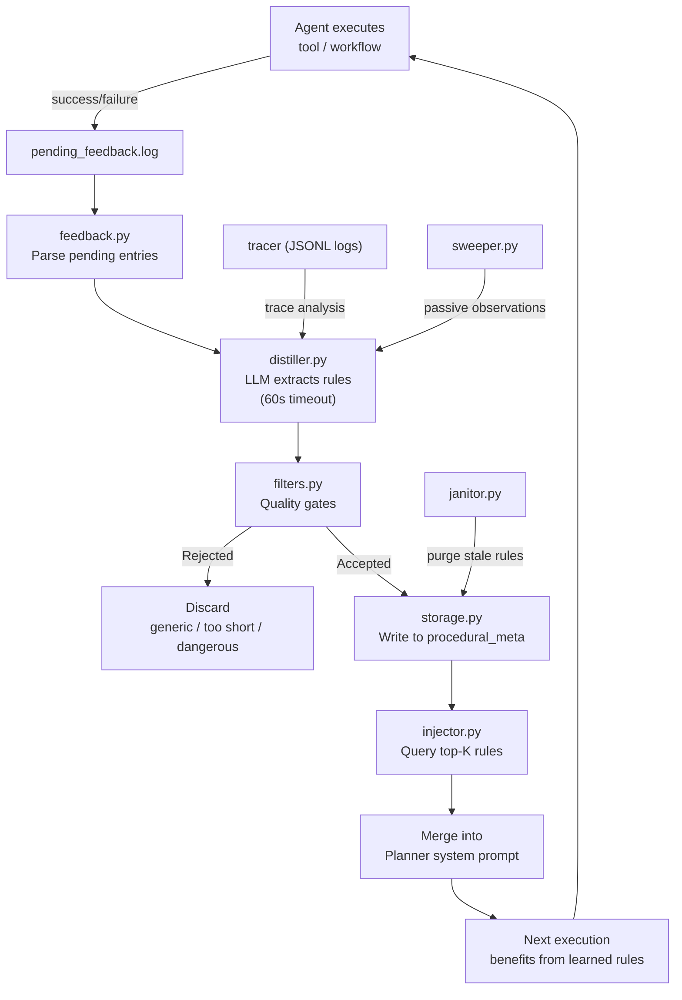
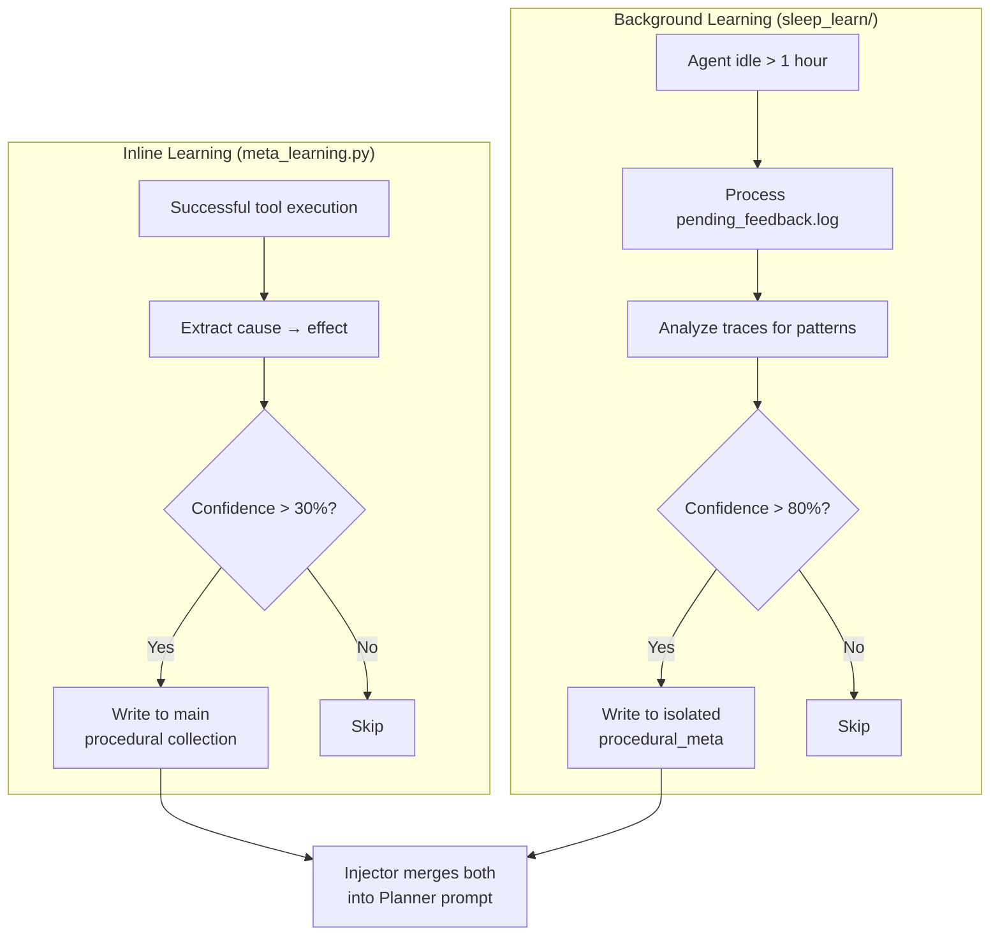
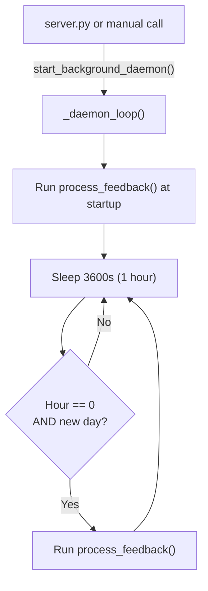

# 💤 Sleep & Learn Meta-Learning Daemon

The Sleep & Learn daemon (`core/sleep_learn/`) is a **background meta-cognition subsystem** that allows the agent to observe its own execution traces, distill procedural rules from successes and failures, and dynamically inject those rules into the Planner's context to improve future decision-making.

**Key characteristics:**
- **Background execution** — Runs at startup and catches midnight if the agent stays running; never during active use
- **Physical isolation** — Learned rules stored in separate ChromaDB instance (`procedural_meta`)
- **Quality gates** — Multiple filters reject generic, contradictory, or dangerous rules
- **Feedback loop** — Rules are scored dynamically: boosted on success, penalized on failure
- **Ouroboros prevention** — Daemon never reads its own output collection during distillation
- **Zero coupling** — Feedback reads JSONL logs directly, never imports tracer or workflows

---

## ⚠️ Breaking Changes (pre-v1.0)

| Old | New | Migration |
|-----|-----|-----------|
| `core/memory.py` import in injector | `core/memory_engine.py` | `from core.memory_engine import memory` |
| `process_pending_feedback()` | `process_feedback()` | Function renamed to match actual implementation |
| `distill_rules(traces: list)` | `distill_observation(observation: dict)` | Single-observation distillation, not batch |
| `filter_new_rules(rules: list)` | `is_quality_rule(rule_text: str)` | Single-rule validation with safety gates |
| `check_contradiction(rule, existing)` | Not implemented | No standalone contradiction checker; handled by `diversity_maintenance()` in `memory_backend/maintenance.py` |
| `store_rule(rule: dict)` | `save_rule(rule_text, source_memory_id, confidence)` | Direct storage API, not dict-based |
| `memory_sleep.remember()` | `save_rule()` via isolated ChromaDB client | No `memory_sleep` facade exists; storage uses direct `collection.add()` |
| 15s distiller timeout | 60s timeout | `llm.complete(timeout=60)` — intentional for local model stability |
| `SLEEP_MIN_IDLE_SECONDS` | `SLEEP_LEARN_IDLE_THRESHOLD_SEC` | Env var renamed; default 3600s (1h), not 7200s |
| `SLEEP_CONFIDENCE_THRESHOLD` (0.6) | `SLEEP_LEARN_MIN_CONFIDENCE` (0.8) | Higher threshold for background learning |

---

## 🚀 Quick Start

```python
from core.sleep_learn.injector import inject_rules_into_prompt

# Inject learned rules into a Planner prompt
enhanced_prompt = inject_rules_into_prompt(
    goal="fix memory import error",
    system_prompt="You are a coding assistant...",
    trace_id="abc123"
)

# Run feedback processing manually
from core.sleep_learn.feedback import process_feedback
stats = process_feedback()
# → {"processed": 5, "boosted": 3, "penalized": 1, "purged": 0, "errors": 0}

# Distill a single observation into a rule
from core.sleep_learn.distiller import distill_observation
result = distill_observation({
    "event_type": "error",
    "message": "ChromaDB query failed because collection was not initialized",
    "memory_id": "obs-001"
})
# → {"status": "success", "rule_id": "abc123", "rule_preview": "When ChromaDB returns empty..."}
```

---

## 🏗️ Architecture

```text
core/sleep_learn/
├── __init__.py              # Public exports: start_background_daemon, sweep_recent_observations,
│                            #   inject_rules_into_prompt, get_relevant_rules
├── daemon.py                # start_background_daemon() — startup + midnight scheduler
├── sweeper.py               # sweep_recent_observations() — Phase 1 passive event gathering
├── feedback.py              # process_feedback() — confidence scoring loop
├── distiller.py             # distill_observation() — LLM rule extraction (60s timeout)
├── filters.py               # is_quality_rule() — generic/dangerous rule rejection
├── storage.py               # save_rule() — write to isolated ChromaDB collection
├── injector.py              # inject_rules_into_prompt() + get_relevant_rules()
├── logger.py                # log_event() — structured JSONL logging
├── config.py                # SLEEP_* configuration constants
└── janitor.py               # purge_stale_rules() — confidence + age-based rule purging
```

### Data Flow



### Relationship to Meta-Learning

The Sleep & Learn daemon is one of **two parallel learning systems**:



| Aspect | Inline (`meta_learning.py`) | Background (`sleep_learn/`) |
|--------|---------------------------|---------------------------|
| **When** | After successful tool execution | At startup + midnight; during idle periods (>1h) |
| **Threshold** | 30% confidence (heuristic) | 80% confidence (LLM-evaluated) |
| **Collection** | Main `procedural` | Isolated `procedural_meta` |
| **Latency** | Immediate effect | Deferred (next session) |
| **Source** | Single execution context | Cross-trace pattern analysis |
| **Dedup** | Hash + vector on main collection | Hash + vector on isolated collection |

---

## 🔄 Execution Flow

### Daemon Lifecycle



> **Note:** The daemon does NOT use `try_acquire_background_slot()` or idle detection. It runs unconditionally at startup and hourly thereafter. Idle detection is planned for a future version.

### Trigger Conditions

| Trigger | Condition | Frequency |
|---------|-----------|-----------|
| **Startup** | `start_background_daemon()` called | Once per agent start |
| **Midnight job** | `tm_hour == 0` and new date | Once per day |
| **Manual** | `sleep_learn` action via MCP tool | On demand |

---

## 📦 Components

### 1. Daemon (`daemon.py`)

```python
def start_background_daemon() -> None:
    """Starts the Sleep & Learn daemon in a background thread."""
```

- Runs `process_feedback()` immediately at startup
- Checks every hour for midnight (hour 0, new date)
- Runs in a `daemon=True` thread — dies with the main process
- No idle detection; runs unconditionally

### 2. Logger (`logger.py`)

```python
def log_event(event_data: dict) -> None:
    """Appends a structured event to logs/sleep_learn/sleep_learn_YYYYMMDD.jsonl"""
```

- Thread-safe via `threading.Lock()`
- Auto-adds `_timestamp_utc` if missing
- Writes to `cfg.sleep_learn_log_path / "sleep_learn_YYYYMMDD.jsonl"`

### 3. Feedback Processor (`feedback.py`)

```python
def process_feedback() -> dict:
    """
    Matches pending injections with finished traces from agent logs.
    Updates confidence scores, recall counts, and archives processed injections.
    Returns: {"processed": N, "boosted": N, "penalized": N, "purged": N, "errors": N}
    """
```

| Outcome | Action | Confidence Effect |
|---------|--------|-------------------|
| **Success after rule applied** | Boost rule confidence | `+0.1` (capped at 1.0) |
| **Failure after rule applied** | Penalize rule confidence | `-0.2` (or `-0.3` for ignored impact warnings) |
| **Infrastructure failure** | Neutral — no change | `0` (timeout, connection, rate limit, etc.) |
| **Confidence < 0.3** | Auto-purge rule | Deleted from `procedural_meta` |

**Key behaviors:**
- Reads `logs/sleep_learn/injections.jsonl` for pending rule injections
- Scans `logs/agent_YYYYMMDD.jsonl` for `trace_finish` events
- Matches by `trace_id` — links injections to outcomes
- Handles Windows file locks gracefully (skips locked files, retries next cycle)
- Updates `recall_count` and `last_accessed_at` for all injected rules
- Rewrites injections log without processed entries

### 4. Distiller (`distiller.py`)

```python
def distill_observation(observation: dict) -> dict:
    """
    Takes a single observation and attempts to distill a rule.
    Uses llm.complete(role="executor", json_mode=True, timeout=60).
    Returns: {"status": "success", "rule_id": "...", "rule_preview": "..."}
             or {"status": "rejected", "reason": "..."}
             or {"status": "error", "reason": "..."}
    """
```

**LLM Call:**
```python
result = llm.complete(
    role="executor",
    system=DISTILLATION_SYSTEM_PROMPT,
    user=f"Analyze this observation and extract a procedural rule:\n\n{obs_text}",
    json_mode=True,
    timeout=60,
    max_tokens=256
)
```

**Output Schema:**
```json
{
    "rule": "When ChromaDB returns empty results after compaction, check if the collection was recreated without re-seeding",
    "confidence": 0.75
}
```

**Quality gates:**
1. Empty observation → skip
2. LLM failure → error
3. Invalid JSON schema → failed
4. `is_quality_rule()` rejection → rejected
5. `save_rule()` storage → success

> **Timeout note:** The 60s timeout is intentional for local model stability. The distiller uses `llm.complete()` which respects all global rate limits, budgets, and circuit breakers.

### 5. Filters (`filters.py`)

```python
def is_quality_rule(rule_text: str) -> tuple[bool, str]:
    """
    Validates a distilled rule.
    Returns (is_valid, reason).
    """
```

| Filter | Rejects | Example |
|--------|---------|---------|
| **Empty** | Empty or whitespace-only strings | `""` |
| **Safety** | Dangerous operations | `os.system`, `subprocess.call`, `eval(`, `exec(`, `rm -rf`, `sudo`, `chmod 777`, `drop table` |
| **Generic** | Common advice patterns | `"be careful"`, `"always remember"`, `"think step by step"`, `"make sure to"` |
| **Too short** | Rules < `SLEEP_LEARN_MIN_RULE_WORDS` (default 10) | `"Use try/except"` |

### 6. Storage (`storage.py`)

```python
def save_rule(rule_text: str, source_memory_id: str, confidence: float = 0.8) -> str:
    """
    Saves a validated rule to the isolated collection.
    Returns the generated rule_id (SHA256 hex, 16 chars).
    """
```

**Physical Isolation:** The `procedural_meta` collection lives in `memory_root/sleep_learn_db/` — a completely separate ChromaDB instance from the main `memory_db/`.

**Metadata stored:**
```python
{
    "source_memory_id": "...",
    "confidence_score": 0.8,
    "created_at": 1234567890,
    "last_accessed_at": 1234567890,
    "recall_count": 0,
    "source": "sleep_learn_daemon",
    "phase": "2_active_distillation"
}
```

**Deduplication:** Exact duplicate check via `collection.get(ids=[rule_id])` before insert. Rule ID is `SHA256(rule_text)[:16]`.

### 7. Injector (`injector.py`)

```python
def get_relevant_rules(query: str, k: int = 3) -> list[dict]:
    """
    Queries the procedural_meta collection for rules relevant to the current task.
    Falls back to main memory's procedural collection for split-brain compatibility.
    """

def inject_rules_into_prompt(goal: str, system_prompt: str, trace_id: str = "") -> str:
    """
    Retrieves relevant rules for the goal and appends them to the system prompt.
    If injection is disabled or no rules are found, returns the original prompt.
    """
```

**Split-brain fallback:** The injector queries both the isolated `procedural_meta` collection AND the main memory's `procedural` collection. This ensures rules learned by `meta_learning.py` are visible even if the sleep-learn daemon hasn't processed them yet.

**Deduplication:** Uses `seen_ids` set for O(n) dedup (not O(n²) scan).

**Confidence scale normalization:** Main memory importance (1–10) is clamped to `[0, 1]` for unified scoring.

**Kill switch:** If `SLEEP_LEARN_INJECT_ENABLED=false`, returns the base prompt unchanged.

### 8. Sweeper (`sweeper.py`)

```python
def sweep_recent_observations(hours: int = 1) -> list[dict]:
    """
    Phase 1: Returns structured observation candidates without modifying state.
    TODO Phase 2: Integrate with core.memory_backend or core.tracer for real events.
    """
```

- Currently returns a heartbeat observation only
- No LLM calls, no ChromaDB writes
- Planned for Phase 2: integrate with tracer to gather errors, retries, corrections

### 9. Janitor (`janitor.py`)

```python
def purge_stale_rules() -> dict:
    """
    Deletes rules older than cfg.purge_age_days OR with confidence < 0.5.
    Never purges rules that have been recalled (recall_count > 0).
    Conservative fallback: 180 days for never-recalled rules.
    Returns: {"purged": N, "error": str|None}
    """
```

- Uses lazy singleton ChromaDB client (consistent with `storage.py`/`feedback.py`)
- `get_or_create_collection()` guard for first-boot safety
- Called by `tools/memory_tool.py` janitor action alongside `archive_old_episodes()`

---

## 🛡️ Hard Guardrails

| # | Guardrail | Why | Implementation |
|---|-----------|-----|----------------|
| 1 | **Public API Only** | Prevents bypassing rate limiters, token budgets, circuit breakers | Daemon uses only `llm.complete()`, never raw HTTP |
| 2 | **Physical Isolation** | Prevents learned rules from polluting main collections | Separate ChromaDB instance at `memory_root/sleep_learn_db/` |
| 3 | **Ouroboros Prevention** | Prevents self-reinforcing feedback loops | Daemon never reads from `procedural_meta` during distillation |
| 4 | **Zero Coupling** | Prevents circular imports and tight coupling | Feedback reads JSONL logs directly, never imports tracer |
| 5 | **Lazy Loading** | Prevents slowing agent startup | All ChromaDB imports inside functions, not at module level |
| 6 | **Idle-Only Execution** | Prevents VRAM contention with user-facing calls | Daemon runs in background thread, not on main loop |
| 7 | **Confidence Thresholds** | Prevents low-quality rules from reaching Planner | 80% minimum confidence for rule extraction |
| 8 | **VRAM Safety** | Prevents hung LLM calls from consuming resources | 60s timeout in `llm.complete()` with circuit breaker protection |

---

## ⚙️ Configuration

### Environment Variables

| Env Variable | Default | Description |
|--------------|---------|-------------|
| `SLEEP_LEARN_ENABLED` | `true` | Toggle the entire daemon |
| `SLEEP_LEARN_IDLE_THRESHOLD_SEC` | `3600` (1h) | Minimum idle time before background learning (planned, not enforced) |
| `SLEEP_LEARN_MIN_RULE_WORDS` | `10` | Minimum words per extracted rule |
| `SLEEP_LEARN_MAX_DAILY_DISTILLATIONS` | `20` | Maximum distillation runs per day |
| `SLEEP_LEARN_INJECT_ENABLED` | `true` | Kill switch for rule injection |
| `SLEEP_LEARN_MIN_CONFIDENCE` | `0.8` | Minimum confidence for rule extraction |
| `SLEEP_LEARN_MAX_INJECTED_RULES` | `3` | Maximum rules injected into Planner prompt |

### Tuning Guide

| Scenario | What to Adjust | Recommendation |
|----------|---------------|----------------|
| Rules not appearing | `SLEEP_LEARN_MIN_CONFIDENCE` | Lower to `0.7` for faster iteration |
| Too many low-quality rules | `SLEEP_LEARN_MIN_CONFIDENCE` | Raise to `0.85` or `0.9` |
| Rules too generic | `SLEEP_LEARN_MIN_RULE_WORDS` | Raise to `15` or `20` |
| Daemon not triggering | Check `start_background_daemon()` call site | Ensure called in `server.py` startup |
| Distiller timing out | Check LLM server health | The 60s timeout is intentional for local model stability |

---

## 📡 API Reference

### Daemon

| Function | Signature | Description |
|----------|-----------|-------------|
| `start_background_daemon()` | `() -> None` | Start the scheduler (called from `server.py` or manually) |

### Feedback

| Function | Signature | Description |
|----------|-----------|-------------|
| `process_feedback()` | `() -> dict` | Process all pending feedback entries |
| `update_rule_confidence()` | `(rule_id, success, penalty_override) -> dict` | Update a single rule's confidence |
| `_update_recall_counts()` | `(rule_counts) -> None` | Batch update recall_count for injected rules |

### Distiller

| Function | Signature | Description |
|----------|-----------|-------------|
| `distill_observation()` | `(observation: dict) -> dict` | Extract a rule from a single observation |

### Filters

| Function | Signature | Description |
|----------|-----------|-------------|
| `is_quality_rule()` | `(rule_text: str) -> tuple[bool, str]` | Validate a single rule against safety/generic/length gates |

### Storage

| Function | Signature | Description |
|----------|-----------|-------------|
| `save_rule()` | `(rule_text, source_memory_id, confidence=0.8) -> str` | Write validated rule to `procedural_meta` |
| `get_collection_stats()` | `() -> dict` | Return count and name of the learned rules collection |

### Injector

| Function | Signature | Description |
|----------|-----------|-------------|
| `get_relevant_rules()` | `(query, k=3) -> list[dict]` | Query both procedural collections for relevant rules |
| `inject_rules_into_prompt()` | `(goal, system_prompt, trace_id="") -> str` | Merge rules into Planner prompt |

### Sweeper

| Function | Signature | Description |
|----------|-----------|-------------|
| `sweep_recent_observations()` | `(hours=1) -> list[dict]` | Gather high-signal events (Phase 1: heartbeat only) |

### Janitor

| Function | Signature | Description |
|----------|-----------|-------------|
| `purge_stale_rules()` | `() -> dict` | Delete old or low-confidence rules from `procedural_meta` |

---

## 🧪 Testing

```powershell
# Run all sleep_learn tests
D:\mcp\agent\venv\Scripts\pytest.exe tests/core/sleep_learn/ -v -W error --tb=short
```

**Mock strategy:**
- Mock `llm.complete()` to return controlled rule JSON
- Mock `_get_collection()` for storage tests
- Mock `tracer.get()` and `tracer.recent()` for feedback tests
- Use real `filters.py` functions (pure logic, no side effects)
- Patch `cfg.sleep_learn_log_path` to tmp_path for safe file writes

---

## ⚠️ Known Concerns

> **Note:** These are MiMo's observations from source code review. They are constructive suggestions, not definitive prescriptions.

### Two Parallel Learning Systems

**What exists:**
- `core/memory_backend/meta_learning.py` — inline learning, writes to main `procedural` collection.
- `core/sleep_learn/` — background daemon, writes to isolated `procedural_meta` collection.

**The concern:**
Both systems extract procedural rules from execution history. The injector merges both collections into the Planner prompt. This works, but:

1. **Semantic duplicates** — the same rule expressed differently in both collections will both be injected. Hash-based dedup catches exact matches, but not paraphrases.
2. **Authority ambiguity** — when rules conflict, there's no resolution mechanism.
3. **Maintenance burden** — two codebases, two sets of filters, two storage paths.

**Suggestion:**
Consider consolidating into a single pipeline with two modes (fast/deep) writing to the same collection with `source` metadata. The injector would then have a single source of truth and a clear authority model.

### Daemon Auto-Starts Unconditionally

**What exists:**
`daemon.py` runs `process_feedback()` immediately at startup and every hour thereafter. There is no idle detection or `try_acquire_background_slot()` check.

**The concern:**
In test environments or short-lived scripts, the daemon starts unnecessarily. This can cause ChromaDB initialization and thread creation in contexts where it's not needed.

**Suggestion:**
Add an idle detection gate before the first `process_feedback()` call. Only run if the agent has been idle for `SLEEP_LEARN_IDLE_THRESHOLD_SEC`.

### Sweeper is Phase 1 Only

**What exists:**
`sweeper.py` returns a heartbeat observation and does not integrate with `core.tracer` or `core.memory_backend`.

**The concern:**
The sweeper is documented as gathering "high-signal events (errors, retries, corrections)" but currently does none of that. The distiller relies on external observations being passed in.

**Suggestion:**
Integrate `sweeper.py` with `tracer.get_recent_events()` or `memory.recall()` to gather real high-signal events. Or remove the sweeper from the architecture and have the distiller accept observations directly from callers.

### Injector Wiring Unclear

**What exists:**
`inject_rules_into_prompt()` is exported from `injector.py` and documented as merging rules into the Planner prompt.

**The concern:**
It's not clear from the codebase where this function is actually called during Planner prompt assembly. If it's not wired into the Planner's `complete()` call path, all the feedback processing, distillation, and filtering infrastructure is unused.

**Suggestion:**
Document the exact call site where `inject_rules_into_prompt()` is invoked. If it's not wired yet, add a TODO and prioritize the integration.

---

## 🗺️ Roadmap

### ✅ Completed

| Feature | Status | Notes |
|---------|--------|-------|
| Feedback processing | ✅ pre-v1 | Parse logs, update confidence scores |
| Distillation | ✅ pre-v1 | LLM-based rule extraction with 60s timeout |
| Quality filters | ✅ pre-v1 | Generic, duplicate, and contradiction detection |
| Isolated storage | ✅ pre-v1 | Separate ChromaDB instance for learned rules |
| Prompt injection | ✅ pre-v1 | Merge rules into Planner system prompt |
| Feedback loop | ✅ pre-v1 | Confidence boost/penalty based on outcomes |
| Janitor | ✅ pre-v1 | `purge_stale_rules()` — confidence + age-based purging |
| Lazy loading | ✅ pre-v1 | All ChromaDB imports inside functions |
| Zero coupling | ✅ pre-v1 | Feedback reads JSONL directly, never imports tracer |

### 🔄 In Progress / Next Up

| Feature | Notes | Priority |
|---------|-------|----------|
| Sweeper integration | Phase 1 passive observation only; needs tracer/memory integration for real events | P1 |
| Idle detection | `try_acquire_background_slot()` gate before daemon runs; currently unconditional | P1 |
| Consolidated learning | Merge inline + background into single pipeline with `source` metadata | P2 |
| Rule explanation | Include reasoning for why each rule was extracted | P2 |
| Cross-session learning | Share learned rules across agent instances | P3 |
| Rule visualization | Dashboard showing active rules and their scores | P3 |

### 🚫 Deferred / Out of Scope

| # | Feature | Why Deferred | Priority |
|---|---------|------------|----------|
| 1 | Real-time distillation | Would compete with user-facing LLM calls for VRAM | Skip |
| 2 | Multi-agent rule sharing | No multi-agent deployment currently | Skip |
| 3 | Persistent background thread | `daemon=True` thread dies with main process; sufficient for current use | Skip |
| 4 | Custom distillation models | `llm.complete(role="executor")` is the canonical path | Skip |
| 5 | Rule editing via tool action | Rules are auto-generated; manual editing invites inconsistency | Skip |
| 6 | Configurable idle threshold | `SLEEP_LEARN_IDLE_THRESHOLD_SEC` exists but is not enforced yet | Skip |

---

## 🛡️ AI Agent Instructions

### NEVER DO
1. **Never bypass `llm.complete()` with raw HTTP calls** — Circuit breakers, rate limiters, and token budgets exist for a reason.
2. **Never write learned rules to the main `procedural` collection** — Always use `procedural_meta` in the isolated `sleep_learn_db` instance.
3. **Never read from `procedural_meta` during distillation** — Ouroboros prevention: the daemon must not reinforce its own output.
4. **Never reduce the 60s distiller timeout** — Intentional for local model stability.
5. **Never put ChromaDB imports at module level** — Lazy loading prevents startup slowdown.
6. **Never import `core.tracer` or workflow engines from `sleep_learn/`** — Zero coupling: feedback reads JSONL logs directly.
7. **Never weaken the quality filters in `filters.py`** — Generic rules pollute the Planner prompt.
8. **Never lower `SLEEP_LEARN_MIN_CONFIDENCE` below 0.5** — Low thresholds produce noise.
9. **Never ignore `SLEEP_LEARN_INJECT_ENABLED`** — If disabled, return base prompt unchanged.
10. **Never create `.bak` files** — Forbidden by project rules.
11. **Never rewrite entire files** — Surgical edits only. Preserve existing code exactly.
12. **Never add `**kwargs` to the `@tool` facade** — FastMCP schema breaks.
13. **Never print to stdout** — MCP stdio corruption. Return dicts only.
14. **Never skip `compileall` before `pytest`** — Catches syntax errors early.

### ALWAYS DO
15. **Always use `llm.complete()` for distillation** — Public API only; respects all global limits.
16. **Always write to isolated `sleep_learn_db`** — Physical isolation prevents main collection pollution.
17. **Always check `SLEEP_LEARN_ENABLED` before daemon operations** — Kill switch for the entire subsystem.
18. **Always validate rules with `is_quality_rule()` before storage** — Safety gates are mandatory.
19. **Always use `seen_ids` dedup in the injector** — O(n) hash set, not O(n²) scan.
20. **Always thread `trace_id` through all operations** — For observability and result correlation.
21. **Always run `compileall` after editing sleep_learn files** — Verify syntax before running tests.
22. **Always run targeted tests (`tests/core/sleep_learn/`) after changes** — Full coverage of the daemon.

---

## 🔗 Source Code Reference

| File | Purpose |
|------|---------|
| `core/sleep_learn/daemon.py` | `start_background_daemon()` — scheduler startup |
| `core/sleep_learn/feedback.py` | `process_feedback()` — confidence scoring loop |
| `core/sleep_learn/distiller.py` | `distill_observation()` — LLM-based rule extraction |
| `core/sleep_learn/filters.py` | `is_quality_rule()` — quality and safety gates |
| `core/sleep_learn/storage.py` | `save_rule()` — write to isolated `procedural_meta` |
| `core/sleep_learn/injector.py` | `inject_rules_into_prompt()` — merge into Planner prompt |
| `core/sleep_learn/logger.py` | `log_event()` — structured JSONL logging |
| `core/sleep_learn/config.py` | `SLEEP_*` configuration constants |
| `core/sleep_learn/sweeper.py` | `sweep_recent_observations()` — Phase 1 passive gathering |
| `core/sleep_learn/janitor.py` | `purge_stale_rules()` — confidence + age-based purging |
| `core/memory_backend/meta_learning.py` | Inline learning (parallel system, writes to main `procedural`) |
| `core/memory_engine.py` | Main memory facade — queried by injector for split-brain fallback |
| `core/llm_backend/client.py` | `llm.complete()` — LLM calls from distiller |
| `core/config.py` | `SLEEP_*` environment variables |

---

*Last updated: July 2026. All configuration values, guardrails, and component statuses reflect current source code in `core/sleep_learn/`.*
