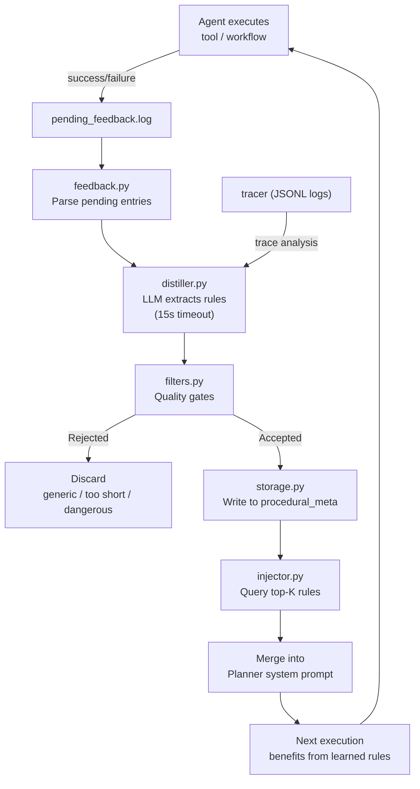
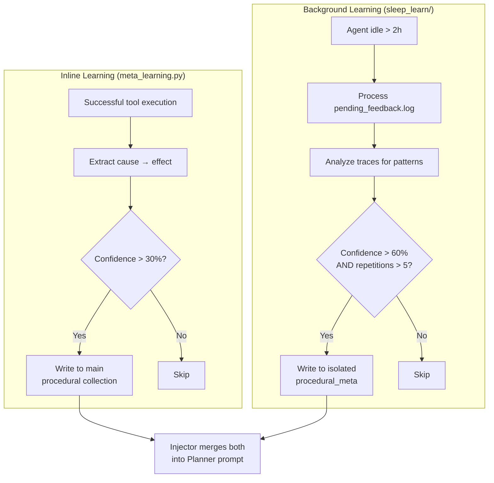
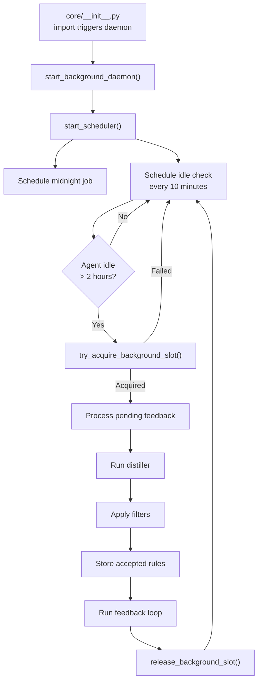

# 💤 Sleep & Learn Meta-Learning Daemon

The Sleep & Learn daemon (`core/sleep_learn/`) is a **background meta-cognition subsystem** that allows the agent to observe its own execution traces, distill procedural rules from successes and failures, and dynamically inject those rules into the Planner's context to improve future decision-making.

**Key characteristics:**
- **Background execution** — Runs during idle periods (>2h) or at midnight, never during active use
- **Physical isolation** — Learned rules stored in separate ChromaDB instance (`procedural_meta`)
- **Quality gates** — Multiple filters reject generic, contradictory, or dangerous rules
- **Feedback loop** — Rules are scored dynamically: boosted on success, penalized on failure
- **Ouroboros prevention** — Daemon never reads its own output collection
- **Zero coupling** — Imports `memory_backend` and `llm_backend` as dependencies, never the reverse

---

## 🏗️ Architecture

### Component Map

```
core/sleep_learn/
├── daemon.py           # start_background_daemon() — midnight scheduler
├── sweeper.py          # Placeholder — not yet implemented
├── feedback.py         # Pending feedback processing loop
├── distiller.py        # Trace analysis → rule extraction (uses LLM)
├── filters.py          # Quality gates: new rules, dedup, contradictions
├── storage.py          # Write rules to isolated ChromaDB collection
├── injector.py         # Merge rules into Planner system prompt
├── logger.py           # Parse feedback.log for pending entries
├── config.py           # SLEEP_* configuration constants
├── sweeper.py          # Placeholder — not yet implemented
└── janitor.py          # Placeholder — not yet implemented
```

### Data Flow



### Relationship to Meta-Learning

The Sleep & Learn daemon is one of **two parallel learning systems**:



| Aspect | Inline (`meta_learning.py`) | Background (`sleep_learn/`) |
|--------|---------------------------|---------------------------|
| **When** | After successful tool execution | During idle periods (>2h) or midnight |
| **Threshold** | 30% confidence | 60% confidence + 5+ repetitions |
| **Collection** | Main `procedural` | Isolated `procedural_meta` |
| **Latency** | Immediate effect | Deferred (next session) |
| **Source** | Single execution context | Cross-trace pattern analysis |

---

## 🔄 Execution Flow

### Daemon Lifecycle



### Trigger Conditions

| Trigger | Condition | Frequency |
|---------|-----------|-----------|
| **Midnight job** | Scheduled at 00:00 daily | Once per day |
| **Idle check** | `tracker.try_acquire_background_slot(min_idle_seconds=7200)` | Every 10 minutes |
| **Manual** | `sleep_learn/action="process"` via MCP tool | On demand |

---

## 📦 Components

### 1. Feedback Logger (`logger.py`)

Parses `logs/sleep_learn/pending_feedback.log` for entries that haven't been processed yet.

**Log Format:**
```
2026-06-19T10:30:00 | trace_id=abc123 | tool=web | action=search | status=success | latency=2.3s
2026-06-19T10:31:00 | trace_id=abc123 | tool=file | action=read | status=error | error=timeout
```

**Returns:** List of pending entries with trace_id, tool, action, status, and metadata.

### 2. Feedback Processor (`feedback.py`)

Processes pending feedback entries and updates rule confidence scores.

| Outcome | Action | Confidence Effect |
|---------|--------|-------------------|
| **Success after rule applied** | Boost rule confidence | `+0.1` (capped at 1.0) |
| **Failure after rule applied** | Penalize rule confidence | `-0.15` |
| **Confidence < 0.3** | Auto-purge rule | Deleted from `procedural_meta` |

### 3. Distiller (`distiller.py`)

Uses the local LLM to extract actionable procedural rules from trace observations.

**LLM Call:**
```python
result = llm.complete(
    role="executor",
    system=DISTILL_PROMPT,
    user=trace_summary,
    json_mode=True,
    timeout=15,  # Hard 15s HTTP timeout via httpx socket severing
)
```

**Output Schema:**
```json
{
  "has_insight": true,
  "rule": "When ChromaDB returns empty results after compaction, check if the collection was recreated without re-seeding",
  "confidence": 0.75,
  "category": "troubleshooting"
}
```

**VRAM Safety:** The 15-second timeout uses `httpx` socket severing to immediately free VRAM if the model stalls. This prevents a hung LLM call from blocking the daemon and consuming resources.

> ⚠️ **Never increase the 15s timeout without understanding the `httpx` socket severing mechanics.** Never use `ThreadPoolExecutor` for LLM timeouts in the distiller.

### 4. Filters (`filters.py`)

Quality and safety gates that reject rules before they reach storage.

| Filter | Rejects | Example |
|--------|---------|---------|
| **Too short** | Rules < 20 characters | "Use try/except" |
| **Too generic** | Common advice patterns | "Write clean code", "Always test", "Handle errors" |
| **Duplicate** | Hash + semantic similarity > 0.85 | Same rule already in collection |
| **Contradictory** | Opposing polarity to existing rules | "Never use X" vs "Always use X" |
| **Blacklist** | Known generic patterns | Hardcoded list of banned phrases |

### 5. Storage (`storage.py`)

Writes validated rules to the physically isolated `procedural_meta` collection.

```python
# Writes to separate ChromaDB instance
memory_sleep.remember(
    text=rule,
    collection="procedural_meta",
    tags=[category],
    importance=confidence,
    metadata={"source": "sleep_learn", "trace_id": trace_id},
)
```

**Physical Isolation:** The `procedural_meta` collection lives in `memory_root/sleep_learn_db/` — a completely separate ChromaDB instance from the main `memory_db/`. This prevents learned rules from polluting the main episodic/semantic collections.

### 6. Injector (`injector.py`)

Queries both the main `procedural` and isolated `procedural_meta` collections, merges by hash dedup, and injects the top-K relevant rules into the Planner's system prompt.

```python
def inject_rules_into_prompt(base_prompt: str, goal: str) -> str:
    # Query both collections
    rules_main = memory.recall(goal, collection="procedural", top_k=10)
    rules_sleep = memory_sleep.recall(goal, collection="procedural_meta", top_k=10)
    
    # Deduplicate by hash
    merged = deduplicate_by_hash(rules_main + rules_sleep)
    
    # Sort by score, take top-K
    top_rules = sorted(merged, key=lambda r: r["score"], reverse=True)[:5]
    
    # Format and append to prompt
    if top_rules:
        rules_text = "\n".join(f"- {r['text']}" for r in top_rules)
        return f"{base_prompt}\n\n# Learned Rules\n{rules_text}"
    return base_prompt
```

**Kill Switch:** If `SLEEP_LEARN_INJECT_ENABLED=false`, the injector returns the base prompt unchanged.

### 7. Sweeper (`sweeper.py`)

> ⚠️ **Placeholder — not yet implemented.**

Planned to gather high-signal events (errors, retries, corrections) from recent traces. Currently, the feedback processor handles this role.

### 8. Janitor (`janitor.py`)

> ⚠️ **Placeholder — not yet implemented.**

Planned to purge expired or low-confidence rules from the isolated collection. Currently handled by the feedback processor's auto-purge (confidence < 0.3).

---

## 🛡️ Hard Guardrails

| # | Guardrail | Why | Implementation |
|---|-----------|-----|----------------|
| 1 | **Public API Only** | Prevents bypassing rate limiters, token budgets, circuit breakers | Daemon uses only `llm.complete()`, never raw HTTP |
| 2 | **Physical Isolation** | Prevents learned rules from polluting main collections | Separate ChromaDB instance at `memory_root/sleep_learn_db/` |
| 3 | **Ouroboros Prevention** | Prevents self-reinforcing feedback loops | Daemon never reads from `procedural_meta` during distillation |
| 4 | **Zero Coupling** | Prevents circular imports and tight coupling | Feedback reads JSONL logs directly, never imports tracer |
| 5 | **Lazy Loading** | Prevents slowing agent startup | All ChromaDB imports inside functions, not at module level |
| 6 | **Idle-Only Execution** | Prevents VRAM contention with user-facing calls | `try_acquire_background_slot(min_idle_seconds=7200)` |
| 7 | **Confidence Thresholds** | Prevents low-quality rules from reaching Planner | 60% minimum confidence + 5+ repetitions required |
| 8 | **VRAM Safety** | Prevents hung LLM calls from consuming resources | 15s `httpx` socket-severing timeout in distiller |

---

## ⚙️ Configuration

### Environment Variables

| Env Variable | Default | Description |
|--------------|---------|-------------|
| `SLEEP_MIN_IDLE_SECONDS` | `7200` (2h) | Minimum idle time before daemon activates |
| `SLEEP_CHECK_INTERVAL` | `600` (10min) | How often to check if agent is idle |
| `SLEEP_FEEDBACK_MIN_AGE_HOURS` | `24` | Minimum age of feedback entries before processing |
| `SLEEP_MAX_TRACES` | `50` | Maximum traces to analyze per session |
| `SLEEP_CONFIDENCE_THRESHOLD` | `0.6` | Minimum confidence for rule extraction |
| `SLEEP_REPETITION_THRESHOLD` | `5` | Minimum repetitions before pattern becomes rule |
| `SLEEP_RULE_MAX_CHARS` | `1000` | Maximum characters per extracted rule |
| `SLEEP_LEARN_INJECT_ENABLED` | `true` | Kill switch for rule injection |

### Tuning Guide

| Scenario | What to Adjust | Recommendation |
|----------|---------------|----------------|
| Rules not appearing | `SLEEP_MIN_IDLE_SECONDS` | Lower to `3600` (1h) for faster iteration |
| Too many low-quality rules | `SLEEP_CONFIDENCE_THRESHOLD` | Raise to `0.7` or `0.8` |
| Rules too generic | `SLEEP_REPETITION_THRESHOLD` | Raise to `8` or `10` |
| Daemon not triggering | `SLEEP_CHECK_INTERVAL` | Lower to `300` (5min) for faster detection |
| Disable learning entirely | `SLEEP_LEARN_INJECT_ENABLED` | Set to `false` |
| Distiller timing out | Check LLM server health | The 15s timeout is intentional — don't increase |

---

## 📡 API Reference

### Daemon

| Function | Signature | Description |
|----------|-----------|-------------|
| `start_background_daemon()` | `() -> None` | Start the scheduler (called from `core/__init__.py`) |

### Feedback

| Function | Signature | Description |
|----------|-----------|-------------|
| `process_pending_feedback()` | `() -> dict` | Process all pending feedback entries |

### Distiller

| Function | Signature | Description |
|----------|-----------|-------------|
| `distill_rules()` | `(traces: list) -> list[dict]` | Extract rules from trace observations |

### Filters

| Function | Signature | Description |
|----------|-----------|-------------|
| `filter_new_rules()` | `(rules: list) -> list[dict]` | Remove duplicates, generic, and dangerous rules |
| `check_contradiction()` | `(rule: str, existing: list) -> bool` | Check if rule contradicts existing rules |

### Storage

| Function | Signature | Description |
|----------|-----------|-------------|
| `store_rule()` | `(rule: dict) -> dict` | Write validated rule to `procedural_meta` |

### Injector

| Function | Signature | Description |
|----------|-----------|-------------|
| `inject_rules_into_prompt()` | `(base_prompt: str, goal: str) -> str` | Merge rules into Planner prompt |

---

## 🧪 Testing

```powershell
# Run all sleep_learn tests
D:\mcp\agent\venv\Scripts\pytest.exe tests/core/sleep_learn/ -v

# Test feedback processing
D:\mcp\agent\venv\Scripts\pytest.exe tests/core/sleep_learn/test_feedback.py -v

# Test distiller
D:\mcp\agent\venv\Scripts\pytest.exe tests/core/sleep_learn/test_distiller.py -v

# Test filters
D:\mcp\agent\venv\Scripts\pytest.exe tests/core/sleep_learn/test_filters.py -v

# Test injector
D:\mcp\agent\venv\Scripts\pytest.exe tests/core/sleep_learn/test_injector.py -v
```

**Mock strategy:**
- Mock `llm.complete()` to return controlled rule JSON
- Mock `memory_sleep` for storage tests
- Mock `tracker.try_acquire_background_slot()` for daemon tests
- Use real `filters.py` functions (pure logic, no side effects)

---

## ⚠️ Known Concerns

> **Note:** These are MiMo's observations from source code review. They are constructive suggestions, not definitive prescriptions.

### Two Parallel Learning Systems

**What exists:**
- `core/memory_backend/meta_learning.py` — inline learning, writes to main `procedural` collection. Rewritten to a heuristic/template-based extractor (no LLM call, no single confidence threshold) — each rule template carries its own fixed confidence value (0.8–0.9) as metadata.
- `core/sleep_learn/` — background daemon, writes to isolated `procedural_meta` collection, `SLEEP_LEARN_MIN_CONFIDENCE` gate (default **0.8**, not 0.6).

**The concern:**
Both systems extract procedural rules from execution history. The injector merges both collections into the Planner prompt. This works, but:

1. **Semantic duplicates** — the same rule expressed differently in both collections will both be injected. Hash-based dedup catches exact matches, but not paraphrases.
2. **Authority ambiguity** — when rules conflict (meta_learning says "always do X", sleep_learn says "never do X"), there's no resolution mechanism.
3. **Maintenance burden** — two codebases, two sets of filters, two storage paths.

**Suggestion:**
Consider consolidating into a single pipeline with two modes (fast/deep) writing to the same collection with `source` metadata. The injector would then have a single source of truth and a clear authority model.

### Incomplete Implementation

**What exists:**
- `sweeper.py` — placeholder (empty or minimal implementation)
- `janitor.py` — placeholder (empty or minimal implementation)
- The daemon only runs feedback processing and distillation

**The concern:**
SLEEP_LEARN.md describes a 5-phase architecture with sweeper, distiller, filters, storage, injector, feedback loop, and janitor. But only feedback processing, distiller, filters, storage, and injector are operational. The sweeper and janitor are placeholders.

**Suggestion:**
Either implement the sweeper and janitor, or remove them from the docs and simplify the architecture description to match reality. Having placeholder modules that are documented as active creates confusion about what's operational vs. planned.

### Daemon Starts on Any `core` Import

**What exists:**
`core/__init__.py` calls `_start_daemon_once()` on first import. Any `from core.config import cfg` import chain that touches `core/__init__.py` will trigger the daemon.

**The concern:**
In test environments, CLI tools, or any script that imports from `core`, the daemon starts unnecessarily. This can cause ChromaDB initialization, thread creation, and lock contention in contexts where it's not needed.

**Suggestion:**
Move daemon startup to an explicit `start_daemon()` call in `server.py` startup, not in `__init__.py`. The `__init__.py` should only define exports, not trigger side effects.

### Injector Wiring Unclear

**What exists:**
`inject_rules_into_prompt()` is exported from `injector.py` and documented as merging rules into the Planner prompt.

**The concern:**
It's not clear from the codebase where this function is actually called during Planner prompt assembly. If it's not wired into the Planner's `complete()` call path, all the feedback processing, distillation, and filtering infrastructure is unused.

**Suggestion:**
Document the exact call site where `inject_rules_into_prompt()` is invoked. If it's not wired yet, add a TODO and prioritize the integration.

---

## 🛡️ AI Agent Instructions

If you are an AI assistant modifying the Sleep & Learn daemon:

1. **Public API only** — never bypass `llm.complete()` with raw HTTP calls. Circuit breakers, rate limiters, and token budgets exist for a reason.
2. **Physical isolation** — never write learned rules to the main `procedural` collection. Always use `procedural_meta` in the isolated `sleep_learn_db` instance.
3. **Ouroboros prevention** — never read from `procedural_meta` during distillation. The daemon must not reinforce its own output.
4. **VRAM safety** — never increase the 15s timeout in `distiller.py` without understanding the `httpx` socket severing mechanics. Never use `ThreadPoolExecutor` for LLM timeouts.
5. **Lazy loading** — all ChromaDB imports must be inside functions, not at module level. The daemon must not slow down agent startup.
6. **Idle-only execution** — always check `tracker.try_acquire_background_slot()` before running. Never run during active user sessions.
7. **Zero coupling** — feedback reads JSONL logs directly. Never import `core.tracer` or workflow engines from `sleep_learn/`.
8. **Filter integrity** — never weaken the quality filters in `filters.py`. Generic rules ("write clean code") pollute the Planner prompt and waste context window.
9. **Confidence thresholds** — never lower `SLEEP_CONFIDENCE_THRESHOLD` below 0.5 or `SLEEP_REPETITION_THRESHOLD` below 3. Low thresholds produce noise.
10. **Kill switch** — always respect `SLEEP_LEARN_INJECT_ENABLED`. If disabled, `inject_rules_into_prompt()` must return the base prompt unchanged.

---

## 🔗 Source Code Reference

| File | Purpose |
|------|---------|
| `core/sleep_learn/daemon.py` | `start_background_daemon()` — scheduler startup |
| `core/sleep_learn/feedback.py` | Pending feedback processing loop |
| `core/sleep_learn/distiller.py` | Trace analysis → rule extraction (LLM, 15s timeout) |
| `core/sleep_learn/filters.py` | Quality gates: new rules, dedup, contradictions |
| `core/sleep_learn/storage.py` | Write rules to isolated `procedural_meta` collection |
| `core/sleep_learn/injector.py` | Merge rules into Planner system prompt |
| `core/sleep_learn/logger.py` | Parse `pending_feedback.log` for entries |
| `core/sleep_learn/config.py` | `SLEEP_*` configuration constants |
| `core/sleep_learn/sweeper.py` | Phase 1 only — `sweep_recent_observations()` implemented, no LLM/ChromaDB calls yet |
| `core/sleep_learn/janitor.py` | Implemented — `purge_stale_rules()` (confidence + recall-aware) |
| `core/memory_backend/meta_learning.py` | Inline learning (parallel system, writes to main `procedural`) |
| `core/runtime/activity_tracker.py` | `try_acquire_background_slot()` — idle detection |
| `core/llm_backend/client.py` | `llm.complete()` — LLM calls from distiller |
| `core/memory_backend/store.py` | Main memory singleton |
| `core/memory_backend/client.py` | Isolated `sleep_learn_db` ChromaDB client |
| `core/config.py` | `SLEEP_*` environment variables |
| `core/__init__.py` | Auto-starts daemon on first `core` import |

---

## 🔮 Future Roadmap

| Status | Enhancement | Description |
|--------|-------------|-------------|
| ✅ Complete | Feedback processing | Parse logs, update confidence scores |
| ✅ Complete | Distillation | LLM-based rule extraction with 15s timeout |
| ✅ Complete | Quality filters | Generic, duplicate, and contradiction detection |
| ✅ Complete | Isolated storage | Separate ChromaDB instance for learned rules |
| ✅ Complete | Prompt injection | Merge rules into Planner system prompt |
| ✅ Complete | Feedback loop | Confidence boost/penalty based on outcomes |
| 🚧 Placeholder | Sweeper | High-signal event extraction from traces |
| 🚧 Placeholder | Janitor | Expired/low-confidence rule purging |
| 🚧 Planned | Consolidated learning | Merge inline + background into single pipeline |
| 🚧 Planned | Rule explanation | Include reasoning for why each rule was extracted |
| 🚧 Planned | Cross-session learning | Share learned rules across agent instances |
| 🚧 Planned | Rule visualization | Dashboard showing active rules and their scores |

---

*Last updated: June 2026. All configuration values, guardrails, and component statuses reflect current source code in `core/sleep_learn/`.*