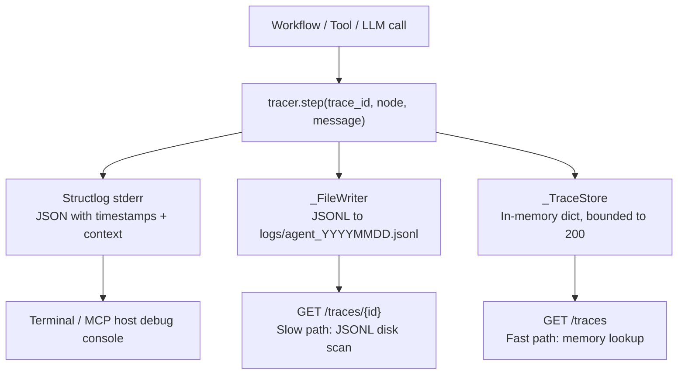
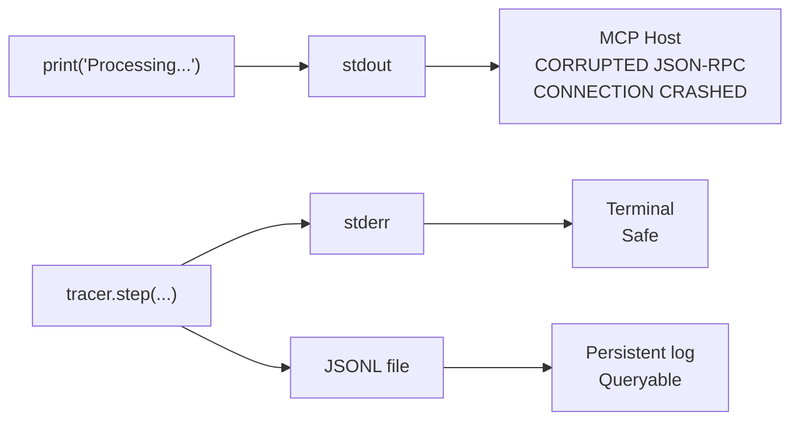
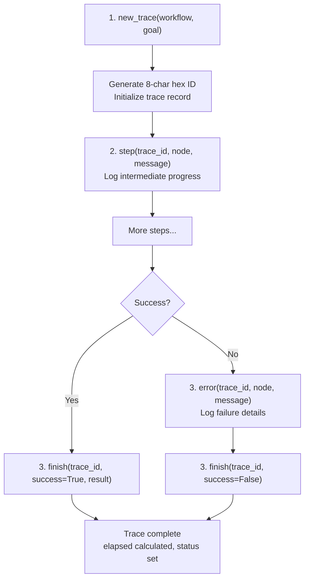
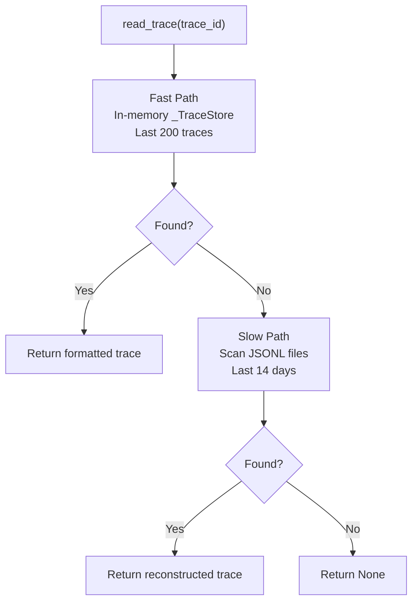
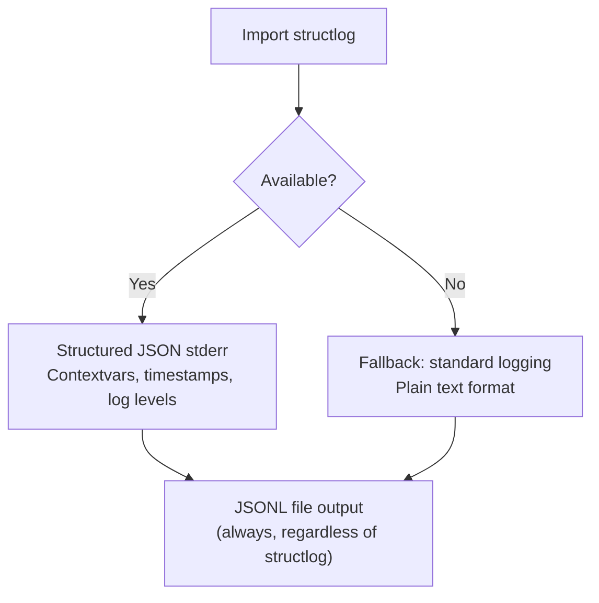
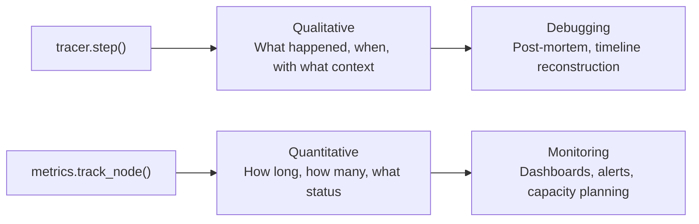

# 📝 Tracer

The Tracer (`core/tracer.py`) is the **centralized, structured logging and trace ID propagation system** for the entire agent stack. It provides end-to-end observability for workflows, tool executions, and LLM calls while strictly enforcing MCP stdio safety protocols.

**Key characteristics:**
- **MCP stdio safety** — NEVER writes to `sys.stdout`; all output goes to stderr and JSONL files
- **Dual output** — Structured stderr (console) + JSONL files (persistent, queryable)
- **Trace ID propagation** — Every operation tagged with 8-char hex ID for end-to-end correlation
- **Bounded memory** — In-memory store capped at 200 traces with FIFO eviction
- **Thread-safe** — All writes guarded by `threading.Lock()`
- **Graceful degradation** — Falls back to standard `logging` if `structlog` is missing

---

## 🏗️ Architecture

### Component Map

```
core/tracer.py                      # Tracer singleton, _FileWriter, _TraceStore
core/trace_reader.py                # Trace retrieval (memory fast-path, disk slow-path)
core/metrics.py                     # Prometheus metrics (complementary)
```

### Component Hierarchy

```
Tracer (singleton)
├── Trace ID Generator (uuid4 hex, 8 chars)
├── Structlog Config (stderr only, JSON renderer)
│   └── Graceful Fallback (standard logging if structlog missing)
├── _FileWriter (Thread-safe JSONL, daily rotation)
├── _TraceStore (In-memory, bounded to 200 traces)
└── Trace Reader (core/trace_reader.py)
    ├── Fast Path (In-memory lookup via _TraceStore)
    └── Slow Path (Disk scan of last 14 days of JSONL logs)
```

### Data Flow



---

## 🚨 MCP Stdio Safety (The Golden Rule)

**NEVER use `print()` or write to `sys.stdout` anywhere in `server.py`, `tools/`, `workflows/`, or `core/`.**

The MCP protocol uses stdout exclusively for JSON-RPC communication between the agent and the host (LM Studio, Claude Desktop, Cursor). Any non-JSON-RPC bytes on stdout corrupt the connection and crash the server.



**Correct patterns:**

```python
# ❌ WRONG — Will crash MCP connection
print("Processing file...")

# ✅ RIGHT — Goes to stderr and log file
tracer.step(trace_id, "file_ops", "Processing file...", chars=4200)

# ✅ RIGHT — Explicit stderr
print("Debug info", file=sys.stderr)
```

---

## 📤 Output Destinations

### 1. Standard Error (`sys.stderr`)

| Condition | Output Format |
|-----------|---------------|
| **structlog installed** | Structured JSON with timestamps, log levels, context variables |
| **structlog missing** | Plain text: `[step] trace_id | node | message` |

**Visibility:** Terminal when running `python server.py`, or MCP host's debug console.

### 2. JSONL Files (`logs/agent_YYYYMMDD.jsonl`)

**Format:** One JSON object per line, queryable with `jq` or Python.

**Example entry:**

```json
{
  "event": "step",
  "trace_id": "a3f2c0b1",
  "node": "memory_recall",
  "message": "Querying ChromaDB",
  "ts": 1716825600.123,
  "latency_ms": 45.2,
  "original": "how to fix syntax errors",
  "rewritten": "fix syntax error"
}
```

**Properties:**

| Property | Value | Description |
|----------|-------|-------------|
| Rotation | Daily | New file at midnight (`agent_YYYYMMDD.jsonl`) |
| Persistence | Survives restarts | Essential for post-mortem debugging |
| Thread safety | `threading.Lock()` | Prevents interleaved JSON lines |
| Auto-flush | `f.flush()` after every write | Crash-safe — logs persisted immediately |
| Silent I/O errors | Non-fatal disk errors ignored | Logging failure never crashes the agent |

### 3. In-Memory Trace Store (`_TraceStore`)

| Property | Value | Description |
|----------|-------|-------------|
| Capacity | 200 traces | Prevents unbounded memory growth |
| Eviction | FIFO | Oldest trace silently dropped when limit reached |
| Thread safety | `threading.Lock()` | All reads/writes guarded |
| Access | `tracer.get()`, `tracer.recent()` | Fast path for API and internal use |

---

## 🔄 Trace Lifecycle

Every significant operation follows this lifecycle:



### 1. Create Trace

```python
from core.tracer import tracer

tid = tracer.new_trace(
    workflow="autocode",
    goal="fix memory.py import error"
)
# Returns: "a3f2c0b1"
```

**What happens:**
- Generates unique 8-char hex ID from `uuid4`
- Initializes trace record in `_TraceStore`
- Logs `trace_start` event to JSONL and stderr
- Returns `trace_id` for all subsequent calls

### 2. Log Steps

```python
tracer.step(
    tid,
    "read",
    "file loaded",
    chars=4200,
    latency_ms=12.5
)
```

**What happens:**
- Appends step to trace's `steps` list in `_TraceStore`
- Writes to JSONL file
- Outputs to stderr
- All `**kwargs` are merged into the JSONL record

### 3. Log Errors

```python
tracer.error(
    tid,
    "apply",
    "patch failed",
    error="context mismatch"
)
```

**What happens:**
- Logs error event (does NOT mark trace as failed — use `finish(success=False)` for that)
- Writes to JSONL file
- Outputs to stderr

### 4. Finish Trace

```python
tracer.finish(
    tid,
    success=True,
    result="committed abc123"
)
```

**What happens:**
- Calculates total elapsed time
- Sets terminal status (`success` or `failed`)
- Logs `trace_finish` event
- Writes final summary to JSONL and stderr

---

## 📡 API Reference

### Core Methods

| Method | Signature | Description |
|--------|-----------|-------------|
| `new_trace()` | `(workflow: str, goal: str = "", **kwargs) -> str` | Create trace, return 8-char hex ID |
| `step()` | `(trace_id: str, node: str, message: str = "", **kwargs) -> None` | Log intermediate step |
| `error()` | `(trace_id: str, node: str, message: str = "", **kwargs) -> None` | Log error event |
| `finish()` | `(trace_id: str, success: bool = True, result: str = "", **kwargs) -> None` | Mark trace complete |
| `get()` | `(trace_id: str) -> Optional[dict]` | Retrieve full in-memory trace record |
| `recent()` | `(n: int = 10) -> list[dict]` | Get N most recent traces (newest first) |
| `summary()` | `(trace_id: str) -> str` | One-line human-readable summary |
| `warning()` | `(node: str, **kwargs) -> None` | Log warning (no trace_id required) |

### Trace Record Structure

```python
{
    "trace_id": "a3f2c0b1",
    "workflow": "autocode",
    "goal": "fix memory.py import error",
    "started_at": 1716825600.0,
    "started_fmt": "2026-06-19 10:30:00",
    "status": "success",
    "elapsed": 45.2,
    "result": "committed abc123",
    "steps": [
        {"ts": 1716825600.1, "event": "step", "node": "read", "message": "file loaded"},
        {"ts": 1716825612.5, "event": "step", "node": "apply", "message": "patch applied"},
        {"ts": 1716825645.0, "event": "step", "node": "commit", "message": "committed"}
    ]
}
```

### Summary Format

```python
tracer.summary("a3f2c0b1")
# "[a3f2c0b1] autocode | goal='fix memory.py' | status=success | steps=12 | elapsed=45.2s"
```

---

## 🔍 Trace Retrieval

### Trace Reader (`core/trace_reader.py`)

The trace reader provides two-path retrieval:



| Path | Source | Speed | Limit |
|------|--------|-------|-------|
| **Fast** | In-memory `_TraceStore` | ~0.1ms | Last 200 traces |
| **Slow** | JSONL disk scan | ~100ms–2s | Last 14 days of logs |

**Slow path optimizations:**
- Quick string check (`trace_id not in line`) before expensive JSON parse
- Scans newest files first
- Limited to 14 most recent log files

### HTTP Endpoints (via Gateway)

| Endpoint | Auth | Description |
|----------|------|-------------|
| `GET /traces` | Bearer | List recent traces from memory (default limit: 10) |
| `GET /traces/{trace_id}` | Bearer | Full execution timeline (memory → disk fallback) |

### Manual Querying (CLI)

```bash
# Find all errors from today
cat logs/agent_20260619.jsonl | jq 'select(.event == "error")'

# Find all steps for a specific trace
cat logs/agent_20260619.jsonl | jq 'select(.trace_id == "a3f2c0b1")'

# Count steps per workflow
cat logs/agent_20260619.jsonl | jq -r '.workflow' | sort | uniq -c

# Find slowest traces
cat logs/agent_20260619.jsonl | jq 'select(.event == "trace_finish") | {trace_id, elapsed_s}' | sort -k2 -n
```

### Python Querying

```python
import json
from pathlib import Path

log_file = Path("logs/agent/agent_20260619.jsonl")
for line in log_file.read_text().splitlines():
    record = json.loads(line)
    if record.get("event") == "error":
        print(f"[{record['trace_id']}] {record['node']}: {record['message']}")
```

---

## 🔌 Structlog & Graceful Fallback

The tracer attempts to use `structlog` for rich, structured JSON logging to stderr. If missing, it falls back to standard `logging`.



| Condition | stderr Output | File Output |
|-----------|---------------|-------------|
| **structlog installed** | Structured JSON with contextvars | JSONL (always) |
| **structlog missing** | Plain text `[step] trace_id | node | message` | JSONL (always) |

**Why this matters:** If a user clones the repo and forgets `pip install structlog`, the agent still boots and logs correctly. Core observability never breaks from a missing optional dependency.

### Log Level Control

| Env Variable | `AUTOCODE_DEBUG=0` | `AUTOCODE_DEBUG=1` |
|--------------|--------------------|--------------------|
| structlog level | INFO (20) | DEBUG (10) |
| standard logging level | INFO | DEBUG |

---

## ⚙️ Configuration

| Env Variable | Default | Description |
|--------------|---------|-------------|
| `AUTOCODE_DEBUG` | `0` | Set to `1` for verbose DEBUG-level logs |
| `FASTMCP_LOG_LEVEL` | `error` | Suppress FastMCP internal logs |
| `LOG_PATH` | `{agent_root}/logs` | JSONL log file directory |

---

## 📊 Observability Integration

### Prometheus Metrics (`core/metrics.py`)

The tracer works alongside the metrics module for quantitative monitoring:

| Metric | Type | Description |
|--------|------|-------------|
| `autocode_node_duration_seconds` | Histogram | Duration of node execution |
| `autocode_task_status_total` | Counter | Task outcomes (success/failed) |
| `autocode_tdd_iterations` | Histogram | TDD iterations per task |
| `autocode_llm_tokens_total` | Counter | Token consumption by role |

Exposed at `GET /metrics` in Prometheus text format.

### Trace-Metrics Relationship



---

## 🧪 Testing

```powershell
# Run all tracer tests
D:\mcp\agent\venv\Scripts\pytest.exe tests/core/test_tracer.py -v

# Test trace reader
D:\mcp\agent\venv\Scripts\pytest.exe tests/core/test_trace_reader.py -v

# Test with structlog missing
D:\mcp\agent\venv\Scripts\pytest.exe tests/core/test_tracer.py -k "fallback" -v
```

**Mock strategy:**
- Mock `_FileWriter` for unit tests (avoid disk I/O)
- Use real `_TraceStore` for concurrency tests
- Test structlog fallback by mocking `import structlog` to raise `ImportError`

---

## ⚠️ Known Concerns

> **Note:** These are MiMo's observations from source code review. They are constructive suggestions, not definitive prescriptions.

### Tracer.step() 2-arg Signature Usage

**What exists:**
Some callers use `tracer.step()` with only 2 positional arguments: `tracer.step("health", "Health check")`. The signature is `step(trace_id, node, message="")`, so this sets `trace_id="health"` and `node="Health check"`.

**The concern:**
This works but produces trace records with `trace_id="health"` — a non-unique identifier that could collide with other health check calls. It's also semantically confusing: "health" is not a trace ID.

**Suggestion:**
For non-trace-scoped logging, use `tracer.warning()` or a dedicated logging call. Reserve `tracer.step()` for trace-scoped operations with real trace IDs.

### JSONL File Growth

**What exists:**
JSONL files are created daily and never compressed. Over time, a busy agent can produce hundreds of megabytes of logs.

**The concern:**
No automatic compression or archival of old log files. The 14-day scan limit in `trace_reader.py` prevents performance issues, but disk usage grows unbounded.

**Suggestion:**
Add a log rotation policy: gzip files older than 7 days, delete files older than 30 days. The doc mentions this as a "Future Enhancement" but it should be prioritized for long-running deployments.

### No Trace Sampling

**What exists:**
Every operation is traced — no filtering or sampling.

**The concern:**
High-frequency operations (router calls, memory recalls) produce many low-value trace entries. This increases JSONL file size and in-memory store churn without proportional debugging value.

**Suggestion:**
Consider trace sampling for high-frequency, low-importance operations (e.g., keep only 10% of router classification traces). Important traces (errors, workflow completions) should always be kept.

---

## 🛡️ AI Agent Instructions

If you are an AI assistant modifying `core/tracer.py` or any file that uses it:

1. **NEVER write to stdout** — any `print()` without `file=sys.stderr` will break the MCP connection. Always use `tracer.step()`, `tracer.error()`, or `print(..., file=sys.stderr)`.
2. **Preserve the fallback** — never remove the `try/except ImportError` block for `structlog`. Graceful degradation is critical for environment resilience.
3. **Thread safety** — never remove the `_lock` from `_FileWriter` or `_TraceStore`. Concurrent workflow executions will corrupt the JSONL file or cause race conditions.
4. **Bounded memory** — never increase `MAX_TRACES` significantly above 200. The agent may run for days; unbounded trace storage causes OOM.
5. **Silent I/O errors** — `_FileWriter` intentionally ignores non-fatal disk errors. Do not "fix" this — a logging failure should never crash the agent.
6. **Trace ID format** — keep trace IDs short (8 chars). Long UUIDs bloat JSONL logs and make terminal output hard to read.
7. **Shutdown signals** — never catch `KeyboardInterrupt` or `SystemExit` in `_FileWriter`. The agent must shut down cleanly on Ctrl+C.
8. **Context variables** — use `**kwargs` in `step()`/`error()` for new log fields. They're automatically merged into the JSONL record.
9. **Daily rotation** — `_FileWriter` checks the date on every write. Do not cache the file handle across midnight boundaries.
10. **No hardcoded paths** — log directory is always `cfg.log_path`. Never hardcode `"logs/"` in the tracer.

---

## 🔗 Source Code Reference

| File | Purpose |
|------|---------|
| `core/tracer.py` | `Tracer` singleton, `_FileWriter`, `_TraceStore`, `generate_trace_id()` |
| `core/trace_reader.py` | `read_trace()`, `list_recent_traces()` — memory + disk retrieval |
| `core/metrics.py` | Prometheus metrics (complementary to tracer) |
| `core/config.py` | `log_path`, `autocode_debug` configuration |
| `core/gateway_backend/routes/traces.py` | HTTP endpoints: `GET /traces`, `GET /traces/{id}` |
| `core/gateway_backend/routes/metrics.py` | HTTP endpoint: `GET /metrics` |
| `core/gateway_backend/factory.py` | Request-ID middleware (assigns trace_id to every request) |
| `server.py` | Main entry point — all tools use tracer for logging |

---

## 🔮 Future Roadmap

| Status | Enhancement | Description |
|--------|-------------|-------------|
| ✅ Complete | Dual output | stderr + JSONL files |
| ✅ Complete | Trace ID propagation | 8-char hex IDs across all operations |
| ✅ Complete | Bounded memory | 200-trace FIFO in-memory store |
| ✅ Complete | Graceful fallback | Standard logging if structlog missing |
| ✅ Complete | Trace query API | `GET /traces`, `GET /traces/{id}` |
| ✅ Complete | Daily rotation | New JSONL file per day |
| 🚧 Planned | Log compression | Gzip old JSONL files after 7 days |
| 🚧 Planned | Log archival | Delete files older than 30 days |
| 🚧 Planned | Trace sampling | Drop low-importance traces to reduce volume |
| 🚧 Planned | OpenTelemetry integration | Export to Jaeger/Zipkin for distributed tracing |
| 🚧 Planned | Remote log shipping | Forward to Loki, ELK for multi-machine deployments |

---

*Last updated: June 2026. All output destinations, trace lifecycle methods, and safety rules reflect current source code in `core/tracer.py`.*