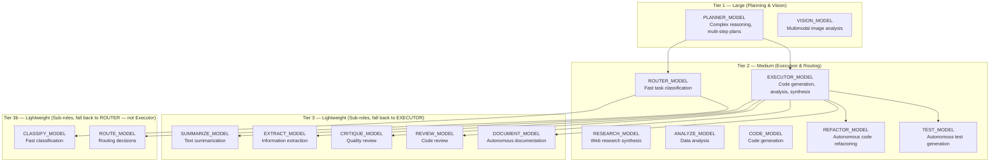
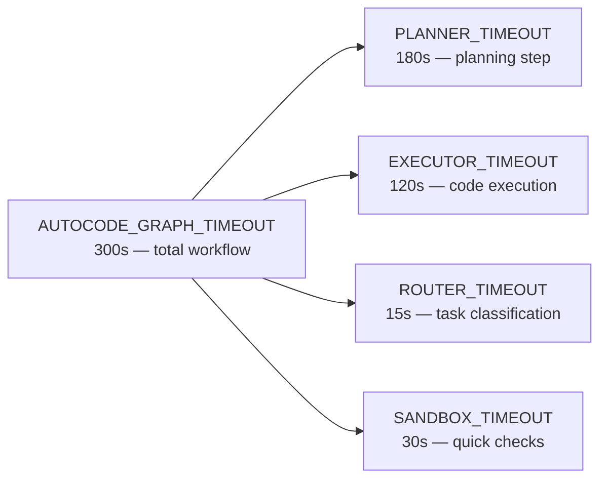

<- Back to [Config Overview](../CONFIG.md)

# 📝 API Reference

## 🔧 Model Configuration

Model identifiers are loaded from `.env` and must match **exactly** what appears in your LLM provider's `/v1/models` response. The agent uses a **tiered model strategy**: larger models for complex reasoning, smaller models for fast classification and lightweight tasks.

### Model Tier Strategy



### Core Roles

| Config Attribute | Env Variable | Required | Timeout | Description |
|------------------|--------------|----------|---------|-------------|
| `planner_model` | `PLANNER_MODEL` | ✅ Yes | `PLANNER_TIMEOUT` | Long-context reasoning, memory summaries, planning |
| `executor_model` | `EXECUTOR_MODEL` | ❌ Falls back to planner | `EXECUTOR_TIMEOUT` | Code generation, analysis, synthesis |
| `router_model` | `ROUTER_MODEL` | ❌ Falls back to planner | `ROUTER_TIMEOUT` | Fast task classification (15s default) |
| `vision_model` | `VISION_MODEL` | ❌ Falls back to planner | `VISION_TIMEOUT` | Multimodal image analysis |
| `consultor_model` | `CONSULTOR_MODEL` | ❌ Not registered at all if unset | `CONSULTOR_TIMEOUT` | Cross-model consultation — **only added to `model_registry` if a model is explicitly configured**; unlike the other roles, there's no fallback chain for this one |

### Router Sub-Role Models (fall back to `ROUTER_MODEL`, not `EXECUTOR_MODEL`)

These two are easy to miss — they're sub-roles like `summarize`/`extract` etc., but they fall back to the **router** group, not the executor group:

| Config Attribute | Env Variable | Fallback | Timeout Env | Default |
|------------------|--------------|----------|--------------|---------|
| `classify` (via `model_registry["classify"]`) | `CLASSIFY_MODEL` | `router_model` | `CLASSIFY_TIMEOUT` | 15s |
| `route` (via `model_registry["route"]`) | `ROUTE_MODEL` | `router_model` | `ROUTE_TIMEOUT` | 15s |

> Neither `classify` nor `route` has its own `cfg._model` attribute — they only exist as entries in `cfg.model_registry`, accessed by role name through the LLM client, not as direct `Config` attributes the way `planner_model`/`executor_model`/etc. are.

### Sub-Role Models

Sub-roles use smaller, faster models for lightweight tasks. Each can be overridden independently or fall back to `EXECUTOR_MODEL`.

| Config Attribute | Env Variable | Fallback | Timeout Env (Default) | Description |
|------------------|--------------|----------|------------------------|-------------|
| `summarize_model` | `SUMMARIZE_MODEL` | `executor_model` | `SUMMARIZE_TIMEOUT` (60s) | Text summarization |
| `extract_model` | `EXTRACT_MODEL` | `executor_model` | `EXTRACT_TIMEOUT` (60s) | Information extraction from documents |
| `research_model` | `RESEARCH_MODEL` | `executor_model` | `RESEARCH_TIMEOUT` (120s) | Web research synthesis |
| `critique_model` | `CRITIQUE_MODEL` | `executor_model` | `CRITIQUE_TIMEOUT` (90s) | Quality critique and feedback |
| `analyze_model` | `ANALYZE_MODEL` | `executor_model` | `ANALYZE_TIMEOUT` (90s) | Data analysis |
| `code_model` | `CODE_MODEL` | `executor_model` | `CODE_TIMEOUT` (120s) | Code generation |
| `review_model` | `REVIEW_MODEL` | `executor_model` | `REVIEW_TIMEOUT` (90s) | Code review |
| `refactor_model` | `REFACTOR_MODEL` | `code_model` | `REFACTOR_TIMEOUT` (120s) | Autonomous code refactoring |
| `test_model` | `TEST_MODEL` | `code_model` | `TEST_TIMEOUT` (120s) | Autonomous test generation |
| `document_model` | `DOCUMENT_MODEL` | `summarize_model` | `DOCUMENT_TIMEOUT` (120s) | Autonomous documentation generation |

Each sub-role has its **own independent timeout env var** — they don't share `EXECUTOR_TIMEOUT`/`execution_timeout`, despite falling back to `executor_model` for the model name itself.

### Model Registry

The `cfg.model_registry` dict provides per-role configuration for the LLMClient:

Each entry is built by an internal `_make_entry(model, provider, timeout_env, default_timeout)` helper — every entry has **4 keys**:

```python
# What cfg.model_registry actually looks like (verified against source) —
# NOT the {"model":..., "timeout":...}-only shape this doc previously showed,
# and there is no "synthesize" role anywhere in this codebase.
cfg.model_registry = {
    "planner":   {"model": ..., "provider": ..., "base_url": ..., "timeout": 180},  # PLANNER_TIMEOUT
    "executor":  {"model": ..., "provider": ..., "base_url": ..., "timeout": 120},  # EXECUTOR_TIMEOUT
    "router":    {"model": ..., "provider": ..., "base_url": ..., "timeout": 15},   # ROUTER_TIMEOUT
    "vision":    {"model": ..., "provider": ..., "base_url": ..., "timeout": 60},   # VISION_TIMEOUT
    "classify":  {"model": ..., "provider": ..., "base_url": ..., "timeout": 15},   # CLASSIFY_TIMEOUT
    "route":     {"model": ..., "provider": ..., "base_url": ..., "timeout": 15},   # ROUTE_TIMEOUT
    "summarize": {"model": ..., "provider": ..., "base_url": ..., "timeout": 60},   # SUMMARIZE_TIMEOUT
    "extract":   {"model": ..., "provider": ..., "base_url": ..., "timeout": 60},   # EXTRACT_TIMEOUT
    "research":  {"model": ..., "provider": ..., "base_url": ..., "timeout": 120},  # RESEARCH_TIMEOUT
    "critique":  {"model": ..., "provider": ..., "base_url": ..., "timeout": 90},   # CRITIQUE_TIMEOUT
    "analyze":   {"model": ..., "provider": ..., "base_url": ..., "timeout": 90},   # ANALYZE_TIMEOUT
    "code":      {"model": ..., "provider": ..., "base_url": ..., "timeout": 120},  # CODE_TIMEOUT
    "review":    {"model": ..., "provider": ..., "base_url": ..., "timeout": 90},   # REVIEW_TIMEOUT
    "refactor":  {"model": ..., "provider": ..., "base_url": ..., "timeout": 120},  # REFACTOR_TIMEOUT
    "test":      {"model": ..., "provider": ..., "base_url": ..., "timeout": 120},  # TEST_TIMEOUT
    "document":  {"model": ..., "provider": ..., "base_url": ..., "timeout": 120},  # DOCUMENT_TIMEOUT
    # "consultor" is added ONLY if CONSULTOR_MODEL resolves to a non-empty model —
    # it's conditionally present, not always there like the other 16 keys.
}
```

`provider` is auto-resolved per role by `_resolve_role()`: an exact match against `{"openai", "deepseek", "mistral", "qwen", "kimi"}` routes to that cloud provider (reading `{PROVIDER}_BASE_MODEL` for the actual model name); anything else is treated as a local LM Studio model name.

---

## 🌐 External Services

| Config Attribute | Env Variable | Default | Description |
|------------------|--------------|---------|-------------|
| `lm_studio_base_url` | `LM_STUDIO_BASE_URL` | `http://localhost:1234/v1` | OpenAI-compatible LLM endpoint |
| `searxng_url` | `SEARXNG_URL` | `http://localhost:8080` | Privacy-focused search engine |
| `runtime_provider` | `RUNTIME_PROVIDER` | `lmstudio` | LLM server provider (`lmstudio`, `ollama`, `vllm`) |
| `lm_studio_restart_cmd` | `LM_STUDIO_RESTART_CMD` | *(provider default)* | Watchdog restart command override |

### Runtime Providers

The watchdog (`core/runtime/watchdog.py`) can monitor and restart different LLM servers:

| Provider | Health URL | Default Restart Command |
|----------|-----------|------------------------|
| `lmstudio` | `{base_url}/models` | `lms server start` |
| `ollama` | `http://localhost:11434/api/tags` | `ollama serve` |
| `vllm` | `http://localhost:8000/v1/models` | `vllm serve` |

---

## 🧠 Memory Tuning

| Config Attribute | Env Variable | Default | Description |
|------------------|--------------|---------|-------------|
| `memory_delete_threshold` | `MEMORY_DELETE_THRESHOLD` | `0.4` | Decay score below which memories are pruned |
| `memory_decay_days` | `MEMORY_DECAY_DAYS` | `30` | Days until decay floor (0.3) is reached |
| `memory_top_k` | `MEMORY_TOP_K` | `5` | Default results per recall query |
| `memory_max_entry_bytes` | `MAX_MEMORY_BYTES` | `50000` | Max bytes per memory entry (50KB) |
| `max_tags_per_entry` | `MAX_TAGS_PER_ENTRY` | `6` | Max tags per memory entry |
| `max_tag_length` | `MAX_TAG_LENGTH` | `50` | Max characters per tag |
| `embed_model` | `EMBED_MODEL` | `all-MiniLM-L6-v2` | ChromaDB embedding model |

---

## 💤 Sleep & Learn Configuration

The background meta-learning daemon (`core/sleep_learn/`) uses these settings to control when and how it processes feedback.

| Config Attribute | Env Variable | Default | Description |
|------------------|--------------|---------|-------------|
| `SLEEP_MIN_IDLE_SECONDS` | `SLEEP_MIN_IDLE_SECONDS` | `7200` (2h) | Minimum idle time before background learning activates |
| `SLEEP_CHECK_INTERVAL` | `SLEEP_CHECK_INTERVAL` | `600` (10min) | How often to check if agent is idle |
| `SLEEP_FEEDBACK_MIN_AGE_HOURS` | `SLEEP_FEEDBACK_MIN_AGE_HOURS` | `24` | Minimum age of feedback entries before processing |
| `SLEEP_MAX_TRACES` | `SLEEP_MAX_TRACES` | `50` | Maximum traces to analyze per session |
| `SLEEP_CONFIDENCE_THRESHOLD` | `SLEEP_CONFIDENCE_THRESHOLD` | `0.6` | Minimum confidence for rule extraction |
| `SLEEP_REPETITION_THRESHOLD` | `SLEEP_REPETITION_THRESHOLD` | `5` | Minimum repetitions before a pattern becomes a rule |
| `SLEEP_RULE_MAX_CHARS` | `SLEEP_RULE_MAX_CHARS` | `1000` | Maximum characters per extracted rule |

---

## 🔎 Tavily AI Search

Not documented anywhere in the previous version of this doc — confirmed real, in active use.

| Config Attribute | Env Variable | Default | Description |
|------------------|--------------|---------|-------------|
| `tavily_api_key` | `TAVILY_API_KEY` | `""` | API key — `tavily` tool unavailable if unset |
| `tavily_timeout` | `TAVILY_TIMEOUT` | `60` | Seconds, validated 1–300 |

---

## 🌐 Browser Fallback (Research Workflow)

Also previously undocumented. Controls when the `research` workflow falls back to browser automation instead of a plain HTTP fetch.

| Config Attribute | Env Variable | Default | Description |
|------------------|--------------|---------|-------------|
| `research_browser_fallback_max` | `RESEARCH_BROWSER_FALLBACK_MAX` | `3` | Max number of browser-fallback attempts per research run |
| `research_browser_fallback_timeout` | `RESEARCH_BROWSER_FALLBACK_TIMEOUT` | `15` | Seconds per fallback attempt |

---

## 🔬 Deep Research Workflow

An entire config block — 6 settings — missing from the previous version of this doc.

| Config Attribute | Env Variable | Default | Validated Range |
|------------------|--------------|---------|------------------|
| `deep_research_max_iterations` | `DEEP_RESEARCH_MAX_ITERATIONS` | `10` | 1–50 |
| `deep_research_completeness_threshold` | `DEEP_RESEARCH_COMPLETENESS_THRESHOLD` | `85` | 0–100 (exclusive of 0) |
| `deep_research_max_api_calls` | `DEEP_RESEARCH_MAX_API_CALLS` | `20` | 0–100 |
| `deep_research_max_browser_actions` | `DEEP_RESEARCH_MAX_BROWSER_ACTIONS` | `10` | 0–50 |
| `deep_research_timeout_seconds` | `DEEP_RESEARCH_TIMEOUT_SECONDS` | `300` | 1–3600 |
| `deep_research_convergence_threshold` | `DEEP_RESEARCH_CONVERGENCE_THRESHOLD` | `0.85` | 0–1 (exclusive of 0) |

---

## 🧹 Memory Diversity (Phase 6)

Backs the diversity-enforcement maintenance daemon. Also previously undocumented.

| Config Attribute | Env Variable | Default | Description |
|------------------|--------------|---------|-------------|
| `diversity_distance_threshold` | `DIVERSITY_DISTANCE_THRESHOLD` | `0.12` | Vector-distance threshold for near-duplicate clustering |
| `archive_age_days` | `ARCHIVE_AGE_DAYS` | `30` | Age before episodic memories become archive-eligible |
| `purge_age_days` | `PURGE_AGE_DAYS` | `90` | Age before archived memories become purge-eligible |

---

## 📐 Context Budgeting (Phase 5)

| Config Attribute | Env Variable | Default | Description |
|------------------|--------------|---------|-------------|
| `max_context_tokens` | `MAX_CONTEXT_TOKENS` | `8000` | Input budget passed to `budget_messages()` — validated 1000–100,000. See [LLM.md → Context Budgeting](./LLM.md#-context-budgeting) for the full algorithm this number feeds into. |

---

## ⚡ Concurrency & Activity

| Config Attribute | Env Variable | Default | Description |
|------------------|--------------|---------|-------------|
| `max_concurrent_inferences` | `MAX_CONCURRENT_INFERENCES` | `2` | Max parallel LLM calls (inference slots) |
| `disable_model_warmup` | `DISABLE_MODEL_WARMUP` | `0` (false) | Set to `1` to skip the ChromaDB warmup thread entirely — previously undocumented |

The `ActivityTracker` (`core/runtime/activity_tracker.py`) uses `max_concurrent_inferences` to limit concurrent LLM calls and detect idle periods for background daemons.

### Parallel Execution (Phase 7)

Backs the `parallel` tool. Entirely missing from the previous version of this doc.

| Config Attribute | Env Variable | Default | Description |
|------------------|--------------|---------|-------------|
| `max_concurrent_workers` | `MAX_CONCURRENT_WORKERS` | `3` | Max concurrent sub-tasks the `parallel` tool can fan out |
| `worker_timeout` | `WORKER_TIMEOUT` | `60` | Seconds per worker task |
| `worker_max_tokens` | `WORKER_MAX_TOKENS` | `250` | Max tokens per worker's LLM call, if it makes one |

---

## 🛠️ Tool & System Limits

### Web Tool

| Config Attribute | Env Variable | Default | Description |
|------------------|--------------|---------|-------------|
| `web_max_text_chars` | `WEB_MAX_TEXT_CHARS` | `8000` | Max characters per scraped page |
| `web_snippet_chars` | `WEB_SNIPPET_CHARS` | `300` | Max characters per search snippet |
| `web_max_search_results` | `WEB_MAX_SEARCH_RESULTS` | `10` | Max search results to return |

### CLI Tool

| Config Attribute | Env Variable | Default | Description |
|------------------|--------------|---------|-------------|
| `cli_max_command_chars` | `CLI_MAX_COMMAND_LENGTH` | `4096` | Max shell command length |
| `cli_max_arguments` | `CLI_MAX_ARGUMENTS` | `20` | Max arguments per command |

### File Tool

| Config Attribute | Env Variable | Default | Description |
|------------------|--------------|---------|-------------|
| `file_max_read_chars` | `FILE_MAX_READ_CHARS` | `50000` | Max characters per file read |

### Autocode & Execution

| Config Attribute | Env Variable | Default | Description |
|------------------|--------------|---------|-------------|
| `execution_timeout` | `EXECUTOR_TIMEOUT` | `120` | Seconds for code execution sandbox |
| `sandbox_timeout` | `SANDBOX_TIMEOUT` | `30` | Seconds for quick sandbox checks |
| `autocode_max_retries` | `AUTOCODE_MAX_RETRIES` | `3` | Max TDD iterations before rollback |
| `autocode_max_file_chars` | `AUTOCODE_MAX_FILE_CHARS` | `6000` | Max file size for autocode context |
| `autocode_debug` | `AUTOCODE_DEBUG` | `0` | Set to `1` for verbose trace logging |

> ⚠️ **Removed:** `cfg.max_retries` was a duplicate of `cfg.autocode_max_retries` (same env var `AUTOCODE_MAX_RETRIES`, same default `3`). It has been removed. Use `cfg.autocode_max_retries` exclusively.

### Timeout Hierarchy



| Config Attribute | Env Variable | Default | Description |
|------------------|--------------|---------|-------------|
| `planner_timeout` | `PLANNER_TIMEOUT` | `180` | Planner LLM call timeout (seconds) |
| `execution_timeout` | `EXECUTOR_TIMEOUT` | `120` | Executor LLM call timeout (seconds) |
| `router_timeout` | `ROUTER_TIMEOUT` | `15` | Router LLM call timeout (seconds) |
| `vision_timeout` | `VISION_TIMEOUT` | `60` | Vision LLM call timeout (seconds) |
| `autocode_graph_timeout` | `AUTOCODE_GRAPH_TIMEOUT` | `300` | Total autocode workflow timeout (seconds) |

> ⚠️ **Validation:** `autocode_graph_timeout` must be >= max(timeout for all roles in model_registry). Previously only checked against planner/executor/router; now checks against ALL roles.

---

## 🌐 Gateway Configuration

The REST gateway (`core/gateway.py`) exposes the agent over HTTP for external clients.

| Config Attribute | Env Variable | Default | Description |
|------------------|--------------|---------|-------------|
| `gateway_host` | `GATEWAY_HOST` | `127.0.0.1` | REST API bind address |
| `gateway_port` | `GATEWAY_PORT` | `8000` | REST API port |
| `gateway_secret` | `GATEWAY_SECRET` | `changeme` | Bearer token for authentication |
| `gateway_cors_origins` | `GATEWAY_CORS_ORIGINS` | `["*"]` | Allowed CORS origins (comma-separated) |
| `gateway_max_body_mb` | `GATEWAY_MAX_BODY_MB` | `10` | Max request body size (MB) |

### Security Guards

| Guard | Condition | Behavior |
|-------|-----------|----------|
| Default secret | `GATEWAY_SECRET == "changeme"` + `ENV != "dev"` | **Hard stop** — refuses to start |
| Default secret | `GATEWAY_SECRET == "changeme"` + `ENV == "dev"` | Warning to stderr |
| Rate limiting | `/chat` | 30 requests/minute |
| Rate limiting | `/task` | 60 requests/minute |
| Payload limit | Any POST/PUT/PATCH | 413 if body > `gateway_max_body_mb` |

---

## 🛡️ Protected Files

The `cfg.protected_files` frozenset lists files that tools are **forbidden from editing**. Reads are always allowed; writes are blocked by `path_guard.check_protected_file()`.

```python
cfg.protected_files = frozenset({
    "server.py",
    "registry.py",
    "core/config.py",
    "core/tracer.py",
    "core/llm.py",
    "core/memory.py",
    "core/gateway.py",
})
```

### Checking Protection

```python
from core.config import cfg

cfg.is_protected("server.py")        # True — core infrastructure
cfg.is_protected("tools/web.py")     # False — safe to edit
cfg.is_protected("core/config.py")   # True — protected
```

**Implementation:** Tries an exact absolute-path match first, then falls back to filename-only matching via `os.path.normcase()`. The "case-insensitive" part is actually **platform-dependent**: `normcase()` lowercases on Windows but is a no-op on Linux — so the filename-fallback check is case-sensitive on Linux, case-insensitive on Windows. Given this stack runs on Windows 11, that distinction rarely bites in practice, but it's not a cross-platform guarantee as previously worded.

---

## 🔒 SSRF Protection

The `cfg.allowed_internal_hosts` frozenset defines which internal hosts network tools can access.

| Config Attribute | Env Variable | Default | Description |
|------------------|--------------|---------|-------------|
| `allowed_internal_hosts` | `ALLOWED_INTERNAL_HOSTS` | `localhost,127.0.0.1,::1` | Comma-separated host allowlist |

### Environment Profiles

| Profile | `ALLOWED_INTERNAL_HOSTS` | Behavior |
|---------|-------------------------|----------|
| **Development** (default) | `localhost,127.0.0.1,::1` | Allows LM Studio, SearXNG, ChromaDB on localhost |
| **Production** | *(empty)* | Blocks **all** private/localhost access |

### First-Use Warning (Not a Startup Warning)

> ⚠️ This lives in `core/net/security.py`, not `core/config.py`, and it doesn't fire at startup. It's gated by a one-time `_SSRF_WARNED` flag inside `is_safe_network_address()`, so it only fires the first time any tool actually performs a network-safety check — which could be seconds after startup, much later, or never, depending on when (if ever) a network-touching tool is first invoked.

If `allowed_internal_hosts` is non-empty, on that first check, `logger.warning()` logs:
```
SSRF: localhost/internal access allowed by default for development. Set ALLOWED_INTERNAL_HOSTS='' in .env for production.
```

---

## 🌍 Environment Detection

| Config Attribute | Env Variable | Default | Description |
|------------------|--------------|---------|-------------|
| `env` | `ENV` | `development` | Environment mode: `development` or `production` |
| `is_dev` | *(derived)* | `True` if `env == "development"` | Convenience flag |
| `is_windows` | *(derived)* | `True` if `os.name == "nt"` | Platform detection |

---

## ✅ Validation Rules

The `Config.__init__()` method enforces these validations **at import time**. Invalid config raises `ValueError` or `FileNotFoundError`, preventing the server from starting with bad settings.

Additionally, `core/config_validation.py` runs a second pass at startup (called from `gateway_backend/factory.py`) to verify critical paths exist and required models are configured.

### Path Validations
- `agent_root` must be an absolute path
- `agent_root` must exist on the filesystem

### Limit Validations

| Field | Rule |
|-------|------|
| `autocode_max_retries` | > 0 |
| `autocode_max_file_chars` | > 0 |
| `autocode_graph_timeout` | >= max(timeout for all roles in model_registry) |
| `memory_max_entry_bytes` | 1 – 10,000,000 |
| `max_tags_per_entry` | 1 – 50 |
| `max_tag_length` | 1 – 200 |
| `web_max_text_chars` | 1 – 100,000 |
| `web_snippet_chars` | 1 – 5,000 |
| `web_max_search_results` | 1 – 50 |
| `cli_max_command_chars` | 1 – 49,999 |
| `cli_max_arguments` | 1 – 100 |
| `file_max_read_chars` | 1 – 1,000,000 |

**Failure Mode:** Raises `ValueError` at import time. The server never starts with invalid config.

---

## 🔧 Helper Methods

| Method | Signature | Description |
|--------|-----------|-------------|
| `ensure_dirs()` | `() -> None` | Creates all required directories if they don't exist |
| `resolve_agent_path()` | `(relative: str) -> Path` | Resolves a relative path within `agent_root` |
| `resolve_workspace_path()` | `(relative: str) -> Path` | Resolves a relative path within `workspace_root` |
| `is_protected()` | `(path: str | Path) -> bool` | Checks if a path matches the protected files list |

---

*Last updated: 2026-07-03. See [ARCHITECTURE.md](ARCHITECTURE.md) for file maps and design decisions, [CHANGELOG.md](CHANGELOG.md) for version history, [INSTRUCTIONS.md](INSTRUCTIONS.md) for AI editing rules.*
