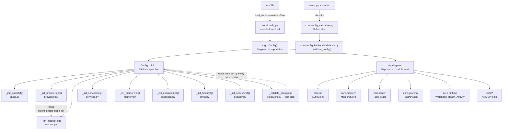

<- Back to [Config Overview](../CONFIG.md)

# 🏗️ Architecture

## 🔗 Source Code Reference

> **v1.0 split:** The monolithic ~430-line `Config.__init__` is now a thin dispatcher. Implementation lives in the 12-file `core/config_backend/` package. Public surface (`Config` class + `cfg` singleton) is unchanged.

### Config package proper

| File | Lines | Purpose |
|------|-------|---------|
| `core/config.py` | 168 | Thin `Config` class. `__init__` is a 25-line dispatcher that imports and calls 9 builders in order. Hosts the 6 helper methods (`ensure_dirs`, `resolve_agent_path`, `resolve_workspace_path`, `is_protected`, `reload`, `__repr__`), the module-level `.env` load, and the `cfg = Config()` singleton. |
| `core/config_validation.py` | 18 | **Backwards-compat shim.** Re-exports `validate_config` from `config_backend/validation.py`. Re-exports *only* `validate_config` — not `cfg` or `tracer`. |
| `core/config_backend/__init__.py` | 24 | Package init — module map docstring, no side effects. |
| `core/config_backend/env_loader.py` | 63 | `_find_env_file()` (walks 5 parents from `config_backend/` to locate `.env`) + `_resolve_role()` (exact-match cloud-provider routing, else local LM Studio name). Helpers — no state. |
| `core/config_backend/paths.py` | 47 | `_init_paths(cfg)` — 9 filesystem path attributes (`agent_root`, `workspace_root`, `memory_root` + 6 derived). `_here = Path(__file__).resolve().parent.parent.parent` (3 hops: `config_backend/` → `core/` → project root). |
| `core/config_backend/providers.py` | 93 | `_init_providers(cfg)` — 26 attributes: 3 runtime (`RUNTIME_PROVIDER`, `LM_STUDIO_BASE_URL`, `LM_STUDIO_RESTART_CMD`), 3 embeddings, 10 cloud-provider pairs (openai/deepseek/mistral/qwen/kimi + v1.2.1 claude/gemini/zai/mimo), 3 GitHub. |
| `core/config_backend/models.py` | 136 | `_init_models(cfg)` — the most complex builder. Reads `PLANNER_MODEL` (RuntimeError if missing), 4 group mains + opt-in `CONSULTOR_MODEL`, 9 sub-role overrides with documented fallback chains. Calls `_resolve_role()` 17 times. Builds the 16-key `model_registry` dict (+ conditional consultor). Derives `planner_timeout` / `execution_timeout` / `router_timeout` from the registry (single source of truth). |
| `core/config_backend/services.py` | 64 | `_init_services(cfg)` — SearXNG URL, Tavily (key + timeout), browser fallback (max + timeout), 6 deep-research knobs. |
| `core/config_backend/memory.py` | 49 | `_init_memory(cfg)` — 3 memory-tuning, 3 diversity, 1 context-budgeting (`MAX_CONTEXT_TOKENS`). Parse-error handling stays here; range check (1000–100000) lives in `validators.py`. |
| `core/config_backend/execution.py` | 188 | `_init_execution(cfg)` — 1 timezone (Pre-v1.1: `cfg.timezone` / `AGENT_TZ`), 4 parallel-execution (Phase 7), 2 agent-cache (Bug #19), 4 understand (Bug #17 + v1.4.1 P2-8 `UNDERSTAND_EMBED_BATCH_SIZE` + v1.7 `UNDERSTAND_SKIP_DIRS` + v1.7 `UNDERSTAND_TIMEOUT_SECONDS`), 5 execution/autocode, 4 autoresearch-v1.0 + 3 autoresearch-v1.4 loop-control + 1 autoresearch-v1.5 reflect + 1 autoresearch-v1.6 parallel + 2 autoresearch-v1.9 hardening (`AUTORESEARCH_RECURSION_LIMIT` + `AUTORESEARCH_LOG_DIR_MAX_MB`) = 11 autoresearch total, 9 autocode-v1.3/swarm flags. See [API.md](API.md) → "Workflow-Specific Environment Variables" for the full per-workflow env var table. |
| `core/config_backend/limits.py` | 60 | `_init_limits(cfg)` — 3 memory-tool limits, 3 web-tool, 2 CLI, 1 file. All ranges validated in `validators.py`. |
| `core/config_backend/security.py` | 57 | `_init_security(cfg)` — `protected_files` frozenset (7 paths), `allowed_internal_hosts` frozenset (SSRF allowlist), 3 gateway, 3 environment (`env`, `is_dev`, `is_windows`). |
| `core/config_backend/validators.py` | 108 | `_validate_config(cfg)` — **construction-time** range checks (22 checks total). Called as the LAST step of `Config.__init__`. Raises `ValueError` / `FileNotFoundError` immediately (survives `python -O`). |
| `core/config_backend/validation.py` | 148 | `validate_config()` — **startup-time** validation (called by `server.py` via the shim). Imports `cfg` from `core.config` and `tracer` from `core.tracer` at module level (so test patches targeting `core.config_backend.validation.cfg` / `.tracer` work). Aggregates ALL errors into one `RuntimeError` (multi-line summary). 7 check groups. |

### External consumers (unchanged from Pre-v1.0)

| File | Purpose |
|------|---------|
| `core/runtime/providers.py` | Runtime provider abstraction (LM Studio, Ollama, vLLM) |
| `core/runtime/watchdog.py` | Process watchdog (uses `runtime_provider`, `lm_studio_restart_cmd`) |
| `core/runtime/health.py` | Health check (uses paths, models, LM Studio URL) |
| `core/llm_backend/client.py` | LLMClient (uses `model_registry`, timeouts) |
| `core/memory_backend/store.py` | `MemoryStore` class (uses `memory_chroma_path`, tuning params) — **not** "ChromaDBMemory" |
| `core/memory_backend/budget.py` | Cognitive context budgeting (uses `max_context_tokens`) |
| `core/net/security.py` | SSRF allowlist enforcement (uses `allowed_internal_hosts`) — also where the first-use warning actually lives, not `config.py` |
| `core/sleep_learn/config.py` | Sleep & Learn constants (uses `SLEEP_*` env vars) |
| `core/gateway_backend/factory.py` | Gateway app factory (uses gateway config) |

---

## 🌳 Module Tree

```text
core/config.py                         # Thin Config class (168 lines)
├── _env_file = _find_env_file()       # Module-level .env load (BEFORE Config())
├── if _env_file: load_dotenv(...)     # override=True (BUGFIX-CONFIG)
├── class Config:
│   ├── __init__()                     # 25-line dispatcher → 9 builders (lazy imports)
│   ├── ensure_dirs()                  # Create missing directories at startup
│   ├── resolve_agent_path()           # Resolve within agent_root (raises on traversal)
│   ├── resolve_workspace_path()       # Resolve within workspace_root (Bug #1 guard)
│   ├── is_protected()                 # Check against protected_files frozenset
│   ├── reload()                       # Re-read .env + self.__init__() (re-runs builders)
│   └── __repr__()
└── cfg = Config()                     # Singleton at module level

core/config_validation.py              # 18-line backwards-compat shim
└── from core.config_backend.validation import validate_config

core/config_backend/                   # Implementation package (12 files, 946 lines)
├── __init__.py                        # Package docstring (no side effects)
├── env_loader.py                      # _find_env_file(), _resolve_role() — helpers
├── paths.py                           # _init_paths(cfg) — 9 path attributes
├── providers.py                       # _init_providers(cfg) — 26 provider attrs
├── models.py                          # _init_models(cfg) — model_registry + derived timeouts
├── services.py                        # _init_services(cfg) — SearXNG/Tavily/browser/deep_research
├── memory.py                          # _init_memory(cfg) — memory tuning + diversity + budget
├── execution.py                       # _init_execution(cfg) — autocode/autoresearch/parallel/cache
├── limits.py                          # _init_limits(cfg) — tool limits (memory/web/cli/file)
├── security.py                        # _init_security(cfg) — protected_files + SSRF + gateway + env
├── validators.py                      # _validate_config(cfg) — construction-time range checks
└── validation.py                      # validate_config() — startup-time aggregation
```

---

## 🔀 How Configuration Flows



---

## 💡 Key Design Decisions

- **Builder pattern (v1.0)** — `Config.__init__` is a thin dispatcher that imports and calls 9 builders in `config_backend/`. Each builder sets a cohesive group of attributes (`_init_paths` → paths, `_init_models` → models, etc.). Replaces the pre-v1.0 ~430-line `__init__` that did everything inline. Section order matters: `models.py` reads `cfg.lm_studio_base_url` set by `providers.py`; `validators.py` reads attributes set by every prior builder.

- **Lazy imports inside `__init__`** — the 9 builder imports are inside `__init__`, not at module top. This avoids a circular import (`config_backend.validation` imports `cfg` from `core.config` at module load time) and keeps the import cost out of module-import time — only paid when `Config()` is actually instantiated. `Config.reload()` re-runs `__init__`, so the builders re-execute on every reload.

- **Backwards-compat shim (v1.0)** — `core/config_validation.py` is now an 18-line shim that re-exports `validate_config` from `config_backend/validation.py`. The shim re-exports **only** `validate_config` (not `cfg` / `tracer`) — tests patching those names must update to `core.config_backend.validation.cfg` / `.tracer`. This preserves the `from core.config_validation import validate_config` call site in `server.py` and existing tests.

- **Two distinct validators (v1.0)** — `validators.py::_validate_config(cfg)` runs at construction time (raises immediately on bad ranges, 22 checks, called as the LAST step of `Config.__init__`) vs `validation.py::validate_config()` runs at startup (aggregates ALL errors into one `RuntimeError` with a multi-line summary, 7 check groups, called by `server.py` via the shim). The split exists because construction-time validation must fail-fast on bad env values (the `cfg` singleton can't be partially constructed), while startup validation should collect every problem in one boot so the operator sees the full picture.

- **Singleton pattern** — One `cfg` instance, imported everywhere. Never instantiate `Config` directly. The singleton is constructed at module-import time in `core/config.py` (after the module-level `.env` load).

- **Fail-fast validation** — Invalid config raises at import time. Server never starts with bad settings. Construction-time `ValueError` / `FileNotFoundError` survives `python -O` (raises, not asserts).

- **Pathlib throughout** — All paths are `pathlib.Path` objects. Cross-platform by default.

- **No hardcoding** — Model names, paths, and limits all come from environment variables. The only "hardcoded" thing is the `.env` file location discovery in `env_loader.py::_find_env_file()`.

- **Tiered model roles** — Larger models for complex reasoning, smaller models for fast classification and lightweight tasks. See [API.md](API.md) → Model Tier Strategy.

- **Module-level `.env` load stays in `config.py`** — the `load_dotenv(override=True)` call lives at module level in `core/config.py`, NOT in `env_loader.py`. This is required by `tests/core/config/test_config_reload.py::test_module_level_load_dotenv_uses_override` which does `inspect.getsource(config_module)` and asserts `"load_dotenv("` and `"override=True"` substrings are present.

---

## 🧪 Testing

```powershell
# Run all config tests
.\venv\Scripts\python tests/core/config/ -W error --tb=short -v

> **Note:** Ensure `pytest` resolves to your venv. If not, use `python -m pytest` or the full venv path (`venv\Scripts\pytest.exe` on Windows, `venv/bin/pytest` on Unix).

# Validate config without starting the server (works via the shim)
python -c "from core.config_validation import validate_config; validate_config()"

# Or call the v1.0 home directly
python -c "from core.config_backend.validation import validate_config; validate_config()"

# Check what the gateway sees
python -c "from core.runtime.health import get_health; import json; print(json.dumps(get_health(), indent=2))"

# Verify model registry
python -c "from core.config import cfg; [print(f'{k}: {v[\"model\"]}') for k, v in cfg.model_registry.items()]"
```

**Test file layout (verified against `tests/core/config/` on disk):**
```text
tests/core/config/
├── test_config.py                 # Config class: paths, models, limits, protected files, helper methods
├── test_config_reload.py          # reload() lifecycle, module-level .env load (inspect.getsource asserts)
└── test_config_validation.py      # validate_config() startup checks — patches core.config_backend.validation.cfg / .tracer (v1.0)
```

> **v1.0 patch-target change:** `test_config_validation.py` patches `core.config_backend.validation.cfg` and `core.config_backend.validation.tracer` (4 patch sites, lines 54-55 / 85-86 / 116-117 / 152-153). Pre-v1.0 these targeted `core.config_validation.cfg` / `.tracer` — the shim re-exports only `validate_config`, so those patch sites would no-ops. The import line `from core.config_validation import validate_config` is unchanged (works via shim).
>
> `test_config.py` and `test_config_reload.py` were NOT modified — both target `core.config` which still exports `cfg`, `Config`, and `load_dotenv` at module level. `test_config_reload.py::test_module_level_load_dotenv_uses_override` uses `inspect.getsource(core.config)` and asserts `"load_dotenv("` and `"override=True"` are present — the module-level `.env` load in `config.py` MUST stay for this test to pass.

---

*Last updated: 2026-07-22 (v1.1). See [API.md](API.md) for model tiers and config reference, [CHANGELOG.md](CHANGELOG.md) for version history, [INSTRUCTIONS.md](INSTRUCTIONS.md) for AI editing rules.*
