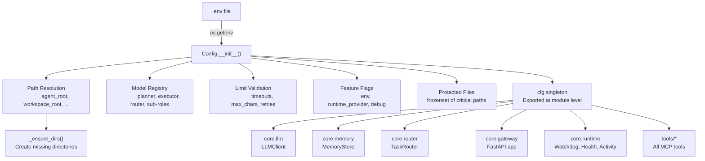

<- Back to [Config Overview](../CONFIG.md)

# 🏗️ Architecture

## 🔗 Source Code Reference

| File | Purpose |
|------|---------|
| `core/config.py` | Singleton Config class, `.env` loading, validation, path resolution |
| `core/config_validation.py` | Secondary startup validation (paths, models, timeouts) |
| `core/runtime/providers.py` | Runtime provider abstraction (LM Studio, Ollama, vLLM) |
| `core/runtime/watchdog.py` | Process watchdog (uses `runtime_provider`, `lm_studio_restart_cmd`) |
| `core/runtime/health.py` | Health check (uses paths, models, LM Studio URL) |
| `core/llm_backend/client.py` | LLMClient (uses `model_registry`, timeouts) |
| `core/memory_backend/store.py` | `MemoryStore` class (uses `memory_chroma_path`, tuning params) — **not** "ChromaDBMemory" |
| `core/memory_backend/budget.py` | Cognitive context budgeting (uses `max_context_tokens`) |
| `core/net/security.py` | SSRF allowlist enforcement (uses `allowed_internal_hosts`) — also where the first-use warning actually lives, not `config.py` |
| `core/sleep_learn/config.py` | Sleep & Learn constants (uses `SLEEP_*` env vars) |
| `core/gateway_backend/factory.py` | Gateway app factory (uses gateway config) |

---

## 🌳 Module Tree

```text
core/config.py
├── Config class — singleton, .env loading, validation, path resolution
├── _ensure_dirs() — create missing directories at startup
├── resolve_agent_path() — resolve relative paths within agent_root
├── resolve_workspace_path() — resolve relative paths within workspace_root (raises PermissionError on traversal)
├── is_protected() — check against protected files frozenset
└── model_registry — per-role model + provider + timeout config dict

core/config_validation.py
├── validate_config() — secondary startup validation pass
├── check_critical_paths() — verify required directories exist
└── check_required_models() — verify required models are configured
```

---

## 🔀 How Configuration Flows



---

## 💡 Key Design Decisions

- **Singleton pattern** — One `cfg` instance, imported everywhere. Never instantiate `Config` directly.
- **Fail-fast validation** — Invalid config raises at import time. Server never starts with bad settings.
- **Pathlib throughout** — All paths are `pathlib.Path` objects. Cross-platform by default.
- **No hardcoding** — Model names, paths, and limits all come from environment variables.
- **Tiered model roles** — Larger models for complex reasoning, smaller models for fast classification and lightweight tasks.
- **Secondary validation** — `core/config_validation.py` runs a second pass at startup to verify critical paths and required models.

---

## 🧪 Testing

```powershell
# Run all config tests
.\venv\Scripts\python tests/core/config/ -W error --tb=short -v

> **Note:** Ensure `pytest` resolves to your venv. If not, use `python -m pytest` or the full venv path (`venv\Scripts\pytest.exe` on Windows, `venv/bin/pytest` on Unix).

# Validate config without starting the server
python -c "from core.config_validation import validate_config; validate_config()"

# Check what the gateway sees
python -c "from core.runtime.health import get_health; import json; print(json.dumps(get_health(), indent=2))"

# Verify model registry
python -c "from core.config import cfg; [print(f'{k}: {v[\"model\"]}') for k, v in cfg.model_registry.items()]"
```

**Test file layout:**
```text
tests/core/config/
├── conftest.py
├── test_config_paths.py
├── test_config_models.py
├── test_config_validation.py
├── test_config_limits.py
└── test_config_protected.py
```

---

*Last updated: 2026-07-03. See [API.md](API.md) for model tiers and config reference, [CHANGELOG.md](CHANGELOG.md) for version history, [INSTRUCTIONS.md](INSTRUCTIONS.md) for AI editing rules.*
