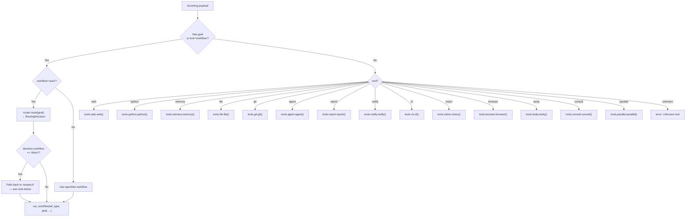
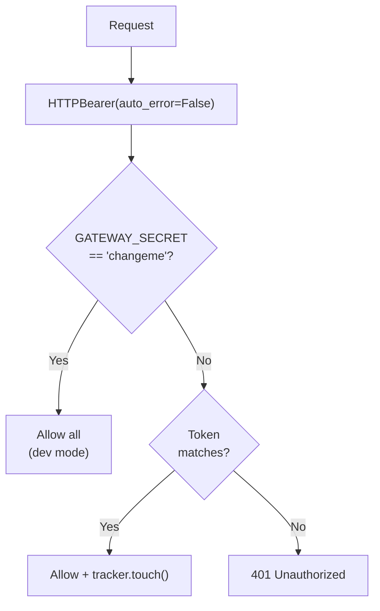

<- Back to [Gateway Overview](../GATEWAY.md)

# 📝 API Reference

## 🔧 API Overview

The Gateway exposes a REST API with ~16 endpoints across 6 route modules. Only 3 endpoints (`POST /task`, `GET /result/{id}`, `POST /chat`) declare a Pydantic `response_model`. All other endpoints return raw `dict` or `Response` objects.

**Base URL:** `http://{GATEWAY_HOST}:{GATEWAY_PORT}` (default: `http://127.0.0.1:8000`)

**Auth:** Bearer token via `Authorization: Bearer {GATEWAY_SECRET}` header. Required on all endpoints except `/health` and `/version`.

---

## 📡 Endpoints

### Task Submission (Async)

#### `POST /task` — Submit Async Task

```bash
curl -X POST http://localhost:8000/task   -H "Authorization: Bearer $GATEWAY_SECRET"   -H "Content-Type: application/json"   -d '{"goal": "Research ChromaDB best practices", "workflow": "auto"}'
```

**Response (`TaskSubmitResponse`):**
```json
{
  "trace_id": "abc-123-def",
  "status": "submitted",
  "poll_url": "/result/abc-123-def"
}
```

**Request Body (`TaskRequest`):**

| Field | Type | Default | Description |
|-------|------|---------|-------------|
| `goal` | `str?` | `null` | Task description (triggers workflow routing) |
| `workflow` | `str?` | `"auto"` | Workflow type (`auto`, `research`, `data`, `autocode`) |
| `tool` | `str?` | `null` | Direct tool name (bypasses workflow) |
| `action` | `str?` | `null` | Tool action |
| `params` | `dict?` | `null` | Tool-specific parameters |
| `platform` | `str?` | `"api"` | Source platform identifier |
| `user` | `str?` | `null` | User identifier |

**Flow:**
1. Validate request via Pydantic
2. Create trace via `tracer.new_trace()`
3. Store task in SQLite (`store._store_task()`)
4. Submit to `task_runner.run_background_task()` (300s timeout)
5. Return immediately with `trace_id` and `poll_url`

---

#### `GET /result/{trace_id}` — Poll for Result

```bash
curl -H "Authorization: Bearer $GATEWAY_SECRET"   http://localhost:8000/result/abc-123-def
```

**Response (`TaskResultResponse`):**
```json
{
  "trace_id": "abc-123-def",
  "status": "success",
  "result": {"summary": "ChromaDB best practices include..."},
  "error": null,
  "elapsed": 12.3
}
```

**Status values:** `pending` → `running` → `success` | `failed` | `unknown`

**Fallback:** If task not found in SQLite, checks in-memory tracer for traces that completed before the store was updated.

---

### Chat (Synchronous)

#### `POST /chat` — Synchronous Chat

```bash
curl -X POST http://localhost:8000/chat   -H "Authorization: Bearer $GATEWAY_SECRET"   -H "Content-Type: application/json"   -d '{"message": "What is ChromaDB?"}'
```

**Response (`ChatResponse`):**
```json
{
  "trace_id": "abc-123-def",
  "status": "success",
  "result": {"summary": "ChromaDB is an open-source vector database..."},
  "platform": "api"
}
```

**Request Body (`ChatRequest`):**

| Field | Type | Required | Description |
|-------|------|----------|-------------|
| `message` | `str` | ✅ Yes | User message (becomes the goal) |
| `platform` | `str?` | No (default `"api"`) | Source platform |
| `user` | `str?` | No | User identifier |

> ⚠️ `ChatResponse.status` now propagates the inner dispatch result's `status` field instead of hardcoding `"success"`. A dispatch that returns `{"status": "error", "error": "Unknown tool: 'xyz'"}` now correctly surfaces `"status": "error"` at the top level.

**Use `/task` for long-running workflows.** `/chat` blocks until completion.

---

### Health & System

| Endpoint | Auth | Description |
|----------|------|-------------|
| `GET /health` | No | Full health check (dirs, LM Studio, ChromaDB, models) |
| `GET /health/autocode` | Bearer | Autocode-specific health (optional `?deep=true` for LM Studio probe) |
| `GET /health/circuit-breakers` | Bearer | LLM circuit breaker states per **role** (gated behind `cfg.enable_metrics_endpoint`) |
| `GET /health/models` | Bearer | Check if required models are loaded in LM Studio |
| `GET /version` | No | Git commit, branch, environment |
| `GET /tools` | Bearer | List of available tools |
| `GET /memory/stats` | Bearer | ChromaDB collection counts and sizes |

> ⚠️ **Known gap:** `/tools`' static fallback list is still `["web", "python", "file", "git", "vision", "memory", "agent", "notify", "report", "workflow"]` — missing `cli`, `browser`, `tavily`, `consult`, `parallel`. The dispatcher *can* route to all 14 tools; this fallback list just doesn't know about the 5 newest ones. Only matters when the registry hasn't populated yet (e.g. the gateway process started before `register_all_tools()` ran).

#### Health Response

```json
{
  "status": "healthy",
  "timestamp": 1718820000,
  "env": "development",
  "checks": {
    "dir_agent_root": {"status": "ok", "path": "D:/mcp/agent"},
    "lm_studio": {"status": "ok", "url": "http://localhost:1234/v1"},
    "chromadb": {"status": "ok", "client": "initialized"},
    "models": {
      "planner": {"status": "ok", "model": "gemma-4-e2b-it@q5_k_s"},
      "executor": {"status": "ok", "model": "gemma-2-2b-it"}
    }
  }
}
```

#### Circuit Breaker Monitoring

> ⚠️ This endpoint returns `{"status": "ok", "breakers": null}` by default — `llm.circuit_breaker_states` returns `None` unless `cfg.enable_metrics_endpoint` is truthy. When enabled, keys are **role names** (`"planner"`, `"executor"`), not model identifiers, and the field is `failure_count`, not `failures`.

```json
{
  "status": "ok",
  "breakers": {
    "planner": {"state": "closed", "failure_count": 0, "timeout_seconds": 180, "time_since_last_failure": 0.0},
    "executor": {"state": "half-open", "failure_count": 3, "timeout_seconds": 120, "time_since_last_failure": 121.4}
  }
}
```

---

### Telemetry

| Endpoint | Auth | Content-Type | Description |
|----------|------|-------------|-------------|
| `GET /metrics` | Bearer | `text/plain` (Prometheus) | Node durations, task statuses, TDD iterations, LLM tokens |
| `GET /autocode/graph` | Bearer | `text/plain` (Mermaid) | Autocode state machine flowchart |

---

### Traces

| Endpoint | Auth | Description |
|----------|------|-------------|
| `GET /traces` | Bearer | List recent traces (default limit: 10, configurable via `?limit=N`) |
| `GET /traces/{trace_id}` | Bearer | Full execution timeline for a specific trace |

**Trace retrieval priority:**
1. In-memory store (last 200 traces, fast)
2. JSONL disk scan (last 14 days, slow)

---

### Reports & Logs

| Endpoint | Auth | Content-Type | Description |
|----------|------|-------------|-------------|
| `GET /api/reports` | Bearer | `application/json` | JSON array of all reports with metadata |
| `GET /reports/{trace_id}/` | Bearer | `text/html` | HTML directory listing of trace files |
| `GET /reports/{trace_id}/{filename}` | Bearer | Various | Serve specific report file |
| `GET /logs/` | Bearer | `text/html` | HTML directory listing of log files |
| `GET /logs/{filename}` | Bearer | `text/plain` | Serve specific log file |

**Security:**
- All file paths resolved and checked to stay within `workspace/reports/` or `logs/agent/` — but via **two different mechanisms**, not one unified check. `trace_id` (a path *segment*) is sanitized with a character whitelist (`isalnum()` or `-`/`_`, everything else replaced with `_` — this neutralizes `..` by turning it into `__`). `filename` (within a trace dir, or in `/logs/{filename}`) is checked separately via `Path.resolve().startswith()` against the parent directory.
- CSP headers on HTML responses: `default-src 'self'; script-src 'unsafe-inline' https://cdn.jsdelivr.net https://cdn.tailwindcss.com; style-src 'unsafe-inline' https://cdn.tailwindcss.com; img-src 'self' data:; frame-ancestors 'none'; connect-src 'none';`
- Cache-Control: `no-store, private` on all responses
- Log file extension whitelist: `.jsonl`, `.json`, `.txt`, `.log` — **this whitelist only applies to `/logs/{filename}`**, not `/reports/{trace_id}/{filename}`, which serves any extension (falling back to `application/octet-stream` for unrecognized types)

---

## 🔀 Dispatcher

The dispatcher (`core/gateway_backend/dispatcher.py`) routes incoming payloads to the appropriate tool or workflow.

### Routing Logic



### Direct Tool Dispatch

When `workflow="auto"` and the router decides the goal matches a direct tool pattern (`decision.workflow == "direct"`), the dispatcher extracts `decision.tool` and invokes that tool directly via `_dispatch_direct_tool()`, bypassing the workflow engine entirely. This is faster and avoids the overhead of a full research workflow for simple tasks.

**Fallback behavior:** If `decision.tool` is missing, empty, or not in the known tool map, the dispatcher logs a `tracer.warning()` and falls back to `workflow="research"`. This fallback is now visible in traces — it is no longer silent.

```python
# Example: router decides "read config.py" → direct file tool
decision = router.route("read config.py", trace_id=trace_id)
# decision.workflow == "direct", decision.tool == "file"
# → dispatcher calls tools.file.file(action="read", path="config.py")
```

### Tool List

| Tool | Import | Description |
|------|--------|-------------|
| `web` | `tools.web.web()` | Web scraping, search |
| `python` | `tools.python.python()` | Python code execution |
| `memory` | `tools.memory.memory()` | ChromaDB read/write |
| `file` | `tools.file.file()` | File operations |
| `git` | `tools.git.git()` | Git operations |
| `agent` | `tools.agent.agent()` | Agent delegation |
| `report` | `tools.report.report()` | Report generation |
| `notify` | `tools.notify.notify()` | Notifications |
| `cli` | `tools.cli.cli()` | CLI command execution |
| `vision` | `tools.vision.vision()` | Image analysis |
| `browser` | `tools.browser.browser()` | Browser automation |
| `tavily` | `tools.tavily.tavily()` | AI-powered search |
| `consult` | `tools.consult.consult()` | Cross-model consultation |
| `parallel` | `tools.parallel.parallel()` | Concurrent tool fan-out |
| `workflow` | `workflows.base.run_workflow()` | Multi-step workflows |

**All imports are lazy** (inside the function) to avoid circular imports and reduce startup cost.

---

## 🔐 Authentication & Security

### Bearer Token Auth



> The "warn loudly to stderr" behavior for dev-mode-with-default-secret happens **once, at startup**, inside `create_app()` — not on every individual request. `check_auth()` itself just checks the token; it doesn't re-print a warning per call.

**Every auth check also calls `tracker.touch()`** to update idle detection for background daemons — this happens unconditionally, before the secret check, regardless of auth outcome.

### Security Guards

| Guard | Condition | Behavior |
|-------|-----------|----------|
| **Default secret in production** | `GATEWAY_SECRET == "changeme"` AND `ENV != "dev"` | **Hard stop** — `SystemExit(1)` |
| **Default secret in dev** | `GATEWAY_SECRET == "changeme"` AND `ENV == "dev"` | Warning to stderr, continue |
| **Rate limit: /chat** | 30 requests/minute per IP | 429 Too Many Requests |
| **Rate limit: /task** | 60 requests/minute per IP | 429 Too Many Requests |
| **Payload limit** | POST/PUT/PATCH > `GATEWAY_MAX_BODY_MB` | 413 Payload Too Large |
| **Path traversal** | Report/log serving | 403 Forbidden |
| **File extension** | Log serving | 400 if not `.jsonl/.json/.txt/.log` |

---

## 📊 SQLite Task Store

The async task store (`core/gateway_backend/store.py`) persists task state for polling.

### Schema

```sql
CREATE TABLE tasks (
    trace_id  TEXT PRIMARY KEY,
    status    TEXT NOT NULL DEFAULT 'pending',
    submitted REAL NOT NULL,
    completed REAL,
    result    TEXT,
    error     TEXT,
    payload   TEXT
);
```

### Configuration

| Setting | Value | Purpose |
|---------|-------|---------|
| Path | `{memory_root}/gateway_tasks.db` | SQLite database location |
| Journal mode | WAL | Write-ahead logging for concurrency |
| Busy timeout | 5000ms | Wait before SQLITE_BUSY error |
| WAL checkpoint | 1000 pages | Prevents unbounded `.wal` growth |
| Thread safety | `check_same_thread=False` | Cross-thread access |
| Lock | `threading.Lock()` | Global write lock |

### Task Lifecycle

```mermaid
graph LR
    A["POST /task<br/>_store_task()"] --> B["pending"]
    B --> C["_update_task('running')"]
    C --> D["running"]
    D --> E["dispatcher.dispatch()"]
    E -->|Success| F["_update_task('success', result)"]
    E -->|Error| G["_update_task('failed', error)"]
    E -->|Timeout (300s)| H["_update_task('failed', 'timeout')"]
    F --> I["Terminal state"]
    G --> I
    H --> I
```

---

## 🔧 Error Handling

### Centralized Exception Handlers

Routes contain **zero** `try/except` boilerplate for tool execution. If a tool fails, the route raises a domain exception. Global handlers in `factory.py` catch these:

| Exception | HTTP Status | When |
|-----------|-------------|------|
| `TaskNotFoundError` | 404 | `trace_id` not found in store or tracer |
| `ToolExecutionError` | 500 | Tool or workflow fails during dispatch |
| `Exception` (catch-all) | 500 | Any unhandled exception |

### Response Format

All error responses follow a consistent schema:

```json
{
  "error": "Task not found",
  "trace_id": "abc-123-def",
  "detail": "trace_id 'abc-123-def' not found"
}
```

---

## 🔒 Pydantic Contract Locking

> ⚠️ The claim "all endpoints use `response_model`" does not hold. Verified directly against every route file: only `POST /task`, `GET /result/{id}`, and `POST /chat` actually declare a `response_model`. Every other endpoint — `/version`, `/health`, `/health/autocode`, `/health/circuit-breakers`, `/health/models`, `/tools`, `/memory/stats`, `/metrics`, `/autocode/graph`, `/traces`, `/traces/{id}`, `/api/reports`, `/reports/*`, `/logs/*` — returns either a raw `dict` or a raw `Response`/`FileResponse`/`HTMLResponse` object with no Pydantic contract at all. A refactor to any of those endpoints **could** silently strip a field a client depends on, with nothing in FastAPI to catch it.

| Model | Endpoint | Fields |
|-------|----------|--------|
| `TaskSubmitResponse` | `POST /task` | `trace_id`, `status="submitted"`, `poll_url` |
| `TaskResultResponse` | `GET /result/{id}` | `trace_id`, `status`, `result`, `error`, `elapsed` |
| `ChatResponse` | `POST /chat` | `trace_id`, `status`, `result`, `error`, `platform` |

This guarantees contract stability for these three endpoints only — not the other ~13.

> **Suggestion:** Either add `response_model`s for the remaining endpoints where the shape is stable enough to lock down (e.g. `/version`, `/tools`, `/memory/stats`), or explicitly document which endpoints are intentionally unlocked (e.g. `/health` delegates to `core/runtime/health.py` and may evolve independently) so it's a documented decision rather than an undocumented gap.

---

*Last updated: 2026-07-18. See [ARCHITECTURE.md](ARCHITECTURE.md) for file maps and design decisions, [CHANGELOG.md](CHANGELOG.md) for version history, [INSTRUCTIONS.md](INSTRUCTIONS.md) for AI editing rules.*
