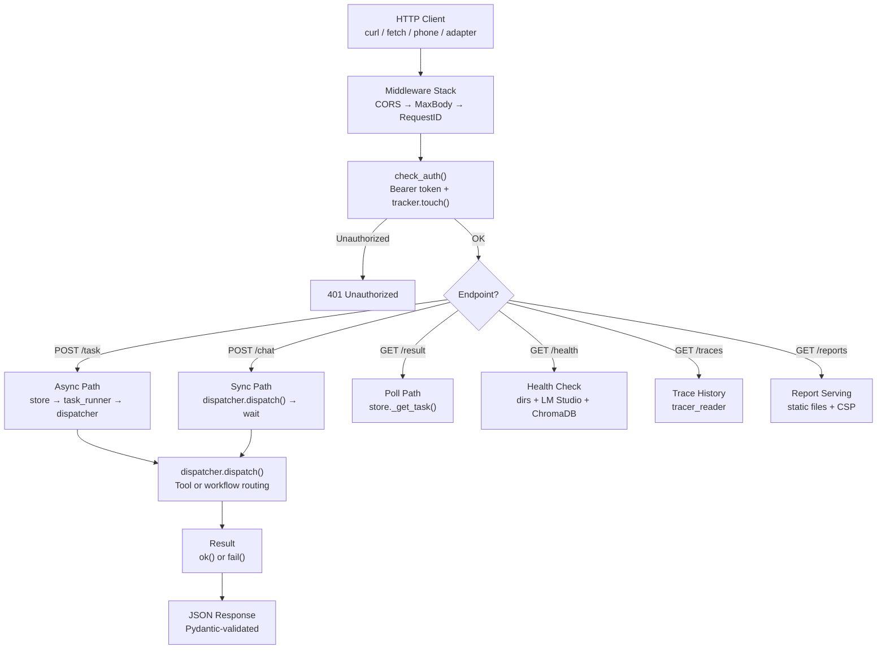
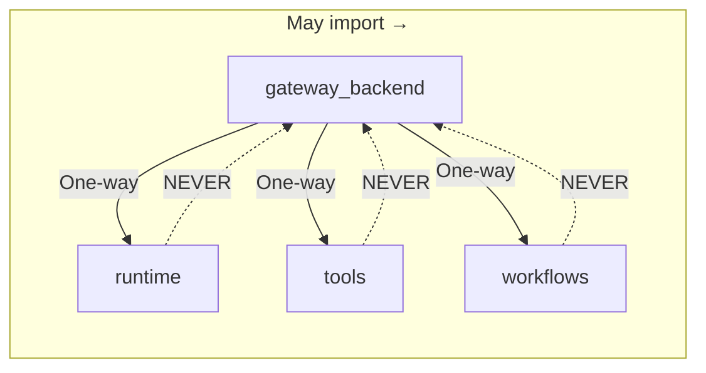
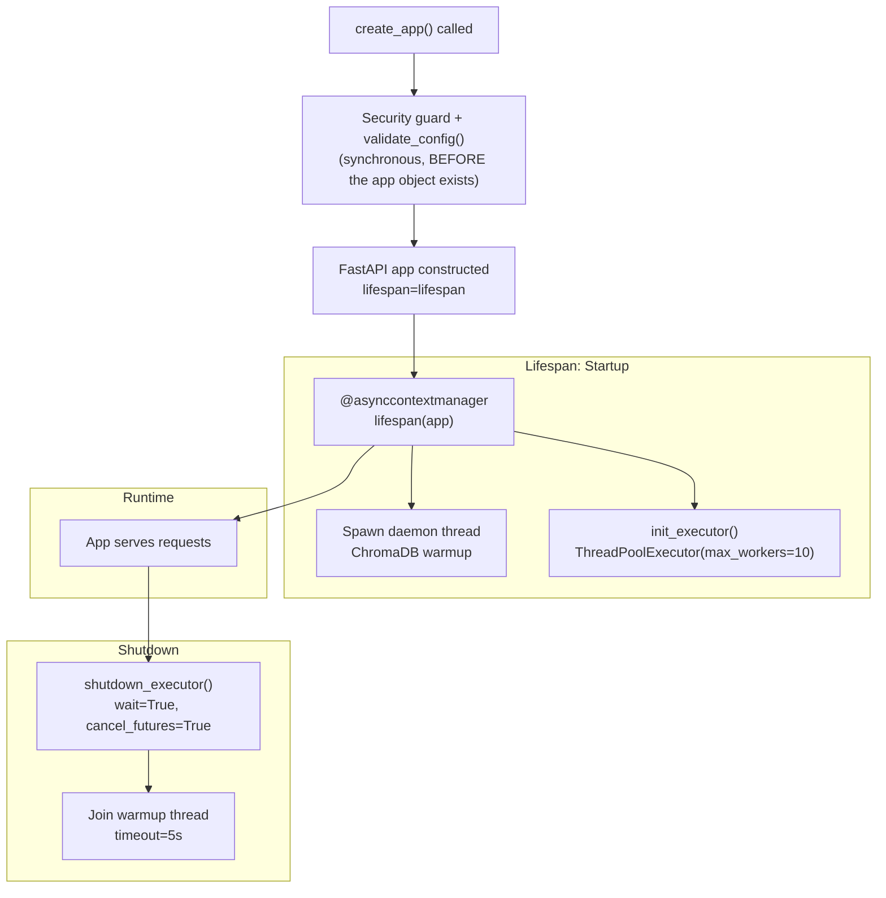

<- Back to [Gateway Overview](../GATEWAY.md)

# 🏗️ Architecture

## 🔗 Source Code Reference

| File | Purpose |
|------|---------|
| `core/gateway.py` | Thin facade — imports `create_app`, exposes `app` |
| `core/gateway_backend/factory.py` | App factory, lifespan, middleware, exception handlers |
| `core/gateway_backend/dependencies.py` | Auth (`check_auth`), DI providers |
| `core/gateway_backend/dispatcher.py` | Tool/workflow routing |
| `core/gateway_backend/exceptions.py` | `TaskNotFoundError`, `ToolExecutionError` |
| `core/gateway_backend/models.py` | Pydantic request/response schemas |
| `core/gateway_backend/store.py` | SQLite task store |
| `core/gateway_backend/routes/tasks.py` | `POST /task`, `GET /result/{id}` |
| `core/gateway_backend/routes/chat.py` | `POST /chat` |
| `core/gateway_backend/routes/health.py` | `/health`, `/health/*`, `/version`, `/tools`, `/memory/stats` |
| `core/gateway_backend/routes/metrics.py` | `/metrics`, `/autocode/graph` |
| `core/gateway_backend/routes/traces.py` | `/traces`, `/traces/{id}` |
| `core/gateway_backend/routes/reports.py` | `/reports/*`, `/logs/*`, `/api/reports` |
| `core/runtime/task_runner.py` | Background task executor |
| `core/runtime/activity_tracker.py` | Idle detection (`tracker.touch()`) |
| `core/config.py` | Gateway host, port, secret, CORS, body limit |
| `core/tracer.py` | Trace logging |
| `core/metrics.py` | Prometheus metrics |

---

## 🌳 Module Tree

```text
core/gateway.py                     # Thin facade (~10 lines)
core/gateway_backend/
├── factory.py                      # FastAPI creation, lifespan, middleware, exception handlers
├── dependencies.py                 # Auth (Bearer token), DI providers
├── dispatcher.py                   # Tool/workflow routing from HTTP payloads
├── exceptions.py                   # TaskNotFoundError, ToolExecutionError
├── models.py                       # Pydantic request/response schemas
├── store.py                        # SQLite task store for async polling
└── routes/
    ├── tasks.py                    # POST /task, GET /result/{trace_id}
    ├── chat.py                     # POST /chat (synchronous)
    ├── health.py                   # /health, /version, /tools, /memory/stats, /health/*
    ├── metrics.py                  # /metrics (Prometheus), /autocode/graph (Mermaid)
    ├── traces.py                   # /traces, /traces/{trace_id}
    └── reports.py                  # /reports/*, /logs/*, /api/reports

core/runtime/
├── task_runner.py                  # ThreadPoolExecutor & timeout monitoring
└── activity_tracker.py             # Idle detection (tracker.touch() on every request)
```

---

## 🔀 Request Flow



---

## 🔀 Domain Boundaries



| Rule | Description |
|------|-------------|
| **One-way dependencies** | `gateway_backend` may import from `runtime`, `tools`, `workflows`. None may import from `gateway_backend`. |
| **No HTTP in Runtime** | `task_runner.py` knows nothing about FastAPI, HTTP, or SQLite. It only accepts Python callables. |
| **No App State Leakage** | Routes never use `request.app.state.foo`. All shared resources injected via `Depends()`. |
| **Pure Functions for Storage** | `store.py` uses per-operation connections + global thread lock. No open connections. |

---

## 🔄 Lifecycle & Middleware Stack

### Startup / Shutdown



> ⚠️ `validate_config()` is **not** a lifespan startup step — it runs synchronously inside `create_app()`, before the `FastAPI` instance (and therefore the lifespan context manager) is even constructed.

### Middleware Order

| Order | Middleware | Config | Description |
|-------|-----------|--------|-------------|
| 1 | **CORS** | `GATEWAY_CORS_ORIGINS` (default `["*"]`) | Cross-origin request handling |
| 2 | **MaxBodySize** | `GATEWAY_MAX_BODY_MB` (default `10`) | Rejects POST/PUT/PATCH > limit with 413 |
| 3 | **RequestID** | Auto-generated UUID | Injects `request.state.trace_id`, echoes `X-Request-ID` header |

### ChromaDB Warmup

At startup, the gateway spawns a daemon thread that calls `recall("warmup", top_k=1)` to force ChromaDB to load the embedding model. This prevents 30-60s cold-start latency on the first real memory call.

| Behavior | Implementation |
|----------|---------------|
| Thread | Daemon thread (non-blocking) |
| Timeout | 60s hard timeout via `ThreadPoolExecutor` |
| On timeout | Proceeds in "degraded mode", logs warning |
| On success | Logs elapsed time to stderr |

> ⚠️ **Note:** The warmup is non-blocking — the server starts accepting requests before warmup completes. Early requests may hit cold ChromaDB.

---

## 💡 Key Design Decisions

- **Thin facade** — `core/gateway.py` is the only file scanned by the tool registry. All implementation lives in `core/gateway_backend/`. The facade imports `create_app` and exposes `app`.
- **One-way dependencies** — `gateway_backend` may import from `runtime`, `tools`, `workflows`. None may import from `gateway_backend`. This prevents circular dependencies and keeps the HTTP layer isolated.
- **No HTTP in Runtime** — `task_runner.py` accepts Python callables only. It knows nothing about FastAPI, HTTP, or SQLite. This keeps the runtime reusable outside the gateway.
- **No App State Leakage** — Routes never use `request.app.state.foo`. All shared resources (store, dispatcher, runner) are injected via `Depends()`.
- **Pure Functions for Storage** — `store.py` opens a new SQLite connection for every operation, protected by a global `threading.Lock`. No long-lived connections.
- **SQLite connection-per-call** — Each `_store_task()`, `_update_task()`, and `_get_task()` call opens a new connection, executes, commits, and closes. Under concurrent load this creates connection churn, but the global lock serializes all operations anyway. *(Consider using a single long-lived connection protected by the existing lock.)*
- **ChromaDB warmup is non-blocking** — The lifespan starts `_warmup_memory()` in a daemon thread and yields immediately. Early requests may hit cold ChromaDB. *(Consider blocking before yield or adding a readiness check that returns 503 until warmup completes.)*
- **uvicorn.run() string reference** — `gateway.py` uses `uvicorn.run("core.gateway:create_app", ...)`. This works because `gateway.py` imports `create_app` from `gateway_backend.factory`, binding it as an importable attribute. If a future refactor removed that bare import, the string reference would silently break. *(Consider adding an explicit `__all__ = ["app", "create_app"]` with a comment explaining why both are needed, or a test asserting `core.gateway.create_app` is importable.)*

---

## 🧪 Testing

```powershell
# Run all gateway tests
.\venv\Scripts\python tests/core/gateway/ -W error --tb=short -v

> **Note:** Ensure `pytest` resolves to your venv. If not, use `python -m pytest` or the full venv path (`venv\Scripts\pytest.exe` on Windows, `venv/bin/pytest` on Unix).
```

> ⚠️ All gateway tests live in a single file: `tests/core/gateway/test_gateway.py`, organized internally into four classes: `TestWarmupMemory`, `TestSQLiteTaskStore`, `TestGatewayEndpoints`, `TestReportRoutes`.

### Testing Layers

| Layer | What | How | Monkeypatch? |
|-------|------|-----|-------------|
| **Layer 1: Pure Unit** | `store.py` directly (`TestSQLiteTaskStore`) | Isolated `tmp_path` SQLite databases | No |
| **Layer 2: Route Tests** | All route modules (`TestGatewayEndpoints`) | FastAPI `TestClient` + `app.dependency_overrides` | **Forbidden for route internals/dependencies** — but the test fixture itself *does* use `monkeypatch.setattr()` to silence heavy startup side-effects (`_warmup_memory`, `validate_config`) before constructing the app. The "no monkeypatching" rule is about route behavior, not startup mocking. |
| **Layer 3: Integration** | Full lifespan | Real dependency wiring, startup/shutdown | No |

**Key rule:** Route *behavior* tests use `app.dependency_overrides` to inject mock stores, dispatchers, and runners — never `unittest.mock.patch` on route internals. Monkeypatching heavy, unrelated startup side-effects to keep tests fast is a separate, accepted practice.

---

*Last updated: 2026-07-18. See [API.md](API.md) for endpoint details, [CHANGELOG.md](CHANGELOG.md) for version history, [INSTRUCTIONS.md](INSTRUCTIONS.md) for AI editing rules.*
