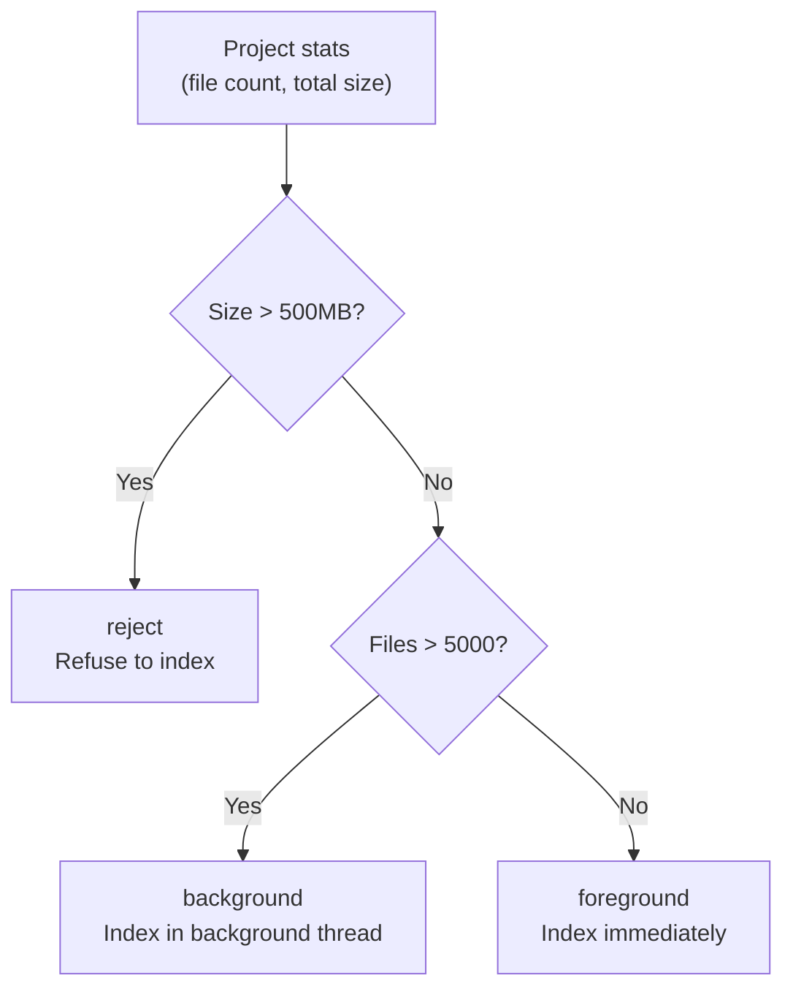
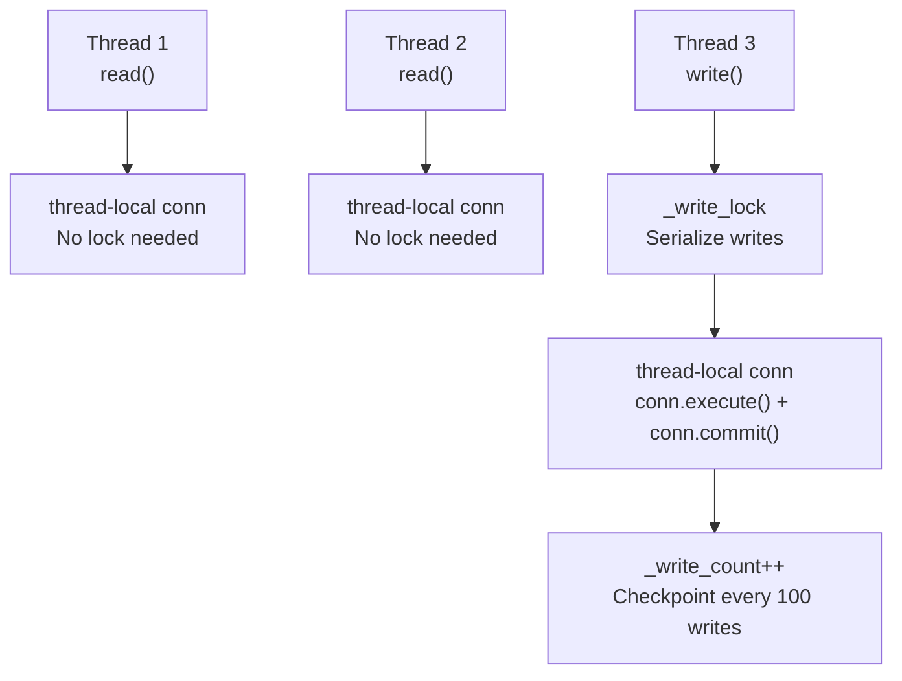
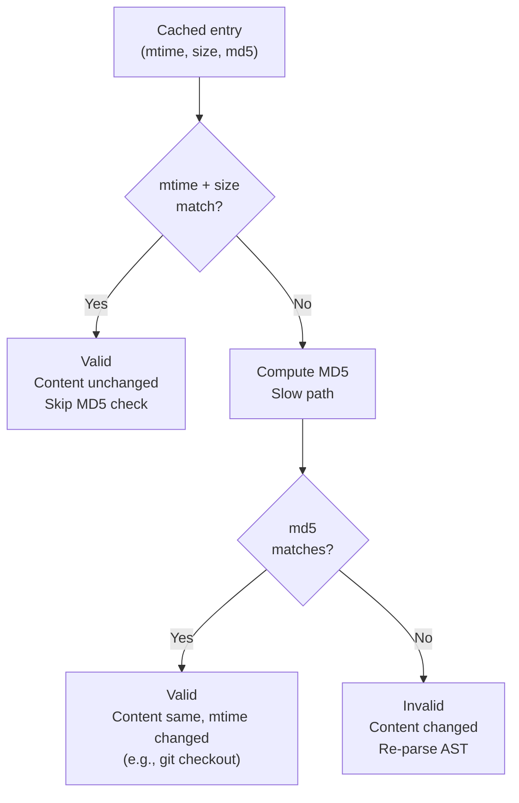
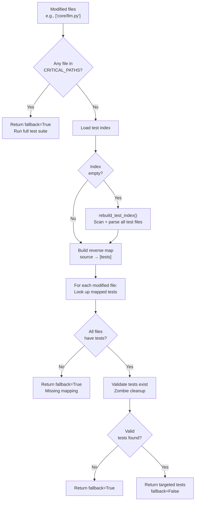

<- Back to [Knowledge Graph Overview](../KGRAPH.md)

# 📝 API Reference

## 🔧 API Overview

The Knowledge Graph exposes a public API through `core/kgraph/__init__.py` for project isolation, AST parsing, graph storage, dependency queries, test mapping, and vector collections.

---

## 📦 Public API

### From `__init__.py`

```python
from core.kgraph import (
    ProjectManager,              # Project isolation and configuration
    GraphStore,                  # SQLite graph storage
    get_project_vector_collection,  # Project-specific ChromaDB
    parse_file_dependencies,     # Async AST parsing
    clear_ast_cache,             # Clear LRU cache
    load_test_index,             # Load persistent test index
    save_test_index,             # Save persistent test index
    get_targeted_tests,          # Source → test mapping (main entry point)
    rebuild_test_index,          # Force full index rebuild
    CRITICAL_PATHS,              # Files that trigger full test suite
    get_dependencies,            # Outgoing edge query
    get_callers,                 # Incoming edge query
)
```

---

## 💡 Common Usage Patterns

### Find tests for modified files (autocode workflow)

```python
from core.kgraph import get_targeted_tests, ProjectManager

pm = ProjectManager("/path/to/project")
result = await get_targeted_tests(
    project_path=pm.path,
    modified_files=["core/llm.py", "core/config.py"],
    project_id=pm.project_id,
)

if result["fallback"]:
    # Run full test suite
    run_all_tests()
else:
    # Run only targeted tests
    for test in result["tests"]:
        run_test(test)
```

### Find relevant files for a goal

```python
from core.kgraph import find_relevant_files

files = find_relevant_files("/path/to/project", "fix timeout in web scraper", top_k=5)
# Returns: ["tools/web.py", "tools/browser_ops/actions.py", ...]
```

### Query dependency graph

```python
from core.kgraph import get_dependencies, get_callers

# What does core/llm.py import?
deps = get_dependencies("/project", "core/llm.py")

# What imports core/config.py?
callers = get_callers("/project", "core/config.py")
```

---

## ⚡ Components

### 1. Project Manager (`project.py`)

Manages physical isolation and project-level configuration. Each project has a unique `project_id` derived from its absolute path hash.

[v1.7] Two new methods:

- **`get_skip_dirs()`** (classmethod) — returns the skip-dirs frozenset, merging `_DEFAULT_SKIP_DIRS` with the comma-separated `cfg.understand_skip_dirs` (env: `UNDERSTAND_SKIP_DIRS`). The class constant `SKIP_DIRS` is kept as a backward-compat alias to `_DEFAULT_SKIP_DIRS`.
- **`get_embedding_model()`** (instance method) — returns the embedding model for this project, checking `.understand/config.json` for an override (`{"embedding_model": "..."}`) before falling back to `cfg.embedding_model`.

#### Project Types

| Type | `source_root` | `artifact_root` | Use Case |
|------|---------------|-----------------|----------|
| **Agent root** | `agent_root` | `agent_root/.understand` | Indexing the agent's own codebase |
| **Workspace project** | `project/code` | `project/.understand` | Indexing user projects in workspace |

#### Indexing Modes

The `get_indexing_mode()` method determines how to handle a project based on its size:



| Mode | Condition | Behavior |
|------|-----------|----------|
| `foreground` | ≤ 5,000 files AND ≤ 500MB | Index synchronously (fast enough) |
| `background` | > 5,000 files AND ≤ 5000MB | Index in background thread |
| `reject` | > 500MB | Refuse to index (too large) |

#### Hard Limits

| Limit | Value | Purpose |
|-------|-------|---------|
| `MAX_FILES_FOR_FOREGROUND` | 5,000 | Prevent blocking on large projects |
| `MAX_FILE_SIZE_BYTES` | 1MB | Skip oversized files during indexing |
| `MAX_TOTAL_PROJECT_SIZE_MB` | 500 | Reject projects that are too large |

#### Startup Cleanup

On `ensure_initialized()`, the project manager runs `KGCleanup.cleanup_project()` to:
- Delete cache files older than 30 days
- Force SQLite WAL checkpoint to prevent unbounded growth

---

### 2. AST Parser (`ast_parser.py`)

Dedicated, bounded AST parsing to prevent event loop blocking and memory leaks.

#### Design

```mermaid
graph TD
    A["Caller<br/>(test_mapper, queries)"] --> B["parse_file_dependencies()"]
    B --> C["Read file bytes<br/>Compute MD5 hash"]
    C --> D["run_in_executor()<br/>_AST_EXECUTOR (2 workers)"]
    D --> E["_parse_file_dependencies_sync()"]
    E --> F{LRU cache hit?<br/>key=(project_id, path, md5)}
    F -->|Yes| G["Return cached frozenset"]
    F -->|No| H["ast.parse(source)"]
    H --> I["ast.walk(tree)<br/>Extract Import + ImportFrom"]
    I --> J["Return frozenset of deps"]
    J --> K["Cache result<br/>maxsize=512"]
```

#### Key Properties

| Property | Value | Rationale |
|----------|-------|-----------|
| Thread pool | `ThreadPoolExecutor(max_workers=2)` | CPU-bound work, doesn't block event loop |
| Cache | `@lru_cache(maxsize=512)` | Prevent re-parsing unchanged files |
| Cache key | `(project_id, file_path, md5_hash)` | Cross-project safe + content invalidation |
| Return type | `frozenset[str]` | Lightweight, immutable, hashable |
| Error handling | Returns `frozenset()` on `SyntaxError`, `RecursionError`, `MemoryError` | Graceful fallback for broken files |

#### Two Parsing Modes

| Mode | Function | Input | Use Case |
|------|----------|-------|----------|
| **File-based** | `parse_file_dependencies(project_id, file_path)` | File path on disk | Full project indexing |
| **String-based** | `parse_dependencies_from_string(project_id, content)` | Raw source string | Micro-updates from workflow state |

---

### 3. Graph Store (`storage.py`)

Thread-safe, WAL-enabled SQLite graph store for dependency topology.

#### Schema

```sql
CREATE TABLE nodes (
    id TEXT PRIMARY KEY,              -- "file:core/config.py"
    project_id TEXT NOT NULL,
    path TEXT NOT NULL,
    type TEXT NOT NULL,               -- "file", "module", "class", "function"
    content_hash TEXT NOT NULL,       -- MD5 of file content
    last_modified REAL,               -- File mtime for fast-path validation
    file_size INTEGER,                -- File size for fast-path validation
    metadata TEXT,                    -- JSON metadata
    updated_at REAL,
    UNIQUE(project_id, path)
);

CREATE TABLE edges (
    id TEXT PRIMARY KEY,              -- MD5 of "source->target"
    project_id TEXT NOT NULL,
    source_id TEXT NOT NULL,          -- "file:core/llm.py"
    target_id TEXT NOT NULL           -- "core.config" or "file:core/config.py"
);
```

#### Indexes

| Index | Purpose |
|-------|---------|
| `idx_nodes_project` | Fast project-scoped node lookups |
| `idx_nodes_path` | Fast path-based node lookups |
| `idx_nodes_project_path` | Compound: project + path (unique constraint) |
| `idx_edges_source` | Fast dependency lookups (outgoing edges) |
| `idx_edges_target` | Fast caller lookups (incoming edges) |

#### Thread Safety Model



| Operation | Lock | Connection | Notes |
|-----------|------|------------|-------|
| `read()` | None | Thread-local | Concurrent reads are safe |
| `write()` | `_write_lock` | Thread-local | Serialized writes |
| `upsert_file_graph()` | `_write_lock` | Thread-local | Atomic node + edge update |

#### WAL Management

| Setting | Value | Purpose |
|---------|-------|---------|
| `journal_mode` | WAL | Write-ahead logging for concurrency |
| `synchronous` | NORMAL | Balance safety and performance |
| `busy_timeout` | 30000ms | Wait before SQLITE_BUSY error |
| `temp_store` | MEMORY | Fast temporary tables |
| Checkpoint frequency | Every 100 writes | Prevent WAL file bloat |
| Checkpoint mode | TRUNCATE (fallback PASSIVE) | Shrink WAL to 0 bytes |

#### Windows WAL Repair

On startup, `_repair_wal_on_windows()` checks for stale WAL artifacts (`.db-wal` exists but `.db-shm` is empty/missing) and deletes them to prevent corruption from unclean shutdowns.

#### Singleton Pattern

`GraphStore` uses `__new__` with a class-level lock to ensure one instance per database path:

```python
store1 = GraphStore(Path("project/.understand/kg.db"))
store2 = GraphStore(Path("project/.understand/kg.db"))
assert store1 is store2  # Same instance
```

#### [v1.6] Stale-index Cleanup Methods

Two new methods added to support understand v1.6's `node_discover_files` Phase 2 (deleting graph entries for files that were indexed but have since been deleted from disk):

```python
# Get all file paths currently stored for a project (for orphan computation).
paths = store.get_all_file_paths(project_id)
# → ["core/config.py", "src/utils.py", ...]

# Delete a file's node + ALL its edges (outgoing + incoming).
store.delete_file_entry(project_id, "core/config.py")
# → deletes node + edges where source_id = "file:core/config.py"
#   + edges where target_id ∈ {"core/config.py", "file:core/config.py", "core.config"}
```

**`delete_file_entry` deletes 3 target_id forms** because `parse_and_store` stores edges with target_ids that vary by importer language:

| target_id form | Example | Language |
|----------------|---------|----------|
| path verbatim | `core/config.py` | Python file-path form, JS/TS relative imports |
| `file:{path}` (node-id form) | `file:core/config.py` | Stored by `upsert_file_graph` as the source_id |
| Python module-name form | `core.config` | Python `from core.config import cfg` |

DELETEs that match nothing are no-ops, so over-deletion is harmless. Under-deletion would leave orphaned edges whose target no longer resolves.

---

### 4. Graph Queries (`queries.py`)

Read-only queries for the knowledge graph.

#### `find_relevant_files(project_path, query, top_k=5)`

Finds files whose paths match keywords in a natural language query.

```python
files = find_relevant_files("/project", "fix the timeout in web scraper")
# Returns: ["tools/web.py", "tools/browser_ops/actions.py", "tests/tools/web/test_web_scrape.py"]
```

**How it works:**
1. Extract meaningful keywords (≥3 chars, skip stop words)
2. SQL `LIKE` query against node paths
3. Score by keyword match count
4. Return top-K by relevance

**Stop words filtered:** `the, a, an, and, or, for, in, on, at, to, of, is, it, this, that, fix, bug, issue, add, create, implement, write, update, change, modify, refactor, code`

#### `get_dependencies(project_path, file_path)`

Returns files that the given file imports (outgoing edges).

[v1.4.1] Multi-language support — returns target_ids matching ANY supported extension (not just `.py`). Also keeps raw module-name forms (e.g. `react`, `fmt`, `std::collections::HashMap`) since they're useful for cross-language understanding + impact analysis even when they don't map 1:1 to a file.

[v1.8] Cross-language import resolution — JS/TS relative imports (`./foo`, `../utils`) are now resolved to up to 13 candidate file paths at parse time (by `parse_and_store._resolve_import_to_file_paths`), so `get_dependencies` for a JS/TS file returns resolved paths like `src/foo.ts`, `src/foo/index.js` alongside the raw `./foo` form. The query layer itself needed NO code changes (the v1.4.1 multi-language filter already accepted any path-like target_id); it just returns richer results. Go package imports include the package short-name as a derivative (`github.com/foo/bar` → also `bar`). Rust `use` declarations include each `::`-separated segment except the last item name (`std::collections::HashMap` → also `std` + `collections`).

```python
deps = get_dependencies("/project", "core/llm.py")
# Returns: ["core/config.py", "core/tracer.py", "core/llm_backend/client.py"]
# For JS/TS files (v1.8): deps include RESOLVED file paths
#   get_dependencies("/project", "src/app.ts")
#   → ["./utils", "react", "src/utils.ts", "src/utils.tsx", "src/utils.js",
#      "src/utils/index.ts", "src/utils/index.tsx", ...]
#   (raw import "./utils" + up to 12 file-path candidates + non-relative "react" raw)
# For Go: deps may include "fmt", "os", "strings" (+ short-name derivatives)
# For Rust: deps may include "std::collections::HashMap" (+ "std", "collections")
```

#### `get_callers(project_path, file_path)`

Returns files that import the given file (incoming edges).

[v1.4.1] Multi-language support — queries BOTH the raw `file_path` (covers JS/TS/Go/Rust where imports ARE paths) AND a Python-style module-name transformation (covers Python `from core.config import ...` → stored target_id `core.config`). The transformation strips any supported extension (not just `.py`) before computing the dotted module name. For non-Python files this produces a candidate that just won't match any stored edge — harmless (SQL OR absorbs it).

```python
callers = get_callers("/project", "core/config.py")
# Returns: ["core/llm.py", "core/memory.py", "server.py"]
# For JS/TS: get_callers("/project", "app.js") matches edges whose target_id is
# "app.js", "app", or "./app" (covers default + relative imports).
```

---

### 5. Test Index (`test_index.py`)

Persistent storage for the source → test file mapping index with hybrid validation.

#### Hybrid Validation (mtime + size + MD5)



| Path | Cost | When | Result |
|------|------|------|--------|
| **Fast** | O(1) stat call | mtime + size unchanged | Skip re-parsing |
| **Slow** | O(n) MD5 hash | mtime or size changed | Check if content actually changed |
| **Full** | O(n) AST parse | MD5 changed | Re-extract dependencies |

#### Atomic Writes

Test index is saved atomically to prevent corruption on crash:

1. Write to `.tmp` file
2. Replace original with `.tmp` (atomic on NTFS + ext4)

---

### 6. Test Mapper (`test_mapper.py`)

Maps source files to their targeted tests using persistent AST indexing. This is the primary interface used by the autocode workflow.

#### `get_targeted_tests(project_path, modified_files, project_id)`

The main entry point. Determines which tests to run for a set of modified files.



#### Critical Paths (Always Full Suite)

These files have global impact — modifying any of them triggers the full test suite:

| Path | Reason |
|------|--------|
| `core/config.py` | Global configuration affects everything |
| `core/llm.py` | All LLM interactions |
| `core/memory.py` | All memory operations |
| `server.py` | MCP server entry point |
| `registry.py` | MCP tool registration |
| `core/gateway.py` | HTTP gateway |
| `core/tracer.py` | All logging and tracing |
| `main.py`, `app.py`, `manage.py`, `settings.py` | Common framework entry points |

#### Test Index Rebuild

`rebuild_test_index()` scans the test directory and builds the mapping:

1. Find all `test_*.py` and `*_test.py` files
2. For each, check if cached entry is valid (hybrid validation)
3. If invalid, parse AST to extract imports
4. Convert module imports to file paths (`core.config` → `core/config.py`)
5. Add heuristic: `test_foo.py` probably tests `foo.py`
6. Remove stale entries for deleted test files
7. Save index atomically

#### Manual Override (test_mapping.yaml)

Users can override AST-based mapping with manual rules:

```yaml
# .understand/test_mapping.yaml
core/config.py:
  - tests/test_config_edge_cases.py
  - tests/test_config_migration.py
```

Manual mappings take priority over AST-derived mappings.

---

### 6b. Tree-sitter Parser (`tree_sitter_parser.py`) — v1.2

[#4] Multi-language code parsing via tree-sitter. Replaces the Python-only `ast` parser with a unified API supporting Python, JavaScript/TypeScript, Go, and Rust.

```python
from core.kgraph.tree_sitter_parser import (
    extract_imports, extract_definitions_ts,
    get_language_for_file, is_supported, SUPPORTED_EXTENSIONS,
)

# Detect language from file extension
lang = get_language_for_file("src/app.ts")  # → "typescript"

# Extract imports (dependency edges)
deps = extract_imports(source_code, "typescript")
# → frozenset({"./utils", "react"})

# Extract definitions (for embedding chunking)
defs = extract_definitions_ts(source_code, "typescript")
# → [{"name": "foo", "type": "function", "source": "...", "line_start": 1, "line_end": 5}, ...]
```

**Supported extensions:** `.py`, `.js`, `.mjs`, `.cjs`, `.ts`, `.tsx`, `.go`, `.rs`, `.java`, `.c`, `.h`, `.cpp`, `.cc`, `.cxx`, `.hpp`, `.rb`, `.lua`, `.php`, `.scala`, `.swift`, `.kt`
**Adding a language:** 3-line change — add to `LANGUAGE_MAP`, `_IMPORT_NODE_TYPES`, `_DEFINITION_NODE_TYPES`.
**Error recovery:** Tree-sitter handles syntax errors gracefully (extracts partial definitions, unlike `ast` which drops everything).
**Backward compatibility:** `ast_parser.py` delegates to tree-sitter for Python — existing callers see no change.

---

### 7. Embeddings (`embeddings.py`) — v1.1

Tree-sitter-based code chunking + LM Studio embedding client for semantic code search.

```python
from core.kgraph.embeddings import extract_definitions, embed_texts, clear_embedding_cache

# Split Python source into top-level definitions for embedding
definitions = extract_definitions(source_code)
# → [{"name": "foo", "type": "function", "source": "def foo(): ...", "line_start": 1, "line_end": 5}, ...]

# Embed texts via LM Studio /v1/embeddings (OpenAI-compatible)
vectors = embed_texts(["def foo(): pass", "class Bar: pass"])
# → [[0.1, 0.2, ...], [0.3, 0.4, ...]]  or None if LM Studio unavailable

# [v1.7] Per-project model override (empty string falls back to cfg.embedding_model)
vectors = embed_texts(["def foo(): pass"], model="bge-large-en-v1.5-Q8")

# [v1.7] Clear the embedding cache (testing / memory management)
clear_embedding_cache()
```

**Config:** `EMBEDDING_MODEL`, `EMBEDDING_BASE_URL`, `EMBEDDING_ENABLED` (in `.env`).
**Recommended model:** All-MiniLM-L6-v2-Embedding-GGUF (q8, 25MB) in LM Studio.
**Graceful degradation:** Returns `None` on failure — callers must handle this.

**[v1.7] Embedding cache:**
- Keyed by `md5(text)` — identical texts (same source chunk seen twice, or re-embeds after a metadata change) skip the HTTP call entirely.
- Cap: 10000 entries. When exceeded, the entire cache is cleared (simplest correct behavior; an LRU would be more precise but adds complexity for rare benefit).
- `clear_embedding_cache()` empties the cache. Tests should call this between cases to avoid cross-test contamination.
- Partial cache hits: when SOME texts are cached and others aren't, only the uncached ones hit LM Studio (cached ones are merged back into the result list in their original positions).
- HTTP failures return `None` (not partial cache) — callers expect either the full list or `None`. Returning partial results would mask a real LM Studio outage.

**[v1.7] Per-project model:**
- The optional `model` parameter overrides `cfg.embedding_model`. When empty (default), uses `cfg.embedding_model` (backward compat).
- Callers with a per-project config (e.g. `ProjectManager.get_embedding_model()`) should pass it through.
- **Cache caveat:** the cache does NOT differentiate by model. If you switch models, call `clear_embedding_cache()` first to avoid returning the wrong model's vectors.

---

### 8. Vectors (`vectors.py`) — v1.1

Project-specific ChromaDB collections for code embeddings, physically isolated from the main memory system.

[v1.4.1] Signature changed: `pm: ProjectManager` (was: `project_id: str`). The ChromaDB path is now project-scoped: `{project}/.understand/chroma/` for workspace projects, `memory_root/understand/chroma/` for the agent root (was: always `agent_root/.understand/chroma/`).

```python
from core.kgraph.vectors import upsert_file_vectors, query_similar_code
from core.kgraph.project import ProjectManager

pm = ProjectManager("/path/to/project")

# Store embeddings for a file's definitions (delete old, insert new)
count = upsert_file_vectors(pm, "core/config.py", definitions, trace_id="t1")
# → 5  (number of vectors stored; 0 if LM Studio unavailable)

# Semantic search: find code similar to a query
results = query_similar_code(pm, "how does config loading work?", n_results=10)
# → [{"file_path": "core/config.py", "name": "Config.__init__", "type": "function",
#     "line_start": 50, "line_end": 120, "distance": 0.23, "source": "..."}, ...]
```

**Collection naming:** `kg_{project_id}_embeddings` (cosine similarity, stored in project-scoped ChromaDB path — `{project}/.understand/chroma/` for projects, `memory_root/understand/chroma/` for agent root).
**Delete-then-insert:** `upsert_file_vectors` deletes old vectors for the file before inserting, so renamed/deleted definitions don't leave stale vectors.

---

### 9. Cleanup (`cleanup.py`)

Prevents disk space exhaustion and WAL file bloat during long-term unattended operation.

| Operation | Default | Action |
|-----------|---------|--------|
| Cache cleanup | 30 days | Delete files older than threshold in `.understand/cache/` |
| Size enforcement | 5GB | Delete oldest files if total exceeds limit |
| WAL checkpoint | On startup | `PRAGMA wal_checkpoint(TRUNCATE)` to shrink WAL to 0 bytes |

---

*Last updated: 2026-07-22 (v1.8)

