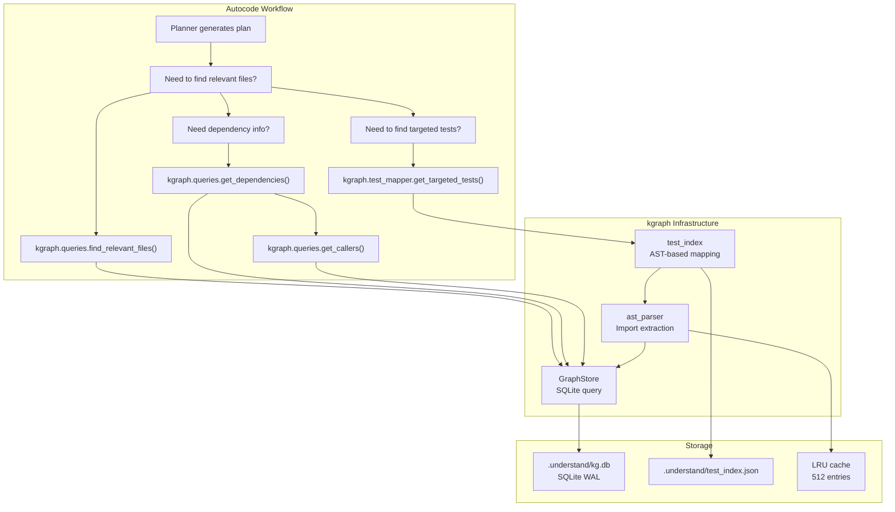

<- Back to [Knowledge Graph Overview](../KGRAPH.md)

# 🏗️ Architecture

## 🔗 Source Code Reference

| File | Purpose |
|------|---------|
| `core/kgraph/__init__.py` | Public API exports |
| `core/kgraph/ast_parser.py` | AST parsing (delegates to tree-sitter for Python; backward-compatible API) |
| `core/kgraph/tree_sitter_parser.py` | [#4] Multi-language parser: Python, JS/TS, Go, Rust via tree-sitter |
| `core/kgraph/cleanup.py` | `KGCleanup`: disk space + WAL management |
| `core/kgraph/project.py` | `ProjectManager`: isolation, paths, indexing mode |
| `core/kgraph/queries.py` | `find_relevant_files()`, `get_dependencies()`, `get_callers()` |
| `core/kgraph/storage.py` | `GraphStore`: SQLite graph with WAL, thread-local connections |
| `core/kgraph/test_index.py` | `load_test_index()`, `save_test_index()`, hybrid validation |
| `core/kgraph/test_mapper.py` | `get_targeted_tests()`, `rebuild_test_index()`, `CRITICAL_PATHS` |
| `core/kgraph/embeddings.py` | `extract_definitions()` (AST chunking) + `embed_texts()` (LM Studio `/v1/embeddings`) |
| `core/kgraph/vectors.py` | `upsert_file_vectors()`, `query_similar_code()`: project-specific ChromaDB vector store |

---

## 🌳 Component Map

```text
core/kgraph/
├── __init__.py              # Public API exports
├── ast_parser.py            # AST parsing (delegates to tree-sitter; backward-compatible)
├── tree_sitter_parser.py    # [#4] Multi-language: Python, JS/TS, Go, Rust
├── cleanup.py               # Disk space and WAL file management
├── project.py          # Project isolation, path management, indexing mode
├── queries.py          # Read-only graph queries (dependencies, callers, file search)
├── storage.py          # SQLite graph store (WAL, thread-local connections, write serialization)
├── test_index.py       # Persistent test index with hybrid validation
├── test_mapper.py      # Source file → test file mapping via AST
├── embeddings.py       # [#3] extract_definitions() + embed_texts() (LM Studio)
└── vectors.py          # [#3] upsert_file_vectors() + query_similar_code() (ChromaDB)
```

---

## 🔀 How It Fits Into the Stack



---

## 🌳 Artifact Directory Structure

Each project gets its own `.understand/` directory:

```text
project_root/
├── code/                           # Source code (workspace projects)
│   ├── core/
│   │   ├── config.py
│   │   ├── llm.py
│   │   └── memory.py
│   └── tests/
│       ├── test_config.py
│       └── test_llm.py
└── .understand/                    # kgraph artifacts
    ├── kg.db                       # SQLite graph (nodes + edges)
    ├── kg.db-wal                   # WAL file (auto-checkpointed)
    ├── kg.db-shm                   # Shared memory file
    ├── test_index.json             # Persistent test mapping index
    ├── test_mapping.yaml           # Manual test overrides (optional)
    └── cache/                      # Temporary cache files
```

---

## 💡 Key Design Decisions

- **Deterministic AST parsing** — No LLM calls; pure Python `ast` module for import extraction. This is intentional for speed, determinism, and zero external dependencies.
- **SQLite graph storage** — WAL-enabled, thread-safe, with automatic checkpoint management. Chosen for reliability, zero-config setup, and Python stdlib availability.
- **Hybrid validation** — mtime + size (fast path) then MD5 (authoritative slow path) for cache invalidation. The fast path avoids expensive MD5 computation for unchanged files.
- **Test targeting via AST** — Maps source files to their test files by analyzing test file imports. More accurate than filename heuristics alone.
- **Project isolation** — Each project gets its own `.understand/` artifact directory and project-specific ChromaDB collection. Prevents cross-project contamination.
- **Thread-local SQLite connections** — Each thread gets its own connection. Concurrent reads are safe; writes are serialized via `_write_lock`.
- **WAL checkpoint every 100 writes** — Prevents WAL file bloat. Falls back to PASSIVE mode if TRUNCATE fails.
- **Windows WAL repair** — `_repair_wal_on_windows()` deletes stale WAL artifacts on startup to prevent corruption from unclean shutdowns.
- **Singleton GraphStore** — `__new__` with class-level lock ensures one instance per database path. Prevents connection pool exhaustion.
- **Fail silently on parse errors** — Broken Python files return `frozenset()` instead of crashing the indexer. The codebase may contain syntax errors in files under development.
- **Critical paths trigger full suite** — Modifying `core/config.py`, `core/llm.py`, etc. triggers the full test suite because these files have global impact.
- **Manual test mapping override** — `test_mapping.yaml` allows users to override AST-derived mappings. Takes priority over heuristic mappings.

---

## ⚠️ Known Concerns

- **`test_mapper.py` references undefined `yaml` import** — `_load_test_mapping()` uses `yaml.safe_load(f)` but `import yaml` is not at the top of the file and `PyYAML` may not be installed. If `.understand/test_mapping.yaml` exists but `PyYAML` is not installed, the function will raise a `NameError`. The `try/except Exception` catches this, but the error is silently swallowed — manual test mappings are never loaded. *(Suggestion: Add `import yaml` at the top with a `try/except ImportError` guard, or document that `PyYAML` is an optional dependency.)*
- **GraphStore singleton never cleaned up** — `GraphStore._instances` is a class-level dict that grows as new database paths are requested. Instances are never removed. In long-running processes with many projects, the singleton dict accumulates entries. Each instance holds thread-local connections that are never closed unless `close()` is explicitly called. *(Suggestion: Add a `close_all()` class method that closes all instances and clears `_instances`. Call it during app shutdown.)*
- **AST parser cache key includes full file path** — The `@lru_cache` key is `(project_id, file_path, md5_hash)`. The `file_path` is the full absolute path. If the project is moved, all cached entries become stale but remain in the LRU cache, wasting the 512-entry budget. *(Suggestion: Use the relative path as part of the cache key instead of the absolute path.)*
- **No explicit `close()` calls in the codebase** — `GraphStore.close()` exists but is never called by any consumer. Thread-local connections remain open until process exit. On Windows, SQLite WAL files may not be cleaned up if the process crashes without calling `close()`. The `_repair_wal_on_windows()` handles this on next startup, but it's a workaround, not a solution. *(Suggestion: Register `GraphStore.close_all()` via `atexit` to ensure clean shutdown.)*

---

## 🧪 Testing

```powershell
# Run all kgraph tests
.\venv\Scripts\python tests/core/kgraph/ -W error --tb=short -v

> **Note:** Ensure `pytest` resolves to your venv. If not, use `python -m pytest` or the full venv path (`venv\Scripts\pytest.exe` on Windows, `venv/bin/pytest` on Unix).
```

**Mock strategy:**
- Use `tmp_path` for `.understand/` directories
- Create small synthetic Python files for AST parsing tests
- Mock `cfg` for path configuration
- Use real `GraphStore` with in-memory SQLite (`:memory:`) for unit tests

---

*Last updated: 2026-07-17 (v1.3)
