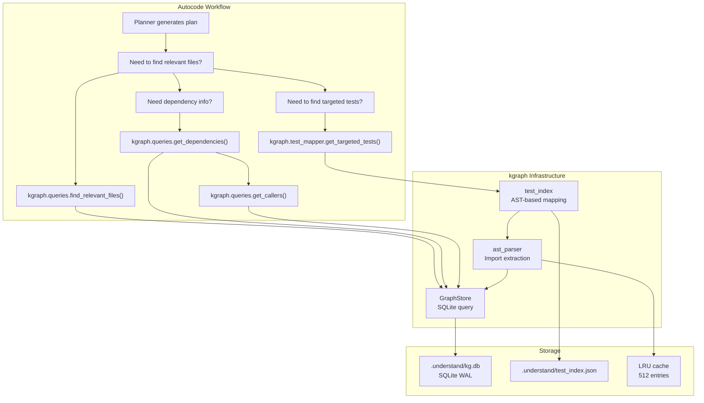

<- Back to [Knowledge Graph Overview](../KGRAPH.md)

# 🏗️ Architecture

## 🔗 Source Code Reference

| File | Purpose |
|------|---------|
| `core/kgraph/__init__.py` | Public API exports |
| `core/kgraph/ast_parser.py` | AST parsing (delegates to tree-sitter for Python; backward-compatible API) |
| `core/kgraph/tree_sitter_parser.py` | [#4] Multi-language parser: Python, JS/TS, Go, Rust, Java, C/C++, Ruby, Lua, PHP, Scala, Swift, Kotlin (v1.4) via tree-sitter |
| `core/kgraph/cleanup.py` | `KGCleanup`: disk space + WAL management |
| `core/kgraph/project.py` | `ProjectManager`: isolation, paths, indexing mode. [v1.7] `_DEFAULT_SKIP_DIRS` (renamed) + `get_skip_dirs()` (env-merged) + `get_embedding_model()` (per-project override via `.understand/config.json`). |
| `core/kgraph/queries.py` | `find_relevant_files()`, `get_dependencies()`, `get_callers()` |
| `core/kgraph/storage.py` | `GraphStore`: SQLite graph with WAL, thread-local connections. [v1.6] +`get_all_file_paths(project_id)` + `delete_file_entry(project_id, path)` for stale cleanup. |
| `core/kgraph/test_index.py` | `load_test_index()`, `save_test_index()`, hybrid validation |
| `core/kgraph/test_mapper.py` | `get_targeted_tests()`, `rebuild_test_index()`, `CRITICAL_PATHS` |
| `core/kgraph/embeddings.py` | `extract_definitions()` (AST chunking) + `embed_texts()` (LM Studio `/v1/embeddings`). [v1.7] Embedding cache (md5-keyed, 10000-entry cap, `clear_embedding_cache()`) + optional `model` param for per-project overrides. |
| `core/kgraph/vectors.py` | `upsert_file_vectors()`, `query_similar_code()`: project-specific ChromaDB vector store. [v1.7] Passes `pm.get_embedding_model()` to `embed_texts()`. |

---

## 🌳 Component Map

```text
core/kgraph/
├── __init__.py              # Public API exports
├── ast_parser.py            # AST parsing (delegates to tree-sitter; backward-compatible)
├── tree_sitter_parser.py    # [#4] Multi-language: Python, JS/TS, Go, Rust, Java, C/C++, Ruby, Lua, PHP, Scala, Swift, Kotlin
├── cleanup.py               # Disk space and WAL file management
├── project.py          # Project isolation, path management, indexing mode [v1.7: get_skip_dirs + get_embedding_model]
├── queries.py          # Read-only graph queries (dependencies, callers, file search)
├── storage.py          # SQLite graph store (WAL, thread-local connections, write serialization) [v1.6: stale-cleanup methods]
├── test_index.py       # Persistent test index with hybrid validation
├── test_mapper.py      # Source file → test file mapping via AST
├── embeddings.py       # [#3] extract_definitions() + embed_texts() (LM Studio) [v1.7: embedding cache + per-project model]
└── vectors.py          # [#3] upsert_file_vectors() + query_similar_code() (ChromaDB) [v1.7: per-project model]
```

---

## 🔀 How It Fits Into the Stack



---

## 🌳 Artifact Directory Structure

Each project gets its own `.understand/` directory:

```text
project_root/
├── code/                           # Source code (workspace projects)
│   ├── core/
│   │   ├── config.py
│   │   ├── llm.py
│   │   └── memory.py
│   └── tests/
│       ├── test_config.py
│       └── test_llm.py
└── .understand/                    # kgraph artifacts
    ├── kg.db                       # SQLite graph (nodes + edges)
    ├── kg.db-wal                   # WAL file (auto-checkpointed)
    ├── kg.db-shm                   # Shared memory file
    ├── test_index.json             # Persistent test mapping index
    ├── test_mapping.yaml           # Manual test overrides (optional)
    └── cache/                      # Temporary cache files
```

---

## 💡 Key Design Decisions

- **Deterministic AST parsing** — No LLM calls; pure Python `ast` module for import extraction. This is intentional for speed, determinism, and zero external dependencies. (v1.2+: tree-sitter replaces `ast` for multi-language support — same principle: deterministic, no LLM.)
- **SQLite graph storage** — WAL-enabled, thread-safe, with automatic checkpoint management. Chosen for reliability, zero-config setup, and Python stdlib availability.
- **Hybrid validation** — mtime + size (fast path) then MD5 (authoritative slow path) for cache invalidation. The fast path avoids expensive MD5 computation for unchanged files.
- **Test targeting via AST** — Maps source files to their test files by analyzing test file imports. More accurate than filename heuristics alone.
- **Project isolation** — Each project gets its own `.understand/` artifact directory and project-specific ChromaDB collection. Prevents cross-project contamination. [v1.4.1] ChromaDB is now project-scoped: `{project}/.understand/chroma/` for workspace projects, `memory_root/understand/chroma/` for the agent root (was: always `agent_root/.understand/chroma/` — orphaned vectors when a project's `.understand/` was deleted).
- **Thread-local SQLite connections** — Each thread gets its own connection. Concurrent reads are safe; writes are serialized via `_write_lock`.
- **WAL checkpoint every 100 writes** — Prevents WAL file bloat. Falls back to PASSIVE mode if TRUNCATE fails.
- **Windows WAL repair** — `_repair_wal_on_windows()` deletes stale WAL artifacts on startup to prevent corruption from unclean shutdowns.
- **Singleton GraphStore** — `__new__` with class-level lock ensures one instance per database path. Prevents connection pool exhaustion.
- **Fail silently on parse errors** — Broken files return `frozenset()` (or a single module chunk for definitions) instead of crashing the indexer. The codebase may contain syntax errors in files under development. [v1.4.1] The optional `errors` parameter on `extract_imports` + `extract_definitions_ts` surfaces parse-failure messages when the caller wants them — graceful-fallback contract preserved.
- **[v1.4.1] Multi-language query support** — `get_dependencies` + `get_callers` accept any supported file extension (was: Python-only `.py` hardcoding — silently dropped JS/TS/Go/Rust/Java/etc. dependency edges). `get_dependencies` keeps target_ids matching any supported extension OR raw module-name forms. `get_callers` queries both `file_path` and module-name form (Python dotted, JS relative `./`, Go package path).
- **Critical paths trigger full suite** — Modifying `core/config.py`, `core/llm.py`, etc. triggers the full test suite because these files have global impact.
- **Manual test mapping override** — `test_mapping.yaml` allows users to override AST-derived mappings. Takes priority over heuristic mappings.

---

## ⚠️ Known Concerns

*All previously-listed concerns (test_mapper yaml import, GraphStore singleton cleanup, AST cache key path, missing close() calls) were resolved in v1.0 — see [CHANGELOG.md](CHANGELOG.md) for details. No outstanding concerns as of v1.4.1.*

---

## 🧪 Testing

```powershell
# Run all kgraph tests
.\venv\Scripts\python tests/core/kgraph/ -W error --tb=short -v

> **Note:** Ensure `pytest` resolves to your venv. If not, use `python -m pytest` or the full venv path (`venv\Scripts\pytest.exe` on Windows, `venv/bin/pytest` on Unix).
```

**Mock strategy:**
- Use `tmp_path` for `.understand/` directories
- Create small synthetic Python files for AST parsing tests
- Mock `cfg` for path configuration
- Use real `GraphStore` with in-memory SQLite (`:memory:`) for unit tests

---

*Last updated: 2026-07-22 (v1.7)

