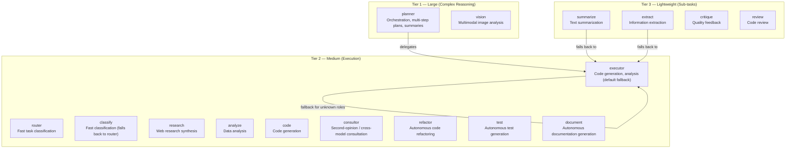
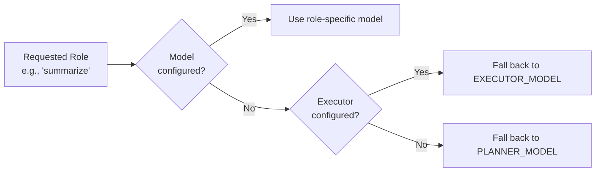
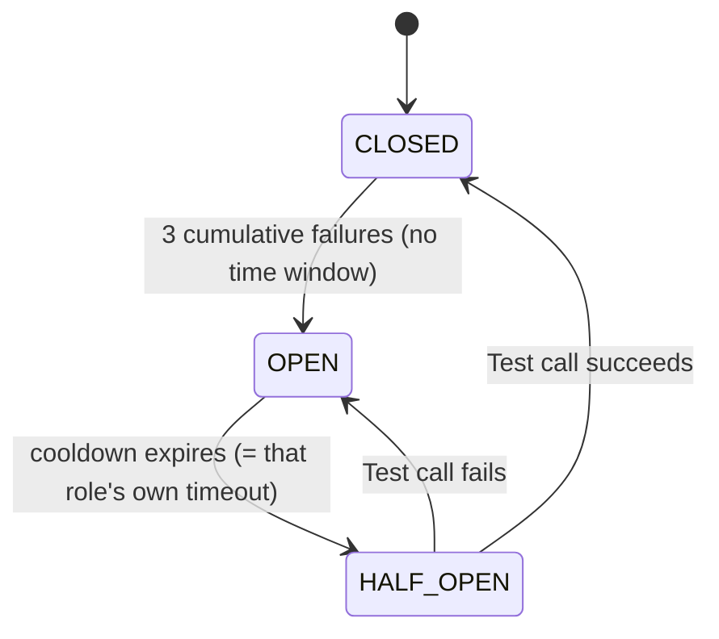
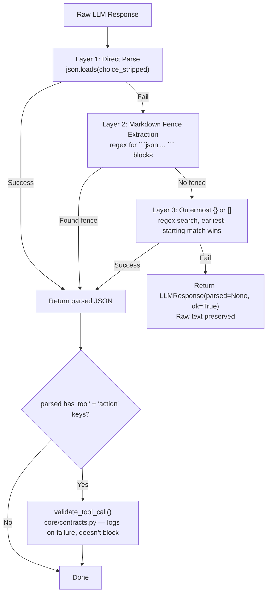

<- Back to [LLM Overview](../LLM.md)

# 📝 API Reference

## 🔧 API Overview

The LLM backend exposes three public call methods — `complete()` (high-level, role-based), `call()` (low-level, role-based), and `complete_provider()` (v1.3, provider-direct) — plus a unified `LLMResponse` dataclass. All configuration is role-based — callers specify roles, not raw model strings (except `complete_provider()`, which takes a provider name directly).

---

## ⚡ Methods

### `complete()` — High-Level Convenience

The primary method used throughout the codebase. Handles system/user/context message assembly, context budgeting, and JSON parsing.

```python
result = llm.complete(
    role="executor",
    system="You are a senior Python developer...",
    user="Fix this bug in the timeout handler",
    context="Background: The agent uses a circuit breaker pattern...",
    json_mode=True,
    trace_id="abc123",
)

# v1.2: JSON schema enforcement (stronger than json_mode)
result = llm.complete(
    role="router",
    system="Classify the user intent...",
    user="What are ChromaDB best practices?",
    json_schema={
        "type": "object",
        "properties": {
            "classification": {"type": "string"},
            "confidence": {"type": "number"},
        },
        "required": ["classification", "confidence"],
    },
)

if result.ok:
    print(result.text)        # Raw text output
    print(result.parsed)      # Parsed JSON (if json_mode=True or json_schema set)
    print(result.elapsed)     # Seconds taken
    print(result.usage)       # {"prompt": N, "completion": M, "total": T}
else:
    print(result.error)       # Error message
```

**Parameters:**

| Param | Type | Default | Description |
|-------|------|---------|-------------|
| `role` | `str` | — | **Required.** Role name (planner, executor, router, etc.) |
| `system` | `str` | `""` | System prompt (prepended to messages) |
| `user` | `str` | `""` | User message |
| `context` | `str` | `""` | Additional context (appended after system, as a fake assistant "Understood." turn) |
| `content` | `str` | `""` | Additional content appended to the user message (e.g. file contents) |
| `json_mode` | `bool` | `False` | Parse response as JSON (basic — ensures valid JSON, no schema) |
| `json_schema` | `Optional[dict]` | `None` | **v1.2.** JSON schema for structured generation. When provided, providers send `response_format={"type":"json_schema",...}`. LM Studio enforces via outlines internally. Stronger than `json_mode` — model cannot generate schema-invalid output. Takes precedence over `json_mode` when both set. Implies `json_mode` for parsing. |
| `trace_id` | `str` | `""` | Trace identifier for logging |
| `temperature` | `float` | *(role default)* | Override role temperature |
| `max_tokens` | `int` | *(role default)* | Override role max tokens |
| `timeout` | `int` | *(role default)* | Override role timeout |

> ⚠️ `complete_with_tools()` does not exist anywhere in this codebase (confirmed via repo-wide search). `LLMClient` exposes three public call methods: `complete()`, `call()`, and `complete_provider()` (v1.3). See INSTRUCTIONS.md → In Progress / Next Up for the `complete_with_tools()` roadmap.

**Phase 2 (v1.2):** Schemas are now defined for: agent roles (code, route, plan, review, refactor, test) via ROLE_CONFIG, router._model_route(), autocode debug node, procedural distill, sleep_learn distiller.

---

### `call()` — Low-Level

Direct call with full control over messages list and parameters. Used internally by `complete()`.

```python
result = llm.call(
    role="executor",
    messages=[
        {"role": "system", "content": "..."},
        {"role": "user", "content": "..."},
    ],
    temperature=0.1,
    max_tokens=4096,
    timeout=120,
    json_mode=True,
    trace_id="abc123",
)
```

---

### `complete_provider()` — Provider-Direct Call (v1.3)

**v1.3 (#22).** Bypasses role routing — calls a specific named provider directly. Maintains circuit breaker integration + telemetry (the same plumbing as `complete()`/`call()`) but lets the caller choose the provider instead of looking it up by role. Used by swarm's `_call_provider()` so swarm gets the same resilience and tracing as role-routed calls.

```python
result = llm.complete_provider(
    provider="openai",                    # Provider name (must be in registry)
    model="gpt-4o",                       # Model identifier
    messages=[
        {"role": "system", "content": "..."},
        {"role": "user", "content": "..."},
    ],
    temperature=0.0,
    max_tokens=1024,
    timeout=60,
    json_mode=False,
    json_schema=None,
    trace_id="abc123",
)
```

**Parameters:**

| Param | Type | Default | Description |
|-------|------|---------|-------------|
| `provider` | `str` | — | **Required.** Provider name (e.g. `"openai"`, `"claude"`, `"gemini"`, `"lmstudio"`, `"deepseek"`, ...). Must be registered in `llm._registry._providers`. |
| `model` | `str` | — | **Required.** Model identifier to pass to the provider (e.g. `"gpt-4o"`, `"claude-3-5-sonnet-..."`). |
| `messages` | `list[dict]` | — | **Required.** OpenAI-shape messages list. |
| `temperature` | `float` | `0.7` | Sampling temperature. |
| `max_tokens` | `int` | `1024` | Max response tokens. |
| `timeout` | `int` | `60` | Per-call timeout in seconds. |
| `json_mode` | `bool` | `False` | Request JSON output. |
| `json_schema` | `Optional[dict]` | `None` | JSON schema for structured output (v1.3: all providers honor natively). |
| `trace_id` | `str` | `""` | Trace identifier for logging. |

**Returns:** `LLMResponse` (same shape as `complete()`/`call()`).

**When to use:**

- Multi-provider fan-out where the same question must be sent to several specific providers in parallel (the swarm pattern). Pre-v1.3 this required reaching into `provider.chat_completion()` directly — bypassing the circuit breaker + losing telemetry.
- Cross-model comparison / voting where role routing (which picks *one* provider per role) is the wrong abstraction.
- Any code path that needs to pick the provider by name rather than by role.

**When NOT to use:**

- Role-based dispatch — use `llm.complete(role="...", ...)` instead. `complete_provider()` skips role routing, fallback chains, and the per-role `model_registry` lookup.
- Internal `_call_provider()` test mocks that patch `provider.chat_completion()` directly — `complete_provider()` falls back to `provider.chat_completion()` if it can't satisfy the mock shape, so existing tests still work.

---

### `LLMResponse`

Unified response object returned by all LLM methods:

```python
@dataclass
class LLMResponse:
    text: str              # Raw text output
    role: str              # Role that was called
    model: str             # Model identifier used
    usage: dict[str, int]  # {"prompt": N, "completion": M, "total": T}
    elapsed: float         # Seconds taken
    parsed: Optional[Any]  # Parsed JSON if json_mode=True
    error: str = ""        # Error message if ok=False
    ok: bool = True        # Success flag
```

---

## 🎭 Role-Based Dispatch

Every LLM call specifies a **role** (e.g., `"planner"`, `"executor"`, `"router"`). The role determines which model, provider, timeout, temperature, and max tokens to use.

### Role Hierarchy



> ⚠️ There is no `synthesize` role anywhere in the source. `core/config.py` defines a `route` entry in `model_registry`, but `llm_backend/config.py`'s `_build_role_configs()` doesn't include it — calling `llm.complete(role="route", ...)` silently falls back to `executor`'s full config and logs a `tracer.error("llm_role_fallback", ...)`.

### Role Configuration

Each role has independent `temperature`/`max_tokens` settings hardcoded in `llm_backend/config.py`'s `_defaults` dict — these are **behavior tuning knobs**, not env-configurable. `timeout` is **NOT** in `_defaults`; it comes exclusively from `cfg.model_registry` (single source of truth in `core/config.py`).

| Role | Temperature | Max Tokens | Description |
|------|-------------|------------|-------------|
| `planner` | 0.2 | 32768 | Orchestration, task decomposition, memory summaries |
| `executor` | 0.0 | 16384 | Code generation, analysis — **default fallback for unknown roles** |
| `router` | 0.0 | 512 | Fast task classification, tool selection |
| `vision` | 0.2 | 4096 | Multimodal image analysis |
| `classify` | 0.0 | 256 | Lightweight classification |
| `summarize` | 0.2 | 8192 | Text summarization |
| `extract` | 0.0 | 4096 | Information extraction from documents |
| `research` | 0.2 | 16384 | Web research synthesis |
| `critique` | 0.3 | 8192 | Quality critique and feedback |
| `analyze` | 0.2 | 16384 | Data analysis |
| `code` | 0.0 | 16384 | Code generation |
| `review` | 0.2 | 8192 | Code review |
| `consultor` | 0.2 | 4096 | Cross-model consultation (only registered if a model is explicitly configured) |
| `refactor` | 0.0 | 16384 | Autonomous code refactoring |
| `test` | 0.0 | 16384 | Autonomous test generation |
| `document` | 0.2 | 16384 | Autonomous documentation generation |

**Timeout** for all roles comes from `cfg.model_registry[role]["timeout"]` — set via `*_TIMEOUT` env vars in `core/config.py`. There is no timeout in `llm_backend/config.py`.

### Fallback Chain

When a role's model is not configured in `.env`, it falls back:



> ⚠️ **Sub-roles fall back to executor, not planner.** Planner is expensive and reserved for complex reasoning. This is intentional.

---

## 📐 Context Budgeting

The LLM backend has a sophisticated context management system that decides what to keep and what to trim when messages exceed the model's context window. **This logic lives in `core/memory_backend/budget.py`, not anywhere under `llm_backend/`** — the module's own docstring header is itself stale (still says `core/context_budget.py`, a path that hasn't existed since this code moved into `memory_backend/`).

### Architecture

```mermaid
graph TD
    A["Messages"] --> B["budget_messages(messages, max_tokens)<br/>core/memory_backend/budget.py"]
    B --> C["Pin SYSTEM + USER messages<br/>(never dropped except as last resort)"]
    C --> D["Classify + score every other message<br/>tier weight + recency bonus + fingerprint bonus"]
    D --> E["Greedy selection, highest score first<br/>50% per-class cap, 80% of max_tokens budget"]
    E --> F["Re-sort chronologically<br/>preserve conversation flow"]
    F --> G{Still over budget?<br/>(pinned alone too large)}
    G -->|Yes| H["Hard-truncate last USER message<br/>or drop everything except SYSTEM+USER"]
    G -->|No| I["Return final message list"]
```

### Cognitive Categories (`ContextClass` enum, 7 tiers — not 5)

Classification is deterministic, based on `msg["role"]` and content fingerprinting (substring match), **not** position in the conversation:

| Tier | Value | Tier Weight | Classified when |
|------|-------|-------------|-----------------|
| `SYSTEM` | 0 | 1000.0 (pinned) | `role == "system"` |
| `USER` | 1 | 1000.0 (pinned) | `role == "user"` |
| `ERROR` | 2 | 40.0 | content contains `"traceback"`, `"exception"`, or `"error:"` |
| `PROCEDURAL` | 3 | 50.0 | content contains `"procedural"` or `"rule:"` |
| `RECENT` | 4 | 20.0 | default for anything not matched above |
| `OUTPUT` | 5 | 10.0 | `role == "tool"` |
| `ARCHIVE` | 6 | 1.0 | never assigned by `_classify_message()` directly — reserved for future use |

Note `PROCEDURAL` (50.0) outranks `ERROR` (40.0) in tier weight, despite the module docstring's own comment claiming error messages "must outrank procedural for debugging" — the weight values as written don't implement that stated intent.

**Scoring formula** (for every non-pinned message): `score = tier_weight + recency_bonus + fingerprint_bonus`
- **Recency bonus**: `(index / total) * 10.0` — later messages score slightly higher
- **Fingerprint bonus**: `+5.0` if content contains a ` ``` ` ` ```json ` ` ``` ` or ` ``` ` ` ```python ` ` ``` ` fence

**Selection**: `SYSTEM`/`USER` messages are pinned outright. Everything else is sorted by score descending and greedily added until the budget fills, with a **50% per-class cap** (`CLASS_CAP = input_budget * 0.5`) so one giant traceback can't starve every other category. `input_budget` itself is **80% of `max_tokens`** (remaining 20% reserved for model output). Selected messages are re-sorted back into chronological order before return.

**Overflow handling**: if `SYSTEM` + `USER` alone exceed `max_tokens`, the last `USER` message is hard-truncated with a 100-token safety buffer and a `"

[...TRUNCATED DUE TO CONTEXT OVERFLOW...]"` marker. If still over budget, everything except `SYSTEM`+`USER` is dropped as a final fallback.

### Token Estimation

| Module | Factor | Where used |
|--------|--------|------------|
| `core/memory_backend/budget.py` (`CHARS_PER_TOKEN`) | `/ 3.5` | The cognitive budgeting system — canonical estimate |
| `core/llm_backend/client.py`'s `call()` | `// 4` | Throwaway estimate for a debug `logger.info()` line before `budget_messages()` is invoked — has no effect on what gets kept/trimmed |
| `core/llm_backend/rate_limit.py` (`truncate_by_tokens`) | tiktoken if available, else `// 4` | Rate-limiting / cost-estimation utility, unrelated to message selection |

There are three different token-estimate code paths, but they serve different purposes — only the first (`/ 3.5`) actually decides what gets kept or trimmed.

### Context Pruning

A **separate** mechanism, `core/memory_backend/pruner.py`, handles tool-output truncation. It is not a 4-level cascading system — a single 8,000-character threshold, tool-aware truncation (head+tail 4k+4k for most tools, tail-only for `python_exec`/`cli`), full output saved to disk as a recoverable artifact, and a `_recovery_hint` injected into the result. HTML-stripping for the `web` tool happens via BeautifulSoup *inside `tools/web.py` itself*, before the pruner is ever called.

---

## 🛡️ Circuit Breaker

Prevents cascading failures when a model or provider becomes unresponsive. **Each role** has an independent circuit breaker (keyed by role name — `"executor"`, `"planner"`, etc. — not by model identifier).

### State Machine



> ⚠️ There is **no 5-minute failure window** — `record_failure()` just increments a counter while CLOSED; it only resets via a full OPEN→HALF_OPEN→CLOSED cycle. The cooldown is **not a fixed 30 seconds** — each breaker is constructed with `recovery_timeout=role_cfg.timeout`, so `router`'s breaker cools down in 15s, `planner`'s in 180s. Only `failure_threshold=3` and `half_open_max_calls=1` are genuinely fixed.

### Behavior by State

| State | `can_execute()` | What Happens |
|-------|-----------------|--------------|
| **CLOSED** | `True` | Normal operation. Failures are counted (no decay). |
| **OPEN** | `False` | All calls rejected immediately. Returns `LLMResponse(ok=False, error="Circuit breaker OPEN for {role}: service degraded (fail-fast).")` |
| **HALF_OPEN** | `True` for one call, `False` after | One probe call allowed. Success → CLOSED. Failure → immediately back to OPEN. |

### Monitoring

The gateway exposes circuit breaker states via `GET /health/circuit-breakers`, which calls `llm.circuit_breaker_states` — **this returns `None` unless `cfg.enable_metrics_endpoint` is truthy.** By default this endpoint returns `{"status": "ok", "breakers": null}`. When enabled, keys are **role names** (not model identifiers):

```json
{
  "status": "ok",
  "breakers": {
    "planner": {"state": "closed", "failure_count": 0, "timeout_seconds": 180, "time_since_last_failure": 0.0},
    "executor": {"state": "half-open", "failure_count": 3, "timeout_seconds": 120, "time_since_last_failure": 121.4}
  }
}
```

### Configuration

| Parameter | Value | Description |
|-----------|-------|-------------|
| Failure threshold | 3 (fixed) | Cumulative failures before opening — no time window |
| Cooldown | `role_cfg.timeout` (dynamic, per role) | e.g. 15s for `router`, 180s for `planner` |
| `half_open_max_calls` | 1 (fixed) | Exactly one probe call allowed in HALF_OPEN |
| Granularity | Per **role**, not per model | Keyed by role name in `LLMClient._breakers` |

---

## 🔌 Provider Abstraction

### BaseProvider (Abstract) — `core/llm_backend/provider.py`

All LLM backends implement this interface:

```python
class BaseProvider(ABC):
    name: str = "base"

    @abstractmethod
    def chat_completion(
        self,
        model: str,
        messages: list[dict],
        temperature: float,
        max_tokens: int,
        timeout: int,
        json_mode: bool,
        **kwargs: Any,  # json_schema: Optional[dict] (v1.2+), honored natively by all providers (v1.3)
    ) -> dict: ...

    def is_available(self) -> bool:
        return True

    def supports_json_schema(self) -> bool:
        """v1.3 (#41): Whether this provider honors `json_schema` natively.
        All providers return True. Claude = tool-use conversion; Gemini =
        responseSchema; OpenAI-compat = response_format with strict=True."""
        return True
```

`ProviderRegistry` (same file) holds the registered providers in a plain dict keyed by provider name, raising `KeyError` with the list of available providers if an unregistered name is requested.

### Available Providers

| Provider | Env Detection | Description |
|----------|--------------|-------------|
| `LMStudioProvider` | Always registered as `"lmstudio"` | LM Studio (local) — any OpenAI-compatible local endpoint (Ollama, vLLM) |
| `OpenAICompatibleProvider` | One registered per cloud vendor whose `*_API_KEY` is non-empty in `.env` | `openai`, `deepseek`, `mistral`, `qwen`, `kimi`, `zai`, `mimo` — all seven OpenAI-compatible cloud providers are checked at startup |
| `AnthropicProvider` | Registered as `"claude"` if `ANTHROPIC_API_KEY` is non-empty | Claude (Anthropic) — native Messages API, NOT OpenAI-compatible |
| `GeminiProvider` | Registered as `"gemini"` if `GEMINI_API_KEY` is non-empty | Gemini (Google) — native Generative Language API, NOT OpenAI-compatible |

> **Provider count (v1.2.2):** 10 supported providers total — 1 local (LM Studio) + 7 OpenAI-compatible cloud (OpenAI, DeepSeek, Mistral, Qwen, Kimi, Z.ai, MiMo) + 2 native cloud (Claude/Anthropic, Gemini/Google). Z.ai and MiMo are new OpenAI-compatible additions; Claude and Gemini are new native providers.
>
> **Claude and Gemini json_schema support (v1.3):** All providers now support `json_schema` natively. Claude uses Anthropic tool-use conversion (define tool with `input_schema`, force `tool_choice`, extract `tool_use` block's `input` as JSON). Gemini uses `responseSchema` conversion (strip `additionalProperties`/union types, set `responseMimeType=application/json`). OpenAI-compatible providers send `response_format={"type":"json_schema","schema":...,"name":...,"strict":true}` (v1.3 #42: `name` is derived from the schema `title` or defaults to `"structured_output"`; `strict: True` enforces the schema at generation time). Pre-v1.3, Claude and Gemini silently ignored `json_schema` and fell back to `json_mode` — that is no longer the case.

### Provider Capability Detection (v1.3)

`BaseProvider` exposes a `supports_json_schema()` method so callers can check before passing a schema:

```python
class BaseProvider(ABC):
    name: str = "base"

    def supports_json_schema(self) -> bool:
        """Whether this provider honors the `json_schema` kwarg natively.
        v1.3: all providers return True (Claude via tool-use conversion,
        Gemini via responseSchema, OpenAI-compat via response_format)."""
        return True
```

**v1.3 status:** All providers return `True`. The method exists so future providers (or future modes of existing providers) can declare `False` and let callers gracefully fall back to `json_mode` + defensive parsing.

### Provider Selection

```mermaid
graph TD
    A["Role model value"] --> B{Exact match<br/>cloud provider?}
    B -->|"openai", "deepseek"| C["OpenAICompatibleProvider<br/>+ resolve API key, base URL, model"]
    B -->|No| D["LMStudioProvider<br/>+ LM_STUDIO_BASE_URL"]
```

### Dynamic Factory Registration

`core/llm_backend/factory.py` scans `cfg` at startup. If a cloud provider's `API_KEY` is present in `.env`, it automatically registers an `OpenAICompatibleProvider` for that service. No code changes needed to add new cloud vendors.

```python
# Auto-registered at startup if API key exists (all 9 providers are checked):
# OPENAI_API_KEY=sk-...      → registers "openai" provider   (OpenAICompatibleProvider)
# DEEPSEEK_API_KEY=sk-...    → registers "deepseek" provider (OpenAICompatibleProvider)
# MISTRAL_API_KEY=...        → registers "mistral" provider  (OpenAICompatibleProvider)
# QWEN_API_KEY=...           → registers "qwen" provider     (OpenAICompatibleProvider)
# KIMI_API_KEY=...           → registers "kimi" provider     (OpenAICompatibleProvider)
# ZAI_API_KEY=...            → registers "zai" provider      (OpenAICompatibleProvider, v1.2.2)
# MIMO_API_KEY=...           → registers "mimo" provider     (OpenAICompatibleProvider, v1.2.2)
# ANTHROPIC_API_KEY=sk-...   → registers "claude" provider   (AnthropicProvider, v1.2.2 — native)
# GEMINI_API_KEY=...         → registers "gemini" provider   (GeminiProvider, v1.2.2 — native)
```

---

## 🔧 Structured Output & JSON Parsing

When `json_mode=True`, the response undergoes a **3-layer extraction strategy** to handle LLM formatting quirks:

### Extraction Pipeline (client.py)



**Why 3 layers?** Small local models frequently:
- Wrap JSON in markdown fences (`` ```json ... ``` ``)
- Add explanatory text before/after the JSON
- Add trailing prose after a complete JSON value

### Router-Specific JSON Extraction

The router (`core/router.py`) has its own, **different** `_extract_first_json()` method — it's not the same 3-layer strategy as `client.py`. It strips markdown fences, tries a direct `json.loads()`, and on failure falls back to `json.JSONDecoder().raw_decode()` (Python's native decoder, which parses a single JSON value and ignores anything after it). `client.py`'s `_parse_response()`, by contrast, uses a regex search for the outermost `{...}` or `[...]` after fence-stripping fails — genuinely two different implementations for the same general problem.

---

## 📊 Observability

### Tracing

Every LLM call is logged via `tracer.step()`:

```python
# Real call site (core/llm_backend/client.py, inside call()):
tracer.step(trace_id, "llm_call", role=role, model=role_cfg.model,
            messages=len(messages), timeout=_timeout)
```

### Token Tracking

Token consumption is tracked via `core/metrics.py`:

```python
track_llm_tokens(role=role, prompt=usage["prompt"], completion=usage["completion"])
```

Exposed at `GET /metrics` in Prometheus format:

```
autocode_llm_tokens_total{role="executor"} 15420
autocode_llm_tokens_total{role="planner"} 8230
autocode_llm_tokens_total{role="router"} 1250
```

### Circuit Breaker Monitoring

Available at `GET /health/circuit-breakers` — per-**role** state and failure count, gated behind `cfg.enable_metrics_endpoint` (returns `null` if disabled). See [Circuit Breaker → Monitoring](#circuit-breaker) above.

---

*Last updated: 2026-07-14 (v1.3). See [ARCHITECTURE.md](ARCHITECTURE.md) for file maps and design decisions, [CHANGELOG.md](CHANGELOG.md) for version history, [INSTRUCTIONS.md](INSTRUCTIONS.md) for AI editing rules.*
