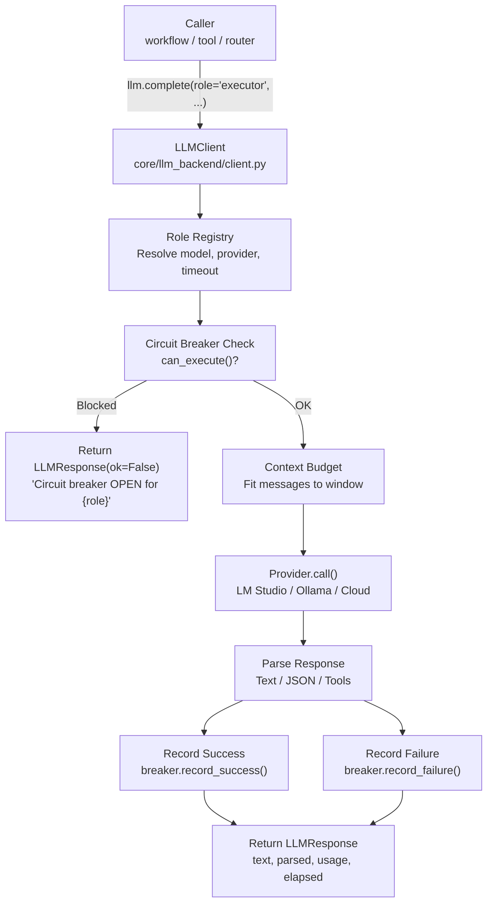

<- Back to [LLM Overview](../LLM.md)

# 🏗️ Architecture

## 🔗 Source Code Reference

| File | Purpose |
|------|---------|
| `core/llm.py` | Thin facade — re-exports `llm` singleton |
| `core/llm_backend/client.py` | `LLMClient`: `complete()`, `call()`, `circuit_breaker_states` property |
| `core/llm_backend/config.py` | `RoleConfig` dataclass + `_build_role_configs()` + `ROLE_CONFIGS` module-level dict |
| `core/llm_backend/response.py` | `LLMResponse` dataclass |
| `core/memory_backend/budget.py` | Cognitive priority-based context budgeting (`budget_messages()`, 7-tier `ContextClass`) |
| `core/memory_backend/pruner.py` | VRAM artifact pruning |
| `core/llm_backend/rate_limit.py` | Rate limiting + raw token-count truncation + cost estimation |
| `core/llm_backend/circuit_breaker.py` | Per-model circuit breaker (CLOSED → OPEN → HALF_OPEN) |
| `core/llm_backend/factory.py` | `create_llm_client()` — composition root, provider registration |
| `core/llm_backend/provider.py` | `BaseProvider` ABC + `ProviderRegistry` |
| `core/llm_backend/providers/lmstudio.py` | `LMStudioProvider` (local OpenAI-compatible) |
| `core/llm_backend/providers/openai_compat.py` | `OpenAICompatibleProvider` (cloud) |
| `core/llm_backend/providers/anthropic.py` | `AnthropicProvider` — Claude (Anthropic Messages API, NOT OpenAI-compatible) |
| `core/llm_backend/providers/gemini.py` | `GeminiProvider` — Gemini (Google Generative Language API, NOT OpenAI-compatible) |
| `core/config.py` | Model names, timeouts, LLM server URL, `model_registry` |
| `core/metrics.py` | Token tracking (`track_llm_tokens`) |
| `core/runtime/activity_tracker.py` | Inference slot management |
| `core/contracts.py` | `validate_tool_call()` — schema validation for parsed tool-call JSON |

---

## 🌳 Module Tree

```text
core/llm.py              # Thin facade — re-exports singleton
core/llm_backend/
├── client.py            # LLMClient: complete(), call(), circuit_breaker_states
├── config.py            # RoleConfig dataclass + _build_role_configs() + ROLE_CONFIGS
├── response.py          # LLMResponse dataclass
├── budget.py            # Rate limiting (ThreadSafeRateLimiter) + raw token-count
│                        # truncation + cost estimation. NOT the cognitive-tier
│                        # system — that lives in core/memory_backend/budget.py.
├── circuit_breaker.py   # Per-model failure tracking with auto-recovery
├── provider.py          # BaseProvider ABC + ProviderRegistry
├── factory.py           # create_llm_client() — composition root
└── providers/
    ├── lmstudio.py      # Local OpenAI-compatible provider
    └── openai_compat.py # Cloud provider (OpenAI, DeepSeek, etc.)
```

> ⚠️ There is no `context_budget.py`, `context_pruner.py`, `models.py`, `prompt_loader.py`, or `providers/base.py` anywhere in this repo. The cognitive-priority budgeting system lives in `core/memory_backend/budget.py`.

---

## 🔀 Call Flow



---

## 💡 Key Design Decisions

- **Thin facade** — `core/llm.py` constructs the `LLMClient` singleton and re-exports it. All implementation logic lives in `core/llm_backend/`. The facade exists for import simplicity, backward compatibility, and circular import prevention.
- **Role-based dispatch** — Callers specify roles (e.g., `"executor"`, `"router"`), not raw model strings. The role determines model, provider, timeout, temperature, and max tokens.
- **Sub-role fallback to executor** — When a role's model is not configured, it falls back to `executor_model`, then `planner_model`. Planner is expensive and reserved for complex reasoning.
- **Circuit breaker per role** — Each role has an independent circuit breaker keyed by role name (not model identifier). 3 cumulative failures → cooldown equal to that role's own timeout.
- **Context budgeting in `memory_backend/budget.py`** — The cognitive-priority message trimming system lives in `core/memory_backend/budget.py`, not `llm_backend/`. The module's own docstring is stale (still says `core/context_budget.py`).
- **Dual JSON extraction** — `client.py` uses a 3-layer strategy (direct parse → markdown fence → outermost regex). `router.py` uses a different approach (`json.JSONDecoder().raw_decode()`). These are intentionally separate implementations for the same general problem. **[Autocode v2.0]** `router.py`'s `_extract_first_json` now delegates to `core/json_extract.py` (consolidated utility). `client.py`'s `_parse_response` still has its own embedded JSON extraction — migration to `core/json_extract.py` is planned for a later 2.0 phase (requires separating JSON extraction from API response parsing + schema validation). See `core/json_extract.py` docstring + `INSTRUCTIONS.md` rule #13.
- **JSON schema enforcement (v1.2)** — `json_schema` param on `complete()`/`call()`/`chat_completion()`. When provided, providers send `response_format={"type":"json_schema",...}`. LM Studio enforces via outlines internally — model cannot generate schema-invalid output. Stronger than `json_mode` (which only ensures valid JSON, not schema). `json_schema` takes precedence over `json_mode`; implies `json_mode` for parsing. Backward compatible (defaults to `None`). Phase 1: plumbing only — no roles use it yet. Phase 2 will define schemas per role.
- **Provider abstraction** — `BaseProvider` ABC with `LMStudioProvider` and `OpenAICompatibleProvider`. Dynamic factory registration at startup based on `*_API_KEY` env vars. v1.2.2: 4 new providers — Claude (native AnthropicProvider), Gemini (native GeminiProvider), Z.ai + MiMo (OpenAI-compatible). Claude and Gemini ignore json_schema in Phase 1 (different API mechanisms for structured output — deferred). Both use httpx directly (no SDK deps), same as existing providers.
- **Thread-safe singleton** — `LLMClient` is a singleton. `LMStudioProvider` uses a single shared `httpx.Client` with double-checked locking (not thread-local). `CircuitBreaker` uses `threading.Lock` per instance.
- **Timeout single source of truth** — Timeout lives exclusively in `core/config.py` (`cfg.model_registry[role]["timeout"]`). Never in `llm_backend/config.py`.
- **No prompt loader** — System prompts are plain Python string constants passed directly by callers. No YAML-based prompt loading system exists.

---

## 🧪 Testing

```powershell
# Run all LLM backend tests
.\venv\Scripts\python tests/core/llm/ -W error --tb=short -v

> **Note:** Ensure `pytest` resolves to your venv. If not, use `python -m pytest` or the full venv path (`venv\Scripts\pytest.exe` on Windows, `venv/bin/pytest` on Unix).
```

**Mock strategy:**
- Mock `httpx.Client.post()` to avoid real LLM calls
- Mock `cfg` for model names and timeouts
- Circuit breaker tests use real breaker instances with mocked provider responses
- JSON schema tests mock the provider and verify `response_format` payload structure

**Test files:**
- `test_json_schema.py` — v1.2: schema enforcement (provider payload, parsing, backward compat)
- `test_json_extraction.py` — 3-layer JSON extraction in `_parse_response`
- `test_llm_client_integration.py` — `complete()` and `call()` message building
- `test_llm_client_errors.py` — error handling, circuit breaker integration
- `test_llm_response.py` — `LLMResponse` dataclass
- `test_circuit_breaker.py` — circuit breaker state transitions
- `test_llm_telemetry.py` — telemetry/metrics
- `test_llm_tracer.py` — trace logging

---

*Last updated: 2026-07-08. See [API.md](API.md) for method details, [CHANGELOG.md](CHANGELOG.md) for version history, [INSTRUCTIONS.md](INSTRUCTIONS.md) for AI editing rules.*
