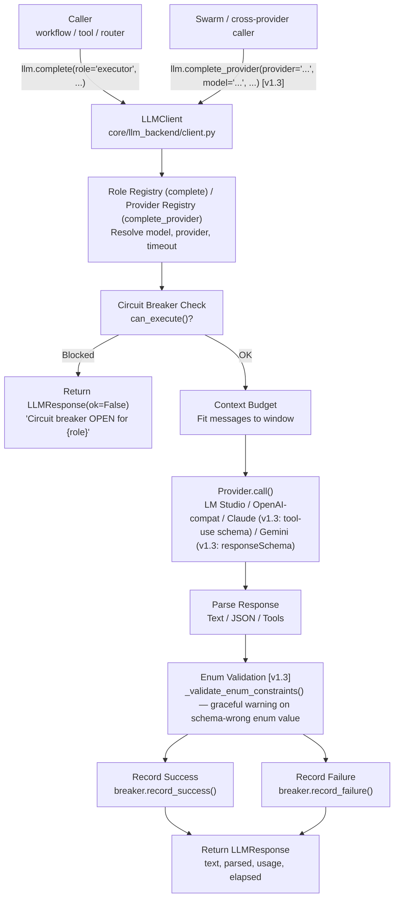

<- Back to [LLM Overview](../LLM.md)

# 🏗️ Architecture

## 🔗 Source Code Reference

| File | Purpose |
|------|---------|
| `core/llm.py` | Thin facade — re-exports `llm` singleton |
| `core/llm_backend/client.py` | `LLMClient`: `complete()`, `call()`, `complete_provider()` (v1.3), `_validate_enum_constraints()` (v1.3), `circuit_breaker_states` property |
| `core/llm_backend/config.py` | `RoleConfig` dataclass + `_build_role_configs()` + `ROLE_CONFIGS` module-level dict |
| `core/llm_backend/response.py` | `LLMResponse` dataclass |
| `core/memory_backend/budget.py` | Cognitive priority-based context budgeting (`budget_messages()`, 7-tier `ContextClass`) |
| `core/memory_backend/pruner.py` | VRAM artifact pruning |
| `core/llm_backend/rate_limit.py` | Rate limiting + raw token-count truncation + cost estimation |
| `core/llm_backend/circuit_breaker.py` | Per-model circuit breaker (CLOSED → OPEN → HALF_OPEN) |
| `core/llm_backend/factory.py` | `create_llm_client()` — composition root, provider registration |
| `core/llm_backend/provider.py` | `BaseProvider` ABC + `ProviderRegistry` |
| `core/llm_backend/providers/lmstudio.py` | `LMStudioProvider` (local OpenAI-compatible) |
| `core/llm_backend/providers/openai_compat.py` | `OpenAICompatibleProvider` (cloud) |
| `core/llm_backend/providers/anthropic.py` | `AnthropicProvider` — Claude (Anthropic Messages API, NOT OpenAI-compatible) |
| `core/llm_backend/providers/gemini.py` | `GeminiProvider` — Gemini (Google Generative Language API, NOT OpenAI-compatible) |
| `core/config.py` | Model names, timeouts, LLM server URL, `model_registry` |
| `core/metrics.py` | Token tracking (`track_llm_tokens`) |
| `core/runtime/activity_tracker.py` | Inference slot management |
| `core/contracts.py` | `validate_tool_call()` — schema validation for parsed tool-call JSON |

---

## 🌳 Module Tree

```text
core/llm.py              # Thin facade — re-exports singleton
core/llm_backend/
├── client.py            # LLMClient: complete(), call(), complete_provider() (v1.3),
│                        #   _validate_enum_constraints() (v1.3), circuit_breaker_states
├── config.py            # RoleConfig dataclass + _build_role_configs() + ROLE_CONFIGS
├── response.py          # LLMResponse dataclass
├── budget.py            # Rate limiting (ThreadSafeRateLimiter) + raw token-count
│                        # truncation + cost estimation. NOT the cognitive-tier
│                        # system — that lives in core/memory_backend/budget.py.
├── circuit_breaker.py   # Per-model failure tracking with auto-recovery
├── provider.py          # BaseProvider ABC + ProviderRegistry
├── factory.py           # create_llm_client() — composition root
└── providers/
    ├── lmstudio.py      # Local OpenAI-compatible provider
    └── openai_compat.py # Cloud provider (OpenAI, DeepSeek, etc.)
```

> ⚠️ There is no `context_budget.py`, `context_pruner.py`, `models.py`, `prompt_loader.py`, or `providers/base.py` anywhere in this repo. The cognitive-priority budgeting system lives in `core/memory_backend/budget.py`.

---

## 🔀 Call Flow



**v1.3 changes:**
- New entry path: `complete_provider()` for provider-direct calls (used by swarm's `_call_provider()`).
- Claude + Gemini providers now honor `json_schema` natively (tool-use conversion / responseSchema conversion respectively).
- New post-parse step: `_validate_enum_constraints()` walks the schema recursively and checks enum constraints on the parsed output. On failure it logs a warning but does NOT block (graceful degradation — cloud providers' schema enforcement isn't always perfect).

---

## 💡 Key Design Decisions

- **Thin facade** — `core/llm.py` constructs the `LLMClient` singleton and re-exports it. All implementation logic lives in `core/llm_backend/`. The facade exists for import simplicity, backward compatibility, and circular import prevention.
- **Role-based dispatch** — Callers specify roles (e.g., `"executor"`, `"router"`), not raw model strings. The role determines model, provider, timeout, temperature, and max tokens.
- **Sub-role fallback to executor** — When a role's model is not configured, it falls back to `executor_model`, then `planner_model`. Planner is expensive and reserved for complex reasoning.
- **Circuit breaker per role** — Each role has an independent circuit breaker keyed by role name (not model identifier). 3 cumulative failures → cooldown equal to that role's own timeout.
- **Context budgeting in `memory_backend/budget.py`** — The cognitive-priority message trimming system lives in `core/memory_backend/budget.py`, not `llm_backend/`. The module's own docstring is stale (still says `core/context_budget.py`).
- **Dual JSON extraction** — `client.py` and `router.py` both now delegate to `core/json_extract.py` (consolidated utility — single source of truth for all LLM JSON parsing). `router.py`'s `_extract_first_json` calls `extract_first_json()`. `client.py`'s `_parse_response` calls `extract_first_json()` then parses to handle both dicts and arrays. Schema validation for tool calls stays in `_parse_response` (it's llm-backend-specific).
- **JSON schema enforcement (v1.2)** — `json_schema` param on `complete()`/`call()`/`chat_completion()`. When provided, providers send `response_format={"type":"json_schema",...}`. LM Studio enforces via outlines internally — model cannot generate schema-invalid output. Stronger than `json_mode` (which only ensures valid JSON, not schema). `json_schema` takes precedence over `json_mode`; implies `json_mode` for parsing. Backward compatible (defaults to `None`). Phase 1: plumbing only — no roles use it yet. Phase 2 will define schemas per role.
- **Native json_schema for Claude + Gemini (v1.3)** — Pre-v1.3, Claude and Gemini silently ignored `json_schema` (Phase 1 plumbing only). v1.3 makes them honor it natively: Claude via Anthropic tool-use conversion (`AnthropicProvider` defines a tool with `input_schema` = the JSON schema, forces `tool_choice` to that tool, extracts the `tool_use` block's `input` as JSON, and stringifies it as the response `content`); Gemini via `responseSchema` conversion (`GeminiProvider` strips unsupported keys like `additionalProperties` and union types from the schema, sets `responseMimeType=application/json`). `supports_json_schema()` on `BaseProvider` returns `True` for all providers (#41) — callers can check before passing a schema. OpenAI-compatible providers additionally send a `name` field (from the schema `title` or default `"structured_output"`) and `strict: True` in `response_format` (#42) for tracing + enforcement. Post-parse enum validation (`_validate_enum_constraints()`, #43) walks the schema recursively and checks enum constraints on the parsed output, logging a warning on mismatch — graceful degradation when a cloud provider's schema enforcement lets a wrong enum value through.
- **`complete_provider()` API (v1.3, #22)** — Provider-direct call path on `LLMClient`: `complete_provider(provider="...", model="...", messages=[...], ...)`. Same circuit breaker + telemetry plumbing as `complete()`/`call()`, but the caller picks the provider by name rather than via role routing. Used by swarm's `_call_provider()` so swarm gets the same resilience and tracing as role-routed calls (pre-v1.3 swarm called `provider.chat_completion()` directly, bypassing the CB and losing telemetry). `_call_provider()` falls back to direct `provider.chat_completion()` when the method isn't available (e.g. unit-test mocks that patch the provider).
- **Provider abstraction** — `BaseProvider` ABC with `LMStudioProvider` and `OpenAICompatibleProvider`. Dynamic factory registration at startup based on `*_API_KEY` env vars. v1.2.2: 4 new providers — Claude (native AnthropicProvider), Gemini (native GeminiProvider), Z.ai + MiMo (OpenAI-compatible). v1.3: Claude and Gemini now honor `json_schema` natively (tool-use conversion / responseSchema conversion — no longer deferred). Both use httpx directly (no SDK deps), same as existing providers.
- **Thread-safe singleton** — `LLMClient` is a singleton. `LMStudioProvider` uses a single shared `httpx.Client` with double-checked locking (not thread-local). `CircuitBreaker` uses `threading.Lock` per instance.
- **Timeout single source of truth** — Timeout lives exclusively in `core/config.py` (`cfg.model_registry[role]["timeout"]`). Never in `llm_backend/config.py`.
- **No prompt loader** — System prompts are plain Python string constants passed directly by callers. No YAML-based prompt loading system exists.

---

## 🧪 Testing

```powershell
# Run all LLM backend tests
.\venv\Scripts\python tests/core/llm/ -W error --tb=short -v

> **Note:** Ensure `pytest` resolves to your venv. If not, use `python -m pytest` or the full venv path (`venv\Scripts\pytest.exe` on Windows, `venv/bin/pytest` on Unix).
```

**Mock strategy:**
- Mock `httpx.Client.post()` to avoid real LLM calls
- Mock `cfg` for model names and timeouts
- Circuit breaker tests use real breaker instances with mocked provider responses
- JSON schema tests mock the provider and verify `response_format` payload structure

**Test files:**
- `test_json_schema.py` — v1.2: schema enforcement (provider payload, parsing, backward compat)
- `test_json_extraction.py` — 3-layer JSON extraction in `_parse_response`
- `test_llm_client_integration.py` — `complete()` and `call()` message building
- `test_llm_client_errors.py` — error handling, circuit breaker integration
- `test_llm_response.py` — `LLMResponse` dataclass
- `test_circuit_breaker.py` — circuit breaker state transitions
- `test_llm_telemetry.py` — telemetry/metrics
- `test_llm_tracer.py` — trace logging

---

*Last updated: 2026-07-14 (v1.3). See [API.md](API.md) for method details, [CHANGELOG.md](CHANGELOG.md) for version history, [INSTRUCTIONS.md](INSTRUCTIONS.md) for AI editing rules.*
