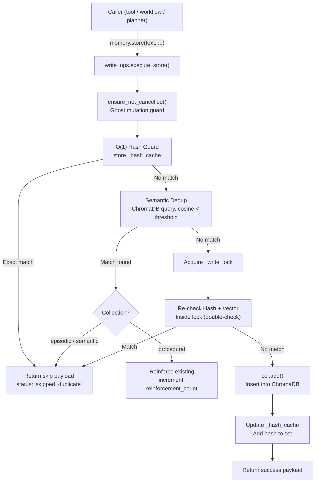
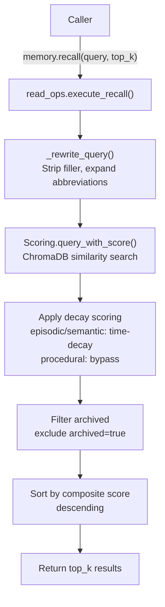
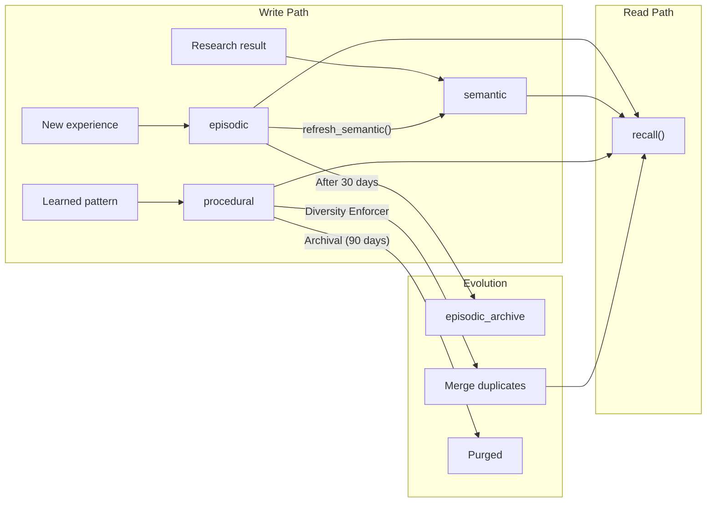
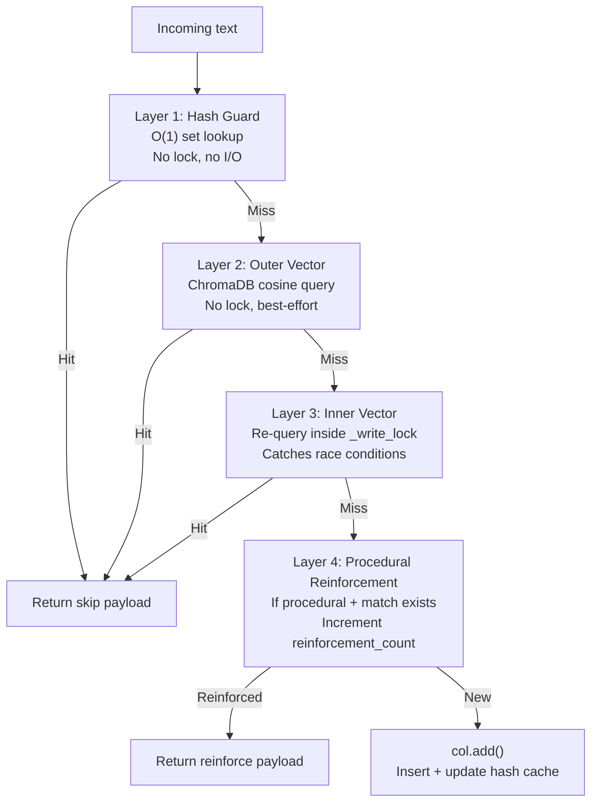
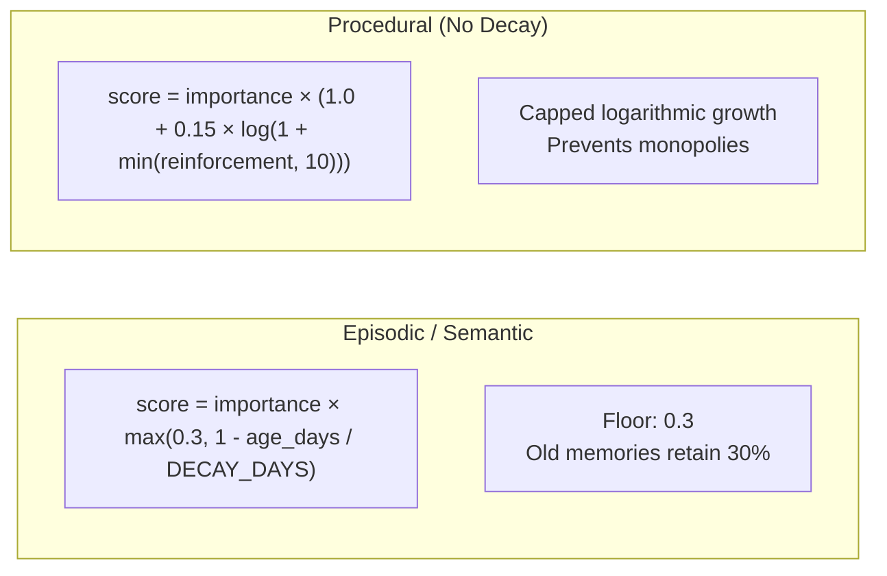
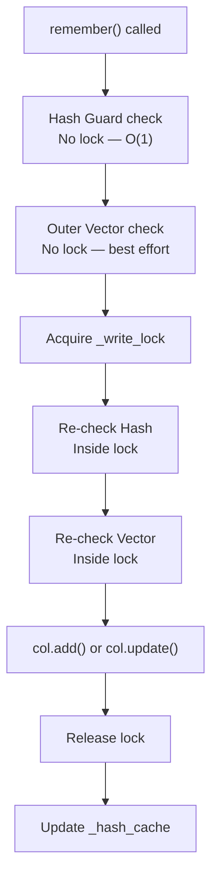
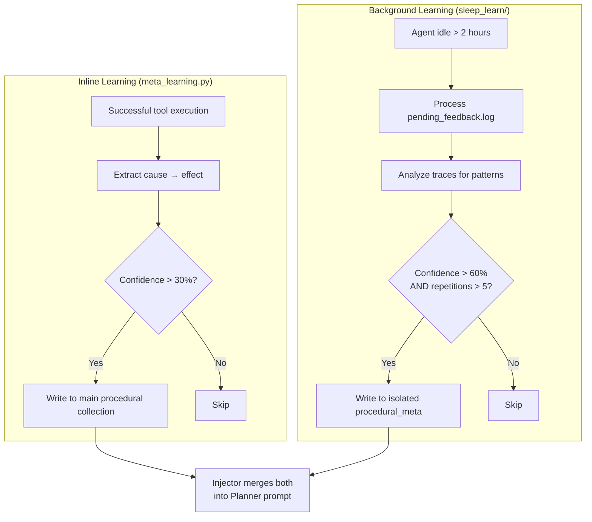
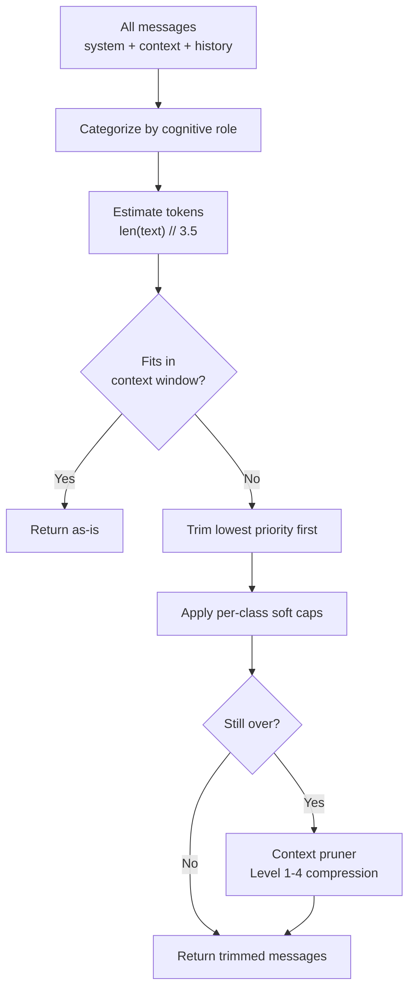

<- Back to [Memory Backend Overview](../MEMORY.md)

# 🏗️ Architecture

## 🔗 Source Code Reference

| File | Purpose |
|------|---------|
| `core/memory_engine.py` | Thin facade — re-exports `memory` singleton |
| `core/memory_backend/store.py` | `MemoryStore`: collections, stats, compact, delete, `store_chunked()` (v1.1) |
| `core/memory_backend/write_ops.py` | `execute_store()` — dedup pipeline; `execute_store_chunked()` — batch insert for chunked stores (v1.1) |
| `core/memory_backend/read_ops.py` | `execute_recall()`, `execute_recall_context()` |
| `core/memory_backend/scoring.py` | 4-factor confidence scoring, query rewriting |
| `core/memory_backend/maintenance.py` | `execute_delete/prune/summarize/stats/diversity_maintenance()` |
| `core/memory_backend/telemetry.py` | Opik integration for observability |
| `core/memory_backend/eviction.py` | `EvictionQueue` + `flusher_loop()` — async WAL-spill for evicted context |
| `core/memory_backend/janitor.py` | `archive_old_episodes()`: episodic archival only |
| `core/memory_backend/rule_schema.py` | **v1.2 NEW.** Unified procedural rule schema (L3 contract). `build_unified_metadata()` + `normalize_rule_fields()` + `validate_tags()` + `normalize_tags()` + `compute_text_hash()`. The keystone of the merge — both writers conform to this shape. |
| `core/memory_backend/constants.py` | Shared constants (banned files, limits, META_FIELDS with v1.1 chunk fields) |
| `core/memory_backend/client.py` | `get_client(timeout=60)` — ChromaDB client singleton |
| `core/memory_backend/budget.py` | Cognitive priority-based context budgeting (7-tier) |
| `core/memory_backend/pruner.py` | VRAM context pruning middleware — artifact preservation + truncation |
| `core/memory_backend/meta_learning.py` | Inline learning, heuristic/template-based |
| `core/sleep_learn/daemon.py` | Background daemon startup |
| `core/sleep_learn/feedback.py` | Pending feedback processing |
| `core/sleep_learn/distiller.py` | Trace analysis → rule extraction |
| `core/sleep_learn/filters.py` | New rules, dedup, contradictions |
| `core/sleep_learn/storage.py` | Write rules to isolated collection |
| `core/sleep_learn/injector.py` | Merge rules into Planner prompt |
| `core/sleep_learn/config.py` | SLEEP_* configuration constants |
| `core/sleep_learn/sweeper.py` | Phase 1: Passive observation gathering |
| `core/sleep_learn/janitor.py` | Purge stale rules from isolated collection |
| `core/runtime/cancellation.py` | `ensure_not_cancelled()` — ghost mutation guard |
| `core/config.py` | Memory tuning params, ChromaDB paths |

---

## Module Tree

```text
core/memory_engine.py          # Thin facade — re-exports MemoryStore singleton
core/memory_backend/
├── store.py                   # MemoryStore class: collections, _write_lock, stats, store_chunked() (v1.1)
├── write_ops.py               # execute_store() — TOCTOU-safe dedup + insert; execute_store_chunked() — batch insert (v1.1)
├── read_ops.py                # execute_recall(), execute_recall_context()
├── scoring.py                 # _decay_score() + _rewrite_query() (model-free)
├── maintenance.py             # execute_delete/prune/summarize/stats/diversity_maintenance()
├── telemetry.py               # RecallTracker — RAM buffer, periodic ChromaDB flush
├── eviction.py                # EvictionQueue class + flusher_loop() — disk spill queue
├── janitor.py                 # archive_old_episodes() — episodic archival only
├── constants.py               # COLLECTION_*, META_FIELDS (v1.1: +source_doc_id/chunk_index/chunk_count), dedup thresholds
├── client.py                  # get_client(timeout=60) — ChromaDB client singleton
├── budget.py                  # Cognitive context budgeting (7-tier ContextClass)
├── pruner.py                  # VRAM context pruning (artifact preservation + truncation)
├── meta_learning.py           # distill_and_store() + MetaLearner — inline learning from traces
└── procedural/                # distill.py, prompts.py, validate.py

core/sleep_learn/              # Background meta-learning daemon
├── daemon.py                  # start_background_daemon() — startup + midnight scheduler
├── feedback.py                # process_feedback() — confidence scoring loop
├── distiller.py               # distill_observation() — LLM rule extraction (60s timeout)
├── filters.py                 # is_quality_rule() — generic/dangerous rule rejection
├── storage.py                 # save_rule() — write to isolated ChromaDB collection
├── injector.py                # inject_rules_into_prompt() + get_relevant_rules()
├── logger.py                  # log_event() — structured JSONL logging
├── config.py                  # SLEEP_* configuration constants
├── sweeper.py                 # sweep_recent_observations() — Phase 1 passive event gathering
└── janitor.py                 # purge_stale_rules() — confidence + age-based rule purging
```

---

## Thin Facade Pattern

```python
# core/memory_engine.py — What callers see
from core.memory_backend.store import MemoryStore

# Singleton export
memory = MemoryStore()

# Usage throughout the codebase
from core.memory_engine import memory
memory.store(text="...", memory_type="semantic")
results = memory.recall("How does ChromaDB work?", top_k=5)
```

---

## Data Flow: Write Path



---

## Data Flow: Read Path



---

## Three Collections

| Collection | Purpose | Use Cases | Dedup Threshold | Decay | Pruning |
|------------|---------|-----------|-----------------|-------|---------|
| **episodic** | What happened | Task runs, workflow outcomes, errors, evicted context | 0.05 cosine sim | Yes (30-day half-life) | Archived after 30 days |
| **semantic** | What you know | Facts, research, domain knowledge, documentation | 0.15 cosine sim | Yes (30-day half-life) | Vacuum removes low-scored |
| **procedural** | How to do it | Fix patterns, solutions, reusable approaches | 0.08 cosine sim | **No** (bypass) | Protected from pruning |

### Collection Lifecycle



---

## Four-Layer Deduplication

Every write passes through four dedup layers before touching ChromaDB:

### Layer Architecture



### Layer Details

| Layer | Lock? | Cost | Catches | Implementation |
|-------|-------|------|---------|----------------|
| **1. Hash Guard** | No | O(1) | Exact duplicates | `content_hash in store._hash_cache` |
| **2. Outer Vector** | No | ~5ms | Semantic duplicates | ChromaDB `query()` with cosine threshold |
| **3. Inner Vector** | Yes | ~5ms | Race conditions | Re-query inside `_write_lock` |
| **4. Procedural** | Yes | ~5ms | Duplicate rules | Increment `reinforcement_count` if match |

### Duplicate Response Payload

When a duplicate is found, the system returns a structured payload (not a blind skip) to prevent LLM retry loops:

```json
{
  "status": "skipped_duplicate",
  "reason": "semantic_match",
  "action": "reference_existing",
  "directive": "This knowledge is already in memory. Do not retry.",
  "matched_snippet": "First 200 chars of existing text...",
  "existing_id": "uuid",
  "retry_recommended": false
}
```

### Procedural Reinforcement

If a semantic duplicate is found in the **procedural** collection, the system does NOT skip. It:
1. Fetches the existing memory
2. Increments `reinforcement_count`
3. Updates `last_reinforced` timestamp
4. Calls `col.update()` inside the write lock

This ensures frequently-reinforced rules surface higher in recall.

---

## Scoring System

### 4-Factor Confidence Score

Every memory has a composite confidence score calculated from four factors:

```python
confidence = (
    source_trust_weight      # 0.0-1.0: Trust level of the source
    × quality_score          # 0.0-1.0: Content quality (length, coherence)
    × verification_bonus       # 0.0-1.0: Whether it was verified/reinforced
    × time_decay               # 0.0-1.0: Age-based decay (episodic/semantic only)
)
```

### Decay Formulas



| Collection | Decay? | Formula | Floor | Boost |
|------------|--------|---------|-------|-------|
| episodic | Yes | `importance × max(0.3, 1 - age/30)` | 0.3 (30%) | None |
| semantic | Yes | `importance × max(0.3, 1 - age/30)` | 0.3 (30%) | None |
| procedural | **No** | `importance × (1.0 + 0.15 × log(1 + reinforcements))` | None | Logarithmic, capped at 10 |

### Query Rewriting

Before hitting ChromaDB, queries pass through a **model-free** rewrite step in `scoring.py`:

| Transformation | Example |
|----------------|---------|
| Strip filler words | "How do I **actually** fix this?" → "fix this" |
| Expand abbreviations | "py error" → "python error" |
| Preserve question starters | "What is ChromaDB" → kept as-is |
| Lowercase normalization | "ChromaDB Query" → "chromadb query" |

> ⚠️ **No LLM calls here.** Query rewriting is deliberately model-free for speed.

---

## Thread Safety & Concurrency

### Write-Only Lock Pattern



**Key rules:**
- **Reads (`recall()`) are never locked** — ChromaDB handles concurrent reads internally
- **Writes are serialized** per collection via `threading.Lock()`
- **Double-check pattern** — Hash and vector are checked both outside and inside the lock
- **Hash cache sync** — `_hash_cache.discard()` is called on delete/prune to prevent ghost entries

### Cancellation Guards

All write operations check `ensure_not_cancelled(trace_id)` before mutating:

```python
from core.runtime.cancellation import ensure_not_cancelled

def remember(text, collection, trace_id, ...):
    ensure_not_cancelled(trace_id)  # Abort if workflow cancelled
    # ... proceed with write
```

This prevents "ghost mutations" — writes that happen after a workflow is cancelled but before the cancellation signal propagates.

---

## Two Learning Systems

The memory backend has **two parallel systems** that extract procedural rules from execution history:

### System Comparison



### Detailed Comparison

| Aspect | Inline (`meta_learning.py`) | Background (`sleep_learn/`) |
|--------|---------------------------|---------------------------|
| **When** | After successful tool execution | During idle periods (>2h) or at startup + midnight |
| **Threshold** | 30% confidence (heuristic) | 60% confidence + 5+ repetitions |
| **Collection** | Main `procedural` | Isolated `procedural_meta` |
| **Latency** | Immediate effect | Deferred (next session) |
| **Source** | Single execution context | Cross-trace pattern analysis |
| **Dedup** | Hash + vector on main collection | Hash + vector on isolated collection |

### Injection Path

Both systems converge at the **injector** (`sleep_learn/injector.py`), which merges rules from both collections into the Planner's system prompt:

```python
# Injector reads from both collections
rules_main = memory.recall("", collection="procedural", top_k=20)
rules_sleep = get_relevant_rules(query, k=SLEEP_LEARN_MAX_INJECTED_RULES)

# Merges by hash dedup, injects into Planner prompt
prompt = base_prompt + "\n\n# Learned Rules\n" + merged_rules
```

### Feedback Loop

```
Tool execution → success/failure logged to pending_feedback.log
    → Sleep daemon processes feedback (every 10min during idle)
    → Distiller extracts rules via LLM (60s timeout)
    → Filters: new rules only, dedup, contradiction check
    → Storage: write to procedural_meta collection
    → Injector: merge into Planner prompt
    → Next execution benefits from learned rules
```

---

## Maintenance & Cleanup

### Diversity Enforcement (Procedural Collection)

To prevent procedural memory pollution (near-duplicate or contradictory rules):

| Step | Trigger | Action |
|------|---------|--------|
| **Greedy Clustering** | Idle > 4h AND > 7 days since last run | Query top-20 neighbors, group rules with cosine distance < 0.12 |
| **Champion Selection** | Cluster with >1 rule | Highest-scoring rule becomes "Champion" |
| **Absorption** | Champion selected | `champ_score + log10(1 + sum(loser_scores))` — prevents runaway inflation |
| **Contradiction Guard** | Opposing polarity detected | Flag `contradiction_flagged: true`, don't merge |
| **Stale Archival** | `recall_count == 0` AND age > 30 days | Flag `archived: true` |
| **Permanent Purge** | `archived: true` AND age > 90 days | Delete from ChromaDB |

### Janitor Daemon

Runs during Sleep & Learn cycles or manually via `memory(action="janitor")`:

| Operation | Default Threshold | Action |
|-----------|-------------------|--------|
| Episodic archival | 30 days (`ARCHIVE_AGE_DAYS`) | Move to `episodic_archive` collection |
| Rule purging | 90 days (`PURGE_AGE_DAYS`) | Delete procedural rules |
| Confidence purge | score < 0.3 | Delete rules whose confidence dropped |
| ChromaDB compaction | On-demand | Force `chromadb.Client.persist()` |

### Eviction Engine

When working memory exceeds the context budget:

1. Low-priority state fields are offloaded to `episodic` collection
2. Replaced with clean placeholders in working memory
3. Offloading happens asynchronously (WAL-spill queue) to avoid blocking the hot path

The `eviction.py` module implements this:

- `EvictionQueue.push(text, metadata)` — Append to JSONL (crash-safe + fsync), then add to RAM queue
- `flusher_loop()` — Background thread that flushes queue to ChromaDB every 5 seconds, 50 items per batch
- `commit_success(remaining)` — Atomic `os.replace()` to truncate disk queue only after successful ChromaDB write
- On failure, disk queue is NOT touched — items remain for next restart

### Memory Vacuum

```python
memory.prune()
# Removes: low-scored episodic (>30 days), stale semantic (>60 days)
# Preserves: procedural (protected), critical/protected tags
```

### Protected Memories

These are immune to automatic pruning:

| Protection | Applies To | How |
|------------|-----------|-----|
| Collection | `procedural` | Never pruned by `memory.prune()` |
| Tag: `"summary"` | Any collection | Skipped during vacuum |
| Tag: `"critical"` | Any collection | Skipped during vacuum |
| Tag: `"protected"` | Any collection | Skipped during vacuum |

---

## Context Budgeting

The context budget system decides what information enters the LLM's context window during long workflows.

### Cognitive Categories

| Category | Priority | Trim Strategy | Max Chars | Examples |
|----------|----------|---------------|-----------|----------|
| `procedural` | 1 (highest) | `tail` (keep latest) | 4000 | Rules, instructions |
| `core_facts` | 2 | `smart` (scored) | 3000 | Key facts, entity summaries |
| `tool_outputs` | 3 | `tail` (keep latest) | 8000 | Tool results, web scrapes |
| `conversational` | 4 | `head` (keep earliest) | 4000 | User/assistant messages |
| `social` | 5 (lowest) | `head` (keep earliest) | 2000 | Greetings, acknowledgments |

### Budget Flow



### Compression Levels (Context Pruner)

| Level | Action | When |
|-------|--------|------|
| 1 | Truncate tool outputs to `max_chars` | Tool output > 4000 chars |
| 2 | Drop lowest-priority messages | Still over budget after L1 |
| 3 | Truncate system prompt tail | System prompt > 2000 chars |
| 4 | Hard truncation with notice | All else fails |

The `pruner.py` module (`core/memory_backend/pruner.py`) implements VRAM-aware context pruning:

- `prune_text(tool_name, text, trace_id)` — For string returns: save artifact atomically, truncate intelligently, append recovery warning
- `prune_tool_dict(tool_name, data, trace_id)` — For dict returns: inject `_pruned`, `_original_chars`, `_truncated_chars`, `_artifact_path`, `_recovery_hint` metadata keys
- Tool-aware truncation: `python_exec`/`cli` keep tail (errors at end); web/default keep head+tail
- `cleanup_old_artifacts(max_age_days=7)` — Delete artifacts older than 7 days on startup

---

## 🧪 Testing

```powershell
# Run all memory backend tests
.\venv\Scripts\python tests/core/memory/ -W error --tb=short -v

> **Note:** Ensure `pytest` resolves to your venv. If not, use `python -m pytest` or the full venv path (`venv\Scripts\pytest.exe` on Windows, `venv/bin/pytest` on Unix).
```

**Mock strategy:**
- Mock `chromadb.Collection` for all unit tests
- Mock `cfg` for threshold and path configuration
- Use `reset_memory_state` fixture to clear globals between tests

---

*Last updated: 2026-07-08. See [API.md](API.md) for backend API reference, [CHANGELOG.md](CHANGELOG.md) for version history, [INSTRUCTIONS.md](INSTRUCTIONS.md) for AI editing rules.*
