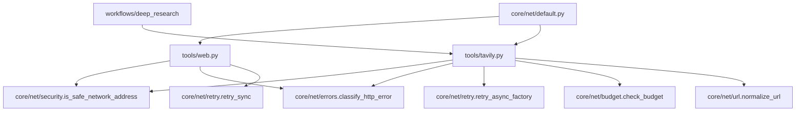

<- Back to [NET Overview](../NET.md)

# 🏗️ Architecture

## 🔗 Source Code Reference

| File | Purpose |
|------|---------|
| `core/net/__init__.py` | **v1.3:** Public re-exports for `from core.net import ...` |
| `core/net/security.py` | `is_safe_network_address()`, `_assert_safe_urls()` — cross-tool SSRF protection |
| `core/net/errors.py` | `classify_http_error()`, `is_retryable_error()`, `get_retry_delay()`, `register_retryable_exception()` — shared HTTP error classification |
| `core/net/retry.py` | `retry_sync()` + `retry_async_factory()` — unified retry with CB hooks |
| `core/net/budget.py` | `APICostTracker`, `record_tool_call()`, `check_budget()` — cost tracking |
| `core/net/url.py` | `normalize_url()`, `extract_domain()`, `is_same_domain()` — URL utilities |
| `core/net/default.py` | `SEARCH_MAX_RESULTS`, `CRAWL_MAX_DEPTH`, `RETRY_BASE_DELAY`, `CB_FAILURE_THRESHOLD` — shared defaults |
| `core/contracts.py` | `ok()` / `fail()` — standardized return dicts with `trace_id` + `error_code` injection |
| `tools/tavily.py` | `@tool` + `@meta_tool` facade: action dispatch, validation |
| `core/config.py` | `cfg.tavily_api_key`, `cfg.tavily_timeout` |
| `tests/tools/tavily/` | Tavily test suite |
| `tests/core/net/` | Net test suite |
| `workflows/deep_research_impl/nodes/search.py` | Uses `tavily(action="search")` facade |

---

## 🌳 Module Tree

```text
core/net/
├── __init__.py          # Public re-exports for cross-tool adoption
├── errors.py            # HTTP error classification, retryable detection, backoff calculation
├── security.py          # SSRF prevention, URL safety checks, IP validation
├── retry.py             # Synchronous and async retry wrappers with circuit breaker hooks
├── budget.py            # API cost tracking and budget enforcement
├── url.py               # URL normalization and domain extraction
└── default.py           # Shared default constants across all network tools
```

---

## 🔀 Integration Flow



*(Fill this section with relevant info from edits and refactors. Add mermaid diagrams as they are learned.)*

---

## 💡 Key Design Decisions

- **Unified error classification** — `classify_http_error()` converts any HTTP exception into a canonical category string (`TIMEOUT`, `CONNECT_ERROR`, `RATE_LIMITED`, `SERVER_ERROR`, `CLIENT_ERROR`, `NETWORK_ERROR`, `BOT_BLOCKED`, `UNKNOWN`). All tools share the same taxonomy.
- **Retryable detection** — `is_retryable_error()` checks both status codes (`408`, `429`, `5xx`) and exception types. SDK-specific exceptions can be registered via `register_retryable_exception()`.
- **Exponential backoff with jitter** — `get_retry_delay()` calculates `min(base * 2^attempt, max_delay)` plus optional jitter. Single source of truth for all tools.
- **Thread-safe budget tracker** — `APICostTracker` uses `threading.RLock()` for nested calls. Daily reset happens automatically on date change.
- **Singleton budget tracker** — `_budget_tracker` is a module-level singleton. Tests reset it via `_calls.clear()` + `_configs.clear()`.
- **DNS timeout safety** — `socket.getaddrinfo` has no `timeout` kwarg. `_resolve_safe()` uses `ThreadPoolExecutor` + `future.result(timeout=)`.
- **IPv6 bracket parsing** — `[::1]:8080` handled correctly. Unbracketed literals (`2001:db8::1`) bypass DNS and use `ipaddress` module directly.
- **`0.0.0.0` and `::` blocked** — `ip.is_unspecified` check added to all 4 IP validation blocks (v1.4). None of `is_private`, `is_loopback`, `is_reserved`, `is_multicast` catch these.
- **Lazy SDK exception registration** — Tools call `register_retryable_exception()` at import time to add SDK-specific retryable errors without modifying `core/net/errors.py`.
- **Cross-tool re-exports** — `core/net/__init__.py` exposes all public APIs so tools can use `from core.net import ...` instead of deep imports.
- **Circuit breaker integration** — `retry_async_factory` accepts `on_success`/`on_failure` callbacks. `on_failure` only fires for retryable errors (v1.4 fix), and only on final raise / retry exhaustion (v1.5 fix) — not per-attempt. This prevents CB trips on validation/4xx errors AND prevents CB failure_count accumulation on successful-but-retried calls.
- **Module-level `_sleep` reference (v1.6)** — `retry.py` defines `_sleep = time.sleep` at module level and calls `_sleep(delay)` instead of `time.sleep(delay)`. This lets tests patch `core.net.retry._sleep` (a module attribute, scoped to `retry.py`) without globally mocking `time.sleep` (which is a singleton module — patching `core.net.retry.time.sleep` catches stray calls from ANY background thread, e.g. the browser reaper's `time.sleep(60)` loop, causing `assert_called_once()` to fail with thousands of stray calls).
- **URL normalization for cache keys** — `normalize_url()` lowercases, strips trailing slashes, sorts query parameters. Deterministic across tools.
- **Domain comparison with `www.` strip** — `is_same_domain()` considers `www.example.com` and `example.com` as identical (v1.3). Boundary check prevents `www2.example.com` -> `2.example.com` (v1.4).
- **OPEN→HALF_OPEN transition** — Counts against `half_open_max_calls` (v1.3 fix). Was allowing 1 extra call.

---

## 🧪 Testing

```powershell
# Run all core/net tests
D:\mcp\agent\venv\Scripts\pytest.exe tests/core/net/ -W error --tb=short -v
```

> **Note:** Ensure `pytest` resolves to your venv. If not, use `python -m pytest` or the full venv path (`venv\Scripts\pytest.exe` on Windows, `venv/bin/pytest` on Unix).

**Test coverage:**

| File | Tests | Coverage |
|------|-------|----------|
| `test_security.py` | 12 | SSRF guard, IPv6 (loopback + public), empty hostname, scheme validation |
| `test_web_errors.py` | 12 | Classification, BOT_BLOCKED, 408, SDK duck-typing, retry delay, NetworkError |
| `test_retry.py` | 6 | Success, retry, exhaust, non-retryable, custom predicate, backoff, jitter |
| `test_budget.py` | 6 | Record, afford, warning, status, thread safety, daily reset |
| `test_url.py` | 7 | Normalize, domain extract, same domain (www stripping) |
| `test_path_validation.py` | 5 | Path-specific SSRF validation |
| `test_ssrf_edge_cases.py` | — | Edge cases (moved from `tests/core/`) |
| `test_ssrf_protection.py` | 7 | SSRF protection tests |

**Shared test fixtures:**

```python
# tests/core/net/conftest.py
import pytest
from core.net.budget import _budget_tracker

@pytest.fixture(autouse=True)
def reset_budget_tracker():
    """Reset budget tracker before each test."""
    _budget_tracker._calls.clear()
    _budget_tracker._configs.clear()
    _budget_tracker._last_reset_date = datetime.date.today()
    yield
```

**Security test isolation:**

```python
# In any test file that tests security
@pytest.fixture(autouse=True)
def patch_allowed_hosts(monkeypatch):
    from core.net import security
    monkeypatch.setattr(security.cfg, "allowed_internal_hosts", frozenset())
```

**Async resource warning suppression:**

```python
# In tavily/browser test conftest.py
import warnings

@pytest.fixture(autouse=True)
def filter_resource_warnings():
    warnings.filterwarnings("ignore", category=ResourceWarning)
    yield
```

**Current test layout:**
```text
tests/core/net/                  # v1.2/v1.3
├── conftest.py                  # v1.3: budget tracker reset fixture
├── test_security.py
├── test_web_errors.py
├── test_retry.py                # v1.3: retry_async_factory tests
├── test_budget.py               # v1.3: daily reset, RLock tests
├── test_url.py
├── test_path_validation.py
├── test_ssrf_edge_cases.py
└── test_ssrf_protection.py
```

---

## 🔄 Migration Notes

### `core/security.py` → `core/net/security.py`

```python
# BEFORE
from core.security import is_safe_url

# AFTER
from core.net.security import is_safe_network_address, _assert_safe_urls
```

### `core/web_errors.py` → `core/net/errors.py`

```python
# BEFORE
from core.web_errors import is_retryable

# AFTER
from core.net.errors import is_retryable_error, classify_http_error
```

### Per-tool constants → `core/net/default.py`

```python
# BEFORE (in tavily_ops/actions/search.py)
MAX_RESULTS = 5

# AFTER
from core.net.default import SEARCH_MAX_RESULTS
```

---

*Last updated: 2026-07-18 (v1.6 _sleep fix). See [API.md](API.md) for module details, [CHANGELOG.md](CHANGELOG.md) for version history, [INSTRUCTIONS.md](INSTRUCTIONS.md) for AI editing rules.*
