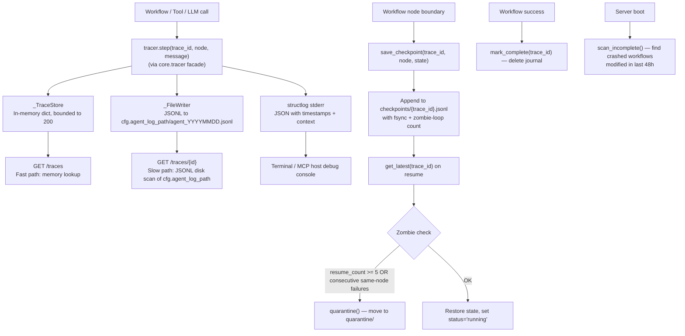

<- Back to [Observability Overview](OBSERVABILITY.md)

# 🏗️ Architecture

## 🔗 Source Code Reference

| File | Purpose |
|------|---------|
| `core/observability/__init__.py` | Empty package init — no side effects |
| `core/observability/tracer_engine.py` | `Tracer` singleton, `_FileWriter`, `_TraceStore`, `generate_trace_id()` — the actual tracer implementation (moved from `core/tracer.py` in v1.3) |
| `core/observability/reader.py` | `read_trace()`, `list_recent_traces()` — memory + disk retrieval (moved from `core/tracer_reader.py`) |
| `core/observability/metrics.py` | Prometheus metrics registry — node duration, task status, TDD iterations, LLM tokens (moved from `core/metrics.py`) |
| `core/observability/checkpoint.py` | `save_checkpoint()`, `get_latest()`, `mark_complete()`, `scan_incomplete()`, `quarantine()`, `sanitize_state()` — workflow resumability journal (moved from `workflows/helpers/checkpoint.py`) |
| `core/tracer.py` | Thin facade — re-exports `tracer`, `Tracer`, `_TraceStore`, `generate_trace_id`, `_writer`, and other module-level names from `tracer_engine.py`. Exists so 71+ callers don't need to change import paths. |
| `core/config.py` | `log_path`, `agent_log_path`, `autocode_debug`, `workspace_root` configuration |
| `core/gateway_backend/routes/traces.py` | HTTP endpoints: `GET /traces`, `GET /traces/{id}` — imports `read_trace`/`list_recent_traces` from `core.observability.reader` |
| `core/gateway_backend/routes/metrics.py` | HTTP endpoint: `GET /metrics` — imports `generate_metrics`/`get_content_type` from `core.observability.metrics` |
| `workflows/base.py` | Workflow dispatcher — imports `save_checkpoint`/`get_latest`/`mark_complete` from `core.observability.checkpoint` |
| `server.py` | MCP entrypoint — imports `scan_incomplete` from `core.observability.checkpoint` for boot-time crash recovery |

---

## 🌳 Module Tree

```text
core/observability/
├── __init__.py            # Empty package init
├── tracer_engine.py       # Tracer singleton, _FileWriter, _TraceStore, generate_trace_id
├── reader.py              # Trace retrieval (memory fast-path, disk slow-path)
├── metrics.py             # Prometheus metrics (complementary)
└── checkpoint.py          # Workflow resumability journal (append-only JSONL per trace)

core/tracer.py             # Thin facade → re-exports from observability/tracer_engine.py
```

### Component Hierarchy

```text
core.tracer (facade)
└── core.observability.tracer_engine
    ├── Trace ID Generator (uuid4 hex, 12 chars)
    ├── structlog Config (stderr only, JSON renderer)
    │   └── Graceful Fallback (standard logging if structlog missing)
    ├── _FileWriter (Thread-safe JSONL, daily rotation, atexit close)
    ├── _TraceStore (In-memory, bounded to 200 traces, FIFO eviction)
    └── tracer = Tracer()  # Module-level singleton

core.observability.reader
├── Fast Path (In-memory lookup via _TraceStore)
└── Slow Path (Disk scan of last 14 days of JSONL logs in cfg.agent_log_path)

core.observability.metrics
├── registry (CollectorRegistry — singleton if prometheus_client available)
├── NODE_DURATION (Histogram, label=node_name)
├── TASK_STATUS (Counter, label=status)
├── TDD_ITERATIONS (Histogram)
├── LLM_TOKENS (Counter, label=role)
└── track_node(), track_task_status(), track_tdd_iterations(), track_llm_tokens(),
    generate_metrics(), get_content_type()

core.observability.checkpoint
├── CHECKPOINT_DIR = {workspace_root}/checkpoints
├── QUARANTINE_DIR = {workspace_root}/checkpoints/quarantine
├── sanitize_state() — recursive JSON-safe primitive extraction (os.fspath for Path-like)
├── save_checkpoint() — append entry, fsync, zombie-loop counting
├── get_latest() — read last entry, zombie quarantine, version validation
├── mark_complete() — delete journal on success
├── quarantine() — move to QUARANTINE_DIR
└── scan_incomplete() — find workflows modified in last 48h still non-terminal
```

---

## 🔀 Data Flow



---

## 💡 Key Design Decisions

### Tracer & Reader
- **Thin facade pattern** — `core/tracer.py` is a thin re-export facade. The actual `Tracer` implementation, `_FileWriter`, `_TraceStore`, and `generate_trace_id` live in `core/observability/tracer_engine.py`. The facade exists to maintain the stable `from core.tracer import tracer` import pattern used by 71+ files across the codebase, so the v1.3 extraction didn't require touching every consumer. The same pattern is used by `core/llm.py` (facade) → `core/llm_backend/` (impl) and `core/memory_engine.py` (facade) → `core/memory_backend/` (impl).
- **MCP stdio safety** — NEVER writes to `sys.stdout`. All output goes to `sys.stderr` and JSONL files. Any `print()` without `file=sys.stderr` will crash the MCP connection.
- **Dual output** — Structured stderr (console) + JSONL files (persistent, queryable). Provides both real-time visibility and post-mortem analysis.
- **Trace ID propagation** — Every operation tagged with 12-char hex ID from `uuid4`. Enables end-to-end correlation across workflows, tools, and LLM calls.
- **Bounded memory** — In-memory `_TraceStore` capped at 200 traces with FIFO eviction. Prevents unbounded memory growth in long-running agents.
- **Thread-safe** — All writes guarded by `threading.Lock()`. Concurrent workflow executions are safe.
- **Graceful degradation** — Falls back to standard `logging` if `structlog` is missing. Core observability never breaks from a missing optional dependency.
- **Daily rotation** — JSONL files rotate daily (`agent_YYYYMMDD.jsonl`). `_FileWriter` checks the date on every write.
- **Silent I/O errors** — `_FileWriter` intentionally ignores non-fatal disk errors. A logging failure should never crash the agent. KeyboardInterrupt/SystemExit are always re-raised.
- **Auto-flush + atexit close** — `f.flush()` after every write, plus `atexit.register(_writer.close)` for clean shutdown.
- **Reader dual-path** — `read_trace()` first checks in-memory store (fast path), then falls back to disk scan of last 14 days of JSONL logs in `cfg.agent_log_path` (slow path). The 14-day limit prevents I/O explosion on huge log dirs.

### Metrics
- **Prometheus optional** — All metrics helpers are no-ops if `prometheus_client` is not installed. Caller code can call `track_node(...)` from anywhere without guarding imports.
- **Singleton registry** — One `CollectorRegistry()` shared by all metric instruments. Tracked: `autocode_node_duration_seconds` (histogram), `autocode_task_status_total` (counter), `autocode_tdd_iterations` (histogram), `autocode_llm_tokens_total` (counter).
- **Trace-Metrics separation** — `tracer.step()` provides qualitative data (what happened, when, with what context). `metrics.py` provides quantitative data (how long, how many, what status). Both are needed for full observability.

### Checkpoint Journal
- **Append-only JSONL** — One file per trace (`checkpoints/{trace_id}.jsonl`). Each entry is a single JSON line with `ts`, `node`, `status`, `state`, `resume_count`, `version`. Append-only means partial writes never corrupt earlier entries.
- **fsync on every write** — `f.flush()` + `os.fsync(f.fileno())` after every append. Crash-safe — the OS is forced to flush to disk before the file is closed.
- **Zombie detection** — Two heuristics: (1) `resume_count >= MAX_RESUMES (5)` — a workflow that's been resumed 5+ times is stuck in a loop. (2) Consecutive same-node failures (`prev.status == failed && entry.status == failed && prev.node == entry.node`) — pathological retry loop. Either triggers `quarantine()` (move to `quarantine/` subdir) and returns `None` so the caller starts fresh.
- **Version validation** — Each entry has a `version: 1` field. `get_latest()` injects `_checkpoint_version` into the restored state so consumers (e.g., `workflows/base.py run_workflow`) can reject incompatible checkpoints.
- **sanitize_state()** — Recursively extracts JSON-safe primitives (str, int, float, bool, None, datetime, Decimal, UUID, Path-like via `os.fspath()`). Drops non-serializable objects (httpx clients, locks, CircuitBreakers) by returning `None`. Prevents `json.dumps()` from crashing on unserializable workflow state.
- **MAX_RESUMES = 5** — Hard cap on resume attempts. Tunable via the module-level constant (no env var yet).
- **scan_incomplete() cutoff** — Only scans journals modified in the last 48 hours. Prevents the boot-time scan from re-trying ancient crashed workflows that the user has likely forgotten about.

---

## 🧪 Testing

```bash
# Run all observability tests
python -m pytest tests/core/observability/ -v
```

**Test layout (v1.1 — 147 tests across 5 files):**
```text
tests/core/observability/
├── conftest.py               # Shared fixtures (see below)
├── test_tracer_engine.py     # generate_trace_id, _TraceStore (create/get/update/append/bounding/thread-safety),
│                             # _FileWriter (create/append/rollover/error-suppression), Tracer full API
│                             # (new_trace/step/error/warning/finish/get/recent/summary), P0 kwargs-spread fix,
│                             # facade re-exports, integration lifecycle
├── test_reader.py            # read_trace (empty id, fast-path, slow-path, malformed lines, substring prefilter,
│                             # step sorting, 14-day limit, extra fields, no trace_start), list_recent_traces,
│                             # _format_trace, _scan_disk
├── test_metrics.py           # track_node, track_task_status, track_tdd_iterations, track_llm_tokens,
│                             # generate_metrics, get_content_type, registry
└── test_checkpoint.py        # sanitize_state (all types: primitives, datetime, Decimal, UUID, Path, bytes,
                              # dict, list, tuple, set, circular refs, non-serializable, __fspath__),
                              # save_checkpoint (file creation, append, version, resume_count, empty trace_id,
                              # sanitization), get_latest (last state, version injection, zombie quarantine by
                              # resume_count, zombie quarantine by consecutive failures, non-dict state),
                              # quarantine, mark_complete, scan_incomplete (running, terminal, old, recent,
                              # empty, malformed)
```

**Shared fixtures (`conftest.py`):**
- `clean_store` (autouse) — resets the module-level `_TraceStore` singleton and the `_FileWriter` before/after every test so tests are isolated.
- `mock_writer` — patches `core.observability.tracer_engine._writer` with a mock that captures records without touching disk.
- `isolated_tracer` — returns a `Tracer` instance wired to the clean store + mock writer.
- `isolated_log_path` — redirects `cfg.agent_log_path` to a `tmp_path` for reader disk-scan tests.
- `isolated_checkpoint_dirs` — redirects `CHECKPOINT_DIR`/`QUARANTINE_DIR` to `tmp_path` subdirs for checkpoint tests.

**Mock strategy:**
- Mock `_FileWriter` for unit tests (avoid disk I/O) — `patch("core.observability.tracer_engine._writer")` for tracer tests (NOT `core.tracer._writer` — see [INSTRUCTIONS.md](INSTRUCTIONS.md) NEVER DO #1 and the v1.1 patch-path fix), `patch("core.observability.reader.tracer")` for reader tests.
- Use real `_TraceStore` for concurrency tests (with `clean_store` autouse fixture resetting the singleton).
- Test structlog fallback by mocking `import structlog` to raise `ImportError`.
- For reader disk-scan tests, use the `isolated_log_path` fixture (sets `cfg.agent_log_path` to a tmp_path) and write dummy JSONL files.

> ✅ v1.1: The checkpoint module now has a dedicated `test_checkpoint.py` (was previously tested only indirectly via `tests/workflows/base/test_dispatcher.py`).

---

## ⚠️ Known Concerns

- **JSONL file growth** — JSONL files are created daily and never compressed. Over time, a busy agent can produce hundreds of megabytes of logs. No automatic compression or archival. The 14-day scan limit in `reader.py` prevents performance issues, but disk usage grows unbounded.
- **No trace sampling** — Every operation is traced — no filtering or sampling. High-frequency operations (router calls, memory recalls) produce many low-value trace entries.

### ✅ Resolved in v1.1

- **reader.py log path** — `_scan_disk()` previously scanned `cfg.log_path` (`logs/`) but `_FileWriter` writes to `cfg.agent_log_path` (`logs/agent/`). The non-recursive `glob("agent_*.jsonl")` could never find the writer's files, making the disk-scan fallback completely broken. **Fixed in v1.1** — now scans `cfg.agent_log_path`.
- **checkpoint.py `sanitize_state()` `__fspath__`** — `sanitize_state()` used `str(state)` for Path-like objects, but `str()` falls back to `__repr__` for objects that define `__fspath__` but not `__str__` (e.g., `os.DirEntry`). **Fixed in v1.1** — now uses `os.fspath(state)` which correctly calls `__fspath__()`.
- **`tracer.step()` 2-arg usage** — Some callers passed a literal string as `trace_id` (e.g., `tracer.step("health", ...)`), causing trace collisions in the in-memory `_TraceStore` and ambiguous JSONL log queries. **Fixed in v1.1** — all 10 callers now use `tracer.new_trace()` to create a unique trace_id. See [INSTRUCTIONS.md](INSTRUCTIONS.md) NEVER DO #15.
- **`patch("core.tracer._writer")` semantics** — The v1.3 facade re-exports `_writer`, but `Tracer` method bodies resolve the name via `tracer_engine`'s module globals, so patching the facade namespace didn't intercept writes. **Fixed in v1.1** — tests now patch `core.observability.tracer_engine._writer` (the canonical path). The old `tests/core/tracer/` directory was removed; tests live in `tests/core/observability/`.

---

*Last updated: 2026-07-18. See [API.md](API.md) for function signatures, [CHANGELOG.md](CHANGELOG.md) for version history, [INSTRUCTIONS.md](INSTRUCTIONS.md) for AI editing rules.*
