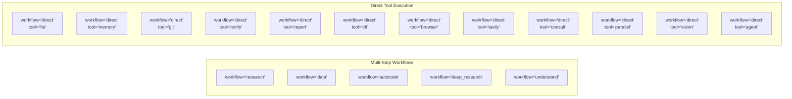
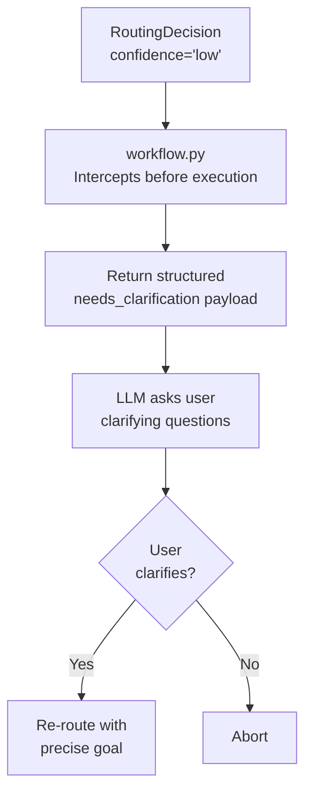
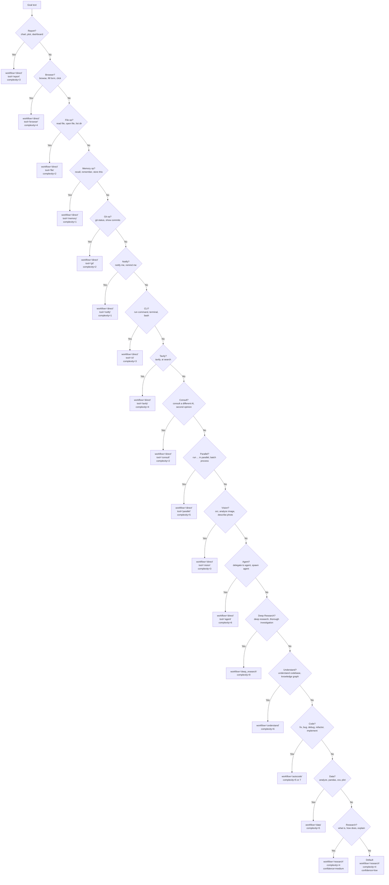
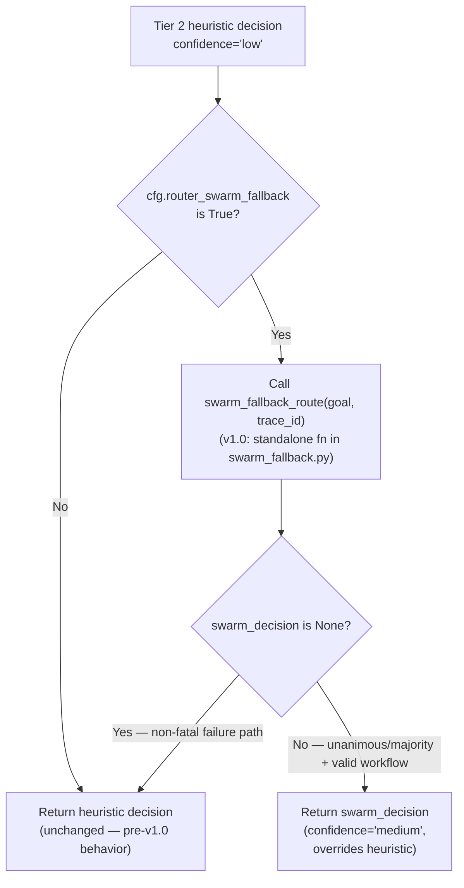

<- Back to [Router Overview](../ROUTER.md)

# 📝 API Reference

## 🔧 API Overview

**Public surface (via the thin facade `core/router.py`):** `route()`, `classify_complexity()`, and the `RoutingDecision` dataclass. All model references use `cfg.router_model` — zero hardcoding.

**v1.0 additions — accessible via direct import from `core.router_backend/` (not on the `TaskRouter` class):**
- **Routing telemetry:** `log_routing_telemetry()` (called internally by `route()`), `get_telemetry()`, `get_telemetry_summary()`, `clear_telemetry()` — see [Routing Telemetry API (v1.0)](#-routing-telemetry-api-v10).
- **Adaptive complexity thresholds:** `apply_adaptive_thresholds()`, `COMPLEXITY_THRESHOLD` — see [Adaptive Complexity Thresholds (v1.0)](#-adaptive-complexity-thresholds-v10).

**Internal helpers (also in `core.router_backend/`):** `model_route()`, `heuristic_route()`, `swarm_fallback_route()`, `classify_complexity()`. These are called by `route()` — callers should normally use `route()` rather than invoking them directly.

### Config Flags

| Flag | Default | Purpose |
|------|---------|---------|
| `ROUTER_MODEL` | (project default) | LLM used by `model_route()` and `classify_complexity()` (via `cfg.router_model`) |
| `ROUTER_TIMEOUT` | `15` (seconds) | Hard timeout for `model_route()` LLM call (via `cfg.router_timeout`) |
| **`ROUTER_SWARM_FALLBACK`** | **`0` (OFF)** | When `1`, enables swarm vote-based routing fallback: if model routing fails AND heuristic returns `confidence="low"`, calls `swarm(action="vote", temperature=0)` for a second opinion. Requires unanimous/majority agreement + valid workflow type. Non-fatal — any failure falls back to the heuristic decision. See `swarm_fallback_route()` below. |

---

## ⚡ Methods

### `route()` — Primary Entry Point

```python
decision = router.route(
    goal="Fix the timeout bug in tools/web.py",
    trace_id="abc123",
)
```

| Param | Type | Default | Description |
|-------|------|---------|-------------|
| `goal` | `str` | — | **Required.** The user's free-text task description |
| `trace_id` | `str` | `""` | Trace identifier for logging |

**Returns:** `RoutingDecision`

```python
decision.workflow  # "autocode"
decision.tool      # "workflow"
decision.complexity  # 7
decision.reason    # "Involves editing an existing code file to fix a bug"
decision.confidence  # "high"
decision.clarifying_questions  # []
```

---

### `classify_complexity()` — Quick Complexity Score

```python
score = router.classify_complexity("Calculate the mean of column A in data.csv")
# Returns: 5
```

| Param | Type | Default | Description |
|-------|------|---------|-------------|
| `goal` | `str` | — | **Required.** The user's task description |

**Returns:** `int` (1-10). Falls back to `5` on LLM failure.

---

### `swarm_fallback_route()` — Swarm Vote Second Opinion (internal helper)

**[v1.0]** Was `TaskRouter._swarm_fallback_route()` (private method); now a standalone function in `core/router_backend/swarm_fallback.py`. Still called from `route()` ONLY when:
1. `model_route(goal, trace_id)` returned `None` (model unavailable, timeout, invalid JSON), AND
2. `heuristic_route(goal)` returned `confidence == "low"` (the catch-all step #18 — no routing keywords matched), AND
3. `cfg.router_swarm_fallback` is `True` (env var `ROUTER_SWARM_FALLBACK=1`).

```python
# Internal — called by route() when the above 3 conditions hold.
# Direct import is supported but unusual (route() is the public entry point).
from core.router_backend.swarm_fallback import swarm_fallback_route
swarm_decision = swarm_fallback_route(goal, trace_id)
# Returns: Optional[RoutingDecision] — None means "no confident swarm verdict, fall back to heuristic"
```

| Param | Type | Default | Description |
|-------|------|---------|-------------|
| `goal` | `str` | — | **Required.** The user's task description (truncated to first 500 chars in the swarm prompt) |
| `trace_id` | `str` | — | **Required.** Trace identifier (forwarded to the swarm call) |

**Returns:** `Optional[RoutingDecision]`

| Outcome | Returns | Reason |
|---------|---------|--------|
| Swarm returned `status == "success"` AND `agreement in {"unanimous", "majority"}` AND winner ∈ `{autocode, research, data, deep_research, understand, direct}` | `RoutingDecision(workflow=winner, tool="workflow", complexity=5, confidence="medium", reason="Swarm vote ({agreement}, {N} providers)")` | Confident second opinion overrides the heuristic low-confidence decision |
| Swarm status != "success" | `None` | Swarm unavailable — fall through to heuristic |
| Swarm `agreement` ∈ `{"split", "disagreement", "single_response"}` | `None` | Split/disagreement verdict is no more confident than the heuristic |
| Swarm winner not in valid workflow set (e.g. "banana") | `None` | LLM hallucinated an invalid workflow name — don't propagate |
| Any exception (swarm import error, swarm crash, network failure, etc.) | `None` + `tracer.warning(...)` | Non-fatal — the flag is advisory and must never turn a successful `route()` call into a failed one |

**The swarm call (when this method fires):**

```python
swarm(
    action="vote",
    question=("Which workflow type best fits this task? Answer with ONE word: "
              "autocode, research, data, deep_research, understand, or direct.\n\n"
              f"Task: {goal[:500]}"),
    temperature=0,    # deterministic — vote must measure model agreement, not sampling noise
    max_tokens=20,    # just one word
    timeout=15,
    trace_id=trace_id,
)
```

**Why `temperature=0`:** Two LLMs at `temperature=0` converge on the same answer more often than at `temperature=0.7` — so the `agreement` classification (`unanimous` / `majority` / `split` / `disagreement`) measures *genuine model disagreement*, not sampling noise. Without `temperature=0`, a `disagreement` verdict would be ambiguous (could be either "models genuinely disagree on classification" or "models sampled different tokens but agree on classification"). See `docs/tools/swarm/INSTRUCTIONS.md` rule #45.

**Why `unanimous`/`majority` required (not `split`/`disagreement`):** A split or disagreement swarm verdict is *no more confident* than the heuristic low-confidence decision — both are saying "I don't know for sure". Overriding the heuristic with an equally-uncertain swarm verdict would just add latency without improving routing quality. Only unanimous/majority verdicts represent a confident second opinion worth overriding the heuristic.

**Why non-fatal:** The router's contract is `route(goal) -> RoutingDecision` — it must never raise. The swarm fallback is a *bonus* path: if it works, great; if it doesn't, the heuristic decision still stands. All exceptions are caught and logged via `tracer.warning(...)`. The flag is OFF by default — users who don't have cloud providers configured will never see this code path fire.

---

## 📊 Routing Telemetry API (v1.0)

**[v1.0 NEW]** `core/router_backend/telemetry.py` exposes an in-memory log of routing decisions for observational analysis. `log_routing_telemetry()` is called automatically from `route()` after every non-empty-goal decision — callers don't need to invoke it. The query/clear API is for inspection (e.g., from a debug REPL, a health endpoint, or a test teardown).

**Import path:**

```python
from core.router_backend.telemetry import (
    log_routing_telemetry,  # called internally by route() — usually don't call directly
    get_telemetry,
    get_telemetry_summary,
    clear_telemetry,
)
```

### `get_telemetry()` — Full Log

```python
from core.router_backend.telemetry import get_telemetry
entries = get_telemetry()
# Returns: list[dict] — copy of the in-memory log (newest at the end)
```

**Returns:** `list[dict]` — bounded FIFO log, max 100 entries (`_MAX_LOG_ENTRIES`). Each entry has these keys:

| Key | Type | Notes |
|-----|------|-------|
| `goal_preview` | `str` | First 100 chars of the goal |
| `model_workflow` | `str \| None` | `None` when the model failed (timeout / invalid JSON / unavailable) |
| `heuristic_workflow` | `str` | What the heuristic WOULD have returned (always computed for telemetry) |
| `final_workflow` | `str` | What `route()` actually returned (model verdict, swarm verdict, or heuristic) |
| `confidence` | `str` | Final decision's confidence (`high` / `medium` / `low`) — post-adaptive-threshold |
| `disagreement` | `bool` | `True` iff `model_workflow is not None and model_workflow != heuristic_workflow` |

### `get_telemetry_summary()` — Aggregate Stats

```python
from core.router_backend.telemetry import get_telemetry_summary
summary = get_telemetry_summary()
# Returns: {"total": 42, "disagreements": 3, "disagreement_rate": 0.0714}
```

**Returns:** `dict` with three keys:

| Key | Type | Notes |
|-----|------|-------|
| `total` | `int` | Total entries in the log (0–100) |
| `disagreements` | `int` | Count of entries where `disagreement is True` |
| `disagreement_rate` | `float` | `disagreements / total` (0.0 when `total == 0`) |

**Use cases:**
- Health endpoint — surface `disagreement_rate` as a routing-quality signal.
- Debug REPL — `summary` then `entries = get_telemetry()` to drill into specific disagreements.
- Test teardown — `clear_telemetry()` to avoid cross-test log leakage.

### `clear_telemetry()` — Reset Log

```python
from core.router_backend.telemetry import clear_telemetry
clear_telemetry()
# Returns: None — empties the in-memory log
```

**Use cases:** test teardown, manual reset, before/after benchmark runs. Idempotent (clearing an empty log is a no-op).

### `log_routing_telemetry()` — Internal Recorder

Called automatically by `route()` after every non-empty-goal decision. Direct invocation is supported but unusual — `route()` is the only caller in production code.

```python
from core.router_backend.telemetry import log_routing_telemetry
log_routing_telemetry(
    goal="Fix the bug in server.py",
    model_workflow="autocode",        # None when the model failed
    heuristic_workflow="autocode",     # always computed (cheap regex)
    final_workflow="autocode",         # what route() actually returned
    confidence="high",                 # post-adaptive-threshold
    trace_id="abc123",
)
```

| Param | Type | Default | Description |
|-------|------|---------|-------------|
| `goal` | `str` | — | **Required.** The user's goal (truncated to first 100 chars in the log entry) |
| `model_workflow` | `str \| None` | — | **Required.** Workflow the model returned, or `None` if the model failed |
| `heuristic_workflow` | `str` | — | **Required.** Workflow the heuristic returned (always available — `route()` always computes it for telemetry) |
| `final_workflow` | `str` | — | **Required.** Workflow `route()` is actually returning (model verdict, swarm verdict, or heuristic) |
| `confidence` | `str` | — | **Required.** Final decision's `confidence` value (post-adaptive-threshold) |
| `trace_id` | `str` | `""` | Trace identifier (currently stored for future use; not in the entry) |

**Returns:** `None`. Appends an entry to the bounded FIFO log; if the log exceeds `_MAX_LOG_ENTRIES` (100), the oldest entry is dropped.

**Disagreement flag:** `entry["disagreement"] = (model_workflow is not None and model_workflow != heuristic_workflow)`. So:
- Model success + heuristic agrees → `disagreement=False`
- Model success + heuristic disagrees → `disagreement=True` (the interesting case — model and regex disagree on classification)
- Model failure → `disagreement=False` (no comparison possible — `model_workflow` is `None`)

---

## 📈 Adaptive Complexity Thresholds (v1.0)

**[v1.0 NEW]** `core/router_backend/adaptive.py` exposes one function + one constant. `apply_adaptive_thresholds()` is called automatically from `route()` on every non-empty-goal decision (model success, swarm fallback, heuristic fallback) — callers don't need to invoke it. The function is exported for direct testing and for callers that construct `RoutingDecision` objects outside of `route()`.

**Import path:**

```python
from core.router_backend.adaptive import apply_adaptive_thresholds, COMPLEXITY_THRESHOLD
```

### `apply_adaptive_thresholds(decision)` — Downgrade Complex + Non-High Confidence

```python
from core.router_backend.adaptive import apply_adaptive_thresholds
from core.router_backend.decision import RoutingDecision

d = RoutingDecision({"workflow": "autocode", "complexity": 9, "confidence": "low"})
apply_adaptive_thresholds(d)
# d.confidence is now "medium"
# d.clarifying_questions is now ["This is a complex task -- can you provide more specific details ...?"]
# Returns the same d (mutated in place AND returned for fluent chaining)
```

| Param | Type | Default | Description |
|-------|------|---------|-------------|
| `decision` | `RoutingDecision` | — | **Required.** The decision to potentially downgrade. **Mutated in place.** |

**Returns:** the same `RoutingDecision` object (mutated in place AND returned for fluent chaining — `decision = apply_adaptive_thresholds(decision)` is the natural call site).

**Behavior:**

| Condition | Action |
|-----------|--------|
| `complexity > 7` AND `confidence != "high"` | Downgrade `confidence` to `"medium"`. If `clarifying_questions` is empty, append `"This is a complex task -- can you provide more specific details about what you want to achieve?"`. |
| `complexity > 7` AND `confidence == "high"` | No-op (high-confidence complex tasks proceed — the model is sure) |
| `complexity <= 7` | No-op |

**Strict `>` (not `>=`):** `COMPLEXITY_THRESHOLD = 7`, and the comparison is `decision.complexity > COMPLEXITY_THRESHOLD`. So `complexity=7` (the autocode-with-file-extension case) is unaffected — only `complexity ∈ {8, 9, 10}` triggers the downgrade. This is a deliberate backwards-compatibility decision: existing complexity=7 test cases must keep passing.

**Why this matters:** A `complexity=9` task routed with `confidence="low"` is risky — the router is unsure AND the task is expensive. Downgrading to `confidence="medium"` and adding a clarifying question surfaces the uncertainty to the Confidence Guard, which can intercept before launching an expensive workflow. The threshold fires on every non-empty-goal path (model success, swarm fallback, heuristic fallback) — high-complexity + non-high-confidence is risky regardless of which tier produced the decision.

### `COMPLEXITY_THRESHOLD` — Module Constant

```python
from core.router_backend.adaptive import COMPLEXITY_THRESHOLD
COMPLEXITY_THRESHOLD  # 7
```

The threshold used by `apply_adaptive_thresholds()`. Exported so tests can assert against the constant rather than hardcoding `7`.

---

### `RoutingDecision`

Every routing attempt returns a `RoutingDecision` object. This standardized output is consumed by the workflow tool, the dispatcher, and the gateway.

```python
class RoutingDecision:
    workflow: str           # "research", "data", "autocode", "deep_research", "understand", or "direct"
    tool: str               # "web", "file", "git", "memory", "workflow", "cli", "browser", etc.
    complexity: int         # 1-10 scale
    reason: str             # Human/LLM-readable explanation
    confidence: str         # "high", "medium", "low"
    clarifying_questions: list[str]  # Questions for low-confidence routes
    raw: dict               # Original raw dict from LLM or heuristic
```

---

## 🔀 Routing Targets



| Routing Type | `workflow` | `tool` | When |
|-------------|-----------|--------|------|
| **Multi-step workflow** | `"research"` | `"workflow"` | Finding info, summarizing, reading docs, Q&A |
| **Multi-step workflow** | `"data"` | `"workflow"` | Pandas, analysis, calculations, charts, spreadsheets |
| **Multi-step workflow** | `"autocode"` | `"workflow"` | Fixing bugs, editing code, adding features |
| **Multi-step workflow** | `"deep_research"` | `"workflow"` | Complex, multi-faceted research with iterative synthesis |
| **Multi-step workflow** | `"understand"` | `"workflow"` | Build or query codebase knowledge graph |
| **Direct tool** | `"direct"` | `"file"` | Read file, open file, list directory |
| **Direct tool** | `"direct"` | `"memory"` | Recall, remember, store to memory |
| **Direct tool** | `"direct"` | `"git"` | Git status, show commits, git diff |
| **Direct tool** | `"direct"` | `"notify"` | Notify me, remind me |
| **Direct tool** | `"direct"` | `"report"` | Create chart, plot, dashboard |
| **Direct tool** | `"direct"` | `"cli"` | Run shell commands, system administration |
| **Direct tool** | `"direct"` | `"browser"` | JavaScript-rendered pages, screenshots, form interaction |
| **Direct tool** | `"direct"` | `"tavily"` | AI-powered deep web search |
| **Direct tool** | `"direct"` | `"consult"` | Ask another LLM for a second opinion |
| **Direct tool** | `"direct"` | `"parallel"` | Execute multiple independent tasks concurrently |
| **Direct tool** | `"direct"` | `"vision"` | Image analysis, OCR, screenshot description |
| **Direct tool** | `"direct"` | `"agent"` | Delegate to sub-agent for complex sub-tasks |

### Workflow vs. Direct Routing

- **Workflow Routing** (`workflow="research|data|autocode|deep_research|understand"`): The task requires a multi-step LangGraph state machine. The Planner generates a plan, the Executor runs each step.
- **Direct Routing** (`workflow="direct"`): The task is a simple, single-step action. The router bypasses the workflow engine and tells the dispatcher to call the specific tool directly.

---

## 🛡️ Confidence Guard (Pre-Execution Interception)

To prevent the agent from wasting 15+ minutes and massive VRAM on misunderstood tasks, the workflow tool intercepts `low` confidence routing decisions **before** launching any workflow.

### How It Works



### Confidence Thresholds

| Confidence | Meaning | System Behavior |
|------------|---------|-----------------|
| **`high`** | Clear task with specific details | Proceed immediately to workflow execution |
| **`medium`** | Understandable but could be more specific | Proceed; workflow nodes may ask clarifying questions if needed |
| **`low`** | Vague, ambiguous, or missing critical context | **ABORT.** Trigger Confidence Guard. Return clarifying questions. |

### Example: Low Confidence Response

```json
{
  "status": "needs_clarification",
  "reason": "The task goal is too vague to proceed confidently.",
  "clarifying_questions": [
    "Which specific file needs fixing?",
    "What is the exact error message?"
  ],
  "message": "To help me understand your request better, please clarify:
- Which specific file needs fixing?
- What is the exact error message?",
  "trace_id": "abc123"
}
```

### VRAM Savings

| Scenario | Without Guard | With Guard |
|----------|--------------|------------|
| "Fix the bug" | Load Planner (6GB VRAM) → 5min planning → fail (no file specified) | Instant response → user clarifies → precise execution |
| "Do something with data" | Load Planner → load pandas → crash (no data specified) | Instant response → user specifies file and operation |
| "Help me" | Load everything → generic unhelpful response | Instant response → asks what specifically |

---

## 🔄 Three-Tier Routing Strategy (v1.0: 3-tier + adaptive thresholds + telemetry)

**[v1.0]** The routing flow is now a 5-stage pipeline: empty-goal short-circuit → heuristic (always, for telemetry) → Tier 1 model → Tier 3 swarm (advisory) → Tier 2 heuristic fallback. Every non-empty-goal path applies `apply_adaptive_thresholds()` and calls `log_routing_telemetry()`. See [ARCHITECTURE.md](ARCHITECTURE.md) § Routing Flow for the full mermaid diagram. This section documents the three tiers themselves.

### Tier 1: Model-Based Routing (Primary)

The Router attempts to classify the task using the lightweight Router LLM.

**The Prompt:**

```
No thinking. No explanation.
{"workflow": "understand or research or deep_research or autoresearch or autocode or data",
 "tool": "web or python or file or git or memory or agent or notify or report or vision or workflow or cli or browser or tavily or consult or parallel",
 "complexity": 5,
 "reason": "one sentence",
 "confidence": "high or medium or low",
 "clarifying_questions": ["question1", "question2"]}

Workflow routing rules (each answers a distinct cognitive question):
- understand: "What is this codebase?" -- build/query codebase knowledge graph, analyze project structure, map dependencies
- research: "What's known externally?" -- web search, summarizing, reading docs, Q&A about external topics
- deep_research: "What's known (complex)?" -- multi-faceted iterative research with evidence synthesis
- autoresearch: "What approach works best?" -- evolutionary experiment loop (propose -> modify -> run -> evaluate -> repeat). For hyperparameter optimization, training-script tuning, config search -- NOT for architecture planning.
- autocode: "Execute the change" -- fix bugs, edit code files, add features, refactor (TDD + git)
- data: "What does the data show?" -- pandas, analysis, calculations, charts, spreadsheets

Tool routing rules (for direct workflow):
- web: general web search and page reading
- python: data analysis, calculations, plotting
- file: read, write, list files and directories
- git: git operations, commits, diffs, status
- memory: recall, store, search memories
- agent: delegate to sub-agent for complex sub-tasks
- notify: send notifications and reminders
- report: create charts, dashboards, visual reports
- vision: image analysis and description
- workflow: multi-step task execution via workflow engine
- cli: shell commands, system administration, package management
- browser: JavaScript-rendered pages, screenshots, form interaction
- tavily: AI-powered deep web search
- consult: ask another LLM for a second opinion
- parallel: execute multiple independent tasks concurrently

Confidence rules:
- high: Clear task with specific details
- medium: Understandable but could be more specific
- low: Vague or ambiguous. MUST provide 1-2 clarifying questions.
```

**Key design decisions:**
- `"No thinking. No explanation."` — Suppresses thinking tokens for models like Qwen3 or Gemma that support them. Keeps the router fast.
- Structured JSON schema — Tells the model exactly what fields to output.
- Routing rules embedded in prompt — Gives the model clear decision boundaries.
- Confidence rules with `MUST` — Forces the model to include clarifying questions on low confidence.

**Extraction Pipeline:**

```mermaid
graph TD
    A["Raw LLM Response"] --> B["Strip markdown fences<br/>```json ... ```"]
    B --> C["Try direct parse<br/>json.loads(text)"]
    C -->|Success| D["Return RoutingDecision"]
    C -->|Fail| E["Layer 3: raw_decode<br/>json.JSONDecoder().raw_decode()"]
    E -->|Find first { }| F["Parse extracted JSON"]
    F -->|Valid + has 'workflow'| D
    F -->|Invalid| G["Return None<br/>Fall back to heuristics"]
    E -->|No { } found| G
```

**[v1.0 split] Delegation note:** The 3-layer extraction pipeline above is implemented in `core/json_extract.extract_first_json()`. The router's `_extract_first_json()` function (now a standalone function in `core/router_backend/model_route.py`, was a method on `TaskRouter` pre-v1.0) is a one-line delegation:

```python
# core/router_backend/model_route.py (v1.0)
from core.json_extract import extract_first_json

def _extract_first_json(text: str) -> str | None:
    return extract_first_json(text)
```

The pipeline behavior (direct parse → markdown fence strip → `json.JSONDecoder().raw_decode()`) is preserved verbatim — no behavior change, no API change. The same `core/json_extract.py` module also backs `helpers._parse_json` in autocode (single source of truth for LLM JSON parsing across the codebase).

### Tier 2: Heuristic Routing (Fallback)

If the LLM call fails, times out, or returns invalid JSON, the `heuristic_route()` function (in `core/router_backend/heuristics.py`; was `TaskRouter._heuristic_route()` pre-v1.0) instantly classifies the goal using **pre-compiled regex patterns**. **[v1.0]** `route()` always invokes `heuristic_route()` first (cheap regex) so its result can be compared against the model verdict for telemetry — even when the model succeeds.

**Priority Order (most specific first):**



### Regex Patterns (Pre-compiled)

| Pattern | Regex | Routes To |
|---------|-------|-----------|
| `_RE_REPORT` | `(create a chart\|create chart\|make a chart\|plot a chart\|draw a chart\|visualise\|create a graph\|make a graph\|create a map\|make a map\|create a dashboard\|make a dashboard\|create a report\|make a report\|bar chart\|line chart\|pie chart\|scatter plot\|heatmap)` | `direct → report` |
| `_RE_DIRECT_BROWSER` | `(browse\|fill form\|click button\|js-rendered\|open page\|take a screenshot\|capture screen\|web automation\|headless browser)` | `direct → browser` |
| `_RE_DIRECT_FILE` | `(read file\|open file\|list files\|list directory\|write file\|show file\|read the file\|open the file)` | `direct → file` |
| `_RE_DIRECT_MEMORY` | `(recall\|remember\|what do you know about\|store this\|save this to memory)` | `direct → memory` |
| `_RE_DIRECT_GIT` | `(git status\|git log\|show commits\|git diff\|commit this\|git commit)` | `direct → git` |
| `_RE_DIRECT_NOTIFY` | `(notify me\|send notification\|remind me\|schedule reminder)` | `direct → notify` |
| `_RE_DIRECT_CLI` | `(run command\|execute shell\|terminal\|bash\|powershell\|pip install\|npm install\|yarn install\|composer install\|docker build\|docker run\|kubectl\|terraform apply\|ansible)` | `direct → cli` |
| `_RE_DIRECT_TAVILY` | `(tavily\|ai search\|deep search\|advanced search\|ai-powered search\|intelligent search)` | `direct → tavily` |
| `_RE_DIRECT_CONSULT` | `(consult a different (?:ai\|llm\|model)\|ask another model\|get another perspective\|ask a different llm\|let's get a second opinion\|second opinion from (?:ai\|llm\|model))` | `direct → consult` |
| `_RE_DIRECT_PARALLEL` | `(run\s+.*?\s+in\s+parallel\|run\s+.*?\s+at\s+the\s+same\s+time\|batch process\|concurrently\|run together\|parallel execution)` | `direct → parallel` |
| `_RE_DIRECT_VISION` | `(ocr\s+(?:this\|the\|that\|these\|those\|an\|a\|my)\|analyze\s+.*?\s+image\|describe\s+.*?\s+image\|what\s+is\s+in\s+this\s+image\|read\s+this\s+image\|image\s+description\|analyze\s+this\s+photo\|what\s+does\s+this\s+picture\s+show\|read\s+text\s+from\s+image\|screenshot\s+analysis)` | `direct → vision` |
| `_RE_DIRECT_AGENT` | `(delegate\s+.*?\s+agent\|spawn\s+an\s+agent\|use\s+an\s+agent\|sub-agent\|let\s+an\s+agent\|have\s+an\s+agent)` | `direct → agent` |
| `_RE_DEEP_RESEARCH` | `(deep research\|thorough investigation\|comprehensive report\|iterative research\|multi-faceted research\|extensive research\|in-depth analysis\|detailed investigation)` | `deep_research → workflow` |
| `_RE_UNDERSTAND` | `(understand codebase\|build knowledge graph\|analyze project structure\|index codebase\|codebase overview\|project analysis\|map dependencies\|explore codebase\|scan project)` | `understand → workflow` |
| `_RE_CODE` | `(fix\|bug\|debug\|audit\|patch\|refactor\|improve\|add feature\|implement\|edit\|modify\|update code\|error message\|runtime error\|type error\|syntax error\|logic error)` | `autocode` |
| `_RE_DATA` | `(analyse\|analyze\|calculate\|compute\|csv\|excel\|spreadsheet\|statistics\|pandas\|numpy\|dataset)` | `data` |
| `_RE_RESEARCH` | `(what is\|what are\|how does\|explain\|research\|find information\|summarise\|summarize\|look up)` | `research (step 17, medium confidence)` |

> ⚠️ **All patterns are case-insensitive** (`re.IGNORECASE`).
>
> **Note on `_RE_RESEARCH`:** This pattern is checked at step 17 (before the default catch-all at step 18). Goals with explicit research keywords like "what is" or "explain" get `confidence="medium"` instead of the default `confidence="low"`.

### Code-File Bonus

When the `_RE_CODE` pattern matches, the heuristic checks if the goal also mentions a file extension (`.py`, `.js`, `.ts`, `.json`, `.yaml`, `.md`):

| Condition | Complexity | Reasoning |
|-----------|-----------|-----------|
| Code keywords + file extension mentioned | 7 | More likely a specific file edit |
| Code keywords only | 5 | Might be a general code question |

### Tier 3: Swarm Vote Fallback (Advisory)

When Tier 1 (model) fails AND Tier 2 (heuristic) returns `confidence="low"` (the catch-all step #18 — no routing keywords matched) AND `ROUTER_SWARM_FALLBACK=1`, the router asks the swarm for a second opinion before returning the low-confidence heuristic decision.



**What the swarm is asked:** "Which workflow type best fits this task? Answer with ONE word: autocode, research, data, deep_research, understand, or direct." Each configured cloud provider votes; the swarm's `agreement` classification (`unanimous` / `majority` / `split` / `disagreement` / `single_response`) tells us how confident the swarm itself is.

**Override criteria (ALL must hold):**
1. Swarm returned `status == "success"`
2. `agreement in {"unanimous", "majority"}` — split/disagreement/single_response are no more confident than the heuristic low-confidence decision
3. Winning workflow name (extracted from `groups[0]["preview"]`) ∈ `{autocode, research, data, deep_research, understand, direct}` — rejects LLM hallucinations like "banana"

**Override outcome:** `RoutingDecision(workflow=winner, tool="workflow", complexity=5, confidence="medium", reason="Swarm vote ({agreement}, {N} providers)")`. Note that the swarm decision's `confidence="medium"` — *not* `high` — because the swarm is a fallback path, not a primary signal.

**Failure paths (all non-fatal):**
- Swarm status != "success" → fall through to heuristic
- Swarm agreement not in `{unanimous, majority}` → fall through to heuristic
- Swarm winner not a valid workflow → fall through to heuristic
- Any exception (swarm import error, swarm crash, network failure, timeout) → `tracer.warning(...)` + fall through to heuristic

The router contract is `route(goal) -> RoutingDecision` — it must never raise. The swarm fallback is a *bonus* path: if it works, great; if it doesn't, the heuristic decision still stands. The flag is OFF by default — users without cloud providers configured will never see this code path fire.

See `swarm_fallback_route()` above for the full function spec.

---

*Last updated: 2026-07-14 (v1.0 — first versioned release: split `core/router.py` into `core/router_backend/` package (10 files, thin facade pattern); added Routing Telemetry API (`get_telemetry()` / `get_telemetry_summary()` / `clear_telemetry()` / internal `log_routing_telemetry()`) + Adaptive Complexity Thresholds (`apply_adaptive_thresholds()` + `COMPLEXITY_THRESHOLD = 7`); renamed `_swarm_fallback_route()` (method) → `swarm_fallback_route()` (standalone fn in `swarm_fallback.py`); updated Three-Tier Routing Strategy intro to mention the v1.0 5-stage pipeline; updated `_extract_first_json` delegation note for v1.0 split). See [ARCHITECTURE.md](ARCHITECTURE.md) for file maps and design decisions, [CHANGELOG.md](CHANGELOG.md) for version history, [INSTRUCTIONS.md](INSTRUCTIONS.md) for AI editing rules.*
