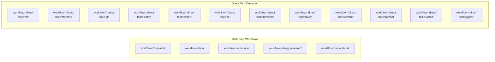
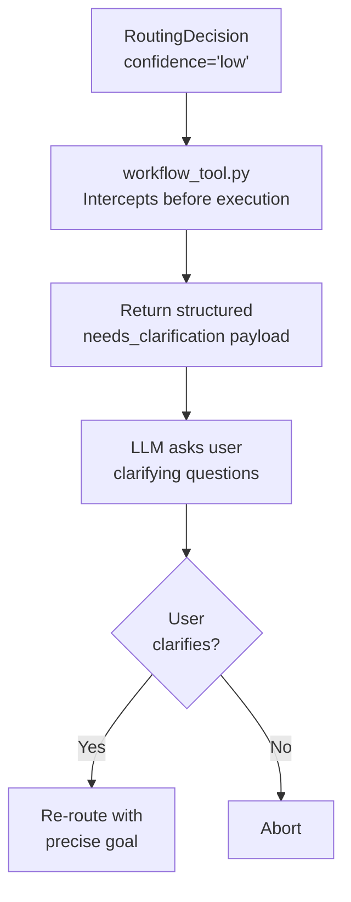
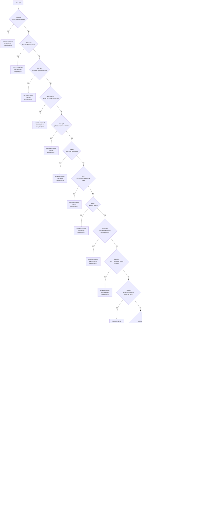

<- Back to [Router Overview](../ROUTER.md)

# 📝 API Reference

## 🔧 API Overview

The Router exposes two public methods (`route()`, `classify_complexity()`) and a `RoutingDecision` dataclass. All model references use `cfg.router_model` — zero hardcoding.

---

## ⚡ Methods

### `route()` — Primary Entry Point

```python
decision = router.route(
    goal="Fix the timeout bug in tools/web.py",
    trace_id="abc123",
)
```

| Param | Type | Default | Description |
|-------|------|---------|-------------|
| `goal` | `str` | — | **Required.** The user's free-text task description |
| `trace_id` | `str` | `""` | Trace identifier for logging |

**Returns:** `RoutingDecision`

```python
decision.workflow  # "autocode"
decision.tool      # "workflow"
decision.complexity  # 7
decision.reason    # "Involves editing an existing code file to fix a bug"
decision.confidence  # "high"
decision.clarifying_questions  # []
```

---

### `classify_complexity()` — Quick Complexity Score

```python
score = router.classify_complexity("Calculate the mean of column A in data.csv")
# Returns: 5
```

| Param | Type | Default | Description |
|-------|------|---------|-------------|
| `goal` | `str` | — | **Required.** The user's task description |

**Returns:** `int` (1-10). Falls back to `5` on LLM failure.

---

### `RoutingDecision`

Every routing attempt returns a `RoutingDecision` object. This standardized output is consumed by the workflow tool, the dispatcher, and the gateway.

```python
class RoutingDecision:
    workflow: str           # "research", "data", "autocode", "deep_research", "understand", or "direct"
    tool: str               # "web", "file", "git", "memory", "workflow", "cli", "browser", etc.
    complexity: int         # 1-10 scale
    reason: str             # Human/LLM-readable explanation
    confidence: str         # "high", "medium", "low"
    clarifying_questions: list[str]  # Questions for low-confidence routes
    raw: dict               # Original raw dict from LLM or heuristic
```

---

## 🔀 Routing Targets



| Routing Type | `workflow` | `tool` | When |
|-------------|-----------|--------|------|
| **Multi-step workflow** | `"research"` | `"workflow"` | Finding info, summarizing, reading docs, Q&A |
| **Multi-step workflow** | `"data"` | `"workflow"` | Pandas, analysis, calculations, charts, spreadsheets |
| **Multi-step workflow** | `"autocode"` | `"workflow"` | Fixing bugs, editing code, adding features |
| **Multi-step workflow** | `"deep_research"` | `"workflow"` | Complex, multi-faceted research with iterative synthesis |
| **Multi-step workflow** | `"understand"` | `"workflow"` | Build or query codebase knowledge graph |
| **Direct tool** | `"direct"` | `"file"` | Read file, open file, list directory |
| **Direct tool** | `"direct"` | `"memory"` | Recall, remember, store to memory |
| **Direct tool** | `"direct"` | `"git"` | Git status, show commits, git diff |
| **Direct tool** | `"direct"` | `"notify"` | Notify me, remind me |
| **Direct tool** | `"direct"` | `"report"` | Create chart, plot, dashboard |
| **Direct tool** | `"direct"` | `"cli"` | Run shell commands, system administration |
| **Direct tool** | `"direct"` | `"browser"` | JavaScript-rendered pages, screenshots, form interaction |
| **Direct tool** | `"direct"` | `"tavily"` | AI-powered deep web search |
| **Direct tool** | `"direct"` | `"consult"` | Ask another LLM for a second opinion |
| **Direct tool** | `"direct"` | `"parallel"` | Execute multiple independent tasks concurrently |
| **Direct tool** | `"direct"` | `"vision"` | Image analysis, OCR, screenshot description |
| **Direct tool** | `"direct"` | `"agent"` | Delegate to sub-agent for complex sub-tasks |

### Workflow vs. Direct Routing

- **Workflow Routing** (`workflow="research|data|autocode|deep_research|understand"`): The task requires a multi-step LangGraph state machine. The Planner generates a plan, the Executor runs each step.
- **Direct Routing** (`workflow="direct"`): The task is a simple, single-step action. The router bypasses the workflow engine and tells the dispatcher to call the specific tool directly.

---

## 🛡️ Confidence Guard (Pre-Execution Interception)

To prevent the agent from wasting 15+ minutes and massive VRAM on misunderstood tasks, the workflow tool intercepts `low` confidence routing decisions **before** launching any workflow.

### How It Works



### Confidence Thresholds

| Confidence | Meaning | System Behavior |
|------------|---------|-----------------|
| **`high`** | Clear task with specific details | Proceed immediately to workflow execution |
| **`medium`** | Understandable but could be more specific | Proceed; workflow nodes may ask clarifying questions if needed |
| **`low`** | Vague, ambiguous, or missing critical context | **ABORT.** Trigger Confidence Guard. Return clarifying questions. |

### Example: Low Confidence Response

```json
{
  "status": "needs_clarification",
  "reason": "The task goal is too vague to proceed confidently.",
  "clarifying_questions": [
    "Which specific file needs fixing?",
    "What is the exact error message?"
  ],
  "message": "To help me understand your request better, please clarify:
- Which specific file needs fixing?
- What is the exact error message?",
  "trace_id": "abc123"
}
```

### VRAM Savings

| Scenario | Without Guard | With Guard |
|----------|--------------|------------|
| "Fix the bug" | Load Planner (6GB VRAM) → 5min planning → fail (no file specified) | Instant response → user clarifies → precise execution |
| "Do something with data" | Load Planner → load pandas → crash (no data specified) | Instant response → user specifies file and operation |
| "Help me" | Load everything → generic unhelpful response | Instant response → asks what specifically |

---

## 🔄 Two-Tier Routing Strategy

### Tier 1: Model-Based Routing (Primary)

The Router attempts to classify the task using the lightweight Router LLM.

**The Prompt:**

```
No thinking. No explanation.
{"workflow": "research or data or autocode or deep_research or understand",
 "tool": "web or python or file or git or memory or agent or notify or report or vision or workflow or cli or browser or tavily or consult or parallel",
 "complexity": 5,
 "reason": "one sentence",
 "confidence": "high or medium or low",
 "clarifying_questions": ["question1", "question2"]}

Workflow routing rules:
- research: finding info, summarising, reading docs, Q&A
- data: pandas, analysis, calculations, charts, spreadsheets
- autocode: fixing bugs, editing code files, adding features
- deep_research: complex multi-faceted research, iterative evidence synthesis
- understand: build or query codebase knowledge graph, analyze project structure

Tool routing rules (for direct workflow):
- web: general web search and page reading
- python: data analysis, calculations, plotting
- file: read, write, list files and directories
- git: git operations, commits, diffs, status
- memory: recall, store, search memories
- agent: delegate to sub-agent for complex sub-tasks
- notify: send notifications and reminders
- report: create charts, dashboards, visual reports
- vision: image analysis and description
- workflow: multi-step task execution via workflow engine
- cli: shell commands, system administration, package management
- browser: JavaScript-rendered pages, screenshots, form interaction
- tavily: AI-powered deep web search
- consult: ask another LLM for a second opinion
- parallel: execute multiple independent tasks concurrently

Confidence rules:
- high: Clear task with specific details
- medium: Understandable but could be more specific
- low: Vague or ambiguous. MUST provide 1-2 clarifying questions.
```

**Key design decisions:**
- `"No thinking. No explanation."` — Suppresses thinking tokens for models like Qwen3 or Gemma that support them. Keeps the router fast.
- Structured JSON schema — Tells the model exactly what fields to output.
- Routing rules embedded in prompt — Gives the model clear decision boundaries.
- Confidence rules with `MUST` — Forces the model to include clarifying questions on low confidence.

**Extraction Pipeline:**

```mermaid
graph TD
    A["Raw LLM Response"] --> B["Strip markdown fences<br/>```json ... ```"]
    B --> C["Try direct parse<br/>json.loads(text)"]
    C -->|Success| D["Return RoutingDecision"]
    C -->|Fail| E["Layer 3: raw_decode<br/>json.JSONDecoder().raw_decode()"]
    E -->|Find first { }| F["Parse extracted JSON"]
    F -->|Valid + has 'workflow'| D
    F -->|Invalid| G["Return None<br/>Fall back to heuristics"]
    E -->|No { } found| G
```

### Tier 2: Heuristic Routing (Fallback)

If the LLM call fails, times out, or returns invalid JSON, the `_heuristic_route()` method instantly classifies the goal using **pre-compiled regex patterns**.

**Priority Order (most specific first):**



### Regex Patterns (Pre-compiled)

| Pattern | Regex | Routes To |
|---------|-------|-----------|
| `_RE_REPORT` | `(create a chart\|create chart\|make a chart\|plot a chart\|draw a chart\|visualise\|create a graph\|make a graph\|create a map\|make a map\|create a dashboard\|make a dashboard\|create a report\|make a report\|bar chart\|line chart\|pie chart\|scatter plot\|heatmap)` | `direct → report` |
| `_RE_DIRECT_BROWSER` | `(browse\|fill form\|click button\|js-rendered\|open page\|take a screenshot\|capture screen\|web automation\|headless browser)` | `direct → browser` |
| `_RE_DIRECT_FILE` | `(read file\|open file\|list files\|list directory\|write file\|show file\|read the file\|open the file)` | `direct → file` |
| `_RE_DIRECT_MEMORY` | `(recall\|remember\|what do you know about\|store this\|save this to memory)` | `direct → memory` |
| `_RE_DIRECT_GIT` | `(git status\|git log\|show commits\|git diff\|commit this\|git commit)` | `direct → git` |
| `_RE_DIRECT_NOTIFY` | `(notify me\|send notification\|remind me\|schedule reminder)` | `direct → notify` |
| `_RE_DIRECT_CLI` | `(run command\|execute shell\|terminal\|bash\|powershell\|pip install\|npm install\|yarn install\|composer install\|docker build\|docker run\|kubectl\|terraform apply\|ansible)` | `direct → cli` |
| `_RE_DIRECT_TAVILY` | `(tavily\|ai search\|deep search\|advanced search\|ai-powered search\|intelligent search)` | `direct → tavily` |
| `_RE_DIRECT_CONSULT` | `(consult a different (?:ai\|llm\|model)\|ask another model\|get another perspective\|ask a different llm\|let's get a second opinion\|second opinion from (?:ai\|llm\|model))` | `direct → consult` |
| `_RE_DIRECT_PARALLEL` | `(run\s+.*?\s+in\s+parallel\|run\s+.*?\s+at\s+the\s+same\s+time\|batch process\|concurrently\|run together\|parallel execution)` | `direct → parallel` |
| `_RE_DIRECT_VISION` | `(ocr\s+(?:this\|the\|that\|these\|those\|an\|a\|my)\|analyze\s+.*?\s+image\|describe\s+.*?\s+image\|what\s+is\s+in\s+this\s+image\|read\s+this\s+image\|image\s+description\|analyze\s+this\s+photo\|what\s+does\s+this\s+picture\s+show\|read\s+text\s+from\s+image\|screenshot\s+analysis)` | `direct → vision` |
| `_RE_DIRECT_AGENT` | `(delegate\s+.*?\s+agent\|spawn\s+an\s+agent\|use\s+an\s+agent\|sub-agent\|let\s+an\s+agent\|have\s+an\s+agent)` | `direct → agent` |
| `_RE_DEEP_RESEARCH` | `(deep research\|thorough investigation\|comprehensive report\|iterative research\|multi-faceted research\|extensive research\|in-depth analysis\|detailed investigation)` | `deep_research → workflow` |
| `_RE_UNDERSTAND` | `(understand codebase\|build knowledge graph\|analyze project structure\|index codebase\|codebase overview\|project analysis\|map dependencies\|explore codebase\|scan project)` | `understand → workflow` |
| `_RE_CODE` | `(fix\|bug\|debug\|audit\|patch\|refactor\|improve\|add feature\|implement\|edit\|modify\|update code\|error message\|runtime error\|type error\|syntax error\|logic error)` | `autocode` |
| `_RE_DATA` | `(analyse\|analyze\|calculate\|compute\|csv\|excel\|spreadsheet\|statistics\|pandas\|numpy\|dataset)` | `data` |
| `_RE_RESEARCH` | `(what is\|what are\|how does\|explain\|research\|find information\|summarise\|summarize\|look up)` | `research (step 17, medium confidence)` |

> ⚠️ **All patterns are case-insensitive** (`re.IGNORECASE`).
>
> **Note on `_RE_RESEARCH`:** This pattern is checked at step 17 (before the default catch-all at step 18). Goals with explicit research keywords like "what is" or "explain" get `confidence="medium"` instead of the default `confidence="low"`.

### Code-File Bonus

When the `_RE_CODE` pattern matches, the heuristic checks if the goal also mentions a file extension (`.py`, `.js`, `.ts`, `.json`, `.yaml`, `.md`):

| Condition | Complexity | Reasoning |
|-----------|-----------|-----------|
| Code keywords + file extension mentioned | 7 | More likely a specific file edit |
| Code keywords only | 5 | Might be a general code question |

---

*Last updated: 2026-07-04. See [ARCHITECTURE.md](ARCHITECTURE.md) for file maps and design decisions, [CHANGELOG.md](CHANGELOG.md) for version history, [INSTRUCTIONS.md](INSTRUCTIONS.md) for AI editing rules.*
