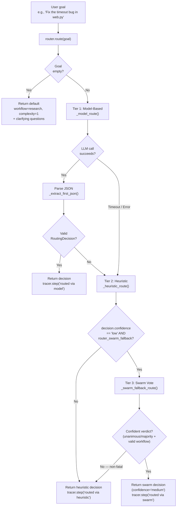

<- Back to [Router Overview](../ROUTER.md)

# 🏗️ Architecture

## 🔗 Source Code Reference

| File | Purpose |
|------|---------|
| `core/router.py` | `TaskRouter`, `RoutingDecision`, `ROUTER_SYSTEM_PROMPT`, model + heuristic routing + swarm fallback (`_swarm_fallback_route()`). **[Pre-v1.1]** `_extract_first_json()` now delegates to `core/json_extract.extract_first_json()` — the inline 3-layer pipeline (direct parse → markdown fence strip → `json.JSONDecoder().raw_decode()`) moved to the consolidated `core/json_extract.py` module shared with `helpers._parse_json` in autocode. No behavior change. |
| `core/json_extract.py` | **[Pre-v1.1] NEW DEPENDENCY** — consolidated JSON extraction utility (introduced in autocode v2.0-alpha Phase 1). 3 functions: `extract_json(text)`, `extract_json_array(text)`, `extract_first_json(text)`. The router's `_extract_first_json()` delegates to `extract_first_json()` here. Single source of truth for all LLM JSON parsing across the codebase. |
| `tools/swarm.py` | `swarm()` facade — called by `_swarm_fallback_route()` with `action="vote"`, `temperature=0`, `max_tokens=20`, `timeout=15`. Lazy-imported inside the method to avoid a circular import at module load. |
| `core/config.py` | `router_model`, `router_timeout` configuration + `router_swarm_fallback` (env var `ROUTER_SWARM_FALLBACK`, default `0`/OFF) |
| `tools/workflow.py` | Confidence Guard interception (low confidence → clarifying questions) |
| `core/llm.py` | LLM client used by `router.route()` and `router.classify_complexity()` |
| `core/tracer.py` | Trace logging for routing decisions (incl. `tracer.warning()` for non-fatal swarm fallback failures) |
| `core/gateway_backend/dispatcher.py` | Consumes routing decisions for gateway dispatch |
| `registry.py` | Auto-discovers `@tool` decorated functions |

---

## 🌳 Module Tree

```text
core/router.py
├── ROUTER_SYSTEM_PROMPT    # Module-level constant (extracted for testability)
├── ROUTER_TOOLS            # Module-level list: 15 registered tools
├── ROUTER_WORKFLOWS        # Module-level list: 5 workflows
├── RoutingDecision         # Dataclass: workflow, tool, complexity, reason, confidence
├── TaskRouter (singleton)
│   ├── route()             # Primary entry point — model → heuristic → swarm (3-tier fallback)
│   ├── classify_complexity() # Quick 1-10 complexity score
│   ├── _model_route()      # LLM-based classification (Router role, 15s timeout)
│   ├── _heuristic_route()  # Keyword-based fallback (pre-compiled regex)
│   ├── _swarm_fallback_route() # Swarm vote second opinion — fires only when model fails AND heuristic is low-confidence AND flag is ON
│   └── _extract_first_json() # Deterministic JSON extraction (3-layer) — **[Pre-v1.1]** now delegates to `core/json_extract.extract_first_json()`
└── router                  # Module-level singleton
```

---

## 🔀 Routing Flow



**Three-tier fallback rationale:** Tier 1 (model) is the primary signal — most informative when the router LLM is online. Tier 2 (heuristic) is the safety net — always available, but returns `confidence="low"` for goals that don't match any keyword pattern (the catch-all step #18). Tier 3 (swarm) is the *advisory* override for that low-confidence case: it asks configured cloud providers to vote on the workflow type. Tier 3 only fires when ALL of: Tier 1 failed, Tier 2 returned `confidence="low"`, AND `ROUTER_SWARM_FALLBACK=1` (default OFF).

---

## 💡 Key Design Decisions

- **Speed-first** — 15s hard timeout on LLM call; heuristic fallback is O(1) regex. The Router must never block the user experience. The swarm fallback (Tier 3) has its own 15s timeout — even with the flag ON, the worst-case routing latency is `15s (model) + 0s (heuristic) + 15s (swarm) = 30s`. The flag is OFF by default precisely to keep the speed-first contract intact for users who don't want the bonus path.
- **Three-tier routing (v1.0)** — Model-based (primary) + keyword heuristics (fallback) + swarm vote (advisory override). Pre-v1.0 was dual-tier. Works even when LM Studio is completely offline — the swarm tier just no-ops if no cloud providers are configured.
- **Confidence Guard** — Low-confidence decisions are intercepted by `tools/workflow.py` before launching expensive workflows, preventing VRAM waste on misunderstood tasks. The swarm fallback overrides a low-confidence heuristic decision with a `confidence="medium"` swarm verdict — this *bypasses* the Confidence Guard for that specific case (the swarm's unanimous/majority vote is treated as enough confidence to proceed). This is intentional: if 3+ cloud providers unanimously agree on a workflow type, that's stronger signal than the heuristic's "no keyword matched" default.
- **Swarm fallback (v1.0) — why `temperature=0`:** two LLMs at `temperature=0` converge on the same answer more often than at `temperature=0.7`. The vote's `agreement` classification (`unanimous`/`majority`/`split`/`disagreement`) must measure *genuine model disagreement*, not sampling noise — otherwise a `disagreement` verdict would be ambiguous (could be either "models genuinely disagree on classification" or "models sampled different tokens but agree on classification"). The router's `_swarm_fallback_route()` hardcodes `temperature=0` in the swarm call (not configurable per-call) — see `docs/tools/swarm/INSTRUCTIONS.md` rule #45.
- **Swarm fallback (v1.0) — why `unanimous`/`majority` required:** a split/disagreement/single_response swarm verdict is *no more confident* than the heuristic low-confidence decision — both are saying "I don't know for sure". Overriding the heuristic with an equally-uncertain swarm verdict would just add latency without improving routing quality. Only unanimous/majority verdicts represent a confident second opinion worth the override.
- **Swarm fallback (v1.0) — why non-fatal:** the router's contract is `route(goal) -> RoutingDecision` — it must never raise. The swarm fallback is a *bonus* path: if it works, great; if it doesn't, the heuristic decision still stands. All exceptions are caught and logged via `tracer.warning(...)`. This is the same "advisory override" pattern used by autocode's `node_swarm_fallback` (HIGH confidence → one more debug cycle; LOW → verify chain) — both treat the swarm as a second opinion that can extend the workflow but never crash it.
- **Robust JSON extraction** — `client.py` uses a 3-layer strategy (direct parse → markdown fence → outermost regex). `router.py` uses a different approach (`json.JSONDecoder().raw_decode()`). These are intentionally separate implementations for the same general problem. **[Pre-v1.1]** The `router.py` implementation now lives in `core/json_extract.extract_first_json()` — `_extract_first_json()` in `core/router.py` is a one-line delegation. The 3-layer pipeline behavior is preserved verbatim. The same `core/json_extract.py` module also backs `helpers._parse_json` in autocode (single source of truth for LLM JSON parsing across the codebase).
- **Zero hardcoding** — All model references use `cfg.router_model`. No model identifiers in the router code.
- **Pre-compiled regex** — All keyword patterns are `re.compile()` at class level, not compiled on every call.
- **Priority order** — More specific patterns come before more general ones in `_heuristic_route()`. Direct tool requests are more specific than workflow requests.
- **Code-file bonus** — When code keywords match, complexity is 7 if a file extension is mentioned, 5 otherwise.
- **Trace integration** — All routing decisions are logged via `tracer.step()` with `trace_id`.

---

## 📊 Complexity Classification

The Router can independently score task complexity on a 1-10 scale. This is used by workflows to adjust timeout limits, retry counts, and context window sizes.

### The Scale

| Range | Meaning | Examples |
|-------|---------|----------|
| **1-3** | Single tool, clear input/output | "read file X", "git status", "remember this" |
| **4-6** | Multi-step, predictable | "summarize this URL", "analyze this CSV" |
| **7-9** | Complex, multiple tools, uncertainty | "fix the authentication bug", "refactor the memory module" |
| **10** | Requires human judgment | "redesign the entire architecture" |

### Usage

```python
from core.router import router

# Quick complexity score (uses Router LLM, 15s timeout)
score = router.classify_complexity("Research ChromaDB")
# Returns: 4

score = router.classify_complexity("Fix the authentication bug in tools/web.py and add unit tests")
# Returns: 8

# Falls back to 5 on LLM failure
score = router.classify_complexity("do stuff")
# Returns: 5 (default)
```

---

## 🧪 Testing

```powershell
# Run all router tests
.\venv\Scripts\python tests/core/router/ -W error --tb=short -v

> **Note:** Ensure `pytest` resolves to your venv. If not, use `python -m pytest` or the full venv path (`venv\Scripts\pytest.exe` on Windows, `venv/bin/pytest` on Unix).
```

**Test organization:**
- `conftest.py` — Shared fixtures (mock LLM, mock registry, canonical expected sets)
- `test_router_tools_complete.py` — Structural: all tools/workflows appear in prompt
- `test_router_routing_rules.py` — Parameterized: each tool/workflow has a routing rule
- `test_router_heuristic_fallback.py` — Behavioral: heuristic patterns route correctly + false-positive regression tests
- `test_router_drift.py` — CI check: prompt tool list matches expected set

**Mock strategy:**
- Mock `llm.complete()` to return controlled JSON responses
- Test heuristic routing separately (no LLM dependency)
- Test JSON extraction with malformed inputs (markdown fences, nested objects, trailing text)

---

## ⚠️ Known Concerns

- **Heuristic pattern overlap** — `_RE_REPORT` matches `chart`, `plot`, `dashboard`. `_RE_DATA` also matches `csv`, `excel`, `spreadsheet`. `_RE_DIRECT_BROWSER` matches `take a screenshot` which could overlap with vision's `screenshot analysis`. Since report is checked first in `_heuristic_route()`, goals like "plot a chart of this data" will route to `direct → report` instead of `data → python`. The priority order is intentional — direct tool requests are more specific than workflow requests. If a user says "create a chart", they likely want the report tool. If they say "analyze this CSV with pandas", the data workflow catches it because `pandas` is in `_RE_DATA` but not in `_RE_REPORT`.
- **Router prompt length** — The router prompt lists 5 workflows and 15 tools with individual routing rules (~30 lines). For very small router models (e.g., 2B parameters), a longer prompt may slightly increase latency. The prompt is still well within the context window of gemma-2-2b-it (8K context). If latency becomes an issue, the rules can be compressed into a single-line format.

---

*Last updated: 2026-07-14 (v1.0 — first versioned release: 3-tier routing flow (model → heuristic → swarm); new `_swarm_fallback_route()` method + `ROUTER_SWARM_FALLBACK=0` config flag; new swarm-fallback design decisions (why temperature=0, why unanimous/majority required, why non-fatal); Pre-v1.1 — `_extract_first_json()` delegates to `core/json_extract.extract_first_json()`). See [API.md](API.md) for method details, [CHANGELOG.md](CHANGELOG.md) for version history, [INSTRUCTIONS.md](INSTRUCTIONS.md) for AI editing rules.*
