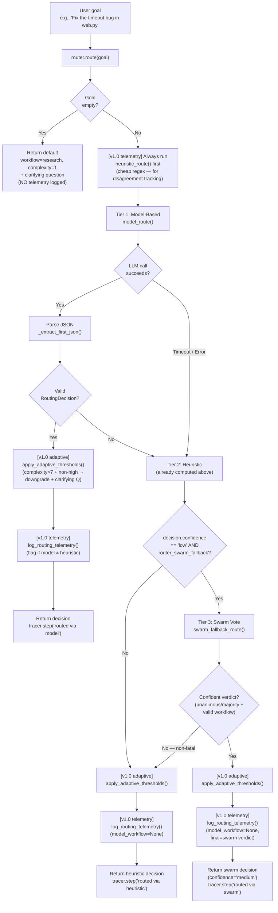

<- Back to [Router Overview](../ROUTER.md)

# 🏗️ Architecture

## 🔗 Source Code Reference

[v1.0 split] `core/router.py` is now a 36-line thin facade re-exporting the public surface area. All implementation logic lives in `core/router_backend/` (10 files). Callers should import from `core.router`, not from `core.router_backend` (the facade is the public contract).

### Facade

| File | Purpose |
|------|---------|
| `core/router.py` | **Thin facade (36 lines).** Re-exports 7 public symbols: `router` (singleton), `TaskRouter`, `RoutingDecision`, `ROUTER_SYSTEM_PROMPT`, `ROUTER_FEW_SHOT_EXAMPLES`, `ROUTER_TOOLS`, `ROUTER_WORKFLOWS`. No business logic — all `from core.router import X` callers (workflow tool, dispatcher, gateway, tests) continue to work unchanged. |

### Backend package — `core/router_backend/` (10 files)

| File | Lines | Purpose |
|------|-------|---------|
| `__init__.py` | 16 | Package docstring listing all submodules. |
| `decision.py` | 37 | `RoutingDecision` class (workflow, tool, complexity, reason, confidence, clarifying_questions, raw). Constructed from a raw dict with sensible defaults so heuristics never crash. |
| `constants.py` | 77 | `ROUTER_WORKFLOWS` (5), `ROUTER_TOOLS` (17), `_ROUTER_PROMPT_WORKFLOW_LIST`, `_ROUTER_PROMPT_TOOL_LIST`, `ROUTER_FEW_SHOT_EXAMPLES` (3 examples), `ROUTER_SYSTEM_PROMPT`. |
| `heuristics.py` | 367 | 16 pre-compiled module-level regex patterns (`_RE_*`) + `heuristic_route(goal) -> RoutingDecision` standalone function (18-step priority chain). Holds the `[DESIGN]` block (priority order, false-positive history, `_RE_RESEARCH` dual-check, hardcoded tool lists). |
| `model_route.py` | 79 | `model_route(goal, trace_id) -> Optional[RoutingDecision]` + `_extract_first_json(text)` standalone functions (were `TaskRouter._model_route` / `_extract_first_json`). Imports `llm` from `core.llm` directly (NOT through the facade — per the v1.0 split decision). `_extract_first_json` delegates to `core.json_extract.extract_first_json`. |
| `swarm_fallback.py` | 71 | `swarm_fallback_route(goal, trace_id) -> Optional[RoutingDecision]` standalone function (was `TaskRouter._swarm_fallback_route`). Lazy `from tools.swarm import swarm` inside the function so `mocker.patch("tools.swarm.swarm")` in tests still works. Non-fatal — all exceptions return `None`. |
| `complexity.py` | 38 | `classify_complexity(goal) -> int` standalone function (was `TaskRouter.classify_complexity`). 1-10 scale, returns `5` (default mid-point) on LLM failure. |
| `telemetry.py` | 74 | **[v1.0 NEW]** Routing telemetry. Bounded FIFO in-memory log (`_MAX_LOG_ENTRIES=100`). API: `log_routing_telemetry()`, `get_telemetry()`, `get_telemetry_summary()`, `clear_telemetry()`. Flags disagreements (`model_workflow is not None and != heuristic_workflow`). |
| `adaptive.py` | 43 | **[v1.0 NEW]** Adaptive complexity thresholds. `COMPLEXITY_THRESHOLD = 7` (strict `>`). `apply_adaptive_thresholds(decision)`: if `complexity > 7` AND `confidence != "high"`, downgrade to `"medium"` + add a clarifying question. Mutates in place AND returns for fluent chaining. |
| `router.py` | 136 | `TaskRouter` class — the public orchestrator. `route()` is now a 4-step orchestrator: (1) always run `heuristic_route()` for telemetry, (2) try `model_route()`, (3) swarm fallback, (4) heuristic fallback. Each non-empty-goal branch applies `apply_adaptive_thresholds()` + calls `log_routing_telemetry()`. `classify_complexity()` is preserved on the class as a thin delegator to the standalone function. |

### External dependencies

| File | Purpose |
|------|---------|
| `core/json_extract.py` | Consolidated JSON extraction utility (3 functions: `extract_json`, `extract_json_array`, `extract_first_json`). `model_route._extract_first_json()` delegates to `extract_first_json()` here. Single source of truth for all LLM JSON parsing across the codebase (also backs `helpers._parse_json` in autocode). |
| `tools/swarm.py` | `swarm()` facade — called by `swarm_fallback_route()` with `action="vote"`, `temperature=0`, `max_tokens=20`, `timeout=15`. Lazy-imported inside the function to avoid a circular import at module load. |
| `core/config.py` | `router_model`, `router_timeout` configuration + `router_swarm_fallback` (env var `ROUTER_SWARM_FALLBACK`, default `0`/OFF) |
| `tools/workflow.py` | Confidence Guard interception (low confidence → clarifying questions) |
| `core/llm.py` | LLM client used by `model_route()` and `classify_complexity()` (imported directly into `model_route.py` and `complexity.py`, NOT through the facade) |
| `core/tracer.py` | Trace logging for routing decisions (incl. `tracer.warning()` for non-fatal swarm fallback failures) |
| `core/gateway_backend/dispatcher.py` | Consumes routing decisions for gateway dispatch |
| `registry.py` | Auto-discovers `@tool` decorated functions |

---

## 🌳 Module Tree

```text
core/router.py                            # Thin facade (36 lines) — re-exports 7 public symbols
└── core/router_backend/                  # Implementation package (10 files)
    ├── __init__.py                       # Package docstring
    ├── decision.py                       # RoutingDecision class
    ├── constants.py                      # ROUTER_SYSTEM_PROMPT, ROUTER_TOOLS, ROUTER_WORKFLOWS, few-shot examples
    ├── heuristics.py                     # 16 pre-compiled regex patterns (_RE_*) + heuristic_route()
    ├── model_route.py                    # model_route() + _extract_first_json()  [imports llm directly]
    ├── swarm_fallback.py                 # swarm_fallback_route()  [lazy-imports tools.swarm.swarm]
    ├── complexity.py                     # classify_complexity()                  [imports llm directly]
    ├── telemetry.py                      # [v1.0 NEW] log_routing_telemetry() + get_telemetry() + get_telemetry_summary() + clear_telemetry()
    ├── adaptive.py                       # [v1.0 NEW] apply_adaptive_thresholds() + COMPLEXITY_THRESHOLD
    └── router.py                         # TaskRouter class — orchestrator (route() + classify_complexity())

Public surface area (re-exported by the facade):
    router                       # TaskRouter singleton
    TaskRouter                   # class (for type hints and direct instantiation)
    RoutingDecision              # structured routing result
    ROUTER_SYSTEM_PROMPT         # canonical router system prompt
    ROUTER_FEW_SHOT_EXAMPLES     # few-shot examples for the prompt
    ROUTER_TOOLS                 # canonical list of tool names (17)
    ROUTER_WORKFLOWS             # canonical list of workflow names (5)

[v1.0 NEW] Telemetry and adaptive thresholds — accessible via:
    from core.router_backend.telemetry import get_telemetry, get_telemetry_summary, clear_telemetry
    from core.router_backend.adaptive import apply_adaptive_thresholds, COMPLEXITY_THRESHOLD
```

---

## 🔀 Routing Flow



**Routing flow (v1.0) — five-stage pipeline:**

1. **Empty-goal short-circuit** — if `goal.strip()` is empty, return a default `research`/`complexity=1`/`confidence="low"` decision with a clarifying question. **No telemetry is logged** for this path (no heuristic-vs-model comparison possible).
2. **Heuristic always runs (v1.0 telemetry)** — `heuristic_route(goal)` is invoked BEFORE the model call. The result is captured as `heuristic_workflow` for later disagreement tracking. This is cheap (single-pass regex, microseconds) and does NOT call the LLM.
3. **Tier 1: Model-based** — `model_route(goal, trace_id)` tries the Router role (`cfg.router_model`, `cfg.router_timeout`). On success: `apply_adaptive_thresholds()` runs, then `log_routing_telemetry()` records the model-vs-heuristic comparison, then return.
4. **Tier 3: Swarm vote (advisory)** — only when Tier 1 failed AND Tier 2 heuristic returned `confidence="low"` AND `cfg.router_swarm_fallback` is `True`. If the swarm returns a confident verdict (unanimous/majority + valid workflow), apply adaptive thresholds + log telemetry + return.
5. **Tier 2: Heuristic fallback** — the heuristic decision computed in step 2 is the final answer (it was already in hand). Apply adaptive thresholds + log telemetry + return.

**Telemetry is logged on every non-empty-goal path** (model success, swarm fallback, heuristic fallback) — but NOT on the empty-goal short-circuit. The `model_workflow` field is `None` when the model failed (so the disagreement flag can't fire on those paths).

**Three-tier fallback rationale:** Tier 1 (model) is the primary signal — most informative when the router LLM is online. Tier 2 (heuristic) is the safety net — always available, but returns `confidence="low"` for goals that don't match any keyword pattern (the catch-all step #18). Tier 3 (swarm) is the *advisory* override for that low-confidence case: it asks configured cloud providers to vote on the workflow type. Tier 3 only fires when ALL of: Tier 1 failed, Tier 2 returned `confidence="low"`, AND `ROUTER_SWARM_FALLBACK=1` (default OFF).

---

## 💡 Key Design Decisions

- **Thin facade pattern (v1.0 split)** — `core/router.py` is now a 36-line facade re-exporting 7 public symbols, mirroring the LLM (`core/llm.py` → `core/llm_backend/`), memory (`core/memory_engine.py` → `core/memory_backend/`), and gateway (`core/gateway.py` → `core/gateway_backend/`) pattern. Benefits: (1) the public contract is a single 36-line file future editors can scan in seconds; (2) backend modules are independently testable (5 of the 10 modules are dependency-free: `decision`, `constants`, `heuristics`, `adaptive`, `telemetry`); (3) `llm` is imported directly into `model_route.py` and `complexity.py` (NOT through the facade) — this is intentional so the test patch target `core.router_backend.model_route.llm` is a stable attribute (see `tests/core/router/conftest.py` `mock_llm` fixture). The `tools.swarm.swarm` patch target is preserved via lazy import inside `swarm_fallback_route()`.
- **Routing telemetry (v1.0)** — `heuristic_route()` is always invoked in `route()`, even when the model succeeds, so we can compare what the heuristic WOULD have returned against what the model actually returned. The comparison is cheap (single regex pass, microseconds) and the log is bounded (`_MAX_LOG_ENTRIES=100`, FIFO). Disagreements are flagged with `disagreement=True` — these are the interesting cases for identifying real-world routing failures. The query API (`get_telemetry()` / `get_telemetry_summary()` / `clear_telemetry()`) is the same shape as agent metrics: bounded, in-memory, queryable. No persistence layer (yet) — this is observational, not transactional.
- **Adaptive complexity thresholds (v1.0)** — `COMPLEXITY_THRESHOLD = 7` uses a STRICT `>` (not `>=`) so existing complexity=7 test cases (the autocode-with-file-extension pattern) are unaffected. Only `complexity` ∈ `{8, 9, 10}` triggers the downgrade. The mutation is in-place AND returns the decision for fluent chaining (`decision = apply_adaptive_thresholds(decision)` reads naturally, but the same object is mutated). The threshold fires on every non-empty-goal path — model success, swarm fallback, AND heuristic fallback — because high-complexity + low-confidence is risky regardless of which tier produced the decision. The clarifying question is only added if none exist (don't clobber LLM-supplied questions).
- **Speed-first** — 15s hard timeout on LLM call; heuristic fallback is O(1) regex. The Router must never block the user experience. The swarm fallback (Tier 3) has its own 15s timeout — even with the flag ON, the worst-case routing latency is `15s (model) + 0s (heuristic) + 15s (swarm) = 30s`. The flag is OFF by default precisely to keep the speed-first contract intact for users who don't want the bonus path. The telemetry `heuristic_route()` pre-call adds microseconds — negligible.
- **Three-tier routing (Pre-v1 → v1.0)** — Model-based (primary) + keyword heuristics (fallback) + swarm vote (advisory override). Works even when LM Studio is completely offline — the swarm tier just no-ops if no cloud providers are configured.
- **Confidence Guard** — Low-confidence decisions are intercepted by `tools/workflow.py` before launching expensive workflows, preventing VRAM waste on misunderstood tasks. The swarm fallback overrides a low-confidence heuristic decision with a `confidence="medium"` swarm verdict — this *bypasses* the Confidence Guard for that specific case (the swarm's unanimous/majority vote is treated as enough confidence to proceed). This is intentional: if 3+ cloud providers unanimously agree on a workflow type, that's stronger signal than the heuristic's "no keyword matched" default. The adaptive threshold (v1.0) can RE-DOWNGRADE a `"medium"` swarm verdict if `complexity > 7` — but it can never downgrade a `"high"` decision, so a high-confidence model verdict always proceeds.
- **Swarm fallback (v1.0) — why `temperature=0`:** two LLMs at `temperature=0` converge on the same answer more often than at `temperature=0.7`. The vote's `agreement` classification (`unanimous`/`majority`/`split`/`disagreement`) must measure *genuine model disagreement*, not sampling noise — otherwise a `disagreement` verdict would be ambiguous (could be either "models genuinely disagree on classification" or "models sampled different tokens but agree on classification"). The router's `swarm_fallback_route()` hardcodes `temperature=0` in the swarm call (not configurable per-call) — see `docs/tools/swarm/INSTRUCTIONS.md` rule #45.
- **Swarm fallback (v1.0) — why `unanimous`/`majority` required:** a split/disagreement/single_response swarm verdict is *no more confident* than the heuristic low-confidence decision — both are saying "I don't know for sure". Overriding the heuristic with an equally-uncertain swarm verdict would just add latency without improving routing quality. Only unanimous/majority verdicts represent a confident second opinion worth the override.
- **Swarm fallback (v1.0) — why non-fatal:** the router's contract is `route(goal) -> RoutingDecision` — it must never raise. The swarm fallback is a *bonus* path: if it works, great; if it doesn't, the heuristic decision still stands. All exceptions are caught and logged via `tracer.warning(...)`. This is the same "advisory override" pattern used by autocode's `node_swarm_fallback` — both treat the swarm as a second opinion that can extend the workflow but never crash it.
- **Robust JSON extraction** — `client.py` uses a 3-layer strategy (direct parse → markdown fence → outermost regex). The router uses a different approach (`json.JSONDecoder().raw_decode()`). These are intentionally separate implementations for the same general problem. **[v1.0 split]** The router's implementation now lives in `core/json_extract.extract_first_json()` — `_extract_first_json()` in `core/router_backend/model_route.py` is a one-line delegation. The 3-layer pipeline behavior is preserved verbatim. The same `core/json_extract.py` module also backs `helpers._parse_json` in autocode (single source of truth for LLM JSON parsing across the codebase).
- **Zero hardcoding** — All model references use `cfg.router_model`. No model identifiers in the router code.
- **Pre-compiled regex** — All keyword patterns are `re.compile()` at module level in `heuristics.py` (was class-level on `TaskRouter` pre-v1.0), not compiled on every call.
- **Priority order** — More specific patterns come before more general ones in `heuristic_route()`. Direct tool requests are more specific than workflow requests.
- **Code-file bonus** — When code keywords match, complexity is 7 if a file extension is mentioned, 5 otherwise.
- **Trace integration** — All routing decisions are logged via `tracer.step()` with `trace_id`. Non-fatal swarm fallback failures use `tracer.warning()`.

---

## 📊 Complexity Classification

The Router can independently score task complexity on a 1-10 scale. This is used by workflows to adjust timeout limits, retry counts, and context window sizes.

### The Scale

| Range | Meaning | Examples |
|-------|---------|----------|
| **1-3** | Single tool, clear input/output | "read file X", "git status", "remember this" |
| **4-6** | Multi-step, predictable | "summarize this URL", "analyze this CSV" |
| **7-9** | Complex, multiple tools, uncertainty | "fix the authentication bug", "refactor the memory module" |
| **10** | Requires human judgment | "redesign the entire architecture" |

### Usage

```python
from core.router import router

# Quick complexity score (uses Router LLM, 15s timeout)
score = router.classify_complexity("Research ChromaDB")
# Returns: 4

score = router.classify_complexity("Fix the authentication bug in tools/web.py and add unit tests")
# Returns: 8

# Falls back to 5 on LLM failure
score = router.classify_complexity("do stuff")
# Returns: 5 (default)
```

---

## 🧪 Testing

```powershell
# Run all router tests
.\venv\Scripts\python tests/core/router/ -W error --tb=short -v

> **Note:** Ensure `pytest` resolves to your venv. If not, use `python -m pytest` or the full venv path (`venv\Scripts\pytest.exe` on Windows, `venv/bin/pytest` on Unix).
```

**Test organization:**
- `tests/core/router/conftest.py` — Shared fixtures (mock LLM, mock registry, canonical expected sets). **[v1.0]** `mock_llm` fixture patch target updated `core.router.llm` → `core.router_backend.model_route.llm` (because `llm` is now imported in `model_route.py`, not in the facade).
- `tests/core/router/test_router_tools_complete.py` — Structural: all tools/workflows appear in prompt
- `tests/core/router/test_router_routing_rules.py` — Parameterized: each tool/workflow has a routing rule
- `tests/core/router/test_router_heuristic_fallback.py` — Behavioral: heuristic patterns route correctly + false-positive regression tests
- `tests/core/router/test_router_drift.py` — CI check: prompt tool list matches expected set
- `tests/core/test_router.py` — Top-level swarm fallback suite (8 tests). **[v1.0]** All 8 occurrences of `mocker.patch.object(TaskRouter, "_model_route", return_value=None)` → `mocker.patch("core.router_backend.router_engine.model_route", return_value=None)` (because `_model_route` is no longer a method on `TaskRouter`; `route()` now calls the imported `model_route` function which lives in `core.router_backend.router_engine`'s namespace).

**Mock strategy:**
- Mock `llm.complete()` to return controlled JSON responses
- Test heuristic routing separately (no LLM dependency)
- Test JSON extraction with malformed inputs (markdown fences, nested objects, trailing text)

---

## ⚠️ Known Concerns

- **Heuristic pattern overlap** — `_RE_REPORT` matches `chart`, `plot`, `dashboard`. `_RE_DATA` also matches `csv`, `excel`, `spreadsheet`. `_RE_DIRECT_BROWSER` matches `take a screenshot` which could overlap with vision's `screenshot analysis`. Since report is checked first in `_heuristic_route()`, goals like "plot a chart of this data" will route to `direct → report` instead of `data → python`. The priority order is intentional — direct tool requests are more specific than workflow requests. If a user says "create a chart", they likely want the report tool. If they say "analyze this CSV with pandas", the data workflow catches it because `pandas` is in `_RE_DATA` but not in `_RE_REPORT`.
- **Router prompt length** — The router prompt lists 5 workflows and 15 tools with individual routing rules (~30 lines). For very small router models (e.g., 2B parameters), a longer prompt may slightly increase latency. The prompt is still well within the context window of gemma-2-2b-it (8K context). If latency becomes an issue, the rules can be compressed into a single-line format.

---

*Last updated: 2026-07-14 (v1.0 — first versioned release: split `core/router.py` into `core/router_backend/` package (10 files, thin facade pattern); rewrote Source Code Reference (facade + 10 backend modules + external deps); updated Module Tree; updated Routing Flow mermaid to show model → heuristic (always) → swarm → adaptive thresholds → telemetry pipeline; added 3 new Key Design Decisions (thin facade pattern, routing telemetry, adaptive complexity thresholds); updated test layout for v1.0 patch-target changes). See [API.md](API.md) for method details, [CHANGELOG.md](CHANGELOG.md) for version history, [INSTRUCTIONS.md](INSTRUCTIONS.md) for AI editing rules.*
