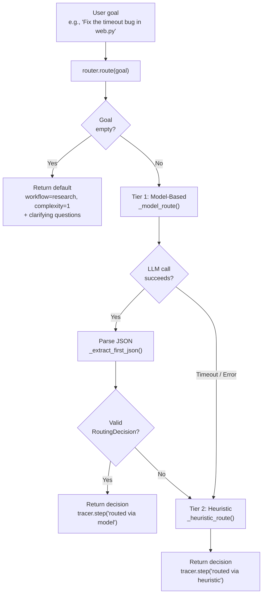

<- Back to [Router Overview](../ROUTER.md)

# 🏗️ Architecture

## 🔗 Source Code Reference

| File | Purpose |
|------|---------|
| `core/router.py` | `TaskRouter`, `RoutingDecision`, `ROUTER_SYSTEM_PROMPT`, model + heuristic routing, JSON extraction |
| `tools/workflow_tool.py` | Confidence Guard interception (low confidence → clarifying questions) |
| `core/llm.py` | LLM client used by `router.route()` and `router.classify_complexity()` |
| `core/tracer.py` | Trace logging for routing decisions |
| `core/config.py` | `router_model`, `router_timeout` configuration |
| `core/gateway_backend/dispatcher.py` | Consumes routing decisions for gateway dispatch |
| `registry.py` | Auto-discovers `@tool` decorated functions |

---

## 🌳 Module Tree

```text
core/router.py
├── ROUTER_SYSTEM_PROMPT    # Module-level constant (extracted for testability)
├── ROUTER_TOOLS            # Module-level list: 15 registered tools
├── ROUTER_WORKFLOWS        # Module-level list: 5 workflows
├── RoutingDecision         # Dataclass: workflow, tool, complexity, reason, confidence
├── TaskRouter (singleton)
│   ├── route()             # Primary entry point — model → heuristic fallback
│   ├── classify_complexity() # Quick 1-10 complexity score
│   ├── _model_route()      # LLM-based classification (Router role, 15s timeout)
│   ├── _heuristic_route()  # Keyword-based fallback (pre-compiled regex)
│   └── _extract_first_json() # Deterministic JSON extraction (3-layer)
└── router                  # Module-level singleton
```

---

## 🔀 Routing Flow



---

## 💡 Key Design Decisions

- **Speed-first** — 15s hard timeout on LLM call; heuristic fallback is O(1) regex. The Router must never block the user experience.
- **Dual-mode routing** — Model-based (primary) + keyword heuristics (fallback). Works even when LM Studio is completely offline.
- **Confidence Guard** — Low-confidence decisions are intercepted by `tools/workflow_tool.py` before launching expensive workflows, preventing VRAM waste on misunderstood tasks.
- **Robust JSON extraction** — `client.py` uses a 3-layer strategy (direct parse → markdown fence → outermost regex). `router.py` uses a different approach (`json.JSONDecoder().raw_decode()`). These are intentionally separate implementations for the same general problem.
- **Zero hardcoding** — All model references use `cfg.router_model`. No model identifiers in the router code.
- **Pre-compiled regex** — All keyword patterns are `re.compile()` at class level, not compiled on every call.
- **Priority order** — More specific patterns come before more general ones in `_heuristic_route()`. Direct tool requests are more specific than workflow requests.
- **Code-file bonus** — When code keywords match, complexity is 7 if a file extension is mentioned, 5 otherwise.
- **Trace integration** — All routing decisions are logged via `tracer.step()` with `trace_id`.

---

## 📊 Complexity Classification

The Router can independently score task complexity on a 1-10 scale. This is used by workflows to adjust timeout limits, retry counts, and context window sizes.

### The Scale

| Range | Meaning | Examples |
|-------|---------|----------|
| **1-3** | Single tool, clear input/output | "read file X", "git status", "remember this" |
| **4-6** | Multi-step, predictable | "summarize this URL", "analyze this CSV" |
| **7-9** | Complex, multiple tools, uncertainty | "fix the authentication bug", "refactor the memory module" |
| **10** | Requires human judgment | "redesign the entire architecture" |

### Usage

```python
from core.router import router

# Quick complexity score (uses Router LLM, 15s timeout)
score = router.classify_complexity("Research ChromaDB")
# Returns: 4

score = router.classify_complexity("Fix the authentication bug in tools/web.py and add unit tests")
# Returns: 8

# Falls back to 5 on LLM failure
score = router.classify_complexity("do stuff")
# Returns: 5 (default)
```

---

## 🧪 Testing

```powershell
# Run all router tests
.\venv\Scripts\python tests/core/router/ -W error --tb=short -v

> **Note:** Ensure `pytest` resolves to your venv. If not, use `python -m pytest` or the full venv path (`venv\Scripts\pytest.exe` on Windows, `venv/bin/pytest` on Unix).
```

**Test organization:**
- `conftest.py` — Shared fixtures (mock LLM, mock registry, canonical expected sets)
- `test_router_tools_complete.py` — Structural: all tools/workflows appear in prompt
- `test_router_routing_rules.py` — Parameterized: each tool/workflow has a routing rule
- `test_router_heuristic_fallback.py` — Behavioral: heuristic patterns route correctly + false-positive regression tests
- `test_router_drift.py` — CI check: prompt tool list matches expected set

**Mock strategy:**
- Mock `llm.complete()` to return controlled JSON responses
- Test heuristic routing separately (no LLM dependency)
- Test JSON extraction with malformed inputs (markdown fences, nested objects, trailing text)

---

## ⚠️ Known Concerns

- **Heuristic pattern overlap** — `_RE_REPORT` matches `chart`, `plot`, `dashboard`. `_RE_DATA` also matches `csv`, `excel`, `spreadsheet`. `_RE_DIRECT_BROWSER` matches `take a screenshot` which could overlap with vision's `screenshot analysis`. Since report is checked first in `_heuristic_route()`, goals like "plot a chart of this data" will route to `direct → report` instead of `data → python`. The priority order is intentional — direct tool requests are more specific than workflow requests. If a user says "create a chart", they likely want the report tool. If they say "analyze this CSV with pandas", the data workflow catches it because `pandas` is in `_RE_DATA` but not in `_RE_REPORT`.
- **Router prompt length** — The router prompt lists 5 workflows and 15 tools with individual routing rules (~30 lines). For very small router models (e.g., 2B parameters), a longer prompt may slightly increase latency. The prompt is still well within the context window of gemma-2-2b-it (8K context). If latency becomes an issue, the rules can be compressed into a single-line format.

---

*Last updated: 2026-07-04. See [API.md](API.md) for method details, [CHANGELOG.md](CHANGELOG.md) for version history, [INSTRUCTIONS.md](INSTRUCTIONS.md) for AI editing rules.*
