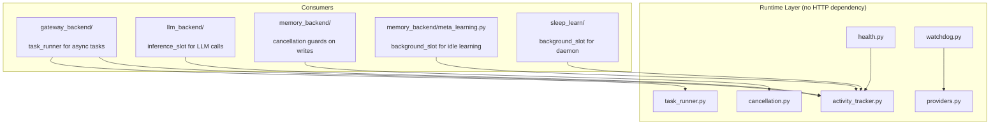
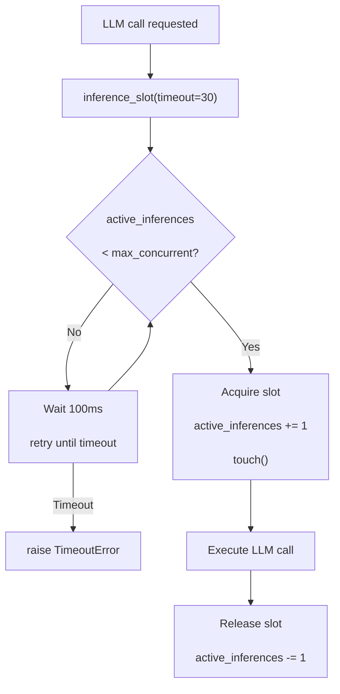
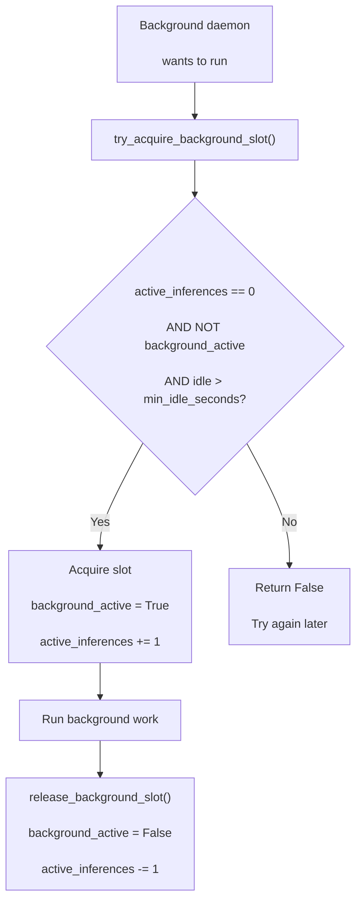
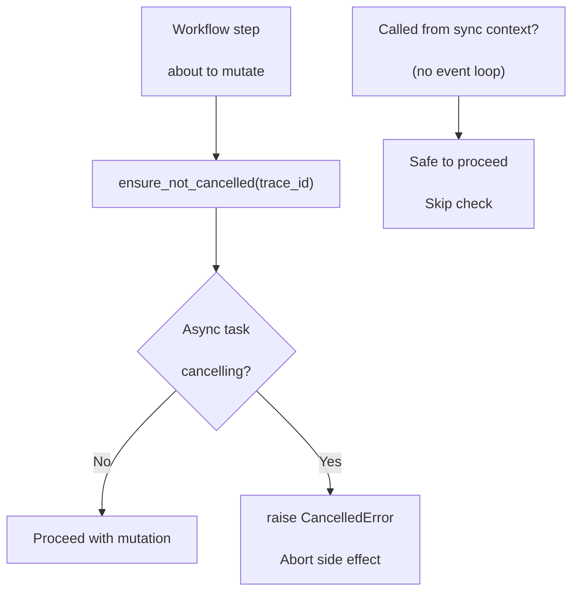
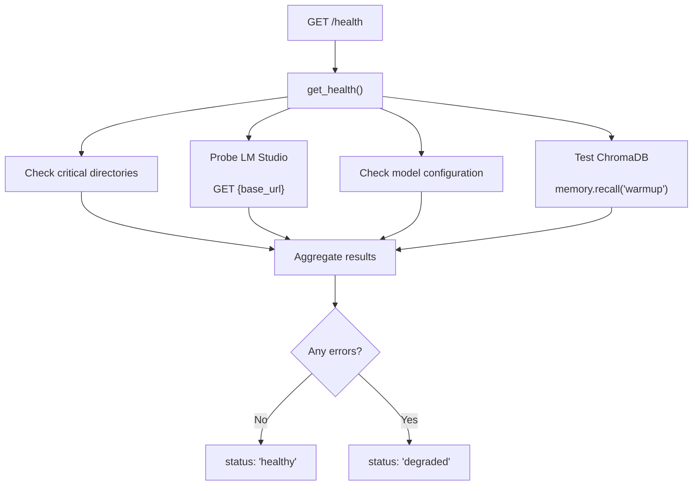
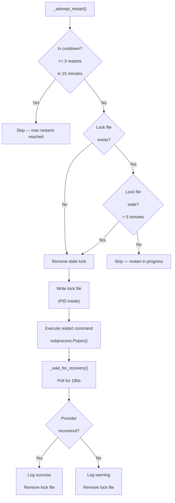

<- Back to [RUNTIME Overview](../RUNTIME.md)

# 🏗️ Architecture

## 🔗 Source Code Reference

| File | Purpose |
|------|---------|
| `core/runtime/activity_tracker.py` | `ActivityTracker`: idle detection, inference slots, background slots |
| `core/runtime/cancellation.py` | `ensure_not_cancelled()`: async cancellation guard |
| `core/runtime/health.py` | `get_health()`, `health_check_endpoint()`: subsystem status |
| `core/runtime/providers.py` | `RuntimeProvider` ABC, `LMStudioProvider`, `OllamaProvider`, `VLLMProvider` |
| `core/runtime/task_runner.py` | `ThreadPoolExecutor`, `run_background_task()`, timeout monitoring |
| `core/runtime/watchdog.py` | `RuntimeWatchdog`: health probe + auto-restart |
| `core/config.py` | `max_concurrent_inferences`, `runtime_provider`, `lm_studio_base_url` |
| `core/gateway_backend/factory.py` | Calls `init_executor()`, `shutdown_executor()` in lifespan |
| `core/gateway_backend/dependencies.py` | Calls `tracker.touch()` on every request |
| `core/llm_backend/client.py` | Uses `tracker.inference_slot()` for LLM calls |
| `core/memory_backend/write_ops.py` | Uses `ensure_not_cancelled()` before mutations |
| `core/memory_backend/meta_learning.py` | Uses `tracker.try_acquire_background_slot()` |
| `core/sleep_learn/daemon.py` | Uses `tracker.try_acquire_background_slot()` |

---

## 🌳 Module Tree

```text
core/runtime/
├── activity_tracker.py     # Global activity/idle tracking, inference slot management
├── cancellation.py         # Async cancellation guards (prevent ghost mutations)
├── health.py               # Health check logic (dirs, LM Studio, ChromaDB, models)
├── providers.py            # LLM server provider abstraction (LM Studio, Ollama, vLLM)
├── task_runner.py          # Gateway background task executor (ThreadPoolExecutor)
└── watchdog.py             # Process watchdog (health probe + auto-restart)
```

---

## 🔀 Integration Flow



> **Key rule:** The runtime layer never imports from `gateway_backend`, `tools`, or `workflows`. It's a pure foundation layer.

---

## 🔀 Activity Tracker Flows

### Inference Slots



### Background Slot Acquisition



---

## 🔀 Cancellation Guard Flow



---

## 🔀 Health Check Flow



---

## 🔀 Watchdog Loop

```mermaid
graph TD
    A["Start run_forever()"] --> B["Sleep 30s"]
    B --> C["_check_health()"]
    C --> D["HTTP GET
<br/>provider.health_url
<br/>timeout=3s"]
    D --> E{Status 200
<br/>AND
<br/>is_ready()?}
    E -->|Yes| F["Reset failure_count
<br/>Update last_success_time"]
    E -->|No| G{In grace
<br/>period?
<br/><60s since success}
    G -->|Yes| H["Ignore transient failure"]
    G -->|No| I["failure_count += 1"]
    I --> J{failure_count
<br/>>= 3?}
    J -->|No| B
    J -->|Yes| K["_attempt_restart()"]
    K --> B
    F --> B
    H --> B
```

### Restart Logic



---

## 🔀 Background Task Runner Flow

```mermaid
graph TD
    A["POST /task"] --> B["run_background_task()
<br/>trace_id, execute_fn, timeout=300"]
    B --> C["executor.submit(execute_fn)
<br/>ThreadPoolExecutor(max_workers=10)"]
    C --> D["Return immediately
<br/>HTTP 202 Accepted"]
    C --> E["_monitor_timeout()
<br/>daemon thread"]
    E --> F{future.result()
<br/>completes in time?}
    F -->|Yes| G["Done"]
    F -->|No (300s)| H["Log timeout error
<br/>Call on_timeout_fn
<br/>future.cancel()"]
```

---

## 💡 Key Design Decisions

- **No HTTP dependency** — Runtime modules never import from `gateway_backend`, `tools`, or `workflows`. One-way dependency: consumers import from runtime, never the reverse.
- **RLock for activity tracker** — `threading.RLock()` is critical because `touch()` is called inside `inference_slot()`, which already holds the lock. A regular `Lock()` would deadlock.
- **Singleton activity tracker** — Module-level `tracker` instance. No factory needed — it's a global process resource.
- **Cancellation guards prevent ghost mutations** — `ensure_not_cancelled()` checks `asyncio.current_task().cancelling()` before every write operation. Safely ignores the check in sync contexts (no event loop).
- **Provider abstraction for watchdog** — `RuntimeProvider` ABC with `LMStudioProvider`, `OllamaProvider`, `VLLMProvider`. The watchdog uses `get_provider(cfg.runtime_provider)` — no hardcoded URLs or commands.
- **Watchdog lock file + stale detection** — `.watchdog_restart.lock` prevents concurrent restarts. Lock files older than 5 minutes are automatically removed (handles process crashes).
- **Cooldown + grace period** — Max 3 restarts per 15-minute window. 60-second grace period after successful recovery ignores transient failures.
- **Windows-specific subprocess flags** — `DETACHED_PROCESS | CREATE_NEW_PROCESS_GROUP` + `STARTUPINFO` with `SW_HIDE`. Always guarded by `sys.platform` check.
- **Daemon timeout monitor** — `_monitor_timeout()` runs in a daemon thread. Won't prevent process exit. Uses `future.cancel()` as best-effort cancellation.
- **Graceful shutdown** — `shutdown_executor()` called during app lifespan with `wait=True, cancel_futures=True`. Never `wait=False` — zombie threads corrupt state.
- **Health check completeness** — Every critical component (dirs, LM Studio, models, ChromaDB) is verifiable via `GET /health`. New subsystems must add a corresponding check.
- **Activity tracker has no persistence** — All state is in-memory. After restart, `background_active` resets to `False` and `last_user_activity` resets to `time.time()`. This is intentional — daemons won't trigger until `min_idle_seconds` after restart.
- **Watchdog restarts LM Studio by default** — Default restart commands (`lms server start`, `ollama serve`, `vllm serve`) are basic. For non-default server setups (systemd, Docker), `LM_STUDIO_RESTART_CMD` should be configured. Consider adding a `RUNTIME_RESTART_CMD` alias.
- **Health check vs. watchdog probe independence** — Health check uses `httpx.get(base_url, timeout=5)`; watchdog uses `httpx.get(provider.health_url, timeout=3.0)`. Different timeouts and endpoints serve different purposes (user-facing health vs. process-level monitoring). Conflicting results are acceptable and documented.

---

## 🧪 Testing

```powershell
# Run all runtime tests
.\venv\Scripts\python tests/core/runtime/ -W error --tb=short -v

> **Note:** Ensure `pytest` resolves to your venv. If not, use `python -m pytest` or the full venv path (`venv\Scripts\pytest.exe` on Windows, `venv/bin/pytest` on Unix).
```

**Test coverage:**

| File | Tests | Coverage |
|------|-------|----------|
| `test_activity_tracker.py` | — | Idle detection, inference slots, background slots, thread safety, RLock deadlock prevention |
| `test_cancellation.py` | — | Async cancellation detection, sync context skip, ghost mutation prevention |
| `test_health.py` | — | Directory checks, LM Studio probe, model config, ChromaDB recall, degraded status |
| `test_providers.py` | — | Provider factory, `is_ready()` for all 3 providers, unknown provider fail-fast |
| `test_task_runner.py` | — | Executor init/shutdown, background task submission, timeout monitoring, daemon thread |
| `test_watchdog.py` | — | Health probe loop, restart logic, lock file handling, stale lock detection, cooldown, grace period |

**Mock strategy:**
- **ActivityTracker:** Use real instance, test concurrency with threading
- **Cancellation:** Mock `asyncio.current_task()` and `task.cancelling()`
- **Health:** Mock `httpx.get()`, `memory.recall()`, `cfg` paths
- **Watchdog:** Mock `httpx.get()`, `subprocess.Popen()`, lock file filesystem
- **TaskRunner:** Use real `ThreadPoolExecutor` with fast-executing functions

**Current test layout:**
```text
tests/core/runtime/
├── test_activity_tracker.py
├── test_cancellation.py
├── test_health.py
├── test_providers.py
├── test_task_runner.py
└── test_watchdog.py
```

---

*Last updated: 2026-07-04. See [API.md](API.md) for module details, [CHANGELOG.md](CHANGELOG.md) for version history, [INSTRUCTIONS.md](INSTRUCTIONS.md) for AI editing rules.*
