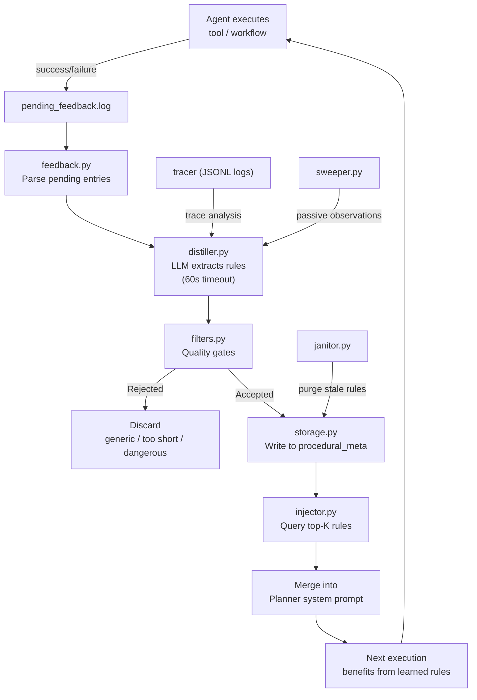
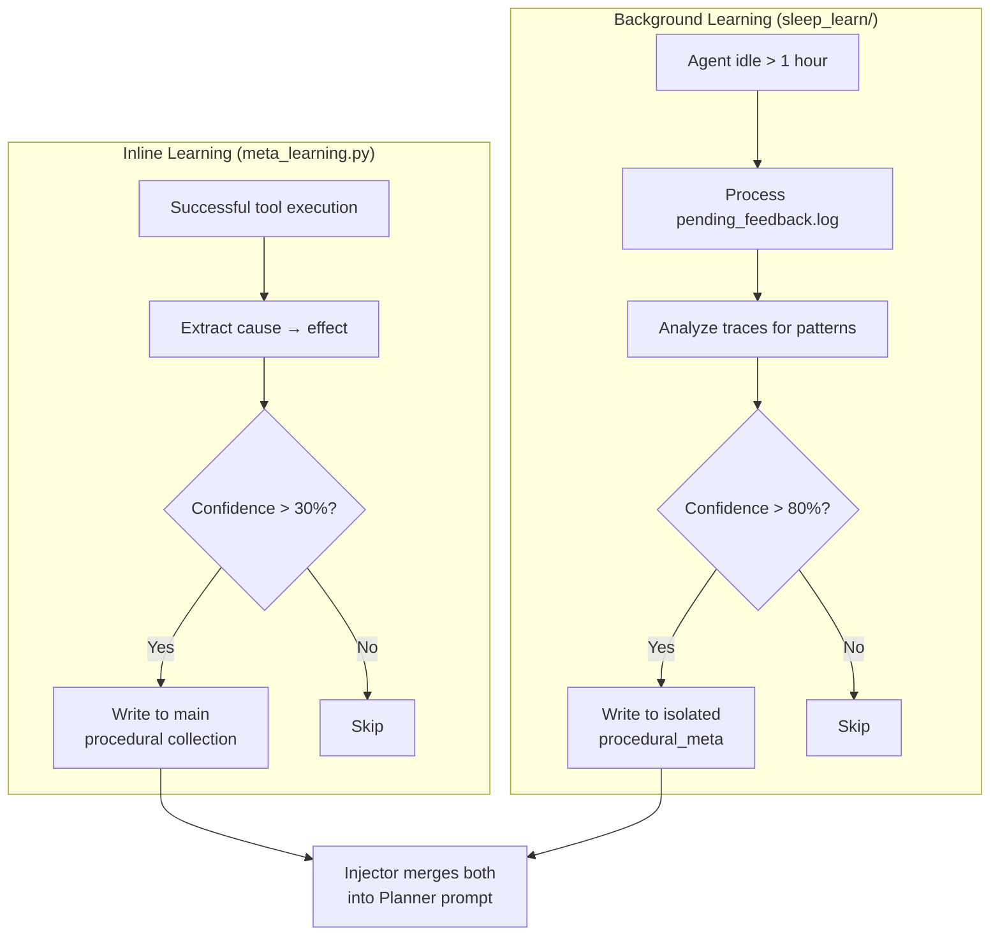
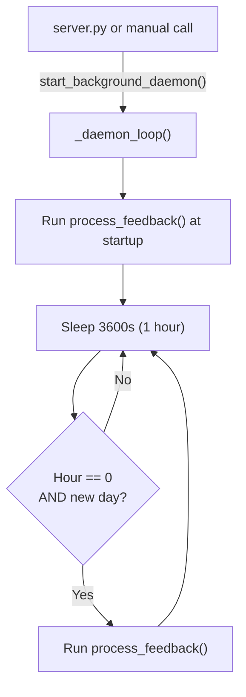

<- Back to [Sleep & Learn Overview](../SLEEP_LEARN.md)

# 🏗️ Architecture

## 🔗 Source Code Reference

| File | Purpose |
|------|---------|
| `core/sleep_learn/daemon.py` | `start_background_daemon()` — scheduler startup |
| `core/sleep_learn/feedback.py` | `process_feedback()` — confidence scoring loop |
| `core/sleep_learn/distiller.py` | `distill_observation()` — LLM-based rule extraction |
| `core/sleep_learn/filters.py` | `is_quality_rule()` — quality and safety gates |
| `core/sleep_learn/storage.py` | `save_rule()` — write to isolated `procedural_meta` |
| `core/sleep_learn/injector.py` | `inject_rules_into_prompt()` — merge into Planner prompt |
| `core/sleep_learn/logger.py` | `log_event()` — structured JSONL logging |
| `core/sleep_learn/config.py` | `SLEEP_*` configuration constants |
| `core/sleep_learn/sweeper.py` | `sweep_recent_observations()` — Phase 1 passive gathering |
| `core/sleep_learn/janitor.py` | `purge_stale_rules()` — confidence + age-based purging |
| `core/memory_backend/meta_learning.py` | Inline learning (parallel system, writes to main `procedural`) |
| `core/memory_engine.py` | Main memory facade — queried by injector for split-brain fallback |
| `core/llm_backend/client.py` | `llm.complete()` — LLM calls from distiller |
| `core/config.py` | `SLEEP_*` environment variables |

---

## 🌳 Module Tree

```text
core/sleep_learn/
├── __init__.py              # Public exports: start_background_daemon, sweep_recent_observations,
│                            #   inject_rules_into_prompt, get_relevant_rules
├── daemon.py                # start_background_daemon() — startup + midnight scheduler
├── sweeper.py               # sweep_recent_observations() — Phase 1 passive event gathering
├── feedback.py              # process_feedback() — confidence scoring loop
├── distiller.py             # distill_observation() — LLM rule extraction (60s timeout)
├── filters.py               # is_quality_rule() — generic/dangerous rule rejection
├── storage.py               # save_rule() — write to isolated ChromaDB collection
├── injector.py              # inject_rules_into_prompt() + get_relevant_rules()
├── logger.py                # log_event() — structured JSONL logging
├── config.py                # SLEEP_* configuration constants
└── janitor.py               # purge_stale_rules() — confidence + age-based rule purging
```

---

## 🔀 Data Flow



---

## 🔀 Relationship to Meta-Learning

The Sleep & Learn daemon is one of **two parallel learning systems**:



| Aspect | Inline (`meta_learning.py`) | Background (`sleep_learn/`) |
|--------|---------------------------|---------------------------|
| **When** | After successful tool execution | At startup + midnight; during idle periods (>1h) |
| **Threshold** | 30% confidence (heuristic) | 80% confidence (LLM-evaluated) |
| **Collection** | Main `procedural` | Isolated `procedural_meta` |
| **Latency** | Immediate effect | Deferred (next session) |
| **Source** | Single execution context | Cross-trace pattern analysis |
| **Dedup** | Hash + vector on main collection | Hash + vector on isolated collection |

---

## 🔄 Execution Flow

### Daemon Lifecycle



> **Note:** The daemon does NOT use `try_acquire_background_slot()` or idle detection. It runs unconditionally at startup and hourly thereafter. Idle detection is planned for a future version.

### Trigger Conditions

| Trigger | Condition | Frequency |
|---------|-----------|-----------|
| **Startup** | `start_background_daemon()` called | Once per agent start |
| **Midnight job** | `tm_hour == 0` and new date | Once per day |
| **Manual** | `sleep_learn` action via MCP tool | On demand |

---

## 🛡️ Hard Guardrails

| # | Guardrail | Why | Implementation |
|---|-----------|-----|----------------|
| 1 | **Public API Only** | Prevents bypassing rate limiters, token budgets, circuit breakers | Daemon uses only `llm.complete()`, never raw HTTP |
| 2 | **Physical Isolation** | Prevents learned rules from polluting main collections | Separate ChromaDB instance at `memory_root/sleep_learn_db/` |
| 3 | **Ouroboros Prevention** | Prevents self-reinforcing feedback loops | Daemon never reads from `procedural_meta` during distillation |
| 4 | **Zero Coupling** | Prevents circular imports and tight coupling | Feedback reads JSONL logs directly, never imports tracer |
| 5 | **Lazy Loading** | Prevents slowing agent startup | All ChromaDB imports inside functions, not at module level |
| 6 | **Idle-Only Execution** | Prevents VRAM contention with user-facing calls | Daemon runs in background thread, not on main loop |
| 7 | **Confidence Thresholds** | Prevents low-quality rules from reaching Planner | 80% minimum confidence for rule extraction |
| 8 | **VRAM Safety** | Prevents hung LLM calls from consuming resources | 60s timeout in `llm.complete()` with circuit breaker protection |

---

## 🧪 Testing

```powershell
# Run all sleep_learn tests
.\venv\Scripts\python tests/core/sleep_learn/ -W error --tb=short -v

> **Note:** Ensure `pytest` resolves to your venv. If not, use `python -m pytest` or the full venv path (`venv\Scripts\pytest.exe` on Windows, `venv/bin/pytest` on Unix).
```

**Mock strategy:**
- Mock `llm.complete()` to return controlled rule JSON
- Mock `_get_collection()` for storage tests
- Mock `tracer.get()` and `tracer.recent()` for feedback tests
- Use real `filters.py` functions (pure logic, no side effects)
- Patch `cfg.sleep_learn_log_path` to tmp_path for safe file writes

---

## ⚠️ Known Concerns

- **Two parallel learning systems** — Both `meta_learning.py` and `sleep_learn/` extract procedural rules. The injector merges both collections. This works, but: (1) semantic duplicates may be injected (paraphrases not caught by hash dedup), (2) conflicting rules have no resolution mechanism, (3) two codebases = two maintenance paths. *(Suggestion: Consider consolidating into a single pipeline with two modes writing to the same collection with `source` metadata.)*
- **v1.0: Idle detection added** — `daemon.py` now gates on `tracker.try_acquire_background_slot(min_idle_seconds=300)` before running. Prevents unnecessary resource usage in test/short-lived scripts.
- **Sweeper is Phase 1 only** — `sweeper.py` returns a heartbeat observation and does not integrate with `core.tracer` or `core.memory_backend`. The distiller relies on external observations being passed in. *(Suggestion: Integrate sweeper with tracer or remove it and have distiller accept observations directly from callers.)*
- **Injector wiring unclear** — It is not clear from the codebase where `inject_rules_into_prompt()` is actually called during Planner prompt assembly. If not wired into the Planner's `complete()` call path, all the feedback processing, distillation, and filtering infrastructure is unused. *(Suggestion: Document the exact call site or add a TODO to prioritize integration.)*

---

*Last updated: 2026-07-04. See [API.md](API.md) for component details, [CHANGELOG.md](CHANGELOG.md) for version history, [INSTRUCTIONS.md](INSTRUCTIONS.md) for AI editing rules.*
