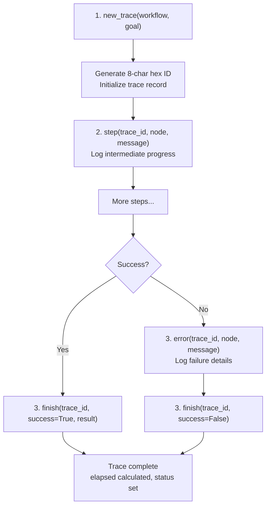
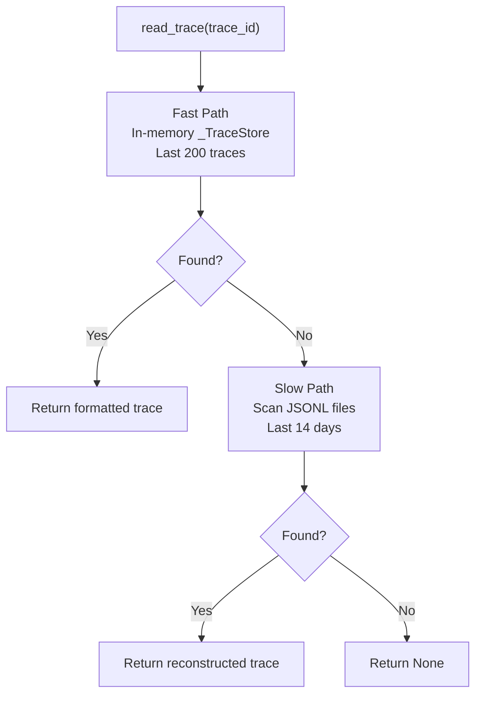
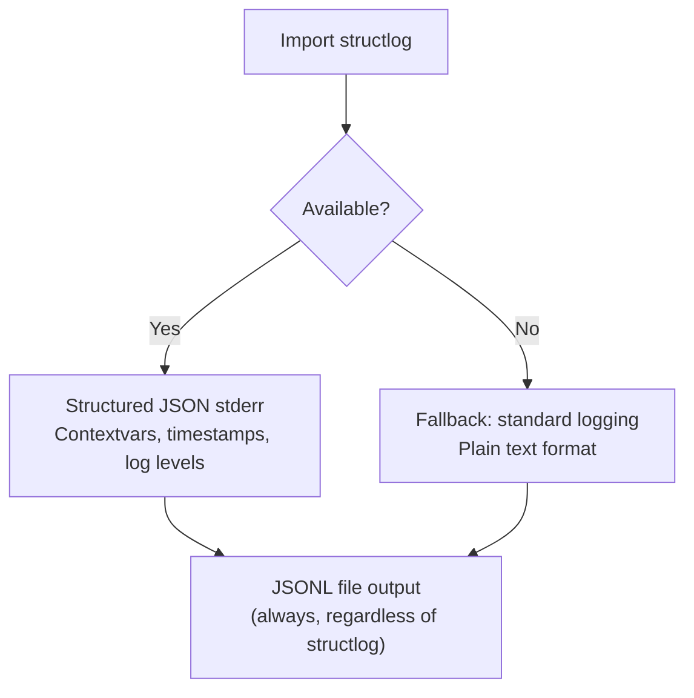
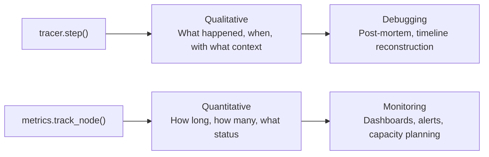

<- Back to [Tracer Overview](../TRACER.md)

# 📝 API Reference

> **📍 Implementation location (v1.3+):** The Tracer implementation lives in `core/observability/tracer_engine.py`. This document describes the API as exposed via the `core.tracer` facade. For the full observability subsystem (reader, metrics, checkpoint), see [observability/API.md](../observability/API.md).

> **v1.1 note (2026-07-18):** `tracer.step/error/warning/finish` all require a real `trace_id` from `new_trace()` — never a literal or empty string. The `warning()` row in the Core Methods table below takes the SAME signature as `step()` (`trace_id, node, message, **kwargs`); earlier docs that described it as `(node, **kwargs)` with "no trace_id required" were incorrect.

## 🔧 API Overview

The Tracer exposes core methods for trace lifecycle management, retrieval, and querying. All output goes to stderr and JSONL files — never stdout.

---

## ⚡ Core Methods

| Method | Signature | Description |
|--------|-----------|-------------|
| `new_trace()` | `(workflow: str, goal: str = "", **kwargs) -> str` | Create trace, return 8-char hex ID |
| `step()` | `(trace_id: str, node: str, message: str = "", **kwargs) -> None` | Log intermediate step |
| `error()` | `(trace_id: str, node: str, message: str = "", **kwargs) -> None` | Log error event |
| `finish()` | `(trace_id: str, success: bool = True, result: str = "", **kwargs) -> None` | Mark trace complete |
| `get()` | `(trace_id: str) -> Optional[dict]` | Retrieve full in-memory trace record |
| `recent()` | `(n: int = 10) -> list[dict]` | Get N most recent traces (newest first) |
| `summary()` | `(trace_id: str) -> str` | One-line human-readable summary |
| `warning()` | `(trace_id: str, node: str, message: str = "", **kwargs) -> None` | Log warning on an active trace (requires `trace_id` from `new_trace()`) |

---

## 🔄 Trace Lifecycle

Every significant operation follows this lifecycle:



### 1. Create Trace

```python
from core.tracer import tracer

tid = tracer.new_trace(
    workflow="autocode",
    goal="fix memory.py import error"
)
# Returns: "a3f2c0b1"
```

**What happens:**
- Generates unique 8-char hex ID from `uuid4`
- Initializes trace record in `_TraceStore`
- Logs `trace_start` event to JSONL and stderr
- Returns `trace_id` for all subsequent calls

### 2. Log Steps

```python
tracer.step(
    tid,
    "read",
    "file loaded",
    chars=4200,
    latency_ms=12.5
)
```

**What happens:**
- Appends step to trace's `steps` list in `_TraceStore`
- Writes to JSONL file
- Outputs to stderr
- All `**kwargs` are merged into the JSONL record

### 3. Log Errors

```python
tracer.error(
    tid,
    "apply",
    "patch failed",
    error="context mismatch"
)
```

**What happens:**
- Logs error event (does NOT mark trace as failed — use `finish(success=False)` for that)
- Writes to JSONL file
- Outputs to stderr

### 4. Finish Trace

```python
tracer.finish(
    tid,
    success=True,
    result="committed abc123"
)
```

**What happens:**
- Calculates total elapsed time
- Sets terminal status (`success` or `failed`)
- Logs `trace_finish` event
- Writes final summary to JSONL and stderr

---

### Trace Record Structure

```python
{
    "trace_id": "a3f2c0b1",
    "workflow": "autocode",
    "goal": "fix memory.py import error",
    "started_at": 1716825600.0,
    "started_fmt": "2026-06-19 10:30:00",
    "status": "success",
    "elapsed": 45.2,
    "result": "committed abc123",
    "steps": [
        {"ts": 1716825600.1, "event": "step", "node": "read", "message": "file loaded"},
        {"ts": 1716825612.5, "event": "step", "node": "apply", "message": "patch applied"},
        {"ts": 1716825645.0, "event": "step", "node": "commit", "message": "committed"}
    ]
}
```

### Summary Format

```python
tracer.summary("a3f2c0b1")
# "[a3f2c0b1] autocode | goal='fix memory.py' | status=success | steps=12 | elapsed=45.2s"
```

---

## 🔍 Trace Retrieval

### Trace Reader (`core/tracer_reader.py`)

The trace reader provides two-path retrieval:



| Path | Source | Speed | Limit |
|------|--------|-------|-------|
| **Fast** | In-memory `_TraceStore` | ~0.1ms | Last 200 traces |
| **Slow** | JSONL disk scan | ~100ms–2s | Last 14 days of logs |

**Slow path optimizations:**
- Quick string check (`trace_id not in line`) before expensive JSON parse
- Scans newest files first
- Limited to 14 most recent log files

### HTTP Endpoints (via Gateway)

| Endpoint | Auth | Description |
|----------|------|-------------|
| `GET /traces` | Bearer | List recent traces from memory (default limit: 10) |
| `GET /traces/{trace_id}` | Bearer | Full execution timeline (memory → disk fallback) |

---

## 📤 Output Destinations

### 1. Standard Error (`sys.stderr`)

| Condition | Output Format |
|-----------|---------------|
| **structlog installed** | Structured JSON with timestamps, log levels, context variables |
| **structlog missing** | Plain text: `[step] trace_id | node | message` |

**Visibility:** Terminal when running `python server.py`, or MCP host's debug console.

### 2. JSONL Files (`logs/agent_YYYYMMDD.jsonl`)

**Format:** One JSON object per line, queryable with `jq` or Python.

**Example entry:**

```json
{
  "event": "step",
  "trace_id": "a3f2c0b1",
  "node": "memory_recall",
  "message": "Querying ChromaDB",
  "ts": 1716825600.123,
  "latency_ms": 45.2,
  "original": "how to fix syntax errors",
  "rewritten": "fix syntax error"
}
```

**Properties:**

| Property | Value | Description |
|----------|-------|-------------|
| Rotation | Daily | New file at midnight (`agent_YYYYMMDD.jsonl`) |
| Persistence | Survives restarts | Essential for post-mortem debugging |
| Thread safety | `threading.Lock()` | Prevents interleaved JSON lines |
| Auto-flush | `f.flush()` after every write | Crash-safe — logs persisted immediately |
| Silent I/O errors | Non-fatal disk errors ignored | Logging failure never crashes the agent |

### 3. In-Memory Trace Store (`_TraceStore`)

| Property | Value | Description |
|----------|-------|-------------|
| Capacity | 200 traces | Prevents unbounded memory growth |
| Eviction | FIFO | Oldest trace silently dropped when limit reached |
| Thread safety | `threading.Lock()` | All reads/writes guarded |
| Access | `tracer.get()`, `tracer.recent()` | Fast path for API and internal use |

---

## 🔌 Structlog & Graceful Fallback

The tracer attempts to use `structlog` for rich, structured JSON logging to stderr. If missing, it falls back to standard `logging`.



| Condition | stderr Output | File Output |
|-----------|---------------|-------------|
| **structlog installed** | Structured JSON with contextvars | JSONL (always) |
| **structlog missing** | Plain text `[step] trace_id | node | message` | JSONL (always) |

**Why this matters:** If a user clones the repo and forgets `pip install structlog`, the agent still boots and logs correctly. Core observability never breaks from a missing optional dependency.

### Log Level Control

| Env Variable | `AUTOCODE_DEBUG=0` | `AUTOCODE_DEBUG=1` |
|--------------|--------------------|--------------------|
| structlog level | INFO (20) | DEBUG (10) |
| standard logging level | INFO | DEBUG |

---

## 📊 Observability Integration

### Prometheus Metrics (`core/metrics.py`)

The tracer works alongside the metrics module for quantitative monitoring:

| Metric | Type | Description |
|--------|------|-------------|
| `autocode_node_duration_seconds` | Histogram | Duration of node execution |
| `autocode_task_status_total` | Counter | Task outcomes (success/failed) |
| `autocode_tdd_iterations` | Histogram | TDD iterations per task |
| `autocode_llm_tokens_total` | Counter | Token consumption by role |

Exposed at `GET /metrics` in Prometheus text format.

### Trace-Metrics Relationship



---

## 🖥️ CLI Querying

```bash
# Find all errors from today
cat logs/agent_20260619.jsonl | jq 'select(.event == "error")'

# Find all steps for a specific trace
cat logs/agent_20260619.jsonl | jq 'select(.trace_id == "a3f2c0b1")'

# Count steps per workflow
cat logs/agent_20260619.jsonl | jq -r '.workflow' | sort | uniq -c

# Find slowest traces
cat logs/agent_20260619.jsonl | jq 'select(.event == "trace_finish") | {trace_id, elapsed_s}' | sort -k2 -n
```

### Python Querying

```python
import json
from pathlib import Path

log_file = Path("logs/agent/agent_20260619.jsonl")
for line in log_file.read_text().splitlines():
    record = json.loads(line)
    if record.get("event") == "error":
        print(f"[{record['trace_id']}] {record['node']}: {record['message']}")
```

---

*Last updated: 2026-07-18. See [ARCHITECTURE.md](ARCHITECTURE.md) for file maps and design decisions, [CHANGELOG.md](CHANGELOG.md) for version history, [INSTRUCTIONS.md](INSTRUCTIONS.md) for AI editing rules. For the full observability subsystem API, see [../observability/API.md](../observability/API.md).*
