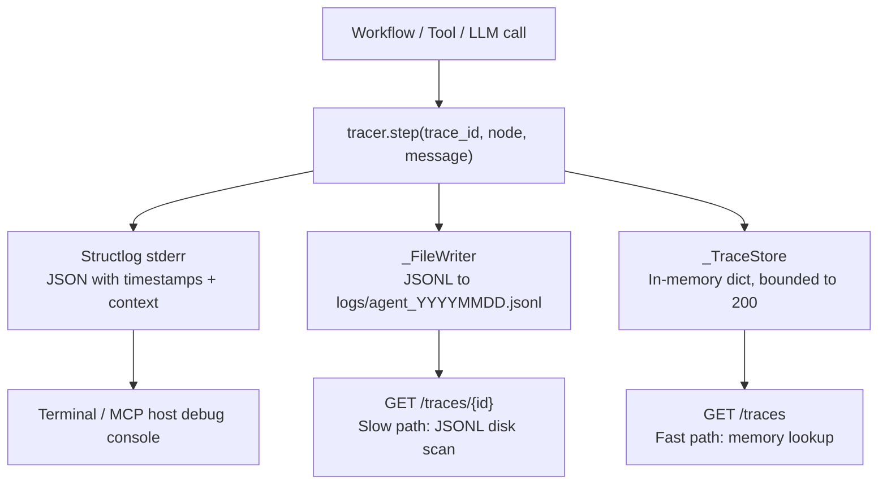

<- Back to [Tracer Overview](../TRACER.md)

# 🏗️ Architecture

## 🔗 Source Code Reference

| File | Purpose |
|------|---------|
| `core/tracer.py` | `Tracer` singleton, `_FileWriter`, `_TraceStore`, `generate_trace_id()` |
| `core/tracer_reader.py` | `read_trace()`, `list_recent_traces()` — memory + disk retrieval |
| `core/metrics.py` | Prometheus metrics (complementary to tracer) |
| `core/config.py` | `log_path`, `autocode_debug` configuration |
| `core/gateway_backend/routes/traces.py` | HTTP endpoints: `GET /traces`, `GET /traces/{id}` |
| `core/gateway_backend/routes/metrics.py` | HTTP endpoint: `GET /metrics` |
| `core/gateway_backend/factory.py` | Request-ID middleware (assigns trace_id to every request) |
| `server.py` | Main entry point — all tools use tracer for logging |

---

## 🌳 Module Tree

```text
core/tracer.py                      # Tracer singleton, _FileWriter, _TraceStore
core/tracer_reader.py                # Trace retrieval (memory fast-path, disk slow-path)
core/metrics.py                     # Prometheus metrics (complementary)
```

### Component Hierarchy

```text
Tracer (singleton)
├── Trace ID Generator (uuid4 hex, 8 chars)
├── Structlog Config (stderr only, JSON renderer)
│   └── Graceful Fallback (standard logging if structlog missing)
├── _FileWriter (Thread-safe JSONL, daily rotation)
├── _TraceStore (In-memory, bounded to 200 traces)
└── Trace Reader (core/tracer_reader.py)
    ├── Fast Path (In-memory lookup via _TraceStore)
    └── Slow Path (Disk scan of last 14 days of JSONL logs)
```

---

## 🔀 Data Flow



---

## 💡 Key Design Decisions

- **MCP stdio safety** — NEVER writes to `sys.stdout`. All output goes to `sys.stderr` and JSONL files. Any `print()` without `file=sys.stderr` will crash the MCP connection.
- **Dual output** — Structured stderr (console) + JSONL files (persistent, queryable). Provides both real-time visibility and post-mortem analysis.
- **Trace ID propagation** — Every operation tagged with 8-char hex ID from `uuid4`. Enables end-to-end correlation across workflows, tools, and LLM calls.
- **Bounded memory** — In-memory `_TraceStore` capped at 200 traces with FIFO eviction. Prevents unbounded memory growth in long-running agents.
- **Thread-safe** — All writes guarded by `threading.Lock()`. Concurrent workflow executions are safe.
- **Graceful degradation** — Falls back to standard `logging` if `structlog` is missing. Core observability never breaks from a missing optional dependency.
- **Daily rotation** — JSONL files rotate daily (`agent_YYYYMMDD.jsonl`). `_FileWriter` checks the date on every write.
- **Silent I/O errors** — `_FileWriter` intentionally ignores non-fatal disk errors. A logging failure should never crash the agent.
- **Auto-flush** — `f.flush()` after every write. Crash-safe — logs persisted immediately.
- **Trace-Metrics separation** — `tracer.step()` provides qualitative data (what happened, when, with what context). `core/metrics.py` provides quantitative data (how long, how many, what status). Both are needed for full observability.

---

## 🧪 Testing

```powershell
# Run all tracer tests
.\venv\Scripts\python tests/core/tracer/ -W error --tb=short -v

> **Note:** Ensure `pytest` resolves to your venv. If not, use `python -m pytest` or the full venv path (`venv\Scripts\pytest.exe` on Windows, `venv/bin/pytest` on Unix).
```

> ⚠️ `tracer_reader.py` currently has no dedicated test file — only `tests/core/tracer/test_tracer.py` exists.

**Mock strategy:**
- Mock `_FileWriter` for unit tests (avoid disk I/O)
- Use real `_TraceStore` for concurrency tests
- Test structlog fallback by mocking `import structlog` to raise `ImportError`

---

## ⚠️ Known Concerns

- **`tracer.step()` 2-arg signature usage** — Some callers use `tracer.step("health", "Health check")` with only 2 positional arguments. The signature is `step(trace_id, node, message="")`, so this sets `trace_id="health"` and `node="Health check"`. This produces trace records with a non-unique identifier that could collide with other health check calls. For non-trace-scoped logging, use `tracer.warning()` or a dedicated logging call. Reserve `tracer.step()` for trace-scoped operations with real trace IDs.
- **JSONL file growth** — JSONL files are created daily and never compressed. Over time, a busy agent can produce hundreds of megabytes of logs. No automatic compression or archival of old log files. The 14-day scan limit in `tracer_reader.py` prevents performance issues, but disk usage grows unbounded. *(Suggestion: Add a log rotation policy — gzip files older than 7 days, delete files older than 30 days.)*
- **No trace sampling** — Every operation is traced — no filtering or sampling. High-frequency operations (router calls, memory recalls) produce many low-value trace entries. This increases JSONL file size and in-memory store churn without proportional debugging value. *(Suggestion: Consider trace sampling for high-frequency, low-importance operations — e.g., keep only 10% of router classification traces. Important traces (errors, workflow completions) should always be kept.)*

---

*Last updated: 2026-07-04. See [API.md](API.md) for method details, [CHANGELOG.md](CHANGELOG.md) for version history, [INSTRUCTIONS.md](INSTRUCTIONS.md) for AI editing rules.*
