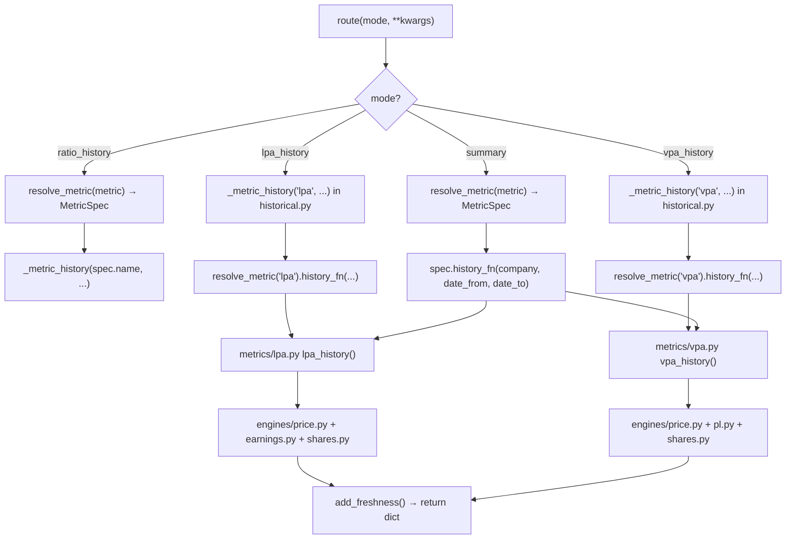

<- Back to [HISTORICAL Overview](../HISTORICAL.md)

# 🏗️ Architecture

This skill is the **pattern template** for auto-discovery + registry architecture. The engine/metric separation, auto-discovery via glob+importlib, and MetricSpec registry are designed to be copied by other skills that need extensibility.

## 🔗 Source Code Reference

| File | Purpose |
|---|---|
| `skills/cvm/historical/__init__.py` | MANIFEST + route — modes auto-generated from the registry |
| `skills/cvm/historical/historical.py` | Main: `_metric_history()`, `ratio_history()`, `summary()`. Auto-generates `<metric>_history` functions from the registry. |
| `skills/cvm/historical/engines/__init__.py` | Auto-discovery: glob + importlib for `engines/*.py` |
| `skills/cvm/historical/engines/price.py` | COTAHIST daily close: `price_at()`, `price_series()` |
| `skills/cvm/historical/engines/earnings.py` | TTM earnings: `ttm_earnings_at()`, `ttm_earnings_periods()`. DFP + ITR. |
| `skills/cvm/historical/engines/shares.py` | FRE shares: `shares_at()`, `shares_periods()` (+ investsite fallback) |
| `skills/cvm/historical/engines/pl.py` | PL snapshot: `pl_at()`, `pl_periods()`. DFP + ITR BPP 2.03. |
| `skills/cvm/historical/metrics/__init__.py` | Auto-discovery: glob + importlib for `metrics/*.py` (triggers `register_metric`) |
| `skills/cvm/historical/metrics/_registry.py` | `MetricSpec` dataclass, `METRICS` dict, `register_metric()`, `resolve_metric()` |
| `skills/cvm/historical/metrics/lpa.py` | LPA + P/L metric: `lpa_at()`, `pe_at()`, `lpa_history()`. Engines: price + earnings + shares. |
| `skills/cvm/historical/metrics/vpa.py` | VPA + P/VPA metric: `vpa_at()`, `pvpa_at()`, `vpa_history()`. Engines: price + pl + shares. |
| `skills/cvm/historical/metrics/ev_ebitda.py` | EV/EBITDA stub for future |
| `tools/report_ops/adapters/historical.py` | Auto-registered chart adapters + metric-aware summary adapter |

---

## 🧱 Engine vs Metric — The Core Pattern

This skill enforces a strict separation between **engines** (data access) and **metrics** (ratio math). This is the most important architectural rule. Violating it creates coupling that makes future metrics and the backtest skill impossible to reuse cleanly.

### Engines (basics — one per raw quantity)

An engine fetches ONE raw number at any historical date from its data source(s). Engines are **leaves** — they never import each other and never import metrics.

```
engines/
├── price.py    → price_at(ticker, date)          # COTAHIST daily close
├── earnings.py → ttm_earnings_at(company, date)   # DFP + ITR TTM derivation
├── shares.py   → shares_at(company, date)         # FRE + investsite fallback
└── pl.py       → pl_at(company, date)             # DFP + ITR BPP 2.03 snapshot
```

**Engine contract** (every engine follows this shape):
- `<quantity>_at(company, date) -> float | None` — value at most recent data point <= date
- `<quantity>_periods(company) -> list[dict]` — all data points `[{"date": "...", "<quantity>": value}, ...]` sorted oldest-first (for step-function optimization)

**Auto-discovery**: `engines/__init__.py` globs `*.py` and imports them via `importlib`. This ensures all engine modules are loaded at import time. **No registry** for engines — they are imported by name by metrics (e.g., `from skills.cvm.historical.engines.price import price_at`).

### Metrics (per-share value + price ratio)

A metric imports 2+ engines and produces BOTH a per-share value AND a price ratio. Metrics **never** query CVM/B3 directly — that's the engine's job.

```
metrics/
├── _registry.py    → MetricSpec + METRICS dict + register_metric() + resolve_metric()
├── lpa.py          → LPA (earnings/shares) + P/L (price/LPA)
├── vpa.py          → VPA (pl/shares) + P/VPA (price/VPA)
└── ev_ebitda.py    → stub for future
```

**Each metric produces both:**
- `lpa.py`: `lpa_at()` (per-share, LPA = earnings/shares) + `pe_at()` (ratio, P/L = price/LPA)
- `vpa.py`: `vpa_at()` (per-share, VPA = pl/shares) + `pvpa_at()` (ratio, P/VPA = price/Vpa)

The per-share value is useful on its own (e.g., backtest filters on EPS). The ratio tells you if the stock is cheap vs history. Both are exposed in the history series.

**Metric contract:**
- `<name>_at(company, date) -> float | None` — per-share value
- `<ratio>_at(company, date) -> float | None` — price ratio
- `<name>_history(company, date_from, date_to) -> list[dict]` — daily series with BOTH per-share + ratio

**Auto-discovery + self-registration**: `metrics/__init__.py` globs `*.py` and imports them. Each metric module calls `register_metric(MetricSpec(...))` at module level. The registry (`_registry.py`) holds all specs.

### Dependency graph (MUST stay acyclic)

```
historical.py  (orchestrator — reads from registry, knows both layers)
       │
       ├── metrics/_registry.py  (MetricSpec registry, resolve_metric)
       │       │
       │       ├── metrics/lpa.py  ──┬── engines/price.py
       │       │                      ├── engines/earnings.py
       │       │                      └── engines/shares.py
       │       │
       │       └── metrics/vpa.py  ──┬── engines/price.py
       │                              ├── engines/pl.py
       │                              └── engines/shares.py
       │
       └── (engines never point upward — they're leaves)
```

Engines never point upward. Metrics never point at other metrics. `historical.py` is the only module that knows about both engines and metrics together (via the registry).

---

## 🌳 Module Tree

```text
skills/cvm/historical/
├── __init__.py              # MANIFEST + route — modes auto-generated from registry
├── historical.py            # _metric_history(), ratio_history(), summary()
├── engines/
│   ├── __init__.py          # Auto-discovery: glob + importlib for *.py
│   ├── price.py             # COTAHIST: price_at(), price_series()
│   ├── earnings.py          # DFP + ITR TTM: ttm_earnings_at(), ttm_earnings_periods()
│   ├── shares.py            # FRE + investsite: shares_at(), shares_periods()
│   └── pl.py                # DFP + ITR BPP 2.03: pl_at(), pl_periods()
└── metrics/
    ├── __init__.py          # Auto-discovery: glob + importlib for *.py (excludes _registry)
    ├── _registry.py         # MetricSpec + METRICS + register_metric + resolve_metric
    ├── lpa.py               # LPA + P/L: lpa_at(), pe_at(), lpa_history()
    ├── vpa.py               # VPA + P/VPA: vpa_at(), pvpa_at(), vpa_history()
    └── ev_ebitda.py         # stub for future
```

---

## 🔀 Dispatch Flow



---

## 🔢 TTM Earnings Algorithm (earnings.py)

The core innovation. Derives trailing twelve months earnings at any date.

```
For date D, find the most recent ITR period (data_fim_exerc <= D):

  ITR current period (e.g., Q2 2024, meses=6) = cumulative H1 2024 earnings
  ITR prior year same period (Q2 2023, meses=6) = cumulative H1 2023 earnings
  DFP prior year (2023, meses=12) = full year 2023 earnings

  TTM = DFP_2023 - ITR_2023_H1 + ITR_2024_H1
       = (full year 2023) - (H1 2023) + (H1 2024)
       = 12 months ending 2024-06-30
```

**Earnings change quarterly** (when new ITR/DFP is filed). Between filings, TTM is constant.

---

## 🏦 PL Snapshot Algorithm (pl.py)

PL is a **snapshot** (point-in-time balance), not a flow. So this engine is simpler than earnings.py — no TTM derivation. We just find the most recent BPP snapshot with `data_fim_exerc <= date`.

```
For date D:
  1. Query DFP BPP codigo 2.03 (meses=12) → annual snapshots at Dec 31
  2. Query ITR BPP codigo 2.03 (meses=3/6/9) → quarterly snapshots at Mar/Jun/Sep 30
  3. Merge all snapshots, find most recent with data_fim_exerc <= D
  4. Return that value
```

**PL changes quarterly** (when new ITR/DFP is filed). Between filings, PL is constant.

---

## 📊 Data Flow (example: lpa_history)

```
lpa_history("PETR4", "2020-01-01", "2024-12-31")
  │
  ├── price_series("PETR4", "2020-01-01", "2024-12-31")
  │     → COTAHIST: ~1200 daily close prices
  │
  ├── ttm_earnings_periods("PETR4")
  │     → DFP: all annual earnings (codigo 3.11, meses=12)
  │     → ITR: all quarterly cumulative earnings (codigo 3.11, meses 3/6/9)
  │     → Compute TTM for each ITR period (~4 per year)
  │     → Step function: [{date, ttm}, ...]
  │
  ├── shares_periods("PETR4")
  │     → FRE: distribuicao_capital (annual) — or investsite fallback
  │     → Step function: [{date, shares}, ...]
  │
  └── For each daily price:
        find most recent TTM (step function lookup)
        find most recent shares (step function lookup)
        LPA = TTM / shares
        P/L = price / LPA
        → [{date, price, ttm_earnings, shares, lpa, pe}, ...]
```

`vpa_history` follows the same pattern but uses `pl_periods()` instead of `ttm_earnings_periods()`, and computes VPA = PL / shares, P/VPA = price / VPA.

---

## 🤖 Auto-Discovery + Registry Design

### Why auto-discovery?

Before v1.2, adding a new metric required editing 4 files:
1. `metrics/<name>.py` (the metric itself)
2. `metrics/__init__.py` (add to METRICS dict)
3. `historical.py` (add to `_metric_dispatch` if/elif)
4. `__init__.py` (add `<name>_history` mode to MANIFEST)

With auto-discovery + registry, adding a metric = **drop a file in `metrics/` + `register_metric()`**. The MANIFEST modes, `ratio_history()` dispatch, `summary()` metric-awareness, and chart adapters all auto-generate from the registry.

### How it works

```python
# metrics/__init__.py — auto-discovery
import importlib
from pathlib import Path

for py_file in sorted(Path(__file__).parent.glob("*.py")):
    if py_file.name not in ("__init__.py", "_registry.py"):
        module_name = f"skills.cvm.historical.metrics.{py_file.stem}"
        importlib.import_module(module_name)  # triggers register_metric()
```

```python
# metrics/lpa.py — self-registration at module level
from skills.cvm.historical.metrics._registry import MetricSpec, register_metric

register_metric(MetricSpec(
    name="lpa",
    per_share_label="LPA", per_share_key="lpa", per_share_fn=lpa_at,
    ratio_label="P/L", ratio_key="pe", ratio_fn=pe_at,
    history_fn=lpa_history,
    engines=["price", "earnings", "shares"],
    aliases=["pe", "pl", "p/l"],
))
```

```python
# __init__.py — MANIFEST auto-generation
def _build_metric_modes():
    modes = {}
    for name in list_metrics():
        spec = METRICS[name]
        modes[f"{name}_history"] = {
            "description": f"Daily {spec.per_share_label} + {spec.ratio_label} time series...",
            ...
        }
    return modes
```

```python
# historical.py — auto-generated mode functions
for _metric_name in list_metrics():
    _fn = _make_metric_history_fn(_metric_name)
    globals()[f"{_metric_name}_history"] = _fn
```

```python
# adapters/historical.py — auto-registered chart adapters
for _name in sorted(METRICS.keys()):
    _spec = METRICS[_name]
    _adapter_fn = _make_metric_chart_adapter(...)
    ADAPTERS[f"historical_{_name}_chart"] = _adapter_fn
```

### MetricSpec dataclass

```python
@dataclass
class MetricSpec:
    name: str               # "lpa", "vpa" — canonical metric name
    per_share_label: str    # "LPA", "VPA"
    per_share_key: str      # "lpa", "vpa" — JSON key in series entries
    per_share_fn: Callable  # lpa_at, vpa_at
    ratio_label: str        # "P/L", "P/VPA"
    ratio_key: str          # "pe", "pvpa" — JSON key in series entries
    ratio_fn: Callable      # pe_at, pvpa_at
    history_fn: Callable    # lpa_history, vpa_history
    engines: list[str]      # ["price", "earnings", "shares"] — for docs
    aliases: list[str]      # ["pe", "pl", "p/l"] — for ratio_history(metric=...)
```

### Alias resolution

`resolve_metric("pe")` → looks up `_ALIASES["pe"]` → `"lpa"` → returns `METRICS["lpa"]`. This lets users call `ratio_history(metric="pe")` or `summary(metric="p/l")` and get the lpa metric.

---

## 💡 Key Design Decisions

- **Engines are standalone**: imported independently by any skill (e.g., future backtest). No coupling to `historical.py` or to each other.
- **Metrics compose engines**: `lpa.py` imports `price + earnings + shares`. `vpa.py` imports `price + pl + shares`. New metrics import different engine combinations.
- **Each metric produces both per-share + ratio**: LPA (per-share) is useful on its own; P/L (ratio) tells you if the stock is cheap. Both are in the series + summary.
- **Step function optimization**: TTM earnings change ~4x per year, PL ~4x per year, shares ~1x per year. Precompute step functions, do O(1) lookups per day.
- **parse_escala applied**: DFP/ITR store raw values with escala ("MIL", "MILHOES"). Engines apply `parse_escala` to convert to BRL.
- **Negative earnings/equity → None ratio**: When TTM earnings <= 0 (P/L) or PL <= 0 (P/VPA), the ratio is meaningless. The series includes these days with the ratio = None so charts show gaps. The per-share value may still be returned (negative LPA is a valid number).
- **Auto-generated MANIFEST modes**: `<metric>_history` modes appear in the MANIFEST automatically when a metric is registered. No manual editing.
- **Auto-registered chart adapters**: `historical_<metric>_chart` adapters auto-register. Each produces a dual-dataset chart (per-share value + ratio).
- **Lazy metric imports**: `historical.py` imports metric modules inside `_metric_dispatch()` / `_metric_history()` via the registry, not at module top. This keeps the import graph clean.

---

## ➕ How to Add a New Engine

1. Create a new file in `engines/` (e.g., `revenue.py`).
2. Query your data source directly (DFP/ITR/FRE/COTAHIST). Apply `parse_escala` to raw CVM values. Use `connect_dfp` / `connect_itr` / `connect_fre` from `data_sources/cvm/_db.py`. Resolve tickers via `data_sources.cvm._bridge.resolve_company()`.
3. Implement `<quantity>_at(company, date)` and `<quantity>_periods(company)` following the engine contract.
4. Add an entry to the engine inventory in `engines/__init__.py` docstring.
5. **Do NOT register engines in a dict** — they are imported by name by metrics. Auto-discovery just ensures they're loaded.
6. Add tests in `tests/skills/cvm/historical/` (mock the DB connection).
7. **NEVER import a metric from an engine.** Engines are below metrics in the dependency graph.

---

## ➕ How to Add a New Metric

1. **Confirm the engines you need already exist.** If not, add the ENGINE first.
2. Create `metrics/<name>.py` with:
   - `<name>_at(company, date)` → per-share value
   - `<ratio>_at(company, date)` → price ratio
   - `<name>_history(company, date_from, date_to)` → daily series with BOTH per-share + ratio
3. Call `register_metric(MetricSpec(...))` at module level.
4. **That's it.** The following auto-generate:
   - `<name>_history` mode in the MANIFEST
   - `<name>_history` function in `historical.py`
   - `historical_<name>_chart` adapter in `adapters/historical.py`
   - `ratio_history(metric=<name>)` dispatch (via `resolve_metric`)
   - `summary(metric=<name>)` metric-awareness (via `resolve_metric`)
5. Add a report adapter if you want chart/table rendering (already auto-generated for charts).
6. Add tests in `tests/skills/cvm/historical/test_<name>.py` (mock the engines via the registry: `monkeypatch.setattr(METRICS["<name>"], "history_fn", fake_fn)`).
7. Update `docs/skills/cvm/historical/` (API.md + CHANGELOG.md).

---

## 🔮 Backtest Foundation

The engines are designed for reuse by a future `skills/cvm/backtest/` skill:

```python
# Future backtest skill
from skills.cvm.historical.engines.price import price_at
from skills.cvm.historical.metrics.lpa import lpa_at, pe_at
from skills.cvm.historical.metrics.vpa import vpa_at, pvpa_at

# Signal: buy when P/L < 5 AND P/VPA < 1.0
if pe_at("PETR4", "2022-06-30") < 5 and pvpa_at("PETR4", "2022-06-30") < 1.0:
    entry_price = price_at("PETR4", "2022-06-30")
    # ... compute returns

# Or use per-share values directly
if lpa_at("PETR4", "2022-06-30") > 8.0:  # strong earnings per share
    ...
```

No duplication — the backtest skill reuses the same engines and metrics.

---

*Last updated: 2026-07-26 (v1.2 — auto-discovery + registry). See [API.md](API.md) for mode details, [CHANGELOG.md](CHANGELOG.md) for version history, [INSTRUCTIONS.md](INSTRUCTIONS.md) for AI editing rules.*
