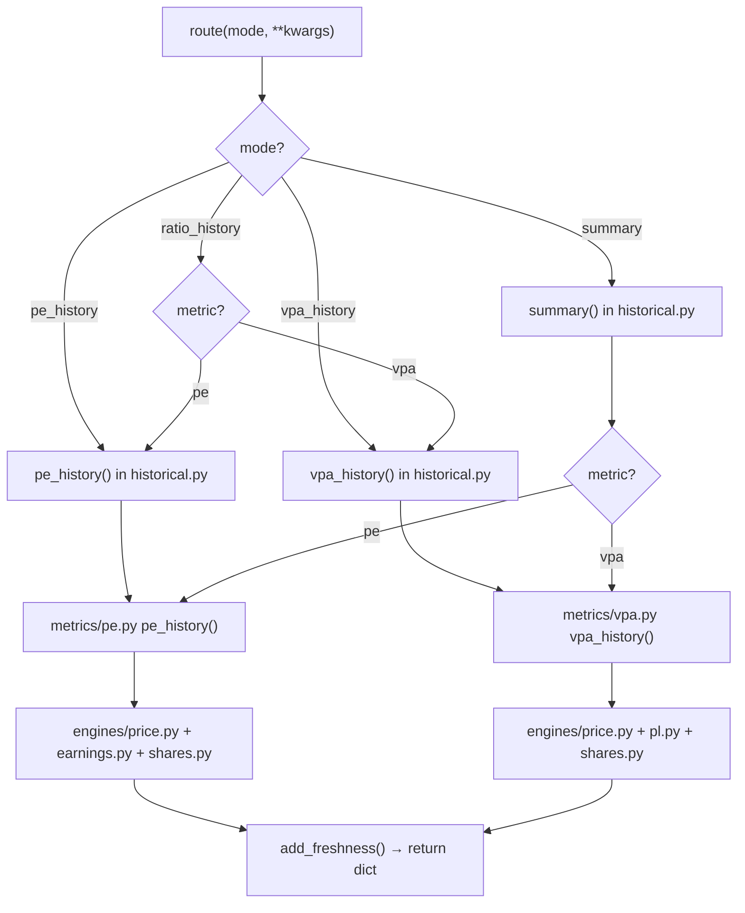

<- Back to [HISTORICAL Overview](../HISTORICAL.md)

# 🏗️ Architecture

## 🔗 Source Code Reference

| File | Purpose |
|---|---|
| `skills/cvm/historical/__init__.py` | MANIFEST + route — skill hub, 4 modes |
| `skills/cvm/historical/historical.py` | Main: pe_history, vpa_history, ratio_history, summary. Orchestrates engines + metrics. |
| `skills/cvm/historical/engines/__init__.py` | Engine inventory + contract + how to add a new engine |
| `skills/cvm/historical/engines/price.py` | COTAHIST daily close prices: `price_at()`, `price_series()` |
| `skills/cvm/historical/engines/earnings.py` | TTM earnings at any date: `ttm_earnings_at()`, `ttm_earnings_periods()`. Uses DFP + ITR. |
| `skills/cvm/historical/engines/shares.py` | FRE shares outstanding at any date: `shares_at()`, `shares_periods()` (+ investsite fallback) |
| `skills/cvm/historical/engines/pl.py` | Patrimônio Líquido snapshot at any date: `pl_at()`, `pl_periods()`. Uses DFP + ITR BPP 2.03. |
| `skills/cvm/historical/metrics/__init__.py` | Metric registry (METRICS dict) + how to add a new metric |
| `skills/cvm/historical/metrics/pe.py` | P/L metric: `pe_at()`, `pe_history()`. Imports price + earnings + shares engines. |
| `skills/cvm/historical/metrics/vpa.py` | P/VPA metric: `vpa_at()`, `vpa_history()`. Imports price + pl + shares engines. |
| `skills/cvm/historical/metrics/ev_ebitda.py` | EV/EBITDA stub for future |
| `tools/report_ops/adapters/historical.py` | 3 report adapters: historical_pe_chart, historical_vpa_chart, historical_summary (metric-aware) |

---

## 🧱 Engine vs Metric — The Core Pattern

This skill enforces a strict separation between **engines** (data access) and **metrics** (ratio math). This is the most important architectural rule. Violating it creates coupling that makes future metrics and the backtest skill impossible to reuse cleanly.

### Engines (basics — one per raw quantity)

An engine fetches ONE raw number at any historical date from its data source(s). Engines are **leaves** — they never import each other and never import metrics.

```
engines/
├── price.py    → price_at(ticker, date)         # COTAHIST daily close
├── earnings.py → ttm_earnings_at(company, date)  # DFP + ITR TTM derivation
├── shares.py   → shares_at(company, date)        # FRE + investsite fallback
└── pl.py       → pl_at(company, date)            # DFP + ITR BPP 2.03 snapshot
```

**Engine contract** (every engine follows this shape):
- `<quantity>_at(company, date) -> float | None` — value at most recent data point <= date
- `<quantity>_periods(company) -> list[dict]` — all data points `[{"date": "...", "<quantity>": value}, ...]` sorted oldest-first (for step-function optimization)

### Metrics (ratios — compose engines)

A metric imports 2+ engines and combines them into a ratio. Metrics **never** query CVM/B3 directly — that's the engine's job.

```
metrics/
├── pe.py   → pe_at(company, date)    # price / (TTM earnings / shares)
├── vpa.py  → vpa_at(company, date)   # price / (PL / shares)
└── ev_ebitda.py  (stub — future)
```

**Metric contract:**
- `<name>_at(company, date) -> float | None` — ratio at a specific date
- `<name>_history(company, date_from, date_to) -> list[dict]` — daily series with step-function optimization

### Dependency graph (MUST stay acyclic)

```
historical.py  (orchestrator)
       │
       ├── metrics/pe.py    ──┬── engines/price.py
       │                      ├── engines/earnings.py
       │                      └── engines/shares.py
       │
       └── metrics/vpa.py   ──┬── engines/price.py
                              ├── engines/pl.py
                              └── engines/shares.py
```

Engines never point upward. Metrics never point at other metrics. `historical.py` is the only module that knows about both engines and metrics together.

---

## 🌳 Module Tree

```text
skills/cvm/historical/
├── __init__.py              # MANIFEST + route() — 4 modes
├── historical.py            # Main: pe_history, vpa_history, ratio_history, summary
├── engines/
│   ├── __init__.py          # Engine inventory + contract docstring
│   ├── price.py             # COTAHIST daily close: price_at(), price_series()
│   ├── earnings.py          # DFP + ITR TTM: ttm_earnings_at(), ttm_earnings_periods()
│   ├── shares.py            # FRE + investsite: shares_at(), shares_periods()
│   └── pl.py                # DFP + ITR BPP 2.03: pl_at(), pl_periods()
└── metrics/
    ├── __init__.py          # METRICS registry + how-to-add docstring
    ├── pe.py                # P/L = price / (TTM / shares)
    ├── vpa.py               # P/VPA = price / (PL / shares)
    └── ev_ebitda.py         # stub for future
```

---

## 🔀 Dispatch Flow



---

## 🔢 TTM Earnings Algorithm (earnings.py)

The core innovation. Derives trailing twelve months earnings at any date.

```
For date D, find the most recent ITR period (data_fim_exerc <= D):

  ITR current period (e.g., Q2 2024, meses=6) = cumulative H1 2024 earnings
  ITR prior year same period (Q2 2023, meses=6) = cumulative H1 2023 earnings
  DFP prior year (2023, meses=12) = full year 2023 earnings

  TTM = DFP_2023 - ITR_2023_H1 + ITR_2024_H1
       = (full year 2023) - (H1 2023) + (H1 2024)
       = 12 months ending 2024-06-30

For Q4 dates (Oct-Dec), most recent ITR = Q3 (meses=9):
  TTM = DFP_prior - ITR_prior_9M + ITR_current_9M

For Q1 dates (Jan-Mar), most recent ITR = Q3 prior year (meses=9):
  TTM = DFP_prior2 - ITR_prior2_9M + ITR_prior_9M
```

**Earnings change quarterly** (when new ITR/DFP is filed). Between filings, TTM is constant.

---

## 🏦 PL Snapshot Algorithm (pl.py)

PL is a **snapshot** (point-in-time balance), not a flow. So this engine is simpler than earnings.py — no TTM derivation. We just find the most recent BPP snapshot with `data_fim_exerc <= date`.

```
For date D:
  1. Query DFP BPP codigo 2.03 (meses=12) → annual snapshots at Dec 31
  2. Query ITR BPP codigo 2.03 (meses=3/6/9) → quarterly snapshots at Mar/Jun/Sep 30
  3. Merge all snapshots, find most recent with data_fim_exerc <= D
  4. Return that value
```

**PL changes quarterly** (when new ITR/DFP is filed). Between filings, PL is constant.

---

## 📊 Data Flow (example: pe_history)

```
pe_history("PETR4", "2020-01-01", "2024-12-31")
  │
  ├── price_series("PETR4", "2020-01-01", "2024-12-31")
  │     → COTAHIST: ~1200 daily close prices
  │
  ├── ttm_earnings_periods("PETR4")
  │     → DFP: all annual earnings (codigo 3.11, meses=12)
  │     → ITR: all quarterly cumulative earnings (codigo 3.11, meses 3/6/9)
  │     → Compute TTM for each ITR period (~4 per year)
  │     → Step function: [{date, ttm}, ...]
  │
  ├── shares_periods("PETR4")
  │     → FRE: distribuicao_capital (annual) — or investsite fallback
  │     → Step function: [{date, shares}, ...]
  │
  └── For each daily price:
        find most recent TTM (step function lookup)
        find most recent shares (step function lookup)
        PE = price / (TTM / shares)
        → [{date, price, ttm_earnings, shares, pe}, ...]
```

P/VPA follows the same pattern but uses `pl_periods()` instead of `ttm_earnings_periods()`.

---

## 💡 Key Design Decisions

- **Engines are standalone**: `price.py`, `earnings.py`, `shares.py`, `pl.py` can be imported independently by any skill (e.g., future backtest). No coupling to `historical.py` or to each other.
- **Metrics compose engines**: `pe.py` imports `price + earnings + shares`. `vpa.py` imports `price + pl + shares`. New metrics import different engine combinations.
- **Step function optimization**: TTM earnings change ~4x per year, PL ~4x per year, shares ~1x per year. Instead of computing TTM/PL/shares for each of ~1200 daily prices, we precompute the step functions and do O(1) lookups per day.
- **parse_escala applied**: DFP/ITR store raw values with escala ("MIL", "MILHOES"). The earnings and PL engines apply `parse_escala` to convert to BRL.
- **Negative earnings/equity → None ratio**: When TTM earnings <= 0 (P/L) or PL <= 0 (P/VPA), the ratio is meaningless. The series includes these days with the ratio = None so the chart shows gaps.
- **Metric-aware summary**: The `summary` mode reads `result["metric"]` and renders the appropriate labels + engine-specific rows (TTM Earnings for pe, PL for vpa) via `_metric_dispatch()`.
- **Lazy metric imports**: `historical.py` imports metric modules inside functions (`from skills.cvm.historical.metrics.pe import ...` inside `pe_history()`), not at module top. This keeps the import graph clean and avoids triggering `core.config` at collection time in tests.

---

## ➕ How to Add a New Engine

1. Create a new file in `engines/` (e.g., `revenue.py`).
2. Query your data source directly (DFP/ITR/FRE/COTAHIST). Apply `parse_escala` to raw CVM values. Use `connect_dfp` / `connect_itr` / `connect_fre` from `data_sources/cvm/_db.py`. Resolve tickers via `data_sources.cvm._bridge.resolve_company()`.
3. Implement `<quantity>_at(company, date)` and `<quantity>_periods(company)` following the engine contract.
4. Add an entry to the engine inventory in `engines/__init__.py` docstring.
5. **Do NOT register engines in a dict** — they are imported by name by metrics.
6. Add tests in `tests/skills/cvm/historical/` (mock the DB connection via `connect_dfp`/`connect_itr`).
7. **NEVER import a metric from an engine.** Engines are below metrics in the dependency graph.

---

## ➕ How to Add a New Metric

1. **Confirm the engines you need already exist.** If not, add the ENGINE first (see above).
2. Create `metrics/<name>.py` with `<name>_at(ticker, date)` and `<name>_history(ticker, date_from, date_to)` functions. Import the engines you need.
3. Add the metric to the `METRICS` registry in `metrics/__init__.py`.
4. Wire it into `historical.py`:
   - Add a dedicated `<name>_history()` mode (recommended for user-facing access).
   - Add the metric to `ratio_history()` dispatch.
   - Add the metric to `_metric_dispatch()` so `summary()` becomes metric-aware.
5. Update the MANIFEST in `__init__.py` (add the new mode).
6. Add a report adapter in `tools/report_ops/adapters/historical.py` if you want chart/table rendering.
7. Add tests in `tests/skills/cvm/historical/test_<name>.py` (mock the engines).
8. Update `docs/skills/cvm/historical/` (API.md + CHANGELOG.md).

---

## 🔮 Backtest Foundation

The engines are designed for reuse by a future `skills/cvm/backtest/` skill:

```python
# Future backtest skill
from skills.cvm.historical.engines.price import price_at
from skills.cvm.historical.metrics.pe import pe_at
from skills.cvm.historical.metrics.vpa import vpa_at

# Signal: buy when P/L < 5 AND P/VPA < 1.0
if pe_at("PETR4", "2022-06-30") < 5 and vpa_at("PETR4", "2022-06-30") < 1.0:
    entry_price = price_at("PETR4", "2022-06-30")
    # ... compute returns
```

No duplication — the backtest skill reuses the same engines and metrics.

---

*Last updated: 2026-07-26 (v1.1 — added PL engine + VPA metric). See [API.md](API.md) for mode details, [CHANGELOG.md](CHANGELOG.md) for version history, [INSTRUCTIONS.md](INSTRUCTIONS.md) for AI editing rules.*
