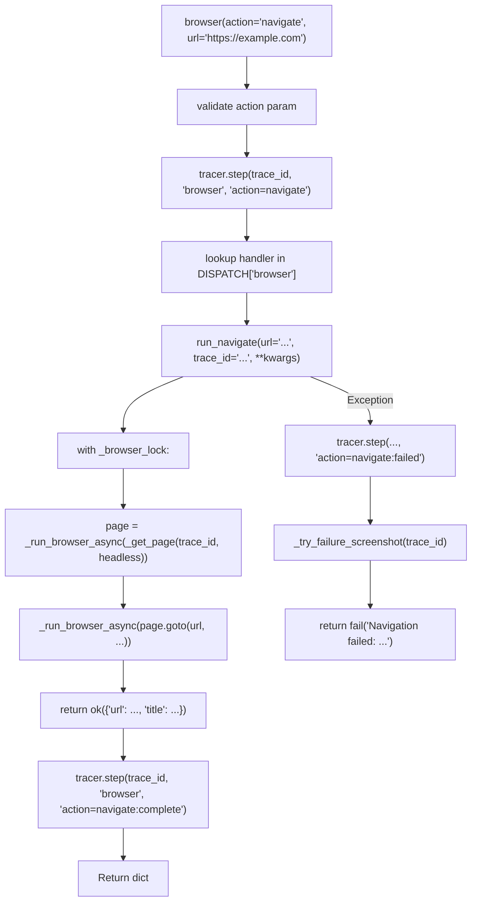

# 🌐 Browser Tool

The `browser()` tool automates web browsers via Playwright — navigate, click, fill, type, screenshot, evaluate JavaScript, scroll, hover, manage cookies, upload files, and more. All browser operations run in a dedicated async event loop to avoid blocking the main MCP thread.

**Key characteristics:**
- **Atomic actions** — `navigate`, `click`, `fill`, `type`, `screenshot`, `text_content`, `evaluate`, `select_option`, `keyboard_press`, `get_url`, `close`, `wait_for_selector`, `scroll`, `wait_for_url`, `hover`, `cookies`, `set_viewport`, `extract_html`, `extract_links`, `extract_tables`, `upload`. One action = one behavior
- **Auto-generated schema** — `@meta_tool` decorator builds `Literal` enum and docstring from DISPATCH
- **Session isolation** — Each `trace_id` gets its own `BrowserContext` (isolated cookies, localStorage)
- **Global singleton** — One Chromium instance shared across all traces; contexts are per-trace
- **SSRF protection** — `is_safe_network_address` blocks private IPs and localhost; URL scheme validation blocks `file://`, `javascript:`, `data:`
- **Screenshot auto-cleanup** — Files older than 7 days deleted on startup and every 6 hours
- **Screenshot-on-failure** — Failed actions (except `screenshot` and `close`) automatically capture a debug screenshot
- **Tracer spans** — Every action logs `action={name}`, `action={name}:complete`, and `action={name}:failed`
- **Navigate retry** — Exponential backoff on transient failures (1s, 2s, 4s, ... capped at 8s)

---

## ⚠️ Breaking Changes (v1)

| Old | New | Migration |
|-----|-----|-----------|
| Monolithic `browser_ops/actions.py` (17.5KB) | Atomic `browser_ops/actions/*.py` (20 files) | No migration needed — same API |
| Manual `DISPATCH` dict + `DISPATCH_METADATA` | `@register_action` auto-discovery + `@meta_tool` | No migration needed — same API |
| Manual docstring in `browser()` | `@meta_tool` auto-generated from `help_text` + `examples` | No migration needed — same API |
| `screenshot` base64 TODO | `return_base64=True` fully implemented | Use `return_base64=True` |
| `wait_for_selector` no state param | `state="visible"` default | Default is backward-compatible |
| `**kwargs` in all handlers | `**kwargs` kept (absorbs unused facade params) | No migration needed |
| `close()` without `trace_id` | `close()` requires `trace_id` (previously leaked contexts) | Always pass `trace_id` to `close` |
| `extract_links`/`extract_tables` string interpolation | `json.dumps()` for safe JS injection | No migration — internal fix |

### v1 (meta_tool refactor + new actions)
- Split monolithic `actions.py` into 20 atomic action files under `browser_ops/actions/`
- Added `@register_action` auto-discovery via `pathlib` + `importlib`
- Added `@meta_tool` auto-generated `Literal` enum and docstring
- Added `hover` action — hover over elements, triggers CSS `:hover` states
- Added `cookies` action — get/set/clear browser cookies per context (with URL filter)
- Added `set_viewport` action — change viewport size for responsive testing
- Added `extract_html` action — extract raw HTML from element or full page
- Added `extract_links` action — structured link extraction with safe JS injection
- Added `extract_tables` action — structured table extraction with safe JS injection
- Implemented `screenshot` base64 encoding (`return_base64=True`)
- Added screenshot-on-failure — debug screenshot attached to error messages
- Added tracer spans per action (`:complete` / `:failed`)
- Added `state` param to `wait_for_selector` (`"attached"`, `"detached"`, `"visible"`, `"hidden"`)
- Added duplicate action guard in `@register_action`: raises `ValueError` on collision
- Preserved "WHEN TO USE THIS TOOL" decision table via `doc_sections`

### v1.1 (bug fixes + upload + retry)
- **Fixed** `close()` without `trace_id` — now returns error instead of silently leaking context
- **Fixed** `extract_links`/`extract_tables` — use `json.dumps()` for safe JS selector injection; empty selector defaults to `"a"`/`"table"`
- **Fixed** `navigate` — URL scheme validation blocks `file://`, `javascript:`, `data:` before any network call
- **Fixed** `set_viewport` and `cookies` — `headless` param now forwarded to `_get_page`
- **Fixed** `select_option` help_text — restored `<select>` description
- **Fixed** `extract_html` — full page HTML labeled `"full_page"` instead of `"body"`
- **Fixed** `browser.py` — lazy-import `cfg` in `_try_failure_screenshot` to avoid unpatched binding in tests
- **Fixed** `browser.py` — screenshot-on-failure now also skipped on exception path for `screenshot` and `close` actions
- **Added** `upload` action — upload files to `<input type="file">` elements
- **Added** `navigate` retry with exponential backoff — `retries=N` param
- **Added** `cookies` URL filter — `url` param for targeted cookie retrieval
- **Added** `cookies` JSON validation — explicit error messages for malformed input

### v1.2 (Claude audit follow-up)
- **Fixed** `upload.py` — added `resolve_path` guard to prevent arbitrary
  filesystem access via path parameter
- **Fixed** `close.py` — returns `closed: False` with reason when context
  not found (was returning `closed: True` misleadingly)
- **Documented** `navigate.py` retry — added note that retry reuses same
  page/context; may fail if page crashed

---

## 🏗️ Architecture

```
tools/browser.py              # @tool facade — validation, dispatch, tracer, screenshot-on-failure
tools/_meta_tool.py           # @meta_tool decorator — auto Literal + docstring (shared)
tools/browser_ops/
├── _registry.py              # DISPATCH dict + @register_action decorator
├── __init__.py               # Auto-discovery: glob(actions/*.py) + importlib
├── factory.py                # Browser/context/page creation (Playwright bridge)
├── lifecycle.py              # Idle context reaper, screenshot cleanup, atexit
├── loop.py                   # Dedicated async event loop for Playwright
├── state.py                  # Global state + threading.Lock()
└── actions/                  # Atomic action handlers (20 files)
    ├── __init__.py           # Empty package init
    ├── navigate.py           # @register_action("browser", "navigate")
    ├── click.py
    ├── fill.py
    ├── type.py
    ├── screenshot.py
    ├── text_content.py
    ├── evaluate.py
    ├── select_option.py      # <select> dropdown option selection
    ├── keyboard_press.py
    ├── get_url.py
    ├── close.py              # Requires trace_id (no anonymous close)
    ├── wait_for_selector.py
    ├── scroll.py
    ├── wait_for_url.py
    ├── hover.py              # NEW v1
    ├── cookies.py            # NEW v1 — get/set/clear with URL filter
    ├── set_viewport.py       # NEW v1 — headless param forwarded
    ├── extract_html.py       # NEW v1 — full_page label for no selector
    ├── extract_links.py      # NEW v1 — json.dumps() for safe JS injection
    ├── extract_tables.py     # NEW v1 — json.dumps() for safe JS injection
    └── upload.py             # NEW v1.1 — file upload to <input type="file">
```

### Dispatch Flow



**Key design decisions:**
- **Unified DISPATCH** — Single dict holds all actions, handlers, help text, examples. `@meta_tool` reads it to generate schema and docstring. One source. Zero drift.
- **Auto-discovery** — Drop a new file in `actions/` with `@register_action` and it's immediately available. No manual registry updates.
- **Dedicated event loop** — Playwright runs in a separate daemon thread with its own `asyncio` loop. The main thread never blocks on browser I/O.
- **Thread-safe lock** — `_browser_lock` serializes all browser operations. One action at a time per process.
- **Trace isolation** — Each `trace_id` gets its own `BrowserContext`. Cookies and localStorage are isolated between traces.
- **Lazy browser launch** — Chromium is only launched on first action. No startup cost if browser is never used.
- **Screenshot-on-failure** — Failed actions (except `screenshot` and `close`) auto-capture a debug screenshot to `workspace/screenshots/error_{trace_id}_{timestamp}.png`.
- **Safe JS injection** — `extract_links` and `extract_tables` use `json.dumps()` (not `repr()` or f-strings) to embed selectors into JavaScript. Prevents injection of malformed or malicious selectors.

---

## 📋 Tool Signature

```python
@tool
@meta_tool(
    DISPATCH.get("browser", {}),
    doc_sections=[...]
)
def browser(
    action: str,
    url: str = "",
    selector: str = "",
    value: str = "",
    path: str = "",
    wait_until: str = "domcontentloaded",
    timeout: int = 30,
    delay: int = 50,
    key: str = "",
    expression: str = "",
    headless: bool = True,
    return_base64: bool = False,
    trace_id: str = "",
    direction: str = "",
    amount: int = 0,
    state: str = "visible",
    width: int = 1280,
    height: int = 720,
    cookies_json: str = "",
    action_detail: str = "get",
    retries: int = 0,          # NEW v1.1: navigate retry count
) -> dict:
    """..."""
```

| Parameter | Type | Required | Description |
|-----------|------|----------|-------------|
| `action` | `str` | **Yes** | Browser action: `navigate`, `click`, `fill`, `type`, `screenshot`, `text_content`, `evaluate`, `select_option`, `keyboard_press`, `get_url`, `close`, `wait_for_selector`, `scroll`, `wait_for_url`, `hover`, `cookies`, `set_viewport`, `extract_html`, `extract_links`, `extract_tables`, `upload` |
| `url` | `str` | No | URL for `navigate` or `wait_for_url`. Supports glob patterns for `wait_for_url` (e.g., `**/dashboard`). |
| `selector` | `str` | No | CSS selector for element-targeting actions. |
| `value` | `str` | No | Text value for `fill`, `type`, `select_option`. |
| `path` | `str` | No | Save path for `screenshot` or upload path for `upload`. Default: `workspace/screenshots/{trace_id}_{timestamp}.png`. |
| `wait_until` | `str` | No | Navigation wait condition: `domcontentloaded` (default), `networkidle`, `load`. |
| `timeout` | `int` | No | Timeout in seconds. Default: 30. |
| `delay` | `int` | No | Keystroke delay in ms for `type`. Default: 50. |
| `key` | `str` | No | Key name for `keyboard_press`: `Enter`, `Tab`, `Escape`, etc. |
| `expression` | `str` | No | JavaScript code for `evaluate`. |
| `headless` | `bool` | No | Run browser headless. Default: `True`. |
| `return_base64` | `bool` | No | Return base64-encoded image for `screenshot`. Default: `False`. |
| `trace_id` | `str` | No | Trace ID for session isolation. **Required for `close`**. |
| `direction` | `str` | No | Scroll direction: `top`, `bottom`, `up`, `down`. Default: `bottom`. |
| `amount` | `int` | No | Scroll amount in pixels for `up`/`down`. Default: 0 (full height). |
| `state` | `str` | No | Element state for `wait_for_selector`: `visible` (default), `attached`, `detached`, `hidden`. |
| `width` | `int` | No | Viewport width for `set_viewport`. Default: 1280. |
| `height` | `int` | No | Viewport height for `set_viewport`. Default: 720. |
| `cookies_json` | `str` | No | JSON string of cookies for `cookies` action (set mode). Must be a JSON array of objects with `name`, `value`, and either `url` or `domain`+`path`. |
| `action_detail` | `str` | No | Sub-action for `cookies`: `get` (default), `set`, `clear`. |
| `retries` | `int` | No | Retry count for `navigate` on transient failure. Backoff: 1s, 2s, 4s, ... capped at 8s. Default: 0 (no retry). |

---

## 🎯 Actions

### `navigate` — Go to URL and wait for load
```python
browser(action="navigate", url="https://example.com")
browser(action="navigate", url="https://example.com", wait_until="networkidle")
browser(action="navigate", url="https://example.com", retries=2)  # retry on failure
```
**URL scheme validation:** Only `http://` and `https://` are allowed. `file://`, `javascript:`, `data:` are rejected before any network call.

### `click` — Click an element
```python
browser(action="click", selector="button.submit")
```

### `fill` — Clear and type into an input
```python
browser(action="fill", selector="input.name", value="John")
```

### `type` — Type with human-like delay
```python
browser(action="type", selector="input.search", value="hello", delay=100)
```

### `screenshot` — Capture page or element
```python
browser(action="screenshot")  # full page
browser(action="screenshot", selector="div.chart")  # element
browser(action="screenshot", return_base64=True)  # inline base64
browser(action="screenshot", path="workspace/important.png")  # explicit path
```

### `text_content` — Extract text from element
```python
browser(action="text_content")  # default: body
browser(action="text_content", selector="h1")
```

### `evaluate` — Run JavaScript
```python
browser(action="evaluate", expression="document.title")
browser(action="evaluate", expression="window.scrollY")
```

### `select_option` — Select option from a `<select>` dropdown
```python
browser(action="select_option", selector="select.country", value="US")
```

### `keyboard_press` — Press a key
```python
browser(action="keyboard_press", key="Enter")
browser(action="keyboard_press", key="Tab")
```

### `get_url` — Return current page URL
```python
browser(action="get_url")
```

### `close` — Close browser context for this trace
```python
browser(action="close", trace_id="t1")
```
**⚠️ `trace_id` is REQUIRED.** Calling `close` without `trace_id` returns an error because the anonymous context key cannot be deterministically reconstructed.

### `wait_for_selector` — Wait for element to appear
```python
browser(action="wait_for_selector", selector="div.content")
browser(action="wait_for_selector", selector="div.content", state="visible")
browser(action="wait_for_selector", selector="div.spinner", state="detached")
```

### `scroll` — Scroll page or element
```python
browser(action="scroll", direction="bottom")  # scroll to bottom
browser(action="scroll", direction="top")  # scroll to top
browser(action="scroll", direction="down", amount=500)
browser(action="scroll", selector="#target")  # scroll element into view
```

### `wait_for_url` — Wait for URL to match pattern
```python
browser(action="wait_for_url", url="**/dashboard")
browser(action="wait_for_url", url="https://example.com/login")
```

### `hover` — Hover over element (NEW v1)
```python
browser(action="hover", selector=".menu-item")
```
Triggers CSS `:hover` states, dropdown menus, tooltips.

### `cookies` — Get, set, or clear cookies (NEW v1)
```python
browser(action="cookies")  # get all cookies
browser(action="cookies", action_detail="get", url="https://example.com")  # filtered by URL
browser(action="cookies", action_detail="set", cookies_json='[{"name":"session","value":"abc","url":"https://example.com"}]')
browser(action="cookies", action_detail="clear")
```
**Cookie JSON format:** Must be a JSON array of objects. Each object requires `name`, `value`, and either `url` or `domain`+`path`.

### `set_viewport` — Change viewport size (NEW v1)
```python
browser(action="set_viewport", width=1920, height=1080)
browser(action="set_viewport", width=375, height=812)  # mobile
```
**Note:** Viewport is per-page. New traces get the default viewport (1280x720).

### `extract_html` — Extract raw HTML (NEW v1)
```python
browser(action="extract_html")  # full page HTML (labeled "full_page")
browser(action="extract_html", selector="table.data")  # element HTML
```

### `extract_links` — Extract all links from the page (NEW v1)
```python
browser(action="extract_links")  # all <a> tags
browser(action="extract_links", selector="nav a")  # filtered
```
Uses safe JS injection via `json.dumps()` to prevent selector-based code injection.

### `extract_tables` — Extract tables as structured data (NEW v1)
```python
browser(action="extract_tables")  # all <table> elements
browser(action="extract_tables", selector=".data-table")  # filtered
```
Uses safe JS injection via `json.dumps()` to prevent selector-based code injection.

### `upload` — Upload file to `<input type="file">` (NEW v1.1)
```python
browser(action="upload", selector="input[type=file]", path="data/report.pdf")
browser(action="upload", selector="#avatar", path="photo.png")
```
**Requirements:** `selector` must target a `<input type="file">` element. `path` must be an existing file on the local filesystem.

---

## 🔒 Security

| Feature | Implementation |
|---------|---------------|
| **SSRF guard** | `is_safe_network_address` blocks private IPs (`192.168.x.x`, `10.x.x.x`, `127.x.x.x`, `0.0.0.0`, `::1`) and localhost |
| **URL scheme validation** | `navigate` requires `http://` or `https://`. `file://`, `javascript:`, `data:` are rejected before any network call |
| **Path guard** | Screenshot and upload paths resolved via `cfg.workspace_root` — no path traversal outside workspace |
| **Trace isolation** | Each `trace_id` gets its own `BrowserContext` — cookies and localStorage are never shared |
| **Auto-cleanup** | Screenshots older than 7 days deleted automatically |
| **Evaluate sandbox** | JavaScript runs in page context — no Node.js `require()` access (Chromium isolates page JS from Node) |
| **Safe JS injection** | `extract_links` and `extract_tables` use `json.dumps()` (not `repr()` or f-strings) to embed selectors into JavaScript |
| **Path guard** | `upload` validates path via `resolve_path` — rejects paths outside `workspace_root` |

---

## 📤 Output

All actions return:
```python
{
    "status": "success",  # or "error"
    "trace_id": "abc123",
    "data": {...},  # action-specific data
}
```

Error responses include debug screenshot path when available:
```python
{
    "status": "error",
    "trace_id": "abc123",
    "error": "Click failed: Timeout (failure screenshot: workspace/screenshots/error_abc123_1234567890.png)",
}
```

---

## 🧠 Memory Integration

The browser tool does not store episodic memories directly. However, the research workflow (which uses the browser tool) stores research findings via `memory.store_episodic()`.

---

## 🧪 Testing

```powershell
# Run all browser tests
D:\mcp\agent\venv\Scripts\pytest.exe tests/tools/browser/ -W error --tb=short -v
```

**Test architecture:**
- `conftest.py` provides `mock_browser` (autouse) and `mock_cfg_for_browser` (autouse)
- All browser infrastructure is fully mocked — no real Chromium is launched
- Tests are isolated — `reset_browser_state()` resets globals before each test
- One test file per action (20 action tests + registry + facade + error handling + SSRF + screenshot limits)

**Test file layout:**
```
tests/tools/browser/
├── conftest.py                    # Shared fixtures (autouse)
├── test_navigate.py               # Retry with backoff, scheme validation
├── test_click.py
├── test_fill.py
├── test_type.py
├── test_screenshot.py
├── test_text_content.py
├── test_evaluate.py
├── test_select_option.py          # NEW v1.1
├── test_keyboard_press.py
├── test_get_url.py
├── test_close.py                  # trace_id required
├── test_wait_for_selector.py
├── test_scroll.py
├── test_wait_for_url.py
├── test_hover.py                  # NEW v1
├── test_cookies.py                # URL filter, JSON validation
├── test_set_viewport.py           # headless pass-through
├── test_extract_html.py           # full_page label
├── test_extract_links.py          # safe JS injection, empty selector default
├── test_extract_tables.py         # safe JS injection, empty selector default
├── test_upload.py                 # NEW v1.1
├── test_browser_error_handling.py
├── test_browser_screenshot.py
├── test_browser_ssrf.py           # scheme validation
├── test_registry.py               # NEW v1
├── test_facade.py                 # screenshot-on-failure exclusion
└── test_screenshot_base64.py      # real base64 encoding
```

---

## 🔀 When to Use vs Alternatives

| Need | Tool | Why |
|------|------|-----|
| Static page text | `web(read)` | Faster, no browser overhead |
| JS-rendered page text | `browser(navigate+text_content)` | Renders JavaScript |
| Interactive forms | `browser(click, fill, select_option)` | Supports interaction |
| Screenshots | `browser(screenshot)` | Captures rendered page |
| Multi-page workflows | `browser` + sequential actions | Maintains session state |
| Infinite scroll / lazy load | `browser(scroll)` | Loads dynamic content |
| SPA navigation | `browser(wait_for_url)` | Waits for route change |
| Hover-dependent UI | `browser(hover)` | Triggers dropdowns/tooltips |
| Cookie management | `browser(cookies)` | Get/set session cookies |
| Viewport testing | `browser(set_viewport)` | Responsive testing |
| Raw HTML extraction | `browser(extract_html)` | DOM structure |
| Extract all links | `browser(extract_links)` | Structured link data |
| Extract tables | `browser(extract_tables)` | Structured table data |
| File upload | `browser(upload)` | Upload to file inputs |

---

## 🛡️ AI Agent Instructions

### NEVER DO
1. **Never add subcommand parsing to action handlers** — one action = one behavior.
2. **Never import Playwright at module level in `actions/`** — lazy imports only. The `factory.py` and `loop.py` handle all Playwright interaction.
3. **Never add `**kwargs` to the `@tool` facade** — FastMCP schema breaks. Internal dispatch wrappers keep `**kwargs` to absorb unused params.
4. **Never print to stdout** — MCP stdio corruption. Use `sys.stderr` if needed.
5. **Never create `.bak` files** — forbidden by project rules.
6. **Never touch `@meta_tool` or `@register_action` shared decorators** — use `help_text` for param docs. Infrastructure changes need separate commits.
7. **Never put non-action files in `browser_ops/actions/`** — auto-discovery imports everything.
8. **Never cache `cfg.workspace_root` at module level** — breaks test mocking. Use lazy imports in failure paths.
9. **Never skip `compileall` before `pytest`** — syntax errors crash with confusing tracebacks.
10. **Never rewrite entire files when surgical edits suffice** — preserve existing code.
11. **Never register actions outside the `browser` namespace** — `DISPATCH["browser"]` is the only valid key.
12. **Never forget `trace_id` in error messages** — all `fail()` calls must include `trace_id=trace_id`.
13. **Never hold `_browser_lock` across long operations** — keep lock scope minimal to prevent blocking other traces.
14. **Never use `repr()` or f-strings for JS injection** — always use `json.dumps()` when embedding user-controlled values into `page.evaluate()` strings.
15. **Never call `close()` without `trace_id`** — it will leak the context. Always pass the trace_id that was used for `navigate`.

### ALWAYS DO
16. **Always verify tests mock the correct import path** — `mock.patch` targets where the name is **looked up**, not where it is defined.
17. **Always add `trace_id` to tracer steps** — `tracer.step(trace_id, "browser", ...)` not `tracer.step("browser", ...)`.
18. **Always use `compileall` before `pytest`** — catches syntax errors early.
19. **Always update `conftest.py` when adding new mock methods** — new actions need their Playwright methods mocked.
20. **Always include `examples` in `@register_action`** — the LLM uses these for few-shot prompting.
21. **Always validate URL schemes in `navigate`** — reject `file://`, `javascript:`, `data:` before `urlparse` or network calls.
22. **Always forward `headless` to `_get_page`** — actions that acquire a page must pass the user's `headless` preference.
23. **Always test error paths** — malformed JSON, missing files, invalid selectors, empty inputs.

---

## 🗺️ V2 Roadmap

### Planned Actions
| Action | Status | Notes |
|--------|--------|-------|
| `@meta_tool` refactor | ✅ v1 | Auto-generated schema + docstring |
| `@register_action` pattern | ✅ v1 | Auto-discovery via `actions/` directory |
| `hover` | ✅ v1 | Hover over elements |
| `cookies` | ✅ v1 | Get/set/clear cookies with URL filter |
| `set_viewport` | ✅ v1 | Viewport resizing |
| `extract_html` | ✅ v1 | Raw HTML extraction |
| `screenshot` base64 | ✅ v1 | `return_base64=True` |
| `wait_for_selector` state param | ✅ v1 | `attached`, `detached`, `visible`, `hidden` |
| Screenshot-on-failure | ✅ v1 | Auto-capture on error |
| Tracer spans | ✅ v1 | Per-action `:complete` / `:failed` |
| Duplicate action guard | ✅ v1 | `ValueError` on collision |
| `extract_links` | ✅ v1 | Safe JS injection via `json.dumps()` |
| `extract_tables` | ✅ v1 | Safe JS injection via `json.dumps()` |
| `upload` | ✅ v1.1 | File upload to `<input type="file">` |
| `navigate` retry | ✅ v1.1 | Exponential backoff on transient failure |
| `download` | 🚧 v2 | Download file from link |
| `pdf` | 🚧 v2 | Save page as PDF (Chromium-only) |
| `intercept` | 🚧 v2 | Network request interception |
| `mobile_emulate` | 🚧 v2 | Device emulation (requires context-level changes) |
| `scroll` smooth | 🚧 v2 | `behavior: "smooth"` option |
| `evaluate` sandbox hardening | 🚧 v2 | Block `require("fs")`, `require("child_process")` |
| `analyze_page` | 🚧 v2 | Vision model integration — send screenshot to vision-capable LLM |

### Known Limitations
- `download` not yet implemented — Playwright download API is async-event-driven
- `pdf` not yet implemented — Chromium-only, requires `page.pdf()`
- `mobile_emulate` not yet implemented — requires context-level device descriptor
- `intercept` not yet implemented — requires route handler setup before navigation
- `scroll` does not support smooth scrolling — use `evaluate` with `window.scrollTo({behavior: "smooth"})`
- Very large screenshots may exceed memory — no size limit enforced yet
- `compress_result()` not yet implemented — large `extract_html`/`extract_links`/`extract_tables` outputs may blow out LLM context window
- `navigate` retry reuses the same page/context. If the page crashed during the
  failed attempt, subsequent retries will also fail. A future v2 improvement may
  close and recreate the context between retries.

---

## 🔗 Source Code Reference

| File | Purpose |
|------|---------|
| `tools/browser.py` | `@tool` facade: validation, dispatch, tracer, screenshot-on-failure |
| `tools/_meta_tool.py` | `@meta_tool` decorator: auto `Literal`, docstring (shared with git/file/cli/report) |
| `tools/browser_ops/_registry.py` | `DISPATCH` dict, `@register_action` |
| `tools/browser_ops/__init__.py` | Auto-discovery: glob + importlib for `actions/*.py` |
| `tools/browser_ops/factory.py` | Browser/context/page creation (Playwright bridge) |
| `tools/browser_ops/lifecycle.py` | Idle context reaper, screenshot cleanup, atexit |
| `tools/browser_ops/loop.py` | Dedicated async event loop for Playwright |
| `tools/browser_ops/state.py` | Global state: `_browser`, `_contexts`, `_pages`, `_browser_lock` |
| `tools/browser_ops/actions/*.py` | Atomic action handlers (20 files) |
| `tests/tools/browser/` | 27 test files + conftest.py |
| `tests/tools/browser/conftest.py` | `mock_browser`, `mock_cfg_for_browser`, `reset_browser_state` |
| `core/net/security.py` | `is_safe_network_address` — SSRF protection |
| `core/tracer.py` | `tracer.step()` — observability |

---

*Architecture: thin facade + @meta_tool + atomic action modules + auto-discovery + dedicated async loop + thread-safe lock + trace isolation + SSRF protection + URL scheme validation + safe JS injection + screenshot-on-failure + navigate retry.*
