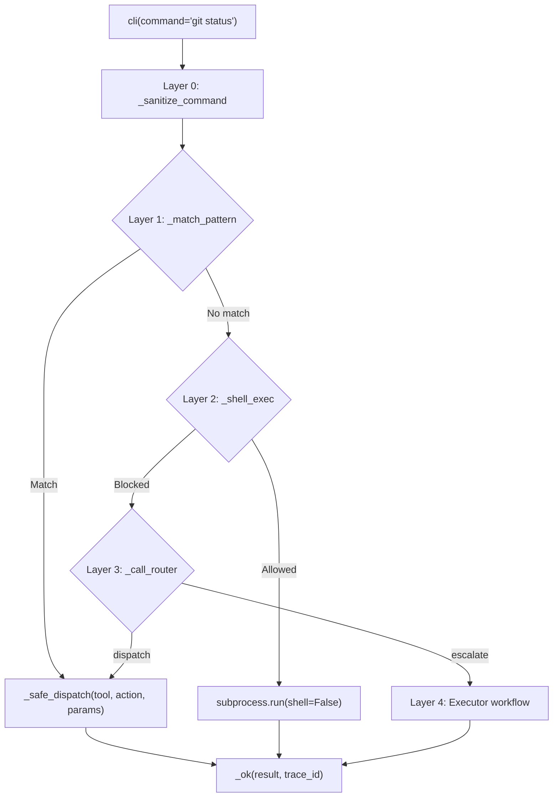

# 🖥️ CLI Tool

The `cli()` tool is a **meta-tool** that routes natural-language commands through a 4-layer dispatch architecture. Unlike `git()` and `file()` — which are **direct action dispatchers** — `cli()` interprets free-form text and decides how to execute it.

**Key characteristics:**
- **Meta-tool routing** — `cli("git status")` → pattern match → `git:status` proxy → `tools/git.py`
- **4-layer dispatch** — Patterns (zero tokens) → Shell (zero tokens) → Router (LLM) → Executor (workflow)
- **Auto-generated schema** — `@meta_tool` builds docstring and `__tool_metadata__` from flattened DISPATCH
- **Path guard integration** — `core.path_guard` validates all filesystem paths in shell execution
- **Security-first** — Shell whitelist, flag blocking, operator rejection, input sanitization
- **Human-readable output** — Proxy handlers format tool responses for CLI consumption

---

## ⚠️ How CLI Differs from Git/File

| Aspect | `git()` / `file()` | `cli()` |
|--------|-------------------|---------|
| **Interface** | `action: Literal[...]` parameter | `command: str` natural language |
| **Dispatch** | Direct — one action = one handler | Routed — 4 layers decide execution path |
| **@meta_tool** | Patches `action: Literal[...]` | Skips `Literal` patch (no `action` param), generates docstring only |
| **Handlers** | One file per action (`branch_create.py`) | One handler per namespace with stacked decorators (`_file`, `_git`, `_web`) |
| **Output** | Structured `dict` | Human-readable `str` (proxy formatting) |
| **Shell access** | None | Layer 2 — whitelisted subprocess with `shell=False` |

**Important:** `cli()` is a **router**, not a direct tool. It does not perform operations itself — it delegates to `git()`, `file()`, `web()`, `python()`, `memory()`, etc.

---

## 🏗️ Architecture

```
tools/cli.py                    # @tool facade — 4-layer orchestration, security
tools/_meta_tool.py             # @meta_tool decorator — auto docstring, metadata
tools/cli_ops/
├── __init__.py                 # Auto-imports all action modules (import order critical)
├── _registry.py                # DISPATCH dict + @register_action decorator
├── helpers.py                  # _sanitize_command, _shell_exec, _safe_dispatch
├── patterns.py                 # Layer 1 — regex pattern matching (zero tokens)
├── router.py                   # Layer 3 — LLM classification (router role)
└── actions/
    ├── system.py               # system:health, system:help
    ├── file.py                 # file:read_file, file:write_file, etc. (proxy)
    ├── git.py                  # git:status, git:log, etc. (proxy)
    ├── web.py                  # web:search, web:scrape, web:read (proxy)
    ├── python.py               # python:run, python:calc, python:data (proxy)
    ├── memory.py               # memory:recall, memory:store, etc. (proxy)
    ├── notify.py               # notify:send (proxy)
    ├── cleanup.py              # cleanup:autocode, cleanup:dry_run
    ├── skill.py                # skill:call (proxy)
    └── lms.py                  # lms:ls, lms:ps, lms:load, lms:unload, lms:log
```

### 4-Layer Dispatch Flow



**Layer 0 — Sanitize:** Null bytes, control chars, dangerous patterns, length limits, arg count limits.

**Layer 1 — Pattern Match:** Regex-based, zero-LLM-token dispatch for common commands. Order matters — specific before broad.

**Layer 2 — Shell Whitelist:** `shlex.split` → `ALLOWED_COMMANDS` → `BLOCKED_FLAGS` → `SHELL_OPERATORS` → `core.path_guard` → `subprocess.run(shell=False)`.

**Layer 3 — Router:** LLM (router role, 15s timeout, temp=0) classifies ambiguous commands as `dispatch` or `escalate`.

**Layer 4 — Executor:** Complex tasks handed to planner/executor workflow with reason string.

### Path Guard Integration

`core.path_guard` is integrated at **Layer 2** (shell execution) and **Layer 1** (indirectly via proxy handlers):

```python
# Layer 2: _shell_exec validates every non-flag token
for token in tokens[1:]:
    if token.startswith("-"):
        continue
    resolved, err = resolve_path(token, default_root="agent")
    if err:
        continue  # Not a path — harmless
    if not (_is_within(resolved, agent_root) or _is_within(resolved, workspace_root)):
        return f"Shell error: Path '{token}' resolves outside AGENT_ROOT."
```

**Proxy handlers** (Layer 1) delegate to `tools/file.py`, `tools/git.py`, etc., which already apply `core.path_guard` in their own facades. CLI does not re-validate — it trusts the underlying tools.

---

## 📋 Tool Signature

```python
@tool
@meta_tool(
    _CLI_META_DISPATCH,
    doc_sections=[
        "4-Layer Dispatch Architecture:",
        " 1. Pattern match — regex for common commands (zero tokens)",
        " 2. Shell whitelist — safe subprocess execution (zero tokens)",
        " 3. Router — LLM classifies ambiguous commands",
        " 4. Executor — complex tasks escalated to planner workflow",
        "",
        "Security:",
        " - shell=False prevents command chaining",
        " - ALLOWED_COMMANDS whitelist controls binaries",
        " - BLOCKED_FLAGS prevents arbitrary code execution",
        " - core.path_guard validates all filesystem paths",
        "",
        "Proxy Actions:",
        " Each action routes to a specific tool (file, git, web, etc.)",
        " and formats the result for human-readable output.",
    ],
)
def cli(
    command: str = "",
    trace_id: str = "",
) -> dict[str, Any]:
    """..."""
```

| Param | Type | Default | Description |
|-------|------|---------|-------------|
| `command` | `str` | `""` | Natural-language command string (e.g., `"git status"`, `"read file.py"`) |
| `trace_id` | `str` | `""` | Execution trace identifier for observability |

**Returns:** `{"status": "success", "output": "...", "trace_id": "..."}` — always `status: "success"` even when the routed action fails (failure is in `output` string).

---

## 🎬 Proxy Actions Reference

### System

| Action | Shortcut | Params | Description |
|--------|----------|--------|-------------|
| `health` | `health` | — | System health check |
| `help` | `help` | — | Show available CLI commands |

### File (routes to `tools/file.py`)

| Action | Shortcut | Required Params | Optional Params | Description |
|--------|----------|-----------------|-----------------|-------------|
| `read_file` | `read `, `cat `, `show ` | `path` | — | Read file with line numbers (first 40 lines) |
| `write_file` | `write ` | `path`, `content` | — | Write content to file |
| `list_directory` | `ls `, `list ` | `path` | — | List directory contents |
| `patch_file` | `patch ` | `path`, `old`, `new` | — | Apply single str_replace patch |
| `search_files` | `find `, `grep ` | `query` | — | Full-text search across workspace |
| `backup_file` | `backup ` | `path` | — | Backup a file |

### Git (routes to `tools/git.py`)

| Action | Shortcut | Required Params | Optional Params | Description |
|--------|----------|-----------------|-----------------|-------------|
| `status` | `git status` | — | — | Working tree status |
| `log` | `git log [N]` | — | `n` (default 10) | Commit history (formatted) |
| `diff` | `git diff` | — | — | Unstaged changes |
| `snapshot` | `git snapshot [msg]` | — | `message` | Safe checkpoint commit |
| `commit` | `git commit <msg>` | `message` | — | Stage all + commit |
| `rollback` | `git rollback [--force]` | — | `force` | Reset to HEAD |

### Web (routes to `tools/web.py`)

| Action | Shortcut | Required Params | Description |
|--------|----------|-----------------|-------------|
| `search` | `search ` | `query` | Web search (top 5 results formatted) |
| `scrape` | `scrape ` | `url` | Scrape webpage (first 3000 chars) |
| `read` | `read ` | `url` | Read webpage (first 3000 chars) |

### Python (routes to `tools/python_exec.py`)

| Action | Shortcut | Required Params | Optional Params | Description |
|--------|----------|-----------------|-----------------|-------------|
| `run` | `run `, `exec ` | `code` | — | Execute Python code |
| `calc` | `calc ` | `code` | — | Calculate expression |
| `data` | `data ` | `code` | — | Run data analysis code |

**Note:** `calc` and `data` currently execute with `mode="run"` (default). The `action` parameter is mapped to `mode` via `mode_map` in the handler for future extensibility.

### Memory (routes to `core/memory.py`)

| Action | Shortcut | Required Params | Optional Params | Description |
|--------|----------|-----------------|-----------------|-------------|
| `recall` | `recall ` | `query` | `top_k`, `min_score` | Recall from ChromaDB |
| `store` | `store ` | `text` | `memory_type`, `importance`, `tags` | Store in ChromaDB |
| `stats` | `memory stats` | — | — | Memory statistics |
| `prune` | `memory prune` | — | — | Prune low-score memories |

### Notify (routes to `tools/notify.py`)

| Action | Shortcut | Required Params | Description |
|--------|----------|-----------------|-------------|
| `send` | `notify `, `alert `, `ping ` | `message` | Send notification |

### Cleanup

| Action | Shortcut | Required Params | Optional Params | Description |
|--------|----------|-----------------|-----------------|-------------|
| `autocode` | `cleanup autocode [N]` | — | `days` (default 7) | Delete old autocode runs |
| `dry_run` | `dry run cleanup` | — | `days` (default 7) | Preview cleanup without deleting |

### Skill (routes to `skills/dispatcher.py`)

| Action | Shortcut | Required Params | Optional Params | Description |
|--------|----------|-----------------|-----------------|-------------|
| `call` | `skill <domain> <mode> [arg]` | `domain`, `mode` | `arg` | Call skill domain. `arg` maps to `ticker=` (query) or `files=` (sync) |

### LMS (routes to `http://localhost:1234`)

| Action | Shortcut | Required Params | Optional Params | Description |
|--------|----------|-----------------|-------------|-------------|
| `ls` | `lms ls` | — | — | List downloaded models |
| `ps` | `lms ps` | — | — | List loaded models |
| `load` | `lms load <model>` | `model` | — | Load a model |
| `unload` | `lms unload [model]` | — | `model` | Unload model or all |
| `log` | `lms log` | — | — | Get LM Studio logs (last 2000 chars) |

---

## 🔒 Security Model

### Layer 0: Input Sanitization (`_sanitize_command`)

| Check | Behavior |
|-------|----------|
| **Type** | Must be `str` |
| **Null bytes** | `\\x00` → `ValueError` |
| **Control chars** | `\\x00-\\x1f`, `\\x7f-\\x9f` → `ValueError` |
| **Dangerous patterns** | Substring match: `rm -rf`, `passwd`, `hacked`, `root@`, `/etc/passwd`, `chmod 777`, `del /f`, `format`, `diskpart`, `rd /s`, `rmdir /s` |
| **Length** | Max `cfg.cli_max_command_chars` (default 4096) |
| **Arg count** | Max `cfg.cli_max_arguments` (default 50) |

### Layer 2: Shell Execution (`_shell_exec`)

| Check | Implementation |
|-------|---------------|
| **Parse** | `shlex.split(command, posix=(os.name != "nt"))` — no shell injection |
| **Allowlist** | `ALLOWED_COMMANDS` frozenset — 30+ safe binaries |
| **Flag block** | `BLOCKED_FLAGS` — `-c`, `-m`, `--command`, `--module`, `-e`, `--eval` |
| **Operator block** | `SHELL_OPERATORS` — `\|`, `\|\|`, `&&`, `;`, `>`, `>>`, `<`, `&`, `` ` ``, `$(` |
| **Path guard** | `resolve_path()` + `_is_within()` for all non-flag tokens against **both** `agent_root` and `workspace_root` |
| **Execution** | `subprocess.run(shell=False, timeout=30)` |
| **Output cap** | `strip()` stdout/stderr, fallback to returncode |

**Allowed commands:** `ls`, `dir`, `cat`, `type`, `head`, `tail`, `grep`, `findstr`, `wc`, `cp`, `copy`, `mv`, `move`, `mkdir`, `rmdir`, `touch`, `stat`, `du`, `df`, `pwd`, `cd`, `git`, `gh`, `python`, `python3`, `pip`, `pytest`, `uname`, `whoami`, `date`, `echo`, `which`, `where`, `systeminfo`, `ipconfig`, `hostname`, `tasklist`, `ver`, `diff`, `md5sum`, `sha256sum`

**Blocked flags:** Prevents `python -c "import os; os.system(...)"`, `python -m module`, etc.

### Proxy Action Security

Proxy handlers route to `tools/file.py`, `tools/git.py`, etc. — these tools have their own path guards and cancellation guards. CLI does not bypass them.

**Error redaction:** `_safe_dispatch` redacts dangerous patterns from handler exceptions before returning them to the user.

---

## ⚙️ Configuration

| Config | Source | Default | Description |
|--------|--------|---------|-------------|
| `cli_max_command_chars` | `cfg.cli_max_command_chars` | 4096 | Max command length |
| `cli_max_arguments` | `cfg.cli_max_arguments` | 50 | Max argument count |
| `workspace_root` | `cfg.workspace_root` | — | Shell `cwd` default |
| `agent_root` | `cfg.agent_root` | — | Path guard boundary |
| `_LMS` | Hardcoded | `http://localhost:1234` | LM Studio API endpoint |

---

## 📊 `@meta_tool` on CLI

`cli()` uses `@meta_tool` differently than `git()`/`file()`:

- **No `action` parameter** — `cli()` takes `command: str`, not `action: str`. `@meta_tool` skips the `Literal` patch.
- **Synthetic dispatch** — `_CLI_META_DISPATCH` flattens all tool namespaces into one dict for docstring generation. This lets the LLM see all proxy actions.
- **Docstring only** — `@meta_tool` generates the docstring and `__tool_metadata__` but does not mutate `__annotations__["action"]` (there is no `action`).

```python
# cli.py builds synthetic flat dispatch for metadata
_CLI_META_DISPATCH = {}
for _tool_actions in DISPATCH.values():
    _CLI_META_DISPATCH.update(_tool_actions)

@meta_tool(_CLI_META_DISPATCH, doc_sections=[...])
def cli(command: str = "", trace_id: str = "") -> dict[str, Any]:
    ...
```

**Collision note:** If two namespaces define the same action name (e.g., `git:log` and `lms:log`), the later one wins in `_CLI_META_DISPATCH`. This affects docstring only — runtime dispatch uses the full namespace. Currently `lms:log` wins in docstring over `git:log`.

---

## 🧪 Testing

```powershell
# Run all CLI tests
D:\\mcp\\agent\\venv\\Scripts\\pytest.exe tests/tools/cli -v -W error
```

**Test architecture:**
- `conftest.py` provides `mock_cfg` (autouse) and `reset_dispatch` (restores DISPATCH between tests)
- Tests are isolated — heavy use of `monkeypatch` and `unittest.mock.patch`
- One test file per concern

**Test file layout:**

```
tests/tools/cli/
├── conftest.py              # mock_cfg (autouse), reset_dispatch
├── test_cli_dispatch.py     # _safe_dispatch, pattern → dispatch flow
├── test_cli_fuzz.py         # Malicious inputs, edge cases, boundary conditions
├── test_cli_meta_tool.py    # @meta_tool docstring, __tool_metadata__
├── test_cli_path_guard.py   # resolve_path integration in _shell_exec
├── test_cli_patterns.py     # _match_pattern regex coverage
├── test_cli_router.py       # _call_router, JSON parsing, escalation
├── test_cli_sanitize.py     # _sanitize_command validation
└── test_cli_shell.py        # _shell_exec whitelist, flags, operators, output
```

**Known test gaps (P1 — next session):**
- No proxy-specific tests (python, memory, notify, cleanup, skill, lms, web)
- No end-to-end `cli()` facade test through all 4 layers
- No test for router → `_safe_dispatch` integration
- No `FileNotFoundError` test for missing shell commands
- No `TimeoutExpired` test (handler exists but untested)
- No `_safe_dispatch` exception handling + redaction test
- No `@meta_tool` with empty DISPATCH test
- No router JSON schema validation tests (invalid `tool_name`/`action`/`params`)

---

## 🔀 When to Use vs Alternatives

| Need | Tool | Why |
|------|------|-----|
| Quick git status | `cli("git status")` | Zero tokens, instant pattern match |
| Read a file | `cli("read app.py")` | Zero tokens, human-readable output |
| Search code | `cli("grep import os")` | Zero tokens, routes to `file:search_files` |
| Run safe shell | `cli("python --version")` | Zero tokens, real OS output |
| Web search | `cli("search python tutorials")` | Zero tokens, routes to `web:search` |
| Complex multi-step | `cli("refactor the auth module")` | Escalates to Executor — correct tool |
| Direct file edit | `file(action="write_file", ...)` | Use direct tool for programmatic control |
| Direct git commit | `git(action="commit", ...)` | Use direct tool for structured params |
| Unsafe shell | — | Not supported by design |

---

## 🛡️ AI Agent Instructions

If you are an AI assistant modifying the CLI tool:

1. **Never add `action` parameter to `cli()`** — `@meta_tool` would try to patch it to `Literal[...]`. CLI is a meta-tool, not a direct dispatcher.
2. **Never remove `shell=False`** — This is the core security boundary. `shell=True` would bypass all other protections.
3. **Never add commands to `ALLOWED_COMMANDS` without considering `BLOCKED_FLAGS`** — A new binary might have dangerous flags that need blocking.
4. **Never forget to update patterns when renaming actions** — Stale action names in `patterns.py` cause silent dispatch failures. Example: `read` → `read_file`.
5. **Never use `@meta_tool` without `@tool`** — `@meta_tool` alone won't register with MCP. `@tool` alone won't generate the docstring.
6. **Never create wrapper functions inside `@meta_tool`** — Return `fn` directly. `@tool` is a marker decorator.
7. **Never forget to delete `fn.__signature__`** — Stale cache won't reflect annotation mutations.
8. **Never hardcode `Literal` values separate from DISPATCH** — DRY violation. DISPATCH is single source of truth.
9. **Never skip action name validation before `eval()`** — `^[a-z][a-z0-9_]*$` regex.
10. **Never use `str.isidentifier()` alone** — Accepts `__import__`, dunder names.
11. **Never create shadow tools** — One `cli()` tool with proxy actions, not `cli_git()`, `cli_file()`, etc.
12. **Never use AST introspection for action discovery** — DISPATCH dict is explicit and robust.
13. **Never patch FastMCP internal schema after registration** — Patch `__annotations__` BEFORE `mcp.tool()(fn)`.
14. **Never leave orphaned old files when splitting** — Delete old action modules when refactoring.
15. **Never skip test file cleanup when restructuring** — Delete old test files. Verify no import references remain.
16. **Keep tool facade thin** — Validation, dispatch, compression. Business logic lives in proxy handlers or underlying tools.
17. **Document design decisions in comments** — Explain WHY, not just WHAT. Future AI auditors need context.
18. **Never re-validate paths in proxy handlers** — The underlying tool (`file()`, `git()`) already validates. Calling `resolve_path` again creates dual validation paths.
19. **Never add shell operators to `ALLOWED_COMMANDS`** — `|`, `;`, `&&` are blocked by `SHELL_OPERATORS`, not by the allowlist.
20. **Never forget the `_CLI_META_DISPATCH` collision risk** — If adding a new namespace action that shares a name with an existing one, the docstring will show the last one. Document it.
21. **Never skip `compileall` before `pytest`** — Syntax errors in new files crash pytest with confusing tracebacks.
22. **Never use `**kwargs` in tool function signatures** — Breaks FastMCP schema generation. Exception: inside proxy handlers, `**kwargs` absorbs unused dispatcher params.
23. **Never store metadata as scattered attributes** — `__tool_metadata__` single object.
24. **Never forget to search entire codebase for old references** — After renaming params or actions, run `Select-String` across all `.py` files.
25. **Keep proxy handlers thin** — Format output, delegate to underlying tool. No business logic.

---

## 🔗 Source Code Reference

| File | Purpose |
|------|---------|
| `tools/cli.py` | `@tool` facade: 4-layer dispatch, security, trace propagation |
| `tools/_meta_tool.py` | `@meta_tool` decorator: auto `Literal`, docstring, metadata |
| `tools/cli_ops/_registry.py` | `DISPATCH` dict, `@register_action` decorator |
| `tools/cli_ops/helpers.py` | `_sanitize_command`, `_shell_exec`, `_safe_dispatch` |
| `tools/cli_ops/patterns.py` | `_match_pattern` — regex-based Layer 1 dispatch |
| `tools/cli_ops/router.py` | `_call_router` — LLM-based Layer 3 dispatch |
| `tools/cli_ops/actions/*.py` | Proxy handlers per tool namespace |
| `tests/tools/cli/` | 9 test files covering all concerns |
| `tests/tools/cli/conftest.py` | `mock_cfg` (autouse), `reset_dispatch` |
| `core/path_guard.py` | Centralized path validation |
| `registry.py` | `get_tool_names()`, `get_tool_actions()` for router introspection |

---

## 🔮 Future Roadmap

### ✅ Completed Phases

| Phase | Status | Description |
|-------|--------|-------------|
| **v1** | ✅ Complete | Un-multiplex CLI: @meta_tool, path guard, registry metadata, 4-layer dispatch, 8 test files |

### 🔵 v1.1 (Planned — Code Fixes)

| Priority | Feature | Description |
|----------|---------|-------------|
| 🔵 1 | Fix `python` proxy `mode` mapping | `calc`/`data` actions should set `mode` correctly before calling `python_exec` |
| 🔵 2 | `_CLI_META_DISPATCH` collision guard | Assert no duplicate keys during flattening, or use namespaced keys |
| 🔵 3 | Proxy-specific tests | Add tests for python, memory, notify, cleanup, skill, lms, web proxies |
| 🔵 4 | `cli()` integration test | Full 4-layer flow test through the facade |
| 🔵 5 | `_shell_exec` Windows command tests | Real `dir`, `type`, `copy`, `move`, `del` tests on Windows |
| 🔵 6 | `_safe_dispatch` exception test | Verify error redaction and graceful handler failures |
| 🔵 7 | LMS URL config | Move `http://localhost:1234` to `cfg.lms_base_url` |
| 🔵 8 | Skill parameter genericization | Remove hardcoded `ticker`/`files` mapping from `skill.py` |

### 🔵 v2 (Planned — Features)

| Priority | Feature | Description |
|----------|---------|-------------|
| 🔵 1 | Browser proxy action | Router already knows `browser`, add pattern layer |
| 🔵 2 | Tavily proxy action | Zero-token fast path for research queries |
| 🔵 3 | Parallel proxy action | Batch operations without router overhead |
| 🔵 4 | Consult proxy | Configurable as extra model via `.env` |
| 🔵 5 | Shell whitelist expansion | `diff`, `wc`, `head`, `tail` (read-only, safe) |
| 🔵 6 | Structured output mode | `--json` flag for programmatic consumption |
| 🔵 7 | Audit logging | All CLI commands to tracer with layer, tool, result |

### 🔵 v3 (Nice to Have)

| Priority | Feature | Description |
|----------|---------|-------------|
| 🔵 1 | Command history / recall | Last N commands from memory |
| 🔵 2 | Fuzzy matching for typos | `gti status` → `git status` |
| 🔵 3 | Router prompt hardening | Stricter JSON schema, adversarial tests |
| 🔵 4 | Regression test corpus | Replay real commands, verify same routing |
| 🔵 5 | Shell timeout config per layer | Patterns 5s, shell 30s, router 15s, executor 60s |

### 🔵 v4 (Future)

| Priority | Feature | Description |
|----------|---------|-------------|
| 🔵 1 | Tab completion metadata | Common prefixes for LLM prompt engineering |
| 🔵 2 | Alias / macro | User-defined shortcuts and mini-workflows |
| 🔵 3 | Interactive mode | Multi-turn session state (conflicts with MCP stdio) |

**What NOT to do:**
- Do NOT change `command: str` to `action: str` — CLI is natural-language, not action-based
- Do NOT split stacked decorators to one-handler-per-action — documented difference from git/file
- Do NOT add `needs_path_guard` per-action metadata — facade handles it uniformly
- Do NOT implement interactive mode — conflicts with MCP stdio transport
- Do NOT rewrite router logic — working, just needs clean integration
- Do NOT change proxy return type from `str` to `dict` — CLI is human-facing

---

## 📝 Known v1 Tradeoffs

These are **intentional** design decisions for v1. Do not "fix" them without understanding why they exist.

### `cli()` Always Returns `status: "success"`

The `_ok()` helper sets `status="success"` regardless of whether the routed action succeeded or failed. A failed proxy action returns `{"status": "success", "output": "Error: ..."}`. This is by design — the CLI meta-tool successfully routed the command; the failure is in the output. For programmatic error detection, inspect `output` for `"Error:"` prefix.

**v2 plan:** Add `format="json"` parameter for structured error responses.

### `python` Proxy Ignores `action` for `mode`

The `_python` handler receives `action="calc"` but always uses `mode="run"` (default). If `python_exec` treats `mode` differently, `calc` and `data` behave identically to `run`. Currently `python_exec` may not differentiate modes, making this a non-issue. The `mode_map` is in place for future extensibility.

**v1.1 plan:** Map `action` → `mode` in `_python` before calling `python_exec`.

### `_CLI_META_DISPATCH` Key Collisions

Flattening `{tool: {action: ...}}` into `{action: ...}` assumes action names are unique across namespaces. If `file:read` and `web:read` both existed, the docstring would only show one. Currently `git:log` and `lms:log` collide — `lms:log` wins in docstring. Runtime dispatch is unaffected.

**v1.1 plan:** Use `f"{tool}:{action}"` keys in synthetic dispatch or add collision assertion.

### `shell=False` + Windows Builtins

Windows shell builtins (`type`, `dir`, `copy`, `move`, `del`) are not real executables. `subprocess.run("type file.txt", shell=False)` will raise `FileNotFoundError` on Windows because `type` is a `cmd.exe` builtin. The `_shell_exec` handler catches `FileNotFoundError` and returns an error message. This is expected behavior — CLI is not a full shell replacement.

---

*Architecture: 4-layer meta-tool dispatch + @meta_tool + proxy handlers + shell whitelist + path guard. 77 CLI tests passing, 1125 total suite passing.*

